DTW distance
================
Last updated: 2025-11-24

``` r
library(tidyverse)
library(plotrix)    #std.error
library(hypr)       #for generating contrast coding
library(ggh4x)
library(ggthemes)
library(DiagrammeR) #grViz for causal diagrams
library(plotly)     #ggplotly for interactive plots
library(ggExtra)    #ggMarginal
library(brms)       #bayesian regression
library(bayestestR) #p_direction, hdi
library(tidybayes)  #add_epred_draws
library(emmeans)
library(doParallel) #set the number of cores
library(svglite)


### Set global options
options(digits = 3) # set the default number of digits to 3
cores = as.integer(detectCores(logical = FALSE) * 0.7) # set the number of cores to use
registerDoParallel(cores=cores) # register the number of cores to use for parallel processing
options(mc.cores = cores)
options(brms.backend = "cmdstanr")  #this will speed up the model fitting

### MCMC options
niter = 20000  #number of iterations
nwu = 2000 #number of warmups

### Rmd settings
knitr::opts_chunk$set(echo=TRUE, warning=FALSE, message=FALSE, fig.path="figures_md/speakerB/dtw/")
```

``` r
### Custom functions

########### pp_check_each_round ############
pp_check_each_round <- function(m, data, round_info) {
  df_sub = filter(data, round == round_info)
  p = pp_check(m,
               type = "bars",
               ndraws = 100,
               newdata = df_sub) +
    coord_cartesian(xlim = c(0, 10)) +
    ggtitle(round_info)
  return(p)
}


########### pp_check_each_condition ############
pp_check_each_condition <- function(m, data, condition_info) {
  df_sub = filter(data, condition == condition_info)
  p = pp_check(m,
               type = "bars",
               ndraws = 100,
               newdata = df_sub) +
    coord_cartesian(xlim = c(0, 10)) +
    ggtitle(condition_info)
  return(p)
}


########### plot_posterior ############
plot_posterior <- function(model, model2=NA, interaction=FALSE, include_intercept=FALSE, 
                           xlim_cond=0.3, xlim_round=0.06){
  ### extract the posterior draws
  posterior_beta1 <- model %>% 
    gather_draws(`b_.*`, regex = TRUE) %>% 
    mutate(intercept = str_detect(.variable, "Intercept"),
           component = ifelse(str_detect(.variable, ":"), "Interaction", 
                              ifelse(str_detect(.variable, "round"), "Round", 
                                     ifelse(str_detect(.variable, "Intercept"), "Intercept",
                                            "Visibility"))))
  
  if (length(model2) == 1){ #if model2 is NA 
    posterior_beta = posterior_beta1
  } else {
    posterior_beta2 <- model2 %>% 
      gather_draws(`b_.*`, regex = TRUE) %>% 
      filter(.variable == "b_condition_sumAO_Sym") %>% 
      mutate(component = "Visibility")
    
    posterior_beta = rbind(posterior_beta1, posterior_beta2)
  }
  
  if (include_intercept == F){
    posterior_beta = posterior_beta %>% filter(component != "Intercept")
  }
  
  posterior_beta = posterior_beta %>% 
    mutate(.variable = recode(.variable, 
                              "b_Intercept" = "Intercept",
                              "b_conditionAsymAV" = "SymAV--AsymAV",
                              "b_conditionAO" = "SymAV--AO",
                              "b_conditionAsym_Sym" = "AsymAV--SymAV",
                              "b_conditionAO_Asym" = "AO--AsymAV",
                              "b_condition_sumAO_Sym" = "AO--SymAV",
                              "b_round_c" = "Round",
                              "b_log_round_c" = "Centered log(round)",
                              "b_conditionAsym_Sym:round_c" = "Round: Asym--Sym",
                              "b_conditionAO_Sym:round_c" = "Round: AO--Sym",
                              "b_conditionAO_Asym:round_c" = "Round: AO--Asym",
                              "b_conditionAsym_Sym:log_round_c" = "Centered log(round): Asym--Sym",
                              "b_conditionAO_Sym:log_round_c" = "Centered log(round): AO--Sym",
                              "b_conditionAO_Asym:log_round_c" = "Centered log(round): AO--Asym"),
           .variable = factor(.variable,
                              levels = c("AO--SymAV", "AO--AsymAV", "AsymAV--SymAV", 
                                         "Round")),
           component = factor(component, 
                              levels = c("Intercept", "Visibility", "Round", "Interaction")))

  
  ### change variables if only main effects are plotted
  if (interaction == F) {
    posterior_beta = filter(posterior_beta, !str_detect(.variable, ":"))
    fill_manual_values = c("steelblue", "steelblue")
  } else{
    fill_manual_values = c("steelblue", "steelblue", "steelblue")
  }
  
  
  ### plot the posterior distributions
  p_posterior = ggplot(posterior_beta, 
                       aes(x = .value, y = fct_rev(.variable),
                           fill = component)) +
    geom_vline(xintercept = 0, size = 1) +
    stat_halfeye(aes(slab_alpha = intercept), 
                 normalize = "panels",
                 slab_alpha = 0.5,
                 .width = c(0.89, 0.95), 
                 point_interval = "median_hdi") +
    scale_fill_manual(values = fill_manual_values) +
    scale_slab_alpha_discrete(range = c(0.8, 0.4)) +
    guides(fill = "none", slab_alpha = "none") +
    labs(x = "Coefficient", y = "Effect") +
    theme_clean(base_size = 15) +
    theme(axis.text.x = element_text(colour = "black", size = 14),
          axis.text.y = element_text(colour = "black", size = 14),
          axis.title = element_text(size = 15, face = 'bold'),
          axis.title.x = element_text(vjust = -2),
          axis.title.y = element_text(vjust = 2),
          legend.position = "none",
          strip.text = element_text(size = 15, face = 'bold'),
          strip.background = element_blank(),
          panel.grid.major.x = element_line(color = "grey90", 
                                            linetype = "solid",
                                            size = 0.5),
          panel.grid.major.y = element_line(color = "grey90", 
                                            linetype = "solid",
                                            size = 0.5),
          plot.background = element_blank(),
          plot.margin = unit(c(1.1,1.1,1.1,1.1), "lines")) +
    facet_wrap(vars(component), ncol = 1, scales = "free") +
    facetted_pos_scales(
      x = list(
        scale_x_continuous(limits = c(-xlim_cond, xlim_cond),
                           breaks = c(-0.3, 0, 0.3)),
        scale_x_continuous(limits = c(-xlim_round, xlim_round),
                           breaks = c(-0.05, 0, 0.05))))

  return(p_posterior)
}


########### pp_update_plot ############
pp_update_plot <- function(post_sample, interaction=TRUE){
  sum = ifelse("b_condition_sumAO_Sym" %in% colnames(post_sample), T, F)
  
  intercept = ggplot(post_sample) +
    geom_density(aes(prior_Intercept), fill="steelblue", color="black",alpha=0.6) +
    geom_density(aes(b_Intercept), fill="#FC4E07", color="black",alpha=0.6) + 
    xlab('Intercept') +
    theme_classic()
  
  ### Visibility condition
  if (sum == F){
    cond1 = ggplot(post_sample) +
      geom_density(aes(prior_b), fill="steelblue", color="black",alpha=0.6) +
      geom_density(aes(b_conditionAsym_Sym), fill="#FC4E07", color="black",alpha=0.6) + 
      xlab('Asym--Sym') +
      theme_classic()
    cond2 = ggplot(post_sample) +
      geom_density(aes(prior_b), fill="steelblue", color="black",alpha=0.6) +
      geom_density(aes(b_conditionAO_Asym), fill="#FC4E07", color="black",alpha=0.6) + 
      xlab('AO--Asym') +
      theme_classic()
  } else {
    cond1 = ggplot(post_sample) +
      geom_density(aes(prior_b), fill="steelblue", color="black",alpha=0.6) +
      geom_density(aes(b_condition_sumAO_Sym), fill="#FC4E07", color="black",alpha=0.6) + 
      xlab('AO--Sym') +
      theme_classic()
    cond2 = ggplot(post_sample) +
      geom_density(aes(prior_b), fill="steelblue", color="black",alpha=0.6) +
      geom_density(aes(b_condition_sumAsym_Sym), fill="#FC4E07", color="black",alpha=0.6) + 
      xlab('Asym--Sym') +
      theme_classic()
  }
  
  ### Round
  if (interaction) {
    round = ggplot(post_sample) +
      geom_density(aes(prior_b), fill="steelblue", color="black",alpha=0.6) +
      geom_density(aes(b_round_c), fill="#FC4E07", color="black",alpha=0.6) + 
      xlab('Round') +
      theme_classic()
    if (sum == F){
      cond1_round = ggplot(post_sample) +
        geom_density(aes(prior_b), fill="steelblue", color="black",alpha=0.6) +
        geom_density(aes(`b_conditionAsym_Sym:round_c`), fill="#FC4E07", color="black",alpha=0.6) + 
        xlab('Centered Round: Asym--Sym') +
        theme_classic()
      cond2_round = ggplot(post_sample) +
        geom_density(aes(prior_b), fill="steelblue", color="black",alpha=0.6) +
        geom_density(aes(`b_conditionAO_Asym:round_c`), fill="#FC4E07", color="black",alpha=0.6) + 
        xlab('Centered Round: AO--Asym') +
        theme_classic()
    } else {
      cond1_round = ggplot(post_sample) +
        geom_density(aes(prior_b), fill="steelblue", color="black",alpha=0.6) +
        geom_density(aes(`b_condition_sumAO_Sym:round_c`), fill="#FC4E07", color="black",alpha=0.6) + 
        xlab('Centered Round: AO--Sym') +
        theme_classic()
      cond2_round = ggplot(post_sample) +
        geom_density(aes(prior_b), fill="steelblue", color="black",alpha=0.6) +
        geom_density(aes(`b_condition_sumAsym_Sym:round_c`), fill="#FC4E07", color="black",alpha=0.6) + 
        xlab('Centered Round: Asym--Sym') +
        theme_classic()
    }}
  
  ### display the plots
  if (interaction==F){
    gridExtra::grid.arrange(intercept, cond1, cond2, ncol=2)
  } else {
    gridExtra::grid.arrange(intercept, cond1, cond2, round, 
                            cond1_round, cond2_round, 
                            ncol=2)
  }
}
```

# =====Data preparation=====

## Load data

### df_dtw

Here, we will load the dtw_distance.csv dataframe.

``` r
### dtw_distance.csv
fct_columns = c("pair", "referent", 
                "speaker_1", "round_1", "trial_1", "target_1", 
                "speaker_2", "round_2", "trial_2", "target_2")

df_dtw = read_csv("data/dtw_distance_mirrored.csv") %>% 
  mutate(pair = as.numeric(pair),
         target = target_2,
         across(fct_columns, as.factor),
         round = round_2,
         speaker = speaker_2) %>% 
  select(pair, round, target, comparison_id, average_distance_xyz, speaker, referent:duration_2) %>% 
  filter(!is.na(round))

head(df_dtw)
```

    ## # A tibble: 6 × 33
    ##   pair  round target comparison_id average_distance_xyz speaker referent
    ##   <fct> <fct>  <dbl>         <dbl>                <dbl> <fct>   <fct>   
    ## 1 1     2          9             1               0.0707 B       09B     
    ## 2 1     2          9             2               0.183  B       09A     
    ## 3 1     1          6             3               0.154  A       06B     
    ## 4 1     1          6             4               0.142  A       06D     
    ## 5 1     2          6             5               0.386  A       06C     
    ## 6 1     3          6             6               0.211  B       06B     
    ## # ℹ 26 more variables: speaker_1 <fct>, round_1 <fct>, trial_1 <fct>,
    ## #   director_1 <chr>, target_1 <fct>, accuracy_1 <lgl>,
    ## #   A_gesture_referent_1 <chr>, B_gesture_referent_1 <chr>,
    ## #   A_gesture_referent2_1 <chr>, B_gesture_referent2_1 <chr>,
    ## #   begin_time_1 <dbl>, end_time_1 <dbl>, duration_1 <dbl>, speaker_2 <fct>,
    ## #   round_2 <fct>, trial_2 <fct>, director_2 <chr>, target_2 <fct>,
    ## #   accuracy_2 <lgl>, A_gesture_referent_2 <chr>, B_gesture_referent_2 <chr>, …

### df_condition_info

``` r
### condition info
df_condition_info = read.csv("data/condition_info.csv", stringsAsFactors = TRUE) %>% 
  mutate(pair = factor(pair),
         condition = factor(condition,
                            levels = c("Sym", "Asym", "AO"),
                            labels = c("SymAV", "AsymAV", "AO")))
head(df_condition_info)
```

    ##   pair condition
    ## 1    1     SymAV
    ## 2    2    AsymAV
    ## 3    3        AO
    ## 4    4     SymAV
    ## 5    5     SymAV
    ## 6    6    AsymAV

## Merge dataframes

``` r
### merge dataframes
df = df_dtw %>% 
  left_join(df_condition_info, by="pair") %>%
  select(comparison_id, pair, condition, round, speaker, target, referent, average_distance_xyz) %>% 
  mutate(condition_sum = condition,
         round_c = as.integer(round) - mean(as.integer(round))) #centered round

df_all = df

df = df %>% 
  filter(speaker == "B")
```

<br>

# =====Summarize data=====

## Group by pair \* speaker

### mean by condition

``` r
summarize_data <- function(df){
  df %>% 
    summarize(n = n(),
              # dtw distance
              mean_dis = mean(average_distance_xyz, na.rm = FALSE),
              sd_dis = sd(average_distance_xyz, na.rm = FALSE),
              se_dis = std.error(average_distance_xyz, na.rm = FALSE),
              lci_dis = mean_dis - qt(1 - (0.05 / 2), n - 1) * se_dis,
              uci_dis = mean_dis + qt(1 - (0.05 / 2), n - 1) * se_dis) %>%
  ungroup()
}


### create df where each row represents a pair.
df_by_pair = df_all %>% 
  group_by(pair, condition, speaker) %>% 
  summarize_data()


### create df where each row represents a condition.
df_by_cond = df_all %>% 
  group_by(condition, speaker) %>% 
  summarize_data()

df_by_cond
```

    ## # A tibble: 6 × 8
    ##   condition speaker     n mean_dis sd_dis  se_dis lci_dis uci_dis
    ##   <fct>     <fct>   <int>    <dbl>  <dbl>   <dbl>   <dbl>   <dbl>
    ## 1 SymAV     A         430    0.310  0.145 0.00702   0.296   0.323
    ## 2 SymAV     B         387    0.297  0.142 0.00720   0.282   0.311
    ## 3 AsymAV    A         374    0.305  0.132 0.00685   0.291   0.318
    ## 4 AsymAV    B         375    0.297  0.131 0.00676   0.284   0.311
    ## 5 AO        A         187    0.336  0.132 0.00963   0.317   0.355
    ## 6 AO        B         221    0.298  0.134 0.00905   0.281   0.316

### mean by round

``` r
### create df where each row represents a pair and a round.
df_by_pair_round = df_all %>% 
  group_by(pair, condition, round, speaker) %>% 
  summarize_data()

### create df where each row represents a round.
df_by_round = df_all %>% 
  group_by(round, speaker) %>% 
  summarize_data()

df_by_round
```

    ## # A tibble: 12 × 8
    ##    round speaker     n mean_dis sd_dis  se_dis lci_dis uci_dis
    ##    <fct> <fct>   <int>    <dbl>  <dbl>   <dbl>   <dbl>   <dbl>
    ##  1 1     A         155    0.304  0.144 0.0116    0.281   0.327
    ##  2 1     B         113    0.297  0.131 0.0123    0.272   0.321
    ##  3 2     A         293    0.318  0.144 0.00840   0.301   0.334
    ##  4 2     B         281    0.295  0.132 0.00788   0.279   0.310
    ##  5 3     A         200    0.311  0.138 0.00979   0.292   0.331
    ##  6 3     B         238    0.297  0.140 0.00907   0.279   0.315
    ##  7 4     A         145    0.316  0.140 0.0116    0.293   0.339
    ##  8 4     B         158    0.292  0.136 0.0108    0.270   0.313
    ##  9 5     A         109    0.318  0.130 0.0124    0.294   0.343
    ## 10 5     B         107    0.297  0.135 0.0130    0.271   0.323
    ## 11 6     A          89    0.302  0.120 0.0127    0.277   0.327
    ## 12 6     B          86    0.318  0.146 0.0157    0.287   0.349

### mean by condition x round

``` r
### create df where each row represents a condition x round.
df_by_cond_round = df_all %>% 
  group_by(condition, round, speaker) %>% 
  summarize_data()

df_by_cond_round
```

    ## # A tibble: 36 × 9
    ##    condition round speaker     n mean_dis sd_dis se_dis lci_dis uci_dis
    ##    <fct>     <fct> <fct>   <int>    <dbl>  <dbl>  <dbl>   <dbl>   <dbl>
    ##  1 SymAV     1     A          49    0.306  0.161 0.0230   0.260   0.352
    ##  2 SymAV     1     B          49    0.287  0.133 0.0190   0.248   0.325
    ##  3 SymAV     2     A         144    0.313  0.149 0.0124   0.288   0.337
    ##  4 SymAV     2     B         106    0.284  0.135 0.0131   0.258   0.310
    ##  5 SymAV     3     A          78    0.302  0.142 0.0161   0.270   0.334
    ##  6 SymAV     3     B          98    0.305  0.145 0.0146   0.276   0.334
    ##  7 SymAV     4     A          70    0.312  0.150 0.0179   0.276   0.348
    ##  8 SymAV     4     B          62    0.300  0.160 0.0203   0.259   0.340
    ##  9 SymAV     5     A          45    0.314  0.137 0.0204   0.272   0.355
    ## 10 SymAV     5     B          41    0.292  0.133 0.0208   0.250   0.335
    ## # ℹ 26 more rows

<br>

## Speaker B only

``` r
#=====condition=====
df_by_pair_B = df %>% 
  group_by(pair, condition) %>% 
  summarize_data()

df_by_cond_B = df %>% 
  group_by(condition) %>% 
  summarize_data()


#=====cond*round=====
df_by_pair_round_B = df %>% 
  group_by(pair, condition, round) %>% 
  summarize_data()

df_by_round_B = df %>% 
  group_by(round) %>% 
  summarize_data()

df_by_cond_round_B = df %>% 
  group_by(condition, round) %>% 
  summarize_data()
```

<br>

------------------------------------------------------------------------

# =====Data visualization=====

## per speaker

### rcp: dtw distance by condition

``` r
rcp_distance = df_all %>%
  ggplot(aes(x = condition, y = average_distance_xyz,
             fill = condition)) +
  ggdist::stat_halfeye(adjust = 1, width = 0.3, .width = 0,
                       point_color = NA, alpha = 0.6, justification = -0.5) +
  geom_jitter(aes(x = stage(start = condition, after_scale = x - 0.2)),
              size = 0.2, alpha = 0.3, width = 0.07, height = 0) +
  geom_boxplot(width = .2,
               outlier.shape = NA, 
               alpha = 0.7, 
               color = "black") +
  geom_point(data = df_by_cond, 
             aes(y = mean_dis), 
             shape = 21, size = 3, fill = "white") +
  labs(x="Visibility", 
       y="DTW distance") +
  scale_y_continuous(limits = c(0, 1)) +
  scale_fill_manual(values = c("#ED6B06", "#00786A", "darkgrey")) +
  theme_clean(base_size = 15) +
  theme(axis.text.x = element_text(colour = "black", size = 14),
        axis.text.y = element_text(colour = "black", size = 14),
        axis.title = element_text(size = 15, face = 'bold'),
        axis.title.x = element_text(vjust = -2),
        axis.title.y = element_text(vjust = 2),
        legend.position = "none",
        strip.text = element_text(size = 15, face = 'bold'),
        plot.background = element_blank(),
        plot.margin = unit(c(1.1,1.1,1.1,1.1), "lines")) +
  facet_grid(~speaker)

rcp_distance
```

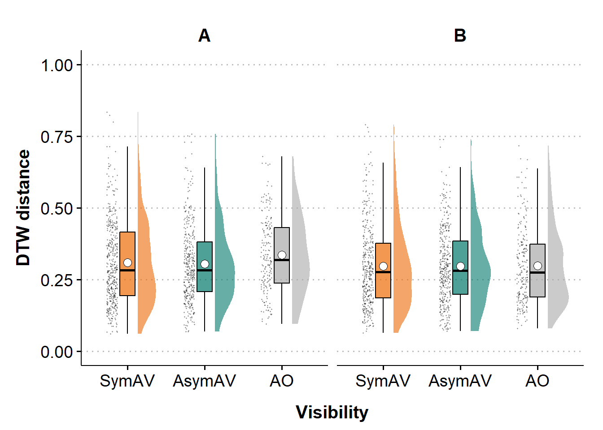<!-- -->

<br>

### bp: dtw distance by condition

``` r
bp_distance = df_all %>%
  ggplot(aes(x = condition, y = average_distance_xyz,
             fill = condition)) +
  geom_jitter(aes(x = stage(start = condition)),
              size = 0.15, alpha = 0.15, width = 0.07, height = 0) +
  geom_boxplot(width = .3,
               outlier.shape = NA, 
               alpha = 0.7, 
               color = "black") +
  geom_point(data = df_by_cond, 
             aes(y = mean_dis), 
             shape = 21, size = 3, fill = "white") +
  labs(x="Visibility", 
       y="DTW distance") +
  scale_y_continuous(limits = c(0, 0.9)) +
  scale_fill_manual(values = c("#ED6B06", "#00786A", "darkgrey")) +
  theme_clean(base_size = 15) +
  theme(axis.text.x = element_text(colour = "black", size = 14),
        axis.text.y = element_text(colour = "black", size = 14),
        axis.title = element_text(size = 15, face = 'bold'),
        axis.title.x = element_text(vjust = -2),
        axis.title.y = element_text(vjust = 2),
        legend.position = "none",
        strip.text = element_text(size = 15, face = 'bold'),
        plot.background = element_blank(),
        plot.margin = unit(c(1.1,1.1,1.1,1.1), "lines")) +
  facet_grid(~speaker)

bp_distance
```

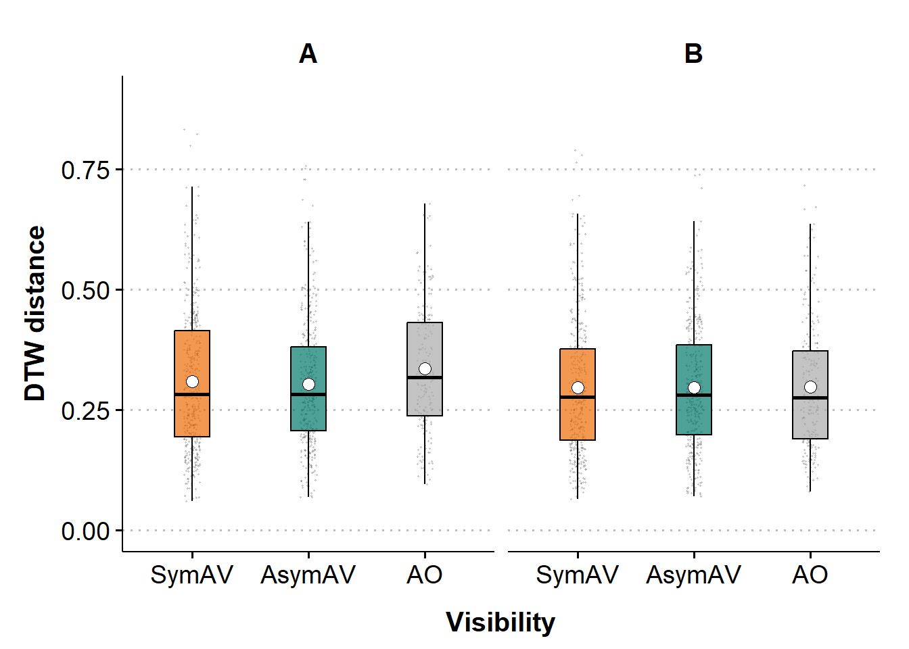<!-- -->

<br>

### bp: distance by condition x round

``` r
bp_distance_by_cond_round = 
  ggplot(df_all, 
         aes(x=round, y = average_distance_xyz, fill = condition)) +
  geom_jitter(aes(x = stage(start = round)), 
              size = 0.3, alpha = 0.2, width = 0.07, height = 0.02) +
  geom_boxplot(width = .5,
               outlier.shape = NA, alpha = 0.7) +
  geom_point(data = df_by_cond_round, 
             aes(y = mean_dis, group = round), 
             shape = 21, size = 2, fill = "white") +
  labs(x = "Round",
       y = "DTW distance") +
  scale_fill_manual(values = c("#ED6B06", "#00786A", "darkgrey")) +
  scale_y_continuous(limits = c(0, 0.9)) +
  theme_clean(base_size = 15) +
  theme(axis.text.x = element_text(colour = "black", size = 14),
        axis.text.y = element_text(colour = "black", size = 14),
        axis.title = element_text(size = 15, face = 'bold'),
        axis.title.x = element_text(vjust = -2),
        axis.title.y = element_text(vjust = 2),
        legend.position = "none",
        strip.text = element_text(size = 15, face = 'bold'),
        plot.background = element_blank(),
        plot.margin = unit(c(1.1,1.1,1.1,1.1), "lines")) +
  facet_grid(rows = vars(speaker),
             cols = vars(condition))

ggplotly(bp_distance_by_cond_round)
```

<div class="plotly html-widget html-fill-item" id="htmlwidget-f3a84b1b8d32c93d6135" style="width:672px;height:480px;"></div>
<script type="application/json" data-for="htmlwidget-f3a84b1b8d32c93d6135">{"x":{"data":[{"x":[0.95473823647946121,1.0143098431034014,1.9677186700748279,0.98788072339259092,2.0154113583220168,1.9674570888886229,1.9459197974391282,0.96812721769791099,1.9978559704124927,1.9462980213528498,1.044176800600253,2.0533987424662339,2.9870000474201515,3.0528856773814188,2.0643975407024846,3.0206314356578514,2.9479642762942238,5.9446214396134023,6.0592385545186698,3.9689071965590119,3.9732394460029901,6.0504246498830616,6.0179831175040457,3.9450660327356308,2.9483753932546826,3.9815851858025417,3.9476028468366713,4.0544549233512956,4.0254755876399573,4.0273211678117518,4.9787336513912308,5.02354081811849,5.0207507673185319,5.0162659704964607,5.9541392514528706,6.011760663990863,5.987721611545421,5.9537749166553837,6.0325970049481841,1.9654284641193227,1.9332219700608402,3.9500131751410663,1.9975852961326017,2.0696275869291276,3.0268229185882958,5.0136979515757414,5.0697962621692572,2.9383633971773087,5.958792571485974,4.0487638439005238,4.9965210076374937,4.954519872041419,5.9793128113541751,2.0407990657445043,1.9538889062730596,2.0669273491110651,1.9431243370240554,2.062351851449348,1.0646731107821688,1.9427874546265229,1.9873066880879924,1.9744681484904141,1.9397755990130827,1.9687514987494796,1.9698623502952979,2.0377525971410795,2.0260913600493224,3.0157025122642516,2.985600848896429,3.0117861937964334,3.0537700610840695,2.0147293041273953,4.0520847915858029,2.9708901724731551,2.962815851387568,5.9952178147714585,4.0154591640084982,4.0112854537600651,3.9725282822782173,3.987238458869979,4.9533293207734825,4.9490718938317153,4.9830190241755918,5.0475381085230033,3.9625164141738787,5.0123117989022283,4.9541413378110155,4.9463761970680205,4.948838157993741,5.0548034599656235,5.0551463751867409,5.9540148086939011,5.9631494964845482,6.001520136822946,0.96267699702642862,1.0266196801001206,1.0526350235799327,1.0326481301104651,1.0155933280242606,1.0041967509360985,2.0018085877830161,0.9663600939279422,1.0064915479160845,1.0645400373078884,1.0626937938341872,0.94767132662236686,1.010240332209505,0.95843953971285378,0.95170736141968515,0.96619174950756137,1.0197905900375916,0.94890808935742821,1.0668480152823032,2.0246502578211949,1.9688464568927884,2.9856680739205332,2.9578167445631696,2.9410295727849007,2.9939820031635462,3.0603159656282513,2.9691136717936022,1.9501106304861606,4.9953261416312307,3.9511434157099576,4.0301676798192787,3.9999807772506029,4.953658262421377,1.9738350388640538,2.0294910552864893,1.9921559125743806,1.991008819625713,1.9331764228409156,1.9870596512360499,1.9334382121870295,2.0282359661674128,1.0167018494894728,1.9958587767463178,2.9592678057076411,1.9995558812189846,0.93512012407183642,2.0123999365000054,1.9319105398841203,0.95601146184839303,1.9858731718314813,2.9353915206855161,1.9625756036583335,2.0569780796719717,2.0276333928760142,2.0481000466272237,2.9902002702793107,2.9322901241062209,1.945182362832129,2.9991551048122345,3.068755882466212,2.0005266827717425,2.0628853672510012,3.0682091654278336,2.0116441083606333,4.0057076857285576,3.950495389890857,4.0284011682728309,4.000251672402956,4.0264673117408529,4.0200796701060604,3.9652604198129846,4.0628389439731833,5.0286259768670423,5.0195899522118275,4.9840961618022996,4.0397707942593843,3.9415119108138605,5.057625097907148,4.9512014788947996,4.9604163841996343,5.9592090908577662,5.9874830029532315,5.9855002868641165,2.0597612274903803,1.947682161075063,2.0497092741634697,1.9706887273676694,0.94911468128673726,1.9400741840619593,1.0127153117349372,1.0597032006178051,1.0671327961282804,1.9472157134441659,1.9796964347129689,1.9928454464115202,0.98349949815310533,1.0543641714332626,1.9405615936173126,2.0040058518713342,1.948816684242338,2.0602764042606578,3.0106255738763137,3.0269904303038491,2.9694711882947011,4.0195066466880967,2.9516898340359332,2.0363614366995169,3.0249245985317974,2.0331065949751066,1.9335057443659753,2.9761355345882476,2.93266987554729,2.0569039611518383,1.9881563701061531,3.0458599371276796,2.0317000776715575,3.0064367211842908,2.992360504460521,2.0626583312219009,2.9873810146702455,3.0535951640596615,4.019978081583977,4.0345343419164417,4.0684436627151443,4.0399194341246041,3.9305418405029924,3.992726698680781,4.045896287760697,4.0475930321309717,4.0142756885476407,4.0033585351193324,5.0659791324194519,4.0060881775291639,3.9614630729472267,5.0287022955715655,5.0142073809029535,4.9892111947573721,4.9714071468310435,4.9318201680062339,6.0536655966890978,6.0416927976068111,5.9356841156119478,6.0512714945245536,6.0226267223758621,1.0459770911931991,1.9412038488499821,2.0484611447434871,3.029901976669207,3.0022279174765574,2.0006934784445911,1.977050711158663,2.0211884444532915,1.9854181516449898,1.9906891171028838,1.0155610147351399,2.0592012419365346,1.9589677921915427,2.0096191459475086,2.0453639936679973,3.0432154309144241,2.9421897841757163,2.0345214642630891,2.0420221500657498,2.0132388045685365,1.9314035022770986,2.0612031285231933,2.0033901937445626,1.9316828004596756,2.0663463754579423,2.0445902979699895,2.9831695188023151,3.0270731151290238,2.9300017840927466,5.0086337537085637,3.0534364451607687,2.9624202707968652,3.0459210138395427,2.9743878236040473,3.0337425017217172,3.0227595979580655,5.0647082265047354,3.0696222128113733,2.9985438582999633,2.9443167915567754,4.0571257716370743,4.018684933134355,3.9690435125818477,3.9967901019100101,4.0570561599452049,3.9691316042840481,3.9860704990476368,3.9637820068281142,2.9561416573962198,4.04709368405398,4.0459912554221225,5.9628358997032045,5.0576579808816318,4.9834558290010316,5.0674675580393522,5.0567920752009377,6.0044322343915697,6.0463671421818432,5.9358863720064985,5.9669056859053669,6.0255828983755784,5.9823545889277012,5.9462471206486223,6.0216014721104871,0.93699495247099551,6.0626223501004279,5.9827690474316482,4.0339820005511866,3.9526352645596488,6.0589377125352621,6.0156184179428962,4.0053049603896218,3.9562185865966604,1.9827862851321698,2.0234898273833095,2.0641419871570541,2.0572886642953381,2.0366624161740763,5.9419477912085128,0.96893406297545881,1.0668941544834525,1.9778654823219404,1.972831452288665,1.9422465443890542,1.019150055302307,1.9552929724659771,2.0520419972855599,2.0580531562352551,2.0494640151457859,1.0379277150705457,2.0503681753110139,2.0589049583813175,2.0046032490674408,1.9796340266056358,2.0527468130458146,2.0088124723546206,3.0344152457639577,3.0630801636911928,5.048377484669909,3.0246490095462648,2.9365275589609521,2.9866309995250777,3.030180779127404,2.9677004666766154,3.0378522217692807,3.9382077819341794,4.9439144097501408,5.0302480770042166,1.9872143632685766,1.9851388888619841,0.98600282106548542,2.0526165142329411,1.966197483194992,0.95024917153175914,1.9442092030355707,1.9593629174772651,1.0037082169717177,0.95721535686403514,1.032019949206151,1.9990688680997117,1.9641658112918958,2.0278963537979871,1.9904876113357022,1.9508124512992799,1.9333232009364292,3.0383785742754115,3.0394138301024212,3.0433874673536048,2.9402909755660223,3.02203433659859,3.0567571516009049,4.0674314751848577,3.9421025176160036,4.0412505084555592,3.9340693322662266,5.0010345373395833,5.9798482151981442,6.0602265958255153,5.9338843384431676,6.0388389409054071,1.9775056674564258,1.9880936823226512,1.9741991758672521,2.0329423385206611,2.064870650265366,3.0543971549998967,0.99582007174845788,3.0585542188771071,4.9509345964435489,5.9926565089263022,4.058358771814965,3.9449632724095136,1.0110040693823248,1.9679325288580731,1.99732098816894,1.955847219931893,2.0591348170535637,1.9708852756302804,2.0469032674795016,1.976174303474836,2.0310027041332797,1.9393219435354694,2.0332915360899642,2.0611651368625461,0.94146472628228361,2.0321766192000359,0.93600327012594786,2.0247192462394015,1.943130688574165,1.9946699190186337,4.0079846823308616,4.0614427504688502,1.973095777919516,2.0116056037321686,2.0063392192590981,1.9323609262797981,3.0142646028101443,2.9846799062052742,3.0146699147298932,2.9361605629371481,2.9528965913318097,2.9713552017416807,2.9595745201734824,4.0206449505034838,6.0412009675381704,6.0184532138984652,3.9799930721335115,3.9734020500211047,3.9968371619889513,4.997788908435032,3.9771272751176729,5.0198477003024893],"y":[0.16346419416445909,0.15990983525539798,0.38241453335359682,0.27282654124903016,0.27881798867077595,0.15029788882780756,0.49374487211604418,0.22019931483021671,0.39269986412619634,0.36993681298604209,0.16673112269726911,0.31397196256571136,0.28139501116431087,0.25451667461517924,0.19345729519012508,0.44886287747306985,0.33820437836465078,0.15416236758102153,0.14357055907939054,0.31049307886287902,0.37061054707483176,0.17394426144736094,0.14971702471488613,0.17280343667615658,0.29168060527255552,0.14319390057853967,0.20720385909118721,0.21371296306178936,0.27194782285908586,0.25133470976185079,0.1726639573190028,0.20909829835306137,0.31634709534936112,0.45566872087806487,0.20337503933404993,0.20820706773606551,0.25364390927333091,0.36405037679937097,0.41014821027334436,0.27671896739363405,0.32761879661423027,0.62769472894419454,0.42417185990120931,0.4918591259926563,0.42585272841705679,0.54703485614742664,0.30398602835114069,0.47212537781560432,0.3511574116545772,0.28555424290147396,0.24708163984376472,0.14815505275431451,0.12209635746262984,0.17243712222730689,0.31779215593022103,0.35388163912152826,0.10399755067365223,0.38483305066140061,0.51638615415953226,0.28518174921758943,0.36839565674631664,0.58996442650563941,0.358187802050139,0.35592617875408444,0.42368049289152115,0.20279983435128041,0.20461222763107542,0.35981856638000859,0.21794237837850203,0.42425129668197398,0.21232350178662907,0.29134771642024948,0.16837781857102319,0.32199121351549853,0.45846581411984227,0.43660722479046243,0.69476318288755601,0.12433583659098153,0.15922998032631841,0.21582796786678124,0.22077993791926781,0.60216381838516164,0.44904347393084615,0.37833241273162338,0.063236863216901446,0.24042912153577475,0.44193324998629008,0.33949662474883402,0.49161900844277628,0.31523114893096366,0.32116731468017284,0.15872621966351247,0.27612434972020766,0.24956265027186525,0.42914724976965701,0.41607911596607494,0.10069099288618066,0.24473398250888176,0.19723298016912152,0.088235209808573647,0.38084718709438048,0.28888045312178706,0.50542275162559513,0.43313397734698589,0.17416841169382152,0.17375506084409142,0.46676756432593519,0.50870434977977075,0.55299002484188053,0.41779699551394334,0.50262867748047613,0.59989821737994842,0.20043568316383778,0.16885737284959321,0.1828129863525344,0.19466679646927662,0.1520777558919964,0.21859353234452991,0.3697738014176804,0.49847682710689201,0.34398939034012715,0.15699568296784736,0.18288795633069277,0.33420988484302061,0.36981194941398032,0.46494389632798871,0.14192198135799383,0.13788889314154068,0.27634030680096289,0.21939350899520593,0.28995851372724313,0.33417278864283639,0.074201108097270568,0.5113382631300607,0.29107205361136645,0.29051360505725549,0.57980801919758274,0.70089478838577668,0.58584151023573205,0.30537984030725779,0.36789413604700943,0.11671639425727603,0.32370257851357337,0.32142925558775515,0.15726362262732632,0.69180818844320857,0.35958911434285129,0.3759974987386146,0.067254231253774166,0.53263257185183754,0.13138910178753982,0.16029758305335323,0.20986110320762172,0.26227539467682082,0.25403129997195423,0.26711122257823261,0.22304797167784876,0.07727196079259735,0.48947279056667903,0.22847049987700507,0.11338301190467197,0.17610969520211237,0.15726020176217287,0.10181668329311186,0.12206377552457964,0.37057910242476927,0.2044974230896493,0.22794564482421562,0.15587573601414489,0.19468097260857414,0.40624758822742441,0.42375803965462944,0.51026519301242379,0.12877213594302864,0.25825183179939454,0.46540835370419009,0.26606167590707841,0.81549242418425727,0.45904136430392828,0.43068966914820339,0.20763709644496217,0.17633621659508303,0.25234420890580495,0.14102122974790865,0.14649071774259562,0.28044220408696668,0.50126241313452446,0.31423862149808812,0.57710601486558288,0.304590198254509,0.83278307766652748,0.43934348499627818,0.18889604690468434,0.17713308074037321,0.29101359274838978,0.14457812912013362,0.36882644248918789,0.12329992944466052,0.37753398077456379,0.29366830942780697,0.25314784620620651,0.22205685325449007,0.58040497286338566,0.39229566895248352,0.30854844262305237,0.57894278059955639,0.20525275100675047,0.11275628270511268,0.32595922597316135,0.20946745778044923,0.47733620165540835,0.46186302964696191,0.23554715257238504,0.50465884634380942,0.54833628451137928,0.70673426009673357,0.36488221323593378,0.10501883140880239,0.24640816219425954,0.20495562020843941,0.34004606627906009,0.35942495116250439,0.37076274460399372,0.10521952992469258,0.43991464414686154,0.42609123547964273,0.31850361631834512,0.27508742617227655,0.39174697284257326,0.30112325789576899,0.087301897413508231,0.44371273909419917,0.36349740351952936,0.087110420931374846,0.21177212195177933,0.2718030363154727,0.55330172548314016,0.18997207863400545,0.19407502518417574,0.36876321311796983,0.44137640577758364,0.12509530453625936,0.37316480409172126,0.43917638772082002,0.29284913709533583,0.36555426218667181,0.42341204496736184,0.17558261602616632,0.43416234585378072,0.13149962193886477,0.18613075302833523,0.34408190774699915,0.21772745273469041,0.29640296012269429,0.15273349360853705,0.20501758467096265,0.20833047101220492,0.20969263327062154,0.24618214979406844,0.42329638365380273,0.22063860674272859,0.46749851705832152,0.14015974732283187,0.29258691649824098,0.042739394941536279,0.09038666904463713,0.24270563885309362,0.37398438932950828,0.17275429644993923,0.13021474255839771,0.40266861253799019,0.50382778891871305,0.16228796492499986,0.32272283323547857,0.39924208267329014,0.24311800026888036,0.49339591533016752,0.43535006898431639,0.44135512772202329,0.27121220946325686,0.32835640986379966,0.23640375345458015,0.35402640674074276,0.1775866556340196,0.45627674373154925,0.2682559266409531,0.15486736532636355,0.64087128677054661,0.4471856628098636,0.44576054128583875,0.32556586757440814,0.45392375726653678,0.44466231940771306,0.53336315514648114,0.46603765928502627,0.32403818489549996,0.10494951497527644,0.66540261679574286,0.45993781020929453,0.30235505384920824,0.27873093886697164,0.43979953668879546,0.52255663395722818,0.35393877465203388,0.44661915328386309,0.42314470143857341,0.43392247498835362,0.40101519547359155,0.38315919119820996,0.23708329209137166,0.64079645961403797,0.24181008044220267,0.21963864878194087,0.22781607872265361,0.23869724945057916,0.1672513018648161,0.35973228813883745,0.25069236747788087,0.067156122837597115,0.20970811683533405,0.2014551365311994,0.3416473727025871,0.2035981448032646,0.31002881737362992,0.22439280162509675,0.13249001280397388,0.2643976627043429,0.11398310668684367,0.11241040598462607,0.1852404474985008,0.10940413066292461,0.16467557471039695,0.20702680686945407,0.12412178395058782,0.1649290161407356,0.26794398851393314,0.099382327646196339,0.27055687595450473,0.13083710822119737,0.19131949819705943,0.1929145342447213,0.16055869722250565,0.192596945806978,0.15653661732170393,0.13447915094134347,0.14004176335036519,0.28914861390361224,0.1769380692364852,0.47117070591382004,0.29962965799752961,0.14156870801408167,0.27102704433891212,0.2392605251818935,0.24669791955442105,0.17870602693210011,0.27045323650173886,0.34939869455348471,0.2014341149268431,0.339984535129916,0.22812020899874635,0.26561666810942836,0.17015403493310971,0.29254352189850275,0.29080874429670361,0.15582068731433268,0.22716665855975449,0.15985561920847682,0.13340788503999004,0.31018539046145388,0.23970559550976239,0.25544425998560077,0.26342497127807624,0.22653540210334067,0.16047253107257428,0.17513499827932721,0.28516265998676399,0.33309156770501108,0.11536517072995307,0.24779801766994985,0.20657956944454184,0.23461031278794123,0.09351746599132231,0.23404519437337892,0.33856311854359039,0.36636300257819721,0.19293029645888848,0.44103207448587894,0.29571507347059234,0.29741832513237115,0.2253850382238167,0.24862118668591249,0.63881795697062171,0.26954688289166828,0.58721131528278625,0.40510786989611908,0.8087994042537664,0.45174103698597939,0.44823309369289965,0.4412326893827152,0.36589181908025953,0.3915273803826278,0.36282627714622517,0.42101367259047318,0.38785778233336954,0.20596340583095529,0.59961767433371671,0.44195791473814489,0.56857854908734407,0.21967192512745501,0.25108653514454604,0.63556326904773686,0.60608781041945636,0.60156650842784698,0.31738982381661823,0.31455419207514212,0.22499191241531338,0.3653202276202458,0.45639683201417858,0.56007196489849143,0.40927404655155297,0.61030487620438512,0.51571805732476383,0.40352622321022913,0.43266817722616957,0.49549348416726752,0.44451925053867375,0.44540153522253356,0.25846509125715444,0.29788773943104235,0.16470509942387451],"text":["round: 1<br />average_distance_xyz: 0.1539<br />condition: SymAV","round: 1<br />average_distance_xyz: 0.1423<br />condition: SymAV","round: 2<br />average_distance_xyz: 0.3860<br />condition: SymAV","round: 1<br />average_distance_xyz: 0.2590<br />condition: SymAV","round: 2<br />average_distance_xyz: 0.2815<br />condition: SymAV","round: 2<br />average_distance_xyz: 0.1679<br />condition: SymAV","round: 2<br />average_distance_xyz: 0.4929<br />condition: SymAV","round: 1<br />average_distance_xyz: 0.2023<br />condition: SymAV","round: 2<br />average_distance_xyz: 0.3802<br />condition: SymAV","round: 2<br />average_distance_xyz: 0.3637<br />condition: SymAV","round: 1<br />average_distance_xyz: 0.1579<br />condition: SymAV","round: 2<br />average_distance_xyz: 0.2952<br />condition: SymAV","round: 3<br />average_distance_xyz: 0.2899<br />condition: SymAV","round: 3<br />average_distance_xyz: 0.2688<br />condition: SymAV","round: 2<br />average_distance_xyz: 0.1816<br />condition: SymAV","round: 3<br />average_distance_xyz: 0.4372<br />condition: SymAV","round: 3<br />average_distance_xyz: 0.3309<br />condition: SymAV","round: 6<br />average_distance_xyz: 0.1352<br />condition: SymAV","round: 6<br />average_distance_xyz: 0.1352<br />condition: SymAV","round: 4<br />average_distance_xyz: 0.3292<br />condition: SymAV","round: 4<br />average_distance_xyz: 0.3670<br />condition: SymAV","round: 6<br />average_distance_xyz: 0.1626<br />condition: SymAV","round: 6<br />average_distance_xyz: 0.1387<br />condition: SymAV","round: 4<br />average_distance_xyz: 0.1609<br />condition: SymAV","round: 3<br />average_distance_xyz: 0.2931<br />condition: SymAV","round: 4<br />average_distance_xyz: 0.1494<br />condition: SymAV","round: 4<br />average_distance_xyz: 0.2176<br />condition: SymAV","round: 4<br />average_distance_xyz: 0.2176<br />condition: SymAV","round: 4<br />average_distance_xyz: 0.2786<br />condition: SymAV","round: 4<br />average_distance_xyz: 0.2624<br />condition: SymAV","round: 5<br />average_distance_xyz: 0.1837<br />condition: SymAV","round: 5<br />average_distance_xyz: 0.2189<br />condition: SymAV","round: 5<br />average_distance_xyz: 0.3032<br />condition: SymAV","round: 5<br />average_distance_xyz: 0.4414<br />condition: SymAV","round: 6<br />average_distance_xyz: 0.2145<br />condition: SymAV","round: 6<br />average_distance_xyz: 0.2145<br />condition: SymAV","round: 6<br />average_distance_xyz: 0.2390<br />condition: SymAV","round: 6<br />average_distance_xyz: 0.3763<br />condition: SymAV","round: 6<br />average_distance_xyz: 0.3948<br />condition: SymAV","round: 2<br />average_distance_xyz: 0.2775<br />condition: SymAV","round: 2<br />average_distance_xyz: 0.3327<br />condition: SymAV","round: 4<br />average_distance_xyz: 0.6377<br />condition: SymAV","round: 2<br />average_distance_xyz: 0.4125<br />condition: SymAV","round: 2<br />average_distance_xyz: 0.5030<br />condition: SymAV","round: 3<br />average_distance_xyz: 0.4321<br />condition: SymAV","round: 5<br />average_distance_xyz: 0.5589<br />condition: SymAV","round: 5<br />average_distance_xyz: 0.3108<br />condition: SymAV","round: 3<br />average_distance_xyz: 0.4792<br />condition: SymAV","round: 6<br />average_distance_xyz: 0.3698<br />condition: SymAV","round: 4<br />average_distance_xyz: 0.2791<br />condition: SymAV","round: 5<br />average_distance_xyz: 0.2410<br />condition: SymAV","round: 5<br />average_distance_xyz: 0.1549<br />condition: SymAV","round: 6<br />average_distance_xyz: 0.1407<br />condition: SymAV","round: 2<br />average_distance_xyz: 0.1886<br />condition: SymAV","round: 2<br />average_distance_xyz: 0.3027<br />condition: SymAV","round: 2<br />average_distance_xyz: 0.3497<br />condition: SymAV","round: 2<br />average_distance_xyz: 0.0970<br />condition: SymAV","round: 2<br />average_distance_xyz: 0.3835<br />condition: SymAV","round: 1<br />average_distance_xyz: 0.4995<br />condition: SymAV","round: 2<br />average_distance_xyz: 0.2753<br />condition: SymAV","round: 2<br />average_distance_xyz: 0.3668<br />condition: SymAV","round: 2<br />average_distance_xyz: 0.5962<br />condition: SymAV","round: 2<br />average_distance_xyz: 0.3647<br />condition: SymAV","round: 2<br />average_distance_xyz: 0.3368<br />condition: SymAV","round: 2<br />average_distance_xyz: 0.4192<br />condition: SymAV","round: 2<br />average_distance_xyz: 0.2048<br />condition: SymAV","round: 2<br />average_distance_xyz: 0.2191<br />condition: SymAV","round: 3<br />average_distance_xyz: 0.3552<br />condition: SymAV","round: 3<br />average_distance_xyz: 0.2198<br />condition: SymAV","round: 3<br />average_distance_xyz: 0.4429<br />condition: SymAV","round: 3<br />average_distance_xyz: 0.2196<br />condition: SymAV","round: 2<br />average_distance_xyz: 0.2759<br />condition: SymAV","round: 4<br />average_distance_xyz: 0.1660<br />condition: SymAV","round: 3<br />average_distance_xyz: 0.3316<br />condition: SymAV","round: 3<br />average_distance_xyz: 0.4694<br />condition: SymAV","round: 6<br />average_distance_xyz: 0.4305<br />condition: SymAV","round: 4<br />average_distance_xyz: 0.7132<br />condition: SymAV","round: 4<br />average_distance_xyz: 0.1338<br />condition: SymAV","round: 4<br />average_distance_xyz: 0.1745<br />condition: SymAV","round: 4<br />average_distance_xyz: 0.2159<br />condition: SymAV","round: 5<br />average_distance_xyz: 0.2206<br />condition: SymAV","round: 5<br />average_distance_xyz: 0.6193<br />condition: SymAV","round: 5<br />average_distance_xyz: 0.4463<br />condition: SymAV","round: 5<br />average_distance_xyz: 0.3686<br />condition: SymAV","round: 4<br />average_distance_xyz: 0.0669<br />condition: SymAV","round: 5<br />average_distance_xyz: 0.2581<br />condition: SymAV","round: 5<br />average_distance_xyz: 0.4390<br />condition: SymAV","round: 5<br />average_distance_xyz: 0.3586<br />condition: SymAV","round: 5<br />average_distance_xyz: 0.4745<br />condition: SymAV","round: 5<br />average_distance_xyz: 0.3040<br />condition: SymAV","round: 5<br />average_distance_xyz: 0.3374<br />condition: SymAV","round: 6<br />average_distance_xyz: 0.1753<br />condition: SymAV","round: 6<br />average_distance_xyz: 0.2743<br />condition: SymAV","round: 6<br />average_distance_xyz: 0.2407<br />condition: SymAV","round: 1<br />average_distance_xyz: 0.4414<br />condition: SymAV","round: 1<br />average_distance_xyz: 0.4063<br />condition: SymAV","round: 1<br />average_distance_xyz: 0.1163<br />condition: SymAV","round: 1<br />average_distance_xyz: 0.2446<br />condition: SymAV","round: 1<br />average_distance_xyz: 0.1815<br />condition: SymAV","round: 1<br />average_distance_xyz: 0.0875<br />condition: SymAV","round: 2<br />average_distance_xyz: 0.3618<br />condition: SymAV","round: 1<br />average_distance_xyz: 0.2820<br />condition: SymAV","round: 1<br />average_distance_xyz: 0.4891<br />condition: SymAV","round: 1<br />average_distance_xyz: 0.4352<br />condition: SymAV","round: 1<br />average_distance_xyz: 0.1575<br />condition: SymAV","round: 1<br />average_distance_xyz: 0.1671<br />condition: SymAV","round: 1<br />average_distance_xyz: 0.4686<br />condition: SymAV","round: 1<br />average_distance_xyz: 0.5135<br />condition: SymAV","round: 1<br />average_distance_xyz: 0.5475<br />condition: SymAV","round: 1<br />average_distance_xyz: 0.4309<br />condition: SymAV","round: 1<br />average_distance_xyz: 0.4992<br />condition: SymAV","round: 1<br />average_distance_xyz: 0.6115<br />condition: SymAV","round: 1<br />average_distance_xyz: 0.1990<br />condition: SymAV","round: 2<br />average_distance_xyz: 0.1674<br />condition: SymAV","round: 2<br />average_distance_xyz: 0.2025<br />condition: SymAV","round: 3<br />average_distance_xyz: 0.2132<br />condition: SymAV","round: 3<br />average_distance_xyz: 0.1710<br />condition: SymAV","round: 3<br />average_distance_xyz: 0.2033<br />condition: SymAV","round: 3<br />average_distance_xyz: 0.3729<br />condition: SymAV","round: 3<br />average_distance_xyz: 0.4970<br />condition: SymAV","round: 3<br />average_distance_xyz: 0.3528<br />condition: SymAV","round: 2<br />average_distance_xyz: 0.1726<br />condition: SymAV","round: 5<br />average_distance_xyz: 0.1787<br />condition: SymAV","round: 4<br />average_distance_xyz: 0.3419<br />condition: SymAV","round: 4<br />average_distance_xyz: 0.3880<br />condition: SymAV","round: 4<br />average_distance_xyz: 0.4509<br />condition: SymAV","round: 5<br />average_distance_xyz: 0.1465<br />condition: SymAV","round: 2<br />average_distance_xyz: 0.1328<br />condition: SymAV","round: 2<br />average_distance_xyz: 0.2822<br />condition: SymAV","round: 2<br />average_distance_xyz: 0.2342<br />condition: SymAV","round: 2<br />average_distance_xyz: 0.2966<br />condition: SymAV","round: 2<br />average_distance_xyz: 0.3442<br />condition: SymAV","round: 2<br />average_distance_xyz: 0.0864<br />condition: SymAV","round: 2<br />average_distance_xyz: 0.4944<br />condition: SymAV","round: 2<br />average_distance_xyz: 0.2741<br />condition: SymAV","round: 1<br />average_distance_xyz: 0.2970<br />condition: SymAV","round: 2<br />average_distance_xyz: 0.5739<br />condition: SymAV","round: 3<br />average_distance_xyz: 0.7136<br />condition: SymAV","round: 2<br />average_distance_xyz: 0.5664<br />condition: SymAV","round: 1<br />average_distance_xyz: 0.2926<br />condition: SymAV","round: 2<br />average_distance_xyz: 0.3568<br />condition: SymAV","round: 2<br />average_distance_xyz: 0.1152<br />condition: SymAV","round: 1<br />average_distance_xyz: 0.3425<br />condition: SymAV","round: 2<br />average_distance_xyz: 0.3410<br />condition: SymAV","round: 3<br />average_distance_xyz: 0.1611<br />condition: SymAV","round: 2<br />average_distance_xyz: 0.6749<br />condition: SymAV","round: 2<br />average_distance_xyz: 0.3685<br />condition: SymAV","round: 2<br />average_distance_xyz: 0.3685<br />condition: SymAV","round: 2<br />average_distance_xyz: 0.0687<br />condition: SymAV","round: 3<br />average_distance_xyz: 0.5452<br />condition: SymAV","round: 3<br />average_distance_xyz: 0.1274<br />condition: SymAV","round: 2<br />average_distance_xyz: 0.1502<br />condition: SymAV","round: 3<br />average_distance_xyz: 0.1998<br />condition: SymAV","round: 3<br />average_distance_xyz: 0.2655<br />condition: SymAV","round: 2<br />average_distance_xyz: 0.2422<br />condition: SymAV","round: 2<br />average_distance_xyz: 0.2809<br />condition: SymAV","round: 3<br />average_distance_xyz: 0.2384<br />condition: SymAV","round: 2<br />average_distance_xyz: 0.0715<br />condition: SymAV","round: 4<br />average_distance_xyz: 0.4896<br />condition: SymAV","round: 4<br />average_distance_xyz: 0.2330<br />condition: SymAV","round: 4<br />average_distance_xyz: 0.1150<br />condition: SymAV","round: 4<br />average_distance_xyz: 0.1751<br />condition: SymAV","round: 4<br />average_distance_xyz: 0.1630<br />condition: SymAV","round: 4<br />average_distance_xyz: 0.1154<br />condition: SymAV","round: 4<br />average_distance_xyz: 0.1287<br />condition: SymAV","round: 4<br />average_distance_xyz: 0.3735<br />condition: SymAV","round: 5<br />average_distance_xyz: 0.1956<br />condition: SymAV","round: 5<br />average_distance_xyz: 0.2289<br />condition: SymAV","round: 5<br />average_distance_xyz: 0.1461<br />condition: SymAV","round: 4<br />average_distance_xyz: 0.1833<br />condition: SymAV","round: 4<br />average_distance_xyz: 0.4036<br />condition: SymAV","round: 5<br />average_distance_xyz: 0.4321<br />condition: SymAV","round: 5<br />average_distance_xyz: 0.5156<br />condition: SymAV","round: 5<br />average_distance_xyz: 0.1316<br />condition: SymAV","round: 6<br />average_distance_xyz: 0.2398<br />condition: SymAV","round: 6<br />average_distance_xyz: 0.4517<br />condition: SymAV","round: 6<br />average_distance_xyz: 0.2623<br />condition: SymAV","round: 2<br />average_distance_xyz: 0.8230<br />condition: SymAV","round: 2<br />average_distance_xyz: 0.4486<br />condition: SymAV","round: 2<br />average_distance_xyz: 0.4486<br />condition: SymAV","round: 2<br />average_distance_xyz: 0.2239<br />condition: SymAV","round: 1<br />average_distance_xyz: 0.1883<br />condition: SymAV","round: 2<br />average_distance_xyz: 0.2475<br />condition: SymAV","round: 1<br />average_distance_xyz: 0.1246<br />condition: SymAV","round: 1<br />average_distance_xyz: 0.1665<br />condition: SymAV","round: 1<br />average_distance_xyz: 0.2774<br />condition: SymAV","round: 2<br />average_distance_xyz: 0.4897<br />condition: SymAV","round: 2<br />average_distance_xyz: 0.3335<br />condition: SymAV","round: 2<br />average_distance_xyz: 0.5651<br />condition: SymAV","round: 1<br />average_distance_xyz: 0.2872<br />condition: SymAV","round: 1<br />average_distance_xyz: 0.8338<br />condition: SymAV","round: 2<br />average_distance_xyz: 0.4366<br />condition: SymAV","round: 2<br />average_distance_xyz: 0.1768<br />condition: SymAV","round: 2<br />average_distance_xyz: 0.1960<br />condition: SymAV","round: 2<br />average_distance_xyz: 0.3001<br />condition: SymAV","round: 3<br />average_distance_xyz: 0.1421<br />condition: SymAV","round: 3<br />average_distance_xyz: 0.3745<br />condition: SymAV","round: 3<br />average_distance_xyz: 0.1118<br />condition: SymAV","round: 4<br />average_distance_xyz: 0.3782<br />condition: SymAV","round: 3<br />average_distance_xyz: 0.3075<br />condition: SymAV","round: 2<br />average_distance_xyz: 0.2362<br />condition: SymAV","round: 3<br />average_distance_xyz: 0.2071<br />condition: SymAV","round: 2<br />average_distance_xyz: 0.5610<br />condition: SymAV","round: 2<br />average_distance_xyz: 0.3982<br />condition: SymAV","round: 3<br />average_distance_xyz: 0.2926<br />condition: SymAV","round: 3<br />average_distance_xyz: 0.5811<br />condition: SymAV","round: 2<br />average_distance_xyz: 0.1924<br />condition: SymAV","round: 2<br />average_distance_xyz: 0.1245<br />condition: SymAV","round: 3<br />average_distance_xyz: 0.3300<br />condition: SymAV","round: 2<br />average_distance_xyz: 0.2094<br />condition: SymAV","round: 3<br />average_distance_xyz: 0.4744<br />condition: SymAV","round: 3<br />average_distance_xyz: 0.4540<br />condition: SymAV","round: 2<br />average_distance_xyz: 0.2462<br />condition: SymAV","round: 3<br />average_distance_xyz: 0.4931<br />condition: SymAV","round: 3<br />average_distance_xyz: 0.5639<br />condition: SymAV","round: 4<br />average_distance_xyz: 0.6962<br />condition: SymAV","round: 4<br />average_distance_xyz: 0.3668<br />condition: SymAV","round: 4<br />average_distance_xyz: 0.0996<br />condition: SymAV","round: 4<br />average_distance_xyz: 0.2616<br />condition: SymAV","round: 4<br />average_distance_xyz: 0.1952<br />condition: SymAV","round: 4<br />average_distance_xyz: 0.3539<br />condition: SymAV","round: 4<br />average_distance_xyz: 0.3605<br />condition: SymAV","round: 4<br />average_distance_xyz: 0.3605<br />condition: SymAV","round: 4<br />average_distance_xyz: 0.0878<br />condition: SymAV","round: 4<br />average_distance_xyz: 0.4230<br />condition: SymAV","round: 5<br />average_distance_xyz: 0.4275<br />condition: SymAV","round: 4<br />average_distance_xyz: 0.3196<br />condition: SymAV","round: 4<br />average_distance_xyz: 0.2632<br />condition: SymAV","round: 5<br />average_distance_xyz: 0.3759<br />condition: SymAV","round: 5<br />average_distance_xyz: 0.2981<br />condition: SymAV","round: 5<br />average_distance_xyz: 0.0939<br />condition: SymAV","round: 5<br />average_distance_xyz: 0.4464<br />condition: SymAV","round: 5<br />average_distance_xyz: 0.3451<br />condition: SymAV","round: 6<br />average_distance_xyz: 0.0972<br />condition: SymAV","round: 6<br />average_distance_xyz: 0.2201<br />condition: SymAV","round: 6<br />average_distance_xyz: 0.2917<br />condition: SymAV","round: 6<br />average_distance_xyz: 0.5722<br />condition: SymAV","round: 6<br />average_distance_xyz: 0.1983<br />condition: SymAV","round: 1<br />average_distance_xyz: 0.1912<br />condition: SymAV","round: 2<br />average_distance_xyz: 0.3642<br />condition: SymAV","round: 2<br />average_distance_xyz: 0.4366<br />condition: SymAV","round: 3<br />average_distance_xyz: 0.1411<br />condition: SymAV","round: 3<br />average_distance_xyz: 0.3898<br />condition: SymAV","round: 2<br />average_distance_xyz: 0.4245<br />condition: SymAV","round: 2<br />average_distance_xyz: 0.3040<br />condition: SymAV","round: 2<br />average_distance_xyz: 0.3752<br />condition: SymAV","round: 2<br />average_distance_xyz: 0.4277<br />condition: SymAV","round: 2<br />average_distance_xyz: 0.1845<br />condition: SymAV","round: 1<br />average_distance_xyz: 0.4268<br />condition: SymAV","round: 2<br />average_distance_xyz: 0.1445<br />condition: SymAV","round: 2<br />average_distance_xyz: 0.1697<br />condition: SymAV","round: 2<br />average_distance_xyz: 0.3291<br />condition: SymAV","round: 2<br />average_distance_xyz: 0.2119<br />condition: SymAV","round: 3<br />average_distance_xyz: 0.2825<br />condition: SymAV","round: 3<br />average_distance_xyz: 0.1380<br />condition: SymAV","round: 2<br />average_distance_xyz: 0.1934<br />condition: SymAV","round: 2<br />average_distance_xyz: 0.2197<br />condition: SymAV","round: 2<br />average_distance_xyz: 0.1898<br />condition: SymAV","round: 2<br />average_distance_xyz: 0.2433<br />condition: SymAV","round: 2<br />average_distance_xyz: 0.4216<br />condition: SymAV","round: 2<br />average_distance_xyz: 0.2016<br />condition: SymAV","round: 2<br />average_distance_xyz: 0.4481<br />condition: SymAV","round: 2<br />average_distance_xyz: 0.1527<br />condition: SymAV","round: 2<br />average_distance_xyz: 0.3072<br />condition: SymAV","round: 3<br />average_distance_xyz: 0.0615<br />condition: SymAV","round: 3<br />average_distance_xyz: 0.1070<br />condition: SymAV","round: 3<br />average_distance_xyz: 0.2254<br />condition: SymAV","round: 5<br />average_distance_xyz: 0.3606<br />condition: SymAV","round: 3<br />average_distance_xyz: 0.1840<br />condition: SymAV","round: 3<br />average_distance_xyz: 0.1309<br />condition: SymAV","round: 3<br />average_distance_xyz: 0.3875<br />condition: SymAV","round: 3<br />average_distance_xyz: 0.4887<br />condition: SymAV","round: 3<br />average_distance_xyz: 0.1523<br />condition: SymAV","round: 3<br />average_distance_xyz: 0.3132<br />condition: SymAV","round: 5<br />average_distance_xyz: 0.3799<br />condition: SymAV","round: 3<br />average_distance_xyz: 0.2399<br />condition: SymAV","round: 3<br />average_distance_xyz: 0.4857<br />condition: SymAV","round: 3<br />average_distance_xyz: 0.4325<br />condition: SymAV","round: 4<br />average_distance_xyz: 0.4599<br />condition: SymAV","round: 4<br />average_distance_xyz: 0.2821<br />condition: SymAV","round: 4<br />average_distance_xyz: 0.3464<br />condition: SymAV","round: 4<br />average_distance_xyz: 0.2563<br />condition: SymAV","round: 4<br />average_distance_xyz: 0.3412<br />condition: SymAV","round: 4<br />average_distance_xyz: 0.1704<br />condition: SymAV","round: 4<br />average_distance_xyz: 0.4553<br />condition: SymAV","round: 4<br />average_distance_xyz: 0.2743<br />condition: SymAV","round: 3<br />average_distance_xyz: 0.1522<br />condition: SymAV","round: 4<br />average_distance_xyz: 0.6361<br />condition: SymAV","round: 4<br />average_distance_xyz: 0.4535<br />condition: SymAV","round: 6<br />average_distance_xyz: 0.4646<br />condition: SymAV","round: 5<br />average_distance_xyz: 0.3190<br />condition: SymAV","round: 5<br />average_distance_xyz: 0.4729<br />condition: SymAV","round: 5<br />average_distance_xyz: 0.4436<br />condition: SymAV","round: 5<br />average_distance_xyz: 0.5220<br />condition: SymAV","round: 6<br />average_distance_xyz: 0.4475<br />condition: SymAV","round: 6<br />average_distance_xyz: 0.3367<br />condition: SymAV","round: 6<br />average_distance_xyz: 0.1224<br />condition: SymAV","round: 6<br />average_distance_xyz: 0.6496<br />condition: SymAV","round: 6<br />average_distance_xyz: 0.4780<br />condition: SymAV","round: 6<br />average_distance_xyz: 0.2839<br />condition: SymAV","round: 6<br />average_distance_xyz: 0.2950<br />condition: SymAV","round: 6<br />average_distance_xyz: 0.4585<br />condition: SymAV","round: 1<br />average_distance_xyz: 0.5050<br />condition: SymAV","round: 6<br />average_distance_xyz: 0.3357<br />condition: SymAV","round: 6<br />average_distance_xyz: 0.4379<br />condition: SymAV","round: 4<br />average_distance_xyz: 0.4315<br />condition: SymAV","round: 4<br />average_distance_xyz: 0.4315<br />condition: SymAV","round: 6<br />average_distance_xyz: 0.3903<br />condition: SymAV","round: 6<br />average_distance_xyz: 0.3903<br />condition: SymAV","round: 4<br />average_distance_xyz: 0.2183<br />condition: SymAV","round: 4<br />average_distance_xyz: 0.6546<br />condition: SymAV","round: 2<br />average_distance_xyz: 0.2292<br />condition: SymAV","round: 2<br />average_distance_xyz: 0.2082<br />condition: SymAV","round: 2<br />average_distance_xyz: 0.2360<br />condition: SymAV","round: 2<br />average_distance_xyz: 0.2277<br />condition: SymAV","round: 2<br />average_distance_xyz: 0.1500<br />condition: SymAV","round: 6<br />average_distance_xyz: 0.3724<br />condition: SymAV","round: 1<br />average_distance_xyz: 0.2493<br />condition: SymAV","round: 1<br />average_distance_xyz: 0.0677<br />condition: SymAV","round: 2<br />average_distance_xyz: 0.2180<br />condition: SymAV","round: 2<br />average_distance_xyz: 0.2185<br />condition: SymAV","round: 2<br />average_distance_xyz: 0.3460<br />condition: SymAV","round: 1<br />average_distance_xyz: 0.1901<br />condition: SymAV","round: 2<br />average_distance_xyz: 0.3223<br />condition: SymAV","round: 2<br />average_distance_xyz: 0.2215<br />condition: SymAV","round: 2<br />average_distance_xyz: 0.1488<br />condition: SymAV","round: 2<br />average_distance_xyz: 0.2585<br />condition: SymAV","round: 1<br />average_distance_xyz: 0.1011<br />condition: SymAV","round: 2<br />average_distance_xyz: 0.1076<br />condition: SymAV","round: 2<br />average_distance_xyz: 0.1893<br />condition: SymAV","round: 2<br />average_distance_xyz: 0.0976<br />condition: SymAV","round: 2<br />average_distance_xyz: 0.1648<br />condition: SymAV","round: 2<br />average_distance_xyz: 0.2127<br />condition: SymAV","round: 2<br />average_distance_xyz: 0.1412<br />condition: SymAV","round: 3<br />average_distance_xyz: 0.1518<br />condition: SymAV","round: 3<br />average_distance_xyz: 0.2482<br />condition: SymAV","round: 5<br />average_distance_xyz: 0.1166<br />condition: SymAV","round: 3<br />average_distance_xyz: 0.2534<br />condition: SymAV","round: 3<br />average_distance_xyz: 0.1446<br />condition: SymAV","round: 3<br />average_distance_xyz: 0.1939<br />condition: SymAV","round: 3<br />average_distance_xyz: 0.1911<br />condition: SymAV","round: 3<br />average_distance_xyz: 0.1756<br />condition: SymAV","round: 3<br />average_distance_xyz: 0.1969<br />condition: SymAV","round: 4<br />average_distance_xyz: 0.1468<br />condition: SymAV","round: 5<br />average_distance_xyz: 0.1347<br />condition: SymAV","round: 5<br />average_distance_xyz: 0.1470<br />condition: SymAV","round: 2<br />average_distance_xyz: 0.2856<br />condition: SymAV","round: 2<br />average_distance_xyz: 0.1907<br />condition: SymAV","round: 1<br />average_distance_xyz: 0.4883<br />condition: SymAV","round: 2<br />average_distance_xyz: 0.3137<br />condition: SymAV","round: 2<br />average_distance_xyz: 0.1229<br />condition: SymAV","round: 1<br />average_distance_xyz: 0.2564<br />condition: SymAV","round: 2<br />average_distance_xyz: 0.2255<br />condition: SymAV","round: 2<br />average_distance_xyz: 0.2513<br />condition: SymAV","round: 1<br />average_distance_xyz: 0.1757<br />condition: SymAV","round: 1<br />average_distance_xyz: 0.2757<br />condition: SymAV","round: 1<br />average_distance_xyz: 0.3336<br />condition: SymAV","round: 2<br />average_distance_xyz: 0.2188<br />condition: SymAV","round: 2<br />average_distance_xyz: 0.3298<br />condition: SymAV","round: 2<br />average_distance_xyz: 0.2326<br />condition: SymAV","round: 2<br />average_distance_xyz: 0.2513<br />condition: SymAV","round: 2<br />average_distance_xyz: 0.1602<br />condition: SymAV","round: 2<br />average_distance_xyz: 0.2880<br />condition: SymAV","round: 3<br />average_distance_xyz: 0.2838<br />condition: SymAV","round: 3<br />average_distance_xyz: 0.1563<br />condition: SymAV","round: 3<br />average_distance_xyz: 0.2339<br />condition: SymAV","round: 3<br />average_distance_xyz: 0.1712<br />condition: SymAV","round: 3<br />average_distance_xyz: 0.1370<br />condition: SymAV","round: 3<br />average_distance_xyz: 0.3264<br />condition: SymAV","round: 4<br />average_distance_xyz: 0.2426<br />condition: SymAV","round: 4<br />average_distance_xyz: 0.2574<br />condition: SymAV","round: 4<br />average_distance_xyz: 0.2574<br />condition: SymAV","round: 4<br />average_distance_xyz: 0.2319<br />condition: SymAV","round: 5<br />average_distance_xyz: 0.1573<br />condition: SymAV","round: 6<br />average_distance_xyz: 0.1847<br />condition: SymAV","round: 6<br />average_distance_xyz: 0.3042<br />condition: SymAV","round: 6<br />average_distance_xyz: 0.3425<br />condition: SymAV","round: 6<br />average_distance_xyz: 0.1303<br />condition: SymAV","round: 2<br />average_distance_xyz: 0.2386<br />condition: SymAV","round: 2<br />average_distance_xyz: 0.1945<br />condition: SymAV","round: 2<br />average_distance_xyz: 0.2535<br />condition: SymAV","round: 2<br />average_distance_xyz: 0.1131<br />condition: SymAV","round: 2<br />average_distance_xyz: 0.2462<br />condition: SymAV","round: 3<br />average_distance_xyz: 0.3541<br />condition: SymAV","round: 1<br />average_distance_xyz: 0.3660<br />condition: SymAV","round: 3<br />average_distance_xyz: 0.2055<br />condition: SymAV","round: 5<br />average_distance_xyz: 0.4386<br />condition: SymAV","round: 6<br />average_distance_xyz: 0.2858<br />condition: SymAV","round: 4<br />average_distance_xyz: 0.2780<br />condition: SymAV","round: 4<br />average_distance_xyz: 0.2325<br />condition: SymAV","round: 1<br />average_distance_xyz: 0.2624<br />condition: SymAV","round: 2<br />average_distance_xyz: 0.6447<br />condition: SymAV","round: 2<br />average_distance_xyz: 0.2744<br />condition: SymAV","round: 2<br />average_distance_xyz: 0.5745<br />condition: SymAV","round: 2<br />average_distance_xyz: 0.4237<br />condition: SymAV","round: 2<br />average_distance_xyz: 0.7996<br />condition: SymAV","round: 2<br />average_distance_xyz: 0.4514<br />condition: SymAV","round: 2<br />average_distance_xyz: 0.4514<br />condition: SymAV","round: 2<br />average_distance_xyz: 0.4507<br />condition: SymAV","round: 2<br />average_distance_xyz: 0.3495<br />condition: SymAV","round: 2<br />average_distance_xyz: 0.3937<br />condition: SymAV","round: 2<br />average_distance_xyz: 0.3585<br />condition: SymAV","round: 1<br />average_distance_xyz: 0.4041<br />condition: SymAV","round: 2<br />average_distance_xyz: 0.3732<br />condition: SymAV","round: 1<br />average_distance_xyz: 0.2033<br />condition: SymAV","round: 2<br />average_distance_xyz: 0.5875<br />condition: SymAV","round: 2<br />average_distance_xyz: 0.4368<br />condition: SymAV","round: 2<br />average_distance_xyz: 0.5587<br />condition: SymAV","round: 4<br />average_distance_xyz: 0.2385<br />condition: SymAV","round: 4<br />average_distance_xyz: 0.2385<br />condition: SymAV","round: 2<br />average_distance_xyz: 0.6451<br />condition: SymAV","round: 2<br />average_distance_xyz: 0.5919<br />condition: SymAV","round: 2<br />average_distance_xyz: 0.6085<br />condition: SymAV","round: 2<br />average_distance_xyz: 0.3359<br />condition: SymAV","round: 3<br />average_distance_xyz: 0.2962<br />condition: SymAV","round: 3<br />average_distance_xyz: 0.2224<br />condition: SymAV","round: 3<br />average_distance_xyz: 0.3745<br />condition: SymAV","round: 3<br />average_distance_xyz: 0.4413<br />condition: SymAV","round: 3<br />average_distance_xyz: 0.5458<br />condition: SymAV","round: 3<br />average_distance_xyz: 0.3940<br />condition: SymAV","round: 3<br />average_distance_xyz: 0.6143<br />condition: SymAV","round: 4<br />average_distance_xyz: 0.5147<br />condition: SymAV","round: 6<br />average_distance_xyz: 0.4164<br />condition: SymAV","round: 6<br />average_distance_xyz: 0.4164<br />condition: SymAV","round: 4<br />average_distance_xyz: 0.5044<br />condition: SymAV","round: 4<br />average_distance_xyz: 0.4554<br />condition: SymAV","round: 4<br />average_distance_xyz: 0.4624<br />condition: SymAV","round: 5<br />average_distance_xyz: 0.2424<br />condition: SymAV","round: 4<br />average_distance_xyz: 0.2878<br />condition: SymAV","round: 5<br />average_distance_xyz: 0.1753<br />condition: SymAV"],"type":"scatter","mode":"markers","marker":{"autocolorscale":false,"color":"rgba(237,107,6,1)","opacity":0.20000000000000001,"size":1.1338582677165354,"symbol":"circle","line":{"width":1.8897637795275593,"color":"rgba(0,0,0,1)"}},"hoveron":"points","name":"SymAV","legendgroup":"SymAV","showlegend":true,"xaxis":"x","yaxis":"y","hoverinfo":"text","frame":null},{"x":[2.0083617978729307,2.0388069567084313,2.9688128945464269,4.0056306777428832,1.9739179641520606,2.0050757823279128,0.99939259659033275,2.0032421489898113,2.0670523818628861,2.0532539414009081,0.98045681502204385,2.0325728327454997,3.0019188035326079,2.9724338829005137,2.960837121172808,2.9910018396843223,2.9326353615522383,2.9872503247344868,3.014316894724034,2.9419522929517554,2.9855878466600552,3.9925389980943873,4.0574271182762462,3.0616161923622713,4.9753576468117533,5.0674078939855098,4.9604245524061845,4.9897304605366664,4.9486007571266963,4.973133464478888,5.0560880789766092,5.008600296583027,4.0228775434615089,2.0615929558686914,1.9988309418130665,1.9811344714881853,1.9484425574541091,1.9407906198780984,1.9692632073396816,3.0115889955963939,2.9390818971861155,5.0169149032747375,3.9394236267823728,3.9366806099191307,6.0181602175813165,4.9857436463003975,4.931641411157325,6.0653417798969897,2.006718151946552,1.9455181573936715,1.9786901713302358,1.0213727661082521,1.0381288189906628,1.9425341125763953,2.0661692358739674,2.0486449551908299,1.9337303067930043,2.0177388645056635,1.9567077956628054,1.936790121360682,1.9541324667306617,2.0669376365002243,3.01701770036947,3.0392830567527565,3.0003115068702026,2.9835735470801592,2.9664250389393421,3.9687208786420523,4.0118172981217501,3.9717743517970665,4.0558592799771578,6.0215563000086698,3.9432728536427022,4.0098183375084773,3.9418572768848388,4.978948659878224,4.9959638261795041,4.985799725642428,6.0133179955603557,6.0460700396122409,5.9533412427036092,6.0055628265440468,5.9359224504930896,5.9523609469924121,1.06423048843164,0.9931214596703648,0.97375053275376555,2.0324911943916231,1.9687895869277419,2.0321258936356754,0.95725835163146256,1.9635015891259535,2.0685248196544124,0.93110004496295007,1.9857207914115862,2.0168425795063376,2.068324295883067,0.93100176014006142,0.98491340904496605,1.9854529901361093,2.0640824396023527,2.9317328008869663,2.9523591785458847,3.0690825496753678,3.0126355738751589,2.9750370730226861,4.0436876636045049,4.0065080306865273,4.0261296576261518,5.9324194299383093,5.9853804490482432,6.0297240303922441,2.0049579347111286,2.0135272209113464,1.9789806182915344,1.9368439601641148,1.0162399188568816,1.9806702972855419,1.9881497251894324,3.0167311128089205,2.9597829022584481,2.9978644751105459,2.9866321867797523,3.0436851582536475,2.0541615314129742,3.0689451714698226,2.9527207987569271,3.0486173313017932,3.0464538312330842,3.0038685133028777,2.9496381031582133,1.9332164623634889,2.9337210072018207,2.9758317954465747,3.9630611356021834,4.0635408304352314,3.9805470292316749,4.0333394418470565,3.9447171309450639,4.032688373653218,4.0578326208516957,4.9938804998481645,4.9633392700646075,3.9893269595364109,3.9322310723084954,5.0105814995849505,6.0148719687666743,5.9447673585359011,6.0167507309513164,1.0001558757526801,1.976869389633648,0.98446677774190905,2.0616745379939676,1.0554179813619704,0.95423012479208413,0.99174784793052817,2.0699020074354486,0.93366195015609266,1.9419292194070294,1.0434497493458912,1.9627908282261342,2.0459772095177322,1.9315179881080984,1.9931154077453539,2.0611766926711423,1.9924040366103872,3.0640478172898291,2.0616461609350516,2.9462912993784993,3.9643088594265281,2.9789607021212579,2.9347652524989098,3.0255618501687422,2.9480673358216882,3.0137625384842979,2.9948242969065904,3.0228831466659902,4.0587111412314698,2.9683372450154275,3.0297829707758499,3.0336631100997327,2.9801909014303236,2.9879581925505772,4.0209838270442564,2.9640558178164067,3.9871889239503071,4.0178199049457906,4.0353277869243174,4.0097004911629481,3.9766480851732195,3.9675833346135914,3.9951863136189059,5.0321013742173086,5.0633273477153855,5.0522130799246954,4.0095568865770472,5.0641388271749017,5.0611928308010103,5.0579071086226035,5.0274701140495015,5.9528619136381895,5.9858620694372799,6.0225483580585566,5.980535796289332,5.9441154588432985,5.0430679493257777,5.9702022435469555,2.0532238969113679,1.9643279456300662,2.9407481074705721,3.9533756518037988,3.054371242709458,1.9948738111276179,1.9440977375768125,2.0303583707567303,1.9620967155229301,1.9676653101434931,2.0244509502500296,1.0685702084889637,1.04423675078433,1.9873733714269475,1.039984503327869,1.0289249331876635,1.0007057398324832,0.94447476357687266,1.934028937346302,1.9841298384638504,1.9844747663754969,1.003235603296198,2.0386533946730196,2.9330015096813442,3.0068743623653429,2.9985467917704955,2.9411982374964283,3.0180739999050274,3.0682420268887656,3.0216922093275933,2.9705632795998826,2.9726700649270787,2.9530410874588413,2.0495154054136946,3.0203326840745284,3.0041621001018211,2.9338011690741403,3.0438846908044068,3.9450617522234097,3.9349654419627043,3.9395785625558348,4.0690321285929532,3.993296611662954,4.0286241841362793,4.0564819140033794,4.9417181719234211,3.9379981981543826,4.9310275582456962,5.0325229744706306,4.9301842896779995,4.9766909989388664,5.0197912032715974,5.9490774147631598,5.9625981105491519,6.0120818467764181,6.0668035662639888,4.9923282449552788,4.9342730609048155,0.976595955262892,3.0146069655893371,2.9541455832170325,2.9960244923410939,0.95063210130669173,2.0590841257153079,2.0320771804032849,1.9722950433380901,3.9325473420508206,2.0245878124563021,1.9353810476930813,2.0443456288799644,1.9954076068662108,2.0397979740565644,1.9956920479610563,1.9557476128730924,1.9699741554073988,1.9894742478290572,2.0172958833351733,2.0415029112435876,3.970790300341323,3.0599779089493677,3.0157320622028783,2.961085597379133,3.0236703734425827,3.0615162069909276,3.9520550470752642,4.0584615534590558,3.9456370159843939,4.04698446333874,5.9856575788930062,5.9326136653311554,5.9373347988165914,0.98413785832468426,1.0690813769912348,2.0418740507122131,2.0689469990134239,1.0049185405299068,1.0384169010259212,2.0118099642498417,1.9901565672922878,0.97789298524614421,0.95088267994113262,1.0191828404879197,2.9748368722805751,0.99608759826980531,1.0314728592336178,1.0660600957041606,2.0409403672721238,2.0526893558586017,1.0059783960599453,0.98038789671845739,0.96998067603446547,2.0011713437084109,2.0242308464739471,2.0001382191246377,3.0297536216955634,2.9612118443427606,2.9880043894145638,3.0143779241712765,2.9904762585042044,2.9456318390090019,2.9575333587732167,2.957721095085144,2.9429740712558852,4.0388168600806971,4.0622021529218184,4.0504602335579696,3.9619782283017413,2.9354970676684751,5.0387767510628327,5.0580349301826208,5.0126755397301164,5.9813328313874079,5.948868597126566,1.0542553391354159,0.97725338247139004,1.0457995794247836,2.0077773405890911,1.0399302468355744,1.9802155648590998,2.0279761111503465,3.0102929896255954,2.9960827604914084,1.0664072368387134,2.0219706647004934,1.9842542876442895,2.0307143718237057,1.0291596770333127,1.9335723684122785,0.94109493365976959,0.93896803342271595,1.9435860322788359,2.0648445625742897,2.023373114443384,1.9709973383834585,2.0373940946022047,3.0202758808014916,2.9520748360222204,3.0022504911571741,2.9864841569541021,3.0260255859838798,2.966134987990372,3.0456156376143917,2.9782894378202034,2.0521924753533676,2.998873295933008,3.0458212047163395,1.941403461652808,4.0588894214900213,4.0292560505075379,3.9434827131871133,5.0536904925946144,4.0296257618349047,3.9525942457141356,3.9752168230153622,3.9874068743502722,5.0196719817863773,4.9768611669912932,4.9721600857656449,5.99405079734046,5.0521500282036138],"y":[0.069609503539848003,0.18685469376534808,0.21343727841711249,0.22633892792403343,0.23488338825833524,0.41025724348199966,0.16952527370745929,0.17308089080565547,0.13039665740541811,0.15857860025576945,0.29622354758059849,0.16334326465665874,0.35059986332171711,0.24798626257550971,0.23532422558490779,0.24909578004006888,0.25130350478131225,0.28760423280818553,0.17752497884615573,0.32546974924285821,0.16020756968857353,0.14055297942739686,0.36081746056904584,0.1814802869463942,0.28081793635806396,0.28333112733161403,0.34251681786116273,0.38841765632098202,0.23659229076278418,0.16059368113610592,0.1892386255282506,0.28912407628553516,0.34606708361722754,0.29373580497338014,0.55333222129839343,0.26733157014047892,0.50644514497430737,0.46808449567066363,0.38158611381111468,0.22422571094658303,0.22552768539517964,0.26147060932644051,0.21707573417383974,0.17091604004754782,0.32421874062439615,0.32389803405888218,0.12009280852713515,0.39307543032605663,0.437141142991747,0.14672969995386809,0.31019961787156658,0.11420477348222342,0.27967455594973706,0.21333428424421383,0.49823618513898388,0.23455230137457339,0.16781386587246272,0.27186403672617804,0.58254377215090014,0.3328119061479371,0.19938035026672249,0.17114774774269978,0.28291234099721169,0.38922192217344009,0.27332947693752224,0.12997131634300216,0.2875930959052041,0.12947504022397516,0.19462960104849944,0.18954980214858932,0.22943443426411847,0.18661288915759913,0.14403691784068065,0.15425114144427884,0.18559176307014699,0.28760579808575637,0.21224283441715835,0.18025023815459904,0.26537414326843745,0.13325115418579495,0.34872648683024449,0.28678829778105625,0.42958892058279008,0.48834305166478398,0.30458237507651509,0.24892281640192873,0.13711880717766278,0.34363048382189365,0.18094491142095689,0.56383237125964614,0.26128013852470938,0.34842254808781803,0.35387459720832332,0.5078785047823049,0.21136164584641806,0.36190434015881212,0.18265655300238381,0.18772739949217526,0.20588982224707769,0.20998192939723678,0.12144844110506336,0.23610099899498665,0.70984437344162887,0.27171305690749653,0.29822192984615897,0.31872963157774192,0.21587264948052776,0.35473777618553409,0.2118184969024885,0.51549367448177352,0.46545516256423791,0.44607658938755473,0.11447461518741547,0.28107398273955553,0.50052473210217452,0.31288534247471783,0.18006681602802171,0.63466056924659053,0.60588707409222231,0.20582828979466283,0.47240287382762053,0.45123272719468471,0.57603249533269185,0.59807284834961971,0.071671231772105465,0.21202902982514679,0.47487195548074196,0.10216316969849715,0.11643862275456407,0.41480577055246265,0.3272695023511385,0.088915214633990367,0.13751394723411137,0.19285018664022754,0.29978306612943434,0.14359829112149736,0.18797097348521874,0.19391579677951323,0.33827246623074936,0.61703272908502915,0.38006345663578212,0.37001267646457836,0.14156724468143736,0.10084344417731823,0.38553774104191596,0.13596555778267644,0.11106959606019104,0.2645814337129177,0.60955144240711279,0.77172217834946188,0.11352101474296541,0.25244496787349946,0.34350506184482221,0.1526560939150256,0.26161477576230807,0.1604499652920901,0.24091302389851044,0.5666035735994811,0.50586135956007139,0.10075235954062056,0.26505691098559775,0.38394717181104188,0.23446102085002618,0.51362007773241036,0.28010519930701444,0.14857932068584292,0.12590418530801428,0.08329240875884357,0.41668957147930885,0.16173399555471102,0.18395396044142076,0.34933462186386349,0.12636957396318488,0.28810892082799638,0.43642226710378845,0.38570889272376224,0.47023004947052122,0.46547475907680236,0.2798860260775719,0.22152068395623781,0.074710157956929174,0.41817825771995715,0.42579532387793889,0.29364165134463011,0.21788988457662445,0.19300091262673802,0.22095291226294098,0.50685536277879539,0.4526896992051655,0.26423476389358536,0.54785294378132465,0.13972310143037067,0.098842291447965941,0.23041412333301639,0.22496518214508332,0.3512365760481258,0.16410367932854869,0.33334774888900287,0.40533508759905829,0.35004446051983024,0.30289626811783288,0.23940806891430727,0.45687762493656769,0.38886218839903181,0.14124334792927612,0.12503547097460316,0.10747777049904975,0.078247246969118639,0.27780394814161141,0.33264385696678517,0.33699111946662957,0.36366515447384495,0.51515343778231693,0.2071437703883863,0.52054020914969767,0.25233453414982016,0.28085579490699336,0.20009554623205689,0.15907832563371704,0.38540914925184594,0.3603611521442055,0.272380610063506,0.36852118683913238,0.21618351464555086,0.42051214526685898,0.26488218599968683,0.22917468560785656,0.27747250212232544,0.27546327010521215,0.091306131495538026,0.49938843848001169,0.29280639405020609,0.53944541327044948,0.1942354495429347,0.27853510443519852,0.63365097449182373,0.11418333811064141,0.29571386332348437,0.1330280339418714,0.25659226699422022,0.3067646410144757,0.17775312788427114,0.39342965969302729,0.39193495994043243,0.50847425511690536,0.62520285175886103,0.42350386042286542,0.48373296026541984,0.67888643269767013,0.45026850313911237,0.67163321530814435,0.2941169837953912,0.76941250301960473,0.79057217131283553,0.62998783294257132,0.46496622230283846,0.28880466687482675,0.43250968497512993,0.46430400513684156,0.23333651394538754,0.56045004253927788,0.50735521612195522,0.32747873741859429,0.30070796928447696,0.2795654499445579,0.10040046847857895,0.069678364675958962,0.38325825317773887,0.2920125694997257,0.26854646762178042,0.28387631198134933,0.41950028166758618,0.4085289971681943,0.15733087124050829,0.31565741600934749,0.25679895991829782,0.23250278081105949,0.15424956652299063,0.35903202089623276,0.16839119038479661,0.17826217909463904,0.2611113485716548,0.26432366403121343,0.14084778054175112,0.34028595385078858,0.34817434365902278,0.32270375390381484,0.30552558060117119,0.15124345530327823,0.25926173696239052,0.087219231784786855,0.30284388134847273,0.26607447412203539,0.26995166118932412,0.1929961162767575,0.42539804943922715,0.38356052066302337,0.38107792264884749,0.38577754656545293,0.41382238275968519,0.25390399123648044,0.20165758932081798,0.35209320735837502,0.22152712046787451,0.11692671460359963,0.21487605768795792,0.29503837993597315,0.16236873385105588,0.15994845991563358,0.30717603233862451,0.3605304780644894,0.33614229954590957,0.12904226357133805,0.20806571212809308,0.38483187860120532,0.32796174290824387,0.31284467330807347,0.25888502421972881,0.38630509080172531,0.16102750179544523,0.16148079464733345,0.23199829242751874,0.15170529444979269,0.23334227443338248,0.1795522696058067,0.14640754559784191,0.1533065336082037,0.23491570648359084,0.35320929883360924,0.31970927753423489,0.2093902965928299,0.076504518458284501,0.23845644860530038,0.1860160773340073,0.19902412931377383,0.24808558445105774,0.23041642872546686,0.19772191921202076,0.21037092157027168,0.15524760039570995,0.18203610103779588,0.18938307100110019,0.33741852636815456,0.23060264062908109,0.29367297524340547,0.20160005555725907,0.22132604499903422,0.13322591271803358,0.22049736854166724,0.36060701146822993,0.40146072534632149,0.21383058637624111,0.4497641615060774,0.52683270132426707,0.33545800398804843,0.45075406762772258,0.31762595092497603,0.57219229128825111,0.37603170840088773,0.19075657260959306,0.2873215415816659,0.094177260203576682,0.6531229887499822,0.33757988172051784,0.36467282854420419,0.27010412571100706,0.57440423384305583,0.16647902155058475,0.39809479640835144,0.54875090314654329,0.16521959153318705,0.66685869633723804,0.50673450522032437,0.45314105590929804,0.28911334458790033,0.53396894474080714,0.28941600400159057,0.22157404286745619,0.08990181791181405,0.11395629441324061,0.33653563621065574,0.20721343662366498,0.27851469252285305,0.28885398332263662,0.38963638316984034,0.12248915918448572,0.34281280708995049],"text":["round: 2<br />average_distance_xyz: 0.0707<br />condition: SymAV","round: 2<br />average_distance_xyz: 0.1831<br />condition: SymAV","round: 3<br />average_distance_xyz: 0.2109<br />condition: SymAV","round: 4<br />average_distance_xyz: 0.2112<br />condition: SymAV","round: 2<br />average_distance_xyz: 0.2288<br />condition: SymAV","round: 2<br />average_distance_xyz: 0.4197<br />condition: SymAV","round: 1<br />average_distance_xyz: 0.1862<br />condition: SymAV","round: 2<br />average_distance_xyz: 0.1810<br />condition: SymAV","round: 2<br />average_distance_xyz: 0.1412<br />condition: SymAV","round: 2<br />average_distance_xyz: 0.1412<br />condition: SymAV","round: 1<br />average_distance_xyz: 0.2888<br />condition: SymAV","round: 2<br />average_distance_xyz: 0.1465<br />condition: SymAV","round: 3<br />average_distance_xyz: 0.3509<br />condition: SymAV","round: 3<br />average_distance_xyz: 0.2613<br />condition: SymAV","round: 3<br />average_distance_xyz: 0.2553<br />condition: SymAV","round: 3<br />average_distance_xyz: 0.2553<br />condition: SymAV","round: 3<br />average_distance_xyz: 0.2421<br />condition: SymAV","round: 3<br />average_distance_xyz: 0.2716<br />condition: SymAV","round: 3<br />average_distance_xyz: 0.1682<br />condition: SymAV","round: 3<br />average_distance_xyz: 0.3367<br />condition: SymAV","round: 3<br />average_distance_xyz: 0.1634<br />condition: SymAV","round: 4<br />average_distance_xyz: 0.1544<br />condition: SymAV","round: 4<br />average_distance_xyz: 0.3715<br />condition: SymAV","round: 3<br />average_distance_xyz: 0.1784<br />condition: SymAV","round: 5<br />average_distance_xyz: 0.2768<br />condition: SymAV","round: 5<br />average_distance_xyz: 0.2768<br />condition: SymAV","round: 5<br />average_distance_xyz: 0.3350<br />condition: SymAV","round: 5<br />average_distance_xyz: 0.3784<br />condition: SymAV","round: 5<br />average_distance_xyz: 0.2468<br />condition: SymAV","round: 5<br />average_distance_xyz: 0.1717<br />condition: SymAV","round: 5<br />average_distance_xyz: 0.1717<br />condition: SymAV","round: 5<br />average_distance_xyz: 0.3059<br />condition: SymAV","round: 4<br />average_distance_xyz: 0.3550<br />condition: SymAV","round: 2<br />average_distance_xyz: 0.3014<br />condition: SymAV","round: 2<br />average_distance_xyz: 0.5341<br />condition: SymAV","round: 2<br />average_distance_xyz: 0.2757<br />condition: SymAV","round: 2<br />average_distance_xyz: 0.5219<br />condition: SymAV","round: 2<br />average_distance_xyz: 0.4811<br />condition: SymAV","round: 2<br />average_distance_xyz: 0.3699<br />condition: SymAV","round: 3<br />average_distance_xyz: 0.2152<br />condition: SymAV","round: 3<br />average_distance_xyz: 0.2309<br />condition: SymAV","round: 5<br />average_distance_xyz: 0.2507<br />condition: SymAV","round: 4<br />average_distance_xyz: 0.2262<br />condition: SymAV","round: 4<br />average_distance_xyz: 0.1722<br />condition: SymAV","round: 6<br />average_distance_xyz: 0.3094<br />condition: SymAV","round: 5<br />average_distance_xyz: 0.3123<br />condition: SymAV","round: 5<br />average_distance_xyz: 0.1035<br />condition: SymAV","round: 6<br />average_distance_xyz: 0.3796<br />condition: SymAV","round: 2<br />average_distance_xyz: 0.4383<br />condition: SymAV","round: 2<br />average_distance_xyz: 0.1482<br />condition: SymAV","round: 2<br />average_distance_xyz: 0.2967<br />condition: SymAV","round: 1<br />average_distance_xyz: 0.1332<br />condition: SymAV","round: 1<br />average_distance_xyz: 0.2673<br />condition: SymAV","round: 2<br />average_distance_xyz: 0.2144<br />condition: SymAV","round: 2<br />average_distance_xyz: 0.4843<br />condition: SymAV","round: 2<br />average_distance_xyz: 0.2258<br />condition: SymAV","round: 2<br />average_distance_xyz: 0.1695<br />condition: SymAV","round: 2<br />average_distance_xyz: 0.2665<br />condition: SymAV","round: 2<br />average_distance_xyz: 0.5770<br />condition: SymAV","round: 2<br />average_distance_xyz: 0.3132<br />condition: SymAV","round: 2<br />average_distance_xyz: 0.1936<br />condition: SymAV","round: 2<br />average_distance_xyz: 0.1594<br />condition: SymAV","round: 3<br />average_distance_xyz: 0.2849<br />condition: SymAV","round: 3<br />average_distance_xyz: 0.3917<br />condition: SymAV","round: 3<br />average_distance_xyz: 0.2853<br />condition: SymAV","round: 3<br />average_distance_xyz: 0.1491<br />condition: SymAV","round: 3<br />average_distance_xyz: 0.2914<br />condition: SymAV","round: 4<br />average_distance_xyz: 0.1288<br />condition: SymAV","round: 4<br />average_distance_xyz: 0.1999<br />condition: SymAV","round: 4<br />average_distance_xyz: 0.1705<br />condition: SymAV","round: 4<br />average_distance_xyz: 0.2220<br />condition: SymAV","round: 6<br />average_distance_xyz: 0.1707<br />condition: SymAV","round: 4<br />average_distance_xyz: 0.1245<br />condition: SymAV","round: 4<br />average_distance_xyz: 0.1505<br />condition: SymAV","round: 4<br />average_distance_xyz: 0.1693<br />condition: SymAV","round: 5<br />average_distance_xyz: 0.3057<br />condition: SymAV","round: 5<br />average_distance_xyz: 0.2173<br />condition: SymAV","round: 5<br />average_distance_xyz: 0.1704<br />condition: SymAV","round: 6<br />average_distance_xyz: 0.2526<br />condition: SymAV","round: 6<br />average_distance_xyz: 0.1457<br />condition: SymAV","round: 6<br />average_distance_xyz: 0.3335<br />condition: SymAV","round: 6<br />average_distance_xyz: 0.2898<br />condition: SymAV","round: 6<br />average_distance_xyz: 0.4240<br />condition: SymAV","round: 6<br />average_distance_xyz: 0.4905<br />condition: SymAV","round: 1<br />average_distance_xyz: 0.2850<br />condition: SymAV","round: 1<br />average_distance_xyz: 0.2565<br />condition: SymAV","round: 1<br />average_distance_xyz: 0.1327<br />condition: SymAV","round: 2<br />average_distance_xyz: 0.3401<br />condition: SymAV","round: 2<br />average_distance_xyz: 0.1935<br />condition: SymAV","round: 2<br />average_distance_xyz: 0.5439<br />condition: SymAV","round: 1<br />average_distance_xyz: 0.2611<br />condition: SymAV","round: 2<br />average_distance_xyz: 0.3653<br />condition: SymAV","round: 2<br />average_distance_xyz: 0.3522<br />condition: SymAV","round: 1<br />average_distance_xyz: 0.5214<br />condition: SymAV","round: 2<br />average_distance_xyz: 0.2134<br />condition: SymAV","round: 2<br />average_distance_xyz: 0.3609<br />condition: SymAV","round: 2<br />average_distance_xyz: 0.1903<br />condition: SymAV","round: 1<br />average_distance_xyz: 0.1693<br />condition: SymAV","round: 1<br />average_distance_xyz: 0.1954<br />condition: SymAV","round: 2<br />average_distance_xyz: 0.2003<br />condition: SymAV","round: 2<br />average_distance_xyz: 0.1150<br />condition: SymAV","round: 3<br />average_distance_xyz: 0.2259<br />condition: SymAV","round: 3<br />average_distance_xyz: 0.6952<br />condition: SymAV","round: 3<br />average_distance_xyz: 0.2822<br />condition: SymAV","round: 3<br />average_distance_xyz: 0.2883<br />condition: SymAV","round: 3<br />average_distance_xyz: 0.3372<br />condition: SymAV","round: 4<br />average_distance_xyz: 0.2353<br />condition: SymAV","round: 4<br />average_distance_xyz: 0.3620<br />condition: SymAV","round: 4<br />average_distance_xyz: 0.1923<br />condition: SymAV","round: 6<br />average_distance_xyz: 0.4987<br />condition: SymAV","round: 6<br />average_distance_xyz: 0.4799<br />condition: SymAV","round: 6<br />average_distance_xyz: 0.4555<br />condition: SymAV","round: 2<br />average_distance_xyz: 0.1000<br />condition: SymAV","round: 2<br />average_distance_xyz: 0.2799<br />condition: SymAV","round: 2<br />average_distance_xyz: 0.5134<br />condition: SymAV","round: 2<br />average_distance_xyz: 0.2982<br />condition: SymAV","round: 1<br />average_distance_xyz: 0.1981<br />condition: SymAV","round: 2<br />average_distance_xyz: 0.6332<br />condition: SymAV","round: 2<br />average_distance_xyz: 0.5961<br />condition: SymAV","round: 3<br />average_distance_xyz: 0.2148<br />condition: SymAV","round: 3<br />average_distance_xyz: 0.4762<br />condition: SymAV","round: 3<br />average_distance_xyz: 0.4322<br />condition: SymAV","round: 3<br />average_distance_xyz: 0.5956<br />condition: SymAV","round: 3<br />average_distance_xyz: 0.5956<br />condition: SymAV","round: 2<br />average_distance_xyz: 0.0906<br />condition: SymAV","round: 3<br />average_distance_xyz: 0.2271<br />condition: SymAV","round: 3<br />average_distance_xyz: 0.4751<br />condition: SymAV","round: 3<br />average_distance_xyz: 0.1084<br />condition: SymAV","round: 3<br />average_distance_xyz: 0.1187<br />condition: SymAV","round: 3<br />average_distance_xyz: 0.4144<br />condition: SymAV","round: 3<br />average_distance_xyz: 0.3270<br />condition: SymAV","round: 2<br />average_distance_xyz: 0.0973<br />condition: SymAV","round: 3<br />average_distance_xyz: 0.1419<br />condition: SymAV","round: 3<br />average_distance_xyz: 0.1882<br />condition: SymAV","round: 4<br />average_distance_xyz: 0.3129<br />condition: SymAV","round: 4<br />average_distance_xyz: 0.1302<br />condition: SymAV","round: 4<br />average_distance_xyz: 0.1905<br />condition: SymAV","round: 4<br />average_distance_xyz: 0.2068<br />condition: SymAV","round: 4<br />average_distance_xyz: 0.3340<br />condition: SymAV","round: 4<br />average_distance_xyz: 0.6152<br />condition: SymAV","round: 4<br />average_distance_xyz: 0.3975<br />condition: SymAV","round: 5<br />average_distance_xyz: 0.3828<br />condition: SymAV","round: 5<br />average_distance_xyz: 0.1381<br />condition: SymAV","round: 4<br />average_distance_xyz: 0.0993<br />condition: SymAV","round: 4<br />average_distance_xyz: 0.3782<br />condition: SymAV","round: 5<br />average_distance_xyz: 0.1346<br />condition: SymAV","round: 6<br />average_distance_xyz: 0.0915<br />condition: SymAV","round: 6<br />average_distance_xyz: 0.2519<br />condition: SymAV","round: 6<br />average_distance_xyz: 0.6152<br />condition: SymAV","round: 1<br />average_distance_xyz: 0.7898<br />condition: SymAV","round: 2<br />average_distance_xyz: 0.1329<br />condition: SymAV","round: 1<br />average_distance_xyz: 0.2693<br />condition: SymAV","round: 2<br />average_distance_xyz: 0.3579<br />condition: SymAV","round: 1<br />average_distance_xyz: 0.1451<br />condition: SymAV","round: 1<br />average_distance_xyz: 0.2792<br />condition: SymAV","round: 1<br />average_distance_xyz: 0.1489<br />condition: SymAV","round: 2<br />average_distance_xyz: 0.2347<br />condition: SymAV","round: 1<br />average_distance_xyz: 0.5501<br />condition: SymAV","round: 2<br />average_distance_xyz: 0.5130<br />condition: SymAV","round: 1<br />average_distance_xyz: 0.0987<br />condition: SymAV","round: 2<br />average_distance_xyz: 0.2562<br />condition: SymAV","round: 2<br />average_distance_xyz: 0.4014<br />condition: SymAV","round: 2<br />average_distance_xyz: 0.2439<br />condition: SymAV","round: 2<br />average_distance_xyz: 0.5198<br />condition: SymAV","round: 2<br />average_distance_xyz: 0.2754<br />condition: SymAV","round: 2<br />average_distance_xyz: 0.1385<br />condition: SymAV","round: 3<br />average_distance_xyz: 0.1080<br />condition: SymAV","round: 2<br />average_distance_xyz: 0.1000<br />condition: SymAV","round: 3<br />average_distance_xyz: 0.4284<br />condition: SymAV","round: 4<br />average_distance_xyz: 0.1716<br />condition: SymAV","round: 3<br />average_distance_xyz: 0.1734<br />condition: SymAV","round: 3<br />average_distance_xyz: 0.3297<br />condition: SymAV","round: 3<br />average_distance_xyz: 0.1380<br />condition: SymAV","round: 3<br />average_distance_xyz: 0.2860<br />condition: SymAV","round: 3<br />average_distance_xyz: 0.4408<br />condition: SymAV","round: 3<br />average_distance_xyz: 0.3932<br />condition: SymAV","round: 3<br />average_distance_xyz: 0.4593<br />condition: SymAV","round: 4<br />average_distance_xyz: 0.4533<br />condition: SymAV","round: 3<br />average_distance_xyz: 0.2618<br />condition: SymAV","round: 3<br />average_distance_xyz: 0.2196<br />condition: SymAV","round: 3<br />average_distance_xyz: 0.0788<br />condition: SymAV","round: 3<br />average_distance_xyz: 0.4308<br />condition: SymAV","round: 3<br />average_distance_xyz: 0.4308<br />condition: SymAV","round: 4<br />average_distance_xyz: 0.3100<br />condition: SymAV","round: 3<br />average_distance_xyz: 0.2089<br />condition: SymAV","round: 4<br />average_distance_xyz: 0.1863<br />condition: SymAV","round: 4<br />average_distance_xyz: 0.2030<br />condition: SymAV","round: 4<br />average_distance_xyz: 0.4882<br />condition: SymAV","round: 4<br />average_distance_xyz: 0.4337<br />condition: SymAV","round: 4<br />average_distance_xyz: 0.2787<br />condition: SymAV","round: 4<br />average_distance_xyz: 0.5567<br />condition: SymAV","round: 4<br />average_distance_xyz: 0.1467<br />condition: SymAV","round: 5<br />average_distance_xyz: 0.1119<br />condition: SymAV","round: 5<br />average_distance_xyz: 0.2247<br />condition: SymAV","round: 5<br />average_distance_xyz: 0.2247<br />condition: SymAV","round: 4<br />average_distance_xyz: 0.3622<br />condition: SymAV","round: 5<br />average_distance_xyz: 0.1734<br />condition: SymAV","round: 5<br />average_distance_xyz: 0.3476<br />condition: SymAV","round: 5<br />average_distance_xyz: 0.4224<br />condition: SymAV","round: 5<br />average_distance_xyz: 0.3464<br />condition: SymAV","round: 6<br />average_distance_xyz: 0.2946<br />condition: SymAV","round: 6<br />average_distance_xyz: 0.2510<br />condition: SymAV","round: 6<br />average_distance_xyz: 0.4581<br />condition: SymAV","round: 6<br />average_distance_xyz: 0.4045<br />condition: SymAV","round: 6<br />average_distance_xyz: 0.1418<br />condition: SymAV","round: 5<br />average_distance_xyz: 0.1353<br />condition: SymAV","round: 6<br />average_distance_xyz: 0.1212<br />condition: SymAV","round: 2<br />average_distance_xyz: 0.0647<br />condition: SymAV","round: 2<br />average_distance_xyz: 0.2805<br />condition: SymAV","round: 3<br />average_distance_xyz: 0.3453<br />condition: SymAV","round: 4<br />average_distance_xyz: 0.3290<br />condition: SymAV","round: 3<br />average_distance_xyz: 0.3813<br />condition: SymAV","round: 2<br />average_distance_xyz: 0.5069<br />condition: SymAV","round: 2<br />average_distance_xyz: 0.1931<br />condition: SymAV","round: 2<br />average_distance_xyz: 0.5233<br />condition: SymAV","round: 2<br />average_distance_xyz: 0.2668<br />condition: SymAV","round: 2<br />average_distance_xyz: 0.2945<br />condition: SymAV","round: 2<br />average_distance_xyz: 0.1997<br />condition: SymAV","round: 1<br />average_distance_xyz: 0.1519<br />condition: SymAV","round: 1<br />average_distance_xyz: 0.3764<br />condition: SymAV","round: 2<br />average_distance_xyz: 0.3790<br />condition: SymAV","round: 1<br />average_distance_xyz: 0.2654<br />condition: SymAV","round: 1<br />average_distance_xyz: 0.3588<br />condition: SymAV","round: 1<br />average_distance_xyz: 0.2128<br />condition: SymAV","round: 1<br />average_distance_xyz: 0.4399<br />condition: SymAV","round: 2<br />average_distance_xyz: 0.2664<br />condition: SymAV","round: 2<br />average_distance_xyz: 0.2094<br />condition: SymAV","round: 2<br />average_distance_xyz: 0.2875<br />condition: SymAV","round: 1<br />average_distance_xyz: 0.2851<br />condition: SymAV","round: 2<br />average_distance_xyz: 0.1036<br />condition: SymAV","round: 3<br />average_distance_xyz: 0.4857<br />condition: SymAV","round: 3<br />average_distance_xyz: 0.3111<br />condition: SymAV","round: 3<br />average_distance_xyz: 0.5498<br />condition: SymAV","round: 3<br />average_distance_xyz: 0.1774<br />condition: SymAV","round: 3<br />average_distance_xyz: 0.2899<br />condition: SymAV","round: 3<br />average_distance_xyz: 0.6534<br />condition: SymAV","round: 3<br />average_distance_xyz: 0.1206<br />condition: SymAV","round: 3<br />average_distance_xyz: 0.3106<br />condition: SymAV","round: 3<br />average_distance_xyz: 0.1265<br />condition: SymAV","round: 3<br />average_distance_xyz: 0.2696<br />condition: SymAV","round: 2<br />average_distance_xyz: 0.3082<br />condition: SymAV","round: 3<br />average_distance_xyz: 0.1832<br />condition: SymAV","round: 3<br />average_distance_xyz: 0.3778<br />condition: SymAV","round: 3<br />average_distance_xyz: 0.3941<br />condition: SymAV","round: 3<br />average_distance_xyz: 0.5096<br />condition: SymAV","round: 4<br />average_distance_xyz: 0.6398<br />condition: SymAV","round: 4<br />average_distance_xyz: 0.4182<br />condition: SymAV","round: 4<br />average_distance_xyz: 0.4927<br />condition: SymAV","round: 4<br />average_distance_xyz: 0.6872<br />condition: SymAV","round: 4<br />average_distance_xyz: 0.4369<br />condition: SymAV","round: 4<br />average_distance_xyz: 0.6529<br />condition: SymAV","round: 4<br />average_distance_xyz: 0.2975<br />condition: SymAV","round: 5<br />average_distance_xyz: 0.7649<br />condition: SymAV","round: 4<br />average_distance_xyz: 0.7808<br />condition: SymAV","round: 5<br />average_distance_xyz: 0.6262<br />condition: SymAV","round: 5<br />average_distance_xyz: 0.4551<br />condition: SymAV","round: 5<br />average_distance_xyz: 0.2959<br />condition: SymAV","round: 5<br />average_distance_xyz: 0.4159<br />condition: SymAV","round: 5<br />average_distance_xyz: 0.4835<br />condition: SymAV","round: 6<br />average_distance_xyz: 0.2518<br />condition: SymAV","round: 6<br />average_distance_xyz: 0.5598<br />condition: SymAV","round: 6<br />average_distance_xyz: 0.5250<br />condition: SymAV","round: 6<br />average_distance_xyz: 0.3147<br />condition: SymAV","round: 5<br />average_distance_xyz: 0.2893<br />condition: SymAV","round: 5<br />average_distance_xyz: 0.2893<br />condition: SymAV","round: 1<br />average_distance_xyz: 0.1071<br />condition: SymAV","round: 3<br />average_distance_xyz: 0.0876<br />condition: SymAV","round: 3<br />average_distance_xyz: 0.3852<br />condition: SymAV","round: 3<br />average_distance_xyz: 0.2966<br />condition: SymAV","round: 1<br />average_distance_xyz: 0.2675<br />condition: SymAV","round: 2<br />average_distance_xyz: 0.3032<br />condition: SymAV","round: 2<br />average_distance_xyz: 0.3996<br />condition: SymAV","round: 2<br />average_distance_xyz: 0.3996<br />condition: SymAV","round: 4<br />average_distance_xyz: 0.1678<br />condition: SymAV","round: 2<br />average_distance_xyz: 0.3063<br />condition: SymAV","round: 2<br />average_distance_xyz: 0.2703<br />condition: SymAV","round: 2<br />average_distance_xyz: 0.2422<br />condition: SymAV","round: 2<br />average_distance_xyz: 0.1656<br />condition: SymAV","round: 2<br />average_distance_xyz: 0.3651<br />condition: SymAV","round: 2<br />average_distance_xyz: 0.1574<br />condition: SymAV","round: 2<br />average_distance_xyz: 0.1801<br />condition: SymAV","round: 2<br />average_distance_xyz: 0.2811<br />condition: SymAV","round: 2<br />average_distance_xyz: 0.2546<br />condition: SymAV","round: 2<br />average_distance_xyz: 0.1402<br />condition: SymAV","round: 2<br />average_distance_xyz: 0.3306<br />condition: SymAV","round: 4<br />average_distance_xyz: 0.3580<br />condition: SymAV","round: 3<br />average_distance_xyz: 0.3340<br />condition: SymAV","round: 3<br />average_distance_xyz: 0.3224<br />condition: SymAV","round: 3<br />average_distance_xyz: 0.1354<br />condition: SymAV","round: 3<br />average_distance_xyz: 0.2721<br />condition: SymAV","round: 3<br />average_distance_xyz: 0.0897<br />condition: SymAV","round: 4<br />average_distance_xyz: 0.2936<br />condition: SymAV","round: 4<br />average_distance_xyz: 0.2695<br />condition: SymAV","round: 4<br />average_distance_xyz: 0.2767<br />condition: SymAV","round: 4<br />average_distance_xyz: 0.1948<br />condition: SymAV","round: 6<br />average_distance_xyz: 0.4075<br />condition: SymAV","round: 6<br />average_distance_xyz: 0.3766<br />condition: SymAV","round: 6<br />average_distance_xyz: 0.3766<br />condition: SymAV","round: 1<br />average_distance_xyz: 0.4021<br />condition: SymAV","round: 1<br />average_distance_xyz: 0.4139<br />condition: SymAV","round: 2<br />average_distance_xyz: 0.2400<br />condition: SymAV","round: 2<br />average_distance_xyz: 0.1961<br />condition: SymAV","round: 1<br />average_distance_xyz: 0.3684<br />condition: SymAV","round: 1<br />average_distance_xyz: 0.2327<br />condition: SymAV","round: 2<br />average_distance_xyz: 0.1203<br />condition: SymAV","round: 2<br />average_distance_xyz: 0.2320<br />condition: SymAV","round: 1<br />average_distance_xyz: 0.3029<br />condition: SymAV","round: 1<br />average_distance_xyz: 0.1663<br />condition: SymAV","round: 1<br />average_distance_xyz: 0.1663<br />condition: SymAV","round: 3<br />average_distance_xyz: 0.2986<br />condition: SymAV","round: 1<br />average_distance_xyz: 0.3538<br />condition: SymAV","round: 1<br />average_distance_xyz: 0.3360<br />condition: SymAV","round: 1<br />average_distance_xyz: 0.1391<br />condition: SymAV","round: 2<br />average_distance_xyz: 0.2099<br />condition: SymAV","round: 2<br />average_distance_xyz: 0.3925<br />condition: SymAV","round: 1<br />average_distance_xyz: 0.3355<br />condition: SymAV","round: 1<br />average_distance_xyz: 0.3138<br />condition: SymAV","round: 1<br />average_distance_xyz: 0.2435<br />condition: SymAV","round: 2<br />average_distance_xyz: 0.3829<br />condition: SymAV","round: 2<br />average_distance_xyz: 0.1772<br />condition: SymAV","round: 2<br />average_distance_xyz: 0.1448<br />condition: SymAV","round: 3<br />average_distance_xyz: 0.2444<br />condition: SymAV","round: 3<br />average_distance_xyz: 0.1340<br />condition: SymAV","round: 3<br />average_distance_xyz: 0.2141<br />condition: SymAV","round: 3<br />average_distance_xyz: 0.1938<br />condition: SymAV","round: 3<br />average_distance_xyz: 0.1570<br />condition: SymAV","round: 3<br />average_distance_xyz: 0.1570<br />condition: SymAV","round: 3<br />average_distance_xyz: 0.2271<br />condition: SymAV","round: 3<br />average_distance_xyz: 0.3528<br />condition: SymAV","round: 3<br />average_distance_xyz: 0.3254<br />condition: SymAV","round: 4<br />average_distance_xyz: 0.2120<br />condition: SymAV","round: 4<br />average_distance_xyz: 0.0881<br />condition: SymAV","round: 4<br />average_distance_xyz: 0.2376<br />condition: SymAV","round: 4<br />average_distance_xyz: 0.1774<br />condition: SymAV","round: 3<br />average_distance_xyz: 0.2060<br />condition: SymAV","round: 5<br />average_distance_xyz: 0.2625<br />condition: SymAV","round: 5<br />average_distance_xyz: 0.2150<br />condition: SymAV","round: 5<br />average_distance_xyz: 0.1837<br />condition: SymAV","round: 6<br />average_distance_xyz: 0.2211<br />condition: SymAV","round: 6<br />average_distance_xyz: 0.1500<br />condition: SymAV","round: 1<br />average_distance_xyz: 0.1626<br />condition: SymAV","round: 1<br />average_distance_xyz: 0.1910<br />condition: SymAV","round: 1<br />average_distance_xyz: 0.3448<br />condition: SymAV","round: 2<br />average_distance_xyz: 0.2321<br />condition: SymAV","round: 1<br />average_distance_xyz: 0.2782<br />condition: SymAV","round: 2<br />average_distance_xyz: 0.1869<br />condition: SymAV","round: 2<br />average_distance_xyz: 0.2299<br />condition: SymAV","round: 3<br />average_distance_xyz: 0.1423<br />condition: SymAV","round: 3<br />average_distance_xyz: 0.2216<br />condition: SymAV","round: 1<br />average_distance_xyz: 0.3652<br />condition: SymAV","round: 2<br />average_distance_xyz: 0.3835<br />condition: SymAV","round: 2<br />average_distance_xyz: 0.2247<br />condition: SymAV","round: 2<br />average_distance_xyz: 0.4569<br />condition: SymAV","round: 1<br />average_distance_xyz: 0.5263<br />condition: SymAV","round: 2<br />average_distance_xyz: 0.3391<br />condition: SymAV","round: 1<br />average_distance_xyz: 0.4357<br />condition: SymAV","round: 1<br />average_distance_xyz: 0.3275<br />condition: SymAV","round: 2<br />average_distance_xyz: 0.5818<br />condition: SymAV","round: 2<br />average_distance_xyz: 0.3620<br />condition: SymAV","round: 2<br />average_distance_xyz: 0.1992<br />condition: SymAV","round: 2<br />average_distance_xyz: 0.2985<br />condition: SymAV","round: 2<br />average_distance_xyz: 0.1029<br />condition: SymAV","round: 3<br />average_distance_xyz: 0.6580<br />condition: SymAV","round: 3<br />average_distance_xyz: 0.3451<br />condition: SymAV","round: 3<br />average_distance_xyz: 0.3451<br />condition: SymAV","round: 3<br />average_distance_xyz: 0.2647<br />condition: SymAV","round: 3<br />average_distance_xyz: 0.5931<br />condition: SymAV","round: 3<br />average_distance_xyz: 0.1803<br />condition: SymAV","round: 3<br />average_distance_xyz: 0.4097<br />condition: SymAV","round: 3<br />average_distance_xyz: 0.5588<br />condition: SymAV","round: 2<br />average_distance_xyz: 0.1496<br />condition: SymAV","round: 3<br />average_distance_xyz: 0.6481<br />condition: SymAV","round: 3<br />average_distance_xyz: 0.4896<br />condition: SymAV","round: 2<br />average_distance_xyz: 0.4498<br />condition: SymAV","round: 4<br />average_distance_xyz: 0.2964<br />condition: SymAV","round: 4<br />average_distance_xyz: 0.5233<br />condition: SymAV","round: 4<br />average_distance_xyz: 0.2817<br />condition: SymAV","round: 5<br />average_distance_xyz: 0.2284<br />condition: SymAV","round: 4<br />average_distance_xyz: 0.0873<br />condition: SymAV","round: 4<br />average_distance_xyz: 0.1271<br />condition: SymAV","round: 4<br />average_distance_xyz: 0.3371<br />condition: SymAV","round: 4<br />average_distance_xyz: 0.2100<br />condition: SymAV","round: 5<br />average_distance_xyz: 0.2919<br />condition: SymAV","round: 5<br />average_distance_xyz: 0.2899<br />condition: SymAV","round: 5<br />average_distance_xyz: 0.4071<br />condition: SymAV","round: 6<br />average_distance_xyz: 0.1361<br />condition: SymAV","round: 5<br />average_distance_xyz: 0.3289<br />condition: SymAV"],"type":"scatter","mode":"markers","marker":{"autocolorscale":false,"color":"rgba(237,107,6,1)","opacity":0.20000000000000001,"size":1.1338582677165354,"symbol":"circle","line":{"width":1.8897637795275593,"color":"rgba(0,0,0,1)"}},"hoveron":"points","name":"SymAV","legendgroup":"SymAV","showlegend":false,"xaxis":"x","yaxis":"y2","hoverinfo":"text","frame":null},{"x":[1.9486992430686951,2.0621072451397775,1.9555721755325794,2.0521855428069831,1.9595089489221573,2.0528014769917355,2.0085649730917066,2.9707159017864613,2.9985557621391492,5.0499378169886766,6.0516290943743662,0.98951550257392229,2.0170882265502588,2.0096660047117623,1.0402842324413359,1.9993619049340488,1.9783490683976561,2.0210928788129241,2.0233438122365626,1.9527115255361422,1.9734012153604998,2.0476957657607273,1.9626031830534338,4.0508688162220645,2.0100529091479258,3.9606762951193377,1.9554902326315642,2.015649694148451,1.9499201357131823,2.9764979502791538,3.0272811085032298,1.9488842158345505,1.932342706094496,3.0412089376570659,2.9526178319659082,2.9999475215701388,3.0344108079420402,3.0309334503486753,6.0311193482950332,4.0477436910755928,3.963597019328736,3.9530382978683338,4.0596842578379437,4.9964132100436833,5.0092396019166339,5.0512058954033998,1.0152264626463876,1.9539691146928817,1.0305181836197153,0.95379940693266685,1.9613325025420636,2.0512294456362725,1.9479498529899866,1.0170157022820785,0.95071861528325829,0.97652099406346682,1.0574304939806463,1.0342272358061746,1.0011435673339293,1.0524786509294062,1.9864379772031679,1.9531312893796713,0.98918461013585324,0.94111503282561904,1.9835136826569215,2.028111194772646,2.0265819582715632,1.9845990950800478,1.01634565747343,1.9840185350412503,0.95186294012237338,5.0516091639595109,4.0286547670513393,3.9824920283816754,5.9626790753332894,4.0373528522439299,4.0539676728332417,6.026989637888037,6.0382375137973581,1.019771718904376,0.96911897077690812,3.99331485720817,1.9834962639166043,2.0387419236870481,2.9363200962217526,3.0054379999637604,3.034773244592361,6.038574970443733,0.9351047055702657,0.97213263030163943,1.042989057013765,1.0377754750102759,1.0240063436329365,1.9404617999447509,1.9703355350904166,1.0511540729086846,0.97057339569553736,1.0413202932011336,1.9524306142283603,0.98669416415970768,1.0649733253195881,0.99998741897288712,1.9540560754016041,1.0053008775413037,0.95359378989320254,1.0614476250484586,0.98380936112720518,1.0281774644646793,1.0081088679051027,1.0194358506100252,1.0357121136784553,0.94838627686258403,3.0630789646692573,3.0141381015628577,3.0658861427009105,3.0446406871406362,2.9764291887637229,1.9722609736956656,1.9563424473814666,3.0658018553769217,3.0026659733476118,2.9506507758190854,2.9398788638319822,2.9722511577140538,3.0396755199646579,2.9885466199647635,3.0322229789150881,3.9591266073472799,3.0240361391194166,2.9450832010060548,3.0468301591509954,2.9553010650165379,3.0148704169550911,4.0021402993006632,3.9551196807110682,5.0399171764077622,4.9539133971370752,5.036911363787949,4.9360571915609759,4.0675138874072578,5.0172249804716555,5.0257230366719883,5.0330602829484272,5.0491734545538201,4.9652481759944926,4.9580142908263953,6.0189956430252645,6.0684858675114812,4.9614029719727117,6.0663469780981538,1.0067808195203543,2.9799860148411246,0.96811184307094666,0.93947835996281359,0.94886706568766388,1.0251450774259865,0.93055702036712318,0.99455564294476062,1.0606212290376424,0.96783886413555598,1.063618610757403,1.0224381179269404,1.0064685542322696,0.96986533859279012,3.0208109244890511,1.9736884431773796,2.0294441393157467,1.0332725892681629,0.98984125288203362,1.0135087732365355,1.0507948390720412,4.0563301220117136,1.9309584333794192,1.0357548658316955,1.0549311631685123,1.0211632776726036,0.99494539538398385,1.0355438359500839,1.0446977969817817,1.0297047991026194,0.95699416368734092,2.9738084287848325,3.0304357701912523,3.068103507421911,2.9742390980757771,2.9810104824369774,2.9980125507339834,2.963230282217264,3.0433425600640476,1.9521016761986538,2.9478449632786212,4.068464426943101,3.9653884765226395,4.055464550931938,4.0480905760359018,4.0435196847841146,4.0553040527971458,5.9553513178369029,5.9804062363691628,4.9880931287398562,5.0698189335409554,5.0066325164400043,4.9321926537016409,5.0163230215990913,6.0232520773448046,6.0211077820323409,5.9600275659700852,6.0388844199990857,5.9637536501092834,0.96059056430123746,0.95934112809598449,1.9667739595379681,2.0296437777392566,1.0667636891361325,1.0527170230681078,1.9915733541874214,1.9341323297144846,2.0612420883588491,1.976926914229989,2.9641138511430474,2.976438225628808,2.0568065866129475,0.95705714702140543,1.9336729852389545,1.043477195193991,0.96722077266313133,1.992198023297824,1.9397208727430553,0.99597728958819065,1.9795238053472712,2.047780131609179,3.056178392083384,3.0515568979270755,2.9740355473803355,2.992698530172929,3.0468090524664149,3.0516498551797122,2.9482154015032576,2.9509841025806964,3.002037908877246,3.0180697696562855,3.9877148986328392,3.9755223540728912,3.9960144141875209,4.0349347846675663,3.9606542644277214,4.0248588247597219,4.005692114643753,3.9670186573453248,4.9737945101037617,4.0315507876733321,3.9953097957326098,4.9516610153624789,4.9376466745464134,4.9933560752496122,5.0271757042920218,4.9569592654146257,5.9651260287314649,6.0057203128468242,5.9934840325405823,6.0029596896516155,6.05448158164043,2.0482622828288002,1.9690315576968715,2.055173867419362,3.0060793962189929,2.0520861167553814,1.9706774867977948,2.9868950351467358,2.9926398536562919,2.942595093161799,4.0055421264981854,3.9735523697035386,4.9705560646066438,2.048437224281952,1.990135571337305,1.9822979498421773,1.9454404093744233,1.9517036684881897,1.9973163095256314,2.0027839078009126,3.0422678212961181,3.0470207110978662,1.9334402515739202,1.9777145147882402,2.0297558183595537,1.9534716805722565,1.9876685299538075,2.0422594836214558,3.0043643946666272,2.0322002971125768,2.031102770343423,2.9388566417293625,3.011820827485062,3.060638556801714,3.0403608664823696,2.9636530172778293,3.0049076017690823,3.0107765768421815,2.9425710198562594,2.9326993116596713,2.9649394084187226,2.9712251726631074,2.0014350407198069,3.0215194150898608,5.0597322999779131,3.0583678784687072,3.9437597276084126,3.9342172851646318,3.9694869848154486,4.0295967984339223,4.0542341247200966,3.984623333159834,4.9915451519424092,5.0679652763996277,4.9912743395520378,5.0527761326916512,4.9415769347082827,4.9610018376912919,4.9684928759699689,5.001558067919686,4.0082766018621623,4.9606770331645382,4.9814316832879557,6.0268052846798676,5.9307258477015417,5.9844088426278903,5.978556980933063,5.9425572052877396,5.9998517841147256,5.9481640274683016,5.9555857761390509,5.9852556421235201,1.0005737568996846,3.9487937567615883,1.9855590354837478,1.9413321176962928,2.0656526001589373,2.9625458660628645,1.0168179181637242,2.9311875448795037,4.966660358142108,2.9591952899470924,2.9953807732416315,3.9550846706004812,5.009055205974728,4.959885503547266,4.9994917538203296,5.0243199498346076,4.9971825554734099,4.9710633717197927,5.0472872224077578,6.0683718647900973,1.0378998382668942,2.0268835453735665,2.027259404491633,1.0585761481616647,2.9349299752432851,2.0301466929260643,1.9873285362403841,1.0305334201361984,2.9387493042973802,4.9993541472777725,5.0496568557433781,3.0028561240341514,4.0254377161618322,5.0478102295892313,5.9502625057613479,6.0451744140684607,3.0450874095177278,0.9664251184742898,3.0329230383550749,0.98888912147376684,4.051851516072638],"y":[0.17892295221408622,0.2295817909666768,0.27930570098024754,0.21983123522835094,0.20638826629271417,0.33607696713000873,0.4001282685133537,0.33052710450402384,0.3104926872492681,0.34840933949062058,0.36815914013737727,0.63924056580910926,0.3873951607567272,0.34485737718907333,0.47451121713373395,0.13094722900932587,0.50139209631833437,0.37777962013649802,0.49428534404380642,0.66708763119508496,0.14252685434832549,0.74416170218626243,0.22790051466382924,0.24006872033621907,0.45316463898437159,0.31902553770919106,0.20769129747314136,0.26642010074630057,0.32023607349902122,0.72360177441460738,0.1606432688998134,0.21888110091824955,0.28965867657475991,0.29611992266926918,0.29514826617929457,0.59744630416167155,0.14705763278960207,0.17453600545844952,0.18088517367507018,0.62594132763909616,0.069668899089016856,0.46870582082107815,0.20135209217088823,0.39990108108317357,0.58362589191815994,0.47449033936259805,0.54520761076993152,0.59736674141952961,0.42980765203420246,0.36460677078513343,0.39406171632480025,0.12663823335198932,0.43886103759432282,0.48656764497679145,0.45276138828670331,0.37959271493912639,0.29862225850307234,0.2966589187291343,0.26180159393991387,0.25742936888071755,0.28618829617246355,0.17456680640337915,0.54249482097722257,0.28321363919268033,0.3535377862256085,0.26893569814540635,0.6750101926355212,0.29899290383539001,0.38956113946248716,0.47932372002294665,0.15509226138789509,0.63074623467702962,0.13240546009541526,0.087075465647293751,0.19575115398344486,0.28072913914443937,0.3337993005096771,0.31244145592703459,0.33476449346191639,0.39724217101848791,0.24920324591809953,0.4948748328716831,0.21145292967856757,0.33846061196518706,0.3151082463412142,0.31483253917997006,0.50267936889985809,0.32257127256673024,0.29191740765379198,0.20085181008666425,0.37197724231982227,0.23338587013166756,0.24500016154814871,0.18387417959997029,0.20053256925875573,0.19355516273414072,0.21117748159389918,0.061293670953017618,0.41211741721198603,0.75582125960219293,0.64940579939234921,0.29126280935868809,0.32328896920612477,0.25324308355647573,0.21083374919276271,0.12014305705885173,0.44548072206180539,0.19593103498601333,0.083663700352566331,0.16338964007297446,0.57711873104631495,0.38621079918575602,0.32158340884259567,0.22672849579745297,0.30009816282517876,0.48179095729572219,0.18680476717093231,0.25119026087575885,0.34932693742511972,0.11651954188068428,0.12588807721214407,0.15547026711426465,0.42932337858107672,0.18751716882244052,0.11305167998527181,0.39664275041093794,0.20280823812298429,0.39640264544775511,0.49602391258507056,0.61485028694094424,0.36632419383401921,0.48797245165958869,0.48614842649243645,0.35230488528531834,0.31432830529899464,0.1905924257033848,0.41690965335052227,0.31691269694139579,0.46841799794649225,0.28651839213504682,0.43379197035402922,0.2696449979237957,0.20877825606628925,0.31988208074105007,0.26040161208368673,0.27522539298169152,0.34474637484779141,0.32174198680909061,0.33731923724599966,0.39849793663956851,0.14163768514017486,0.24945571695535501,0.28332297833299469,0.30885726546460451,0.083972942224278591,0.22788723736508446,0.30348041331711451,0.36636743051327114,0.25191892421805806,0.27619195036293726,0.15772088714584248,0.13190870375060715,0.30857676789758459,0.10457108611628305,0.43488156086577034,0.44746515036746887,0.21212275523168667,0.33307628071584883,0.29053231423263071,0.5968690748735529,0.3374264743758924,0.47730677792724702,0.34259947232364463,0.083900725895594719,0.2623698721133369,0.23626353532370034,0.24912998293281008,0.22819806842819262,0.28793092177842222,0.41943957632976536,0.24218409001135865,0.45352205504980098,0.28603673633194515,0.60907922398088288,0.30041615063868804,0.27701485657346714,0.22168473777801131,0.34297590863423205,0.15731918856241411,0.093024403596887559,0.15172595728975899,0.081064933611061138,0.1972710581391087,0.18118584143535166,0.22166036681591728,0.1981523937670813,0.41878826634841665,0.38635728819753706,0.43001471231845279,0.25018772886493901,0.19674158132815758,0.29427756140949018,0.24151323113622003,0.10526944133012925,0.33205579795483342,0.13883408057669838,0.28246047335621155,0.17443617943007203,0.15938058136991129,0.212811109919745,0.27163246375650196,0.33423139006830321,0.2989924634338082,0.18958426644833862,0.38096399298325773,0.3218043353668964,0.26693039788948597,0.3428218321481788,0.24736339128415502,0.45848217636852812,0.38004379806559974,0.25337541875816844,0.48463216807627635,0.34811695142629989,0.30468235073460387,0.22036075618155021,0.2814859966832593,0.21256098928266509,0.22967380904616341,0.4852712958062726,0.24407383569147251,0.33464340319005914,0.42870726727796321,0.26654428410464215,0.39167785425071533,0.24720419919729059,0.33111749409927377,0.22386387518146708,0.2285488860812103,0.21230917466932619,0.48327861822673013,0.2339521129852469,0.26211276816538304,0.23786255305867335,0.46085436401791835,0.34639059730964467,0.59059422012416041,0.39734079708490833,0.25822194912049157,0.43266192224343569,0.44570755161514952,0.15418486038234505,0.33907870363206666,0.11628063397662936,0.27581433700450558,0.28145843885973554,0.26717432749302145,0.46168260020174701,0.21295234675952773,0.24139561141016633,0.22324494482570109,0.18513299225170099,0.28149286768244841,0.33356103182627,0.48687903308633879,0.48134730533382786,0.45761868778602188,0.48685409376383726,0.36700107933224374,0.18900142839706477,0.52033369772328109,0.2273501996212893,0.36940338061008304,0.42080517392945171,0.49741953328406435,0.18803431754349226,0.28332383620186552,0.45851236168044779,0.26105291023943489,0.30209759585983409,0.42037203574247589,0.17729507099565442,0.17382887066070316,0.233527967365973,0.3090390580217458,0.099333538281128286,0.10796485582388476,0.23684561224324052,0.40600320209777702,0.2362957472944803,0.3120136840488611,0.2158116835391494,0.27834412261569164,0.28271132928044757,0.29716778703364299,0.27072057387190623,0.33193845756297746,0.26006107441698628,0.099370002227850737,0.2869848599158637,0.30053240081238564,0.57211670816744475,0.26703690500884714,0.3218361951158783,0.25802681507184483,0.20485806997088296,0.19476408640994072,0.2057097560320322,0.14941055157077021,0.21197848444856771,0.32582344302725774,0.36029059713620548,0.36275368261090568,0.23352110774898885,0.24020348924040044,0.24248947346814728,0.32386053623355154,0.30494626290197341,0.31369502055602061,0.19179300258162835,0.47161819127846799,0.41450626213015168,0.17501921896952796,0.29331125938864522,0.3811070529978513,0.2121291415719887,0.30507291839079437,0.29798008464231224,0.18725275854372375,0.3528582280231583,0.1513522517301521,0.18272743464268201,0.5156782055402207,0.30865654817506116,0.23136552693728421,0.1910380981340036,0.18221939233582068,0.21242295890181806,0.20812911015774008,0.17169265052604069,0.1885651702490691,0.3218992652057745,0.20691637473903904,0.14315014342772592,0.16822885585288991,0.13575789277760225,0.56094335643420423,0.31206457979413538,0.26706994078747837,0.18309638935980851,0.35340660922461042,0.13941640448374321,0.46046872675654982,0.37908423999126389,0.238009948943114,0.2261735898054448,0.14828306050708612,0.19739605842150043,0.17219668184896006,0.44169198734606879,0.14832486872742293,0.055863685471924218,0.7129383784083162,0.21648072878740993,0.35316728013674031,0.23785414967457028,0.34652576750341163,0.38844002431546804,0.19978058691215184,0.4279259742938516,0.14831565257946108,0.23547618000722248,0.13775744876088142,0.079140467442476728],"text":["round: 2<br />average_distance_xyz: 0.1622<br />condition: AsymAV","round: 2<br />average_distance_xyz: 0.2215<br />condition: AsymAV","round: 2<br />average_distance_xyz: 0.2639<br />condition: AsymAV","round: 2<br />average_distance_xyz: 0.2111<br />condition: AsymAV","round: 2<br />average_distance_xyz: 0.2125<br />condition: AsymAV","round: 2<br />average_distance_xyz: 0.3396<br />condition: AsymAV","round: 2<br />average_distance_xyz: 0.4108<br />condition: AsymAV","round: 3<br />average_distance_xyz: 0.3501<br />condition: AsymAV","round: 3<br />average_distance_xyz: 0.3162<br />condition: AsymAV","round: 5<br />average_distance_xyz: 0.3353<br />condition: AsymAV","round: 6<br />average_distance_xyz: 0.3625<br />condition: AsymAV","round: 1<br />average_distance_xyz: 0.6391<br />condition: AsymAV","round: 2<br />average_distance_xyz: 0.4048<br />condition: AsymAV","round: 2<br />average_distance_xyz: 0.3281<br />condition: AsymAV","round: 1<br />average_distance_xyz: 0.4880<br />condition: AsymAV","round: 2<br />average_distance_xyz: 0.1302<br />condition: AsymAV","round: 2<br />average_distance_xyz: 0.5196<br />condition: AsymAV","round: 2<br />average_distance_xyz: 0.3937<br />condition: AsymAV","round: 2<br />average_distance_xyz: 0.5045<br />condition: AsymAV","round: 2<br />average_distance_xyz: 0.6747<br />condition: AsymAV","round: 2<br />average_distance_xyz: 0.1527<br />condition: AsymAV","round: 2<br />average_distance_xyz: 0.7514<br />condition: AsymAV","round: 2<br />average_distance_xyz: 0.2300<br />condition: AsymAV","round: 4<br />average_distance_xyz: 0.2566<br />condition: AsymAV","round: 2<br />average_distance_xyz: 0.4605<br />condition: AsymAV","round: 4<br />average_distance_xyz: 0.3214<br />condition: AsymAV","round: 2<br />average_distance_xyz: 0.1892<br />condition: AsymAV","round: 2<br />average_distance_xyz: 0.2661<br />condition: AsymAV","round: 2<br />average_distance_xyz: 0.3296<br />condition: AsymAV","round: 3<br />average_distance_xyz: 0.7298<br />condition: AsymAV","round: 3<br />average_distance_xyz: 0.1802<br />condition: AsymAV","round: 2<br />average_distance_xyz: 0.2086<br />condition: AsymAV","round: 2<br />average_distance_xyz: 0.2741<br />condition: AsymAV","round: 3<br />average_distance_xyz: 0.2815<br />condition: AsymAV","round: 3<br />average_distance_xyz: 0.2813<br />condition: AsymAV","round: 3<br />average_distance_xyz: 0.5860<br />condition: AsymAV","round: 3<br />average_distance_xyz: 0.1634<br />condition: AsymAV","round: 3<br />average_distance_xyz: 0.1634<br />condition: AsymAV","round: 6<br />average_distance_xyz: 0.1774<br />condition: AsymAV","round: 4<br />average_distance_xyz: 0.6404<br />condition: AsymAV","round: 4<br />average_distance_xyz: 0.0831<br />condition: AsymAV","round: 4<br />average_distance_xyz: 0.4878<br />condition: AsymAV","round: 4<br />average_distance_xyz: 0.2022<br />condition: AsymAV","round: 5<br />average_distance_xyz: 0.3954<br />condition: AsymAV","round: 5<br />average_distance_xyz: 0.5802<br />condition: AsymAV","round: 5<br />average_distance_xyz: 0.4609<br />condition: AsymAV","round: 1<br />average_distance_xyz: 0.5357<br />condition: AsymAV","round: 2<br />average_distance_xyz: 0.6015<br />condition: AsymAV","round: 1<br />average_distance_xyz: 0.4159<br />condition: AsymAV","round: 1<br />average_distance_xyz: 0.3518<br />condition: AsymAV","round: 2<br />average_distance_xyz: 0.4084<br />condition: AsymAV","round: 2<br />average_distance_xyz: 0.1210<br />condition: AsymAV","round: 2<br />average_distance_xyz: 0.4547<br />condition: AsymAV","round: 1<br />average_distance_xyz: 0.4718<br />condition: AsymAV","round: 1<br />average_distance_xyz: 0.4640<br />condition: AsymAV","round: 1<br />average_distance_xyz: 0.3611<br />condition: AsymAV","round: 1<br />average_distance_xyz: 0.3083<br />condition: AsymAV","round: 1<br />average_distance_xyz: 0.3083<br />condition: AsymAV","round: 1<br />average_distance_xyz: 0.2763<br />condition: AsymAV","round: 1<br />average_distance_xyz: 0.2763<br />condition: AsymAV","round: 2<br />average_distance_xyz: 0.2841<br />condition: AsymAV","round: 2<br />average_distance_xyz: 0.1599<br />condition: AsymAV","round: 1<br />average_distance_xyz: 0.5328<br />condition: AsymAV","round: 1<br />average_distance_xyz: 0.2736<br />condition: AsymAV","round: 2<br />average_distance_xyz: 0.3593<br />condition: AsymAV","round: 2<br />average_distance_xyz: 0.2597<br />condition: AsymAV","round: 2<br />average_distance_xyz: 0.6881<br />condition: AsymAV","round: 2<br />average_distance_xyz: 0.3136<br />condition: AsymAV","round: 1<br />average_distance_xyz: 0.3710<br />condition: AsymAV","round: 2<br />average_distance_xyz: 0.4831<br />condition: AsymAV","round: 1<br />average_distance_xyz: 0.1417<br />condition: AsymAV","round: 5<br />average_distance_xyz: 0.6108<br />condition: AsymAV","round: 4<br />average_distance_xyz: 0.1509<br />condition: AsymAV","round: 4<br />average_distance_xyz: 0.0725<br />condition: AsymAV","round: 6<br />average_distance_xyz: 0.1953<br />condition: AsymAV","round: 4<br />average_distance_xyz: 0.2725<br />condition: AsymAV","round: 4<br />average_distance_xyz: 0.3284<br />condition: AsymAV","round: 6<br />average_distance_xyz: 0.3035<br />condition: AsymAV","round: 6<br />average_distance_xyz: 0.3293<br />condition: AsymAV","round: 1<br />average_distance_xyz: 0.4055<br />condition: AsymAV","round: 1<br />average_distance_xyz: 0.2680<br />condition: AsymAV","round: 4<br />average_distance_xyz: 0.5073<br />condition: AsymAV","round: 2<br />average_distance_xyz: 0.2059<br />condition: AsymAV","round: 2<br />average_distance_xyz: 0.3324<br />condition: AsymAV","round: 3<br />average_distance_xyz: 0.3287<br />condition: AsymAV","round: 3<br />average_distance_xyz: 0.3160<br />condition: AsymAV","round: 3<br />average_distance_xyz: 0.4874<br />condition: AsymAV","round: 6<br />average_distance_xyz: 0.3060<br />condition: AsymAV","round: 1<br />average_distance_xyz: 0.2992<br />condition: AsymAV","round: 1<br />average_distance_xyz: 0.1834<br />condition: AsymAV","round: 1<br />average_distance_xyz: 0.3766<br />condition: AsymAV","round: 1<br />average_distance_xyz: 0.2268<br />condition: AsymAV","round: 1<br />average_distance_xyz: 0.2268<br />condition: AsymAV","round: 2<br />average_distance_xyz: 0.1899<br />condition: AsymAV","round: 2<br />average_distance_xyz: 0.1837<br />condition: AsymAV","round: 1<br />average_distance_xyz: 0.1841<br />condition: AsymAV","round: 1<br />average_distance_xyz: 0.2087<br />condition: AsymAV","round: 1<br />average_distance_xyz: 0.0697<br />condition: AsymAV","round: 2<br />average_distance_xyz: 0.4069<br />condition: AsymAV","round: 1<br />average_distance_xyz: 0.7575<br />condition: AsymAV","round: 1<br />average_distance_xyz: 0.6308<br />condition: AsymAV","round: 1<br />average_distance_xyz: 0.2955<br />condition: AsymAV","round: 2<br />average_distance_xyz: 0.3199<br />condition: AsymAV","round: 1<br />average_distance_xyz: 0.2559<br />condition: AsymAV","round: 1<br />average_distance_xyz: 0.2060<br />condition: AsymAV","round: 1<br />average_distance_xyz: 0.1320<br />condition: AsymAV","round: 1<br />average_distance_xyz: 0.4308<br />condition: AsymAV","round: 1<br />average_distance_xyz: 0.1914<br />condition: AsymAV","round: 1<br />average_distance_xyz: 0.1030<br />condition: AsymAV","round: 1<br />average_distance_xyz: 0.1668<br />condition: AsymAV","round: 1<br />average_distance_xyz: 0.5583<br />condition: AsymAV","round: 1<br />average_distance_xyz: 0.3852<br />condition: AsymAV","round: 3<br />average_distance_xyz: 0.3176<br />condition: AsymAV","round: 3<br />average_distance_xyz: 0.2301<br />condition: AsymAV","round: 3<br />average_distance_xyz: 0.2850<br />condition: AsymAV","round: 3<br />average_distance_xyz: 0.4915<br />condition: AsymAV","round: 3<br />average_distance_xyz: 0.1680<br />condition: AsymAV","round: 2<br />average_distance_xyz: 0.2681<br />condition: AsymAV","round: 2<br />average_distance_xyz: 0.3587<br />condition: AsymAV","round: 3<br />average_distance_xyz: 0.1045<br />condition: AsymAV","round: 3<br />average_distance_xyz: 0.1172<br />condition: AsymAV","round: 3<br />average_distance_xyz: 0.1675<br />condition: AsymAV","round: 3<br />average_distance_xyz: 0.4167<br />condition: AsymAV","round: 3<br />average_distance_xyz: 0.1953<br />condition: AsymAV","round: 3<br />average_distance_xyz: 0.1157<br />condition: AsymAV","round: 3<br />average_distance_xyz: 0.3882<br />condition: AsymAV","round: 3<br />average_distance_xyz: 0.1898<br />condition: AsymAV","round: 4<br />average_distance_xyz: 0.3985<br />condition: AsymAV","round: 3<br />average_distance_xyz: 0.5014<br />condition: AsymAV","round: 3<br />average_distance_xyz: 0.6287<br />condition: AsymAV","round: 3<br />average_distance_xyz: 0.3664<br />condition: AsymAV","round: 3<br />average_distance_xyz: 0.5028<br />condition: AsymAV","round: 3<br />average_distance_xyz: 0.5028<br />condition: AsymAV","round: 4<br />average_distance_xyz: 0.3441<br />condition: AsymAV","round: 4<br />average_distance_xyz: 0.3177<br />condition: AsymAV","round: 5<br />average_distance_xyz: 0.1734<br />condition: AsymAV","round: 5<br />average_distance_xyz: 0.4357<br />condition: AsymAV","round: 5<br />average_distance_xyz: 0.3013<br />condition: AsymAV","round: 5<br />average_distance_xyz: 0.4619<br />condition: AsymAV","round: 4<br />average_distance_xyz: 0.2959<br />condition: AsymAV","round: 5<br />average_distance_xyz: 0.4511<br />condition: AsymAV","round: 5<br />average_distance_xyz: 0.2498<br />condition: AsymAV","round: 5<br />average_distance_xyz: 0.2103<br />condition: AsymAV","round: 5<br />average_distance_xyz: 0.3160<br />condition: AsymAV","round: 5<br />average_distance_xyz: 0.2659<br />condition: AsymAV","round: 5<br />average_distance_xyz: 0.2659<br />condition: AsymAV","round: 6<br />average_distance_xyz: 0.3278<br />condition: AsymAV","round: 6<br />average_distance_xyz: 0.3145<br />condition: AsymAV","round: 5<br />average_distance_xyz: 0.3548<br />condition: AsymAV","round: 6<br />average_distance_xyz: 0.3841<br />condition: AsymAV","round: 1<br />average_distance_xyz: 0.1540<br />condition: AsymAV","round: 3<br />average_distance_xyz: 0.2624<br />condition: AsymAV","round: 1<br />average_distance_xyz: 0.2983<br />condition: AsymAV","round: 1<br />average_distance_xyz: 0.3165<br />condition: AsymAV","round: 1<br />average_distance_xyz: 0.0779<br />condition: AsymAV","round: 1<br />average_distance_xyz: 0.2132<br />condition: AsymAV","round: 1<br />average_distance_xyz: 0.3024<br />condition: AsymAV","round: 1<br />average_distance_xyz: 0.3828<br />condition: AsymAV","round: 1<br />average_distance_xyz: 0.2684<br />condition: AsymAV","round: 1<br />average_distance_xyz: 0.2958<br />condition: AsymAV","round: 1<br />average_distance_xyz: 0.1752<br />condition: AsymAV","round: 1<br />average_distance_xyz: 0.1385<br />condition: AsymAV","round: 1<br />average_distance_xyz: 0.3061<br />condition: AsymAV","round: 1<br />average_distance_xyz: 0.1102<br />condition: AsymAV","round: 3<br />average_distance_xyz: 0.4372<br />condition: AsymAV","round: 2<br />average_distance_xyz: 0.4460<br />condition: AsymAV","round: 2<br />average_distance_xyz: 0.1941<br />condition: AsymAV","round: 1<br />average_distance_xyz: 0.3398<br />condition: AsymAV","round: 1<br />average_distance_xyz: 0.2942<br />condition: AsymAV","round: 1<br />average_distance_xyz: 0.5923<br />condition: AsymAV","round: 1<br />average_distance_xyz: 0.3425<br />condition: AsymAV","round: 4<br />average_distance_xyz: 0.4679<br />condition: AsymAV","round: 2<br />average_distance_xyz: 0.3237<br />condition: AsymAV","round: 1<br />average_distance_xyz: 0.0997<br />condition: AsymAV","round: 1<br />average_distance_xyz: 0.2525<br />condition: AsymAV","round: 1<br />average_distance_xyz: 0.2230<br />condition: AsymAV","round: 1<br />average_distance_xyz: 0.2414<br />condition: AsymAV","round: 1<br />average_distance_xyz: 0.2414<br />condition: AsymAV","round: 1<br />average_distance_xyz: 0.2742<br />condition: AsymAV","round: 1<br />average_distance_xyz: 0.4009<br />condition: AsymAV","round: 1<br />average_distance_xyz: 0.2598<br />condition: AsymAV","round: 3<br />average_distance_xyz: 0.4338<br />condition: AsymAV","round: 3<br />average_distance_xyz: 0.2763<br />condition: AsymAV","round: 3<br />average_distance_xyz: 0.6010<br />condition: AsymAV","round: 3<br />average_distance_xyz: 0.3146<br />condition: AsymAV","round: 3<br />average_distance_xyz: 0.2834<br />condition: AsymAV","round: 3<br />average_distance_xyz: 0.2311<br />condition: AsymAV","round: 3<br />average_distance_xyz: 0.3260<br />condition: AsymAV","round: 3<br />average_distance_xyz: 0.1511<br />condition: AsymAV","round: 2<br />average_distance_xyz: 0.1025<br />condition: AsymAV","round: 3<br />average_distance_xyz: 0.1571<br />condition: AsymAV","round: 4<br />average_distance_xyz: 0.0889<br />condition: AsymAV","round: 4<br />average_distance_xyz: 0.2098<br />condition: AsymAV","round: 4<br />average_distance_xyz: 0.1953<br />condition: AsymAV","round: 4<br />average_distance_xyz: 0.2075<br />condition: AsymAV","round: 4<br />average_distance_xyz: 0.2075<br />condition: AsymAV","round: 4<br />average_distance_xyz: 0.4177<br />condition: AsymAV","round: 6<br />average_distance_xyz: 0.4059<br />condition: AsymAV","round: 6<br />average_distance_xyz: 0.4331<br />condition: AsymAV","round: 5<br />average_distance_xyz: 0.2571<br />condition: AsymAV","round: 5<br />average_distance_xyz: 0.2089<br />condition: AsymAV","round: 5<br />average_distance_xyz: 0.3141<br />condition: AsymAV","round: 5<br />average_distance_xyz: 0.2293<br />condition: AsymAV","round: 5<br />average_distance_xyz: 0.1203<br />condition: AsymAV","round: 6<br />average_distance_xyz: 0.3378<br />condition: AsymAV","round: 6<br />average_distance_xyz: 0.1304<br />condition: AsymAV","round: 6<br />average_distance_xyz: 0.2658<br />condition: AsymAV","round: 6<br />average_distance_xyz: 0.1653<br />condition: AsymAV","round: 6<br />average_distance_xyz: 0.1608<br />condition: AsymAV","round: 1<br />average_distance_xyz: 0.2263<br />condition: AsymAV","round: 1<br />average_distance_xyz: 0.2909<br />condition: AsymAV","round: 2<br />average_distance_xyz: 0.3497<br />condition: AsymAV","round: 2<br />average_distance_xyz: 0.3098<br />condition: AsymAV","round: 1<br />average_distance_xyz: 0.1966<br />condition: AsymAV","round: 1<br />average_distance_xyz: 0.4006<br />condition: AsymAV","round: 2<br />average_distance_xyz: 0.3398<br />condition: AsymAV","round: 2<br />average_distance_xyz: 0.2835<br />condition: AsymAV","round: 2<br />average_distance_xyz: 0.3429<br />condition: AsymAV","round: 2<br />average_distance_xyz: 0.2427<br />condition: AsymAV","round: 3<br />average_distance_xyz: 0.4483<br />condition: AsymAV","round: 3<br />average_distance_xyz: 0.3820<br />condition: AsymAV","round: 2<br />average_distance_xyz: 0.2496<br />condition: AsymAV","round: 1<br />average_distance_xyz: 0.4962<br />condition: AsymAV","round: 2<br />average_distance_xyz: 0.3629<br />condition: AsymAV","round: 1<br />average_distance_xyz: 0.3037<br />condition: AsymAV","round: 1<br />average_distance_xyz: 0.2116<br />condition: AsymAV","round: 2<br />average_distance_xyz: 0.2809<br />condition: AsymAV","round: 2<br />average_distance_xyz: 0.1970<br />condition: AsymAV","round: 1<br />average_distance_xyz: 0.2456<br />condition: AsymAV","round: 2<br />average_distance_xyz: 0.4924<br />condition: AsymAV","round: 2<br />average_distance_xyz: 0.2606<br />condition: AsymAV","round: 3<br />average_distance_xyz: 0.3348<br />condition: AsymAV","round: 3<br />average_distance_xyz: 0.4094<br />condition: AsymAV","round: 3<br />average_distance_xyz: 0.2770<br />condition: AsymAV","round: 3<br />average_distance_xyz: 0.3880<br />condition: AsymAV","round: 3<br />average_distance_xyz: 0.2569<br />condition: AsymAV","round: 3<br />average_distance_xyz: 0.3293<br />condition: AsymAV","round: 3<br />average_distance_xyz: 0.2278<br />condition: AsymAV","round: 3<br />average_distance_xyz: 0.2330<br />condition: AsymAV","round: 3<br />average_distance_xyz: 0.2042<br />condition: AsymAV","round: 3<br />average_distance_xyz: 0.4680<br />condition: AsymAV","round: 4<br />average_distance_xyz: 0.2417<br />condition: AsymAV","round: 4<br />average_distance_xyz: 0.2500<br />condition: AsymAV","round: 4<br />average_distance_xyz: 0.2302<br />condition: AsymAV","round: 4<br />average_distance_xyz: 0.4756<br />condition: AsymAV","round: 4<br />average_distance_xyz: 0.3332<br />condition: AsymAV","round: 4<br />average_distance_xyz: 0.5718<br />condition: AsymAV","round: 4<br />average_distance_xyz: 0.3993<br />condition: AsymAV","round: 4<br />average_distance_xyz: 0.2724<br />condition: AsymAV","round: 5<br />average_distance_xyz: 0.4437<br />condition: AsymAV","round: 4<br />average_distance_xyz: 0.4450<br />condition: AsymAV","round: 4<br />average_distance_xyz: 0.1574<br />condition: AsymAV","round: 5<br />average_distance_xyz: 0.3248<br />condition: AsymAV","round: 5<br />average_distance_xyz: 0.1356<br />condition: AsymAV","round: 5<br />average_distance_xyz: 0.2872<br />condition: AsymAV","round: 5<br />average_distance_xyz: 0.2701<br />condition: AsymAV","round: 5<br />average_distance_xyz: 0.2498<br />condition: AsymAV","round: 6<br />average_distance_xyz: 0.4590<br />condition: AsymAV","round: 6<br />average_distance_xyz: 0.2116<br />condition: AsymAV","round: 6<br />average_distance_xyz: 0.2340<br />condition: AsymAV","round: 6<br />average_distance_xyz: 0.2407<br />condition: AsymAV","round: 6<br />average_distance_xyz: 0.1890<br />condition: AsymAV","round: 2<br />average_distance_xyz: 0.2859<br />condition: AsymAV","round: 2<br />average_distance_xyz: 0.3397<br />condition: AsymAV","round: 2<br />average_distance_xyz: 0.4767<br />condition: AsymAV","round: 3<br />average_distance_xyz: 0.4996<br />condition: AsymAV","round: 2<br />average_distance_xyz: 0.4672<br />condition: AsymAV","round: 2<br />average_distance_xyz: 0.4672<br />condition: AsymAV","round: 3<br />average_distance_xyz: 0.3668<br />condition: AsymAV","round: 3<br />average_distance_xyz: 0.2071<br />condition: AsymAV","round: 3<br />average_distance_xyz: 0.5101<br />condition: AsymAV","round: 4<br />average_distance_xyz: 0.2162<br />condition: AsymAV","round: 4<br />average_distance_xyz: 0.3501<br />condition: AsymAV","round: 5<br />average_distance_xyz: 0.4084<br />condition: AsymAV","round: 2<br />average_distance_xyz: 0.4900<br />condition: AsymAV","round: 2<br />average_distance_xyz: 0.1998<br />condition: AsymAV","round: 2<br />average_distance_xyz: 0.2966<br />condition: AsymAV","round: 2<br />average_distance_xyz: 0.4555<br />condition: AsymAV","round: 2<br />average_distance_xyz: 0.2602<br />condition: AsymAV","round: 2<br />average_distance_xyz: 0.3074<br />condition: AsymAV","round: 2<br />average_distance_xyz: 0.4226<br />condition: AsymAV","round: 3<br />average_distance_xyz: 0.1665<br />condition: AsymAV","round: 3<br />average_distance_xyz: 0.1665<br />condition: AsymAV","round: 2<br />average_distance_xyz: 0.2143<br />condition: AsymAV","round: 2<br />average_distance_xyz: 0.3236<br />condition: AsymAV","round: 2<br />average_distance_xyz: 0.0933<br />condition: AsymAV","round: 2<br />average_distance_xyz: 0.1183<br />condition: AsymAV","round: 2<br />average_distance_xyz: 0.2415<br />condition: AsymAV","round: 2<br />average_distance_xyz: 0.3960<br />condition: AsymAV","round: 3<br />average_distance_xyz: 0.2560<br />condition: AsymAV","round: 2<br />average_distance_xyz: 0.3294<br />condition: AsymAV","round: 2<br />average_distance_xyz: 0.2218<br />condition: AsymAV","round: 3<br />average_distance_xyz: 0.2705<br />condition: AsymAV","round: 3<br />average_distance_xyz: 0.2705<br />condition: AsymAV","round: 3<br />average_distance_xyz: 0.2786<br />condition: AsymAV","round: 3<br />average_distance_xyz: 0.2786<br />condition: AsymAV","round: 3<br />average_distance_xyz: 0.3385<br />condition: AsymAV","round: 3<br />average_distance_xyz: 0.2656<br />condition: AsymAV","round: 3<br />average_distance_xyz: 0.0938<br />condition: AsymAV","round: 3<br />average_distance_xyz: 0.2934<br />condition: AsymAV","round: 3<br />average_distance_xyz: 0.2849<br />condition: AsymAV","round: 3<br />average_distance_xyz: 0.5844<br />condition: AsymAV","round: 3<br />average_distance_xyz: 0.2809<br />condition: AsymAV","round: 2<br />average_distance_xyz: 0.3087<br />condition: AsymAV","round: 3<br />average_distance_xyz: 0.2581<br />condition: AsymAV","round: 5<br />average_distance_xyz: 0.2050<br />condition: AsymAV","round: 3<br />average_distance_xyz: 0.1891<br />condition: AsymAV","round: 4<br />average_distance_xyz: 0.1913<br />condition: AsymAV","round: 4<br />average_distance_xyz: 0.1627<br />condition: AsymAV","round: 4<br />average_distance_xyz: 0.2317<br />condition: AsymAV","round: 4<br />average_distance_xyz: 0.3085<br />condition: AsymAV","round: 4<br />average_distance_xyz: 0.3410<br />condition: AsymAV","round: 4<br />average_distance_xyz: 0.3769<br />condition: AsymAV","round: 5<br />average_distance_xyz: 0.2215<br />condition: AsymAV","round: 5<br />average_distance_xyz: 0.2223<br />condition: AsymAV","round: 5<br />average_distance_xyz: 0.2493<br />condition: AsymAV","round: 5<br />average_distance_xyz: 0.3324<br />condition: AsymAV","round: 5<br />average_distance_xyz: 0.3216<br />condition: AsymAV","round: 5<br />average_distance_xyz: 0.3211<br />condition: AsymAV","round: 5<br />average_distance_xyz: 0.1933<br />condition: AsymAV","round: 5<br />average_distance_xyz: 0.4661<br />condition: AsymAV","round: 4<br />average_distance_xyz: 0.4100<br />condition: AsymAV","round: 5<br />average_distance_xyz: 0.1939<br />condition: AsymAV","round: 5<br />average_distance_xyz: 0.2835<br />condition: AsymAV","round: 6<br />average_distance_xyz: 0.3654<br />condition: AsymAV","round: 6<br />average_distance_xyz: 0.1996<br />condition: AsymAV","round: 6<br />average_distance_xyz: 0.3116<br />condition: AsymAV","round: 6<br />average_distance_xyz: 0.2821<br />condition: AsymAV","round: 6<br />average_distance_xyz: 0.1894<br />condition: AsymAV","round: 6<br />average_distance_xyz: 0.3602<br />condition: AsymAV","round: 6<br />average_distance_xyz: 0.1338<br />condition: AsymAV","round: 6<br />average_distance_xyz: 0.1858<br />condition: AsymAV","round: 6<br />average_distance_xyz: 0.5052<br />condition: AsymAV","round: 1<br />average_distance_xyz: 0.3060<br />condition: AsymAV","round: 4<br />average_distance_xyz: 0.2254<br />condition: AsymAV","round: 2<br />average_distance_xyz: 0.1825<br />condition: AsymAV","round: 2<br />average_distance_xyz: 0.1718<br />condition: AsymAV","round: 2<br />average_distance_xyz: 0.2027<br />condition: AsymAV","round: 3<br />average_distance_xyz: 0.2126<br />condition: AsymAV","round: 1<br />average_distance_xyz: 0.1551<br />condition: AsymAV","round: 3<br />average_distance_xyz: 0.1840<br />condition: AsymAV","round: 5<br />average_distance_xyz: 0.3407<br />condition: AsymAV","round: 3<br />average_distance_xyz: 0.2109<br />condition: AsymAV","round: 3<br />average_distance_xyz: 0.1324<br />condition: AsymAV","round: 4<br />average_distance_xyz: 0.1563<br />condition: AsymAV","round: 5<br />average_distance_xyz: 0.1240<br />condition: AsymAV","round: 5<br />average_distance_xyz: 0.5610<br />condition: AsymAV","round: 5<br />average_distance_xyz: 0.2962<br />condition: AsymAV","round: 5<br />average_distance_xyz: 0.2693<br />condition: AsymAV","round: 5<br />average_distance_xyz: 0.1856<br />condition: AsymAV","round: 5<br />average_distance_xyz: 0.3729<br />condition: AsymAV","round: 5<br />average_distance_xyz: 0.1468<br />condition: AsymAV","round: 6<br />average_distance_xyz: 0.4674<br />condition: AsymAV","round: 1<br />average_distance_xyz: 0.3922<br />condition: AsymAV","round: 2<br />average_distance_xyz: 0.2182<br />condition: AsymAV","round: 2<br />average_distance_xyz: 0.2182<br />condition: AsymAV","round: 1<br />average_distance_xyz: 0.1354<br />condition: AsymAV","round: 3<br />average_distance_xyz: 0.1936<br />condition: AsymAV","round: 2<br />average_distance_xyz: 0.1669<br />condition: AsymAV","round: 2<br />average_distance_xyz: 0.4545<br />condition: AsymAV","round: 1<br />average_distance_xyz: 0.1521<br />condition: AsymAV","round: 3<br />average_distance_xyz: 0.0697<br />condition: AsymAV","round: 5<br />average_distance_xyz: 0.7298<br />condition: AsymAV","round: 5<br />average_distance_xyz: 0.2114<br />condition: AsymAV","round: 3<br />average_distance_xyz: 0.3648<br />condition: AsymAV","round: 4<br />average_distance_xyz: 0.2543<br />condition: AsymAV","round: 5<br />average_distance_xyz: 0.3528<br />condition: AsymAV","round: 6<br />average_distance_xyz: 0.3808<br />condition: AsymAV","round: 6<br />average_distance_xyz: 0.1927<br />condition: AsymAV","round: 3<br />average_distance_xyz: 0.4277<br />condition: AsymAV","round: 1<br />average_distance_xyz: 0.1679<br />condition: AsymAV","round: 3<br />average_distance_xyz: 0.2226<br />condition: AsymAV","round: 1<br />average_distance_xyz: 0.1357<br />condition: AsymAV","round: 4<br />average_distance_xyz: 0.0916<br />condition: AsymAV"],"type":"scatter","mode":"markers","marker":{"autocolorscale":false,"color":"rgba(0,120,106,1)","opacity":0.20000000000000001,"size":1.1338582677165354,"symbol":"circle","line":{"width":1.8897637795275593,"color":"rgba(0,0,0,1)"}},"hoveron":"points","name":"AsymAV","legendgroup":"AsymAV","showlegend":true,"xaxis":"x2","yaxis":"y","hoverinfo":"text","frame":null},{"x":[1.048509497330524,0.93790395034942775,3.968578313291073,2.0275547023024409,2.0234243102092297,2.0471753949671982,1.9976358053227887,2.0454206439014526,0.97748472489416605,1.960210218988359,0.96959468514192848,2.0161035529291258,1.9783292912179604,2.0216912456508727,0.94317356351763015,1.0522309618256986,3.0082117589097468,0.94446074567269533,2.9602500435709955,3.0470030697574839,1.9792186719318852,1.9839441343350337,3.0511209741467611,2.0199658725131302,2.9408949332870544,3.0137283171061426,3.0361035816604272,2.9730413186782969,3.0492859189584851,3.0188927395362408,1.9312928790086881,3.0270657054707408,6.0607864013826473,5.9325999180413787,5.9917800812609494,3.9775643708650024,4.0278633852908392,3.9521590070100503,4.0522641644719988,4.9670963008282705,4.9816715937433766,6.0640302153583612,0.97364927417133007,1.055839910185896,0.94756073572207244,1.9641418341780081,1.9876228245766834,1.9945254942122848,1.9851308456622063,1.038315342166461,2.0412965438049286,2.0157237215293571,0.98216462185606357,1.049097874937579,1.972782964981161,2.0455020998790858,2.0343606535624712,1.9663924021972343,2.9746587103791535,2.9562405711645261,2.9712667944421991,3.0517785612400621,3.0524044086085631,2.9687707790639251,3.008665702082217,2.9450689894799145,5.0009469705680383,4.9539571147598327,5.0199293712852526,2.0527561917481942,1.9569177830172704,2.0581200854154305,5.0099961033323783,1.0118217789055779,1.0471127629885451,1.9707031544856728,2.0698972948594019,1.9947243805415928,2.0325376590341331,0.93925047522410754,1.9338564817188308,1.0090910906111821,0.98473508227150885,1.9355617870483548,1.9827795797819272,1.9431806459091603,2.0145977229438721,2.0273638657247646,2.028905480601825,1.9735171846812591,1.0587310604006053,3.0263795611588282,2.0408125206781551,2.0673414041055365,3.0540611200407146,0.94344114486593755,1.0645531729934736,1.0258103210292757,1.0200662337196991,1.9988300985470415,2.0208443634910509,2.0319640113320201,1.9867096200492234,2.934328491841443,1.9363871508324519,2.0286058938363567,2.016446317783557,3.0382959511876106,2.9668531594285743,2.9362976511335002,3.0097149733686819,3.0058975777961314,2.0115141213312744,2.064015193292871,2.9927599493088199,2.0562756193522365,1.9900905953347683,3.0255330033646897,3.0161703479103745,3.0566548445262014,3.0216602189699189,3.9659126915922389,4.0655145564675328,3.9886823206348345,4.0156080136308443,4.0188649328798052,3.9642465003440157,3.9810298575088381,4.0642749680252743,3.9746933848131447,3.9881419899268078,3.967806615093723,4.0530746362823997,3.9907478890940546,3.9533078590501098,3.9901214504940437,3.0414364881860094,4.9634771430492401,4.9632349112490193,5.0425247833272442,5.0314607394766062,4.0382194935251023,6.00332619891502,6.0546663611754772,6.0452765888674183,6.0151387183228504,5.9682150579197328,5.9675705008022488,5.932703725458123,5.9653253317391499,1.0285959767410531,2.0422069549607111,0.98380457224324347,1.0641713713435457,1.9626057837484405,2.977114656898193,2.9583964630961419,3.0021059826435521,1.9572892952896654,2.0296021630335601,1.0428998331120238,0.97758474084082991,1.0402301490679384,1.9843272432265804,0.95333919774275278,0.99775341997388756,2.0500635267328473,3.0231996600655839,3.045728717111051,2.0521447553951293,1.9640483691729604,0.99942910205572844,2.0190981402667241,1.9765003472799436,3.0502249123668297,3.0468136749463155,3.03531063019298,3.0079213216621428,3.0404147370997818,3.0348643439868463,2.9955022861808538,3.0053176876110954,3.0376717396965249,4.0513201818428932,4.0685710644675419,3.9313663008157165,5.93517244616989,4.0502640555892135,3.9449757663393394,4.0348979418631643,5.0422475553024562,5.0646363722207024,5.0442799473879862,5.0022361359139902,4.9624596201255917,5.0350901962490751,5.9837513198470695,6.0433523706998677,6.0631517833145336,0.97600324776023628,2.0073650480760263,1.0619714634027333,1.0404778137896209,1.0016057788487525,0.95567549853585665,1.0665104833384975,0.99874451128300279,0.94766850466374308,0.95875202883966271,0.96024995647370814,2.0672157952142878,1.9480844671279192,1.9903371658315883,2.0351144269295038,2.0514873543288559,0.95742374435998501,2.053113947082311,1.0667603459628299,3.0216178812459109,3.0668452842673286,2.0563711808528753,3.0016191971441732,2.9627842577919363,5.0619211444770915,2.9333378857281058,3.0089495137427003,2.987996644079685,3.0237686529522763,3.0652474485477432,3.0691900647897272,2.9991861771931871,4.0522610193863509,4.061136150253005,3.9997544788429513,4.0656538486294451,3.9695556285278872,3.9881155192945155,4.058664630660787,4.0641182928485797,4.0063769759330903,4.001545709981583,4.9389238431863483,4.0419337349757551,5.0421166876843202,4.982231791173108,4.9694255369296298,4.946269637579098,4.977827586005442,4.9513285180786628,4.9653840282699093,5.0139824711298573,4.9592758974758908,6.022965220212936,5.9499257071036844,5.9757464006636294,6.0130194416735323,5.9894367067469281,2.0043476304924117,1.9664506408479066,1.9684741072542966,1.9453679453767836,2.9715109375258906,1.9771417929185555,2.9856557372678072,3.0324360659811647,5.9903937125066298,1.044915611911565,2.0250775038497522,2.0402283046068623,2.0218723889719694,1.9800786519329996,4.0282224053284157,1.9345738143892959,2.0089903258299455,2.0020784437330441,1.9558821932738646,2.0364333709748461,6.0466458241315557,2.0381571413856001,2.013772257035598,2.0536079883528875,1.9780541158793494,1.9394021445233376,2.9699456056533382,3.0062633774708956,3.0696178788412363,3.0037120571080593,3.045391732067801,3.0609543806593864,3.9433543740632011,2.9417242705915125,3.0021133846743031,4.0286079546716067,3.9349479867145418,4.0321775478683408,3.9670231176912782,3.9659614943014456,3.9916773597896098,4.0190668845968318,4.0699033284001054,4.0311521479859946,3.9420354157080872,4.0255721411108967,2.9542589299380779,5.0698906646436077,5.0557717222673819,4.9377370115788652,4.9300182454474273,4.9541480460623282,5.0113269615825269,4.9587265003705401,4.9468367906659845,6.0316936266701671,6.0336206429032613,5.9535144848469645,6.0052900458592919,5.9655202643014489,6.0355265773553404,6.0212841897970062,5.9934165098471563,5.9694794451631603,4.9744889960018916,6.0059688390558588,6.0136475957836959,5.9602915932144969,6.0521451557427648,5.9906290830811484,5.9692960244044659,1.0391561731835828,1.9541456289170309,1.0336922162398696,3.9566160248173401,1.952995670135133,1.9792720592115074,4.9997820743080226,3.0560084632225335,2.9916072629345583,4.9531706136744473,3.9971620708564295,4.0036920118890702,2.9580301590589806,4.9653735830821093,4.9310351683059706,5.9811166823888193,6.0152546355547383,6.0215431470796466,2.0002419274812566,1.9975334175396711,2.0426545081846417,1.9601755493460222,2.0608592838514594,2.9777955611282958,2.0553204429289327,2.9677340243617074,1.9495839990209789,2.0281609873659909,0.96595726969186213,1.9485844247555359,2.0333881029905752,1.9794892259966581,2.0324550299486144,3.0163560650125145,2.9648380056954919,2.9683002311456947,4.0570983543433252,5.9360686188749971,4.0466201943857598,5.0043254931457337,5.9310389993153514,6.0485299887601283,1.9851327350083738,2.0058809545030818,2.008425199384801,4.9869921331387017,2.0456197342509403],"y":[0.41060621679851411,0.60226305878445874,0.33193711880452714,0.34048698741687972,0.36097409740712172,0.42181153751967609,0.07335307877476889,0.59967959554612327,0.44901997991627179,0.18636553997655267,0.29444191653334667,0.43764324797034865,0.27845179945348603,0.27203579799379701,0.45334082881787968,0.13094004893808381,0.15656129019468995,0.10200290476606276,0.37864498823202242,0.39038873122326123,0.4657268999826652,0.30436251134156028,0.48880897024023717,0.32021635963036643,0.55525795240615916,0.43525044437969973,0.38401905482740883,0.13098866110999818,0.57401436941864947,0.4233195635648303,0.55796430592147528,0.28287805357198231,0.1454715991574565,0.14530661797106656,0.28919110310577201,0.27185445145980763,0.25846850686336731,0.30378189240832032,0.20523613174098018,0.30240379530949957,0.089144961863788286,0.3615578343393252,0.26674292625994217,0.44086062921581792,0.40515442442586541,0.42958398084061167,0.18061806581200526,0.53199152683038864,0.14547996685332076,0.32460254724943083,0.46829865849585495,0.23732232346910903,0.33857448775153343,0.19515412927254899,0.48782696617956256,0.072433615968687332,0.22869749658998895,0.35058659305751139,0.42030695482120978,0.068529376449878651,0.096566595256768861,0.39135849554816415,0.15810661161205697,0.16070772068921624,0.27107993796840951,0.29438523014449225,0.083101428798845911,0.28744666118596368,0.26866141998630633,0.44941055404426267,0.45050802979743831,0.33373230333845311,0.25682316626055146,0.16474252211269816,0.4336320316499977,0.22589161104143335,0.31195501310425339,0.25122315143319718,0.32197082941597027,0.28372869330225176,0.21516236088298116,0.11979462795300079,0.29682758212665689,0.4312958467673168,0.52752718319074798,0.22924197248753342,0.11180000427203733,0.24841069650539904,0.2641620280734962,0.16803766200602943,0.24931838793201339,0.5304482600369187,0.13876759413101603,0.26035853846865609,0.35973804235517864,0.20761388373747006,0.25116338144945816,0.25364425105419941,0.47141859567384797,0.49583466998165976,0.22561289284174726,0.45627219554840026,0.5619736201943607,0.17014991357376538,0.3185947958040905,0.11399336637191805,0.21301622964978228,0.23546643499609535,0.2917442269952279,0.14183756094200761,0.15795949795702846,0.15221872440034492,0.079357849356340548,0.11381027033925815,0.26283641826730797,0.29859373910025266,0.37902130638455578,0.10981572853307058,0.17443725149265804,0.19451499177261569,0.42036189956647824,0.41724181701093671,0.60179903770373977,0.63004975461837986,0.16191600083216873,0.37870560926502017,0.49616684268703409,0.22315415736285052,0.4598371118771703,0.05237204014075221,0.23490418643156058,0.39581418377656635,0.16303922250147382,0.2863780511182642,0.2496656165283489,0.36391354620826838,0.3345500581542552,0.4301394789016964,0.44932024583250002,0.32149995740760967,0.22151263805663249,0.1780526952578331,0.25435488387695021,0.20212460207867039,0.30488640923176269,0.14337619176348396,0.44193965846791772,0.38995687556864722,0.19536159573773174,0.65428912148520657,0.28870342966502843,0.28232264088829545,0.30643512677451434,0.29555218553612322,0.26396014341915153,0.37043876647215618,0.45126323095655396,0.10451057540315374,0.26165034423514122,0.2323190486831046,0.13701489907438166,0.5159099212640379,0.16567719647600204,0.15518327334856127,0.19382336940325628,0.3190156726375985,0.31684632059564849,0.24769580350908199,0.43767576960181204,0.73755269436256388,0.38489529854684329,0.55312650526663698,0.40067267220086145,0.3257870735075567,0.14956818118735063,0.22044382177232816,0.26975233068024818,0.27377562949548467,0.23885799366798349,0.1778027557777839,0.19813230490175146,0.1381062693488071,0.15076074628757632,0.53958353734614761,0.32337380742642985,0.26842332094799315,0.55123546008024882,0.17952458763350462,0.18507857834414665,0.45712234359236542,0.43716899098920398,0.38651699563437197,0.38130570433982702,0.46992926532071094,0.29496258478104798,0.29295375888494712,0.56094276102088769,0.53212299396156593,0.32323969850590517,0.3717065004300581,0.28250292496558876,0.49518059553290972,0.15908947087576483,0.51375854476339544,0.49955185525660273,0.35574526304070464,0.29413556545157005,0.31815026956368392,0.27767761328818658,0.19789386971301845,0.4076513811057948,0.27924248022764747,0.49262186454902407,0.27871800453360862,0.35029038075432034,0.3459846647752588,0.36764068733283839,0.43193033030105971,0.45173046674592421,0.48601773736287557,0.38921468911236429,0.48729720834125317,0.082789340930513489,0.14536682500790815,0.22066833355353321,0.32587841961265784,0.21146402914376305,0.19343932395436089,0.41372224958478365,0.35634147690346407,0.39467992895322357,0.32187830846513621,0.18173181639239297,0.2099932474912421,0.3493704397027495,0.24589566207605332,0.41059337776161714,0.21767847774953034,0.092365009296346834,0.14593996681428711,0.28981704832364191,0.40478042116684587,0.079971716168211221,0.31947887488523996,0.20044851219771284,0.35036569682863372,0.19099036627779031,0.28908456999031229,0.22475396195110514,0.25955391324192301,0.5575817721136066,0.4886022146298028,0.22318108262376996,0.16727013688124473,0.26989942388318416,0.16575854760324324,0.23329212196355878,0.30567720927074798,0.25948561883434601,0.34447911366348805,0.29818125402306267,0.31403844017335231,0.48930413650684118,0.43291775399092519,0.49397453499969723,0.57098249045852723,0.29296150444598762,0.22035576537630813,0.43348951006224656,0.38930872342137857,0.27365132650768437,0.45817780905110933,0.35108021500737924,0.43316943128020696,0.27736748350869872,0.31985139053946304,0.59217899343248903,0.25167366177818556,0.19191202582382086,0.35834841702460762,0.24833212505313737,0.30316557842507458,0.31196508710473275,0.30444007760195974,0.31325790579546192,0.23712818173553149,0.10291918817371659,0.29263607425064009,0.37078011556795554,0.067541189983221755,0.33726566713460965,0.14403573274386328,0.30964246149839558,0.088402526621019856,0.25973531186247395,0.25750054624529706,0.32725339018985256,0.21307870489080893,0.37312047333450427,0.4425542955835326,0.18488438261728629,0.17017183331139915,0.26163132209703799,0.34489325876646731,0.27672579915737938,0.38371399568583781,0.16652199078749594,0.28558363175303031,0.22675982189784433,0.16767973638604039,0.15553945521193074,0.39230031976686652,0.23890106469340908,0.17394166911330647,0.29227542173646159,0.25528338311072296,0.44951022496918464,0.4342261205474498,0.23477523033684206,0.16098778738001773,0.21990893991980826,0.14854521474998941,0.23470922531250468,0.29879785661372715,0.2912087077071423,0.20761107876166857,0.1963961655307693,0.28299045766255659,0.30117154489666115,0.26743531067612253,0.13637276008402324,0.24157028672204928,0.1411504868035145,0.23603466239252932,0.10730067915484288,0.19027250262509207,0.1105534883960724,0.32139489234864593,0.43882056982975387,0.084006162080633717,0.27469455280588395,0.24463088080241208,0.11590966743044168,0.13759995145097098,0.29730543743779209,0.16278523227565975,0.18653186311926792,0.11298641534829029,0.13787080366818977,0.23844246463813643,0.22668879904772574,0.12296924831134622,0.41622027612988105,0.33260036572499241,0.25751796186441434,0.52290553286769781,0.14238999138531436,0.10948330589111496,0.19517281735533049,0.32401512873569777,0.16061776203711803,0.18318222006820883,0.2441016362942586,0.22482796147091483,0.32052276029305871,0.32467511187454484,0.18961612750058121,0.18201629615980111,0.31296463729288937,0.70572217928170666,0.42450323590835187,0.20740476946484396,0.41248364473214455,0.72504594373386577,0.29086198376212641],"text":["round: 1<br />average_distance_xyz: 0.4149<br />condition: AsymAV","round: 1<br />average_distance_xyz: 0.6132<br />condition: AsymAV","round: 4<br />average_distance_xyz: 0.3211<br />condition: AsymAV","round: 2<br />average_distance_xyz: 0.3384<br />condition: AsymAV","round: 2<br />average_distance_xyz: 0.3420<br />condition: AsymAV","round: 2<br />average_distance_xyz: 0.4364<br />condition: AsymAV","round: 2<br />average_distance_xyz: 0.0800<br />condition: AsymAV","round: 2<br />average_distance_xyz: 0.5799<br />condition: AsymAV","round: 1<br />average_distance_xyz: 0.4394<br />condition: AsymAV","round: 2<br />average_distance_xyz: 0.1776<br />condition: AsymAV","round: 1<br />average_distance_xyz: 0.2793<br />condition: AsymAV","round: 2<br />average_distance_xyz: 0.4292<br />condition: AsymAV","round: 2<br />average_distance_xyz: 0.2680<br />condition: AsymAV","round: 2<br />average_distance_xyz: 0.2643<br />condition: AsymAV","round: 1<br />average_distance_xyz: 0.4369<br />condition: AsymAV","round: 1<br />average_distance_xyz: 0.1120<br />condition: AsymAV","round: 3<br />average_distance_xyz: 0.1596<br />condition: AsymAV","round: 1<br />average_distance_xyz: 0.1092<br />condition: AsymAV","round: 3<br />average_distance_xyz: 0.3850<br />condition: AsymAV","round: 3<br />average_distance_xyz: 0.3850<br />condition: AsymAV","round: 2<br />average_distance_xyz: 0.4638<br />condition: AsymAV","round: 2<br />average_distance_xyz: 0.2850<br />condition: AsymAV","round: 3<br />average_distance_xyz: 0.4859<br />condition: AsymAV","round: 2<br />average_distance_xyz: 0.3307<br />condition: AsymAV","round: 3<br />average_distance_xyz: 0.5438<br />condition: AsymAV","round: 3<br />average_distance_xyz: 0.4306<br />condition: AsymAV","round: 3<br />average_distance_xyz: 0.3645<br />condition: AsymAV","round: 3<br />average_distance_xyz: 0.1168<br />condition: AsymAV","round: 3<br />average_distance_xyz: 0.5805<br />condition: AsymAV","round: 3<br />average_distance_xyz: 0.4344<br />condition: AsymAV","round: 2<br />average_distance_xyz: 0.5457<br />condition: AsymAV","round: 3<br />average_distance_xyz: 0.2948<br />condition: AsymAV","round: 6<br />average_distance_xyz: 0.1533<br />condition: AsymAV","round: 6<br />average_distance_xyz: 0.1533<br />condition: AsymAV","round: 6<br />average_distance_xyz: 0.2787<br />condition: AsymAV","round: 4<br />average_distance_xyz: 0.2668<br />condition: AsymAV","round: 4<br />average_distance_xyz: 0.2598<br />condition: AsymAV","round: 4<br />average_distance_xyz: 0.3048<br />condition: AsymAV","round: 4<br />average_distance_xyz: 0.2053<br />condition: AsymAV","round: 5<br />average_distance_xyz: 0.3035<br />condition: AsymAV","round: 5<br />average_distance_xyz: 0.0957<br />condition: AsymAV","round: 6<br />average_distance_xyz: 0.3640<br />condition: AsymAV","round: 1<br />average_distance_xyz: 0.2582<br />condition: AsymAV","round: 1<br />average_distance_xyz: 0.4220<br />condition: AsymAV","round: 1<br />average_distance_xyz: 0.3885<br />condition: AsymAV","round: 2<br />average_distance_xyz: 0.4197<br />condition: AsymAV","round: 2<br />average_distance_xyz: 0.1754<br />condition: AsymAV","round: 2<br />average_distance_xyz: 0.5352<br />condition: AsymAV","round: 2<br />average_distance_xyz: 0.1392<br />condition: AsymAV","round: 1<br />average_distance_xyz: 0.3425<br />condition: AsymAV","round: 2<br />average_distance_xyz: 0.4633<br />condition: AsymAV","round: 2<br />average_distance_xyz: 0.2498<br />condition: AsymAV","round: 1<br />average_distance_xyz: 0.3304<br />condition: AsymAV","round: 1<br />average_distance_xyz: 0.1769<br />condition: AsymAV","round: 2<br />average_distance_xyz: 0.4885<br />condition: AsymAV","round: 2<br />average_distance_xyz: 0.0780<br />condition: AsymAV","round: 2<br />average_distance_xyz: 0.2260<br />condition: AsymAV","round: 2<br />average_distance_xyz: 0.3366<br />condition: AsymAV","round: 3<br />average_distance_xyz: 0.4015<br />condition: AsymAV","round: 3<br />average_distance_xyz: 0.0847<br />condition: AsymAV","round: 3<br />average_distance_xyz: 0.0972<br />condition: AsymAV","round: 3<br />average_distance_xyz: 0.3845<br />condition: AsymAV","round: 3<br />average_distance_xyz: 0.1539<br />condition: AsymAV","round: 3<br />average_distance_xyz: 0.1618<br />condition: AsymAV","round: 3<br />average_distance_xyz: 0.2891<br />condition: AsymAV","round: 3<br />average_distance_xyz: 0.2891<br />condition: AsymAV","round: 5<br />average_distance_xyz: 0.0927<br />condition: AsymAV","round: 5<br />average_distance_xyz: 0.2884<br />condition: AsymAV","round: 5<br />average_distance_xyz: 0.2884<br />condition: AsymAV","round: 2<br />average_distance_xyz: 0.4491<br />condition: AsymAV","round: 2<br />average_distance_xyz: 0.4390<br />condition: AsymAV","round: 2<br />average_distance_xyz: 0.3342<br />condition: AsymAV","round: 5<br />average_distance_xyz: 0.2613<br />condition: AsymAV","round: 1<br />average_distance_xyz: 0.1802<br />condition: AsymAV","round: 1<br />average_distance_xyz: 0.4334<br />condition: AsymAV","round: 2<br />average_distance_xyz: 0.2447<br />condition: AsymAV","round: 2<br />average_distance_xyz: 0.3215<br />condition: AsymAV","round: 2<br />average_distance_xyz: 0.2658<br />condition: AsymAV","round: 2<br />average_distance_xyz: 0.3350<br />condition: AsymAV","round: 1<br />average_distance_xyz: 0.2741<br />condition: AsymAV","round: 2<br />average_distance_xyz: 0.2205<br />condition: AsymAV","round: 1<br />average_distance_xyz: 0.1239<br />condition: AsymAV","round: 1<br />average_distance_xyz: 0.2863<br />condition: AsymAV","round: 2<br />average_distance_xyz: 0.4215<br />condition: AsymAV","round: 2<br />average_distance_xyz: 0.5365<br />condition: AsymAV","round: 2<br />average_distance_xyz: 0.2392<br />condition: AsymAV","round: 2<br />average_distance_xyz: 0.1063<br />condition: AsymAV","round: 2<br />average_distance_xyz: 0.2539<br />condition: AsymAV","round: 2<br />average_distance_xyz: 0.2557<br />condition: AsymAV","round: 2<br />average_distance_xyz: 0.1837<br />condition: AsymAV","round: 1<br />average_distance_xyz: 0.2678<br />condition: AsymAV","round: 3<br />average_distance_xyz: 0.5259<br />condition: AsymAV","round: 2<br />average_distance_xyz: 0.1261<br />condition: AsymAV","round: 2<br />average_distance_xyz: 0.2722<br />condition: AsymAV","round: 3<br />average_distance_xyz: 0.3630<br />condition: AsymAV","round: 1<br />average_distance_xyz: 0.2069<br />condition: AsymAV","round: 1<br />average_distance_xyz: 0.2578<br />condition: AsymAV","round: 1<br />average_distance_xyz: 0.2472<br />condition: AsymAV","round: 1<br />average_distance_xyz: 0.4610<br />condition: AsymAV","round: 2<br />average_distance_xyz: 0.5013<br />condition: AsymAV","round: 2<br />average_distance_xyz: 0.2249<br />condition: AsymAV","round: 2<br />average_distance_xyz: 0.4390<br />condition: AsymAV","round: 2<br />average_distance_xyz: 0.5464<br />condition: AsymAV","round: 3<br />average_distance_xyz: 0.1849<br />condition: AsymAV","round: 2<br />average_distance_xyz: 0.3207<br />condition: AsymAV","round: 2<br />average_distance_xyz: 0.1261<br />condition: AsymAV","round: 2<br />average_distance_xyz: 0.1948<br />condition: AsymAV","round: 3<br />average_distance_xyz: 0.2365<br />condition: AsymAV","round: 3<br />average_distance_xyz: 0.3021<br />condition: AsymAV","round: 3<br />average_distance_xyz: 0.1380<br />condition: AsymAV","round: 3<br />average_distance_xyz: 0.1515<br />condition: AsymAV","round: 3<br />average_distance_xyz: 0.1463<br />condition: AsymAV","round: 2<br />average_distance_xyz: 0.0824<br />condition: AsymAV","round: 2<br />average_distance_xyz: 0.1003<br />condition: AsymAV","round: 3<br />average_distance_xyz: 0.2690<br />condition: AsymAV","round: 2<br />average_distance_xyz: 0.2887<br />condition: AsymAV","round: 2<br />average_distance_xyz: 0.3614<br />condition: AsymAV","round: 3<br />average_distance_xyz: 0.1274<br />condition: AsymAV","round: 3<br />average_distance_xyz: 0.1791<br />condition: AsymAV","round: 3<br />average_distance_xyz: 0.1791<br />condition: AsymAV","round: 3<br />average_distance_xyz: 0.4096<br />condition: AsymAV","round: 4<br />average_distance_xyz: 0.3982<br />condition: AsymAV","round: 4<br />average_distance_xyz: 0.5830<br />condition: AsymAV","round: 4<br />average_distance_xyz: 0.6258<br />condition: AsymAV","round: 4<br />average_distance_xyz: 0.1745<br />condition: AsymAV","round: 4<br />average_distance_xyz: 0.3651<br />condition: AsymAV","round: 4<br />average_distance_xyz: 0.5070<br />condition: AsymAV","round: 4<br />average_distance_xyz: 0.2221<br />condition: AsymAV","round: 4<br />average_distance_xyz: 0.4486<br />condition: AsymAV","round: 4<br />average_distance_xyz: 0.0709<br />condition: AsymAV","round: 4<br />average_distance_xyz: 0.2322<br />condition: AsymAV","round: 4<br />average_distance_xyz: 0.3954<br />condition: AsymAV","round: 4<br />average_distance_xyz: 0.1550<br />condition: AsymAV","round: 4<br />average_distance_xyz: 0.2803<br />condition: AsymAV","round: 4<br />average_distance_xyz: 0.2367<br />condition: AsymAV","round: 4<br />average_distance_xyz: 0.3728<br />condition: AsymAV","round: 3<br />average_distance_xyz: 0.3504<br />condition: AsymAV","round: 5<br />average_distance_xyz: 0.4451<br />condition: AsymAV","round: 5<br />average_distance_xyz: 0.4451<br />condition: AsymAV","round: 5<br />average_distance_xyz: 0.3015<br />condition: AsymAV","round: 5<br />average_distance_xyz: 0.2018<br />condition: AsymAV","round: 4<br />average_distance_xyz: 0.1721<br />condition: AsymAV","round: 6<br />average_distance_xyz: 0.2457<br />condition: AsymAV","round: 6<br />average_distance_xyz: 0.2010<br />condition: AsymAV","round: 6<br />average_distance_xyz: 0.3052<br />condition: AsymAV","round: 6<br />average_distance_xyz: 0.1382<br />condition: AsymAV","round: 6<br />average_distance_xyz: 0.4382<br />condition: AsymAV","round: 6<br />average_distance_xyz: 0.3985<br />condition: AsymAV","round: 6<br />average_distance_xyz: 0.1805<br />condition: AsymAV","round: 6<br />average_distance_xyz: 0.6427<br />condition: AsymAV","round: 1<br />average_distance_xyz: 0.2743<br />condition: AsymAV","round: 2<br />average_distance_xyz: 0.2818<br />condition: AsymAV","round: 1<br />average_distance_xyz: 0.2985<br />condition: AsymAV","round: 1<br />average_distance_xyz: 0.2878<br />condition: AsymAV","round: 2<br />average_distance_xyz: 0.2523<br />condition: AsymAV","round: 3<br />average_distance_xyz: 0.3836<br />condition: AsymAV","round: 3<br />average_distance_xyz: 0.4442<br />condition: AsymAV","round: 3<br />average_distance_xyz: 0.0932<br />condition: AsymAV","round: 2<br />average_distance_xyz: 0.2616<br />condition: AsymAV","round: 2<br />average_distance_xyz: 0.2432<br />condition: AsymAV","round: 1<br />average_distance_xyz: 0.1369<br />condition: AsymAV","round: 1<br />average_distance_xyz: 0.5328<br />condition: AsymAV","round: 1<br />average_distance_xyz: 0.1470<br />condition: AsymAV","round: 2<br />average_distance_xyz: 0.1437<br />condition: AsymAV","round: 1<br />average_distance_xyz: 0.2040<br />condition: AsymAV","round: 1<br />average_distance_xyz: 0.3245<br />condition: AsymAV","round: 2<br />average_distance_xyz: 0.3066<br />condition: AsymAV","round: 3<br />average_distance_xyz: 0.2457<br />condition: AsymAV","round: 3<br />average_distance_xyz: 0.4529<br />condition: AsymAV","round: 2<br />average_distance_xyz: 0.7383<br />condition: AsymAV","round: 2<br />average_distance_xyz: 0.3676<br />condition: AsymAV","round: 1<br />average_distance_xyz: 0.5407<br />condition: AsymAV","round: 2<br />average_distance_xyz: 0.4132<br />condition: AsymAV","round: 2<br />average_distance_xyz: 0.3339<br />condition: AsymAV","round: 3<br />average_distance_xyz: 0.1463<br />condition: AsymAV","round: 3<br />average_distance_xyz: 0.2106<br />condition: AsymAV","round: 3<br />average_distance_xyz: 0.2627<br />condition: AsymAV","round: 3<br />average_distance_xyz: 0.2541<br />condition: AsymAV","round: 3<br />average_distance_xyz: 0.2471<br />condition: AsymAV","round: 3<br />average_distance_xyz: 0.1601<br />condition: AsymAV","round: 3<br />average_distance_xyz: 0.2038<br />condition: AsymAV","round: 3<br />average_distance_xyz: 0.1561<br />condition: AsymAV","round: 3<br />average_distance_xyz: 0.1561<br />condition: AsymAV","round: 4<br />average_distance_xyz: 0.5359<br />condition: AsymAV","round: 4<br />average_distance_xyz: 0.3308<br />condition: AsymAV","round: 4<br />average_distance_xyz: 0.2785<br />condition: AsymAV","round: 6<br />average_distance_xyz: 0.5546<br />condition: AsymAV","round: 4<br />average_distance_xyz: 0.1886<br />condition: AsymAV","round: 4<br />average_distance_xyz: 0.1732<br />condition: AsymAV","round: 4<br />average_distance_xyz: 0.4434<br />condition: AsymAV","round: 5<br />average_distance_xyz: 0.4303<br />condition: AsymAV","round: 5<br />average_distance_xyz: 0.3928<br />condition: AsymAV","round: 5<br />average_distance_xyz: 0.3928<br />condition: AsymAV","round: 5<br />average_distance_xyz: 0.4748<br />condition: AsymAV","round: 5<br />average_distance_xyz: 0.2932<br />condition: AsymAV","round: 5<br />average_distance_xyz: 0.3125<br />condition: AsymAV","round: 6<br />average_distance_xyz: 0.5660<br />condition: AsymAV","round: 6<br />average_distance_xyz: 0.5438<br />condition: AsymAV","round: 6<br />average_distance_xyz: 0.3405<br />condition: AsymAV","round: 1<br />average_distance_xyz: 0.3521<br />condition: AsymAV","round: 2<br />average_distance_xyz: 0.2719<br />condition: AsymAV","round: 1<br />average_distance_xyz: 0.5083<br />condition: AsymAV","round: 1<br />average_distance_xyz: 0.1622<br />condition: AsymAV","round: 1<br />average_distance_xyz: 0.5174<br />condition: AsymAV","round: 1<br />average_distance_xyz: 0.4925<br />condition: AsymAV","round: 1<br />average_distance_xyz: 0.3571<br />condition: AsymAV","round: 1<br />average_distance_xyz: 0.2967<br />condition: AsymAV","round: 1<br />average_distance_xyz: 0.2989<br />condition: AsymAV","round: 1<br />average_distance_xyz: 0.2809<br />condition: AsymAV","round: 1<br />average_distance_xyz: 0.1890<br />condition: AsymAV","round: 2<br />average_distance_xyz: 0.4226<br />condition: AsymAV","round: 2<br />average_distance_xyz: 0.2737<br />condition: AsymAV","round: 2<br />average_distance_xyz: 0.4996<br />condition: AsymAV","round: 2<br />average_distance_xyz: 0.2871<br />condition: AsymAV","round: 2<br />average_distance_xyz: 0.3397<br />condition: AsymAV","round: 1<br />average_distance_xyz: 0.3640<br />condition: AsymAV","round: 2<br />average_distance_xyz: 0.3800<br />condition: AsymAV","round: 1<br />average_distance_xyz: 0.4393<br />condition: AsymAV","round: 3<br />average_distance_xyz: 0.4391<br />condition: AsymAV","round: 3<br />average_distance_xyz: 0.5027<br />condition: AsymAV","round: 2<br />average_distance_xyz: 0.3971<br />condition: AsymAV","round: 3<br />average_distance_xyz: 0.4757<br />condition: AsymAV","round: 3<br />average_distance_xyz: 0.0776<br />condition: AsymAV","round: 5<br />average_distance_xyz: 0.1402<br />condition: AsymAV","round: 3<br />average_distance_xyz: 0.2061<br />condition: AsymAV","round: 3<br />average_distance_xyz: 0.3060<br />condition: AsymAV","round: 3<br />average_distance_xyz: 0.2234<br />condition: AsymAV","round: 3<br />average_distance_xyz: 0.1975<br />condition: AsymAV","round: 3<br />average_distance_xyz: 0.4196<br />condition: AsymAV","round: 3<br />average_distance_xyz: 0.3450<br />condition: AsymAV","round: 3<br />average_distance_xyz: 0.4094<br />condition: AsymAV","round: 4<br />average_distance_xyz: 0.3232<br />condition: AsymAV","round: 4<br />average_distance_xyz: 0.1989<br />condition: AsymAV","round: 4<br />average_distance_xyz: 0.2115<br />condition: AsymAV","round: 4<br />average_distance_xyz: 0.3512<br />condition: AsymAV","round: 4<br />average_distance_xyz: 0.2293<br />condition: AsymAV","round: 4<br />average_distance_xyz: 0.4192<br />condition: AsymAV","round: 4<br />average_distance_xyz: 0.2103<br />condition: AsymAV","round: 4<br />average_distance_xyz: 0.0818<br />condition: AsymAV","round: 4<br />average_distance_xyz: 0.1323<br />condition: AsymAV","round: 4<br />average_distance_xyz: 0.3042<br />condition: AsymAV","round: 5<br />average_distance_xyz: 0.4009<br />condition: AsymAV","round: 4<br />average_distance_xyz: 0.0782<br />condition: AsymAV","round: 5<br />average_distance_xyz: 0.3135<br />condition: AsymAV","round: 5<br />average_distance_xyz: 0.1821<br />condition: AsymAV","round: 5<br />average_distance_xyz: 0.3656<br />condition: AsymAV","round: 5<br />average_distance_xyz: 0.1981<br />condition: AsymAV","round: 5<br />average_distance_xyz: 0.2779<br />condition: AsymAV","round: 5<br />average_distance_xyz: 0.2221<br />condition: AsymAV","round: 5<br />average_distance_xyz: 0.2746<br />condition: AsymAV","round: 5<br />average_distance_xyz: 0.5502<br />condition: AsymAV","round: 5<br />average_distance_xyz: 0.4841<br />condition: AsymAV","round: 6<br />average_distance_xyz: 0.2266<br />condition: AsymAV","round: 6<br />average_distance_xyz: 0.1808<br />condition: AsymAV","round: 6<br />average_distance_xyz: 0.2546<br />condition: AsymAV","round: 6<br />average_distance_xyz: 0.1724<br />condition: AsymAV","round: 6<br />average_distance_xyz: 0.2437<br />condition: AsymAV","round: 2<br />average_distance_xyz: 0.3209<br />condition: AsymAV","round: 2<br />average_distance_xyz: 0.2671<br />condition: AsymAV","round: 2<br />average_distance_xyz: 0.3426<br />condition: AsymAV","round: 2<br />average_distance_xyz: 0.2800<br />condition: AsymAV","round: 3<br />average_distance_xyz: 0.3329<br />condition: AsymAV","round: 2<br />average_distance_xyz: 0.4802<br />condition: AsymAV","round: 3<br />average_distance_xyz: 0.4298<br />condition: AsymAV","round: 3<br />average_distance_xyz: 0.4844<br />condition: AsymAV","round: 6<br />average_distance_xyz: 0.5582<br />condition: AsymAV","round: 1<br />average_distance_xyz: 0.2989<br />condition: AsymAV","round: 2<br />average_distance_xyz: 0.2046<br />condition: AsymAV","round: 2<br />average_distance_xyz: 0.4208<br />condition: AsymAV","round: 2<br />average_distance_xyz: 0.3716<br />condition: AsymAV","round: 2<br />average_distance_xyz: 0.2592<br />condition: AsymAV","round: 4<br />average_distance_xyz: 0.4385<br />condition: AsymAV","round: 2<br />average_distance_xyz: 0.3619<br />condition: AsymAV","round: 2<br />average_distance_xyz: 0.4211<br />condition: AsymAV","round: 2<br />average_distance_xyz: 0.2784<br />condition: AsymAV","round: 2<br />average_distance_xyz: 0.3237<br />condition: AsymAV","round: 2<br />average_distance_xyz: 0.5872<br />condition: AsymAV","round: 6<br />average_distance_xyz: 0.2714<br />condition: AsymAV","round: 2<br />average_distance_xyz: 0.1757<br />condition: AsymAV","round: 2<br />average_distance_xyz: 0.3505<br />condition: AsymAV","round: 2<br />average_distance_xyz: 0.2609<br />condition: AsymAV","round: 2<br />average_distance_xyz: 0.3110<br />condition: AsymAV","round: 2<br />average_distance_xyz: 0.3110<br />condition: AsymAV","round: 3<br />average_distance_xyz: 0.2875<br />condition: AsymAV","round: 3<br />average_distance_xyz: 0.2977<br />condition: AsymAV","round: 3<br />average_distance_xyz: 0.2429<br />condition: AsymAV","round: 3<br />average_distance_xyz: 0.0896<br />condition: AsymAV","round: 3<br />average_distance_xyz: 0.2939<br />condition: AsymAV","round: 3<br />average_distance_xyz: 0.3537<br />condition: AsymAV","round: 4<br />average_distance_xyz: 0.0747<br />condition: AsymAV","round: 3<br />average_distance_xyz: 0.3465<br />condition: AsymAV","round: 3<br />average_distance_xyz: 0.1356<br />condition: AsymAV","round: 4<br />average_distance_xyz: 0.2989<br />condition: AsymAV","round: 4<br />average_distance_xyz: 0.0881<br />condition: AsymAV","round: 4<br />average_distance_xyz: 0.2567<br />condition: AsymAV","round: 4<br />average_distance_xyz: 0.2567<br />condition: AsymAV","round: 4<br />average_distance_xyz: 0.3233<br />condition: AsymAV","round: 4<br />average_distance_xyz: 0.2004<br />condition: AsymAV","round: 4<br />average_distance_xyz: 0.3636<br />condition: AsymAV","round: 4<br />average_distance_xyz: 0.4420<br />condition: AsymAV","round: 4<br />average_distance_xyz: 0.1917<br />condition: AsymAV","round: 4<br />average_distance_xyz: 0.1625<br />condition: AsymAV","round: 4<br />average_distance_xyz: 0.2500<br />condition: AsymAV","round: 3<br />average_distance_xyz: 0.3404<br />condition: AsymAV","round: 5<br />average_distance_xyz: 0.2611<br />condition: AsymAV","round: 5<br />average_distance_xyz: 0.3699<br />condition: AsymAV","round: 5<br />average_distance_xyz: 0.1488<br />condition: AsymAV","round: 5<br />average_distance_xyz: 0.3014<br />condition: AsymAV","round: 5<br />average_distance_xyz: 0.2167<br />condition: AsymAV","round: 5<br />average_distance_xyz: 0.1790<br />condition: AsymAV","round: 5<br />average_distance_xyz: 0.1741<br />condition: AsymAV","round: 5<br />average_distance_xyz: 0.3846<br />condition: AsymAV","round: 6<br />average_distance_xyz: 0.2312<br />condition: AsymAV","round: 6<br />average_distance_xyz: 0.1922<br />condition: AsymAV","round: 6<br />average_distance_xyz: 0.2819<br />condition: AsymAV","round: 6<br />average_distance_xyz: 0.2566<br />condition: AsymAV","round: 6<br />average_distance_xyz: 0.4349<br />condition: AsymAV","round: 6<br />average_distance_xyz: 0.4349<br />condition: AsymAV","round: 6<br />average_distance_xyz: 0.2391<br />condition: AsymAV","round: 6<br />average_distance_xyz: 0.1487<br />condition: AsymAV","round: 6<br />average_distance_xyz: 0.2222<br />condition: AsymAV","round: 5<br />average_distance_xyz: 0.1610<br />condition: AsymAV","round: 6<br />average_distance_xyz: 0.2530<br />condition: AsymAV","round: 6<br />average_distance_xyz: 0.2931<br />condition: AsymAV","round: 6<br />average_distance_xyz: 0.3072<br />condition: AsymAV","round: 6<br />average_distance_xyz: 0.2253<br />condition: AsymAV","round: 6<br />average_distance_xyz: 0.1840<br />condition: AsymAV","round: 6<br />average_distance_xyz: 0.2921<br />condition: AsymAV","round: 1<br />average_distance_xyz: 0.3182<br />condition: AsymAV","round: 2<br />average_distance_xyz: 0.2672<br />condition: AsymAV","round: 1<br />average_distance_xyz: 0.1399<br />condition: AsymAV","round: 4<br />average_distance_xyz: 0.2371<br />condition: AsymAV","round: 2<br />average_distance_xyz: 0.1608<br />condition: AsymAV","round: 2<br />average_distance_xyz: 0.2284<br />condition: AsymAV","round: 5<br />average_distance_xyz: 0.0895<br />condition: AsymAV","round: 3<br />average_distance_xyz: 0.1713<br />condition: AsymAV","round: 3<br />average_distance_xyz: 0.1102<br />condition: AsymAV","round: 5<br />average_distance_xyz: 0.3147<br />condition: AsymAV","round: 4<br />average_distance_xyz: 0.4444<br />condition: AsymAV","round: 4<br />average_distance_xyz: 0.0983<br />condition: AsymAV","round: 3<br />average_distance_xyz: 0.2925<br />condition: AsymAV","round: 5<br />average_distance_xyz: 0.2435<br />condition: AsymAV","round: 5<br />average_distance_xyz: 0.1299<br />condition: AsymAV","round: 6<br />average_distance_xyz: 0.1206<br />condition: AsymAV","round: 6<br />average_distance_xyz: 0.2874<br />condition: AsymAV","round: 6<br />average_distance_xyz: 0.1485<br />condition: AsymAV","round: 2<br />average_distance_xyz: 0.1997<br />condition: AsymAV","round: 2<br />average_distance_xyz: 0.1172<br />condition: AsymAV","round: 2<br />average_distance_xyz: 0.1451<br />condition: AsymAV","round: 2<br />average_distance_xyz: 0.2411<br />condition: AsymAV","round: 2<br />average_distance_xyz: 0.2279<br />condition: AsymAV","round: 3<br />average_distance_xyz: 0.1077<br />condition: AsymAV","round: 2<br />average_distance_xyz: 0.4247<br />condition: AsymAV","round: 3<br />average_distance_xyz: 0.3350<br />condition: AsymAV","round: 2<br />average_distance_xyz: 0.2484<br />condition: AsymAV","round: 2<br />average_distance_xyz: 0.5208<br />condition: AsymAV","round: 1<br />average_distance_xyz: 0.1257<br />condition: AsymAV","round: 2<br />average_distance_xyz: 0.1120<br />condition: AsymAV","round: 2<br />average_distance_xyz: 0.2067<br />condition: AsymAV","round: 2<br />average_distance_xyz: 0.3206<br />condition: AsymAV","round: 2<br />average_distance_xyz: 0.1714<br />condition: AsymAV","round: 3<br />average_distance_xyz: 0.1772<br />condition: AsymAV","round: 3<br />average_distance_xyz: 0.2404<br />condition: AsymAV","round: 3<br />average_distance_xyz: 0.2404<br />condition: AsymAV","round: 4<br />average_distance_xyz: 0.3077<br />condition: AsymAV","round: 6<br />average_distance_xyz: 0.3056<br />condition: AsymAV","round: 4<br />average_distance_xyz: 0.1980<br />condition: AsymAV","round: 5<br />average_distance_xyz: 0.1900<br />condition: AsymAV","round: 6<br />average_distance_xyz: 0.3143<br />condition: AsymAV","round: 6<br />average_distance_xyz: 0.7117<br />condition: AsymAV","round: 2<br />average_distance_xyz: 0.4256<br />condition: AsymAV","round: 2<br />average_distance_xyz: 0.2080<br />condition: AsymAV","round: 2<br />average_distance_xyz: 0.4155<br />condition: AsymAV","round: 5<br />average_distance_xyz: 0.7389<br />condition: AsymAV","round: 2<br />average_distance_xyz: 0.2777<br />condition: AsymAV"],"type":"scatter","mode":"markers","marker":{"autocolorscale":false,"color":"rgba(0,120,106,1)","opacity":0.20000000000000001,"size":1.1338582677165354,"symbol":"circle","line":{"width":1.8897637795275593,"color":"rgba(0,0,0,1)"}},"hoveron":"points","name":"AsymAV","legendgroup":"AsymAV","showlegend":false,"xaxis":"x2","yaxis":"y2","hoverinfo":"text","frame":null},{"x":[1.0430524628283455,1.055700472840108,0.99538323194719847,2.0432632433809341,4.0430572242010383,2.0026849317410962,1.064597110869363,0.96947528581134979,0.97146891575772321,2.0252413857076319,4.0477774164685982,1.9562442361610011,2.0103323447890578,2.0394071682682262,2.0370369436033071,0.96512390557210892,0.96839250606019045,1.9874440021766349,2.9371471182117239,2.0239620009763168,1.941561455023475,2.058067714162171,2.0065441627288236,2.0513022680301218,3.038657538346015,3.0061819708440454,5.0198070783168074,2.9508875765884297,3.0114835484232754,2.9989086945587768,3.0396175218420103,2.9356517994543538,4.9651467386214065,3.0171157504990695,3.0071289839502424,4.0363219627551734,5.9888735144026581,4.9558003152720627,4.9495546022849162,4.9460641808155925,4.949913564007729,5.9609023677650841,1.9593518604896962,2.0243445813516154,0.98747496125288303,2.9869439896894621,2.9301692599523812,1.042070240774192,1.9659691963484511,2.0343629252631219,1.9467661930993199,2.9634391534747557,1.9626067337673156,1.9785951302293687,1.9727707685576752,2.9740902439551427,2.997190874046646,2.9861594568984584,2.9904004952404648,3.0604839977435767,3.0605390491290017,3.0016305845277382,2.9510324537986889,2.9851345828594642,2.9859776129852982,3.019707203381695,3.0160444082319735,2.9984321559965612,2.9316317796381188,3.9406282310932874,4.0557692300202328,4.0498107821075244,5.9456765593914316,4.057395410919562,5.9792473283410068,4.017991563528776,4.0524637978756797,3.0445164046902211,4.0092846691887827,3.9366577724041418,3.9508277829969303,4.0100376616138966,4.0065008305897933,5.0050998939666895,4.9644407221116129,4.9807010130630802,4.9701052208850163,5.045028991717845,6.0058553720545023,5.9869268141500651,5.9688227273151275,6.042867428064346,6.0169155436288566,5.9529516396857796,6.0253595011681318,1.0002102864254265,1.9364083968661725,2.0644523860141635,0.9711645194096491,1.9443548612529411,1.0306199636450037,2.0359587465645745,1.9412210305174813,3.0111421883711591,2.0251168369781225,2.010092187873088,1.9571450964082033,2.0046538798091933,4.0043330873968079,1.0416086942888796,2.9905229337839412,5.9479095325525853,3.0231732187699527,4.0054008895764124,1.9473149175802247,1.991203126469627,1.9727039411757141,1.0020240445667878,0.94688440977130084,1.0116684773797169,1.9627639324730262,2.0330638939002528,1.9731638460466638,1.9849769352050499,1.936106781666167,1.973851349526085,1.9381759561877698,1.9536650024866686,2.0133483380125834,4.0265064641553909,3.004702384164557,4.054795247851871,4.0181835007201876,4.0417826619930564,2.0358399161370473,2.9570300951320676,1.0149705152073876,2.0472148744529113,2.004182137888856,1.0475472197076305,0.99372812920715659,1.0131929683173075,1.9955552417552098,1.034426591130905,1.0211728249629959,1.9926158680347725,1.989174703732133,2.0243984522623943,1.0613722775178029,2.0595743733970449,2.0062953288434073,2.0640368476929143,2.0565658525470645,1.9345883841486649,3.0452288654865698,2.0615874697174879,2.0315781667968258,2.9379582161642612,2.95262490037363,1.9654701829375698,1.9959668753016739,3.0013462523370982,2.0423443430755288,3.0316304887318983,4.0334127137437461,4.0440431088721382,4.0028197220293809,4.0669235144834968,4.0060242047347128,3.9762726487312468,0.95102058340329676,0.93414766679052263,2.0157766173873095,1.9612956415815279,0.96471880034543578,1.9358123170491308,2.0076743850437926,1.014873628797941,3.0217401581117884,2.9808019496267661,3.9856163937412203,4.042531395419501,3.9364190234197305,3.9491014700755476,4.9483694688789548,4.942214948902838,5.0642636269610373],"y":[0.28549834892232812,0.13482245694841585,0.11575475882734498,0.25517053158464781,0.087774494095338718,0.33360182674736594,0.22216980487429333,0.17271171108904351,0.5203958244730813,0.26617063220281889,0.23120176489439542,0.56336757789343628,0.23918608879775549,0.12265797300062295,0.20461063025476725,0.30435959746787777,0.42483252918461983,0.18355184078580314,0.14402296145684196,0.1358691357850724,0.40863659647580097,0.21169851896595498,0.51354914523700146,0.43275129586600569,0.48095758847349951,0.22967440259719885,0.23681566043094965,0.29077443078321474,0.26652652674085264,0.19531888063050715,0.13727591213115148,0.46308586399430141,0.42897160091027287,0.12194595172201936,0.33175416999892599,0.40903731914542824,0.57560288215806588,0.38843441621253888,0.19626096705902829,0.3294034158055969,0.3941794721347891,0.32759290677964581,0.54903880225247392,0.665492740368122,0.66161863512372554,0.25350146436913007,0.53044074001459818,0.38050367888475012,0.66653802061292688,0.22168701809871236,0.42607827589303654,0.51546577626686996,0.13224206463325627,0.16343940017432548,0.24261366903562545,0.45047139153067561,0.25250836875703248,0.31617893464959157,0.54568791136304751,0.12909884904268956,0.65421009911638994,0.38012630865424635,0.28727374117576115,0.24097681018542333,0.39993549907150183,0.31598210099390556,0.5408089555811425,0.30611072062959505,0.30795466330347193,0.29704866815652159,0.59545739323081459,0.44994949725745792,0.32410050614218766,0.42652025616656053,0.25296548363630511,0.30373037353596322,0.21798001148468879,0.346727364453219,0.38419203548691372,0.25957449570017388,0.43000182444249896,0.32147209217799622,0.32041918378308626,0.49105868772574723,0.24308056551248824,0.17466297923172242,0.22306897913868776,0.48282574472138856,0.52161254881658214,0.27826302532272773,0.12621807551124797,0.24242249866162255,0.27712254603513486,0.26402661541620653,0.27064562939464171,0.35269394454823988,0.54968175056893032,0.33158732392621171,0.36050417956650466,0.38427192696991636,0.40222186786656078,0.20457191279199963,0.26903803350674493,0.2731168080654312,0.13975969824055465,0.37204968338619543,0.32154003069605686,0.47471134485649913,0.34951834124053532,0.28717710220629789,0.48330319008152361,0.37919714790301562,0.36385216405870274,0.48190438641177713,0.1452419575055689,0.42014140864795219,0.19831796208518329,0.27092011908724423,0.18658492348845809,0.17368807115492402,0.4296280327218116,0.24754576148735163,0.31415175801405304,0.42528625399437209,0.42468609802373825,0.44537267039360157,0.23628812890485895,0.45637209380401128,0.49041157023156617,0.16212640951213003,0.52763412729639858,0.25674334345445426,0.21509773316310773,0.1532209967847229,0.63982290883660398,0.11171752482563034,0.43348694910316143,0.42911589871494482,0.25495102469907288,0.37715545922339211,0.36476316657670094,0.31289905309294264,0.13950830986035398,0.46644635471172513,0.42486873569108108,0.26720625117217428,0.14971665665081443,0.33010194295889911,0.24804964627271403,0.14725986026160467,0.17050638981096494,0.35254014253360205,0.52311989763345146,0.29287473126848618,0.32345431801486912,0.3238658263292109,0.20499490695208208,0.32762765856439163,0.20009573159381014,0.15004799396979979,0.37255427960521309,0.28210200476904962,0.31311834265265059,0.52359450836557586,0.45977787222341149,0.45578664145117981,0.56700683508886851,0.43868546226090155,0.38452964517554306,0.31314845637408661,0.3121670398944873,0.15524497772803575,0.43107732121649289,0.53676353890234163,0.28607594810667891,0.24694723692629836,0.44540210001162278,0.28667358339497645,0.32155012695665663,0.33751885290351241,0.36218599016093966,0.36562284211875257,0.53389589568579743,0.53395008877830752,0.44123797181298474,0.4185305932917513,0.31808810134612558],"text":["round: 1<br />average_distance_xyz: 0.2938<br />condition: AO","round: 1<br />average_distance_xyz: 0.1296<br />condition: AO","round: 1<br />average_distance_xyz: 0.1296<br />condition: AO","round: 2<br />average_distance_xyz: 0.2632<br />condition: AO","round: 4<br />average_distance_xyz: 0.1055<br />condition: AO","round: 2<br />average_distance_xyz: 0.3245<br />condition: AO","round: 1<br />average_distance_xyz: 0.2216<br />condition: AO","round: 1<br />average_distance_xyz: 0.1909<br />condition: AO","round: 1<br />average_distance_xyz: 0.5277<br />condition: AO","round: 2<br />average_distance_xyz: 0.2664<br />condition: AO","round: 4<br />average_distance_xyz: 0.2255<br />condition: AO","round: 2<br />average_distance_xyz: 0.5502<br />condition: AO","round: 2<br />average_distance_xyz: 0.2465<br />condition: AO","round: 2<br />average_distance_xyz: 0.1133<br />condition: AO","round: 2<br />average_distance_xyz: 0.2076<br />condition: AO","round: 1<br />average_distance_xyz: 0.2878<br />condition: AO","round: 1<br />average_distance_xyz: 0.4288<br />condition: AO","round: 2<br />average_distance_xyz: 0.1677<br />condition: AO","round: 3<br />average_distance_xyz: 0.1469<br />condition: AO","round: 2<br />average_distance_xyz: 0.1400<br />condition: AO","round: 2<br />average_distance_xyz: 0.4266<br />condition: AO","round: 2<br />average_distance_xyz: 0.2198<br />condition: AO","round: 2<br />average_distance_xyz: 0.5142<br />condition: AO","round: 2<br />average_distance_xyz: 0.4393<br />condition: AO","round: 3<br />average_distance_xyz: 0.4927<br />condition: AO","round: 3<br />average_distance_xyz: 0.2445<br />condition: AO","round: 5<br />average_distance_xyz: 0.2325<br />condition: AO","round: 3<br />average_distance_xyz: 0.3028<br />condition: AO","round: 3<br />average_distance_xyz: 0.2714<br />condition: AO","round: 3<br />average_distance_xyz: 0.2016<br />condition: AO","round: 3<br />average_distance_xyz: 0.1445<br />condition: AO","round: 3<br />average_distance_xyz: 0.4434<br />condition: AO","round: 5<br />average_distance_xyz: 0.4389<br />condition: AO","round: 3<br />average_distance_xyz: 0.1212<br />condition: AO","round: 3<br />average_distance_xyz: 0.3154<br />condition: AO","round: 4<br />average_distance_xyz: 0.4013<br />condition: AO","round: 6<br />average_distance_xyz: 0.5774<br />condition: AO","round: 5<br />average_distance_xyz: 0.4073<br />condition: AO","round: 5<br />average_distance_xyz: 0.2125<br />condition: AO","round: 5<br />average_distance_xyz: 0.3462<br />condition: AO","round: 5<br />average_distance_xyz: 0.4042<br />condition: AO","round: 6<br />average_distance_xyz: 0.3148<br />condition: AO","round: 2<br />average_distance_xyz: 0.5323<br />condition: AO","round: 2<br />average_distance_xyz: 0.6792<br />condition: AO","round: 1<br />average_distance_xyz: 0.6556<br />condition: AO","round: 3<br />average_distance_xyz: 0.2526<br />condition: AO","round: 3<br />average_distance_xyz: 0.5489<br />condition: AO","round: 1<br />average_distance_xyz: 0.3699<br />condition: AO","round: 2<br />average_distance_xyz: 0.6492<br />condition: AO","round: 2<br />average_distance_xyz: 0.2413<br />condition: AO","round: 2<br />average_distance_xyz: 0.4321<br />condition: AO","round: 3<br />average_distance_xyz: 0.5273<br />condition: AO","round: 2<br />average_distance_xyz: 0.1434<br />condition: AO","round: 2<br />average_distance_xyz: 0.1701<br />condition: AO","round: 2<br />average_distance_xyz: 0.2439<br />condition: AO","round: 3<br />average_distance_xyz: 0.4369<br />condition: AO","round: 3<br />average_distance_xyz: 0.2353<br />condition: AO","round: 3<br />average_distance_xyz: 0.2979<br />condition: AO","round: 3<br />average_distance_xyz: 0.5376<br />condition: AO","round: 3<br />average_distance_xyz: 0.1382<br />condition: AO","round: 3<br />average_distance_xyz: 0.6558<br />condition: AO","round: 3<br />average_distance_xyz: 0.3767<br />condition: AO","round: 3<br />average_distance_xyz: 0.3024<br />condition: AO","round: 3<br />average_distance_xyz: 0.2359<br />condition: AO","round: 3<br />average_distance_xyz: 0.3872<br />condition: AO","round: 3<br />average_distance_xyz: 0.3223<br />condition: AO","round: 3<br />average_distance_xyz: 0.5214<br />condition: AO","round: 3<br />average_distance_xyz: 0.3180<br />condition: AO","round: 3<br />average_distance_xyz: 0.3180<br />condition: AO","round: 4<br />average_distance_xyz: 0.3160<br />condition: AO","round: 4<br />average_distance_xyz: 0.5914<br />condition: AO","round: 4<br />average_distance_xyz: 0.4477<br />condition: AO","round: 6<br />average_distance_xyz: 0.3295<br />condition: AO","round: 4<br />average_distance_xyz: 0.4381<br />condition: AO","round: 6<br />average_distance_xyz: 0.2576<br />condition: AO","round: 4<br />average_distance_xyz: 0.2877<br />condition: AO","round: 4<br />average_distance_xyz: 0.2282<br />condition: AO","round: 3<br />average_distance_xyz: 0.3524<br />condition: AO","round: 4<br />average_distance_xyz: 0.3776<br />condition: AO","round: 4<br />average_distance_xyz: 0.2476<br />condition: AO","round: 4<br />average_distance_xyz: 0.4200<br />condition: AO","round: 4<br />average_distance_xyz: 0.3254<br />condition: AO","round: 4<br />average_distance_xyz: 0.3371<br />condition: AO","round: 5<br />average_distance_xyz: 0.5033<br />condition: AO","round: 5<br />average_distance_xyz: 0.2494<br />condition: AO","round: 5<br />average_distance_xyz: 0.1818<br />condition: AO","round: 5<br />average_distance_xyz: 0.2313<br />condition: AO","round: 5<br />average_distance_xyz: 0.4632<br />condition: AO","round: 6<br />average_distance_xyz: 0.5268<br />condition: AO","round: 6<br />average_distance_xyz: 0.2898<br />condition: AO","round: 6<br />average_distance_xyz: 0.1153<br />condition: AO","round: 6<br />average_distance_xyz: 0.2300<br />condition: AO","round: 6<br />average_distance_xyz: 0.2791<br />condition: AO","round: 6<br />average_distance_xyz: 0.2491<br />condition: AO","round: 6<br />average_distance_xyz: 0.2823<br />condition: AO","round: 1<br />average_distance_xyz: 0.3370<br />condition: AO","round: 2<br />average_distance_xyz: 0.5394<br />condition: AO","round: 2<br />average_distance_xyz: 0.3271<br />condition: AO","round: 1<br />average_distance_xyz: 0.3691<br />condition: AO","round: 2<br />average_distance_xyz: 0.3996<br />condition: AO","round: 1<br />average_distance_xyz: 0.4063<br />condition: AO","round: 2<br />average_distance_xyz: 0.2187<br />condition: AO","round: 2<br />average_distance_xyz: 0.2552<br />condition: AO","round: 3<br />average_distance_xyz: 0.2786<br />condition: AO","round: 2<br />average_distance_xyz: 0.1592<br />condition: AO","round: 2<br />average_distance_xyz: 0.3537<br />condition: AO","round: 2<br />average_distance_xyz: 0.3025<br />condition: AO","round: 2<br />average_distance_xyz: 0.4907<br />condition: AO","round: 4<br />average_distance_xyz: 0.3633<br />condition: AO","round: 1<br />average_distance_xyz: 0.3006<br />condition: AO","round: 3<br />average_distance_xyz: 0.4640<br />condition: AO","round: 6<br />average_distance_xyz: 0.3984<br />condition: AO","round: 3<br />average_distance_xyz: 0.3665<br />condition: AO","round: 4<br />average_distance_xyz: 0.4668<br />condition: AO","round: 2<br />average_distance_xyz: 0.1533<br />condition: AO","round: 2<br />average_distance_xyz: 0.4140<br />condition: AO","round: 2<br />average_distance_xyz: 0.2124<br />condition: AO","round: 1<br />average_distance_xyz: 0.2621<br />condition: AO","round: 1<br />average_distance_xyz: 0.1854<br />condition: AO","round: 1<br />average_distance_xyz: 0.1710<br />condition: AO","round: 2<br />average_distance_xyz: 0.4478<br />condition: AO","round: 2<br />average_distance_xyz: 0.2288<br />condition: AO","round: 2<br />average_distance_xyz: 0.3233<br />condition: AO","round: 2<br />average_distance_xyz: 0.4089<br />condition: AO","round: 2<br />average_distance_xyz: 0.4289<br />condition: AO","round: 2<br />average_distance_xyz: 0.4653<br />condition: AO","round: 2<br />average_distance_xyz: 0.2261<br />condition: AO","round: 2<br />average_distance_xyz: 0.4488<br />condition: AO","round: 2<br />average_distance_xyz: 0.4928<br />condition: AO","round: 4<br />average_distance_xyz: 0.1754<br />condition: AO","round: 3<br />average_distance_xyz: 0.5370<br />condition: AO","round: 4<br />average_distance_xyz: 0.2566<br />condition: AO","round: 4<br />average_distance_xyz: 0.2222<br />condition: AO","round: 4<br />average_distance_xyz: 0.1730<br />condition: AO","round: 2<br />average_distance_xyz: 0.6531<br />condition: AO","round: 3<br />average_distance_xyz: 0.0965<br />condition: AO","round: 1<br />average_distance_xyz: 0.4476<br />condition: AO","round: 2<br />average_distance_xyz: 0.4471<br />condition: AO","round: 2<br />average_distance_xyz: 0.2727<br />condition: AO","round: 1<br />average_distance_xyz: 0.3797<br />condition: AO","round: 1<br />average_distance_xyz: 0.3797<br />condition: AO","round: 1<br />average_distance_xyz: 0.3007<br />condition: AO","round: 2<br />average_distance_xyz: 0.1285<br />condition: AO","round: 1<br />average_distance_xyz: 0.4526<br />condition: AO","round: 1<br />average_distance_xyz: 0.4133<br />condition: AO","round: 2<br />average_distance_xyz: 0.2634<br />condition: AO","round: 2<br />average_distance_xyz: 0.1430<br />condition: AO","round: 2<br />average_distance_xyz: 0.3127<br />condition: AO","round: 1<br />average_distance_xyz: 0.2652<br />condition: AO","round: 2<br />average_distance_xyz: 0.1618<br />condition: AO","round: 2<br />average_distance_xyz: 0.1618<br />condition: AO","round: 2<br />average_distance_xyz: 0.3514<br />condition: AO","round: 2<br />average_distance_xyz: 0.5238<br />condition: AO","round: 2<br />average_distance_xyz: 0.2798<br />condition: AO","round: 3<br />average_distance_xyz: 0.3056<br />condition: AO","round: 2<br />average_distance_xyz: 0.3094<br />condition: AO","round: 2<br />average_distance_xyz: 0.2173<br />condition: AO","round: 3<br />average_distance_xyz: 0.3338<br />condition: AO","round: 3<br />average_distance_xyz: 0.2022<br />condition: AO","round: 2<br />average_distance_xyz: 0.1529<br />condition: AO","round: 2<br />average_distance_xyz: 0.3536<br />condition: AO","round: 3<br />average_distance_xyz: 0.2872<br />condition: AO","round: 2<br />average_distance_xyz: 0.3305<br />condition: AO","round: 3<br />average_distance_xyz: 0.5306<br />condition: AO","round: 4<br />average_distance_xyz: 0.4708<br />condition: AO","round: 4<br />average_distance_xyz: 0.4393<br />condition: AO","round: 4<br />average_distance_xyz: 0.5771<br />condition: AO","round: 4<br />average_distance_xyz: 0.4202<br />condition: AO","round: 4<br />average_distance_xyz: 0.3756<br />condition: AO","round: 4<br />average_distance_xyz: 0.2932<br />condition: AO","round: 1<br />average_distance_xyz: 0.2951<br />condition: AO","round: 1<br />average_distance_xyz: 0.1392<br />condition: AO","round: 2<br />average_distance_xyz: 0.4299<br />condition: AO","round: 2<br />average_distance_xyz: 0.5430<br />condition: AO","round: 1<br />average_distance_xyz: 0.2760<br />condition: AO","round: 2<br />average_distance_xyz: 0.2407<br />condition: AO","round: 2<br />average_distance_xyz: 0.4503<br />condition: AO","round: 1<br />average_distance_xyz: 0.2788<br />condition: AO","round: 3<br />average_distance_xyz: 0.3373<br />condition: AO","round: 3<br />average_distance_xyz: 0.3183<br />condition: AO","round: 4<br />average_distance_xyz: 0.3775<br />condition: AO","round: 4<br />average_distance_xyz: 0.3775<br />condition: AO","round: 4<br />average_distance_xyz: 0.5203<br />condition: AO","round: 4<br />average_distance_xyz: 0.5203<br />condition: AO","round: 5<br />average_distance_xyz: 0.4319<br />condition: AO","round: 5<br />average_distance_xyz: 0.4256<br />condition: AO","round: 5<br />average_distance_xyz: 0.3292<br />condition: AO"],"type":"scatter","mode":"markers","marker":{"autocolorscale":false,"color":"rgba(169,169,169,1)","opacity":0.20000000000000001,"size":1.1338582677165354,"symbol":"circle","line":{"width":1.8897637795275593,"color":"rgba(0,0,0,1)"}},"hoveron":"points","name":"AO","legendgroup":"AO","showlegend":true,"xaxis":"x3","yaxis":"y","hoverinfo":"text","frame":null},{"x":[0.93940215938724581,0.9543169518234208,4.0349678542558101,6.0654262672318149,2.0312007367657499,2.0670649814698847,1.9974670856865122,1.0156037811981513,1.9488166882842779,0.97305838948581369,1.9637564052455128,1.9518665181519463,1.9760478103440255,1.9973770128143951,2.0612523698480798,1.9372492872411384,2.0109570340113714,2.9657981332344936,1.9649153866479174,2.9968382273009047,1.9712560979044065,3.0049854144919665,3.0275612377608194,3.0607976113120094,4.0314462911384181,4.0080358885601166,4.0644171406887475,4.0127573162270709,5.0118461763160305,1.9993374691251666,1.9829145628772675,1.9836485028034077,1.9956347849499434,4.9354021615814414,1.9455099987704307,1.0362772412644699,2.0176409027772024,0.99863516406156116,1.0228868898609653,3.0513611426018179,2.9920629408815875,1.9955750830518082,2.0462070053117349,1.933404529755935,1.9382387821469456,1.9796896712761372,1.9696384348720313,3.0279054748266936,3.0197821227600796,3.0652181085618211,3.0535773135162891,2.9993838248308746,2.9834233468957247,2.9822627299418674,3.0083553681569173,2.9663684277562425,3.0506562695046888,5.0534468952054157,2.9769478337140756,3.0328878159774466,3.9715315439226107,3.9893641543481499,4.0409921727189797,3.9721909265173601,5.9867161491513254,2.942446929104626,3.9600681650405751,4.0589312057290226,2.9633759393589569,2.960247201337479,4.0510831276699903,4.0535079235117886,4.0349776326864957,4.0614440478663889,4.0298530485620718,3.9629587294673545,5.0200462926784528,4.0608456788770857,4.9735088889906187,4.9319032152369617,5.046603954588063,4.0522712740162383,4.0304604378575455,4.9408106691390277,4.978193378378637,4.9676440965104849,5.9803910231264306,5.9922234869329261,5.9903517608530823,6.0363895917451007,0.9384600832825527,3.0414562957454474,2.9855266438657417,1.9941530737094582,5.0600796670373533,2.9498480108147489,2.9557464659400283,2.9964097882155327,0.94194393568672241,3.0583096659928559,3.0657831442914905,2.9380780302826315,1.9659068375593052,3.9872385460324584,3.0358141707070172,2.0493725928198545,1.9670354081550614,1.9656384542118759,2.962497821478173,2.0449828504957259,2.053859949721955,4.0602705391775817,2.0516466089151799,2.0672326514730228,1.9663832205068319,0.96288689966313545,1.9476221046270803,0.97238685114774848,3.0239382788958027,2.0022190023260191,2.0364702194835989,5.0648920030193407,2.9819827461615205,3.0119097843579947,5.022860246174969,3.9327783367037772,5.0647537425626066,4.9520962388766927,4.005423166239634,3.9450642049964517,1.9483604175737128,5.954730657385662,2.0414349191635845,1.964825073769316,3.9406320642214268,3.9787681850744412,2.057760080578737,1.9514164605876432,5.9713658521557225,6.0425003195507454,2.0045142661826687,0.98773206543643033,4.9496494011953471,2.0573195708263667,4.010985730774701,0.98263271220959725,2.0025918018585069,2.0351738960575312,1.9895228428998961,2.0477081016311423,1.9593092978838831,1.9878559247869998,1.9953032000362874,4.0087693722685795,0.98190511187072849,2.0594738421682268,2.0094628042960538,1.9662649079365655,2.0480101206013934,2.0384603093750773,3.0195718284137545,3.0607699328241869,2.0578934647934513,6.0060707159247251,3.0450310253025963,3.0239082759339362,3.0379498947272077,2.9836362079717218,1.9496134954690933,2.0255403862614183,3.0331369257578626,3.0623443437414242,2.992449215753004,3.0556393091939391,2.9680440571298821,3.0504415924241766,3.0685624623717742,2.9547395238047467,4.0008753505535424,2.9913538624718785,3.0403882414661347,3.0630183302564546,3.0532804248761387,3.9919791319407523,3.9599539887439459,2.9653377765789628,3.9712650164775551,3.9813388230092825,3.9448152193753048,4.0598307832470164,4.0008238419285043,4.0530516408709811,4.9692818779731169,5.0428446341957898,5.0275590148242193,4.9516359186312187,4.9941501453565431,4.9797764065489174,5.0596798879140987,5.0626988425431776,0.93451643676962703,1.0362039890233428,2.0235660454630851,1.9703947169147431,1.9652828054130078,1.9548062188783661,2.0065895050810649,1.958703704806976,3.0110977196320889,2.9342191783897578,1.9807593974191695,3.0364599153073506,3.0147857357375325,3.0624451642949135,2.9323795766383411,2.0427383263828234,2.9700678286049516,3.0192174543254078,3.9318212782032789,4.0543201665068045,5.9843325695907694],"y":[0.17945769774826559,0.19384891010919902,0.45674064790797669,0.20452733828043201,0.25773174569277107,0.48578971984982389,0.21512881235087278,0.6538027331222509,0.38200151306613495,0.49179358577396681,0.17302553386207664,0.53257092348797941,0.31536537808121295,0.35013380325859317,0.16578362295073287,0.35296875141256112,0.53408599379019939,0.29045612643356561,0.33591604420914656,0.40630222097158641,0.35923161181316787,0.18153346013968233,0.50865510363013389,0.31529729101006954,0.2695353428148905,0.33265265205224992,0.35671714003427835,0.44142421312635499,0.42554125209146199,0.12434406457044257,0.24569232499920982,0.23249068576605275,0.35725106978351845,0.26674204150790931,0.1906678250046695,0.20531715540430676,0.40126262999186679,0.18223602787579163,0.26142868330903202,0.62227928399054533,0.56948502859775818,0.26367017586908226,0.15899181122634215,0.16442316401729665,0.30594546082711949,0.19443153574696515,0.43834200766113995,0.15285264235306212,0.15003904742248944,0.18972438471976977,0.21513865143594435,0.2011705404294013,0.2679016220228993,0.1891383153395787,0.27429249635146724,0.2544347620976975,0.47103619130543051,0.47526560422627395,0.32299881391099922,0.30963153117178377,0.17890509056174148,0.17306972003914237,0.11293149920297371,0.16378264506717122,0.20728588387765173,0.38220970710838986,0.47065618135305015,0.28631720362769514,0.39666584368713259,0.17851335593970641,0.39439172956401258,0.36550935323412037,0.32236627467492673,0.38060142797427232,0.21261412010090439,0.20732230672175078,0.51489332397073095,0.24489064505407113,0.22184956925381585,0.25280571998133339,0.15403038977327643,0.39642887422161632,0.38440443353869147,0.13331186255885932,0.61426882561998852,0.23153003435218322,0.4749470090587794,0.13668926908471635,0.22889290315391761,0.44785796502382247,0.14695185253562182,0.60259936181822138,0.39657546807242855,0.16755032706289524,0.36397196114829083,0.38884447750612183,0.25993585856483814,0.26171040165346515,0.30798017399021493,0.64935144295866798,0.27120362763857742,0.13137201917753449,0.20992446496446829,0.17426913764290222,0.43449968018068291,0.1605276921969766,0.20749104784582817,0.34180468733723424,0.20476754202312814,0.35178989677747263,0.33660199245131606,0.37224798966465295,0.35502560740521727,0.21618093488641296,0.46125821555763474,0.23174283085906588,0.30418550548636464,0.38624113478745814,0.35732864760556687,0.25311701843412127,0.50707580403078789,0.53260534003392224,0.31434923225216393,0.28689491464085937,0.23017785870843077,0.42447877021153407,0.32876681008510644,0.41667775429086074,0.44079279356154549,0.42568980798575035,0.47722312602002326,0.14160127337077402,0.24245144312249803,0.57022106539364592,0.25224348759967563,0.34804742684955342,0.34291760952364037,0.16256049070199588,0.52735065839811579,0.55225440870234332,0.33799541452444387,0.19546242719308288,0.11914436293495326,0.1430999457101364,0.18381147442325857,0.37179330172639008,0.17967242157396657,0.096306440951435049,0.36253443359539311,0.11254727520185767,0.17642861749744043,0.11234441473314136,0.15041526738282637,0.41210946589766301,0.19928915251079302,0.66051114150150181,0.31715151007438597,0.13499145961648404,0.15857764411448988,0.093709155229797711,0.25650850912939571,0.30301887174602932,0.50897653061139414,0.38911899389134286,0.22368442575720698,0.32679246044591193,0.20310157695973363,0.22644277795110132,0.16711836723668858,0.18397693677763649,0.2406381305706625,0.31296701633625562,0.4554330585079524,0.12592082645541616,0.37510716653585213,0.10545933886497605,0.28649372407334517,0.16227642682821022,0.13748148631765314,0.11100271517704456,0.090142718770683097,0.15065498978141242,0.23053556431052191,0.19959256246701507,0.17055954008932425,0.16778886370180124,0.29505238094177938,0.25026585866036671,0.15694737358342431,0.25398936650729975,0.30698415901688475,0.14042450488168695,0.29587855395345508,0.20502079725874067,0.48426757834036865,0.15595542185330283,0.19618770928064258,0.14059872378021557,0.30205109384152223,0.3532141806169895,0.19451967694368896,0.33939506010470305,0.071306316744259274,0.33201172967901349,0.20728050312293761,0.44534418761399158,0.22431329039118406,0.33608717186985221,0.23192216178606698,0.23101583348791546,0.36333670543570029,0.32258209095494905,0.28435907724136172,0.25200636101709367,0.70110585678173465,0.33347161207101561,0.62141372442580123,0.61403174301012708,0.39970929926777576,0.27162768580354429,0.56139996782173573],"text":["round: 1<br />average_distance_xyz: 0.1850<br />condition: AO","round: 1<br />average_distance_xyz: 0.1850<br />condition: AO","round: 4<br />average_distance_xyz: 0.4633<br />condition: AO","round: 6<br />average_distance_xyz: 0.2065<br />condition: AO","round: 2<br />average_distance_xyz: 0.2697<br />condition: AO","round: 2<br />average_distance_xyz: 0.4754<br />condition: AO","round: 2<br />average_distance_xyz: 0.2231<br />condition: AO","round: 1<br />average_distance_xyz: 0.6366<br />condition: AO","round: 2<br />average_distance_xyz: 0.3826<br />condition: AO","round: 1<br />average_distance_xyz: 0.4949<br />condition: AO","round: 2<br />average_distance_xyz: 0.1539<br />condition: AO","round: 2<br />average_distance_xyz: 0.5320<br />condition: AO","round: 2<br />average_distance_xyz: 0.3005<br />condition: AO","round: 2<br />average_distance_xyz: 0.3563<br />condition: AO","round: 2<br />average_distance_xyz: 0.1460<br />condition: AO","round: 2<br />average_distance_xyz: 0.3585<br />condition: AO","round: 2<br />average_distance_xyz: 0.5454<br />condition: AO","round: 3<br />average_distance_xyz: 0.2876<br />condition: AO","round: 2<br />average_distance_xyz: 0.3462<br />condition: AO","round: 3<br />average_distance_xyz: 0.4019<br />condition: AO","round: 2<br />average_distance_xyz: 0.3467<br />condition: AO","round: 3<br />average_distance_xyz: 0.1835<br />condition: AO","round: 3<br />average_distance_xyz: 0.5004<br />condition: AO","round: 3<br />average_distance_xyz: 0.2991<br />condition: AO","round: 4<br />average_distance_xyz: 0.2771<br />condition: AO","round: 4<br />average_distance_xyz: 0.3169<br />condition: AO","round: 4<br />average_distance_xyz: 0.3602<br />condition: AO","round: 4<br />average_distance_xyz: 0.4530<br />condition: AO","round: 5<br />average_distance_xyz: 0.4450<br />condition: AO","round: 2<br />average_distance_xyz: 0.1366<br />condition: AO","round: 2<br />average_distance_xyz: 0.2341<br />condition: AO","round: 2<br />average_distance_xyz: 0.2341<br />condition: AO","round: 2<br />average_distance_xyz: 0.3687<br />condition: AO","round: 5<br />average_distance_xyz: 0.2700<br />condition: AO","round: 2<br />average_distance_xyz: 0.1870<br />condition: AO","round: 1<br />average_distance_xyz: 0.1957<br />condition: AO","round: 2<br />average_distance_xyz: 0.3897<br />condition: AO","round: 1<br />average_distance_xyz: 0.1897<br />condition: AO","round: 1<br />average_distance_xyz: 0.2545<br />condition: AO","round: 3<br />average_distance_xyz: 0.6067<br />condition: AO","round: 3<br />average_distance_xyz: 0.5710<br />condition: AO","round: 2<br />average_distance_xyz: 0.2760<br />condition: AO","round: 2<br />average_distance_xyz: 0.1471<br />condition: AO","round: 2<br />average_distance_xyz: 0.1837<br />condition: AO","round: 2<br />average_distance_xyz: 0.2973<br />condition: AO","round: 2<br />average_distance_xyz: 0.2002<br />condition: AO","round: 2<br />average_distance_xyz: 0.4305<br />condition: AO","round: 3<br />average_distance_xyz: 0.1385<br />condition: AO","round: 3<br />average_distance_xyz: 0.1400<br />condition: AO","round: 3<br />average_distance_xyz: 0.1979<br />condition: AO","round: 3<br />average_distance_xyz: 0.2004<br />condition: AO","round: 3<br />average_distance_xyz: 0.2004<br />condition: AO","round: 3<br />average_distance_xyz: 0.2804<br />condition: AO","round: 3<br />average_distance_xyz: 0.1764<br />condition: AO","round: 3<br />average_distance_xyz: 0.2672<br />condition: AO","round: 3<br />average_distance_xyz: 0.2430<br />condition: AO","round: 3<br />average_distance_xyz: 0.4816<br />condition: AO","round: 5<br />average_distance_xyz: 0.4680<br />condition: AO","round: 3<br />average_distance_xyz: 0.3077<br />condition: AO","round: 3<br />average_distance_xyz: 0.3030<br />condition: AO","round: 4<br />average_distance_xyz: 0.1896<br />condition: AO","round: 4<br />average_distance_xyz: 0.1900<br />condition: AO","round: 4<br />average_distance_xyz: 0.1310<br />condition: AO","round: 4<br />average_distance_xyz: 0.1705<br />condition: AO","round: 6<br />average_distance_xyz: 0.2071<br />condition: AO","round: 3<br />average_distance_xyz: 0.3727<br />condition: AO","round: 4<br />average_distance_xyz: 0.4517<br />condition: AO","round: 4<br />average_distance_xyz: 0.2820<br />condition: AO","round: 3<br />average_distance_xyz: 0.3817<br />condition: AO","round: 3<br />average_distance_xyz: 0.1688<br />condition: AO","round: 4<br />average_distance_xyz: 0.3892<br />condition: AO","round: 4<br />average_distance_xyz: 0.3527<br />condition: AO","round: 4<br />average_distance_xyz: 0.3341<br />condition: AO","round: 4<br />average_distance_xyz: 0.3710<br />condition: AO","round: 4<br />average_distance_xyz: 0.1984<br />condition: AO","round: 4<br />average_distance_xyz: 0.1984<br />condition: AO","round: 5<br />average_distance_xyz: 0.5149<br />condition: AO","round: 4<br />average_distance_xyz: 0.2561<br />condition: AO","round: 5<br />average_distance_xyz: 0.2270<br />condition: AO","round: 5<br />average_distance_xyz: 0.2428<br />condition: AO","round: 5<br />average_distance_xyz: 0.1551<br />condition: AO","round: 4<br />average_distance_xyz: 0.4080<br />condition: AO","round: 4<br />average_distance_xyz: 0.3797<br />condition: AO","round: 5<br />average_distance_xyz: 0.1516<br />condition: AO","round: 5<br />average_distance_xyz: 0.6253<br />condition: AO","round: 5<br />average_distance_xyz: 0.2422<br />condition: AO","round: 6<br />average_distance_xyz: 0.4803<br />condition: AO","round: 6<br />average_distance_xyz: 0.1437<br />condition: AO","round: 6<br />average_distance_xyz: 0.2438<br />condition: AO","round: 6<br />average_distance_xyz: 0.4375<br />condition: AO","round: 1<br />average_distance_xyz: 0.1543<br />condition: AO","round: 3<br />average_distance_xyz: 0.5885<br />condition: AO","round: 3<br />average_distance_xyz: 0.3884<br />condition: AO","round: 2<br />average_distance_xyz: 0.1679<br />condition: AO","round: 5<br />average_distance_xyz: 0.3712<br />condition: AO","round: 3<br />average_distance_xyz: 0.3941<br />condition: AO","round: 3<br />average_distance_xyz: 0.2498<br />condition: AO","round: 3<br />average_distance_xyz: 0.2549<br />condition: AO","round: 1<br />average_distance_xyz: 0.3146<br />condition: AO","round: 3<br />average_distance_xyz: 0.6680<br />condition: AO","round: 3<br />average_distance_xyz: 0.2770<br />condition: AO","round: 3<br />average_distance_xyz: 0.1382<br />condition: AO","round: 2<br />average_distance_xyz: 0.2060<br />condition: AO","round: 4<br />average_distance_xyz: 0.1910<br />condition: AO","round: 3<br />average_distance_xyz: 0.4180<br />condition: AO","round: 2<br />average_distance_xyz: 0.1564<br />condition: AO","round: 2<br />average_distance_xyz: 0.1922<br />condition: AO","round: 2<br />average_distance_xyz: 0.3310<br />condition: AO","round: 3<br />average_distance_xyz: 0.1910<br />condition: AO","round: 2<br />average_distance_xyz: 0.3430<br />condition: AO","round: 2<br />average_distance_xyz: 0.3249<br />condition: AO","round: 4<br />average_distance_xyz: 0.3591<br />condition: AO","round: 2<br />average_distance_xyz: 0.3464<br />condition: AO","round: 2<br />average_distance_xyz: 0.2084<br />condition: AO","round: 2<br />average_distance_xyz: 0.4496<br />condition: AO","round: 1<br />average_distance_xyz: 0.2508<br />condition: AO","round: 2<br />average_distance_xyz: 0.2929<br />condition: AO","round: 1<br />average_distance_xyz: 0.3820<br />condition: AO","round: 3<br />average_distance_xyz: 0.3670<br />condition: AO","round: 2<br />average_distance_xyz: 0.2352<br />condition: AO","round: 2<br />average_distance_xyz: 0.5065<br />condition: AO","round: 5<br />average_distance_xyz: 0.5399<br />condition: AO","round: 3<br />average_distance_xyz: 0.3323<br />condition: AO","round: 3<br />average_distance_xyz: 0.2855<br />condition: AO","round: 5<br />average_distance_xyz: 0.2249<br />condition: AO","round: 4<br />average_distance_xyz: 0.4051<br />condition: AO","round: 5<br />average_distance_xyz: 0.3281<br />condition: AO","round: 5<br />average_distance_xyz: 0.4248<br />condition: AO","round: 4<br />average_distance_xyz: 0.4336<br />condition: AO","round: 4<br />average_distance_xyz: 0.4336<br />condition: AO","round: 2<br />average_distance_xyz: 0.4908<br />condition: AO","round: 6<br />average_distance_xyz: 0.1457<br />condition: AO","round: 2<br />average_distance_xyz: 0.2234<br />condition: AO","round: 2<br />average_distance_xyz: 0.5696<br />condition: AO","round: 4<br />average_distance_xyz: 0.2432<br />condition: AO","round: 4<br />average_distance_xyz: 0.3490<br />condition: AO","round: 2<br />average_distance_xyz: 0.3559<br />condition: AO","round: 2<br />average_distance_xyz: 0.1730<br />condition: AO","round: 6<br />average_distance_xyz: 0.5191<br />condition: AO","round: 6<br />average_distance_xyz: 0.5401<br />condition: AO","round: 2<br />average_distance_xyz: 0.3186<br />condition: AO","round: 1<br />average_distance_xyz: 0.1876<br />condition: AO","round: 5<br />average_distance_xyz: 0.1108<br />condition: AO","round: 2<br />average_distance_xyz: 0.1608<br />condition: AO","round: 4<br />average_distance_xyz: 0.1769<br />condition: AO","round: 1<br />average_distance_xyz: 0.3732<br />condition: AO","round: 2<br />average_distance_xyz: 0.1763<br />condition: AO","round: 2<br />average_distance_xyz: 0.1050<br />condition: AO","round: 2<br />average_distance_xyz: 0.3434<br />condition: AO","round: 2<br />average_distance_xyz: 0.1214<br />condition: AO","round: 2<br />average_distance_xyz: 0.1609<br />condition: AO","round: 2<br />average_distance_xyz: 0.1222<br />condition: AO","round: 2<br />average_distance_xyz: 0.1368<br />condition: AO","round: 4<br />average_distance_xyz: 0.4068<br />condition: AO","round: 1<br />average_distance_xyz: 0.2006<br />condition: AO","round: 2<br />average_distance_xyz: 0.6717<br />condition: AO","round: 2<br />average_distance_xyz: 0.3234<br />condition: AO","round: 2<br />average_distance_xyz: 0.1483<br />condition: AO","round: 2<br />average_distance_xyz: 0.1725<br />condition: AO","round: 2<br />average_distance_xyz: 0.0911<br />condition: AO","round: 3<br />average_distance_xyz: 0.2759<br />condition: AO","round: 3<br />average_distance_xyz: 0.3124<br />condition: AO","round: 2<br />average_distance_xyz: 0.5238<br />condition: AO","round: 6<br />average_distance_xyz: 0.3745<br />condition: AO","round: 3<br />average_distance_xyz: 0.2342<br />condition: AO","round: 3<br />average_distance_xyz: 0.3419<br />condition: AO","round: 3<br />average_distance_xyz: 0.1943<br />condition: AO","round: 3<br />average_distance_xyz: 0.2212<br />condition: AO","round: 2<br />average_distance_xyz: 0.1771<br />condition: AO","round: 2<br />average_distance_xyz: 0.1874<br />condition: AO","round: 3<br />average_distance_xyz: 0.2583<br />condition: AO","round: 3<br />average_distance_xyz: 0.2942<br />condition: AO","round: 3<br />average_distance_xyz: 0.4418<br />condition: AO","round: 3<br />average_distance_xyz: 0.1317<br />condition: AO","round: 3<br />average_distance_xyz: 0.3698<br />condition: AO","round: 3<br />average_distance_xyz: 0.1000<br />condition: AO","round: 3<br />average_distance_xyz: 0.2697<br />condition: AO","round: 3<br />average_distance_xyz: 0.1607<br />condition: AO","round: 4<br />average_distance_xyz: 0.1443<br />condition: AO","round: 3<br />average_distance_xyz: 0.1092<br />condition: AO","round: 3<br />average_distance_xyz: 0.1092<br />condition: AO","round: 3<br />average_distance_xyz: 0.1432<br />condition: AO","round: 3<br />average_distance_xyz: 0.2357<br />condition: AO","round: 4<br />average_distance_xyz: 0.2039<br />condition: AO","round: 4<br />average_distance_xyz: 0.1729<br />condition: AO","round: 3<br />average_distance_xyz: 0.1817<br />condition: AO","round: 4<br />average_distance_xyz: 0.3130<br />condition: AO","round: 4<br />average_distance_xyz: 0.2574<br />condition: AO","round: 4<br />average_distance_xyz: 0.1685<br />condition: AO","round: 4<br />average_distance_xyz: 0.2567<br />condition: AO","round: 4<br />average_distance_xyz: 0.3109<br />condition: AO","round: 4<br />average_distance_xyz: 0.1309<br />condition: AO","round: 5<br />average_distance_xyz: 0.2810<br />condition: AO","round: 5<br />average_distance_xyz: 0.2207<br />condition: AO","round: 5<br />average_distance_xyz: 0.4690<br />condition: AO","round: 5<br />average_distance_xyz: 0.1486<br />condition: AO","round: 5<br />average_distance_xyz: 0.2037<br />condition: AO","round: 5<br />average_distance_xyz: 0.1407<br />condition: AO","round: 5<br />average_distance_xyz: 0.2944<br />condition: AO","round: 5<br />average_distance_xyz: 0.3571<br />condition: AO","round: 1<br />average_distance_xyz: 0.1900<br />condition: AO","round: 1<br />average_distance_xyz: 0.3369<br />condition: AO","round: 2<br />average_distance_xyz: 0.0808<br />condition: AO","round: 2<br />average_distance_xyz: 0.3481<br />condition: AO","round: 2<br />average_distance_xyz: 0.1963<br />condition: AO","round: 2<br />average_distance_xyz: 0.4347<br />condition: AO","round: 2<br />average_distance_xyz: 0.2196<br />condition: AO","round: 2<br />average_distance_xyz: 0.3302<br />condition: AO","round: 3<br />average_distance_xyz: 0.2469<br />condition: AO","round: 3<br />average_distance_xyz: 0.2469<br />condition: AO","round: 2<br />average_distance_xyz: 0.3708<br />condition: AO","round: 3<br />average_distance_xyz: 0.3405<br />condition: AO","round: 3<br />average_distance_xyz: 0.2659<br />condition: AO","round: 3<br />average_distance_xyz: 0.2659<br />condition: AO","round: 3<br />average_distance_xyz: 0.7174<br />condition: AO","round: 2<br />average_distance_xyz: 0.3525<br />condition: AO","round: 3<br />average_distance_xyz: 0.6083<br />condition: AO","round: 3<br />average_distance_xyz: 0.6083<br />condition: AO","round: 4<br />average_distance_xyz: 0.3902<br />condition: AO","round: 4<br />average_distance_xyz: 0.2581<br />condition: AO","round: 6<br />average_distance_xyz: 0.5706<br />condition: AO"],"type":"scatter","mode":"markers","marker":{"autocolorscale":false,"color":"rgba(169,169,169,1)","opacity":0.20000000000000001,"size":1.1338582677165354,"symbol":"circle","line":{"width":1.8897637795275593,"color":"rgba(0,0,0,1)"}},"hoveron":"points","name":"AO","legendgroup":"AO","showlegend":false,"xaxis":"x3","yaxis":"y2","hoverinfo":"text","frame":null},{"x":[1,1,1,1,1,1,1,1,1,1,1,1,1,1,1,1,1,1,1,1,1,1,1,1,1,1,1,1,1,1,1,1,1,1,1,1,1,1,1,1,1,1,1,1,1,1,1,1,1,2,2,2,2,2,2,2,2,2,2,2,2,2,2,2,2,2,2,2,2,2,2,2,2,2,2,2,2,2,2,2,2,2,2,2,2,2,2,2,2,2,2,2,2,2,2,2,2,2,2,2,2,2,2,2,2,2,2,2,2,2,2,2,2,2,2,2,2,2,2,2,2,2,2,2,2,2,2,2,2,2,2,2,2,2,2,2,2,2,2,2,2,2,2,2,2,2,2,2,2,2,2,2,2,2,2,2,2,2,2,2,2,2,2,2,2,2,2,2,2,2,2,2,2,2,2,2,2,2,2,2,2,2,2,2,2,2,2,2,2,2,2,2,2,3,3,3,3,3,3,3,3,3,3,3,3,3,3,3,3,3,3,3,3,3,3,3,3,3,3,3,3,3,3,3,3,3,3,3,3,3,3,3,3,3,3,3,3,3,3,3,3,3,3,3,3,3,3,3,3,3,3,3,3,3,3,3,3,3,3,3,3,3,3,3,3,3,3,3,3,3,3,6,6,6,6,6,6,6,6,6,6,6,6,6,6,6,6,6,6,6,6,6,6,6,6,6,6,6,6,6,6,6,6,6,6,6,6,6,6,6,6,6,6,6,6,4,4,4,4,4,4,4,4,4,4,4,4,4,4,4,4,4,4,4,4,4,4,4,4,4,4,4,4,4,4,4,4,4,4,4,4,4,4,4,4,4,4,4,4,4,4,4,4,4,4,4,4,4,4,4,4,4,4,4,4,4,4,4,4,4,4,4,4,4,4,5,5,5,5,5,5,5,5,5,5,5,5,5,5,5,5,5,5,5,5,5,5,5,5,5,5,5,5,5,5,5,5,5,5,5,5,5,5,5,5,5,5,5,5,5],"y":[0.20231117997257703,0.4995322572864605,0.16712759519924009,0.15387321501116871,0.15749934225837406,0.40405211790114032,0.4351794804194265,0.25900140843013758,0.14233749293039602,0.067679713413500778,0.2925797930400294,0.2624450190059619,0.116274771757404,0.83382623112759635,0.1900674883593558,0.18151653647399357,0.25644120089876687,0.16647485155426317,0.61148887298432586,0.2493018140444328,0.36603414623479374,0.44137636189559021,0.19903094371317445,0.54745771116346686,0.1011483788016421,0.48912151633907619,0.49920295205208864,0.24464605848665424,0.50499066700091078,0.42680148064080381,0.27735913698833425,0.18826121097809032,0.40627895448889662,0.48828578216328539,0.27567303623825357,0.28724241583265187,0.2969747500317107,0.15785725446653881,0.33364484006825607,0.19119867665143944,0.34250824607598362,0.43091347075520209,0.12464163405098252,0.46862803914897794,0.20331504868732969,0.28198487725382126,0.51353503174080051,0.087531325277761141,0.1757074011004216,0.14875641204409512,0.1815666770223075,0.23416929697829561,0.41248714505675899,0.30404751216207815,0.35680754517951985,0.28152317081519429,0.20479050413075991,0.2197034675715715,0.37323339409681705,0.56635331147856038,0.2119158662056739,0.36846828601792242,0.20252605321543049,0.16737536197469596,0.16790122745867755,0.24752756344746429,0.097620416741020039,0.32982061979564659,0.19338694710906024,0.33273025465500411,0.24618187042053696,0.25130334787943337,0.36373945710284611,0.1152153183710861,0.36684521077058085,0.42766630046705262,0.29519953984782715,0.27409071763054876,0.12291289824467476,0.3071792329189898,0.39819348838957008,0.21884089563728695,0.2325937250643737,0.82303814470934322,0.21905697652073031,0.22154600942451652,0.37519062517331098,0.21270793186026005,0.096977107470724522,0.56101147884596347,0.10759667358222688,0.33679929878074738,0.67487433932455865,0.49292927695114913,0.27440684393012366,0.57454316837264041,0.14452335938433844,0.17262519843878424,0.18859918196281367,0.3027185769857913,0.36179045849106217,0.2385834815786371,0.38345562194721466,0.49439234021516831,0.19446970073181857,0.56505464063318644,0.34950943091503889,0.3937112711537486,0.35848144374612473,0.2753220547236549,0.22545221662149231,0.19597264172966369,0.30006878839475032,0.60847500877140814,0.3860247994747012,0.34097954802378866,0.28795980152923828,0.33346977653783072,0.3459940543775295,0.15267273325640393,0.57388878152988809,0.27587026693608002,0.19069095759375199,0.42366996763182208,0.236209567689452,0.6450709696716812,0.59193789147208753,0.44856787168341544,0.45137059556225034,0.48971136877472121,0.43663931462931149,0.45137059556225034,0.33593233372447484,0.6446631186842815,0.41923360977374108,0.27752006762161585,0.4366399288013767,0.25347125852679325,0.18925906188377783,0.12448536366154192,0.20944072332775457,0.25854326573526293,0.086366459784269767,0.22388468994468227,0.43677697419391215,0.4507283242942971,0.0686523423140359,0.18445436045958424,0.071512002912815634,0.36472212658996433,0.17678161153553548,0.18981902486398841,0.38021271689926667,0.24330479804065475,0.79959441647264407,0.16017519602555497,0.34974079515827772,0.31368924827572298,0.44807073445385065,0.55873648020841027,0.14123631414700122,0.15003050562991038,0.42445036092687816,0.28560838141472672,0.22916692923344431,0.1924136968301666,0.59620305789753725,0.32228138686094832,0.22768491582837688,0.21848422480111857,0.13275690519357006,0.16477046349811358,0.32907538374854495,0.20816888882221335,0.24619543729806917,0.11312484119029752,0.28094591062704238,0.44856787168341544,0.3441972451736458,0.20163673741627119,0.28218274438677865,0.23596185334417008,0.36846828601792242,0.42156918993875192,0.29660233898444016,0.25129977328760572,0.58751996647727023,0.50298500823266856,0.21798764179309521,0.15020648800814429,0.16969616229565646,0.36420039686131261,0.24222659299613652,0.48565233436484229,0.44289193249649172,0.29259891489002443,0.17121014969941167,0.24819549859202061,0.37450628504069328,0.35520827784569514,0.28994686994894175,0.30746558394842766,0.28382580302310373,0.14464295066736066,0.29618633645177767,0.23844961686886257,0.23390170734742283,0.19686072706953969,0.13803612859279188,0.12741815393518161,0.061478303290141319,0.26875333916369554,0.19979883916192129,0.33089545702566048,0.16107578254184968,0.37453022927769619,0.18400479668192049,0.11178438213745234,0.15630538665114457,0.38980277490620263,0.37285980177264094,0.71356522197224004,0.4413199713777059,0.47916792868861569,0.43252569045847811,0.1070172349319542,0.20714967854803101,0.21978094893231143,0.43715027841164034,0.14214736817587148,0.21316969051319903,0.19105435144718505,0.20332512526234475,0.14114742038454731,0.22244382103166249,0.15180697277326033,0.4969685349608649,0.58111119129937094,0.54584379749500211,0.25342680473172258,0.49310278626246162,0.56390445755480911,0.32997634039823937,0.22539694430046345,0.13085530109363086,0.47442217098242601,0.17097565932320336,0.19394723129540245,0.15215638527982306,0.17560029628198309,0.2825478764820295,0.35276555614588417,0.3875238159802657,0.26546013624464115,0.33161843414614428,0.46937217991304064,0.29309328110029714,0.43206074101469216,0.3940319961310601,0.45396354847708248,0.61427505855615316,0.21964062305767307,0.23987470868596816,0.20545762715360863,0.4887067130352053,0.15230370135215798,0.5451507020946621,0.32644928207829005,0.31324604212745144,0.13704085771815966,0.3540918689632071,0.13524339382406747,0.57220758107734304,0.23895328648354563,0.39479966999891802,0.29168113682615932,0.3425235140198824,0.41644075123740598,0.21447717057598245,0.19827644358533289,0.22007609764752348,0.13030662747626306,0.29502094157436365,0.21447717057598245,0.39026002587706848,0.26232474379703702,0.27433842282685422,0.45846982996778762,0.47803526456532414,0.097170492047688184,0.33570730395540577,0.36975775340674871,0.3763350041792205,0.13524339382406747,0.45172448139747068,0.28393019157058286,0.17529366739850916,0.37237344488304935,0.39026002587706848,0.14074713184095936,0.64961615287944119,0.23977651704812711,0.28577107442785782,0.30420117961324733,0.33670326050868571,0.12235717295433268,0.18465894370217031,0.43785647196727873,0.13870147621372239,0.24071468842698884,0.46457309725460022,0.41644075123740598,0.44750810758526871,0.16257571936661583,0.4305193162226017,0.36052047133663517,0.17507544485889392,0.087795878929795693,0.27913930011351379,0.36678733546762587,0.23295350757253097,0.36700947664656464,0.2624166642727333,0.48962147329136352,0.1149527697573753,0.19522468373334129,0.69619724422652007,0.42304280393809268,0.3538923341692452,0.21587754522216607,0.23850522291655185,0.2786004964723659,0.287801052167941,0.63607506566330207,0.32917304626442823,0.45352787091593438,0.34638097140867991,0.25738035313530749,0.2616445289207176,0.27431990991371419,0.23187628922519687,0.26322997299738748,0.13378567081854348,0.45088373052038394,0.21760815101713904,0.36052047133663517,0.14681023630853404,0.23850522291655185,0.21832098430033231,0.43148603948633113,0.65460629586942443,0.099573584470186355,0.4553370243060349,0.11543641546999686,0.37816038988424566,0.46235981900453887,0.71315767691631804,0.40362659172053972,0.51473830088193384,0.2325461616877007,0.12871239072278953,0.28209515059380558,0.34115293212977332,0.45993328501656489,0.43148603948633113,0.16297534715637893,0.18326672742778849,0.31955984193483,0.25738035313530749,0.16092662292544252,0.37348151309774685,0.17448214411834742,0.2562771706234358,0.21760815101713904,0.17039265611072266,0.4554041909487066,0.14944599447108417,0.38797268513661154,0.24262922234428905,0.16599381183608575,0.34187008627706666,0.066894781910399229,0.63770242856976112,0.50436937531444892,0.27796641146639106,0.47285972584439856,0.15491736929792341,0.14704681087843838,0.24098439014773351,0.36064524540323051,0.42750289205864545,0.22885398832746728,0.17531109072034468,0.1347382482809289,0.11664833452570483,0.319022668489709,0.5589222779509756,0.33736788448306804,0.61929874921188521,0.35855507834782507,0.24239013534671017,0.30399651634017805,0.17874329048967957,0.25808327497033445,0.44626419531535655,0.36862093408105345,0.29809554344213141,0.13158261737585397,0.31083771839949259,0.30322243246019343,0.44139468035228574,0.22063672823276501,0.4436188226238903,0.52195836755575398,0.47452211417110451,0.18369003011916227,0.14605378960740792,0.1956144792415013,0.37589628484702026,0.44644805917240821,0.43863466535785378,0.15728979115911068,0.21894725616920024,0.34509951667331484,0.3799218623313842,0.14646276127456342,0.51564979215047502,0.43206260786710882,0.093917141861693199,0.43899554281172071],"hoverinfo":"y","type":"box","fillcolor":"rgba(237,107,6,0.7)","marker":{"opacity":null,"outliercolor":"rgba(0,0,0,1)","line":{"width":1.8897637795275593,"color":"rgba(0,0,0,1)"},"size":5.6692913385826778},"line":{"color":"rgba(51,51,51,1)","width":1.8897637795275593},"name":"SymAV","legendgroup":"SymAV","showlegend":false,"xaxis":"x","yaxis":"y","frame":null},{"x":[2,2,2,2,2,2,2,2,2,2,2,2,2,2,2,2,2,2,2,2,2,2,2,2,2,2,2,2,2,2,2,2,2,2,2,2,2,2,2,2,2,2,2,2,2,2,2,2,2,2,2,2,2,2,2,2,2,2,2,2,2,2,2,2,2,2,2,2,2,2,2,2,2,2,2,2,2,2,2,2,2,2,2,2,2,2,2,2,2,2,2,2,2,2,2,2,2,2,2,2,2,2,2,2,2,2,3,3,3,3,3,3,3,3,3,3,3,3,3,3,3,3,3,3,3,3,3,3,3,3,3,3,3,3,3,3,3,3,3,3,3,3,3,3,3,3,3,3,3,3,3,3,3,3,3,3,3,3,3,3,3,3,3,3,3,3,3,3,3,3,3,3,3,3,3,3,3,3,3,3,3,3,3,3,3,3,3,3,3,3,3,3,3,3,3,3,3,3,3,3,3,3,3,3,4,4,4,4,4,4,4,4,4,4,4,4,4,4,4,4,4,4,4,4,4,4,4,4,4,4,4,4,4,4,4,4,4,4,4,4,4,4,4,4,4,4,4,4,4,4,4,4,4,4,4,4,4,4,4,4,4,4,4,4,4,4,1,1,1,1,1,1,1,1,1,1,1,1,1,1,1,1,1,1,1,1,1,1,1,1,1,1,1,1,1,1,1,1,1,1,1,1,1,1,1,1,1,1,1,1,1,1,1,1,1,5,5,5,5,5,5,5,5,5,5,5,5,5,5,5,5,5,5,5,5,5,5,5,5,5,5,5,5,5,5,5,5,5,5,5,5,5,5,5,5,5,6,6,6,6,6,6,6,6,6,6,6,6,6,6,6,6,6,6,6,6,6,6,6,6,6,6,6,6,6,6,6],"y":[0.070689032151001363,0.18310168710217464,0.38348868707914119,0.22471981355232623,0.37903985365485843,0.43831512070391632,0.090562735592301255,0.54385972015240935,0.12025636566131982,0.2287654101437005,0.41974364483316839,0.3652861221381849,0.35216303863910065,0.5218922245694857,0.18097053018697476,0.26643568231762477,0.2143627349716766,0.48431970078864528,0.14122608326933975,0.14122608326933975,0.28748955273876858,0.26645979080756138,0.14648090004041373,0.39957147105249369,0.57702956814239537,0.10359627378583219,0.31324086910691373,0.19363127974341576,0.15943966537223975,0.20033346644419081,0.11501014873767952,0.10290527408971548,0.27034909164903315,0.24221422102594675,0.165569451246043,0.36506786727488699,0.17722758057713942,0.23211587766025776,0.15741750221634543,0.18690725187077437,0.28107055097113215,0.25461452142637064,0.14023303139512572,0.51303241858738557,0.30815335299036312,0.45692541833535411,0.25618814904753245,0.14955995428690613,0.4013539353572107,0.23204513464662913,0.33909767695472237,0.27572964528149158,0.449759686180703,0.30628300877753978,0.48112384005220465,0.24393093585447329,0.39254407785144146,0.21337914850076189,0.10000810546151696,0.30320082851429198,0.19027236642905723,0.51338282653549705,0.58177747469077445,0.097327841895122363,0.39957147105249369,0.19924088508245805,0.18005398044483029,0.20986143695402665,0.29845216740145331,0.23471847478872368,0.29818666406131183,0.34008729200896115,0.50685415927717037,0.19312656529905561,0.5232760916256699,0.06469332852736108,0.38292119350091569,0.26683122648505325,0.63320519170138279,0.099975389890441926,0.19973898761485245,0.14484029154814523,0.19351439168924156,0.23995036291064559,0.13293384324055404,0.33060729641404518,0.5340787093945859,0.2799142533035156,0.35786807815403882,0.3014166424295171,0.29451964541748626,0.29671315579444069,0.22580883236726015,0.59605699375626253,0.22994448475164275,0.36992683349793576,0.14817057816632001,0.16945607556438955,0.28051103693617063,0.13853408090015679,0.19614990267975072,0.36197136984225858,0.20936736138463621,0.27536764007601627,0.51975750896839434,0.36091861951690107,0.31105346579694287,0.18824350084347496,0.43218090164150591,0.21481264531139457,0.11873362518896678,0.4856569784395765,0.42841679755781914,0.28603675736163225,0.078792261747644504,0.25530639083210971,0.25530639083210971,0.69518511743783185,0.2420655932850008,0.43082625651859574,0.27155735570525918,0.1205892000378378,0.28531839067103443,0.26134714685824767,0.47618359162147261,0.39171606035464968,0.39410242407192181,0.35093656122424755,0.39316196805446668,0.3813484729733207,0.14908882557211084,0.24435828464665391,0.29855563790756989,0.29655888455506624,0.26179663184345103,0.32966810827744664,0.3450616668018448,0.16818128457463594,0.1084154726543332,0.28986746345114012,0.26472046142524297,0.50958380251775248,0.14186180994715028,0.48958067410533185,0.43082625651859574,0.21407705258243595,0.13541077285577025,0.17341278056278356,0.17844958764115787,0.13799765951496831,0.16343336726167804,0.10795271753506852,0.23087680099412644,0.32544563501079715,0.44078637860178671,0.65342456894016665,0.087569177197759362,0.45931852682315527,0.29144295435125078,0.28489266070952274,0.177403433618779,0.15703649797252375,0.15703649797252375,0.34528419676414784,0.33669211921174935,0.22587047458542431,0.3852479768918074,0.21961049880357303,0.33404218998582036,0.35277876132480862,0.22158266718045808,0.55877352181469719,0.13400026271397014,0.33716460325115605,0.41443725493617983,0.64811774386596688,0.3450616668018448,0.21522793952327299,0.47510853697018574,0.14231405617289819,0.18319201712139188,0.37775201674968972,0.2822020233687676,0.54982890368760218,0.19376893050026023,0.59564056009221455,0.65801559365981943,0.08965030393980053,0.27214691402335223,0.22707024335483039,0.59564056009221455,0.22705907928329289,0.12649738423328746,0.32244943477526361,0.59310141159218299,0.18029644208723697,0.21089631474314835,0.20601158858219476,0.28832003453729188,0.40965533081480482,0.32699594611682348,0.26963255475896319,0.31061478221513777,0.20886453366508168,0.19051867290313765,0.21202020953547784,0.43365936320327758,0.31000617135982511,0.63979867266263912,0.15048631887739708,0.48816912187662487,0.29357360949399758,0.31288001595077242,0.49268290544330273,0.22617176645245199,0.14665542292854117,0.19478225946046568,0.39746508439430001,0.32900594891784785,0.12714269664097017,0.20676922582690405,0.27869135883386031,0.192270317851581,0.33707471322811206,0.61516199979508024,0.26947980900633622,0.29637299977294412,0.43691902116904058,0.27666138718580352,0.12451691882274168,0.23762563075871904,0.78075200728986827,0.29754697077892889,0.21118568286426009,0.18633205477846629,0.16780442359605108,0.35497343344569432,0.22202527756352225,0.13015233068920631,0.15436102053058109,0.33403399663007188,0.55673519193150944,0.17045618255423886,0.35799459151964819,0.65291406750115721,0.36215730539656182,0.12878716930054543,0.37152804477368984,0.4182423308039912,0.36199682116802701,0.68715986289423847,0.20300224104088005,0.088054608817808397,0.17158267923605006,0.28165049429187472,0.1692602340209442,0.5233236760044,0.23534100465936075,0.099274079705957197,0.19991024556961665,0.17220758675738335,0.3782367029666775,0.45332657240059815,0.20998215070702364,0.087256748532454562,0.17737608494231669,0.2434886900540216,0.14892759047771387,0.16934799169702916,0.25651755273213989,0.16627162485923924,0.13317198209307102,0.19101347048901285,0.27924397207086127,0.52141414620480009,0.15193342412338898,0.21275719302170396,0.26732018464418195,0.19540470023882853,0.36524769356575432,0.10709193602636816,0.33551272594604348,0.26934656937058338,0.1390958893393886,0.19813413683678999,0.14510943322911382,0.33596808029150527,0.34475044885085371,0.28502607835727695,0.16257874668778036,0.4398809407306743,0.16627162485923924,0.78978386003729373,0.28884896639822294,0.13266060590152437,0.3137959805191447,0.32749118322126403,0.28508495548532825,0.35375727443448907,0.26543542567810202,0.23266214431882212,0.26112385309719865,0.18621311662229392,0.43574139278383012,0.30294332466317042,0.26754203013420796,0.37641872769590962,0.098714490258553736,0.55010079007747126,0.35883208167673536,0.36844526715296488,0.27824732842609384,0.4020690712867625,0.41386281662286312,0.52629004770216137,0.1035056254986756,0.76492101265180479,0.32889134957019572,0.29185346221578062,0.17171592749278691,0.18370227307965589,0.29593283806917153,0.41589895306421576,0.27683131592071009,0.3828105037661253,0.13528437090010331,0.48350205664163232,0.17335474058738629,0.17042360791243014,0.31227403548583227,0.17171592749278691,0.11189526784017548,0.13455085037718378,0.27683131592071009,0.3349649938949576,0.37836795485755093,0.26248741753081306,0.4551432549151026,0.21734986409359572,0.22836924456018637,0.22468953413232601,0.34644251603601361,0.30593530612359349,0.28991484296742215,0.21501964199286772,0.30566193396186059,0.22468953413232601,0.13807357532242392,0.40709987436565315,0.28931144872759496,0.24676557219398229,0.42236369477567509,0.28931144872759496,0.25068628375470975,0.62621128306869778,0.34756741682847209,0.3765669278717641,0.15002308495390482,0.28980847024478623,0.61521274454150743,0.37956566696789579,0.13614643783585731,0.47993746518338221,0.25102228506129792,0.3765669278717641,0.30942772238796767,0.25264945515942699,0.22108473892642599,0.40754350285131291,0.5598489398947003,0.14178072831914534,0.1212314266945264,0.17070866172759824,0.14565405300404941,0.29456183709356459,0.45546581683931131,0.25185019711166934,0.091536487578053716,0.49046497312585952,0.4240285589608887,0.524961189594774,0.45806783202493384,0.33350251532738906,0.31473120916360847,0.49865056518327611,0.25181568943850868,0.40453527305853371],"hoverinfo":"y","type":"box","fillcolor":"rgba(237,107,6,0.7)","marker":{"opacity":null,"outliercolor":"rgba(0,0,0,1)","line":{"width":1.8897637795275593,"color":"rgba(0,0,0,1)"},"size":5.6692913385826778},"line":{"color":"rgba(51,51,51,1)","width":1.8897637795275593},"name":"SymAV","legendgroup":"SymAV","showlegend":false,"xaxis":"x","yaxis":"y2","frame":null},{"x":[2,2,2,2,2,2,2,2,2,2,2,2,2,2,2,2,2,2,2,2,2,2,2,2,2,2,2,2,2,2,2,2,2,2,2,2,2,2,2,2,2,2,2,2,2,2,2,2,2,2,2,2,2,2,2,2,2,2,2,2,2,2,2,2,2,2,2,2,2,2,2,2,2,2,2,2,2,2,2,2,2,2,2,2,2,2,3,3,3,3,3,3,3,3,3,3,3,3,3,3,3,3,3,3,3,3,3,3,3,3,3,3,3,3,3,3,3,3,3,3,3,3,3,3,3,3,3,3,3,3,3,3,3,3,3,3,3,3,3,3,3,3,3,3,3,3,3,3,3,3,3,3,3,3,3,3,3,3,3,3,3,3,3,3,3,3,3,3,5,5,5,5,5,5,5,5,5,5,5,5,5,5,5,5,5,5,5,5,5,5,5,5,5,5,5,5,5,5,5,5,5,5,5,5,5,5,5,5,5,5,5,5,5,5,5,5,5,5,6,6,6,6,6,6,6,6,6,6,6,6,6,6,6,6,6,6,6,6,6,6,6,6,6,6,6,6,6,6,6,6,6,1,1,1,1,1,1,1,1,1,1,1,1,1,1,1,1,1,1,1,1,1,1,1,1,1,1,1,1,1,1,1,1,1,1,1,1,1,1,1,1,1,1,1,1,1,1,1,1,1,1,1,1,1,1,1,1,1,1,1,1,1,1,1,1,1,1,1,1,1,1,1,1,1,1,1,1,1,1,4,4,4,4,4,4,4,4,4,4,4,4,4,4,4,4,4,4,4,4,4,4,4,4,4,4,4,4,4,4,4,4,4,4,4,4,4,4,4,4,4,4,4,4,4],"y":[0.32955969768523902,0.26611390928327716,0.24956763857431671,0.21815390167601975,0.27410110220574663,0.16687072655675009,0.20273280952192391,0.39598971387400078,0.3236157709523208,0.18247469500070068,0.46049381960684493,0.1891899913528351,0.34294068693910479,0.21246394315858988,0.21815390167601975,0.20858592140403515,0.171763341226462,0.21431128654121639,0.1622303440848531,0.21111518208520727,0.30868370321853372,0.15990989284349533,0.24146624905658309,0.1940924136753909,0.25970762663088931,0.28094780101360828,0.33975748745534479,0.24272972084421135,0.2214830487032852,0.36290783815066763,0.28413261672451462,0.11834943491987424,0.12098793971119694,0.45470519016409366,0.22999737831361475,0.47665858069759026,0.35929703508020094,0.2966083363593261,0.26062029620263538,0.45551328943791958,0.26024148983042605,0.3135918010280172,0.32938739895223063,0.26389605545823425,0.26809094929487737,0.093318471255109198,0.18985630086639496,0.19698780285531028,0.41079279950586162,0.44599704907462029,0.20591325939000479,0.46721299362354879,0.28345456538805963,0.45445593686695474,0.60151088994810553,0.67465849124570365,0.22183097207344793,0.31987450360736275,0.40693818003811583,0.35865834774745808,0.42256535365872017,0.32368063656075641,0.33966143614469207,0.18366394426422447,0.49004632579317314,0.39368186392392079,0.46721299362354879,0.68809109106571964,0.32812237940062916,0.10249372503220495,0.15270710683144009,0.33955694295518435,0.30735195619478178,0.40840831999216376,0.332395170855947,0.48307300324915353,0.1998168682714408,0.51955639568160472,0.50447708646772826,0.30982207097082448,0.40482795844758068,0.34967048047110005,0.75143992889339306,0.4924390696583974,0.28585844031380753,0.13018616336790778,0.2071182178386205,0.72975964420435679,0.38204163632806831,0.27859814053731724,0.4483459237361635,0.38818499299010006,0.19530888506464961,0.26237934027879556,0.16801152718627096,0.3668269141131752,0.28149535485509786,0.28488913990500386,0.28129922568592547,0.16653415790487405,0.25600191290808688,0.40936645300974672,0.27696591653981495,0.29335818041716138,0.27047538178698383,0.4915143754830722,0.15708112093475826,0.43718722581675207,0.3501052692267943,0.21257789556707141,0.11724745709041172,0.62867979967677301,0.33478217572985358,0.41674234025505169,0.42772060337966061,0.22260709272651691,0.27047538178698383,0.18980472051016939,0.193576380880468,0.20420623460912787,0.31756427952906713,0.10447854586933771,0.2655876634976776,0.15105283091515906,0.36475257821487495,0.48743341810042268,0.18913826586818636,0.18024247332644472,0.51009861793560951,0.115718224676,0.27628221239901135,0.23005640398742025,0.32598703542256513,0.16337409441790501,0.22779229353652969,0.18402415587204135,0.16653415790487405,0.5014185315991847,0.58603818628248949,0.46801599492781687,0.60096947190141092,0.27859814053731724,0.36642191479231168,0.13236020782026281,0.33849851516021229,0.23296972059086613,0.23105905527688897,0.09382581234259206,0.16752416774540929,0.25814430571734287,0.32931284362679669,0.25693935364164239,0.38802481711243209,0.43384752276670346,0.21085685029417583,0.3146432168184255,0.31619801139057674,0.28090327678203048,0.069729412080707223,0.58444651132317993,0.32870828800262575,0.31604808808644536,0.28500796401962308,0.4995577030224998,0.28340169087265898,0.50277257085472216,0.16337409441790501,0.50277257085472216,0.25713917157040633,0.26585516045920388,0.72979706675908307,0.24979472523399648,0.19393465925138104,0.32161422389591898,0.26585516045920388,0.37294936929129846,0.17340072655616037,0.26928161970965475,0.27014329231478734,0.31602691934426347,0.44365046810825615,0.3548396917253811,0.32481847312063972,0.12033671807988916,0.20885210204118887,0.14679242216599753,0.61081221013632214,0.39538974282501144,0.30131052974854927,0.46191953029436511,0.46606313787859222,0.43573094324376199,0.1932537505239568,0.33529161743195185,0.21144816943355169,0.2223268147354498,0.40843184913848224,0.28352024895669992,0.13560033713648317,0.20495823327606125,0.24934339042053377,0.28718587469362516,0.33239871944955712,0.22153041719170272,0.12402657864933746,0.35284109035703642,0.21031007488272757,0.58017025406642997,0.45111822576680149,0.29615372089105513,0.46086760915589986,0.3140652428102661,0.18562180112024301,0.32109323592999861,0.2292860257163071,0.24984468487386832,0.34065562404348332,0.56095480343172754,0.18896372226338767,0.17744686479347443,0.32927749580725485,0.38076769209755118,0.30604921488631709,0.4058867579837489,0.19531664718714445,0.36253326853120615,0.21155336693362872,0.28207205784461531,0.46743732117352577,0.18941281289585821,0.16531971853490623,0.360214272710489,0.30345411570771574,0.24068265585780857,0.16082251862651573,0.5052197555860537,0.43311767392945549,0.45901042957761007,0.19958760735118888,0.31160727765032525,0.23400384359168561,0.31454374302530369,0.18584518854326956,0.36544678828229898,0.38405843991563349,0.32782100124885821,0.33779827645588506,0.13384047055546255,0.19271495184939769,0.13040822256522913,0.26583466485087015,0.13537205848580319,0.22302962677847449,0.3852153065299721,0.30598022178470535,0.40550164735793243,0.31647654103638295,0.30830937911019513,0.40057459126614625,0.30830937911019513,0.59225690811306353,0.22680986370984824,0.55826092433020069,0.37664051008874172,0.2762773325602994,0.15399148333775722,0.25249761989863689,0.2909195848289135,0.19144411963791563,0.24138988202192296,0.26804301722796703,0.36106464943462013,0.22680986370984824,0.29416742776994226,0.25588726531091582,0.35180145185960371,0.099741874549593698,0.39219156618031992,0.16787332664096807,0.30235983356218077,0.63905918057697364,0.38278056285671241,0.10301953702154944,0.15213655198173937,0.069651382005539678,0.37095032692511504,0.29834010639822317,0.24138988202192296,0.53283957268729476,0.077926354352890984,0.46401900515494593,0.21318855233928816,0.29548380224421811,0.19655145501526175,0.24559537623101399,0.43078404807809739,0.53572722552976415,0.33980482944005314,0.17515516068495351,0.41589725797470833,0.22625322744500961,0.49616391295501544,0.75746916725601643,0.47176613856736987,0.63081068725857803,0.29919061392688578,0.30371465062571812,0.13849948793337918,0.25982055707143287,0.18336974884956747,0.11016510172203074,0.26843239445240741,0.16681655109362592,0.21162315794303735,0.13568204415225923,0.34254155148962512,0.48803001446056699,0.27356108560080311,0.18406355749701436,0.1417221678615764,0.20602504739444288,0.29584301692137283,0.13196682641963245,0.30606576227245585,0.2762773325602994,0.27418209369887075,0.15509173178414393,0.20867211505245392,0.40092019988792899,0.21621507054951719,0.41769272023695214,0.19129422197717172,0.20984359342483488,0.091605458505356285,0.47561425044104422,0.25430647626290293,0.39852918423851752,0.32837403828202266,0.32137744338479601,0.37693505743458022,0.083105779126205384,0.64039143329130921,0.33318450366305874,0.46788400861356888,0.088856621839087171,0.24999268408267528,0.27251840725997473,0.15633495772528935,0.20224365636127595,0.072512167226313179,0.57178904649799089,0.2724341689939348,0.29592162962130497,0.20751118464715043,0.4100088074421987,0.48778190473824889,0.34406114215065581,0.16272555262636848,0.3084864891674815,0.23166947157174417,0.20751118464715043,0.2254059995099536,0.39927139347564738,0.34100400975819534,0.15737202637840483,0.44497828217393232,0.23018520449522575,0.19529796633475391,0.24174512364476275,0.31774408148282335,0.15090303201266603,0.50731117482235299,0.25662000835794746,0.35006368219669609],"hoverinfo":"y","type":"box","fillcolor":"rgba(0,120,106,0.7)","marker":{"opacity":null,"outliercolor":"rgba(0,0,0,1)","line":{"width":1.8897637795275593,"color":"rgba(0,0,0,1)"},"size":5.6692913385826778},"line":{"color":"rgba(51,51,51,1)","width":1.8897637795275593},"name":"AsymAV","legendgroup":"AsymAV","showlegend":false,"xaxis":"x2","yaxis":"y","frame":null},{"x":[1,1,1,1,1,1,1,1,1,1,1,1,1,1,1,1,1,1,1,1,1,1,1,1,1,1,1,1,1,1,1,1,1,1,1,1,1,1,1,1,1,1,1,1,1,1,1,1,4,4,4,4,4,4,4,4,4,4,4,4,4,4,4,4,4,4,4,4,4,4,4,4,4,4,4,4,4,4,4,4,4,4,4,4,4,4,4,4,4,4,4,4,4,4,4,4,4,4,4,4,4,4,4,4,2,2,2,2,2,2,2,2,2,2,2,2,2,2,2,2,2,2,2,2,2,2,2,2,2,2,2,2,2,2,2,2,2,2,2,2,2,2,2,2,2,2,2,2,2,2,2,2,2,2,2,2,2,2,2,2,2,2,2,2,2,2,2,2,2,2,2,2,2,2,2,2,2,2,2,2,2,2,2,2,2,2,2,2,2,2,2,2,2,2,2,2,2,2,2,2,2,2,2,2,2,2,2,2,2,2,2,3,3,3,3,3,3,3,3,3,3,3,3,3,3,3,3,3,3,3,3,3,3,3,3,3,3,3,3,3,3,3,3,3,3,3,3,3,3,3,3,3,3,3,3,3,3,3,3,3,3,3,3,3,3,3,3,3,3,3,3,3,3,3,3,3,3,3,3,3,3,3,3,3,3,3,3,3,3,6,6,6,6,6,6,6,6,6,6,6,6,6,6,6,6,6,6,6,6,6,6,6,6,6,6,6,6,6,6,6,6,6,6,6,6,6,6,6,6,6,6,6,6,5,5,5,5,5,5,5,5,5,5,5,5,5,5,5,5,5,5,5,5,5,5,5,5,5,5,5,5,5,5,5,5,5,5,5,5,5,5,5,5,5,5],"y":[0.2809166773092226,0.28780628181504397,0.14701273754178434,0.49254472697694657,0.17687339957453174,0.13992231125620522,0.12571892102194179,0.29891733813788895,0.34248942820229572,0.53284810852980657,0.29885763272235061,0.29850276872565806,0.18018838826906761,0.3570584280199241,0.2581934806811137,0.42203063929824158,0.27925086820551326,0.27425388031041559,0.43930206693558238,0.32448509215608418,0.51738334500215377,0.43938281780829752,0.13690537850121268,0.25775371399666086,0.33040082468483334,0.11203634073159412,0.29665257404673862,0.61316258210413521,0.31820533169828247,0.43344610830647334,0.28627429963665674,0.46104564247313518,0.10920905008615044,0.2039775097154809,0.26780150114079904,0.50831003088216553,0.41489336426460743,0.24722123295445927,0.18897548017471544,0.20690921705401971,0.12387174415742648,0.54067776147066093,0.1622198544604132,0.27409356257645079,0.36397579102945971,0.388473611133824,0.35211223368945288,0.43693786374161198,0.39816586990505215,0.44861943768326651,0.16254124797247879,0.44196768990615143,0.30484101581636969,0.32328727117985112,0.39537518800545629,0.088053619330993316,0.36360743327060152,0.5830193597408555,0.2668366950405513,0.18858073139418577,0.070889214637998951,0.25672854230405912,0.33080309364933475,0.20528954918148401,0.23708023592749253,0.17205931394757876,0.30770631930845194,0.17315707100981001,0.3232437376467418,0.27852744788754319,0.29891840373830597,0.50698353861933299,0.36509905840387014,0.23215065096901721,0.25672854230405912,0.32105417258895719,0.2003837617812817,0.078216139540882232,0.22214773543176256,0.43854581036312679,0.4444039040223875,0.098260517483297075,0.08176577867533677,0.19167232087869093,0.30424624782365134,0.62579910830100216,0.44340282069521131,0.23667984553727683,0.19801915241618701,0.53587650438810197,0.37284411246327159,0.2102702001243123,0.25003167777695234,0.074746322871851789,0.132297415706955,0.4191935366765408,0.28029445784286616,0.21151686917890769,0.2597999782823292,0.19887162256240951,0.17454851899139431,0.35115333637978163,0.15500534665982643,0.22931041173751385,0.46383034901996378,0.14512630736178531,0.26578865569169574,0.27997817145411918,0.48021192403845547,0.28502179927668314,0.31103334586336706,0.11719744068877289,0.53524386725519457,0.32151591753261621,0.43902804667933282,0.4632617773768421,0.25230607540177308,0.17137708685037967,0.28180363867794661,0.49957971749189312,0.19478897254519176,0.13923609972423331,0.32366051269395218,0.14372090661858652,0.24835294765891383,0.17539411969700322,0.24114533984997133,0.2679807801556478,0.28874989233583714,0.20672585283623207,0.36755593758142746,0.082436768819200187,0.42472011281874228,0.41968607730137131,0.31103334586336706,0.27843692720022062,0.24469277555674984,0.22485212773812399,0.12609108009778786,0.11201986334759344,0.54644067537726471,0.33419602172854534,0.32091620241068552,0.34201943221192488,0.42111566068963341,0.32071851984932243,0.24322212956188388,0.079959182208064972,0.26087748767095786,0.24977290551889608,0.42080882334998154,0.19966236442308971,0.3349574362131737,0.58724979846057002,0.26157868022031006,0.33074648861228451,0.33839649284003814,0.12610225206435058,0.20797053461101003,0.078031062650618946,0.10031133371778592,0.30658722399180788,0.41548912807820448,0.37155503358280523,0.22838071163238829,0.42261257396513152,0.2737278356197459,0.3970920273895403,0.32057025129186262,0.25566270201948937,0.42920900990903976,0.50127941604568194,0.41321446544109569,0.36185555180752238,0.2671551594020673,0.43635663775785027,0.52082516228878295,0.2722070236870171,0.20459057935892896,0.42145121339854158,0.27768955024611575,0.26705571081392415,0.44906090868109572,0.73832894004040761,0.33393644575367309,0.18365085494057232,0.3504800778194469,0.33655349666207846,0.22597548489716696,0.17566464531757359,0.16081630819374099,0.36142682431472073,0.17760037129294926,0.38001787690760158,0.33972386843599234,0.22788897214445705,0.54574985330646753,0.27187283306185756,0.34261661338148358,0.42563034662803267,0.4390239293885862,0.57992528270676424,0.25918253183772838,0.26430055275667008,0.53645375881233803,0.28707818203564472,0.4885391559936384,0.25393666075246185,0.22048059285677823,0.10625780948462445,0.23920586604263816,0.22337079524361836,0.48591508494998698,0.16183087285023329,0.40935226906130529,0.20611888024845268,0.093186695008233039,0.38502361299722482,0.13564396613982718,0.30603523054824455,0.58050215586255349,0.35371494567288775,0.19745172541223685,0.43907097818342972,0.16014713796886076,0.24713732122261176,0.17722611099519575,0.17908401924304046,0.24035292399672961,0.38447025378028082,0.43056674445520093,0.36302077025234586,0.42977529527824304,0.48438271353033069,0.34504972704423537,0.28753346065341473,0.17908401924304046,0.15957014698669286,0.38502361299722482,0.077580236278928266,0.54381308269416406,0.13800126225462409,0.332882017332921,0.29249584814780777,0.41959638076699229,0.18485332358082496,0.4343786679366462,0.1712696183526061,0.44416887099987223,0.47573338924389819,0.29765663375262119,0.4096091141836859,0.3349689998166826,0.24035292399672961,0.24288537388528983,0.097227662455730834,0.34650991126121267,0.38357529001508189,0.35038085672245928,0.29392432081893249,0.5026973640381982,0.10773077825804596,0.1462825947631787,0.24569020294303753,0.29475697190682404,0.15614671520555712,0.40151203487032222,0.15147322459565848,0.25406597767139777,0.34038860721812642,0.14631597112359448,0.45294074987327065,0.12736763075831165,0.28912279321253942,0.26903955286738107,0.20376392260056991,0.08962697237194113,0.11681163400743838,0.36445687735559229,0.15392912357001531,0.30205023836840506,0.15614671520555712,0.11018866135735216,0.23652907525513772,0.26268268889082674,0.21060701524778319,0.084736526950146399,0.28912279321253942,0.52589606741412298,0.17244390325350428,0.14845192385272177,0.24366016718743561,0.22224868249464905,0.13819408114282139,0.28191276026487122,0.36402964056934872,0.30517354183953566,0.22658028788747403,0.19218653306674785,0.15328106739513966,0.43492961639078581,0.25662966071460253,0.3055937624085488,0.15328106739513966,0.20100763623716844,0.27140193422368547,0.31431779465113341,0.43492961639078581,0.25455336917832433,0.18083026439472791,0.39846067203620478,0.28744296170731332,0.23910046506850136,0.25296904511440149,0.64265379567340319,0.29212313702813192,0.71170614336542293,0.5581531253429145,0.55462072039027288,0.43815730231001881,0.14871977708595285,0.12057159887931965,0.22526328556440925,0.34046123219927837,0.54377570304892286,0.18045933873111633,0.18397789410652049,0.24573607851503856,0.23117237322911904,0.30720135309561142,0.27866219415642668,0.56597787595183036,0.29313715520101957,0.14878238050665435,0.3927503884671727,0.09574561915549866,0.43032519808131031,0.47484105559665718,0.21671771166334536,0.28843661280770472,0.36988418468464129,0.73887646609787117,0.3927503884671727,0.4840780264204777,0.31349921084823584,0.31472152645207824,0.12989787134900302,0.28843661280770472,0.16102836677071203,0.3125223705012159,0.27790159420264288,0.40092264090029273,0.17405843520837355,0.2746104513301702,0.08945777480691651,0.55019798920342355,0.36564365148526445,0.30136388633683608,0.30346849615699117,0.092747003590202839,0.20181381747683547,0.22213865443748071,0.26132785770675149,0.26106591887315939,0.14019734983619314,0.18210939310049493,0.17902739023322814,0.44506917705788929,0.18995141648347399,0.19812661783168339,0.44506917705788929,0.3015180046509664,0.24352304605721359,0.38458317326592145,0.29324187467299129],"hoverinfo":"y","type":"box","fillcolor":"rgba(0,120,106,0.7)","marker":{"opacity":null,"outliercolor":"rgba(0,0,0,1)","line":{"width":1.8897637795275593,"color":"rgba(0,0,0,1)"},"size":5.6692913385826778},"line":{"color":"rgba(51,51,51,1)","width":1.8897637795275593},"name":"AsymAV","legendgroup":"AsymAV","showlegend":false,"xaxis":"x2","yaxis":"y2","frame":null},{"x":[1,1,1,1,1,1,1,1,1,1,1,1,1,1,1,1,1,1,1,1,1,1,1,1,1,1,1,1,2,2,2,2,2,2,2,2,2,2,2,2,2,2,2,2,2,2,2,2,2,2,2,2,2,2,2,2,2,2,2,2,2,2,2,2,2,2,2,2,2,2,2,2,2,2,2,2,2,2,2,2,2,2,2,2,2,2,2,2,2,2,2,4,4,4,4,4,4,4,4,4,4,4,4,4,4,4,4,4,4,4,4,4,4,4,4,4,4,4,4,4,4,3,3,3,3,3,3,3,3,3,3,3,3,3,3,3,3,3,3,3,3,3,3,3,3,3,3,3,3,3,3,3,3,3,3,3,3,3,3,3,3,5,5,5,5,5,5,5,5,5,5,5,5,5,5,6,6,6,6,6,6,6,6,6,6,6,6],"y":[0.37972075708031905,0.19094641531902423,0.44761404161362323,0.27600007228794948,0.12961469186465582,0.17097722794760942,0.13922901874644728,0.37972075708031905,0.18539009981546312,0.30062987381967221,0.36911979677841278,0.29380300308656787,0.26205192888810752,0.29505306015628163,0.36989831226358366,0.30069013469469646,0.27876165831195016,0.52768867517049434,0.2651718118054967,0.65563850616117891,0.28783563943306439,0.12961469186465582,0.22158657916211319,0.33702605188170631,0.42879366184699064,0.4133045694152967,0.40632128221516306,0.45256221650756778,0.15292387824754586,0.42890904522449846,0.65306138767972666,0.32445253153466497,0.67921186345780804,0.27269416861334028,0.12852992518117062,0.408852723013651,0.53233317351652931,0.30939825493283024,0.4266180222137631,0.46532407171854429,0.42991329440663661,0.4906709020023331,0.52384508347663605,0.35359040139457909,0.45025802900075007,0.24070400223974489,0.26318258155579616,0.22875397148811993,0.2198294471601053,0.4488023895805871,0.51418784177901122,0.32333007672132547,0.25524435512060806,0.16182245878435719,0.26335345295985468,0.30253164025824525,0.53943081755693656,0.35371593494686854,0.27982905788881163,0.44714562203137587,0.54304261401081011,0.33052787197540889,0.4478116875293196,0.43207075658642152,0.22611394094289317,0.43927084499181118,0.16767851964003019,0.32707466597464813,0.2439016559046179,0.21726839504338699,0.26643908599083116,0.1400206182647192,0.16182245878435719,0.14339422109428651,0.55015766365431285,0.39957463468115106,0.15920020739594729,0.17011318945013559,0.31273005284241612,0.11332267809457298,0.15327047959282997,0.24127047828438916,0.21868120078039413,0.35144625913095645,0.64924398277725437,0.41397446746898958,0.24646264158294345,0.21244420457753124,0.20761266499715239,0.49275803064102863,0.14299420168197455,0.10550047011171115,0.44773952201298051,0.37557360813288054,0.57711023971325615,0.40127548417382153,0.2254998698921197,0.32542246950818021,0.37760817541740038,0.33707263807751447,0.42001023954732031,0.42020993556855579,0.46682094226533771,0.17543977891851725,0.52028381121324552,0.22219948634022901,0.17300069081850955,0.28766990263453357,0.43925344274064881,0.59135161178367224,0.52028381121324552,0.4708213009368673,0.36330174285459038,0.24755422492230764,0.37751794616007561,0.25655977549091369,0.31596173853907195,0.22823387976466741,0.37751794616007561,0.29317800272246469,0.43810424034412015,0.25258210602996939,0.31826312286872893,0.4433849421551983,0.54886356468981545,0.53059647916707831,0.23594682766143069,0.1468596285046555,0.49273997186140783,0.53758079014877691,0.30240529721357456,0.13820185483190989,0.31801503289004396,0.65580172335212428,0.20223071299134951,0.23525435834605307,0.53699280472275168,0.27144586415692035,0.30561916030567293,0.24451699389221765,0.28716432877329739,0.33731914864468582,0.32233467192626408,0.37665587749778989,0.43691876944337577,0.52731444338184308,0.27864865903485009,0.31535576627054518,0.14449199232549062,0.30284624950190142,0.12123318777551596,0.20163980438358989,0.36653260614046707,0.46398319150614914,0.29790105367175235,0.38716600489372821,0.31801503289004396,0.52135688490348953,0.35239643543838722,0.3338061104247152,0.096480860737187424,0.40415822591946055,0.32919153229527709,0.18184202456431811,0.46318742688866532,0.23128595025110296,0.24943261374936496,0.21247990742322517,0.23245438330144855,0.43189941632797457,0.42563293446869327,0.43891034431345433,0.34616396885265788,0.40733599148544175,0.50333204869152071,0.11526502772347734,0.27911707168565103,0.25755337045405841,0.39840946092734281,0.57739847261277844,0.52680512330271856,0.2897932537754847,0.28228573550826924,0.23004043136869384,0.32949549348506685,0.31481138616338267,0.24911731922211508],"hoverinfo":"y","type":"box","fillcolor":"rgba(169,169,169,0.7)","marker":{"opacity":null,"outliercolor":"rgba(0,0,0,1)","line":{"width":1.8897637795275593,"color":"rgba(0,0,0,1)"},"size":5.6692913385826778},"line":{"color":"rgba(51,51,51,1)","width":1.8897637795275593},"name":"AO","legendgroup":"AO","showlegend":false,"xaxis":"x3","yaxis":"y","frame":null},{"x":[1,1,1,1,1,1,1,1,1,1,1,1,1,1,1,1,4,4,4,4,4,4,4,4,4,4,4,4,4,4,4,4,4,4,4,4,4,4,4,4,4,4,4,4,4,4,4,4,4,4,4,4,4,4,4,4,6,6,6,6,6,6,6,6,6,6,6,2,2,2,2,2,2,2,2,2,2,2,2,2,2,2,2,2,2,2,2,2,2,2,2,2,2,2,2,2,2,2,2,2,2,2,2,2,2,2,2,2,2,2,2,2,2,2,2,2,2,2,2,2,2,2,2,2,2,2,2,2,2,2,2,2,2,2,2,3,3,3,3,3,3,3,3,3,3,3,3,3,3,3,3,3,3,3,3,3,3,3,3,3,3,3,3,3,3,3,3,3,3,3,3,3,3,3,3,3,3,3,3,3,3,3,3,3,3,3,3,3,3,3,3,3,3,3,3,3,3,5,5,5,5,5,5,5,5,5,5,5,5,5,5,5,5,5,5,5,5,5,5,5,5],"y":[0.25077665886426054,0.15429507612416296,0.18500260626064929,0.31461517740608264,0.18996570641678509,0.3369321474464736,0.63659333100437265,0.18500260626064929,0.38204973043921886,0.18759007666983457,0.37320723495136615,0.19570164526096712,0.25454968514121917,0.18967199482942684,0.4949357669152688,0.20063217757302623,0.16853608988549135,0.20392592712321012,0.13087001937996545,0.3710313118250107,0.19844937827000408,0.24322542736995692,0.17692472809865978,0.28204173539372235,0.3490313163436447,0.25611575326965647,0.19844937827000408,0.40505193267595901,0.38916479476967603,0.31091312505481383,0.31301179237474597,0.43364309393319239,0.43364309393319239,0.13100445236196326,0.25741191912713307,0.1443200050899274,0.451698291425499,0.35914160561082659,0.25668377945213816,0.17048467953127719,0.40804808461385306,0.35266024553278902,0.17285171786892428,0.19004870529658913,0.33408685855152165,0.3902050359878162,0.36018952464914827,0.1909784144345642,0.45295640913774926,0.18964844409623136,0.25811056824735978,0.27708316531640087,0.406794769960104,0.46332803165507752,0.31689175498021782,0.37967123180769508,0.14372505958960405,0.48030273416090602,0.5401179530863609,0.24378110086838048,0.51905986298433859,0.57059427727242173,0.14569128206917786,0.37448588503891167,0.20649107814123491,0.43750528864339677,0.20713057450413888,0.1470584780510853,0.38257732188365567,0.3559016338751031,0.56963205539527972,0.368650341718743,0.23407911618002908,0.32485135358451894,0.13659602393902912,0.67169808182692592,0.34813858401490272,0.34338495656058593,0.15642861405582376,0.080821932855716622,0.23407911618002908,0.1607786454550017,0.50650382817376849,0.27602898542961962,0.15387017022598529,0.14603696554568427,0.26969782084492983,0.4347173778400249,0.1921720975429293,0.1050298172981871,0.33021988433463184,0.49078323979649846,0.43052574739036559,0.22308541222343209,0.33099391628357733,0.12138467140632926,0.17628238071066124,0.22344482608119332,0.091094225376790516,0.16786242360464271,0.29286067741484489,0.20597271379378837,0.21962659738219495,0.54538518018568061,0.31860521312347839,0.19633326714193516,0.34641787361538584,0.18701327552891023,0.35852535370432392,0.34672910858572537,0.16088090944802388,0.38968978197360798,0.18735233684960015,0.3429705661727257,0.13677778587404982,0.17709589140547796,0.4496091396993398,0.1729817339560912,0.20843530498348389,0.23523498270557724,0.32338890111225244,0.2001735724658403,0.3525410894559256,0.30050384768040034,0.37076330425281034,0.47539153739064832,0.1837369227314212,0.17252541783928427,0.12220868561582236,0.53196525249196913,0.35634191787330338,0.29730444751962259,0.14826783254093109,0.3462226438242883,0.52380658576439154,0.39406250880076571,0.26971108643437397,0.14321910056527251,0.33228417867928567,0.13818770927772753,0.13851830844152399,0.4180253645355097,0.10920249179299205,0.10920249179299205,0.25832190336929012,0.18351197752860729,0.60672177915407544,0.48156654524831649,0.20043250925441375,0.24687191026489683,0.28037127595713962,0.17635258955043406,0.19430403307268468,0.20043250925441375,0.19097460611528741,0.27701693217834733,0.14000955108613364,0.24301457854340577,0.1688071008539401,0.24687191026489683,0.2356700000908683,0.29906972257551817,0.10000963655366886,0.30773581593170096,0.23418794160982223,0.28545896760448874,0.57099503243085836,0.66804242236490563,0.22121447647813941,0.50042071471803728,0.27593890988651476,0.31244912367780098,0.2942204252283358,0.13171503797902354,0.25491060500141632,0.36983103616319374,0.71741789388275012,0.26593355194488227,0.58852571310469226,0.18167371923854525,0.26718369690881838,0.6083269259646471,0.6083269259646471,0.19788429751646083,0.37272779395903299,0.28761732608894941,0.40189930958792774,0.34052238783026195,0.38835320355532987,0.26593355194488227,0.34193159200124568,0.24983963932694431,0.30295535572646554,0.44177119136064086,0.16074485197172034,0.3670386955677109,0.38168688892304958,0.53989137316137914,0.2944140792941593,0.14070671897739251,0.42478029185206873,0.15508673572595119,0.32809979502246134,0.24276021647303381,0.46802112602291768,0.24215546369189012,0.20369865215325625,0.15162273079602692,0.44500257729359921,0.22488068703003669,0.51493645230844209,0.62529651991794299,0.37116230818277496,0.3570938252549169,0.26997048386017442,0.22696393319797381,0.11083656079796581,0.28095432835115608,0.22072456453604103,0.46902251782012205,0.14860633496516834],"hoverinfo":"y","type":"box","fillcolor":"rgba(169,169,169,0.7)","marker":{"opacity":null,"outliercolor":"rgba(0,0,0,1)","line":{"width":1.8897637795275593,"color":"rgba(0,0,0,1)"},"size":5.6692913385826778},"line":{"color":"rgba(51,51,51,1)","width":1.8897637795275593},"name":"AO","legendgroup":"AO","showlegend":false,"xaxis":"x3","yaxis":"y2","frame":null},{"x":[1,2,3,4,5,6],"y":[0.30612983123256099,0.31259008419598533,0.30240282971819282,0.31223519706035063,0.31358501568375524,0.30723702026649902],"text":["round: 1<br />mean_dis: 0.306<br />condition: white<br />round: 1","round: 2<br />mean_dis: 0.313<br />condition: white<br />round: 2","round: 3<br />mean_dis: 0.302<br />condition: white<br />round: 3","round: 4<br />mean_dis: 0.312<br />condition: white<br />round: 4","round: 5<br />mean_dis: 0.314<br />condition: white<br />round: 5","round: 6<br />mean_dis: 0.307<br />condition: white<br />round: 6"],"type":"scatter","mode":"markers","marker":{"autocolorscale":false,"color":"rgba(255,255,255,1)","opacity":1,"size":7.559055118110237,"symbol":"circle","line":{"width":1.8897637795275593,"color":"rgba(0,0,0,1)"}},"hoveron":"points","showlegend":false,"xaxis":"x","yaxis":"y","hoverinfo":"text","frame":null},{"x":[1,2,3,4,5,6],"y":[0.29736201756290837,0.31565650270637591,0.30711920830608269,0.29259142890386763,0.31437212916593099,0.28812329814586896],"text":["round: 1<br />mean_dis: 0.297<br />condition: white<br />round: 1","round: 2<br />mean_dis: 0.316<br />condition: white<br />round: 2","round: 3<br />mean_dis: 0.307<br />condition: white<br />round: 3","round: 4<br />mean_dis: 0.293<br />condition: white<br />round: 4","round: 5<br />mean_dis: 0.314<br />condition: white<br />round: 5","round: 6<br />mean_dis: 0.288<br />condition: white<br />round: 6"],"type":"scatter","mode":"markers","marker":{"autocolorscale":false,"color":"rgba(255,255,255,1)","opacity":1,"size":7.559055118110237,"symbol":"circle","line":{"width":1.8897637795275593,"color":"rgba(0,0,0,1)"}},"hoveron":"points","showlegend":false,"xaxis":"x2","yaxis":"y","hoverinfo":"text","frame":null},{"x":[1,2,3,4,5,6],"y":[0.31767016197208608,0.33324039333419486,0.33767155788386871,0.3592692309326278,0.34695048346661467,0.32084101218575323],"text":["round: 1<br />mean_dis: 0.318<br />condition: white<br />round: 1","round: 2<br />mean_dis: 0.333<br />condition: white<br />round: 2","round: 3<br />mean_dis: 0.338<br />condition: white<br />round: 3","round: 4<br />mean_dis: 0.359<br />condition: white<br />round: 4","round: 5<br />mean_dis: 0.347<br />condition: white<br />round: 5","round: 6<br />mean_dis: 0.321<br />condition: white<br />round: 6"],"type":"scatter","mode":"markers","marker":{"autocolorscale":false,"color":"rgba(255,255,255,1)","opacity":1,"size":7.559055118110237,"symbol":"circle","line":{"width":1.8897637795275593,"color":"rgba(0,0,0,1)"}},"hoveron":"points","showlegend":false,"xaxis":"x3","yaxis":"y","hoverinfo":"text","frame":null},{"x":[1,2,3,4,5,6],"y":[0.28667125634677088,0.28408082829059261,0.30458762820514551,0.29957234674218958,0.29249566027928736,0.32835327045153823],"text":["round: 1<br />mean_dis: 0.287<br />condition: white<br />round: 1","round: 2<br />mean_dis: 0.284<br />condition: white<br />round: 2","round: 3<br />mean_dis: 0.305<br />condition: white<br />round: 3","round: 4<br />mean_dis: 0.300<br />condition: white<br />round: 4","round: 5<br />mean_dis: 0.292<br />condition: white<br />round: 5","round: 6<br />mean_dis: 0.328<br />condition: white<br />round: 6"],"type":"scatter","mode":"markers","marker":{"autocolorscale":false,"color":"rgba(255,255,255,1)","opacity":1,"size":7.559055118110237,"symbol":"circle","line":{"width":1.8897637795275593,"color":"rgba(0,0,0,1)"}},"hoveron":"points","showlegend":false,"xaxis":"x","yaxis":"y2","hoverinfo":"text","frame":null},{"x":[1,2,3,4,5,6],"y":[0.3114475404835727,0.31125779493145889,0.28119980430046493,0.28072531974933856,0.29362925672954149,0.30218501224409777],"text":["round: 1<br />mean_dis: 0.311<br />condition: white<br />round: 1","round: 2<br />mean_dis: 0.311<br />condition: white<br />round: 2","round: 3<br />mean_dis: 0.281<br />condition: white<br />round: 3","round: 4<br />mean_dis: 0.281<br />condition: white<br />round: 4","round: 5<br />mean_dis: 0.294<br />condition: white<br />round: 5","round: 6<br />mean_dis: 0.302<br />condition: white<br />round: 6"],"type":"scatter","mode":"markers","marker":{"autocolorscale":false,"color":"rgba(255,255,255,1)","opacity":1,"size":7.559055118110237,"symbol":"circle","line":{"width":1.8897637795275593,"color":"rgba(0,0,0,1)"}},"hoveron":"points","showlegend":false,"xaxis":"x2","yaxis":"y2","hoverinfo":"text","frame":null},{"x":[1,2,3,4,5,6],"y":[0.28322010134773523,0.28482426026160057,0.305615473107752,0.29445816481764281,0.31069534486195216,0.35171682694171563],"text":["round: 1<br />mean_dis: 0.283<br />condition: white<br />round: 1","round: 2<br />mean_dis: 0.285<br />condition: white<br />round: 2","round: 3<br />mean_dis: 0.306<br />condition: white<br />round: 3","round: 4<br />mean_dis: 0.294<br />condition: white<br />round: 4","round: 5<br />mean_dis: 0.311<br />condition: white<br />round: 5","round: 6<br />mean_dis: 0.352<br />condition: white<br />round: 6"],"type":"scatter","mode":"markers","marker":{"autocolorscale":false,"color":"rgba(255,255,255,1)","opacity":1,"size":7.559055118110237,"symbol":"circle","line":{"width":1.8897637795275593,"color":"rgba(0,0,0,1)"}},"hoveron":"points","showlegend":false,"xaxis":"x3","yaxis":"y2","hoverinfo":"text","frame":null}],"layout":{"margin":{"t":57.045280199252801,"r":41.045280199252801,"b":64.623528435035269,"l":83.220456621004573},"font":{"color":"rgba(0,0,0,1)","family":"sans","size":19.9252801992528},"xaxis":{"domain":[0,0.32221431536500028],"automargin":true,"type":"linear","autorange":false,"range":[0.40000000000000002,6.5999999999999996],"tickmode":"array","ticktext":["1","2","3","4","5","6"],"tickvals":[1,2,3,3.9999999999999996,5,6],"categoryorder":"array","categoryarray":["1","2","3","4","5","6"],"nticks":null,"ticks":"outside","tickcolor":"rgba(0,0,0,1)","ticklen":4.9813200498132,"tickwidth":0.90569455451149106,"showticklabels":true,"tickfont":{"color":"rgba(0,0,0,1)","family":"sans","size":18.596928185969279},"tickangle":-0,"showline":true,"linecolor":"rgba(0,0,0,1)","linewidth":0.66417600664176002,"showgrid":false,"gridcolor":null,"gridwidth":0,"zeroline":false,"anchor":"y2","title":"","hoverformat":".2f"},"annotations":[{"text":"<b> Round <\/b>","x":0.5,"y":0,"showarrow":false,"ax":0,"ay":0,"font":{"color":"rgba(0,0,0,1)","family":"sans","size":19.9252801992528},"xref":"paper","yref":"paper","textangle":-0,"xanchor":"center","yanchor":"top","annotationType":"axis","yshift":-32.54462432544625},{"text":"<b> DTW distance <\/b>","x":0,"y":0.5,"showarrow":false,"ax":0,"ay":0,"font":{"color":"rgba(0,0,0,1)","family":"sans","size":19.9252801992528},"xref":"paper","yref":"paper","textangle":-90,"xanchor":"right","yanchor":"center","annotationType":"axis","xshift":-51.141552511415533},{"text":"SymAV","x":0.16110715768250014,"y":1,"showarrow":false,"ax":0,"ay":0,"font":{"color":"rgba(0,0,0,1)","family":"sans","size":19.9252801992528},"xref":"paper","yref":"paper","textangle":-0,"xanchor":"center","yanchor":"bottom"},{"text":"AsymAV","x":0.5,"y":1,"showarrow":false,"ax":0,"ay":0,"font":{"color":"rgba(0,0,0,1)","family":"sans","size":19.9252801992528},"xref":"paper","yref":"paper","textangle":-0,"xanchor":"center","yanchor":"bottom"},{"text":"AO","x":0.83889284231749983,"y":1,"showarrow":false,"ax":0,"ay":0,"font":{"color":"rgba(0,0,0,1)","family":"sans","size":19.9252801992528},"xref":"paper","yref":"paper","textangle":-0,"xanchor":"center","yanchor":"bottom"},{"text":"A","x":1,"y":0.75778331257783305,"showarrow":false,"ax":0,"ay":0,"font":{"color":"rgba(0,0,0,1)","family":"sans","size":19.9252801992528},"xref":"paper","yref":"paper","textangle":90,"xanchor":"left","yanchor":"middle"},{"text":"B","x":1,"y":0.24221668742216687,"showarrow":false,"ax":0,"ay":0,"font":{"color":"rgba(0,0,0,1)","family":"sans","size":19.9252801992528},"xref":"paper","yref":"paper","textangle":90,"xanchor":"left","yanchor":"middle"}],"yaxis":{"domain":[0.5155666251556662,1],"automargin":true,"type":"linear","autorange":false,"range":[-0.045000000000000005,0.94500000000000006],"tickmode":"array","ticktext":["0.00","0.25","0.50","0.75"],"tickvals":[0,0.24999999999999997,0.5,0.75],"categoryorder":"array","categoryarray":["0.00","0.25","0.50","0.75"],"nticks":null,"ticks":"outside","tickcolor":"rgba(0,0,0,1)","ticklen":4.9813200498132018,"tickwidth":0.90569455451149117,"showticklabels":true,"tickfont":{"color":"rgba(0,0,0,1)","family":"sans","size":18.596928185969279},"tickangle":-0,"showline":true,"linecolor":"rgba(0,0,0,1)","linewidth":0.66417600664176002,"showgrid":true,"gridcolor":"rgba(190,190,190,1)","gridwidth":0.90569455451149117,"zeroline":false,"anchor":"x","title":"","hoverformat":".2f"},"shapes":[{"type":"rect","fillcolor":null,"line":{"color":null,"width":0,"linetype":[]},"yref":"paper","xref":"paper","x0":0,"x1":0.32221431536500028,"y0":0.5155666251556662,"y1":1},{"type":"rect","fillcolor":"rgba(255,255,255,1)","line":{"color":"rgba(0,0,0,1)","width":0.90569455451149117,"linetype":"none"},"yref":"paper","xref":"paper","x0":0,"x1":0.32221431536500028,"y0":0,"y1":35.865504358655052,"yanchor":1,"ysizemode":"pixel"},{"type":"rect","fillcolor":null,"line":{"color":null,"width":0,"linetype":[]},"yref":"paper","xref":"paper","x0":0.34445235130166635,"x1":0.6555476486983336,"y0":0.5155666251556662,"y1":1},{"type":"rect","fillcolor":"rgba(255,255,255,1)","line":{"color":"rgba(0,0,0,1)","width":0.90569455451149117,"linetype":"none"},"yref":"paper","xref":"paper","x0":0.34445235130166635,"x1":0.6555476486983336,"y0":0,"y1":35.865504358655052,"yanchor":1,"ysizemode":"pixel"},{"type":"rect","fillcolor":null,"line":{"color":null,"width":0,"linetype":[]},"yref":"paper","xref":"paper","x0":0.67778568463499966,"x1":1,"y0":0.5155666251556662,"y1":1},{"type":"rect","fillcolor":"rgba(255,255,255,1)","line":{"color":"rgba(0,0,0,1)","width":0.90569455451149117,"linetype":"none"},"yref":"paper","xref":"paper","x0":0.67778568463499966,"x1":1,"y0":0,"y1":35.865504358655052,"yanchor":1,"ysizemode":"pixel"},{"type":"rect","fillcolor":"rgba(255,255,255,1)","line":{"color":"rgba(0,0,0,1)","width":0.90569455451149117,"linetype":"none"},"yref":"paper","xref":"paper","y0":0.5155666251556662,"y1":1,"x0":0,"x1":35.865504358655052,"xanchor":1,"xsizemode":"pixel"},{"type":"rect","fillcolor":null,"line":{"color":null,"width":0,"linetype":[]},"yref":"paper","xref":"paper","x0":0,"x1":0.32221431536500028,"y0":0,"y1":0.48443337484433374},{"type":"rect","fillcolor":null,"line":{"color":null,"width":0,"linetype":[]},"yref":"paper","xref":"paper","x0":0.34445235130166635,"x1":0.6555476486983336,"y0":0,"y1":0.48443337484433374},{"type":"rect","fillcolor":null,"line":{"color":null,"width":0,"linetype":[]},"yref":"paper","xref":"paper","x0":0.67778568463499966,"x1":1,"y0":0,"y1":0.48443337484433374},{"type":"rect","fillcolor":"rgba(255,255,255,1)","line":{"color":"rgba(0,0,0,1)","width":0.90569455451149117,"linetype":"none"},"yref":"paper","xref":"paper","y0":0,"y1":0.48443337484433374,"x0":0,"x1":35.865504358655052,"xanchor":1,"xsizemode":"pixel"}],"xaxis2":{"type":"linear","autorange":false,"range":[0.40000000000000002,6.5999999999999996],"tickmode":"array","ticktext":["1","2","3","4","5","6"],"tickvals":[1,2,3,3.9999999999999996,5,6],"categoryorder":"array","categoryarray":["1","2","3","4","5","6"],"nticks":null,"ticks":"outside","tickcolor":"rgba(0,0,0,1)","ticklen":4.9813200498132,"tickwidth":0.90569455451149106,"showticklabels":true,"tickfont":{"color":"rgba(0,0,0,1)","family":"sans","size":18.596928185969279},"tickangle":-0,"showline":true,"linecolor":"rgba(0,0,0,1)","linewidth":0.66417600664176002,"showgrid":false,"domain":[0.34445235130166635,0.6555476486983336],"gridcolor":null,"gridwidth":0,"zeroline":false,"anchor":"y2","title":"","hoverformat":".2f"},"xaxis3":{"type":"linear","autorange":false,"range":[0.40000000000000002,6.5999999999999996],"tickmode":"array","ticktext":["1","2","3","4","5","6"],"tickvals":[1,2,3,3.9999999999999996,5,6],"categoryorder":"array","categoryarray":["1","2","3","4","5","6"],"nticks":null,"ticks":"outside","tickcolor":"rgba(0,0,0,1)","ticklen":4.9813200498132,"tickwidth":0.90569455451149106,"showticklabels":true,"tickfont":{"color":"rgba(0,0,0,1)","family":"sans","size":18.596928185969279},"tickangle":-0,"showline":true,"linecolor":"rgba(0,0,0,1)","linewidth":0.66417600664176002,"showgrid":false,"domain":[0.67778568463499966,1],"gridcolor":null,"gridwidth":0,"zeroline":false,"anchor":"y2","title":"","hoverformat":".2f"},"yaxis2":{"type":"linear","autorange":false,"range":[-0.045000000000000005,0.94500000000000006],"tickmode":"array","ticktext":["0.00","0.25","0.50","0.75"],"tickvals":[0,0.24999999999999997,0.5,0.75],"categoryorder":"array","categoryarray":["0.00","0.25","0.50","0.75"],"nticks":null,"ticks":"outside","tickcolor":"rgba(0,0,0,1)","ticklen":4.9813200498132018,"tickwidth":0.90569455451149117,"showticklabels":true,"tickfont":{"color":"rgba(0,0,0,1)","family":"sans","size":18.596928185969279},"tickangle":-0,"showline":true,"linecolor":"rgba(0,0,0,1)","linewidth":0.66417600664176002,"showgrid":true,"domain":[0,0.48443337484433374],"gridcolor":"rgba(190,190,190,1)","gridwidth":0.90569455451149117,"zeroline":false,"anchor":"x","title":"","hoverformat":".2f"},"showlegend":false,"legend":{"bgcolor":"rgba(255,255,255,1)","bordercolor":"rgba(0,0,0,1)","borderwidth":2.5769506084466713,"font":{"color":"rgba(0,0,0,1)","family":"sans","size":18.596928185969279}},"hovermode":"closest","barmode":"relative"},"config":{"doubleClick":"reset","modeBarButtonsToAdd":["hoverclosest","hovercompare"],"showSendToCloud":false},"source":"A","attrs":{"3f0078312a4e":{"x":{},"y":{},"fill":{},"type":"scatter"},"3f007fdb23e6":{"x":{},"y":{},"fill":{}},"3f006660312b":{"x":{},"y":{},"fill":{}}},"cur_data":"3f0078312a4e","visdat":{"3f0078312a4e":["function (y) ","x"],"3f007fdb23e6":["function (y) ","x"],"3f006660312b":["function (y) ","x"]},"highlight":{"on":"plotly_click","persistent":false,"dynamic":false,"selectize":false,"opacityDim":0.20000000000000001,"selected":{"opacity":1},"debounce":0},"shinyEvents":["plotly_hover","plotly_click","plotly_selected","plotly_relayout","plotly_brushed","plotly_brushing","plotly_clickannotation","plotly_doubleclick","plotly_deselect","plotly_afterplot","plotly_sunburstclick"],"base_url":"https://plot.ly"},"evals":[],"jsHooks":[]}</script>

<br>

## speaker B only

### rcp: dtw distance by condition

``` r
rcp_distance = df %>%
  ggplot(aes(x = condition, y = average_distance_xyz,
             fill = condition)) +
  ggdist::stat_halfeye(adjust = 1, width = 0.3, .width = 0,
                       point_color = NA, alpha = 0.6, justification = -0.5) +
  geom_jitter(aes(x = stage(start = condition, after_scale = x - 0.2)),
              size = 0.2, alpha = 0.3, width = 0.07, height = 0) +
  geom_boxplot(width = .2,
               outlier.shape = NA, 
               alpha = 0.7, 
               color = "black") +
  geom_point(data = df_by_cond_B, 
             aes(y = mean_dis), 
             shape = 21, size = 3, fill = "white") +
  labs(x="Visibility", 
       y="DTW distance") +
  scale_y_continuous(limits = c(0, 1)) +
  scale_fill_manual(values = c("#ED6B06", "#00786A", "darkgrey")) +
  theme_clean(base_size = 15) +
  theme(axis.text.x = element_text(colour = "black", size = 14),
        axis.text.y = element_text(colour = "black", size = 14),
        axis.title = element_text(size = 15, face = 'bold'),
        axis.title.x = element_text(vjust = -2),
        axis.title.y = element_text(vjust = 2),
        legend.position = "none",
        strip.text = element_text(size = 15, face = 'bold'),
        plot.background = element_blank(),
        plot.margin = unit(c(1.1,1.1,1.1,1.1), "lines"))

rcp_distance
```

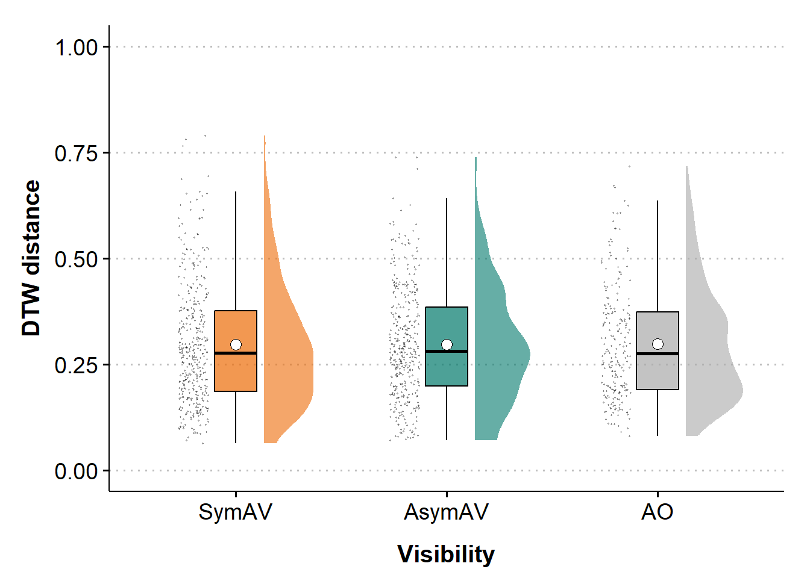<!-- -->

<br>

### bp: dtw distance by condition

``` r
bp_distance = df %>%
  ggplot(aes(x = condition, y = average_distance_xyz,
             fill = condition)) +
  geom_jitter(aes(x = stage(start = condition)),
              size = 0.15, alpha = 0.15, width = 0.07, height = 0) +
  geom_boxplot(width = .3,
               outlier.shape = NA, 
               alpha = 0.7, 
               color = "black") +
  geom_point(data = df_by_cond_B, 
             aes(y = mean_dis), 
             shape = 21, size = 3, fill = "white") +
  labs(x="Visibility", 
       y="DTW distance") +
  scale_y_continuous(limits = c(0, 0.9)) +
  scale_fill_manual(values = c("#ED6B06", "#00786A", "darkgrey")) +
  theme_clean(base_size = 15) +
  theme(axis.text.x = element_text(colour = "black", size = 14),
        axis.text.y = element_text(colour = "black", size = 14),
        axis.title = element_text(size = 15, face = 'bold'),
        axis.title.x = element_text(vjust = -2),
        axis.title.y = element_text(vjust = 2),
        legend.position = "none",
        strip.text = element_text(size = 15, face = 'bold'),
        plot.background = element_blank(),
        plot.margin = unit(c(1.1,1.1,1.1,1.1), "lines"))

bp_distance
```

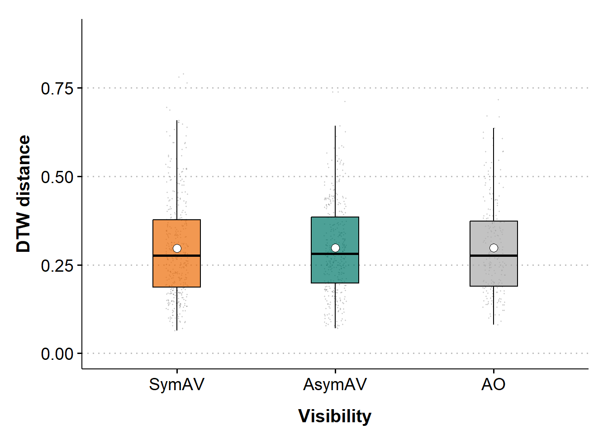<!-- -->

<br>

### bp: distance by condition x round

``` r
bp_distance_by_cond_round = 
  ggplot(df, 
         aes(x=round, y = average_distance_xyz, fill = condition)) +
  geom_jitter(aes(x = stage(start = round)), 
              size = 0.3, alpha = 0.2, width = 0.07, height = 0.02) +
  geom_boxplot(width = .5,
               outlier.shape = NA, alpha = 0.7) +
  geom_point(data = df_by_cond_round_B, 
             aes(y = mean_dis, group = round), 
             shape = 21, size = 2, fill = "white") +
  labs(x = "Round",
       y = "DTW distance") +
  scale_fill_manual(values = c("#ED6B06", "#00786A", "darkgrey")) +
  scale_y_continuous(limits = c(0, 0.9)) +
  theme_clean(base_size = 15) +
  theme(axis.text.x = element_text(colour = "black", size = 14),
        axis.text.y = element_text(colour = "black", size = 14),
        axis.title = element_text(size = 15, face = 'bold'),
        axis.title.x = element_text(vjust = -2),
        axis.title.y = element_text(vjust = 2),
        legend.position = "none",
        strip.text = element_text(size = 15, face = 'bold'),
        plot.background = element_blank(),
        plot.margin = unit(c(1.1,1.1,1.1,1.1), "lines")) +
  facet_grid(cols = vars(condition))

ggplotly(bp_distance_by_cond_round)
```

<div class="plotly html-widget html-fill-item" id="htmlwidget-c42fdbf4bfb1041271d1" style="width:672px;height:480px;"></div>
<script type="application/json" data-for="htmlwidget-c42fdbf4bfb1041271d1">{"x":{"data":[{"x":[1.992698950371705,2.0109486024593934,2.9440085786394774,3.9315598564781249,2.0525862664077432,2.0047912091528999,0.93635589845478528,1.9949352174205706,2.0033378309989347,2.0423779482534155,1.0308309541502967,1.999526302726008,3.0239346924889832,3.045097293430008,3.0242385821603239,3.0509934092825279,2.9866092118388043,3.0171850549709052,3.0427787557244299,2.9840677429223432,3.0615189656149595,3.9835060087405143,4.0408361066039653,3.0383804938057439,4.9940182737400756,4.9361842954484745,5.0315078349877149,4.9663404373545204,4.9903748973412441,4.9395575061021368,5.014284999906085,5.0257222939003263,4.00065067446325,1.9673880345607175,1.9709535765275359,2.0113455597218124,1.9333352131908759,2.0135974139906465,2.0358538424456492,2.9412602004362269,2.9883175968332214,5.0343408803595233,4.0457899717986585,4.0133263384178282,6.0053438699292023,5.0612754926457999,5.03868190410547,6.0606104822037743,1.9468303437717258,1.999804808003828,1.9561063279071822,1.0201465972326695,0.98774159072432666,2.0676131036039442,2.0242457301355898,2.0581438467092812,1.9309315943764522,2.0025898384535683,1.9414396490762009,1.9523803079500794,1.9414396430784837,2.0345911851525305,2.9824487304361536,2.9944333578972144,3.0333321860432623,2.948018805910833,3.0130048074387012,4.0587387507455421,4.0140759442513811,3.9336385480733589,4.0688310421444474,5.9532705842796716,4.0361080916505303,4.004813746586442,4.0621732272673396,4.9953504998609422,5.0363785646157337,5.0291293325601147,6.053238543304615,6.0448150191735479,6.0161472652712833,6.0030211244989182,6.0628153814189139,6.0145708526810635,0.95189874007366593,0.95896652129478754,0.9824284594878554,1.9903024023445324,2.0616145687736571,2.0349606229970232,1.0132525698514656,1.9477059700898827,2.0011359130404891,1.0124565147282556,2.0596409426489846,2.0296713706292211,2.0507329510711134,0.95682201681192969,0.95011765052098784,2.0312154579022899,2.037035824963823,3.0121778334630651,2.9832757805567236,2.9547110867034645,3.0098001014813782,3.0634640295337885,4.0572565616760405,4.0430875918827951,4.060468470109627,6.0314765703212467,6.0347023813659328,6.0678354419860989,1.9529601125698537,1.9885063986526803,1.9431457321532071,2.0123913425859064,1.0173941625514999,2.0383813371043651,1.9648156274296342,3.0499567952984945,3.0662731188163161,3.0206775413500146,3.0443587605562059,2.9966475597349929,1.9664641423616558,3.0179468774702398,2.9524757666420189,3.0121992183569817,2.9930149555625394,2.9563807342341168,2.9892235106462612,2.0280922885658219,2.9889822298428044,3.0165350935515018,4.0173646665271372,3.9910040025785567,3.9626261909818279,4.0142314289463688,4.0242433532467112,4.0635507066873835,3.9333040499966589,5.0206205771164969,5.0496855027647687,3.9564601068198679,3.9483341871108859,4.9960456147370857,6.0497285386361179,5.9565569368703288,5.9824401904363187,1.0453643331583589,1.9399410291295498,1.0275008842302487,2.0173389876587318,0.98692775608506056,0.9688267684727907,1.0385815772227942,1.9732326350081713,1.0132817837875336,2.055927634462714,1.0159368666494266,2.0063821323728188,1.9496043699420988,2.0494701979123056,1.9935563764860853,1.9749170376406981,2.0055696481326595,2.9367368781892584,1.9338211424835026,2.9683822731720282,4.0536805643187837,2.970935566816479,3.0443339261272921,2.9692513464624062,3.0059201118722556,2.9981625099666416,2.9412120396457611,2.9532766362372787,4.0250432156492026,2.9464039397379382,3.0480143368011339,3.004459694614634,3.0489523390540851,3.053826750172302,3.9917445606924593,2.9505548119824381,3.9337798092467708,3.9539760318538173,4.0530216535553336,4.0491073135845363,4.0330458242772149,3.9841275118710473,4.0165995587129144,4.9990879143076015,5.0123329876968636,4.9446128460578622,3.9862181076966228,4.9328300582151856,5.0684470304660501,5.0243319788109515,5.0357272381940854,6.0521229108283299,5.9301954596769066,6.0610753878019752,5.9715295902965586,5.9988718482339758,5.0197936369758098,5.9378350103041155,2.0229401084547862,1.9916754026105628,2.9514342645835132,3.948495861776173,3.0641020920686426,2.0657772636273877,2.0591391318896783,1.9368890134198591,2.0463489793008192,2.0184161018813027,1.9770186683209614,1.0364176965272054,0.96312619046308101,1.9307305861916393,0.94360525642987336,0.94765634090173989,1.0483401728700847,0.95377963434904811,1.9432878179475666,1.9409831895353273,2.0356913480488585,0.98437146856915203,1.9710041158040985,2.9962088853819298,3.0029590301308779,2.9711611570697278,3.0504590379586443,3.0282346860459075,3.0117351551773028,2.9484941185265781,3.0294871608447282,3.0475016328832134,3.0554734494909646,2.0319510584790259,2.9442208416387441,2.9749211471853778,3.0683391027804463,2.9817800821829588,3.9816632521245627,4.0360886602522807,4.0682228931272402,3.9956869632005692,4.0130901272501793,4.0575232811132445,4.0261686204932632,5.0570525470701977,4.0516916216211394,5.0142823697114363,4.9631536727212371,5.0657004666374998,4.9352154840948064,5.0025025506410747,5.9713572326535358,5.9433927804790434,5.9663245356455441,5.979878344112076,5.0287279435060919,4.9600100232334805,1.0137892715819179,2.9727824698761105,2.9616971680615096,3.0424841086333618,0.95650079256389287,1.9426900963531808,1.9625408819271251,2.0304775896994398,4.0161591563327237,2.0151754488330336,2.0675420929118991,1.9977054196875543,2.0668276620283721,1.9425384500343352,2.0432186275022106,1.9523386001493781,1.9989083858719097,1.9423800440272316,2.0316259176237508,2.0470409752009435,3.9511605861643329,3.0661289168708028,3.0101464999094607,3.0509771550446749,3.0040292444685472,3.031738447090611,4.0416500415420158,3.9427760413289068,3.9338814442511647,4.0603835587948565,5.9677579247765244,6.0515803682338447,5.9475840977765619,1.0401736598275602,1.0495704789320006,1.9924099128087982,1.9519047507969662,0.93871387209743262,0.98755562478210779,2.0582531690271573,2.0286804431164636,0.99887811614200472,1.0271987617341802,1.0155208527483046,2.971106262668036,0.99143634523265067,1.014095537881367,1.0692454585339874,1.9922591987112537,1.9313401799742131,1.0276040819333867,1.0294423823757097,0.93378187849186356,2.0640294918511062,1.9808632229594514,2.0358222226426004,3.0626621286571027,3.0065467312838883,2.9443195120431485,3.0113880182802677,3.0022285968810318,2.9848967432137581,3.0457080266484993,3.0287356383167205,2.9460251407278704,3.9398805487342177,4.0310712911281739,3.9872242636093871,4.059676202251576,3.0222792412946,4.9672793110692872,5.0291492283251138,5.0039371283957736,5.9610149931954224,5.9628862176183608,1.0324560566339642,0.97507336667738853,1.0318561200238765,2.0030649817967787,1.0244701441843063,2.0031642745621503,2.0021648071473463,2.9552362999366597,2.9814663288090379,0.95425566317047927,2.036236000014469,1.9876590797025711,2.0316753552434967,0.97468947642017156,2.0148592784116044,0.97094842214137311,0.99337651283014561,2.0163767622550948,1.9644288276927546,1.9307618951564653,1.9774816319625825,1.9990085893450305,3.0281691902223975,3.0504302821960301,2.9601759235188365,2.9626628856686876,3.0532968202559276,2.9636615031026303,3.0384568961197509,3.0127736368309708,1.9577706593414768,3.0673799046268688,3.0087912801699712,1.9612613671040162,4.0265799940843134,4.0365247971471403,3.9936058468325064,4.9407091860659422,4.0386471257545056,4.026282360879704,3.9515295590879393,4.0653797727636993,4.9329038576176387,4.9368952734395863,4.9980657111434263,5.9405687048891558,4.9748016609204937],"y":[0.069118353034007221,0.18380299963668573,0.21896236109285261,0.22115231039128841,0.22546938439440456,0.41668516034779551,0.17893490452761446,0.18085194448308026,0.13945809418894048,0.14414137141406233,0.27037378879351787,0.15267436994291422,0.33300565852523895,0.27659819935892777,0.26825352636252192,0.24185996894810941,0.22877449893530355,0.27960417226476764,0.18084929689935655,0.33625418827761822,0.1702512891274095,0.14750090728421472,0.37382909509582019,0.17203847449819065,0.27782391605621526,0.26578897253332984,0.34551831109535008,0.35989665801813492,0.24284150827487019,0.15620960509027984,0.15962896694052664,0.32041560411746206,0.36786956431299672,0.30690964255130426,0.54473647870580533,0.2775152371315488,0.50535437190966415,0.46333017914326718,0.35012767629382929,0.22757420374032186,0.23651163897357727,0.26383414233155883,0.24051294968273287,0.16706618255145014,0.30707951224690494,0.29382814042307276,0.10278382540420522,0.36336009858910456,0.43760613396894493,0.14924496330641118,0.27950643247693674,0.11817138654022423,0.27889009874487364,0.20244636398378446,0.47986327224777475,0.22464967202519268,0.1567953376419744,0.28526879134994876,0.56248901080260794,0.29423987269047908,0.20101309176082677,0.15253615468250434,0.3034320246935413,0.379984272620916,0.29730705634677884,0.16015437233989699,0.29227712481008911,0.14319745151564894,0.21931222474594422,0.16892763784887774,0.21189681035015978,0.16684653441048258,0.14000776906087117,0.1352669659242611,0.16049262174248274,0.29456740654034141,0.2234034781046301,0.18479259845107196,0.24084666392345852,0.13726831522356783,0.35031559602936607,0.27073831441000706,0.42619975557248685,0.50670419384005605,0.2961905928728259,0.26106890100857622,0.13905659022149439,0.32278236265380172,0.17469581658268038,0.54655853748934113,0.26792685176664416,0.35231050747124609,0.33749303626243993,0.5068823541936881,0.23127501904477826,0.37275278205577222,0.19780747584657024,0.16458861648617773,0.20962269189079569,0.19775809732082136,0.1111056186948971,0.24057954332707371,0.6942651328214926,0.29476483370035061,0.29463696450909116,0.33693051723123774,0.2532930417311699,0.37716861257623802,0.2103635240448791,0.50846490189295424,0.4751388533524622,0.46969888687384503,0.11054122250809668,0.2605587986909923,0.5287832593400964,0.31109818210980689,0.19435312374848918,0.63386835925626794,0.58249491881002291,0.19579637158189142,0.47829746123078382,0.44130330479379293,0.58603383030909684,0.61118779865260797,0.097597924630443811,0.24637244496997773,0.45937519212657463,0.10151670894370028,0.11258501770955839,0.41305657743357749,0.30960851045705728,0.093215125168163604,0.15532751723061733,0.19386009316129457,0.31598842510034469,0.14495894497454126,0.18054413496430441,0.21573036122736322,0.3295535259410583,0.63222414156930251,0.37800132507816853,0.37039045377652929,0.14583947991291141,0.10595133366938295,0.37062395380547875,0.14305856249737406,0.095532075450394993,0.24126137028582709,0.63236885738749449,0.77185346340965899,0.14646079799387843,0.26449005878913473,0.37046334333577396,0.14310437319337846,0.28396983157132905,0.16544862128185622,0.22809582307575474,0.56267366563121335,0.52778929121340712,0.09461753906258355,0.25244475339118516,0.3853274057153887,0.25800724136122422,0.53952635146437222,0.28755065739694724,0.13849967577671438,0.12752739272253705,0.091487445660004649,0.41678810628314639,0.15636836294990342,0.18271916268057653,0.33428893614230215,0.14552639329371325,0.29276477420751418,0.44533613689638396,0.37378731485105376,0.44187686387271402,0.45445963194322431,0.26497342816800212,0.23167101935939707,0.080683581257240136,0.41684286215470068,0.44852658895903164,0.31322969454075694,0.20782242672187667,0.20079034496797091,0.20036142336327789,0.50514181389872492,0.43599267444626033,0.29205868343571917,0.56548712960400527,0.16506479518002198,0.095733316203279933,0.21037882449380493,0.21410525059602595,0.37426766615494095,0.17250991884371916,0.35673754757118592,0.43366034640913143,0.36383572926713015,0.27600796900841862,0.26374128575098327,0.47746078711392181,0.41988936486300832,0.14693849575095586,0.11869288090520487,0.13447716073608312,0.050646573550626559,0.28690903722492533,0.34082241757019516,0.32670431504761871,0.3908733831811585,0.49978396274545733,0.17585816445486907,0.50533138174352976,0.26519710252640599,0.28326035529785321,0.18283106811855462,0.16150306643435106,0.36021493932601556,0.3891378643289774,0.28357631015760981,0.37527123338477203,0.23099878319003106,0.4202000414235425,0.27646979963445195,0.20438528541401629,0.26933855139526497,0.27976273825184922,0.10964623514972892,0.48720585013557183,0.29427588520229891,0.54995747663401651,0.16124312856950862,0.27677592819955249,0.66410966597518728,0.11146129235935288,0.31397998643763808,0.12738262433361161,0.27693875645908433,0.31669538036136735,0.18341861315645513,0.36727929239579515,0.4126731045039434,0.50570689783083955,0.65377688779268517,0.40974556713503685,0.51088328740029731,0.6963760168977543,0.45384085784697925,0.64549319632719426,0.2825244772339629,0.77677224088523156,0.76447540599767527,0.64537567200284807,0.44638426711209045,0.29514952628862939,0.40893623680142815,0.47473530389008822,0.2589632396954315,0.54892445265967571,0.52695113897761559,0.3050606797235631,0.28328243351620647,0.26994857434262548,0.094100375515077134,0.094309005691205469,0.39768753186810679,0.30341667138558093,0.25940919542961516,0.30094219757918927,0.39778100848781667,0.3922300142294427,0.18670941522092793,0.31181530378293576,0.26212235650417953,0.24697403796309533,0.14932934289761379,0.35206904617280427,0.16102882611500358,0.19630653553762697,0.29212512661929091,0.25636128115769319,0.12223848674004111,0.33195130095754333,0.34531388995278811,0.33895758721821873,0.33557854016624444,0.13576332887206638,0.25474456979837773,0.076589606883447431,0.27816678264769601,0.2879925240796386,0.29237324307417023,0.20477038236886419,0.41387296190570849,0.3858985960493837,0.36812328185989002,0.41357262244209125,0.42231900941246242,0.24381239011989769,0.20502309405317345,0.38689532423111778,0.22000351208880853,0.11325570771731111,0.24291941189747038,0.29684189048824533,0.16911398760583557,0.16190550074521759,0.28270213431898283,0.35075858184560843,0.33828067734649342,0.12704198192821561,0.19416446349795682,0.37816935117599065,0.3500682257977471,0.32989426631154017,0.23751426954006385,0.37253532550104906,0.16193538890406922,0.16008750500678759,0.25985233394988755,0.1301835396634205,0.20504003245049035,0.20135331843037033,0.14978611248320894,0.16107148656397122,0.24695262219378675,0.35039791611336235,0.3417266323690597,0.20652490278844365,0.10227581962350762,0.24912655312569579,0.18941162363620667,0.22216354775185079,0.27461156272942644,0.20670680317026449,0.16373866270249321,0.23059518277032715,0.16576526857028967,0.16010628615708206,0.19838228194177415,0.34546938705624486,0.21372154552329892,0.29792623377159339,0.17597859226404938,0.22713557228070597,0.13117588081949033,0.20958011095889845,0.34880015676942289,0.37372664127286737,0.22702040711661306,0.46795084603630582,0.51160878488120232,0.35394272356063722,0.41731976444833929,0.31814714652106002,0.57865885198729672,0.35648317020405579,0.21359880040754833,0.30862379520422761,0.12088422358996331,0.66352789662474521,0.32711057601896404,0.33395741790932892,0.24695525759911352,0.60033059739504502,0.17368257494406791,0.41839155093805114,0.5471458852907799,0.14159431500675082,0.65586359149348739,0.48511449352745767,0.43317325609860535,0.30078056905470102,0.51480518810949238,0.26861016786793168,0.21151577582541536,0.10459021136681278,0.10732418416957741,0.31733621845564802,0.20849114655293752,0.29202202259589671,0.28993798737648263,0.40041327703888274,0.14530024462656679,0.31857147924166507],"text":["round: 2<br />average_distance_xyz: 0.0707<br />condition: SymAV","round: 2<br />average_distance_xyz: 0.1831<br />condition: SymAV","round: 3<br />average_distance_xyz: 0.2109<br />condition: SymAV","round: 4<br />average_distance_xyz: 0.2112<br />condition: SymAV","round: 2<br />average_distance_xyz: 0.2288<br />condition: SymAV","round: 2<br />average_distance_xyz: 0.4197<br />condition: SymAV","round: 1<br />average_distance_xyz: 0.1862<br />condition: SymAV","round: 2<br />average_distance_xyz: 0.1810<br />condition: SymAV","round: 2<br />average_distance_xyz: 0.1412<br />condition: SymAV","round: 2<br />average_distance_xyz: 0.1412<br />condition: SymAV","round: 1<br />average_distance_xyz: 0.2888<br />condition: SymAV","round: 2<br />average_distance_xyz: 0.1465<br />condition: SymAV","round: 3<br />average_distance_xyz: 0.3509<br />condition: SymAV","round: 3<br />average_distance_xyz: 0.2613<br />condition: SymAV","round: 3<br />average_distance_xyz: 0.2553<br />condition: SymAV","round: 3<br />average_distance_xyz: 0.2553<br />condition: SymAV","round: 3<br />average_distance_xyz: 0.2421<br />condition: SymAV","round: 3<br />average_distance_xyz: 0.2716<br />condition: SymAV","round: 3<br />average_distance_xyz: 0.1682<br />condition: SymAV","round: 3<br />average_distance_xyz: 0.3367<br />condition: SymAV","round: 3<br />average_distance_xyz: 0.1634<br />condition: SymAV","round: 4<br />average_distance_xyz: 0.1544<br />condition: SymAV","round: 4<br />average_distance_xyz: 0.3715<br />condition: SymAV","round: 3<br />average_distance_xyz: 0.1784<br />condition: SymAV","round: 5<br />average_distance_xyz: 0.2768<br />condition: SymAV","round: 5<br />average_distance_xyz: 0.2768<br />condition: SymAV","round: 5<br />average_distance_xyz: 0.3350<br />condition: SymAV","round: 5<br />average_distance_xyz: 0.3784<br />condition: SymAV","round: 5<br />average_distance_xyz: 0.2468<br />condition: SymAV","round: 5<br />average_distance_xyz: 0.1717<br />condition: SymAV","round: 5<br />average_distance_xyz: 0.1717<br />condition: SymAV","round: 5<br />average_distance_xyz: 0.3059<br />condition: SymAV","round: 4<br />average_distance_xyz: 0.3550<br />condition: SymAV","round: 2<br />average_distance_xyz: 0.3014<br />condition: SymAV","round: 2<br />average_distance_xyz: 0.5341<br />condition: SymAV","round: 2<br />average_distance_xyz: 0.2757<br />condition: SymAV","round: 2<br />average_distance_xyz: 0.5219<br />condition: SymAV","round: 2<br />average_distance_xyz: 0.4811<br />condition: SymAV","round: 2<br />average_distance_xyz: 0.3699<br />condition: SymAV","round: 3<br />average_distance_xyz: 0.2152<br />condition: SymAV","round: 3<br />average_distance_xyz: 0.2309<br />condition: SymAV","round: 5<br />average_distance_xyz: 0.2507<br />condition: SymAV","round: 4<br />average_distance_xyz: 0.2262<br />condition: SymAV","round: 4<br />average_distance_xyz: 0.1722<br />condition: SymAV","round: 6<br />average_distance_xyz: 0.3094<br />condition: SymAV","round: 5<br />average_distance_xyz: 0.3123<br />condition: SymAV","round: 5<br />average_distance_xyz: 0.1035<br />condition: SymAV","round: 6<br />average_distance_xyz: 0.3796<br />condition: SymAV","round: 2<br />average_distance_xyz: 0.4383<br />condition: SymAV","round: 2<br />average_distance_xyz: 0.1482<br />condition: SymAV","round: 2<br />average_distance_xyz: 0.2967<br />condition: SymAV","round: 1<br />average_distance_xyz: 0.1332<br />condition: SymAV","round: 1<br />average_distance_xyz: 0.2673<br />condition: SymAV","round: 2<br />average_distance_xyz: 0.2144<br />condition: SymAV","round: 2<br />average_distance_xyz: 0.4843<br />condition: SymAV","round: 2<br />average_distance_xyz: 0.2258<br />condition: SymAV","round: 2<br />average_distance_xyz: 0.1695<br />condition: SymAV","round: 2<br />average_distance_xyz: 0.2665<br />condition: SymAV","round: 2<br />average_distance_xyz: 0.5770<br />condition: SymAV","round: 2<br />average_distance_xyz: 0.3132<br />condition: SymAV","round: 2<br />average_distance_xyz: 0.1936<br />condition: SymAV","round: 2<br />average_distance_xyz: 0.1594<br />condition: SymAV","round: 3<br />average_distance_xyz: 0.2849<br />condition: SymAV","round: 3<br />average_distance_xyz: 0.3917<br />condition: SymAV","round: 3<br />average_distance_xyz: 0.2853<br />condition: SymAV","round: 3<br />average_distance_xyz: 0.1491<br />condition: SymAV","round: 3<br />average_distance_xyz: 0.2914<br />condition: SymAV","round: 4<br />average_distance_xyz: 0.1288<br />condition: SymAV","round: 4<br />average_distance_xyz: 0.1999<br />condition: SymAV","round: 4<br />average_distance_xyz: 0.1705<br />condition: SymAV","round: 4<br />average_distance_xyz: 0.2220<br />condition: SymAV","round: 6<br />average_distance_xyz: 0.1707<br />condition: SymAV","round: 4<br />average_distance_xyz: 0.1245<br />condition: SymAV","round: 4<br />average_distance_xyz: 0.1505<br />condition: SymAV","round: 4<br />average_distance_xyz: 0.1693<br />condition: SymAV","round: 5<br />average_distance_xyz: 0.3057<br />condition: SymAV","round: 5<br />average_distance_xyz: 0.2173<br />condition: SymAV","round: 5<br />average_distance_xyz: 0.1704<br />condition: SymAV","round: 6<br />average_distance_xyz: 0.2526<br />condition: SymAV","round: 6<br />average_distance_xyz: 0.1457<br />condition: SymAV","round: 6<br />average_distance_xyz: 0.3335<br />condition: SymAV","round: 6<br />average_distance_xyz: 0.2898<br />condition: SymAV","round: 6<br />average_distance_xyz: 0.4240<br />condition: SymAV","round: 6<br />average_distance_xyz: 0.4905<br />condition: SymAV","round: 1<br />average_distance_xyz: 0.2850<br />condition: SymAV","round: 1<br />average_distance_xyz: 0.2565<br />condition: SymAV","round: 1<br />average_distance_xyz: 0.1327<br />condition: SymAV","round: 2<br />average_distance_xyz: 0.3401<br />condition: SymAV","round: 2<br />average_distance_xyz: 0.1935<br />condition: SymAV","round: 2<br />average_distance_xyz: 0.5439<br />condition: SymAV","round: 1<br />average_distance_xyz: 0.2611<br />condition: SymAV","round: 2<br />average_distance_xyz: 0.3653<br />condition: SymAV","round: 2<br />average_distance_xyz: 0.3522<br />condition: SymAV","round: 1<br />average_distance_xyz: 0.5214<br />condition: SymAV","round: 2<br />average_distance_xyz: 0.2134<br />condition: SymAV","round: 2<br />average_distance_xyz: 0.3609<br />condition: SymAV","round: 2<br />average_distance_xyz: 0.1903<br />condition: SymAV","round: 1<br />average_distance_xyz: 0.1693<br />condition: SymAV","round: 1<br />average_distance_xyz: 0.1954<br />condition: SymAV","round: 2<br />average_distance_xyz: 0.2003<br />condition: SymAV","round: 2<br />average_distance_xyz: 0.1150<br />condition: SymAV","round: 3<br />average_distance_xyz: 0.2259<br />condition: SymAV","round: 3<br />average_distance_xyz: 0.6952<br />condition: SymAV","round: 3<br />average_distance_xyz: 0.2822<br />condition: SymAV","round: 3<br />average_distance_xyz: 0.2883<br />condition: SymAV","round: 3<br />average_distance_xyz: 0.3372<br />condition: SymAV","round: 4<br />average_distance_xyz: 0.2353<br />condition: SymAV","round: 4<br />average_distance_xyz: 0.3620<br />condition: SymAV","round: 4<br />average_distance_xyz: 0.1923<br />condition: SymAV","round: 6<br />average_distance_xyz: 0.4987<br />condition: SymAV","round: 6<br />average_distance_xyz: 0.4799<br />condition: SymAV","round: 6<br />average_distance_xyz: 0.4555<br />condition: SymAV","round: 2<br />average_distance_xyz: 0.1000<br />condition: SymAV","round: 2<br />average_distance_xyz: 0.2799<br />condition: SymAV","round: 2<br />average_distance_xyz: 0.5134<br />condition: SymAV","round: 2<br />average_distance_xyz: 0.2982<br />condition: SymAV","round: 1<br />average_distance_xyz: 0.1981<br />condition: SymAV","round: 2<br />average_distance_xyz: 0.6332<br />condition: SymAV","round: 2<br />average_distance_xyz: 0.5961<br />condition: SymAV","round: 3<br />average_distance_xyz: 0.2148<br />condition: SymAV","round: 3<br />average_distance_xyz: 0.4762<br />condition: SymAV","round: 3<br />average_distance_xyz: 0.4322<br />condition: SymAV","round: 3<br />average_distance_xyz: 0.5956<br />condition: SymAV","round: 3<br />average_distance_xyz: 0.5956<br />condition: SymAV","round: 2<br />average_distance_xyz: 0.0906<br />condition: SymAV","round: 3<br />average_distance_xyz: 0.2271<br />condition: SymAV","round: 3<br />average_distance_xyz: 0.4751<br />condition: SymAV","round: 3<br />average_distance_xyz: 0.1084<br />condition: SymAV","round: 3<br />average_distance_xyz: 0.1187<br />condition: SymAV","round: 3<br />average_distance_xyz: 0.4144<br />condition: SymAV","round: 3<br />average_distance_xyz: 0.3270<br />condition: SymAV","round: 2<br />average_distance_xyz: 0.0973<br />condition: SymAV","round: 3<br />average_distance_xyz: 0.1419<br />condition: SymAV","round: 3<br />average_distance_xyz: 0.1882<br />condition: SymAV","round: 4<br />average_distance_xyz: 0.3129<br />condition: SymAV","round: 4<br />average_distance_xyz: 0.1302<br />condition: SymAV","round: 4<br />average_distance_xyz: 0.1905<br />condition: SymAV","round: 4<br />average_distance_xyz: 0.2068<br />condition: SymAV","round: 4<br />average_distance_xyz: 0.3340<br />condition: SymAV","round: 4<br />average_distance_xyz: 0.6152<br />condition: SymAV","round: 4<br />average_distance_xyz: 0.3975<br />condition: SymAV","round: 5<br />average_distance_xyz: 0.3828<br />condition: SymAV","round: 5<br />average_distance_xyz: 0.1381<br />condition: SymAV","round: 4<br />average_distance_xyz: 0.0993<br />condition: SymAV","round: 4<br />average_distance_xyz: 0.3782<br />condition: SymAV","round: 5<br />average_distance_xyz: 0.1346<br />condition: SymAV","round: 6<br />average_distance_xyz: 0.0915<br />condition: SymAV","round: 6<br />average_distance_xyz: 0.2519<br />condition: SymAV","round: 6<br />average_distance_xyz: 0.6152<br />condition: SymAV","round: 1<br />average_distance_xyz: 0.7898<br />condition: SymAV","round: 2<br />average_distance_xyz: 0.1329<br />condition: SymAV","round: 1<br />average_distance_xyz: 0.2693<br />condition: SymAV","round: 2<br />average_distance_xyz: 0.3579<br />condition: SymAV","round: 1<br />average_distance_xyz: 0.1451<br />condition: SymAV","round: 1<br />average_distance_xyz: 0.2792<br />condition: SymAV","round: 1<br />average_distance_xyz: 0.1489<br />condition: SymAV","round: 2<br />average_distance_xyz: 0.2347<br />condition: SymAV","round: 1<br />average_distance_xyz: 0.5501<br />condition: SymAV","round: 2<br />average_distance_xyz: 0.5130<br />condition: SymAV","round: 1<br />average_distance_xyz: 0.0987<br />condition: SymAV","round: 2<br />average_distance_xyz: 0.2562<br />condition: SymAV","round: 2<br />average_distance_xyz: 0.4014<br />condition: SymAV","round: 2<br />average_distance_xyz: 0.2439<br />condition: SymAV","round: 2<br />average_distance_xyz: 0.5198<br />condition: SymAV","round: 2<br />average_distance_xyz: 0.2754<br />condition: SymAV","round: 2<br />average_distance_xyz: 0.1385<br />condition: SymAV","round: 3<br />average_distance_xyz: 0.1080<br />condition: SymAV","round: 2<br />average_distance_xyz: 0.1000<br />condition: SymAV","round: 3<br />average_distance_xyz: 0.4284<br />condition: SymAV","round: 4<br />average_distance_xyz: 0.1716<br />condition: SymAV","round: 3<br />average_distance_xyz: 0.1734<br />condition: SymAV","round: 3<br />average_distance_xyz: 0.3297<br />condition: SymAV","round: 3<br />average_distance_xyz: 0.1380<br />condition: SymAV","round: 3<br />average_distance_xyz: 0.2860<br />condition: SymAV","round: 3<br />average_distance_xyz: 0.4408<br />condition: SymAV","round: 3<br />average_distance_xyz: 0.3932<br />condition: SymAV","round: 3<br />average_distance_xyz: 0.4593<br />condition: SymAV","round: 4<br />average_distance_xyz: 0.4533<br />condition: SymAV","round: 3<br />average_distance_xyz: 0.2618<br />condition: SymAV","round: 3<br />average_distance_xyz: 0.2196<br />condition: SymAV","round: 3<br />average_distance_xyz: 0.0788<br />condition: SymAV","round: 3<br />average_distance_xyz: 0.4308<br />condition: SymAV","round: 3<br />average_distance_xyz: 0.4308<br />condition: SymAV","round: 4<br />average_distance_xyz: 0.3100<br />condition: SymAV","round: 3<br />average_distance_xyz: 0.2089<br />condition: SymAV","round: 4<br />average_distance_xyz: 0.1863<br />condition: SymAV","round: 4<br />average_distance_xyz: 0.2030<br />condition: SymAV","round: 4<br />average_distance_xyz: 0.4882<br />condition: SymAV","round: 4<br />average_distance_xyz: 0.4337<br />condition: SymAV","round: 4<br />average_distance_xyz: 0.2787<br />condition: SymAV","round: 4<br />average_distance_xyz: 0.5567<br />condition: SymAV","round: 4<br />average_distance_xyz: 0.1467<br />condition: SymAV","round: 5<br />average_distance_xyz: 0.1119<br />condition: SymAV","round: 5<br />average_distance_xyz: 0.2247<br />condition: SymAV","round: 5<br />average_distance_xyz: 0.2247<br />condition: SymAV","round: 4<br />average_distance_xyz: 0.3622<br />condition: SymAV","round: 5<br />average_distance_xyz: 0.1734<br />condition: SymAV","round: 5<br />average_distance_xyz: 0.3476<br />condition: SymAV","round: 5<br />average_distance_xyz: 0.4224<br />condition: SymAV","round: 5<br />average_distance_xyz: 0.3464<br />condition: SymAV","round: 6<br />average_distance_xyz: 0.2946<br />condition: SymAV","round: 6<br />average_distance_xyz: 0.2510<br />condition: SymAV","round: 6<br />average_distance_xyz: 0.4581<br />condition: SymAV","round: 6<br />average_distance_xyz: 0.4045<br />condition: SymAV","round: 6<br />average_distance_xyz: 0.1418<br />condition: SymAV","round: 5<br />average_distance_xyz: 0.1353<br />condition: SymAV","round: 6<br />average_distance_xyz: 0.1212<br />condition: SymAV","round: 2<br />average_distance_xyz: 0.0647<br />condition: SymAV","round: 2<br />average_distance_xyz: 0.2805<br />condition: SymAV","round: 3<br />average_distance_xyz: 0.3453<br />condition: SymAV","round: 4<br />average_distance_xyz: 0.3290<br />condition: SymAV","round: 3<br />average_distance_xyz: 0.3813<br />condition: SymAV","round: 2<br />average_distance_xyz: 0.5069<br />condition: SymAV","round: 2<br />average_distance_xyz: 0.1931<br />condition: SymAV","round: 2<br />average_distance_xyz: 0.5233<br />condition: SymAV","round: 2<br />average_distance_xyz: 0.2668<br />condition: SymAV","round: 2<br />average_distance_xyz: 0.2945<br />condition: SymAV","round: 2<br />average_distance_xyz: 0.1997<br />condition: SymAV","round: 1<br />average_distance_xyz: 0.1519<br />condition: SymAV","round: 1<br />average_distance_xyz: 0.3764<br />condition: SymAV","round: 2<br />average_distance_xyz: 0.3790<br />condition: SymAV","round: 1<br />average_distance_xyz: 0.2654<br />condition: SymAV","round: 1<br />average_distance_xyz: 0.3588<br />condition: SymAV","round: 1<br />average_distance_xyz: 0.2128<br />condition: SymAV","round: 1<br />average_distance_xyz: 0.4399<br />condition: SymAV","round: 2<br />average_distance_xyz: 0.2664<br />condition: SymAV","round: 2<br />average_distance_xyz: 0.2094<br />condition: SymAV","round: 2<br />average_distance_xyz: 0.2875<br />condition: SymAV","round: 1<br />average_distance_xyz: 0.2851<br />condition: SymAV","round: 2<br />average_distance_xyz: 0.1036<br />condition: SymAV","round: 3<br />average_distance_xyz: 0.4857<br />condition: SymAV","round: 3<br />average_distance_xyz: 0.3111<br />condition: SymAV","round: 3<br />average_distance_xyz: 0.5498<br />condition: SymAV","round: 3<br />average_distance_xyz: 0.1774<br />condition: SymAV","round: 3<br />average_distance_xyz: 0.2899<br />condition: SymAV","round: 3<br />average_distance_xyz: 0.6534<br />condition: SymAV","round: 3<br />average_distance_xyz: 0.1206<br />condition: SymAV","round: 3<br />average_distance_xyz: 0.3106<br />condition: SymAV","round: 3<br />average_distance_xyz: 0.1265<br />condition: SymAV","round: 3<br />average_distance_xyz: 0.2696<br />condition: SymAV","round: 2<br />average_distance_xyz: 0.3082<br />condition: SymAV","round: 3<br />average_distance_xyz: 0.1832<br />condition: SymAV","round: 3<br />average_distance_xyz: 0.3778<br />condition: SymAV","round: 3<br />average_distance_xyz: 0.3941<br />condition: SymAV","round: 3<br />average_distance_xyz: 0.5096<br />condition: SymAV","round: 4<br />average_distance_xyz: 0.6398<br />condition: SymAV","round: 4<br />average_distance_xyz: 0.4182<br />condition: SymAV","round: 4<br />average_distance_xyz: 0.4927<br />condition: SymAV","round: 4<br />average_distance_xyz: 0.6872<br />condition: SymAV","round: 4<br />average_distance_xyz: 0.4369<br />condition: SymAV","round: 4<br />average_distance_xyz: 0.6529<br />condition: SymAV","round: 4<br />average_distance_xyz: 0.2975<br />condition: SymAV","round: 5<br />average_distance_xyz: 0.7649<br />condition: SymAV","round: 4<br />average_distance_xyz: 0.7808<br />condition: SymAV","round: 5<br />average_distance_xyz: 0.6262<br />condition: SymAV","round: 5<br />average_distance_xyz: 0.4551<br />condition: SymAV","round: 5<br />average_distance_xyz: 0.2959<br />condition: SymAV","round: 5<br />average_distance_xyz: 0.4159<br />condition: SymAV","round: 5<br />average_distance_xyz: 0.4835<br />condition: SymAV","round: 6<br />average_distance_xyz: 0.2518<br />condition: SymAV","round: 6<br />average_distance_xyz: 0.5598<br />condition: SymAV","round: 6<br />average_distance_xyz: 0.5250<br />condition: SymAV","round: 6<br />average_distance_xyz: 0.3147<br />condition: SymAV","round: 5<br />average_distance_xyz: 0.2893<br />condition: SymAV","round: 5<br />average_distance_xyz: 0.2893<br />condition: SymAV","round: 1<br />average_distance_xyz: 0.1071<br />condition: SymAV","round: 3<br />average_distance_xyz: 0.0876<br />condition: SymAV","round: 3<br />average_distance_xyz: 0.3852<br />condition: SymAV","round: 3<br />average_distance_xyz: 0.2966<br />condition: SymAV","round: 1<br />average_distance_xyz: 0.2675<br />condition: SymAV","round: 2<br />average_distance_xyz: 0.3032<br />condition: SymAV","round: 2<br />average_distance_xyz: 0.3996<br />condition: SymAV","round: 2<br />average_distance_xyz: 0.3996<br />condition: SymAV","round: 4<br />average_distance_xyz: 0.1678<br />condition: SymAV","round: 2<br />average_distance_xyz: 0.3063<br />condition: SymAV","round: 2<br />average_distance_xyz: 0.2703<br />condition: SymAV","round: 2<br />average_distance_xyz: 0.2422<br />condition: SymAV","round: 2<br />average_distance_xyz: 0.1656<br />condition: SymAV","round: 2<br />average_distance_xyz: 0.3651<br />condition: SymAV","round: 2<br />average_distance_xyz: 0.1574<br />condition: SymAV","round: 2<br />average_distance_xyz: 0.1801<br />condition: SymAV","round: 2<br />average_distance_xyz: 0.2811<br />condition: SymAV","round: 2<br />average_distance_xyz: 0.2546<br />condition: SymAV","round: 2<br />average_distance_xyz: 0.1402<br />condition: SymAV","round: 2<br />average_distance_xyz: 0.3306<br />condition: SymAV","round: 4<br />average_distance_xyz: 0.3580<br />condition: SymAV","round: 3<br />average_distance_xyz: 0.3340<br />condition: SymAV","round: 3<br />average_distance_xyz: 0.3224<br />condition: SymAV","round: 3<br />average_distance_xyz: 0.1354<br />condition: SymAV","round: 3<br />average_distance_xyz: 0.2721<br />condition: SymAV","round: 3<br />average_distance_xyz: 0.0897<br />condition: SymAV","round: 4<br />average_distance_xyz: 0.2936<br />condition: SymAV","round: 4<br />average_distance_xyz: 0.2695<br />condition: SymAV","round: 4<br />average_distance_xyz: 0.2767<br />condition: SymAV","round: 4<br />average_distance_xyz: 0.1948<br />condition: SymAV","round: 6<br />average_distance_xyz: 0.4075<br />condition: SymAV","round: 6<br />average_distance_xyz: 0.3766<br />condition: SymAV","round: 6<br />average_distance_xyz: 0.3766<br />condition: SymAV","round: 1<br />average_distance_xyz: 0.4021<br />condition: SymAV","round: 1<br />average_distance_xyz: 0.4139<br />condition: SymAV","round: 2<br />average_distance_xyz: 0.2400<br />condition: SymAV","round: 2<br />average_distance_xyz: 0.1961<br />condition: SymAV","round: 1<br />average_distance_xyz: 0.3684<br />condition: SymAV","round: 1<br />average_distance_xyz: 0.2327<br />condition: SymAV","round: 2<br />average_distance_xyz: 0.1203<br />condition: SymAV","round: 2<br />average_distance_xyz: 0.2320<br />condition: SymAV","round: 1<br />average_distance_xyz: 0.3029<br />condition: SymAV","round: 1<br />average_distance_xyz: 0.1663<br />condition: SymAV","round: 1<br />average_distance_xyz: 0.1663<br />condition: SymAV","round: 3<br />average_distance_xyz: 0.2986<br />condition: SymAV","round: 1<br />average_distance_xyz: 0.3538<br />condition: SymAV","round: 1<br />average_distance_xyz: 0.3360<br />condition: SymAV","round: 1<br />average_distance_xyz: 0.1391<br />condition: SymAV","round: 2<br />average_distance_xyz: 0.2099<br />condition: SymAV","round: 2<br />average_distance_xyz: 0.3925<br />condition: SymAV","round: 1<br />average_distance_xyz: 0.3355<br />condition: SymAV","round: 1<br />average_distance_xyz: 0.3138<br />condition: SymAV","round: 1<br />average_distance_xyz: 0.2435<br />condition: SymAV","round: 2<br />average_distance_xyz: 0.3829<br />condition: SymAV","round: 2<br />average_distance_xyz: 0.1772<br />condition: SymAV","round: 2<br />average_distance_xyz: 0.1448<br />condition: SymAV","round: 3<br />average_distance_xyz: 0.2444<br />condition: SymAV","round: 3<br />average_distance_xyz: 0.1340<br />condition: SymAV","round: 3<br />average_distance_xyz: 0.2141<br />condition: SymAV","round: 3<br />average_distance_xyz: 0.1938<br />condition: SymAV","round: 3<br />average_distance_xyz: 0.1570<br />condition: SymAV","round: 3<br />average_distance_xyz: 0.1570<br />condition: SymAV","round: 3<br />average_distance_xyz: 0.2271<br />condition: SymAV","round: 3<br />average_distance_xyz: 0.3528<br />condition: SymAV","round: 3<br />average_distance_xyz: 0.3254<br />condition: SymAV","round: 4<br />average_distance_xyz: 0.2120<br />condition: SymAV","round: 4<br />average_distance_xyz: 0.0881<br />condition: SymAV","round: 4<br />average_distance_xyz: 0.2376<br />condition: SymAV","round: 4<br />average_distance_xyz: 0.1774<br />condition: SymAV","round: 3<br />average_distance_xyz: 0.2060<br />condition: SymAV","round: 5<br />average_distance_xyz: 0.2625<br />condition: SymAV","round: 5<br />average_distance_xyz: 0.2150<br />condition: SymAV","round: 5<br />average_distance_xyz: 0.1837<br />condition: SymAV","round: 6<br />average_distance_xyz: 0.2211<br />condition: SymAV","round: 6<br />average_distance_xyz: 0.1500<br />condition: SymAV","round: 1<br />average_distance_xyz: 0.1626<br />condition: SymAV","round: 1<br />average_distance_xyz: 0.1910<br />condition: SymAV","round: 1<br />average_distance_xyz: 0.3448<br />condition: SymAV","round: 2<br />average_distance_xyz: 0.2321<br />condition: SymAV","round: 1<br />average_distance_xyz: 0.2782<br />condition: SymAV","round: 2<br />average_distance_xyz: 0.1869<br />condition: SymAV","round: 2<br />average_distance_xyz: 0.2299<br />condition: SymAV","round: 3<br />average_distance_xyz: 0.1423<br />condition: SymAV","round: 3<br />average_distance_xyz: 0.2216<br />condition: SymAV","round: 1<br />average_distance_xyz: 0.3652<br />condition: SymAV","round: 2<br />average_distance_xyz: 0.3835<br />condition: SymAV","round: 2<br />average_distance_xyz: 0.2247<br />condition: SymAV","round: 2<br />average_distance_xyz: 0.4569<br />condition: SymAV","round: 1<br />average_distance_xyz: 0.5263<br />condition: SymAV","round: 2<br />average_distance_xyz: 0.3391<br />condition: SymAV","round: 1<br />average_distance_xyz: 0.4357<br />condition: SymAV","round: 1<br />average_distance_xyz: 0.3275<br />condition: SymAV","round: 2<br />average_distance_xyz: 0.5818<br />condition: SymAV","round: 2<br />average_distance_xyz: 0.3620<br />condition: SymAV","round: 2<br />average_distance_xyz: 0.1992<br />condition: SymAV","round: 2<br />average_distance_xyz: 0.2985<br />condition: SymAV","round: 2<br />average_distance_xyz: 0.1029<br />condition: SymAV","round: 3<br />average_distance_xyz: 0.6580<br />condition: SymAV","round: 3<br />average_distance_xyz: 0.3451<br />condition: SymAV","round: 3<br />average_distance_xyz: 0.3451<br />condition: SymAV","round: 3<br />average_distance_xyz: 0.2647<br />condition: SymAV","round: 3<br />average_distance_xyz: 0.5931<br />condition: SymAV","round: 3<br />average_distance_xyz: 0.1803<br />condition: SymAV","round: 3<br />average_distance_xyz: 0.4097<br />condition: SymAV","round: 3<br />average_distance_xyz: 0.5588<br />condition: SymAV","round: 2<br />average_distance_xyz: 0.1496<br />condition: SymAV","round: 3<br />average_distance_xyz: 0.6481<br />condition: SymAV","round: 3<br />average_distance_xyz: 0.4896<br />condition: SymAV","round: 2<br />average_distance_xyz: 0.4498<br />condition: SymAV","round: 4<br />average_distance_xyz: 0.2964<br />condition: SymAV","round: 4<br />average_distance_xyz: 0.5233<br />condition: SymAV","round: 4<br />average_distance_xyz: 0.2817<br />condition: SymAV","round: 5<br />average_distance_xyz: 0.2284<br />condition: SymAV","round: 4<br />average_distance_xyz: 0.0873<br />condition: SymAV","round: 4<br />average_distance_xyz: 0.1271<br />condition: SymAV","round: 4<br />average_distance_xyz: 0.3371<br />condition: SymAV","round: 4<br />average_distance_xyz: 0.2100<br />condition: SymAV","round: 5<br />average_distance_xyz: 0.2919<br />condition: SymAV","round: 5<br />average_distance_xyz: 0.2899<br />condition: SymAV","round: 5<br />average_distance_xyz: 0.4071<br />condition: SymAV","round: 6<br />average_distance_xyz: 0.1361<br />condition: SymAV","round: 5<br />average_distance_xyz: 0.3289<br />condition: SymAV"],"type":"scatter","mode":"markers","marker":{"autocolorscale":false,"color":"rgba(237,107,6,1)","opacity":0.20000000000000001,"size":1.1338582677165354,"symbol":"circle","line":{"width":1.8897637795275593,"color":"rgba(0,0,0,1)"}},"hoveron":"points","name":"SymAV","legendgroup":"SymAV","showlegend":true,"xaxis":"x","yaxis":"y","hoverinfo":"text","frame":null},{"x":[0.97996131953317667,0.99928324738051744,4.0538333726301792,2.0366357107181101,1.9492708336189388,2.0246985012432561,1.9476727444306017,2.0013975580502303,1.0446446360833943,1.9879374958295375,0.9570006745355204,2.0188140283944085,1.9643857124494388,2.0155520371953024,1.0118526068143547,0.9770213758340105,3.0257424570852889,0.96962059857323768,3.0530333188874645,2.9863124166848136,2.0291079736454414,2.0035038261068987,2.9908520493004471,1.9827779916254804,3.0127168362308292,2.9662639021780342,3.0156263036048041,2.9374418623419478,3.0371363772498445,3.015485917837359,1.9938739156909286,3.0141357938107105,5.9754354472132398,6.0398193508666012,5.9530247335415334,4.0553746403567494,3.9833840012177824,4.0496143195731564,4.0070838822564108,5.0295360666560009,5.0658061956055462,6.0167916062101723,1.0059423879813403,1.0295048204716295,1.0571619809325785,2.0221511649619788,2.0061904577771204,2.0179964068485425,1.9305707664834335,0.93986329245381062,1.9836034226231276,1.9715081745991483,0.95705969435628502,1.0010596766090021,1.9878385810833423,1.9874090478708968,2.028730741017498,1.9328160916827619,2.9932928345026451,3.0226809473801404,2.9644089109683409,2.9775361664360389,2.9666832816461102,2.9566643540980295,3.0658680382650347,2.968155222898349,5.0049926130566744,4.9858215113403279,5.0108435937715692,2.0243931058514861,2.0126216147094964,1.9698321308614686,5.063960175840184,1.0008469415502623,0.9580281408270821,1.9734366718772798,1.9850941262673587,2.0484420229448004,1.9429243724094705,0.97940154680050906,1.9951160201756284,1.0560140338307247,1.0178265809919684,1.9694755350099877,1.9398106229119003,1.9939780811453238,1.9639993521757424,1.9532899874495342,2.0288847582275049,2.0106427221000196,0.95842068732250485,3.0161163333803414,2.0010742278862743,2.0603159889671954,2.9522456953115763,1.0559720815252513,0.98598040948621923,0.97379650594200939,0.95105086398776617,2.0420344738103449,2.0444005058752373,1.9620362313464283,2.0146778744179756,3.0305851031513886,1.9870487681170925,2.0438378898985685,2.0033401314495132,2.945651369630359,2.9395504949009048,3.0640097404876725,3.0109953257860615,2.9869890719559042,2.0171880853176116,2.0625815097196027,3.0391853432776408,2.0297028576675804,1.9746857591392473,2.9897433612029998,3.0633973455103116,2.968364947657101,3.0103209025459363,3.952616682620719,4.0459300260944291,4.0442160751856866,4.0082141378195955,4.0110032249102368,3.9940304914489388,3.9375355879217384,4.0162752665020527,3.9463344576815143,4.0047048599831756,4.0297833902901035,4.0450338715780525,3.9804646296566353,4.0390042980061844,4.0241604980081318,2.9497607228066771,5.0555146016879009,4.9677885662997143,4.9939587625954296,5.0578564775874835,3.9661453481996434,6.0194054249394684,6.0257212918903678,6.0429221363412218,6.0150850828550757,6.0373197478428482,5.9453964676521718,5.9317321816226469,5.9636012309975923,0.99435248346999283,2.0559414322115481,0.94958974809385832,0.96996726810466494,2.0269943038187921,2.9839176683966069,3.0124336710525679,3.0106858919747173,2.0453513749269767,1.9641368032339961,0.93504600460641085,0.96864661924075335,0.95618733992334459,2.0591023471392691,0.94961992075201129,0.98502211125101891,2.0554704709397629,2.9421081654774026,3.0038452800037341,2.0104299497837199,1.9921246609464287,1.0167820638744161,2.0408591747051106,2.0422675855597481,2.9971635652985422,3.0434161155158654,2.9436410272726787,2.9379882149212064,2.9742365741450341,2.9598368790419771,2.9704458798561246,3.0165519396075977,3.0183110845880581,3.9804004948912191,4.0649358235811812,4.0051922896830368,6.0624055494042111,3.9822565266396852,4.0299118636129423,4.0240736967604605,5.0611384283099321,4.9851071485178542,5.0550383558077741,5.0586978152161466,5.0598551648482681,4.9840981619432565,6.0568530456814917,6.0355425028596077,5.942618487747386,0.9525296550570056,2.0409991657314821,0.99608493828214706,1.0013616762170567,1.0666425824444741,0.98029137701727453,0.96124234775546935,1.0068114193854854,1.0246946675283835,1.0567454494023696,0.97699377906508744,1.9418125038919971,1.9741932068020105,2.0039043623767792,1.9424342165840789,2.0253309139283373,0.97169889242853968,2.0560973485466092,1.0475168124865741,2.9698164370516316,3.0092214564420283,1.9388139897771179,2.9580543353036046,3.0151007801201195,5.053760820068419,2.9337741185212507,2.934847207525745,3.0682001440133901,3.0563796101231127,3.0134193409793077,2.9632732506142929,3.0107868656981736,4.0582818990712983,4.0019953756732862,4.0147323307581244,3.9370307358307763,3.9737055941065775,3.9424298733565957,3.9457948009343817,4.0086336085898804,4.053271432570182,3.9541128115914761,4.9670986543782059,4.0306402913434427,5.0674324281048033,5.0658788688713683,5.0257494582794608,5.040521352752112,5.028574874065816,5.0278671290399508,5.0032686866400766,5.0619275639252734,5.0100239724107087,5.9303560805693269,5.9552076214924456,5.9773933887202295,6.0110864530829708,6.0409110440080989,1.9895115246530621,2.0402497645048423,2.0435066603170706,2.0681706329621377,2.9901924518309535,1.9522218937939033,3.0053922334033998,3.0464329993352295,5.9379341848753393,1.0005499514052645,2.0127098337654026,1.9676043567759915,1.9452752679632976,1.9324256472894921,4.047879043421708,2.0059468366252258,1.9360195622080938,1.9551801602914929,1.9491033636266366,1.9668266814621165,5.9830549612920727,2.0331966074137018,1.9337502596992999,2.0526091480907054,1.9336622685240581,2.0306785530317573,3.0316366802994161,3.0254745373548939,3.0163784433761611,3.0431823560781779,3.0558100565476343,3.0516268259659411,4.0279218782577662,2.9890014550043271,3.0495671745482831,4.0407156352791933,3.9843741873931138,4.0513260411238301,4.0358704825257883,3.999128050673753,3.9867625129083173,4.007350514368154,4.0126022495143117,4.001159819420427,4.0227345547499134,4.0313857882516455,2.9445451620453968,5.0088614985765894,4.9616846632119271,5.0559180114185436,4.9320429374091326,4.9643662032764402,4.9549817640800029,4.9505606735125181,4.9401139403227718,5.9425853058975191,5.9583578223129736,5.9632227575918657,5.9378521606139838,5.9689592207269744,5.957057953062467,5.962305737766437,6.0171468209242445,6.0363578368630257,4.9311228854116056,5.9366603584960105,6.0632868957519532,6.0394672029418874,5.9470038112206387,5.999504129393026,5.9764356916258112,1.0166248528799042,1.9999841796513647,1.0056420188723132,4.0527488784119488,1.995950231081806,2.0429219504771754,4.9479583231033759,2.9956587147340179,2.9562952616764231,5.0098740582261234,3.9483408069610597,4.0341651458712295,2.9718526949919761,5.027235356774181,4.9626702553313224,6.0464634100114925,6.0095197793515398,6.0582273923046888,1.9357960638869554,1.9444331284007057,1.963199155824259,1.998078096625395,2.0125126393139361,2.9773452761396766,2.0337052535498517,3.0269939676206561,2.0194909246172754,2.056951482305303,0.95745372851379218,2.0614832256082445,1.959633545926772,2.0153357103839515,1.9578847160423174,2.9644751076772811,2.9566763905715199,3.0570863733813165,4.0388461996754632,5.938695023683831,4.0180234645400192,4.9943192806607115,6.0190561954909931,5.9634404166461898,1.9722092428943143,2.0394268631096928,1.9396222950750961,4.9991175803542136,1.9430492644757031],"y":[0.41228499104359745,0.61109543489948281,0.32395121684156142,0.34598234147510071,0.36056171619023808,0.4260627288749641,0.099844156456772262,0.58819052517160464,0.42631527754267778,0.18582003831413441,0.29269507057086697,0.41578532491528097,0.25774952474168339,0.24577092560115751,0.44047960967624739,0.10330691352619543,0.17739320283889742,0.12411294393875685,0.37260218483648289,0.39758864118970028,0.45148078927141849,0.30055019732109051,0.47294113923172837,0.31437548431022988,0.55147744495151052,0.42049160650472095,0.37752418498614615,0.10931976370845671,0.56879411951805514,0.42143412952030523,0.5424530838960957,0.3147478946037125,0.16926876951896044,0.17072407718703542,0.29441735958062459,0.28560924943813432,0.25582764697822608,0.2877248131881297,0.21384420064861359,0.30933515446274046,0.089196359461205521,0.34428470965940217,0.24039751419932376,0.40415950781105087,0.38542497896095634,0.41282596537748301,0.17488794975200161,0.55384750380311765,0.12250487623228148,0.33132665104107006,0.47981060714469514,0.26738756675984632,0.34982462636027223,0.1643972991278754,0.475484780391706,0.097628472446588677,0.2425405550587629,0.33694046323142762,0.40905498756059577,0.07834898526489302,0.10288011034808378,0.39737729411365613,0.14542729011624086,0.15944862278524932,0.30529242510349203,0.27696127795987474,0.080810191226637879,0.27359877958384027,0.30532006298613418,0.46830281552331254,0.43091184275350325,0.32917017372730367,0.24350271754531172,0.17851986434650502,0.44474802716513562,0.26308704889931456,0.3241488787499302,0.26365758016790203,0.35086936181587797,0.2887436890020002,0.2286300313571826,0.12431790787135852,0.28020301816629839,0.41967618669528817,0.54481612054520834,0.23554569340881143,0.11068509807834881,0.27131511274428816,0.24419417729151902,0.16422159428992264,0.26263312232201885,0.54459329584582461,0.13725195962407516,0.28420699343952255,0.34399298699632175,0.21397686334512667,0.27450470705474628,0.24675198058974929,0.47019724114458639,0.48333170522800217,0.23433745672722742,0.45533532857766745,0.54533053252601638,0.16617274402094745,0.30172633214256883,0.12582554385260078,0.18757974882215273,0.23379613513451519,0.30515975226212855,0.14196525677813443,0.1706641255267933,0.13264792230406747,0.077678586362483287,0.088261280994869906,0.25970342885140907,0.29428621853374448,0.34226061620024573,0.12762775509523977,0.16894319568879285,0.18528004586815217,0.42154482630138768,0.38854374505243955,0.6003001806749575,0.61066083480109612,0.16756296270370333,0.37288870983873873,0.49352378588644513,0.20459706367922029,0.44041565271083721,0.078945179821301711,0.24595414239378638,0.39870418623399134,0.14462019516366939,0.27725925932758511,0.24298047267015455,0.38176175007035429,0.34038890331225108,0.44135514576017576,0.46498783060379045,0.30095913254913792,0.1819928169678714,0.16465415981063791,0.26009182259193131,0.20495605282599641,0.30254169431638284,0.15625331628350267,0.42572351622514337,0.38573093200514119,0.18936067356447009,0.64062808924064341,0.2650474563274377,0.2649636279455343,0.30821970629555939,0.29642302041383772,0.24810660383494698,0.37816812012542322,0.42927052521279407,0.090756598562627883,0.24389991586028453,0.23109832654981083,0.13460416106255957,0.5474963255205606,0.1565169941627875,0.13607274603990349,0.20179137142084369,0.32907641288124201,0.29653903122438152,0.23944952223169363,0.45307438446474579,0.72813597167001465,0.38155896409481027,0.55075850887014011,0.41232280657245501,0.32414839968422987,0.12812195051505076,0.20959194866879893,0.25994082085123366,0.24834861173409029,0.24200246940184483,0.14520155863004197,0.20011120873366553,0.16473650771791434,0.14452374531554379,0.52463052658403719,0.32038138600986404,0.28816469950493012,0.56282276418995636,0.1746877218023381,0.17555598016322677,0.43936432521792235,0.44969941719527118,0.40396378724784643,0.39089769193851442,0.47913362182345248,0.29780691474169219,0.31288619471041423,0.5849532322195955,0.54749857930339207,0.33972764096496694,0.35804913183155224,0.26411287347589285,0.52782097397084604,0.17392529496675227,0.50049052743225719,0.50788308949750716,0.3464778808846008,0.29220157581497003,0.30019007614571758,0.26342809403876222,0.20809441796883454,0.43894772551456024,0.26378462003350084,0.4882553905650508,0.26990534366998559,0.32448093271888645,0.37236744360235974,0.38857963738346063,0.42141409149242781,0.4200115059876256,0.49688786726665396,0.39464885334028205,0.47933770454902686,0.085437878638959866,0.12202811655875306,0.19317922070511723,0.31580457621918306,0.2419927412394558,0.21720664705716292,0.43393268345720026,0.34420496192498079,0.39229386850299752,0.33345385000797922,0.19586103345453845,0.21453341868606371,0.36173008813346952,0.24574382514807314,0.41246762256145458,0.22764255698241675,0.10021788003448062,0.14242439340024451,0.31738529602375198,0.40986684273292989,0.058778616801710246,0.3309027111891148,0.19669093778846639,0.3572932738808991,0.20914783394294106,0.29784882502784354,0.2234281851226522,0.26697338158331829,0.54200609754623497,0.48147596235111723,0.23725548365036164,0.16464424745701012,0.25543215889193055,0.16275010482137764,0.23551425847409485,0.31043429405205203,0.24924881214179045,0.34162165363779012,0.27352765512404092,0.3394348143300509,0.46729408330619393,0.422015678549371,0.47231785772380119,0.56964801955688893,0.29020299306662645,0.19621657114855307,0.40328644124707486,0.38343015838003025,0.24711460518127357,0.42572815565100114,0.35093684393198749,0.43654785527275136,0.29775707163002352,0.30802348955234454,0.57664070063520678,0.29069543673700471,0.18827484217994336,0.34598697480141638,0.2684482403214572,0.3085239666161636,0.3208805435822854,0.2880735977487916,0.29729392475563982,0.23820984587866167,0.093766994526838579,0.2970558163096027,0.35352185230969208,0.086836870003226263,0.34743924567633555,0.15296695735079449,0.30986215981388193,0.069776628958305734,0.26421405793765707,0.24123653341682777,0.31525457802474122,0.19320969608148086,0.35298630747006643,0.43192712383242082,0.17799265866223618,0.1616938993644022,0.25037541633844851,0.35908842255660389,0.2728265641490949,0.35975585947934502,0.14519153817023811,0.29087886236891436,0.23600589848543194,0.1862301419908052,0.16758673817219663,0.38100598923140999,0.23735446159676002,0.20211848826457388,0.27365021015114854,0.25096966967750195,0.42244903375866139,0.44356104885699477,0.25501592725692401,0.13385419952044675,0.23615988769885277,0.15064766922232259,0.25968197979654722,0.30529441646087341,0.31345412935889311,0.23455329662390206,0.20035913288929888,0.27682120648695929,0.33202210481673372,0.26265831977816906,0.13737814659861244,0.24916162226268665,0.1575084573858358,0.24304919160397595,0.069502973707541618,0.16146791752028386,0.11438984901640714,0.32891989759608986,0.45550875561099435,0.11072079259874233,0.29940849018530374,0.22884384582704728,0.12436165065131694,0.13806543935395502,0.30695711308119145,0.15959996983774991,0.21860140195097871,0.10822977202319989,0.14342992051227763,0.25186545792930581,0.22343959228123958,0.1202119164054597,0.41507711806100062,0.32442577200626993,0.26673093959228944,0.51333753392198478,0.1391784204444026,0.12786414903129983,0.21442025756680538,0.33149800343649732,0.16743269820374723,0.15777470387556397,0.23392667312732135,0.24856481444647704,0.29283818465711886,0.28786415400130472,0.21304330730092771,0.19723623443986199,0.29629987851191819,0.72190298959537846,0.41397019911383842,0.21122382380206234,0.41815872816821642,0.73887111658100257,0.28932828468922894],"text":["round: 1<br />average_distance_xyz: 0.4149<br />condition: AsymAV","round: 1<br />average_distance_xyz: 0.6132<br />condition: AsymAV","round: 4<br />average_distance_xyz: 0.3211<br />condition: AsymAV","round: 2<br />average_distance_xyz: 0.3384<br />condition: AsymAV","round: 2<br />average_distance_xyz: 0.3420<br />condition: AsymAV","round: 2<br />average_distance_xyz: 0.4364<br />condition: AsymAV","round: 2<br />average_distance_xyz: 0.0800<br />condition: AsymAV","round: 2<br />average_distance_xyz: 0.5799<br />condition: AsymAV","round: 1<br />average_distance_xyz: 0.4394<br />condition: AsymAV","round: 2<br />average_distance_xyz: 0.1776<br />condition: AsymAV","round: 1<br />average_distance_xyz: 0.2793<br />condition: AsymAV","round: 2<br />average_distance_xyz: 0.4292<br />condition: AsymAV","round: 2<br />average_distance_xyz: 0.2680<br />condition: AsymAV","round: 2<br />average_distance_xyz: 0.2643<br />condition: AsymAV","round: 1<br />average_distance_xyz: 0.4369<br />condition: AsymAV","round: 1<br />average_distance_xyz: 0.1120<br />condition: AsymAV","round: 3<br />average_distance_xyz: 0.1596<br />condition: AsymAV","round: 1<br />average_distance_xyz: 0.1092<br />condition: AsymAV","round: 3<br />average_distance_xyz: 0.3850<br />condition: AsymAV","round: 3<br />average_distance_xyz: 0.3850<br />condition: AsymAV","round: 2<br />average_distance_xyz: 0.4638<br />condition: AsymAV","round: 2<br />average_distance_xyz: 0.2850<br />condition: AsymAV","round: 3<br />average_distance_xyz: 0.4859<br />condition: AsymAV","round: 2<br />average_distance_xyz: 0.3307<br />condition: AsymAV","round: 3<br />average_distance_xyz: 0.5438<br />condition: AsymAV","round: 3<br />average_distance_xyz: 0.4306<br />condition: AsymAV","round: 3<br />average_distance_xyz: 0.3645<br />condition: AsymAV","round: 3<br />average_distance_xyz: 0.1168<br />condition: AsymAV","round: 3<br />average_distance_xyz: 0.5805<br />condition: AsymAV","round: 3<br />average_distance_xyz: 0.4344<br />condition: AsymAV","round: 2<br />average_distance_xyz: 0.5457<br />condition: AsymAV","round: 3<br />average_distance_xyz: 0.2948<br />condition: AsymAV","round: 6<br />average_distance_xyz: 0.1533<br />condition: AsymAV","round: 6<br />average_distance_xyz: 0.1533<br />condition: AsymAV","round: 6<br />average_distance_xyz: 0.2787<br />condition: AsymAV","round: 4<br />average_distance_xyz: 0.2668<br />condition: AsymAV","round: 4<br />average_distance_xyz: 0.2598<br />condition: AsymAV","round: 4<br />average_distance_xyz: 0.3048<br />condition: AsymAV","round: 4<br />average_distance_xyz: 0.2053<br />condition: AsymAV","round: 5<br />average_distance_xyz: 0.3035<br />condition: AsymAV","round: 5<br />average_distance_xyz: 0.0957<br />condition: AsymAV","round: 6<br />average_distance_xyz: 0.3640<br />condition: AsymAV","round: 1<br />average_distance_xyz: 0.2582<br />condition: AsymAV","round: 1<br />average_distance_xyz: 0.4220<br />condition: AsymAV","round: 1<br />average_distance_xyz: 0.3885<br />condition: AsymAV","round: 2<br />average_distance_xyz: 0.4197<br />condition: AsymAV","round: 2<br />average_distance_xyz: 0.1754<br />condition: AsymAV","round: 2<br />average_distance_xyz: 0.5352<br />condition: AsymAV","round: 2<br />average_distance_xyz: 0.1392<br />condition: AsymAV","round: 1<br />average_distance_xyz: 0.3425<br />condition: AsymAV","round: 2<br />average_distance_xyz: 0.4633<br />condition: AsymAV","round: 2<br />average_distance_xyz: 0.2498<br />condition: AsymAV","round: 1<br />average_distance_xyz: 0.3304<br />condition: AsymAV","round: 1<br />average_distance_xyz: 0.1769<br />condition: AsymAV","round: 2<br />average_distance_xyz: 0.4885<br />condition: AsymAV","round: 2<br />average_distance_xyz: 0.0780<br />condition: AsymAV","round: 2<br />average_distance_xyz: 0.2260<br />condition: AsymAV","round: 2<br />average_distance_xyz: 0.3366<br />condition: AsymAV","round: 3<br />average_distance_xyz: 0.4015<br />condition: AsymAV","round: 3<br />average_distance_xyz: 0.0847<br />condition: AsymAV","round: 3<br />average_distance_xyz: 0.0972<br />condition: AsymAV","round: 3<br />average_distance_xyz: 0.3845<br />condition: AsymAV","round: 3<br />average_distance_xyz: 0.1539<br />condition: AsymAV","round: 3<br />average_distance_xyz: 0.1618<br />condition: AsymAV","round: 3<br />average_distance_xyz: 0.2891<br />condition: AsymAV","round: 3<br />average_distance_xyz: 0.2891<br />condition: AsymAV","round: 5<br />average_distance_xyz: 0.0927<br />condition: AsymAV","round: 5<br />average_distance_xyz: 0.2884<br />condition: AsymAV","round: 5<br />average_distance_xyz: 0.2884<br />condition: AsymAV","round: 2<br />average_distance_xyz: 0.4491<br />condition: AsymAV","round: 2<br />average_distance_xyz: 0.4390<br />condition: AsymAV","round: 2<br />average_distance_xyz: 0.3342<br />condition: AsymAV","round: 5<br />average_distance_xyz: 0.2613<br />condition: AsymAV","round: 1<br />average_distance_xyz: 0.1802<br />condition: AsymAV","round: 1<br />average_distance_xyz: 0.4334<br />condition: AsymAV","round: 2<br />average_distance_xyz: 0.2447<br />condition: AsymAV","round: 2<br />average_distance_xyz: 0.3215<br />condition: AsymAV","round: 2<br />average_distance_xyz: 0.2658<br />condition: AsymAV","round: 2<br />average_distance_xyz: 0.3350<br />condition: AsymAV","round: 1<br />average_distance_xyz: 0.2741<br />condition: AsymAV","round: 2<br />average_distance_xyz: 0.2205<br />condition: AsymAV","round: 1<br />average_distance_xyz: 0.1239<br />condition: AsymAV","round: 1<br />average_distance_xyz: 0.2863<br />condition: AsymAV","round: 2<br />average_distance_xyz: 0.4215<br />condition: AsymAV","round: 2<br />average_distance_xyz: 0.5365<br />condition: AsymAV","round: 2<br />average_distance_xyz: 0.2392<br />condition: AsymAV","round: 2<br />average_distance_xyz: 0.1063<br />condition: AsymAV","round: 2<br />average_distance_xyz: 0.2539<br />condition: AsymAV","round: 2<br />average_distance_xyz: 0.2557<br />condition: AsymAV","round: 2<br />average_distance_xyz: 0.1837<br />condition: AsymAV","round: 1<br />average_distance_xyz: 0.2678<br />condition: AsymAV","round: 3<br />average_distance_xyz: 0.5259<br />condition: AsymAV","round: 2<br />average_distance_xyz: 0.1261<br />condition: AsymAV","round: 2<br />average_distance_xyz: 0.2722<br />condition: AsymAV","round: 3<br />average_distance_xyz: 0.3630<br />condition: AsymAV","round: 1<br />average_distance_xyz: 0.2069<br />condition: AsymAV","round: 1<br />average_distance_xyz: 0.2578<br />condition: AsymAV","round: 1<br />average_distance_xyz: 0.2472<br />condition: AsymAV","round: 1<br />average_distance_xyz: 0.4610<br />condition: AsymAV","round: 2<br />average_distance_xyz: 0.5013<br />condition: AsymAV","round: 2<br />average_distance_xyz: 0.2249<br />condition: AsymAV","round: 2<br />average_distance_xyz: 0.4390<br />condition: AsymAV","round: 2<br />average_distance_xyz: 0.5464<br />condition: AsymAV","round: 3<br />average_distance_xyz: 0.1849<br />condition: AsymAV","round: 2<br />average_distance_xyz: 0.3207<br />condition: AsymAV","round: 2<br />average_distance_xyz: 0.1261<br />condition: AsymAV","round: 2<br />average_distance_xyz: 0.1948<br />condition: AsymAV","round: 3<br />average_distance_xyz: 0.2365<br />condition: AsymAV","round: 3<br />average_distance_xyz: 0.3021<br />condition: AsymAV","round: 3<br />average_distance_xyz: 0.1380<br />condition: AsymAV","round: 3<br />average_distance_xyz: 0.1515<br />condition: AsymAV","round: 3<br />average_distance_xyz: 0.1463<br />condition: AsymAV","round: 2<br />average_distance_xyz: 0.0824<br />condition: AsymAV","round: 2<br />average_distance_xyz: 0.1003<br />condition: AsymAV","round: 3<br />average_distance_xyz: 0.2690<br />condition: AsymAV","round: 2<br />average_distance_xyz: 0.2887<br />condition: AsymAV","round: 2<br />average_distance_xyz: 0.3614<br />condition: AsymAV","round: 3<br />average_distance_xyz: 0.1274<br />condition: AsymAV","round: 3<br />average_distance_xyz: 0.1791<br />condition: AsymAV","round: 3<br />average_distance_xyz: 0.1791<br />condition: AsymAV","round: 3<br />average_distance_xyz: 0.4096<br />condition: AsymAV","round: 4<br />average_distance_xyz: 0.3982<br />condition: AsymAV","round: 4<br />average_distance_xyz: 0.5830<br />condition: AsymAV","round: 4<br />average_distance_xyz: 0.6258<br />condition: AsymAV","round: 4<br />average_distance_xyz: 0.1745<br />condition: AsymAV","round: 4<br />average_distance_xyz: 0.3651<br />condition: AsymAV","round: 4<br />average_distance_xyz: 0.5070<br />condition: AsymAV","round: 4<br />average_distance_xyz: 0.2221<br />condition: AsymAV","round: 4<br />average_distance_xyz: 0.4486<br />condition: AsymAV","round: 4<br />average_distance_xyz: 0.0709<br />condition: AsymAV","round: 4<br />average_distance_xyz: 0.2322<br />condition: AsymAV","round: 4<br />average_distance_xyz: 0.3954<br />condition: AsymAV","round: 4<br />average_distance_xyz: 0.1550<br />condition: AsymAV","round: 4<br />average_distance_xyz: 0.2803<br />condition: AsymAV","round: 4<br />average_distance_xyz: 0.2367<br />condition: AsymAV","round: 4<br />average_distance_xyz: 0.3728<br />condition: AsymAV","round: 3<br />average_distance_xyz: 0.3504<br />condition: AsymAV","round: 5<br />average_distance_xyz: 0.4451<br />condition: AsymAV","round: 5<br />average_distance_xyz: 0.4451<br />condition: AsymAV","round: 5<br />average_distance_xyz: 0.3015<br />condition: AsymAV","round: 5<br />average_distance_xyz: 0.2018<br />condition: AsymAV","round: 4<br />average_distance_xyz: 0.1721<br />condition: AsymAV","round: 6<br />average_distance_xyz: 0.2457<br />condition: AsymAV","round: 6<br />average_distance_xyz: 0.2010<br />condition: AsymAV","round: 6<br />average_distance_xyz: 0.3052<br />condition: AsymAV","round: 6<br />average_distance_xyz: 0.1382<br />condition: AsymAV","round: 6<br />average_distance_xyz: 0.4382<br />condition: AsymAV","round: 6<br />average_distance_xyz: 0.3985<br />condition: AsymAV","round: 6<br />average_distance_xyz: 0.1805<br />condition: AsymAV","round: 6<br />average_distance_xyz: 0.6427<br />condition: AsymAV","round: 1<br />average_distance_xyz: 0.2743<br />condition: AsymAV","round: 2<br />average_distance_xyz: 0.2818<br />condition: AsymAV","round: 1<br />average_distance_xyz: 0.2985<br />condition: AsymAV","round: 1<br />average_distance_xyz: 0.2878<br />condition: AsymAV","round: 2<br />average_distance_xyz: 0.2523<br />condition: AsymAV","round: 3<br />average_distance_xyz: 0.3836<br />condition: AsymAV","round: 3<br />average_distance_xyz: 0.4442<br />condition: AsymAV","round: 3<br />average_distance_xyz: 0.0932<br />condition: AsymAV","round: 2<br />average_distance_xyz: 0.2616<br />condition: AsymAV","round: 2<br />average_distance_xyz: 0.2432<br />condition: AsymAV","round: 1<br />average_distance_xyz: 0.1369<br />condition: AsymAV","round: 1<br />average_distance_xyz: 0.5328<br />condition: AsymAV","round: 1<br />average_distance_xyz: 0.1470<br />condition: AsymAV","round: 2<br />average_distance_xyz: 0.1437<br />condition: AsymAV","round: 1<br />average_distance_xyz: 0.2040<br />condition: AsymAV","round: 1<br />average_distance_xyz: 0.3245<br />condition: AsymAV","round: 2<br />average_distance_xyz: 0.3066<br />condition: AsymAV","round: 3<br />average_distance_xyz: 0.2457<br />condition: AsymAV","round: 3<br />average_distance_xyz: 0.4529<br />condition: AsymAV","round: 2<br />average_distance_xyz: 0.7383<br />condition: AsymAV","round: 2<br />average_distance_xyz: 0.3676<br />condition: AsymAV","round: 1<br />average_distance_xyz: 0.5407<br />condition: AsymAV","round: 2<br />average_distance_xyz: 0.4132<br />condition: AsymAV","round: 2<br />average_distance_xyz: 0.3339<br />condition: AsymAV","round: 3<br />average_distance_xyz: 0.1463<br />condition: AsymAV","round: 3<br />average_distance_xyz: 0.2106<br />condition: AsymAV","round: 3<br />average_distance_xyz: 0.2627<br />condition: AsymAV","round: 3<br />average_distance_xyz: 0.2541<br />condition: AsymAV","round: 3<br />average_distance_xyz: 0.2471<br />condition: AsymAV","round: 3<br />average_distance_xyz: 0.1601<br />condition: AsymAV","round: 3<br />average_distance_xyz: 0.2038<br />condition: AsymAV","round: 3<br />average_distance_xyz: 0.1561<br />condition: AsymAV","round: 3<br />average_distance_xyz: 0.1561<br />condition: AsymAV","round: 4<br />average_distance_xyz: 0.5359<br />condition: AsymAV","round: 4<br />average_distance_xyz: 0.3308<br />condition: AsymAV","round: 4<br />average_distance_xyz: 0.2785<br />condition: AsymAV","round: 6<br />average_distance_xyz: 0.5546<br />condition: AsymAV","round: 4<br />average_distance_xyz: 0.1886<br />condition: AsymAV","round: 4<br />average_distance_xyz: 0.1732<br />condition: AsymAV","round: 4<br />average_distance_xyz: 0.4434<br />condition: AsymAV","round: 5<br />average_distance_xyz: 0.4303<br />condition: AsymAV","round: 5<br />average_distance_xyz: 0.3928<br />condition: AsymAV","round: 5<br />average_distance_xyz: 0.3928<br />condition: AsymAV","round: 5<br />average_distance_xyz: 0.4748<br />condition: AsymAV","round: 5<br />average_distance_xyz: 0.2932<br />condition: AsymAV","round: 5<br />average_distance_xyz: 0.3125<br />condition: AsymAV","round: 6<br />average_distance_xyz: 0.5660<br />condition: AsymAV","round: 6<br />average_distance_xyz: 0.5438<br />condition: AsymAV","round: 6<br />average_distance_xyz: 0.3405<br />condition: AsymAV","round: 1<br />average_distance_xyz: 0.3521<br />condition: AsymAV","round: 2<br />average_distance_xyz: 0.2719<br />condition: AsymAV","round: 1<br />average_distance_xyz: 0.5083<br />condition: AsymAV","round: 1<br />average_distance_xyz: 0.1622<br />condition: AsymAV","round: 1<br />average_distance_xyz: 0.5174<br />condition: AsymAV","round: 1<br />average_distance_xyz: 0.4925<br />condition: AsymAV","round: 1<br />average_distance_xyz: 0.3571<br />condition: AsymAV","round: 1<br />average_distance_xyz: 0.2967<br />condition: AsymAV","round: 1<br />average_distance_xyz: 0.2989<br />condition: AsymAV","round: 1<br />average_distance_xyz: 0.2809<br />condition: AsymAV","round: 1<br />average_distance_xyz: 0.1890<br />condition: AsymAV","round: 2<br />average_distance_xyz: 0.4226<br />condition: AsymAV","round: 2<br />average_distance_xyz: 0.2737<br />condition: AsymAV","round: 2<br />average_distance_xyz: 0.4996<br />condition: AsymAV","round: 2<br />average_distance_xyz: 0.2871<br />condition: AsymAV","round: 2<br />average_distance_xyz: 0.3397<br />condition: AsymAV","round: 1<br />average_distance_xyz: 0.3640<br />condition: AsymAV","round: 2<br />average_distance_xyz: 0.3800<br />condition: AsymAV","round: 1<br />average_distance_xyz: 0.4393<br />condition: AsymAV","round: 3<br />average_distance_xyz: 0.4391<br />condition: AsymAV","round: 3<br />average_distance_xyz: 0.5027<br />condition: AsymAV","round: 2<br />average_distance_xyz: 0.3971<br />condition: AsymAV","round: 3<br />average_distance_xyz: 0.4757<br />condition: AsymAV","round: 3<br />average_distance_xyz: 0.0776<br />condition: AsymAV","round: 5<br />average_distance_xyz: 0.1402<br />condition: AsymAV","round: 3<br />average_distance_xyz: 0.2061<br />condition: AsymAV","round: 3<br />average_distance_xyz: 0.3060<br />condition: AsymAV","round: 3<br />average_distance_xyz: 0.2234<br />condition: AsymAV","round: 3<br />average_distance_xyz: 0.1975<br />condition: AsymAV","round: 3<br />average_distance_xyz: 0.4196<br />condition: AsymAV","round: 3<br />average_distance_xyz: 0.3450<br />condition: AsymAV","round: 3<br />average_distance_xyz: 0.4094<br />condition: AsymAV","round: 4<br />average_distance_xyz: 0.3232<br />condition: AsymAV","round: 4<br />average_distance_xyz: 0.1989<br />condition: AsymAV","round: 4<br />average_distance_xyz: 0.2115<br />condition: AsymAV","round: 4<br />average_distance_xyz: 0.3512<br />condition: AsymAV","round: 4<br />average_distance_xyz: 0.2293<br />condition: AsymAV","round: 4<br />average_distance_xyz: 0.4192<br />condition: AsymAV","round: 4<br />average_distance_xyz: 0.2103<br />condition: AsymAV","round: 4<br />average_distance_xyz: 0.0818<br />condition: AsymAV","round: 4<br />average_distance_xyz: 0.1323<br />condition: AsymAV","round: 4<br />average_distance_xyz: 0.3042<br />condition: AsymAV","round: 5<br />average_distance_xyz: 0.4009<br />condition: AsymAV","round: 4<br />average_distance_xyz: 0.0782<br />condition: AsymAV","round: 5<br />average_distance_xyz: 0.3135<br />condition: AsymAV","round: 5<br />average_distance_xyz: 0.1821<br />condition: AsymAV","round: 5<br />average_distance_xyz: 0.3656<br />condition: AsymAV","round: 5<br />average_distance_xyz: 0.1981<br />condition: AsymAV","round: 5<br />average_distance_xyz: 0.2779<br />condition: AsymAV","round: 5<br />average_distance_xyz: 0.2221<br />condition: AsymAV","round: 5<br />average_distance_xyz: 0.2746<br />condition: AsymAV","round: 5<br />average_distance_xyz: 0.5502<br />condition: AsymAV","round: 5<br />average_distance_xyz: 0.4841<br />condition: AsymAV","round: 6<br />average_distance_xyz: 0.2266<br />condition: AsymAV","round: 6<br />average_distance_xyz: 0.1808<br />condition: AsymAV","round: 6<br />average_distance_xyz: 0.2546<br />condition: AsymAV","round: 6<br />average_distance_xyz: 0.1724<br />condition: AsymAV","round: 6<br />average_distance_xyz: 0.2437<br />condition: AsymAV","round: 2<br />average_distance_xyz: 0.3209<br />condition: AsymAV","round: 2<br />average_distance_xyz: 0.2671<br />condition: AsymAV","round: 2<br />average_distance_xyz: 0.3426<br />condition: AsymAV","round: 2<br />average_distance_xyz: 0.2800<br />condition: AsymAV","round: 3<br />average_distance_xyz: 0.3329<br />condition: AsymAV","round: 2<br />average_distance_xyz: 0.4802<br />condition: AsymAV","round: 3<br />average_distance_xyz: 0.4298<br />condition: AsymAV","round: 3<br />average_distance_xyz: 0.4844<br />condition: AsymAV","round: 6<br />average_distance_xyz: 0.5582<br />condition: AsymAV","round: 1<br />average_distance_xyz: 0.2989<br />condition: AsymAV","round: 2<br />average_distance_xyz: 0.2046<br />condition: AsymAV","round: 2<br />average_distance_xyz: 0.4208<br />condition: AsymAV","round: 2<br />average_distance_xyz: 0.3716<br />condition: AsymAV","round: 2<br />average_distance_xyz: 0.2592<br />condition: AsymAV","round: 4<br />average_distance_xyz: 0.4385<br />condition: AsymAV","round: 2<br />average_distance_xyz: 0.3619<br />condition: AsymAV","round: 2<br />average_distance_xyz: 0.4211<br />condition: AsymAV","round: 2<br />average_distance_xyz: 0.2784<br />condition: AsymAV","round: 2<br />average_distance_xyz: 0.3237<br />condition: AsymAV","round: 2<br />average_distance_xyz: 0.5872<br />condition: AsymAV","round: 6<br />average_distance_xyz: 0.2714<br />condition: AsymAV","round: 2<br />average_distance_xyz: 0.1757<br />condition: AsymAV","round: 2<br />average_distance_xyz: 0.3505<br />condition: AsymAV","round: 2<br />average_distance_xyz: 0.2609<br />condition: AsymAV","round: 2<br />average_distance_xyz: 0.3110<br />condition: AsymAV","round: 2<br />average_distance_xyz: 0.3110<br />condition: AsymAV","round: 3<br />average_distance_xyz: 0.2875<br />condition: AsymAV","round: 3<br />average_distance_xyz: 0.2977<br />condition: AsymAV","round: 3<br />average_distance_xyz: 0.2429<br />condition: AsymAV","round: 3<br />average_distance_xyz: 0.0896<br />condition: AsymAV","round: 3<br />average_distance_xyz: 0.2939<br />condition: AsymAV","round: 3<br />average_distance_xyz: 0.3537<br />condition: AsymAV","round: 4<br />average_distance_xyz: 0.0747<br />condition: AsymAV","round: 3<br />average_distance_xyz: 0.3465<br />condition: AsymAV","round: 3<br />average_distance_xyz: 0.1356<br />condition: AsymAV","round: 4<br />average_distance_xyz: 0.2989<br />condition: AsymAV","round: 4<br />average_distance_xyz: 0.0881<br />condition: AsymAV","round: 4<br />average_distance_xyz: 0.2567<br />condition: AsymAV","round: 4<br />average_distance_xyz: 0.2567<br />condition: AsymAV","round: 4<br />average_distance_xyz: 0.3233<br />condition: AsymAV","round: 4<br />average_distance_xyz: 0.2004<br />condition: AsymAV","round: 4<br />average_distance_xyz: 0.3636<br />condition: AsymAV","round: 4<br />average_distance_xyz: 0.4420<br />condition: AsymAV","round: 4<br />average_distance_xyz: 0.1917<br />condition: AsymAV","round: 4<br />average_distance_xyz: 0.1625<br />condition: AsymAV","round: 4<br />average_distance_xyz: 0.2500<br />condition: AsymAV","round: 3<br />average_distance_xyz: 0.3404<br />condition: AsymAV","round: 5<br />average_distance_xyz: 0.2611<br />condition: AsymAV","round: 5<br />average_distance_xyz: 0.3699<br />condition: AsymAV","round: 5<br />average_distance_xyz: 0.1488<br />condition: AsymAV","round: 5<br />average_distance_xyz: 0.3014<br />condition: AsymAV","round: 5<br />average_distance_xyz: 0.2167<br />condition: AsymAV","round: 5<br />average_distance_xyz: 0.1790<br />condition: AsymAV","round: 5<br />average_distance_xyz: 0.1741<br />condition: AsymAV","round: 5<br />average_distance_xyz: 0.3846<br />condition: AsymAV","round: 6<br />average_distance_xyz: 0.2312<br />condition: AsymAV","round: 6<br />average_distance_xyz: 0.1922<br />condition: AsymAV","round: 6<br />average_distance_xyz: 0.2819<br />condition: AsymAV","round: 6<br />average_distance_xyz: 0.2566<br />condition: AsymAV","round: 6<br />average_distance_xyz: 0.4349<br />condition: AsymAV","round: 6<br />average_distance_xyz: 0.4349<br />condition: AsymAV","round: 6<br />average_distance_xyz: 0.2391<br />condition: AsymAV","round: 6<br />average_distance_xyz: 0.1487<br />condition: AsymAV","round: 6<br />average_distance_xyz: 0.2222<br />condition: AsymAV","round: 5<br />average_distance_xyz: 0.1610<br />condition: AsymAV","round: 6<br />average_distance_xyz: 0.2530<br />condition: AsymAV","round: 6<br />average_distance_xyz: 0.2931<br />condition: AsymAV","round: 6<br />average_distance_xyz: 0.3072<br />condition: AsymAV","round: 6<br />average_distance_xyz: 0.2253<br />condition: AsymAV","round: 6<br />average_distance_xyz: 0.1840<br />condition: AsymAV","round: 6<br />average_distance_xyz: 0.2921<br />condition: AsymAV","round: 1<br />average_distance_xyz: 0.3182<br />condition: AsymAV","round: 2<br />average_distance_xyz: 0.2672<br />condition: AsymAV","round: 1<br />average_distance_xyz: 0.1399<br />condition: AsymAV","round: 4<br />average_distance_xyz: 0.2371<br />condition: AsymAV","round: 2<br />average_distance_xyz: 0.1608<br />condition: AsymAV","round: 2<br />average_distance_xyz: 0.2284<br />condition: AsymAV","round: 5<br />average_distance_xyz: 0.0895<br />condition: AsymAV","round: 3<br />average_distance_xyz: 0.1713<br />condition: AsymAV","round: 3<br />average_distance_xyz: 0.1102<br />condition: AsymAV","round: 5<br />average_distance_xyz: 0.3147<br />condition: AsymAV","round: 4<br />average_distance_xyz: 0.4444<br />condition: AsymAV","round: 4<br />average_distance_xyz: 0.0983<br />condition: AsymAV","round: 3<br />average_distance_xyz: 0.2925<br />condition: AsymAV","round: 5<br />average_distance_xyz: 0.2435<br />condition: AsymAV","round: 5<br />average_distance_xyz: 0.1299<br />condition: AsymAV","round: 6<br />average_distance_xyz: 0.1206<br />condition: AsymAV","round: 6<br />average_distance_xyz: 0.2874<br />condition: AsymAV","round: 6<br />average_distance_xyz: 0.1485<br />condition: AsymAV","round: 2<br />average_distance_xyz: 0.1997<br />condition: AsymAV","round: 2<br />average_distance_xyz: 0.1172<br />condition: AsymAV","round: 2<br />average_distance_xyz: 0.1451<br />condition: AsymAV","round: 2<br />average_distance_xyz: 0.2411<br />condition: AsymAV","round: 2<br />average_distance_xyz: 0.2279<br />condition: AsymAV","round: 3<br />average_distance_xyz: 0.1077<br />condition: AsymAV","round: 2<br />average_distance_xyz: 0.4247<br />condition: AsymAV","round: 3<br />average_distance_xyz: 0.3350<br />condition: AsymAV","round: 2<br />average_distance_xyz: 0.2484<br />condition: AsymAV","round: 2<br />average_distance_xyz: 0.5208<br />condition: AsymAV","round: 1<br />average_distance_xyz: 0.1257<br />condition: AsymAV","round: 2<br />average_distance_xyz: 0.1120<br />condition: AsymAV","round: 2<br />average_distance_xyz: 0.2067<br />condition: AsymAV","round: 2<br />average_distance_xyz: 0.3206<br />condition: AsymAV","round: 2<br />average_distance_xyz: 0.1714<br />condition: AsymAV","round: 3<br />average_distance_xyz: 0.1772<br />condition: AsymAV","round: 3<br />average_distance_xyz: 0.2404<br />condition: AsymAV","round: 3<br />average_distance_xyz: 0.2404<br />condition: AsymAV","round: 4<br />average_distance_xyz: 0.3077<br />condition: AsymAV","round: 6<br />average_distance_xyz: 0.3056<br />condition: AsymAV","round: 4<br />average_distance_xyz: 0.1980<br />condition: AsymAV","round: 5<br />average_distance_xyz: 0.1900<br />condition: AsymAV","round: 6<br />average_distance_xyz: 0.3143<br />condition: AsymAV","round: 6<br />average_distance_xyz: 0.7117<br />condition: AsymAV","round: 2<br />average_distance_xyz: 0.4256<br />condition: AsymAV","round: 2<br />average_distance_xyz: 0.2080<br />condition: AsymAV","round: 2<br />average_distance_xyz: 0.4155<br />condition: AsymAV","round: 5<br />average_distance_xyz: 0.7389<br />condition: AsymAV","round: 2<br />average_distance_xyz: 0.2777<br />condition: AsymAV"],"type":"scatter","mode":"markers","marker":{"autocolorscale":false,"color":"rgba(0,120,106,1)","opacity":0.20000000000000001,"size":1.1338582677165354,"symbol":"circle","line":{"width":1.8897637795275593,"color":"rgba(0,0,0,1)"}},"hoveron":"points","name":"AsymAV","legendgroup":"AsymAV","showlegend":true,"xaxis":"x2","yaxis":"y","hoverinfo":"text","frame":null},{"x":[0.98864339385181665,1.0602018895978107,4.0001976618822663,6.0150011215265842,2.0614373744605108,1.963732577227056,2.0596557700168341,1.005064979819581,1.9595412907982246,1.0331179274665192,2.0413688364438713,1.9413276227004825,1.9622635184647514,2.0156879696901888,1.9956127834646031,2.022452235966921,1.9922867182921618,3.0543320863507688,1.9330298699205741,3.0456962473271414,1.9823214136296883,3.0304989453544842,3.0148155429586767,2.9384905913565307,3.9863620593678206,3.9313661430170761,3.9942806673562155,4.0641153230657805,4.9955441974801946,2.0443545816466213,2.040961266416125,2.0504384357342498,1.9987030120333658,5.0542521416675301,1.9930189405567944,1.0322015313711017,1.9720752860279753,1.0457808007998393,0.94437494105659425,3.0211924654664473,2.9749999824538826,1.9307407356007025,2.0471197910420598,2.0070502413855866,1.9502202556887642,1.9372447426337749,1.9786763502424582,2.9989067122805864,3.0600735271023587,3.0375904327817262,3.0482800294877963,3.0478002671850843,2.9447401815745979,2.9347315066680313,2.9879604670871047,2.9535673629725352,2.9457423566980285,4.9421986699569969,2.994613455366343,3.0188877610396592,4.0200493608368557,4.0414962980756535,3.9681833243882285,4.0497146110236644,6.0446589672379192,3.0280605541542172,3.9944822267116979,3.9389160537486898,3.0476854122336956,3.012996455845423,3.981624991283752,3.9948986743716524,3.9990362592274322,4.0163220010744407,4.0526532222842802,4.0110367923742158,4.9408730738889428,3.961434730179608,5.0655572388321159,5.0637991355638947,5.0607749498495833,4.0474429486412555,4.0409998557949436,4.9717569681303573,5.0509232426062223,5.0501615470042456,6.0666122783580798,5.9782889441493898,6.0346320497523998,6.0332032004371285,0.98815202704165128,3.0396253739949315,2.9560339289717374,1.980102374991402,4.9408340067462992,3.0217152929119764,2.9372006187960507,3.0677955279266462,0.93363426094409074,2.9625901827728374,2.9458105058921502,2.9607540530478582,1.9873107311362401,3.9590714783826844,3.0619322286825628,1.9736087168240919,1.9432820852054282,2.0641507839178668,3.0225135057140142,1.9667441418860108,2.0015865689422934,3.9847282475465908,1.9995747158117592,2.0413325226446615,1.9404277438623831,1.0414606729382649,2.0172962150676175,0.99640703806653619,2.994782295934856,2.0690982773201538,1.9711968485079705,4.9861549802869556,2.9746949863340704,2.9537907019956036,4.9974402122944594,4.0066747063724328,5.0631818130053583,5.0424557867599651,3.9715266615850853,4.0084782664710659,1.9374493923783302,5.9632052809279408,1.9912728869635612,1.9436512627359479,3.9961409213347361,4.0143444181839003,2.0142172859050333,1.933153305617161,5.9354670708999038,5.9504926735768091,1.96508646606002,1.0527623482747004,5.0620422025024894,1.9462402729829773,3.9443839205196127,1.0304548154212534,2.0081856643082574,1.9770686110202222,2.0448565277783199,1.9687583244452254,1.9786130723031237,2.0600178606249391,2.010377395893447,3.9560297742811965,0.94562359631992876,1.9810961542231962,2.0675454574031757,1.9478302024398,2.0684609644999727,1.992391685876064,2.9724623769149185,3.0568547092331575,1.9646258577611297,6.0123020322713998,3.0218212186312301,2.9720601039472969,3.0328651464311407,2.9995380056742578,1.9872510106582195,2.0154329081531612,3.0373399867489934,3.0582885594060643,3.0382010729704052,3.0170552484272046,3.0228501274064183,3.0557916079601273,2.9305170398764311,3.0421203669253738,3.9514216569578275,2.9986022385489197,2.9723347783461214,3.061054936074652,2.9736080133635552,3.9932045421376823,3.9473093617055564,3.0264021683810278,3.9527675233222546,3.9687873471388593,4.0542405966809021,4.0374193764803934,3.9507379745133222,4.0560378389013927,5.0344328196626158,5.0012434367928655,5.0143303520698099,5.0126587700145322,5.0495342169608923,5.0166538598947223,4.9601895816577599,4.9534671037271618,1.0289755445998161,0.97448488805443045,1.98134667835664,1.9675037073530257,1.9814374770503491,1.9333056080993265,2.057814776599407,1.9361020566709339,3.0563728221412747,3.0216297524562106,1.9801379913603887,2.9337273567309605,3.0082707719830797,2.9929267739271745,3.0072845123894512,2.0014179569389672,2.938207977870479,3.0117159920791163,4.0040080709289763,4.0629678076691924,6.057365278680809],"y":[0.19195971492776964,0.17962217299366687,0.44569646654618222,0.21735734314014771,0.28862768033785763,0.46804836114123366,0.2106652502516097,0.64087549077241757,0.3832352077312689,0.48398804306093562,0.15372907438095654,0.51785824923342794,0.31933760160335456,0.34294689850410354,0.16467174432840961,0.36902146129564001,0.55239350689122579,0.29595053885015782,0.35777882468886085,0.39108240926757665,0.34526674709909672,0.16372694598270005,0.51660817697525863,0.30270587278661398,0.28275512750868292,0.31704795855378748,0.35838893801203875,0.45030446973634619,0.44643252282210644,0.13724322624079957,0.22850322550856725,0.22909489317559856,0.3601256274947025,0.26879622346366405,0.20307903248688824,0.20365475407085548,0.39004266414838301,0.17080459729755981,0.25623521393366006,0.62023842555416941,0.56223681257781477,0.2733058639169384,0.14112228004935784,0.17291787657866559,0.29793357340901327,0.18192922506115172,0.43503883973871765,0.13264561375919409,0.14380952697307459,0.21058402426194708,0.18581939031903735,0.21238317207967033,0.28848816279641021,0.17816472526733429,0.27558562014432419,0.25217124506252608,0.46570727180904326,0.48450490460394091,0.3129210447414153,0.28946795586338636,0.18193407918573309,0.18031233836337746,0.14912990342011259,0.17349892491844393,0.22385085673466509,0.35605910399096857,0.45444067693585422,0.29376936558241096,0.39774782810278297,0.16228700090671108,0.37514732826741187,0.33829918254228747,0.3144724512151823,0.37765764314690581,0.1962973631688395,0.21138884856859236,0.51118226917065268,0.26165851746769148,0.24361323944684729,0.25128894001281837,0.14426604828479589,0.40738833789060352,0.3707800757712883,0.14601625201738153,0.63127453136960454,0.2356848836467563,0.46739898582931455,0.1520279139822816,0.23093763598533612,0.44157121920735326,0.1421712736429438,0.5826213387771817,0.40136624734079762,0.18039189198269481,0.36467498154213923,0.38448632770194691,0.25221708526687259,0.24875964873578799,0.31383222205200301,0.68612340775269287,0.27004796713223955,0.14104544568271271,0.22052566550036173,0.2053002330377669,0.41888084800413167,0.16166530848675617,0.17894498572466042,0.34356628185439075,0.20178912381446945,0.34589317809847669,0.32844434247045806,0.37790383898919222,0.34886593594400761,0.19375964163705919,0.46199663112670175,0.25375295466327752,0.27496752794393448,0.37348977290141877,0.36743724140101541,0.25170399009147187,0.51732593770724233,0.55785924390904962,0.33749053173832422,0.29572204964496257,0.21268623172678494,0.41602165837419169,0.33045282160066419,0.44253412972436529,0.44764904200549177,0.45070056423994648,0.50397888566155136,0.15976149542243923,0.22349619071910465,0.55518846982996606,0.23035714343879099,0.36469899655687255,0.34147511393915247,0.16368767939200263,0.51984265808574281,0.52840236974143939,0.30355322289756725,0.18862213110343368,0.10711703179133562,0.14827804441666495,0.18569915920436289,0.37982021188053905,0.18922968112242206,0.11100800536586174,0.35675657012641832,0.11320440303671418,0.17333356129704044,0.13056709374466507,0.12860730958830907,0.40140160551352655,0.19000315228510004,0.69066161168566409,0.31614309898729021,0.13042576508878348,0.17331496502935442,0.10344605274679339,0.26005369823809527,0.31454510182608253,0.52153236498299071,0.35878747792349691,0.24283212723483893,0.34196697021708017,0.20668635861205009,0.21802926582176471,0.18597025333961828,0.18040560218463844,0.26198278075353554,0.31022188998081618,0.43896479155144424,0.13800038479997404,0.38200235801905169,0.080931380820193771,0.28544293672877025,0.17045940401472617,0.1263319598370678,0.11862939657937019,0.12594131436492531,0.14177849024775915,0.25521848770757122,0.21288632548429695,0.18488308180692806,0.19885095628729041,0.29310985374075271,0.25170731444182654,0.17391941581245085,0.25238606045036815,0.29405204523531336,0.14031978861983815,0.26373646756118652,0.23911342916687431,0.46553817315143564,0.14133801361867676,0.20554402233043584,0.12723046686858017,0.30513953775408792,0.36589992071348404,0.20827040920537648,0.33387966047359025,0.064409926183244856,0.33112092531746151,0.20970429419806294,0.44608334971260794,0.23399947900517995,0.31145658270133347,0.23631364272180447,0.24574371809344239,0.36625601320590778,0.34393138851197519,0.27500893818968597,0.26262774661937416,0.71230268588094281,0.34198081155992366,0.5910892734896328,0.58901432625352701,0.37728022143761014,0.26833870558403111,0.55112574206893505],"text":["round: 1<br />average_distance_xyz: 0.1850<br />condition: AO","round: 1<br />average_distance_xyz: 0.1850<br />condition: AO","round: 4<br />average_distance_xyz: 0.4633<br />condition: AO","round: 6<br />average_distance_xyz: 0.2065<br />condition: AO","round: 2<br />average_distance_xyz: 0.2697<br />condition: AO","round: 2<br />average_distance_xyz: 0.4754<br />condition: AO","round: 2<br />average_distance_xyz: 0.2231<br />condition: AO","round: 1<br />average_distance_xyz: 0.6366<br />condition: AO","round: 2<br />average_distance_xyz: 0.3826<br />condition: AO","round: 1<br />average_distance_xyz: 0.4949<br />condition: AO","round: 2<br />average_distance_xyz: 0.1539<br />condition: AO","round: 2<br />average_distance_xyz: 0.5320<br />condition: AO","round: 2<br />average_distance_xyz: 0.3005<br />condition: AO","round: 2<br />average_distance_xyz: 0.3563<br />condition: AO","round: 2<br />average_distance_xyz: 0.1460<br />condition: AO","round: 2<br />average_distance_xyz: 0.3585<br />condition: AO","round: 2<br />average_distance_xyz: 0.5454<br />condition: AO","round: 3<br />average_distance_xyz: 0.2876<br />condition: AO","round: 2<br />average_distance_xyz: 0.3462<br />condition: AO","round: 3<br />average_distance_xyz: 0.4019<br />condition: AO","round: 2<br />average_distance_xyz: 0.3467<br />condition: AO","round: 3<br />average_distance_xyz: 0.1835<br />condition: AO","round: 3<br />average_distance_xyz: 0.5004<br />condition: AO","round: 3<br />average_distance_xyz: 0.2991<br />condition: AO","round: 4<br />average_distance_xyz: 0.2771<br />condition: AO","round: 4<br />average_distance_xyz: 0.3169<br />condition: AO","round: 4<br />average_distance_xyz: 0.3602<br />condition: AO","round: 4<br />average_distance_xyz: 0.4530<br />condition: AO","round: 5<br />average_distance_xyz: 0.4450<br />condition: AO","round: 2<br />average_distance_xyz: 0.1366<br />condition: AO","round: 2<br />average_distance_xyz: 0.2341<br />condition: AO","round: 2<br />average_distance_xyz: 0.2341<br />condition: AO","round: 2<br />average_distance_xyz: 0.3687<br />condition: AO","round: 5<br />average_distance_xyz: 0.2700<br />condition: AO","round: 2<br />average_distance_xyz: 0.1870<br />condition: AO","round: 1<br />average_distance_xyz: 0.1957<br />condition: AO","round: 2<br />average_distance_xyz: 0.3897<br />condition: AO","round: 1<br />average_distance_xyz: 0.1897<br />condition: AO","round: 1<br />average_distance_xyz: 0.2545<br />condition: AO","round: 3<br />average_distance_xyz: 0.6067<br />condition: AO","round: 3<br />average_distance_xyz: 0.5710<br />condition: AO","round: 2<br />average_distance_xyz: 0.2760<br />condition: AO","round: 2<br />average_distance_xyz: 0.1471<br />condition: AO","round: 2<br />average_distance_xyz: 0.1837<br />condition: AO","round: 2<br />average_distance_xyz: 0.2973<br />condition: AO","round: 2<br />average_distance_xyz: 0.2002<br />condition: AO","round: 2<br />average_distance_xyz: 0.4305<br />condition: AO","round: 3<br />average_distance_xyz: 0.1385<br />condition: AO","round: 3<br />average_distance_xyz: 0.1400<br />condition: AO","round: 3<br />average_distance_xyz: 0.1979<br />condition: AO","round: 3<br />average_distance_xyz: 0.2004<br />condition: AO","round: 3<br />average_distance_xyz: 0.2004<br />condition: AO","round: 3<br />average_distance_xyz: 0.2804<br />condition: AO","round: 3<br />average_distance_xyz: 0.1764<br />condition: AO","round: 3<br />average_distance_xyz: 0.2672<br />condition: AO","round: 3<br />average_distance_xyz: 0.2430<br />condition: AO","round: 3<br />average_distance_xyz: 0.4816<br />condition: AO","round: 5<br />average_distance_xyz: 0.4680<br />condition: AO","round: 3<br />average_distance_xyz: 0.3077<br />condition: AO","round: 3<br />average_distance_xyz: 0.3030<br />condition: AO","round: 4<br />average_distance_xyz: 0.1896<br />condition: AO","round: 4<br />average_distance_xyz: 0.1900<br />condition: AO","round: 4<br />average_distance_xyz: 0.1310<br />condition: AO","round: 4<br />average_distance_xyz: 0.1705<br />condition: AO","round: 6<br />average_distance_xyz: 0.2071<br />condition: AO","round: 3<br />average_distance_xyz: 0.3727<br />condition: AO","round: 4<br />average_distance_xyz: 0.4517<br />condition: AO","round: 4<br />average_distance_xyz: 0.2820<br />condition: AO","round: 3<br />average_distance_xyz: 0.3817<br />condition: AO","round: 3<br />average_distance_xyz: 0.1688<br />condition: AO","round: 4<br />average_distance_xyz: 0.3892<br />condition: AO","round: 4<br />average_distance_xyz: 0.3527<br />condition: AO","round: 4<br />average_distance_xyz: 0.3341<br />condition: AO","round: 4<br />average_distance_xyz: 0.3710<br />condition: AO","round: 4<br />average_distance_xyz: 0.1984<br />condition: AO","round: 4<br />average_distance_xyz: 0.1984<br />condition: AO","round: 5<br />average_distance_xyz: 0.5149<br />condition: AO","round: 4<br />average_distance_xyz: 0.2561<br />condition: AO","round: 5<br />average_distance_xyz: 0.2270<br />condition: AO","round: 5<br />average_distance_xyz: 0.2428<br />condition: AO","round: 5<br />average_distance_xyz: 0.1551<br />condition: AO","round: 4<br />average_distance_xyz: 0.4080<br />condition: AO","round: 4<br />average_distance_xyz: 0.3797<br />condition: AO","round: 5<br />average_distance_xyz: 0.1516<br />condition: AO","round: 5<br />average_distance_xyz: 0.6253<br />condition: AO","round: 5<br />average_distance_xyz: 0.2422<br />condition: AO","round: 6<br />average_distance_xyz: 0.4803<br />condition: AO","round: 6<br />average_distance_xyz: 0.1437<br />condition: AO","round: 6<br />average_distance_xyz: 0.2438<br />condition: AO","round: 6<br />average_distance_xyz: 0.4375<br />condition: AO","round: 1<br />average_distance_xyz: 0.1543<br />condition: AO","round: 3<br />average_distance_xyz: 0.5885<br />condition: AO","round: 3<br />average_distance_xyz: 0.3884<br />condition: AO","round: 2<br />average_distance_xyz: 0.1679<br />condition: AO","round: 5<br />average_distance_xyz: 0.3712<br />condition: AO","round: 3<br />average_distance_xyz: 0.3941<br />condition: AO","round: 3<br />average_distance_xyz: 0.2498<br />condition: AO","round: 3<br />average_distance_xyz: 0.2549<br />condition: AO","round: 1<br />average_distance_xyz: 0.3146<br />condition: AO","round: 3<br />average_distance_xyz: 0.6680<br />condition: AO","round: 3<br />average_distance_xyz: 0.2770<br />condition: AO","round: 3<br />average_distance_xyz: 0.1382<br />condition: AO","round: 2<br />average_distance_xyz: 0.2060<br />condition: AO","round: 4<br />average_distance_xyz: 0.1910<br />condition: AO","round: 3<br />average_distance_xyz: 0.4180<br />condition: AO","round: 2<br />average_distance_xyz: 0.1564<br />condition: AO","round: 2<br />average_distance_xyz: 0.1922<br />condition: AO","round: 2<br />average_distance_xyz: 0.3310<br />condition: AO","round: 3<br />average_distance_xyz: 0.1910<br />condition: AO","round: 2<br />average_distance_xyz: 0.3430<br />condition: AO","round: 2<br />average_distance_xyz: 0.3249<br />condition: AO","round: 4<br />average_distance_xyz: 0.3591<br />condition: AO","round: 2<br />average_distance_xyz: 0.3464<br />condition: AO","round: 2<br />average_distance_xyz: 0.2084<br />condition: AO","round: 2<br />average_distance_xyz: 0.4496<br />condition: AO","round: 1<br />average_distance_xyz: 0.2508<br />condition: AO","round: 2<br />average_distance_xyz: 0.2929<br />condition: AO","round: 1<br />average_distance_xyz: 0.3820<br />condition: AO","round: 3<br />average_distance_xyz: 0.3670<br />condition: AO","round: 2<br />average_distance_xyz: 0.2352<br />condition: AO","round: 2<br />average_distance_xyz: 0.5065<br />condition: AO","round: 5<br />average_distance_xyz: 0.5399<br />condition: AO","round: 3<br />average_distance_xyz: 0.3323<br />condition: AO","round: 3<br />average_distance_xyz: 0.2855<br />condition: AO","round: 5<br />average_distance_xyz: 0.2249<br />condition: AO","round: 4<br />average_distance_xyz: 0.4051<br />condition: AO","round: 5<br />average_distance_xyz: 0.3281<br />condition: AO","round: 5<br />average_distance_xyz: 0.4248<br />condition: AO","round: 4<br />average_distance_xyz: 0.4336<br />condition: AO","round: 4<br />average_distance_xyz: 0.4336<br />condition: AO","round: 2<br />average_distance_xyz: 0.4908<br />condition: AO","round: 6<br />average_distance_xyz: 0.1457<br />condition: AO","round: 2<br />average_distance_xyz: 0.2234<br />condition: AO","round: 2<br />average_distance_xyz: 0.5696<br />condition: AO","round: 4<br />average_distance_xyz: 0.2432<br />condition: AO","round: 4<br />average_distance_xyz: 0.3490<br />condition: AO","round: 2<br />average_distance_xyz: 0.3559<br />condition: AO","round: 2<br />average_distance_xyz: 0.1730<br />condition: AO","round: 6<br />average_distance_xyz: 0.5191<br />condition: AO","round: 6<br />average_distance_xyz: 0.5401<br />condition: AO","round: 2<br />average_distance_xyz: 0.3186<br />condition: AO","round: 1<br />average_distance_xyz: 0.1876<br />condition: AO","round: 5<br />average_distance_xyz: 0.1108<br />condition: AO","round: 2<br />average_distance_xyz: 0.1608<br />condition: AO","round: 4<br />average_distance_xyz: 0.1769<br />condition: AO","round: 1<br />average_distance_xyz: 0.3732<br />condition: AO","round: 2<br />average_distance_xyz: 0.1763<br />condition: AO","round: 2<br />average_distance_xyz: 0.1050<br />condition: AO","round: 2<br />average_distance_xyz: 0.3434<br />condition: AO","round: 2<br />average_distance_xyz: 0.1214<br />condition: AO","round: 2<br />average_distance_xyz: 0.1609<br />condition: AO","round: 2<br />average_distance_xyz: 0.1222<br />condition: AO","round: 2<br />average_distance_xyz: 0.1368<br />condition: AO","round: 4<br />average_distance_xyz: 0.4068<br />condition: AO","round: 1<br />average_distance_xyz: 0.2006<br />condition: AO","round: 2<br />average_distance_xyz: 0.6717<br />condition: AO","round: 2<br />average_distance_xyz: 0.3234<br />condition: AO","round: 2<br />average_distance_xyz: 0.1483<br />condition: AO","round: 2<br />average_distance_xyz: 0.1725<br />condition: AO","round: 2<br />average_distance_xyz: 0.0911<br />condition: AO","round: 3<br />average_distance_xyz: 0.2759<br />condition: AO","round: 3<br />average_distance_xyz: 0.3124<br />condition: AO","round: 2<br />average_distance_xyz: 0.5238<br />condition: AO","round: 6<br />average_distance_xyz: 0.3745<br />condition: AO","round: 3<br />average_distance_xyz: 0.2342<br />condition: AO","round: 3<br />average_distance_xyz: 0.3419<br />condition: AO","round: 3<br />average_distance_xyz: 0.1943<br />condition: AO","round: 3<br />average_distance_xyz: 0.2212<br />condition: AO","round: 2<br />average_distance_xyz: 0.1771<br />condition: AO","round: 2<br />average_distance_xyz: 0.1874<br />condition: AO","round: 3<br />average_distance_xyz: 0.2583<br />condition: AO","round: 3<br />average_distance_xyz: 0.2942<br />condition: AO","round: 3<br />average_distance_xyz: 0.4418<br />condition: AO","round: 3<br />average_distance_xyz: 0.1317<br />condition: AO","round: 3<br />average_distance_xyz: 0.3698<br />condition: AO","round: 3<br />average_distance_xyz: 0.1000<br />condition: AO","round: 3<br />average_distance_xyz: 0.2697<br />condition: AO","round: 3<br />average_distance_xyz: 0.1607<br />condition: AO","round: 4<br />average_distance_xyz: 0.1443<br />condition: AO","round: 3<br />average_distance_xyz: 0.1092<br />condition: AO","round: 3<br />average_distance_xyz: 0.1092<br />condition: AO","round: 3<br />average_distance_xyz: 0.1432<br />condition: AO","round: 3<br />average_distance_xyz: 0.2357<br />condition: AO","round: 4<br />average_distance_xyz: 0.2039<br />condition: AO","round: 4<br />average_distance_xyz: 0.1729<br />condition: AO","round: 3<br />average_distance_xyz: 0.1817<br />condition: AO","round: 4<br />average_distance_xyz: 0.3130<br />condition: AO","round: 4<br />average_distance_xyz: 0.2574<br />condition: AO","round: 4<br />average_distance_xyz: 0.1685<br />condition: AO","round: 4<br />average_distance_xyz: 0.2567<br />condition: AO","round: 4<br />average_distance_xyz: 0.3109<br />condition: AO","round: 4<br />average_distance_xyz: 0.1309<br />condition: AO","round: 5<br />average_distance_xyz: 0.2810<br />condition: AO","round: 5<br />average_distance_xyz: 0.2207<br />condition: AO","round: 5<br />average_distance_xyz: 0.4690<br />condition: AO","round: 5<br />average_distance_xyz: 0.1486<br />condition: AO","round: 5<br />average_distance_xyz: 0.2037<br />condition: AO","round: 5<br />average_distance_xyz: 0.1407<br />condition: AO","round: 5<br />average_distance_xyz: 0.2944<br />condition: AO","round: 5<br />average_distance_xyz: 0.3571<br />condition: AO","round: 1<br />average_distance_xyz: 0.1900<br />condition: AO","round: 1<br />average_distance_xyz: 0.3369<br />condition: AO","round: 2<br />average_distance_xyz: 0.0808<br />condition: AO","round: 2<br />average_distance_xyz: 0.3481<br />condition: AO","round: 2<br />average_distance_xyz: 0.1963<br />condition: AO","round: 2<br />average_distance_xyz: 0.4347<br />condition: AO","round: 2<br />average_distance_xyz: 0.2196<br />condition: AO","round: 2<br />average_distance_xyz: 0.3302<br />condition: AO","round: 3<br />average_distance_xyz: 0.2469<br />condition: AO","round: 3<br />average_distance_xyz: 0.2469<br />condition: AO","round: 2<br />average_distance_xyz: 0.3708<br />condition: AO","round: 3<br />average_distance_xyz: 0.3405<br />condition: AO","round: 3<br />average_distance_xyz: 0.2659<br />condition: AO","round: 3<br />average_distance_xyz: 0.2659<br />condition: AO","round: 3<br />average_distance_xyz: 0.7174<br />condition: AO","round: 2<br />average_distance_xyz: 0.3525<br />condition: AO","round: 3<br />average_distance_xyz: 0.6083<br />condition: AO","round: 3<br />average_distance_xyz: 0.6083<br />condition: AO","round: 4<br />average_distance_xyz: 0.3902<br />condition: AO","round: 4<br />average_distance_xyz: 0.2581<br />condition: AO","round: 6<br />average_distance_xyz: 0.5706<br />condition: AO"],"type":"scatter","mode":"markers","marker":{"autocolorscale":false,"color":"rgba(169,169,169,1)","opacity":0.20000000000000001,"size":1.1338582677165354,"symbol":"circle","line":{"width":1.8897637795275593,"color":"rgba(0,0,0,1)"}},"hoveron":"points","name":"AO","legendgroup":"AO","showlegend":true,"xaxis":"x3","yaxis":"y","hoverinfo":"text","frame":null},{"x":[2,2,2,2,2,2,2,2,2,2,2,2,2,2,2,2,2,2,2,2,2,2,2,2,2,2,2,2,2,2,2,2,2,2,2,2,2,2,2,2,2,2,2,2,2,2,2,2,2,2,2,2,2,2,2,2,2,2,2,2,2,2,2,2,2,2,2,2,2,2,2,2,2,2,2,2,2,2,2,2,2,2,2,2,2,2,2,2,2,2,2,2,2,2,2,2,2,2,2,2,2,2,2,2,2,2,3,3,3,3,3,3,3,3,3,3,3,3,3,3,3,3,3,3,3,3,3,3,3,3,3,3,3,3,3,3,3,3,3,3,3,3,3,3,3,3,3,3,3,3,3,3,3,3,3,3,3,3,3,3,3,3,3,3,3,3,3,3,3,3,3,3,3,3,3,3,3,3,3,3,3,3,3,3,3,3,3,3,3,3,3,3,3,3,3,3,3,3,3,3,3,3,3,3,4,4,4,4,4,4,4,4,4,4,4,4,4,4,4,4,4,4,4,4,4,4,4,4,4,4,4,4,4,4,4,4,4,4,4,4,4,4,4,4,4,4,4,4,4,4,4,4,4,4,4,4,4,4,4,4,4,4,4,4,4,4,1,1,1,1,1,1,1,1,1,1,1,1,1,1,1,1,1,1,1,1,1,1,1,1,1,1,1,1,1,1,1,1,1,1,1,1,1,1,1,1,1,1,1,1,1,1,1,1,1,5,5,5,5,5,5,5,5,5,5,5,5,5,5,5,5,5,5,5,5,5,5,5,5,5,5,5,5,5,5,5,5,5,5,5,5,5,5,5,5,5,6,6,6,6,6,6,6,6,6,6,6,6,6,6,6,6,6,6,6,6,6,6,6,6,6,6,6,6,6,6,6],"y":[0.070689032151001363,0.18310168710217464,0.5218922245694857,0.30320082851429198,0.2287654101437005,0.41974364483316839,0.18690725187077437,0.18097053018697476,0.14122608326933975,0.14122608326933975,0.165569451246043,0.14648090004041373,0.34008729200896115,0.19351439168924156,0.54385972015240935,0.25461452142637064,0.3652861221381849,0.35216303863910065,0.19614990267975072,0.21337914850076189,0.36091861951690107,0.19027236642905723,0.22580883236726015,0.16945607556438955,0.20033346644419081,0.11501014873767952,0.31324086910691373,0.19363127974341576,0.15943966537223975,0.50685415927717037,0.19312656529905561,0.5232760916256699,0.26683122648505325,0.29451964541748626,0.19973898761485245,0.38292119350091569,0.17722758057713942,0.37903985365485843,0.38348868707914119,0.3014166424295171,0.5340787093945859,0.27572964528149158,0.4013539353572107,0.48112384005220465,0.36992683349793576,0.27536764007601627,0.10359627378583219,0.19924088508245805,0.099975389890441926,0.10000810546151696,0.2799142533035156,0.51338282653549705,0.29818666406131183,0.28051103693617063,0.63320519170138279,0.43831512070391632,0.14817057816632001,0.29671315579444069,0.14955995428690613,0.23995036291064559,0.2143627349716766,0.48431970078864528,0.12025636566131982,0.23204513464662913,0.26645979080756138,0.57702956814239537,0.51303241858738557,0.45692541833535411,0.097327841895122363,0.59605699375626253,0.20986143695402665,0.13293384324055404,0.39254407785144146,0.35786807815403882,0.36197136984225858,0.30628300877753978,0.27034909164903315,0.23471847478872368,0.14484029154814523,0.36506786727488699,0.15741750221634543,0.25618814904753245,0.13853408090015679,0.24393093585447329,0.51975750896839434,0.39957147105249369,0.24221422102594675,0.39957147105249369,0.090562735592301255,0.449759686180703,0.18005398044483029,0.10290527408971548,0.28107055097113215,0.14023303139512572,0.33060729641404518,0.28748955273876858,0.22994448475164275,0.58177747469077445,0.23211587766025776,0.29845216740145331,0.30815335299036312,0.26643568231762477,0.22471981355232623,0.06469332852736108,0.20936736138463621,0.33909767695472237,0.69518511743783185,0.11873362518896678,0.28489266070952274,0.21481264531139457,0.41443725493617983,0.21089631474314835,0.22587047458542431,0.59564056009221455,0.4856569784395765,0.31105346579694287,0.29144295435125078,0.28986746345114012,0.65801559365981943,0.24435828464665391,0.2822020233687676,0.21407705258243595,0.14186180994715028,0.18824350084347496,0.17844958764115787,0.37775201674968972,0.28531839067103443,0.33669211921174935,0.16343336726167804,0.27214691402335223,0.1084154726543332,0.08965030393980053,0.65342456894016665,0.32699594611682348,0.31061478221513777,0.19376893050026023,0.25530639083210971,0.33716460325115605,0.14908882557211084,0.59564056009221455,0.18319201712139188,0.23087680099412644,0.10795271753506852,0.47510853697018574,0.177403433618779,0.22158266718045808,0.20886453366508168,0.29855563790756989,0.13400026271397014,0.28603675736163225,0.47618359162147261,0.39171606035464968,0.21522793952327299,0.22707024335483039,0.26179663184345103,0.39410242407192181,0.22705907928329289,0.43082625651859574,0.43082625651859574,0.17341278056278356,0.1205892000378378,0.13799765951496831,0.35093656122424755,0.28832003453729188,0.15703649797252375,0.16818128457463594,0.45931852682315527,0.43218090164150591,0.35277876132480862,0.32544563501079715,0.54982890368760218,0.14231405617289819,0.42841679755781914,0.26963255475896319,0.20601158858219476,0.087569177197759362,0.12649738423328746,0.29655888455506624,0.15703649797252375,0.13541077285577025,0.2420655932850008,0.078792261747644504,0.21961049880357303,0.39316196805446668,0.50958380251775248,0.26134714685824767,0.44078637860178671,0.55877352181469719,0.34528419676414784,0.18029644208723697,0.27155735570525918,0.26472046142524297,0.33404218998582036,0.32244943477526361,0.48958067410533185,0.3852479768918074,0.25530639083210971,0.40965533081480482,0.32966810827744664,0.3813484729733207,0.3450616668018448,0.64811774386596688,0.3450616668018448,0.59310141159218299,0.29754697077892889,0.19478225946046568,0.099274079705957197,0.26947980900633622,0.17158267923605006,0.65291406750115721,0.61516199979508024,0.22202527756352225,0.15048631887739708,0.33403399663007188,0.3782367029666775,0.48816912187662487,0.27666138718580352,0.68715986289423847,0.12878716930054543,0.20676922582690405,0.31000617135982511,0.39746508439430001,0.35497343344569432,0.29357360949399758,0.49268290544330273,0.63979867266263912,0.23762563075871904,0.18633205477846629,0.12451691882274168,0.43365936320327758,0.13015233068920631,0.19051867290313765,0.36199682116802701,0.19991024556961665,0.16780442359605108,0.17045618255423886,0.36215730539656182,0.4182423308039912,0.088054608817808397,0.5233236760044,0.17737608494231669,0.20300224104088005,0.1692602340209442,0.31288001595077242,0.23534100465936075,0.55673519193150944,0.192270317851581,0.45332657240059815,0.32900594891784785,0.22617176645245199,0.17220758675738335,0.37152804477368984,0.29637299977294412,0.28165049429187472,0.20998215070702364,0.12714269664097017,0.33707471322811206,0.27869135883386031,0.35799459151964819,0.14665542292854117,0.43691902116904058,0.15436102053058109,0.21118568286426009,0.21202020953547784,0.78075200728986827,0.087256748532454562,0.21275719302170396,0.16627162485923924,0.37641872769590962,0.2434886900540216,0.55010079007747126,0.15193342412338898,0.26543542567810202,0.3137959805191447,0.18621311662229392,0.14892759047771387,0.27924397207086127,0.28884896639822294,0.35883208167673536,0.25651755273213989,0.36524769356575432,0.16257874668778036,0.26754203013420796,0.1390958893393886,0.34475044885085371,0.14510943322911382,0.33551272594604348,0.27824732842609384,0.52141414620480009,0.36844526715296488,0.23266214431882212,0.35375727443448907,0.19540470023882853,0.13266060590152437,0.28508495548532825,0.26934656937058338,0.098714490258553736,0.19101347048901285,0.13317198209307102,0.43574139278383012,0.26732018464418195,0.4020690712867625,0.16627162485923924,0.41386281662286312,0.4398809407306743,0.16934799169702916,0.33596808029150527,0.28502607835727695,0.32749118322126403,0.10709193602636816,0.19813413683678999,0.52629004770216137,0.78978386003729373,0.30294332466317042,0.26112385309719865,0.34644251603601361,0.22468953413232601,0.13807357532242392,0.34756741682847209,0.17335474058738629,0.48350205664163232,0.22836924456018637,0.24676557219398229,0.27683131592071009,0.41589895306421576,0.29593283806917153,0.22468953413232601,0.4551432549151026,0.42236369477567509,0.1035056254986756,0.17171592749278691,0.28931144872759496,0.3828105037661253,0.17171592749278691,0.27683131592071009,0.3349649938949576,0.13455085037718378,0.32889134957019572,0.26248741753081306,0.11189526784017548,0.25068628375470975,0.28931144872759496,0.13528437090010331,0.30566193396186059,0.21734986409359572,0.37836795485755093,0.17042360791243014,0.31227403548583227,0.76492101265180479,0.40709987436565315,0.21501964199286772,0.62621128306869778,0.28991484296742215,0.29185346221578062,0.30593530612359349,0.18370227307965589,0.30942772238796767,0.14565405300404941,0.17070866172759824,0.25181568943850868,0.524961189594774,0.31473120916360847,0.091536487578053716,0.29456183709356459,0.45546581683931131,0.3765669278717641,0.28980847024478623,0.33350251532738906,0.5598489398947003,0.4240285589608887,0.49046497312585952,0.40754350285131291,0.25264945515942699,0.49865056518327611,0.1212314266945264,0.15002308495390482,0.37956566696789579,0.61521274454150743,0.25102228506129792,0.47993746518338221,0.13614643783585731,0.22108473892642599,0.25185019711166934,0.14178072831914534,0.3765669278717641,0.45806783202493384,0.40453527305853371],"hoverinfo":"y","type":"box","fillcolor":"rgba(237,107,6,0.7)","marker":{"opacity":null,"outliercolor":"rgba(0,0,0,1)","line":{"width":1.8897637795275593,"color":"rgba(0,0,0,1)"},"size":5.6692913385826778},"line":{"color":"rgba(51,51,51,1)","width":1.8897637795275593},"name":"SymAV","legendgroup":"SymAV","showlegend":false,"xaxis":"x","yaxis":"y","frame":null},{"x":[1,1,1,1,1,1,1,1,1,1,1,1,1,1,1,1,1,1,1,1,1,1,1,1,1,1,1,1,1,1,1,1,1,1,1,1,1,1,1,1,1,1,1,1,1,1,1,1,4,4,4,4,4,4,4,4,4,4,4,4,4,4,4,4,4,4,4,4,4,4,4,4,4,4,4,4,4,4,4,4,4,4,4,4,4,4,4,4,4,4,4,4,4,4,4,4,4,4,4,4,4,4,4,4,2,2,2,2,2,2,2,2,2,2,2,2,2,2,2,2,2,2,2,2,2,2,2,2,2,2,2,2,2,2,2,2,2,2,2,2,2,2,2,2,2,2,2,2,2,2,2,2,2,2,2,2,2,2,2,2,2,2,2,2,2,2,2,2,2,2,2,2,2,2,2,2,2,2,2,2,2,2,2,2,2,2,2,2,2,2,2,2,2,2,2,2,2,2,2,2,2,2,2,2,2,2,2,2,2,2,2,3,3,3,3,3,3,3,3,3,3,3,3,3,3,3,3,3,3,3,3,3,3,3,3,3,3,3,3,3,3,3,3,3,3,3,3,3,3,3,3,3,3,3,3,3,3,3,3,3,3,3,3,3,3,3,3,3,3,3,3,3,3,3,3,3,3,3,3,3,3,3,3,3,3,3,3,3,3,6,6,6,6,6,6,6,6,6,6,6,6,6,6,6,6,6,6,6,6,6,6,6,6,6,6,6,6,6,6,6,6,6,6,6,6,6,6,6,6,6,6,6,6,5,5,5,5,5,5,5,5,5,5,5,5,5,5,5,5,5,5,5,5,5,5,5,5,5,5,5,5,5,5,5,5,5,5,5,5,5,5,5,5,5,5],"y":[0.17687339957453174,0.2581934806811137,0.388473611133824,0.31820533169828247,0.26780150114079904,0.43344610830647334,0.33040082468483334,0.18897548017471544,0.3570584280199241,0.29891733813788895,0.29665257404673862,0.61316258210413521,0.42203063929824158,0.54067776147066093,0.10920905008615044,0.13690537850121268,0.49254472697694657,0.29850276872565806,0.18018838826906761,0.28780628181504397,0.43693786374161198,0.2809166773092226,0.46104564247313518,0.43930206693558238,0.34248942820229572,0.35211223368945288,0.11203634073159412,0.53284810852980657,0.32448509215608418,0.29885763272235061,0.27409356257645079,0.51738334500215377,0.27925086820551326,0.20690921705401971,0.41489336426460743,0.27425388031041559,0.25775371399666086,0.36397579102945971,0.13992231125620522,0.1622198544604132,0.50831003088216553,0.24722123295445927,0.12571892102194179,0.28627429963665674,0.2039775097154809,0.14701273754178434,0.43938281780829752,0.12387174415742648,0.22931041173751385,0.08176577867533677,0.070889214637998951,0.4191935366765408,0.23708023592749253,0.35115333637978163,0.33080309364933475,0.39537518800545629,0.2102702001243123,0.23215065096901721,0.30424624782365134,0.19801915241618701,0.53587650438810197,0.50698353861933299,0.088053619330993316,0.44861943768326651,0.132297415706955,0.32328727117985112,0.27852744788754319,0.44196768990615143,0.17205931394757876,0.4444039040223875,0.21151686917890769,0.30484101581636969,0.43854581036312679,0.22214773543176256,0.32105417258895719,0.25672854230405912,0.17454851899139431,0.36360743327060152,0.19887162256240951,0.3232437376467418,0.074746322871851789,0.29891840373830597,0.30770631930845194,0.2597999782823292,0.20528954918148401,0.18858073139418577,0.2003837617812817,0.25672854230405912,0.37284411246327159,0.15500534665982643,0.62579910830100216,0.098260517483297075,0.23667984553727683,0.36509905840387014,0.19167232087869093,0.39816586990505215,0.44340282069521131,0.2668366950405513,0.078216139540882232,0.28029445784286616,0.17315707100981001,0.16254124797247879,0.5830193597408555,0.25003167777695234,0.16081630819374099,0.12609108009778786,0.26705571081392415,0.41968607730137131,0.18365085494057232,0.24322212956188388,0.12610225206435058,0.2722070236870171,0.52082516228878295,0.32071851984932243,0.26430055275667008,0.22485212773812399,0.31103334586336706,0.54644067537726471,0.42472011281874228,0.22838071163238829,0.27997817145411918,0.41321446544109569,0.28874989233583714,0.2671551594020673,0.10625780948462445,0.4885391559936384,0.3349574362131737,0.73832894004040761,0.32151591753261621,0.54574985330646753,0.2679807801556478,0.33393644575367309,0.17539411969700322,0.31103334586336706,0.34261661338148358,0.25230607540177308,0.20459057935892896,0.32091620241068552,0.53524386725519457,0.26157868022031006,0.25566270201948937,0.48021192403845547,0.42920900990903976,0.30658722399180788,0.42111566068963341,0.50127941604568194,0.078031062650618946,0.36755593758142746,0.33419602172854534,0.43902804667933282,0.41548912807820448,0.46383034901996378,0.26578865569169574,0.33655349666207846,0.3504800778194469,0.26087748767095786,0.4390239293885862,0.14512630736178531,0.42080882334998154,0.25393666075246185,0.36142682431472073,0.24469277555674984,0.36185555180752238,0.24835294765891383,0.19478897254519176,0.27187283306185756,0.17566464531757359,0.13923609972423331,0.24977290551889608,0.28180363867794661,0.082436768819200187,0.10031133371778592,0.24114533984997133,0.25918253183772838,0.37155503358280523,0.22597548489716696,0.20797053461101003,0.42261257396513152,0.27843692720022062,0.4632617773768421,0.42145121339854158,0.33074648861228451,0.17137708685037967,0.19966236442308971,0.53645375881233803,0.11719744068877289,0.3970920273895403,0.34201943221192488,0.22788897214445705,0.42563034662803267,0.33839649284003814,0.23920586604263816,0.14372090661858652,0.32057025129186262,0.17760037129294926,0.20672585283623207,0.27768955024611575,0.44906090868109572,0.57992528270676424,0.28502179927668314,0.33972386843599234,0.28707818203564472,0.38001787690760158,0.49957971749189312,0.22048059285677823,0.58724979846057002,0.32366051269395218,0.2737278356197459,0.11201986334759344,0.079959182208064972,0.43635663775785027,0.093186695008233039,0.18485332358082496,0.35371494567288775,0.1712696183526061,0.28753346065341473,0.24035292399672961,0.21060701524778319,0.29765663375262119,0.36302077025234586,0.29392432081893249,0.58050215586255349,0.1462825947631787,0.24569020294303753,0.15614671520555712,0.38502361299722482,0.24288537388528983,0.08962697237194113,0.3349689998166826,0.43907097818342972,0.42977529527824304,0.15614671520555712,0.30205023836840506,0.332882017332921,0.11681163400743838,0.44416887099987223,0.43056674445520093,0.17722611099519575,0.29475697190682404,0.084736526950146399,0.45294074987327065,0.4343786679366462,0.20376392260056991,0.38357529001508189,0.20611888024845268,0.23652907525513772,0.077580236278928266,0.40151203487032222,0.36445687735559229,0.40935226906130529,0.26903955286738107,0.28912279321253942,0.16014713796886076,0.24035292399672961,0.10773077825804596,0.47573338924389819,0.52589606741412298,0.17908401924304046,0.38502361299722482,0.14631597112359448,0.29249584814780777,0.54381308269416406,0.16183087285023329,0.24713732122261176,0.34038860721812642,0.12736763075831165,0.28912279321253942,0.15957014698669286,0.34650991126121267,0.35038085672245928,0.34504972704423537,0.17908401924304046,0.15392912357001531,0.11018866135735216,0.15147322459565848,0.13800126225462409,0.5026973640381982,0.26268268889082674,0.30603523054824455,0.25406597767139777,0.41959638076699229,0.38447025378028082,0.097227662455730834,0.22337079524361836,0.48591508494998698,0.13564396613982718,0.48438271353033069,0.19745172541223685,0.4096091141836859,0.18397789410652049,0.36402964056934872,0.30517354183953566,0.15328106739513966,0.14845192385272177,0.15328106739513966,0.12057159887931965,0.23117237322911904,0.30720135309561142,0.22224868249464905,0.34046123219927837,0.29313715520101957,0.24573607851503856,0.20100763623716844,0.14871977708595285,0.27866219415642668,0.3055937624085488,0.28744296170731332,0.25296904511440149,0.43492961639078581,0.22526328556440925,0.54377570304892286,0.13819408114282139,0.55462072039027288,0.56597787595183036,0.19218653306674785,0.29212313702813192,0.23910046506850136,0.43815730231001881,0.43492961639078581,0.39846067203620478,0.18045933873111633,0.64265379567340319,0.27140193422368547,0.31431779465113341,0.28191276026487122,0.5581531253429145,0.22658028788747403,0.25455336917832433,0.25662966071460253,0.24366016718743561,0.17244390325350428,0.18083026439472791,0.71170614336542293,0.27790159420264288,0.14019734983619314,0.26132785770675149,0.09574561915549866,0.20181381747683547,0.30346849615699117,0.16102836677071203,0.29324187467299129,0.3015180046509664,0.55019798920342355,0.18995141648347399,0.2746104513301702,0.30136388633683608,0.36988418468464129,0.3927503884671727,0.19812661783168339,0.17902739023322814,0.22213865443748071,0.28843661280770472,0.4840780264204777,0.36564365148526445,0.14878238050665435,0.3927503884671727,0.12989787134900302,0.38458317326592145,0.17405843520837355,0.3125223705012159,0.08945777480691651,0.26106591887315939,0.21671771166334536,0.18210939310049493,0.44506917705788929,0.28843661280770472,0.73887646609787117,0.092747003590202839,0.24352304605721359,0.31349921084823584,0.31472152645207824,0.44506917705788929,0.43032519808131031,0.40092264090029273,0.47484105559665718],"hoverinfo":"y","type":"box","fillcolor":"rgba(0,120,106,0.7)","marker":{"opacity":null,"outliercolor":"rgba(0,0,0,1)","line":{"width":1.8897637795275593,"color":"rgba(0,0,0,1)"},"size":5.6692913385826778},"line":{"color":"rgba(51,51,51,1)","width":1.8897637795275593},"name":"AsymAV","legendgroup":"AsymAV","showlegend":false,"xaxis":"x2","yaxis":"y","frame":null},{"x":[1,1,1,1,1,1,1,1,1,1,1,1,1,1,1,1,4,4,4,4,4,4,4,4,4,4,4,4,4,4,4,4,4,4,4,4,4,4,4,4,4,4,4,4,4,4,4,4,4,4,4,4,4,4,4,4,6,6,6,6,6,6,6,6,6,6,6,2,2,2,2,2,2,2,2,2,2,2,2,2,2,2,2,2,2,2,2,2,2,2,2,2,2,2,2,2,2,2,2,2,2,2,2,2,2,2,2,2,2,2,2,2,2,2,2,2,2,2,2,2,2,2,2,2,2,2,2,2,2,2,2,2,2,2,2,3,3,3,3,3,3,3,3,3,3,3,3,3,3,3,3,3,3,3,3,3,3,3,3,3,3,3,3,3,3,3,3,3,3,3,3,3,3,3,3,3,3,3,3,3,3,3,3,3,3,3,3,3,3,3,3,3,3,3,3,3,3,5,5,5,5,5,5,5,5,5,5,5,5,5,5,5,5,5,5,5,5,5,5,5,5],"y":[0.37320723495136615,0.25077665886426054,0.63659333100437265,0.3369321474464736,0.20063217757302623,0.38204973043921886,0.31461517740608264,0.18500260626064929,0.25454968514121917,0.18500260626064929,0.18759007666983457,0.18996570641678509,0.15429507612416296,0.18967199482942684,0.4949357669152688,0.19570164526096712,0.18964844409623136,0.45295640913774926,0.40804808461385306,0.43364309393319239,0.3490313163436447,0.33408685855152165,0.25668377945213816,0.43364309393319239,0.3710313118250107,0.35266024553278902,0.25741191912713307,0.28204173539372235,0.36018952464914827,0.13100445236196326,0.31301179237474597,0.3902050359878162,0.24322542736995692,0.1909784144345642,0.19844937827000408,0.17692472809865978,0.20392592712321012,0.16853608988549135,0.13087001937996545,0.19004870529658913,0.40505193267595901,0.25611575326965647,0.38916479476967603,0.37967123180769508,0.25811056824735978,0.17285171786892428,0.46332803165507752,0.31689175498021782,0.27708316531640087,0.35914160561082659,0.451698291425499,0.17048467953127719,0.31091312505481383,0.406794769960104,0.1443200050899274,0.19844937827000408,0.37448588503891167,0.24378110086838048,0.48030273416090602,0.20713057450413888,0.14569128206917786,0.43750528864339677,0.51905986298433859,0.57059427727242173,0.20649107814123491,0.14372505958960405,0.5401179530863609,0.32485135358451894,0.23407911618002908,0.16786242360464271,0.18735233684960015,0.43052574739036559,0.56963205539527972,0.14603696554568427,0.33099391628357733,0.3429705661727257,0.14826783254093109,0.2001735724658403,0.16088090944802388,0.20843530498348389,0.13659602393902912,0.32338890111225244,0.1607786454550017,0.20597271379378837,0.12220868561582236,0.29730444751962259,0.080821932855716622,0.22344482608119332,0.15642861405582376,0.67169808182692592,0.50650382817376849,0.52380658576439154,0.17252541783928427,0.091094225376790516,0.34641787361538584,0.35634191787330338,0.47539153739064832,0.49078323979649846,0.1729817339560912,0.23407911618002908,0.1921720975429293,0.15387017022598529,0.53196525249196913,0.30050384768040034,0.37076330425281034,0.3525410894559256,0.35852535370432392,0.1837369227314212,0.26969782084492983,0.23523498270557724,0.12138467140632926,0.22308541222343209,0.29286067741484489,0.1470584780510853,0.33021988433463184,0.38968978197360798,0.17709589140547796,0.4496091396993398,0.17628238071066124,0.3462226438242883,0.54538518018568061,0.34338495656058593,0.13677778587404982,0.31860521312347839,0.19633326714193516,0.4347173778400249,0.27602898542961962,0.21962659738219495,0.18701327552891023,0.368650341718743,0.3559016338751031,0.1050298172981871,0.34813858401490272,0.38257732188365567,0.34672910858572537,0.28545896760448874,0.33228417867928567,0.25832190336929012,0.1688071008539401,0.26718369690881838,0.10000963655366886,0.4180253645355097,0.38168688892304958,0.2356700000908683,0.26593355194488227,0.13171503797902354,0.14321910056527251,0.27593890988651476,0.28037127595713962,0.60672177915407544,0.2942204252283358,0.13851830844152399,0.30773581593170096,0.57099503243085836,0.19430403307268468,0.20043250925441375,0.20043250925441375,0.36983103616319374,0.17635258955043406,0.19097460611528741,0.44177119136064086,0.37272779395903299,0.28761732608894941,0.26971108643437397,0.30295535572646554,0.48156654524831649,0.3670386955677109,0.19788429751646083,0.29906972257551817,0.22121447647813941,0.24687191026489683,0.38835320355532987,0.34052238783026195,0.24301457854340577,0.39406250880076571,0.24983963932694431,0.25491060500141632,0.6083269259646471,0.14000955108613364,0.23418794160982223,0.34193159200124568,0.50042071471803728,0.10920249179299205,0.18167371923854525,0.58852571310469226,0.13818770927772753,0.26593355194488227,0.66804242236490563,0.71741789388275012,0.27701693217834733,0.31244912367780098,0.24687191026489683,0.16074485197172034,0.10920249179299205,0.6083269259646471,0.40189930958792774,0.18351197752860729,0.44500257729359921,0.62529651991794299,0.11083656079796581,0.22696393319797381,0.24276021647303381,0.15508673572595119,0.14070671897739251,0.2944140792941593,0.15162273079602692,0.46802112602291768,0.51493645230844209,0.22072456453604103,0.46902251782012205,0.14860633496516834,0.20369865215325625,0.53989137316137914,0.37116230818277496,0.3570938252549169,0.22488068703003669,0.24215546369189012,0.32809979502246134,0.42478029185206873,0.26997048386017442,0.28095432835115608],"hoverinfo":"y","type":"box","fillcolor":"rgba(169,169,169,0.7)","marker":{"opacity":null,"outliercolor":"rgba(0,0,0,1)","line":{"width":1.8897637795275593,"color":"rgba(0,0,0,1)"},"size":5.6692913385826778},"line":{"color":"rgba(51,51,51,1)","width":1.8897637795275593},"name":"AO","legendgroup":"AO","showlegend":false,"xaxis":"x3","yaxis":"y","frame":null},{"x":[1,2,3,4,5,6],"y":[0.28667125634677088,0.28408082829059261,0.30458762820514551,0.29957234674218958,0.29249566027928736,0.32835327045153823],"text":["round: 1<br />mean_dis: 0.287<br />condition: white<br />round: 1","round: 2<br />mean_dis: 0.284<br />condition: white<br />round: 2","round: 3<br />mean_dis: 0.305<br />condition: white<br />round: 3","round: 4<br />mean_dis: 0.300<br />condition: white<br />round: 4","round: 5<br />mean_dis: 0.292<br />condition: white<br />round: 5","round: 6<br />mean_dis: 0.328<br />condition: white<br />round: 6"],"type":"scatter","mode":"markers","marker":{"autocolorscale":false,"color":"rgba(255,255,255,1)","opacity":1,"size":7.559055118110237,"symbol":"circle","line":{"width":1.8897637795275593,"color":"rgba(0,0,0,1)"}},"hoveron":"points","showlegend":false,"xaxis":"x","yaxis":"y","hoverinfo":"text","frame":null},{"x":[1,2,3,4,5,6],"y":[0.3114475404835727,0.31125779493145889,0.28119980430046493,0.28072531974933856,0.29362925672954149,0.30218501224409777],"text":["round: 1<br />mean_dis: 0.311<br />condition: white<br />round: 1","round: 2<br />mean_dis: 0.311<br />condition: white<br />round: 2","round: 3<br />mean_dis: 0.281<br />condition: white<br />round: 3","round: 4<br />mean_dis: 0.281<br />condition: white<br />round: 4","round: 5<br />mean_dis: 0.294<br />condition: white<br />round: 5","round: 6<br />mean_dis: 0.302<br />condition: white<br />round: 6"],"type":"scatter","mode":"markers","marker":{"autocolorscale":false,"color":"rgba(255,255,255,1)","opacity":1,"size":7.559055118110237,"symbol":"circle","line":{"width":1.8897637795275593,"color":"rgba(0,0,0,1)"}},"hoveron":"points","showlegend":false,"xaxis":"x2","yaxis":"y","hoverinfo":"text","frame":null},{"x":[1,2,3,4,5,6],"y":[0.28322010134773523,0.28482426026160057,0.305615473107752,0.29445816481764281,0.31069534486195216,0.35171682694171563],"text":["round: 1<br />mean_dis: 0.283<br />condition: white<br />round: 1","round: 2<br />mean_dis: 0.285<br />condition: white<br />round: 2","round: 3<br />mean_dis: 0.306<br />condition: white<br />round: 3","round: 4<br />mean_dis: 0.294<br />condition: white<br />round: 4","round: 5<br />mean_dis: 0.311<br />condition: white<br />round: 5","round: 6<br />mean_dis: 0.352<br />condition: white<br />round: 6"],"type":"scatter","mode":"markers","marker":{"autocolorscale":false,"color":"rgba(255,255,255,1)","opacity":1,"size":7.559055118110237,"symbol":"circle","line":{"width":1.8897637795275593,"color":"rgba(0,0,0,1)"}},"hoveron":"points","showlegend":false,"xaxis":"x3","yaxis":"y","hoverinfo":"text","frame":null}],"layout":{"margin":{"t":57.045280199252801,"r":41.045280199252801,"b":64.623528435035269,"l":83.220456621004573},"font":{"color":"rgba(0,0,0,1)","family":"sans","size":19.9252801992528},"xaxis":{"domain":[0,0.32221431536500028],"automargin":true,"type":"linear","autorange":false,"range":[0.40000000000000002,6.5999999999999996],"tickmode":"array","ticktext":["1","2","3","4","5","6"],"tickvals":[1,2,3,3.9999999999999996,5,6],"categoryorder":"array","categoryarray":["1","2","3","4","5","6"],"nticks":null,"ticks":"outside","tickcolor":"rgba(0,0,0,1)","ticklen":4.9813200498132,"tickwidth":0.90569455451149106,"showticklabels":true,"tickfont":{"color":"rgba(0,0,0,1)","family":"sans","size":18.596928185969279},"tickangle":-0,"showline":true,"linecolor":"rgba(0,0,0,1)","linewidth":0.66417600664176002,"showgrid":false,"gridcolor":null,"gridwidth":0,"zeroline":false,"anchor":"y","title":"","hoverformat":".2f"},"annotations":[{"text":"<b> Round <\/b>","x":0.5,"y":0,"showarrow":false,"ax":0,"ay":0,"font":{"color":"rgba(0,0,0,1)","family":"sans","size":19.9252801992528},"xref":"paper","yref":"paper","textangle":-0,"xanchor":"center","yanchor":"top","annotationType":"axis","yshift":-32.54462432544625},{"text":"<b> DTW distance <\/b>","x":0,"y":0.5,"showarrow":false,"ax":0,"ay":0,"font":{"color":"rgba(0,0,0,1)","family":"sans","size":19.9252801992528},"xref":"paper","yref":"paper","textangle":-90,"xanchor":"right","yanchor":"center","annotationType":"axis","xshift":-51.141552511415533},{"text":"SymAV","x":0.16110715768250014,"y":1,"showarrow":false,"ax":0,"ay":0,"font":{"color":"rgba(0,0,0,1)","family":"sans","size":19.9252801992528},"xref":"paper","yref":"paper","textangle":-0,"xanchor":"center","yanchor":"bottom"},{"text":"AsymAV","x":0.5,"y":1,"showarrow":false,"ax":0,"ay":0,"font":{"color":"rgba(0,0,0,1)","family":"sans","size":19.9252801992528},"xref":"paper","yref":"paper","textangle":-0,"xanchor":"center","yanchor":"bottom"},{"text":"AO","x":0.83889284231749983,"y":1,"showarrow":false,"ax":0,"ay":0,"font":{"color":"rgba(0,0,0,1)","family":"sans","size":19.9252801992528},"xref":"paper","yref":"paper","textangle":-0,"xanchor":"center","yanchor":"bottom"}],"yaxis":{"domain":[0,1],"automargin":true,"type":"linear","autorange":false,"range":[-0.045000000000000005,0.94500000000000006],"tickmode":"array","ticktext":["0.00","0.25","0.50","0.75"],"tickvals":[0,0.24999999999999997,0.5,0.75],"categoryorder":"array","categoryarray":["0.00","0.25","0.50","0.75"],"nticks":null,"ticks":"outside","tickcolor":"rgba(0,0,0,1)","ticklen":4.9813200498132018,"tickwidth":0.90569455451149117,"showticklabels":true,"tickfont":{"color":"rgba(0,0,0,1)","family":"sans","size":18.596928185969279},"tickangle":-0,"showline":true,"linecolor":"rgba(0,0,0,1)","linewidth":0.66417600664176002,"showgrid":true,"gridcolor":"rgba(190,190,190,1)","gridwidth":0.90569455451149117,"zeroline":false,"anchor":"x","title":"","hoverformat":".2f"},"shapes":[{"type":"rect","fillcolor":null,"line":{"color":null,"width":0,"linetype":[]},"yref":"paper","xref":"paper","x0":0,"x1":0.32221431536500028,"y0":0,"y1":1},{"type":"rect","fillcolor":"rgba(255,255,255,1)","line":{"color":"rgba(0,0,0,1)","width":0.90569455451149117,"linetype":"none"},"yref":"paper","xref":"paper","x0":0,"x1":0.32221431536500028,"y0":0,"y1":35.865504358655052,"yanchor":1,"ysizemode":"pixel"},{"type":"rect","fillcolor":null,"line":{"color":null,"width":0,"linetype":[]},"yref":"paper","xref":"paper","x0":0.34445235130166635,"x1":0.6555476486983336,"y0":0,"y1":1},{"type":"rect","fillcolor":"rgba(255,255,255,1)","line":{"color":"rgba(0,0,0,1)","width":0.90569455451149117,"linetype":"none"},"yref":"paper","xref":"paper","x0":0.34445235130166635,"x1":0.6555476486983336,"y0":0,"y1":35.865504358655052,"yanchor":1,"ysizemode":"pixel"},{"type":"rect","fillcolor":null,"line":{"color":null,"width":0,"linetype":[]},"yref":"paper","xref":"paper","x0":0.67778568463499966,"x1":1,"y0":0,"y1":1},{"type":"rect","fillcolor":"rgba(255,255,255,1)","line":{"color":"rgba(0,0,0,1)","width":0.90569455451149117,"linetype":"none"},"yref":"paper","xref":"paper","x0":0.67778568463499966,"x1":1,"y0":0,"y1":35.865504358655052,"yanchor":1,"ysizemode":"pixel"}],"xaxis2":{"type":"linear","autorange":false,"range":[0.40000000000000002,6.5999999999999996],"tickmode":"array","ticktext":["1","2","3","4","5","6"],"tickvals":[1,2,3,3.9999999999999996,5,6],"categoryorder":"array","categoryarray":["1","2","3","4","5","6"],"nticks":null,"ticks":"outside","tickcolor":"rgba(0,0,0,1)","ticklen":4.9813200498132,"tickwidth":0.90569455451149106,"showticklabels":true,"tickfont":{"color":"rgba(0,0,0,1)","family":"sans","size":18.596928185969279},"tickangle":-0,"showline":true,"linecolor":"rgba(0,0,0,1)","linewidth":0.66417600664176002,"showgrid":false,"domain":[0.34445235130166635,0.6555476486983336],"gridcolor":null,"gridwidth":0,"zeroline":false,"anchor":"y","title":"","hoverformat":".2f"},"xaxis3":{"type":"linear","autorange":false,"range":[0.40000000000000002,6.5999999999999996],"tickmode":"array","ticktext":["1","2","3","4","5","6"],"tickvals":[1,2,3,3.9999999999999996,5,6],"categoryorder":"array","categoryarray":["1","2","3","4","5","6"],"nticks":null,"ticks":"outside","tickcolor":"rgba(0,0,0,1)","ticklen":4.9813200498132,"tickwidth":0.90569455451149106,"showticklabels":true,"tickfont":{"color":"rgba(0,0,0,1)","family":"sans","size":18.596928185969279},"tickangle":-0,"showline":true,"linecolor":"rgba(0,0,0,1)","linewidth":0.66417600664176002,"showgrid":false,"domain":[0.67778568463499966,1],"gridcolor":null,"gridwidth":0,"zeroline":false,"anchor":"y","title":"","hoverformat":".2f"},"showlegend":false,"legend":{"bgcolor":"rgba(255,255,255,1)","bordercolor":"rgba(0,0,0,1)","borderwidth":2.5769506084466713,"font":{"color":"rgba(0,0,0,1)","family":"sans","size":18.596928185969279}},"hovermode":"closest","barmode":"relative"},"config":{"doubleClick":"reset","modeBarButtonsToAdd":["hoverclosest","hovercompare"],"showSendToCloud":false},"source":"A","attrs":{"3f00205459ae":{"x":{},"y":{},"fill":{},"type":"scatter"},"3f0015057e8f":{"x":{},"y":{},"fill":{}},"3f0075772724":{"x":{},"y":{},"fill":{}}},"cur_data":"3f00205459ae","visdat":{"3f00205459ae":["function (y) ","x"],"3f0015057e8f":["function (y) ","x"],"3f0075772724":["function (y) ","x"]},"highlight":{"on":"plotly_click","persistent":false,"dynamic":false,"selectize":false,"opacityDim":0.20000000000000001,"selected":{"opacity":1},"debounce":0},"shinyEvents":["plotly_hover","plotly_click","plotly_selected","plotly_relayout","plotly_brushed","plotly_brushing","plotly_clickannotation","plotly_doubleclick","plotly_deselect","plotly_afterplot","plotly_sunburstclick"],"base_url":"https://plot.ly"},"evals":[],"jsHooks":[]}</script>

<br>

------------------------------------------------------------------------

# =====DTW distance=====

## —Causal model—

We assume the following causal model:

``` r
### dag
grViz(
  "digraph {
  graph [ranksep = 0.3]
  node [shape = plaintext]
    X [label = Visibility, fontcolor = forestgreen]
    Y [label = DTW_distance, fontcolor = darkorange]
    Z [label = Round]
  edge [minlen = 2.5]
    {X -> Y
    Z -> Y}
  {rank = same; X; Y}
  }"
)
```

<div class="grViz html-widget html-fill-item" id="htmlwidget-cd52bf653267c3a5dc90" style="width:384px;height:384px;"></div>
<script type="application/json" data-for="htmlwidget-cd52bf653267c3a5dc90">{"x":{"diagram":"digraph {\n  graph [ranksep = 0.3]\n  node [shape = plaintext]\n    X [label = Visibility, fontcolor = forestgreen]\n    Y [label = DTW_distance, fontcolor = darkorange]\n    Z [label = Round]\n  edge [minlen = 2.5]\n    {X -> Y\n    Z -> Y}\n  {rank = same; X; Y}\n  }","config":{"engine":"dot","options":null}},"evals":[],"jsHooks":[]}</script>

Based on the causal inference theory, including the visibility only as
fixed effects can estimate its causal effect on DTW distance. As adding
rounds should not influence the estiamtes of visibility, we will include
rounds as well.

<br>

## —Contrast coding—

``` r
### visibility condition: difference coding
h_cond = hypr(AO_Asym = AsymAV ~ AO,
              Asym_Sym = SymAV ~ AsymAV,
              levels = levels(df$condition))
h_cond
```

    ## hypr object containing 2 null hypotheses:
    ##  H0.AO_Asym: 0 = AsymAV - AO
    ## H0.Asym_Sym: 0 = SymAV - AsymAV
    ## 
    ## Call:
    ## hypr(AO_Asym = ~AsymAV - AO, Asym_Sym = ~SymAV - AsymAV, levels = c("SymAV", 
    ## "AsymAV", "AO"))
    ## 
    ## Hypothesis matrix (transposed):
    ##        AO_Asym Asym_Sym
    ## SymAV   0       1      
    ## AsymAV  1      -1      
    ## AO     -1       0      
    ## 
    ## Contrast matrix:
    ##        AO_Asym Asym_Sym
    ## SymAV   1/3     2/3    
    ## AsymAV  1/3    -1/3    
    ## AO     -2/3    -1/3

``` r
contrasts(df$condition) = contr.hypothesis(h_cond)


### visibility condition: treatment coding
h_cond = hypr(AO_Sym = SymAV ~ AO,
              Asym_Sym = SymAV ~ AsymAV,
              levels = levels(df$condition))
h_cond
```

    ## hypr object containing 2 null hypotheses:
    ##   H0.AO_Sym: 0 = SymAV - AO
    ## H0.Asym_Sym: 0 = SymAV - AsymAV
    ## 
    ## Call:
    ## hypr(AO_Sym = ~SymAV - AO, Asym_Sym = ~SymAV - AsymAV, levels = c("SymAV", 
    ## "AsymAV", "AO"))
    ## 
    ## Hypothesis matrix (transposed):
    ##        AO_Sym Asym_Sym
    ## SymAV   1      1      
    ## AsymAV  0     -1      
    ## AO     -1      0      
    ## 
    ## Contrast matrix:
    ##        AO_Sym Asym_Sym
    ## SymAV   1/3    1/3    
    ## AsymAV  1/3   -2/3    
    ## AO     -2/3    1/3

``` r
contrasts(df$condition_sum) = contr.hypothesis(h_cond)
```

<br>

## Log-normal regressions

### Prior specification

The mediapipe estimates the locations of each keypoint in the video
frame with a number between 0 (top, left) and 1 (bottom, right). As we
use normalized dtw distance in which the sum of the distance is
normalized by the duration of the annotated gestures, we can assume that
most of the dtw distances should be between 0 and 1. Therefore, we
expect the mean dtw distance to be around 0.5 and the most likely range
of the dtw distance to be between 0 and 1.

Given that the dtw distance cannot be negative, it is not optimal to
model the dtw distance with a normal distribution (linear regression).
Instead, we will use a log-normal distribution to model the dtw
distance. The log-normal distribution is a continuous probability
distribution of a random variable whose logarithm is normally
distributed. The log-normal distribution is a good choice for modeling
the dtw distance because it is always positive and has a long tail to
the right.

For log-normal regressions, priors need to be specified on the log
scale. As such, we will set a prior for the intercept to be Normal(-0.7,
0.5). This means that we expect the most likely distance score is to be
0.5 (exp(-0.7)) and that the 95% of the time the mean to fall between
0.18 (exp(-1.7)) and 2.01 (exp(0.7)). This prior is weakly informative,
as it is still informative about the mean while allowing for a wide
range of values.

As for the fixed effects, we will set unbiased priors of Normal(0, 0.2).
This means that when the mean distance score is 0.5, we expect it to
change to 0.33 (exp(-1.1)) or 0.74 (exp(-0.3)) when x increased by 1
(e.g., contrast between AO–AsymAV conditions). This prior is “unbiased”
because we are telling the model that most likely values for the slopes
are around 0 (i.e., no effect).

As for the random effects, we will set unbiased priors of Normal(0,
0.5).

We will use LKJ(2) prior for the correlation matrix.

``` r
priors_rint_dtw = c(
  prior(normal(-0.7, 0.5), class = Intercept),
  prior(normal(0, 0.2), class = b),
  prior(normal(0, 0.2), class = sd),
  prior(normal(0, 0.5), class = sigma))

priors_rslope_dtw = c(
  prior(normal(-0.7, 0.5), class = Intercept),
  prior(normal(0, 0.2), class = b),
  prior(normal(0, 0.2), class = sd),
  prior(normal(0, 0.5), class = sigma),
  prior(lkj(2), class = cor))
```

<br>

### Model 1: \[ppB\] condition \* round_c

``` r
mln_dtw_prior = brm(average_distance_xyz ~ 1 + condition * round_c +
                      (1+round_c|pair) + (1|target),
                    family = lognormal(),
                    prior = priors_rslope_dtw,
                    sample_prior = "only",
                    data = df,
                    file = "models/speakerB/mln_dtw_prior")

pp_check(mln_dtw_prior, ndraws = 100) +
  coord_cartesian(xlim = c(0, 3),
                  ylim = c(0, 10))
```

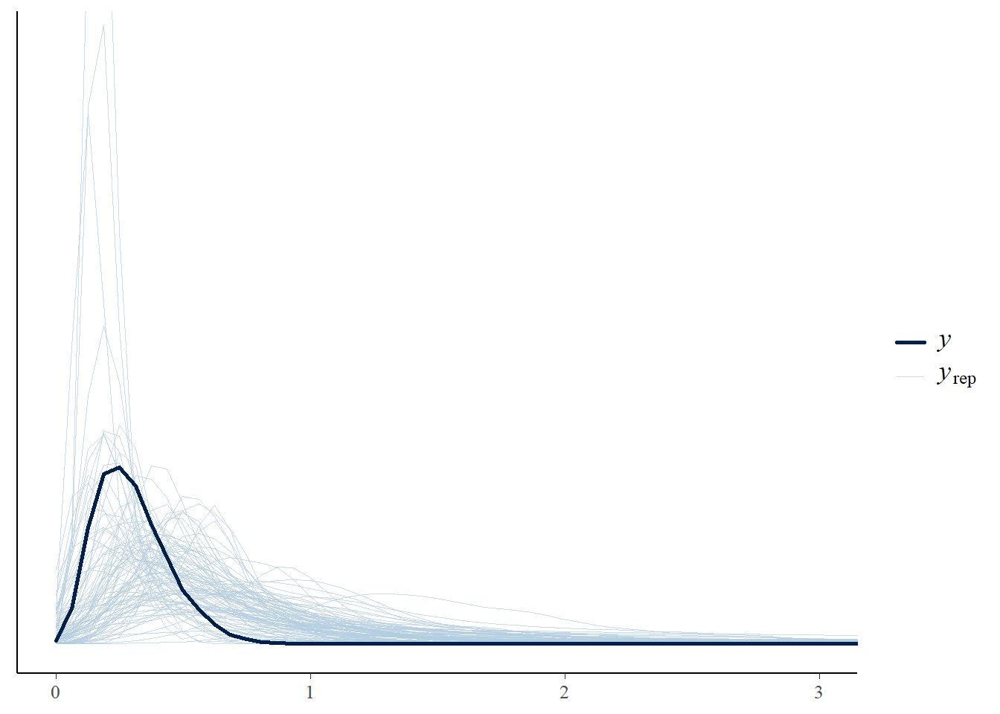<!-- -->

The prior predictive check shows that the model is able to generate data
that is consistent with the observed data.

<br>

#### Fit the model

``` r
mln_dtw = brm(average_distance_xyz ~ 1 + condition * round_c +
                (1+round_c|pair) + (1|target),
              family = lognormal(),
              prior = priors_rslope_dtw,
              data = df,
              sample_prior = T,
              warmup = nwu, iter = niter,
              control = list(adapt_delta = 0.9,
                             max_treedepth = 15),
              file = "models/speakerB/mln_dtw")

model = mln_dtw
summary(model)
```

    ##  Family: lognormal 
    ##   Links: mu = identity; sigma = identity 
    ## Formula: average_distance_xyz ~ 1 + condition * round_c + (1 + round_c | pair) + (1 | target) 
    ##    Data: df (Number of observations: 983) 
    ##   Draws: 4 chains, each with iter = 20000; warmup = 2000; thin = 1;
    ##          total post-warmup draws = 72000
    ## 
    ## Multilevel Hyperparameters:
    ## ~pair (Number of levels: 41) 
    ##                        Estimate Est.Error l-95% CI u-95% CI Rhat Bulk_ESS
    ## sd(Intercept)              0.14      0.03     0.09     0.20 1.00    29299
    ## sd(round_c)                0.06      0.02     0.03     0.10 1.00    24044
    ## cor(Intercept,round_c)     0.16      0.28    -0.40     0.68 1.00    35839
    ##                        Tail_ESS
    ## sd(Intercept)             47194
    ## sd(round_c)               28965
    ## cor(Intercept,round_c)    46479
    ## 
    ## ~target (Number of levels: 16) 
    ##               Estimate Est.Error l-95% CI u-95% CI Rhat Bulk_ESS Tail_ESS
    ## sd(Intercept)     0.06      0.03     0.01     0.12 1.00    20462    18422
    ## 
    ## Regression Coefficients:
    ##                           Estimate Est.Error l-95% CI u-95% CI Rhat Bulk_ESS
    ## Intercept                    -1.29      0.04    -1.36    -1.22 1.00    33208
    ## conditionAO_Asym             -0.04      0.07    -0.18     0.11 1.00    34927
    ## conditionAsym_Sym            -0.05      0.07    -0.18     0.08 1.00    31118
    ## round_c                       0.02      0.02    -0.01     0.06 1.00    49235
    ## conditionAO_Asym:round_c     -0.06      0.04    -0.14     0.02 1.00    44712
    ## conditionAsym_Sym:round_c     0.03      0.04    -0.04     0.10 1.00    42734
    ##                           Tail_ESS
    ## Intercept                    42185
    ## conditionAO_Asym             44018
    ## conditionAsym_Sym            39827
    ## round_c                      49784
    ## conditionAO_Asym:round_c     49217
    ## conditionAsym_Sym:round_c    46861
    ## 
    ## Further Distributional Parameters:
    ##       Estimate Est.Error l-95% CI u-95% CI Rhat Bulk_ESS Tail_ESS
    ## sigma     0.46      0.01     0.44     0.48 1.00    79971    53587
    ## 
    ## Draws were sampled using sample(hmc). For each parameter, Bulk_ESS
    ## and Tail_ESS are effective sample size measures, and Rhat is the potential
    ## scale reduction factor on split chains (at convergence, Rhat = 1).

``` r
bayestestR::hdi(model)
```

    ## Highest Density Interval
    ## 
    ## Parameter                 |        95% HDI
    ## ------------------------------------------
    ## (Intercept)               | [-1.36, -1.22]
    ## conditionAO_Asym          | [-0.18,  0.10]
    ## conditionAsym_Sym         | [-0.18,  0.08]
    ## round_c                   | [-0.01,  0.06]
    ## conditionAO_Asym:round_c  | [-0.14,  0.02]
    ## conditionAsym_Sym:round_c | [-0.04,  0.10]

``` r
# bayestestR::hdi(model, ci = 0.89)
```

The coefficients show that the visibility condition did not have a
reliable effect on the dtw distance.

<br>

#### Visualize the posterior distributions

``` r
plot_posterior(model)
```

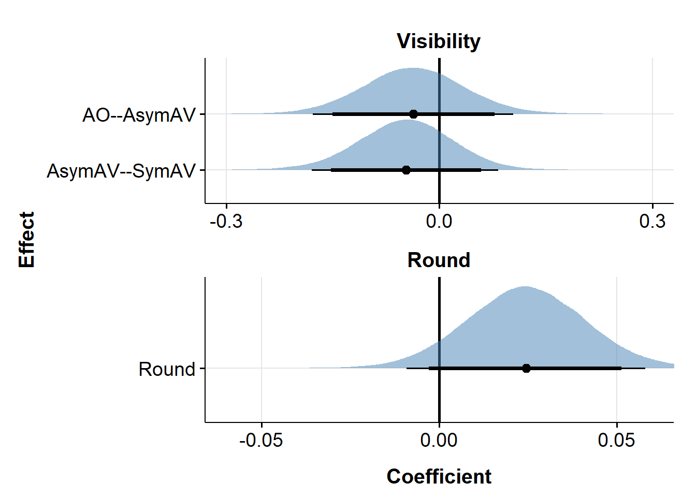<!-- -->

<br>

#### Prior-posterior update plot

``` r
post_sample = as_draws_df(model)
pp_update_plot(post_sample)
```

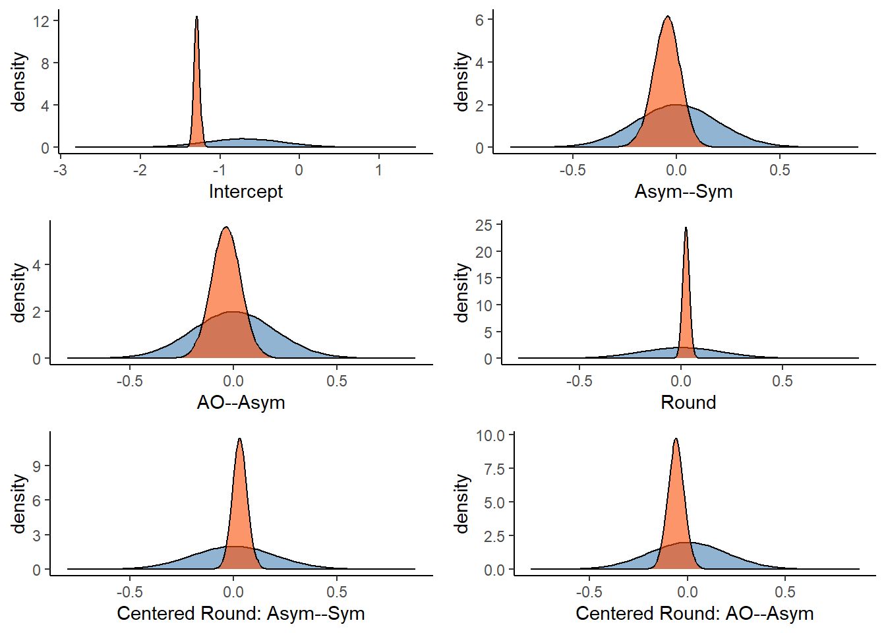<!-- -->

<br>

#### Posterior predictive check

``` r
pp_check(model, ndraws = 100) +
  coord_cartesian(xlim = c(0, 3))
```

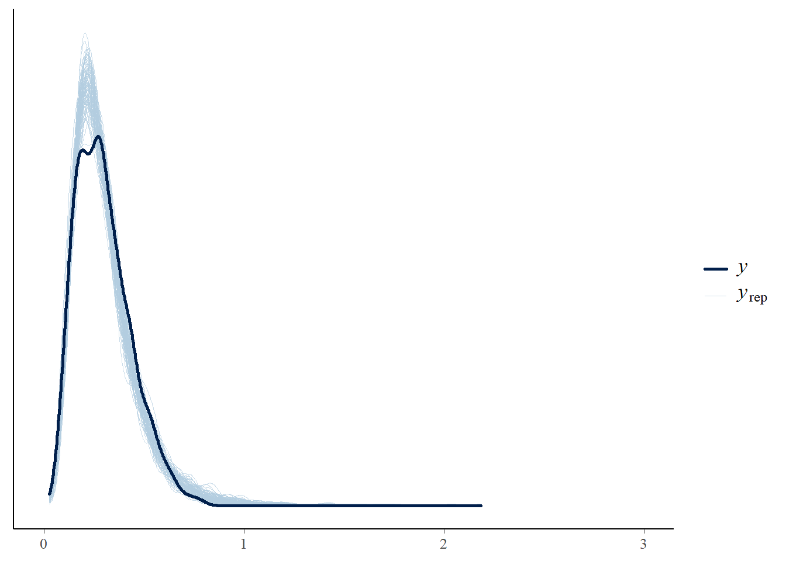<!-- -->

The posterior predictive check shows that the model is able to generate
data that is overall consistent with the observed data.

<br>

#### Hypothesis testing: Bayes factor

``` r
### varying priors for sensitivity analysis
prior_size = c("xs", "s", "l", "xl")
prior_sd = c(0.05, 0.1, 0.3, 0.5)
bfs_cond_ao_asym = c()
bfs_cond_asym_sym = c()
bfs_round = c()
bfs_ao_asym_round = c()
bfs_asym_sym_round = c()

for (i in 1:length(prior_sd)){
  priors = c(
    prior(normal(-0.7, 0.5), class = Intercept),
    set_prior(paste0("normal(0,", prior_sd[i], ")"), class = "b"),
    prior(normal(0, 0.2), class = sd),
    prior(normal(0, 0.5), class = sigma),
    prior(lkj(2), class = cor))
  
  fname = paste0("models/speakerB/mln_dtw_", prior_size[i])
  
  fit = brm(average_distance_xyz ~ 1 + condition * round_c +
              (1+round_c|pair) + (1|target),
            family = lognormal(),
            prior = priors,
            data = df,
            sample_prior = T,
            save_pars = save_pars(all = TRUE),
            warmup = nwu, iter = niter,
            control = list(adapt_delta = 0.9, 
                           max_treedepth = 15),
            file = fname)
  
  ### BF for visibility conditions
  # sym - asym
  h = hypothesis(fit, "conditionAO_Asym = 0")
  bf = 1 / abs(h$hypothesis$Evid.Ratio)
  bfs_cond_ao_asym = c(bfs_cond_ao_asym, bf)
  
  # sym - ao
  h = hypothesis(fit, "conditionAsym_Sym = 0")
  bf = 1 / abs(h$hypothesis$Evid.Ratio)
  bfs_cond_asym_sym = c(bfs_cond_asym_sym, bf)
  
  ### BF for rounds
  h = hypothesis(model, "round_c = 0")
  bf = 1 / abs(h$hypothesis$Evid.Ratio)
  bfs_round = c(bfs_round, bf)
  
  ### BF for interaction
  # ao - asym: round
  h = hypothesis(model, "conditionAO_Asym:round_c = 0")
  bf = 1 / abs(h$hypothesis$Evid.Ratio)
  bfs_ao_asym_round = c(bfs_ao_asym_round, bf)
  
  # asym - sym: round
  h = hypothesis(model, "conditionAsym_Sym:round_c = 0")
  bf = 1 / abs(h$hypothesis$Evid.Ratio)
  bfs_asym_sym_round = c(bfs_asym_sym_round, bf)
}

### add BF for the main/medium model
prior_size[3:5] = c("m", prior_size[3:4])
prior_sd[3:5] = c(0.2, prior_sd[3:4])

### BF for visibility
# sym - asym
h = hypothesis(model, "conditionAO_Asym = 0")
bf = 1 / abs(h$hypothesis$Evid.Ratio)
bfs_cond_ao_asym[3:5] = c(bf, bfs_cond_ao_asym[3:4])

# sym - ao
h = hypothesis(model, "conditionAsym_Sym = 0")
bf = 1 / abs(h$hypothesis$Evid.Ratio)
bfs_cond_asym_sym[3:5] = c(bf, bfs_cond_asym_sym[3:4])

### BF for rounds
h = hypothesis(model, "round_c = 0")
bf = 1 / abs(h$hypothesis$Evid.Ratio)
bfs_round[3:5] = c(bf, bfs_round[3:4])

### BF for interaction
# ao - asym: round
h = hypothesis(model, "conditionAO_Asym:round_c = 0")
bf = 1 / abs(h$hypothesis$Evid.Ratio)
bfs_ao_asym_round[3:5] = c(bf, bfs_ao_asym_round[3:4])

# asym - sym: round
h = hypothesis(model, "conditionAsym_Sym:round_c = 0")
bf = 1 / abs(h$hypothesis$Evid.Ratio)
bfs_asym_sym_round[3:5] = c(bf, bfs_asym_sym_round[3:4])


### make a df for BFs
df_bf = data.frame(size = prior_size,
                   sd = prior_sd,
                   ao_asym = bfs_cond_ao_asym,
                   asym_sym = bfs_cond_asym_sym,
                   round = bfs_round,
                   ao_asym_round = bfs_ao_asym_round,
                   asym_sym_round = bfs_asym_sym_round) %>% 
  mutate(prior = paste0("N(0, ", sd, ")")) %>% 
  pivot_longer(cols = c("ao_asym", "asym_sym", "round",
                        "ao_asym_round", "asym_sym_round"),
               names_to = "Effect",
               values_to = "BF10") %>% 
  mutate(Predictor = ifelse(grepl("_round", Effect), "Interaction", 
                            ifelse(grepl("round", Effect), "Round", "Visibility")))

df_bf$Effect = recode(df_bf$Effect,
                      ao_asym = "AO--AsymAV",
                      asym_sym = "AsymAV--SymAV",
                      round = "Round",
                      ao_asym_round = "AO--AsymAV:Round",
                      asym_sym_round = "AsymAV--SymAV:Round")
```

``` r
#### Plot BFs ####
ggplot(df_bf, aes(x = prior, y = BF10, group = Effect)) +
   geom_hline(yintercept = 1, linetype="dashed") +
   geom_point(aes(color=Effect)) +
   geom_line(aes(color=Effect)) +
   theme_bw(base_size = 12)+
   theme(legend.position = "top")+
   scale_y_log10("Bayes factor (BF10)",
                 breaks = c(0.001, 0.01, 0.03, 0.1, 0.33, 1, 3, 10, 30, 100, 1e4, 1e5, 1e6, 1e7),
                 labels = c(0.001, 0.01, 0.03, 0.1, 0.33, 1, 3, 10, 30, 100, 1e4, 1e5, 1e6, 1e7)) +
   xlab("prior")
```

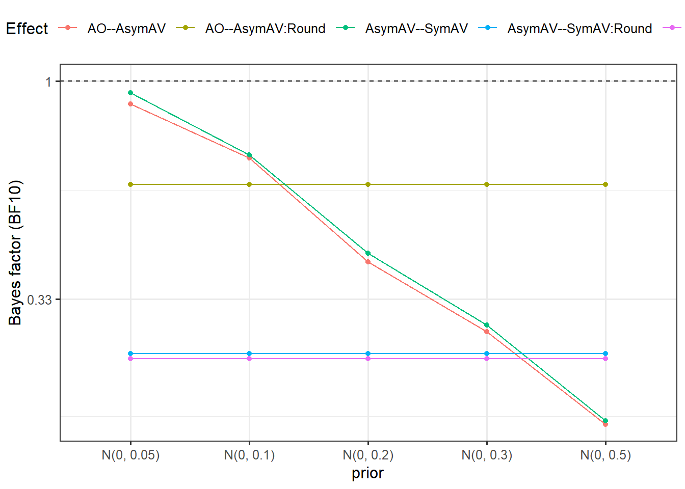<!-- -->

<br>

#### Probability of direction

``` r
p_direction(model)
```

    ## Probability of Direction
    ## 
    ## Parameter                 |     pd
    ## ----------------------------------
    ## (Intercept)               |   100%
    ## conditionAO_Asym          | 69.81%
    ## conditionAsym_Sym         | 76.84%
    ## round_c                   | 92.64%
    ## conditionAO_Asym:round_c  | 92.07%
    ## conditionAsym_Sym:round_c | 79.85%

<br>

#### Pair-wise comparison

``` r
emmeans(model, pairwise ~ condition)$contrasts
```

    ##  contrast       estimate lower.HPD upper.HPD
    ##  SymAV - AsymAV  -0.0455    -0.176    0.0878
    ##  SymAV - AO      -0.0850    -0.231    0.0567
    ##  AsymAV - AO     -0.0395    -0.180    0.1027
    ## 
    ## Point estimate displayed: median 
    ## HPD interval probability: 0.95

``` r
emmeans(model, pairwise ~ condition, level = 0.89)$contrasts
```

    ##  contrast       estimate lower.HPD upper.HPD
    ##  SymAV - AsymAV  -0.0455    -0.152    0.0598
    ##  SymAV - AO      -0.0850    -0.204    0.0294
    ##  AsymAV - AO     -0.0395    -0.154    0.0751
    ## 
    ## Point estimate displayed: median 
    ## HPD interval probability: 0.89

<!-- <br> -->
<!-- #### Visualize estimates -->
<!-- ```{r cond_effects_m1} -->
<!-- plot(conditional_effects(mln_dtw), ask = F) -->
<!-- ``` -->

<br>

### Model 2: \[ppB\] condition_sum \* round_c

``` r
mln_dtw_sum_prior = brm(average_distance_xyz ~ 1 + condition_sum * round_c +
                          (1+round_c|pair) + (1|target),
                        family = lognormal(),
                        prior = priors_rslope_dtw,
                        sample_prior = "only",
                        data = df,
                        file = "models/speakerB/mln_dtw_sum_prior")

pp_check(mln_dtw_sum_prior, ndraws = 100) +
  coord_cartesian(xlim = c(0, 3),
                  ylim = c(0, 10))
```

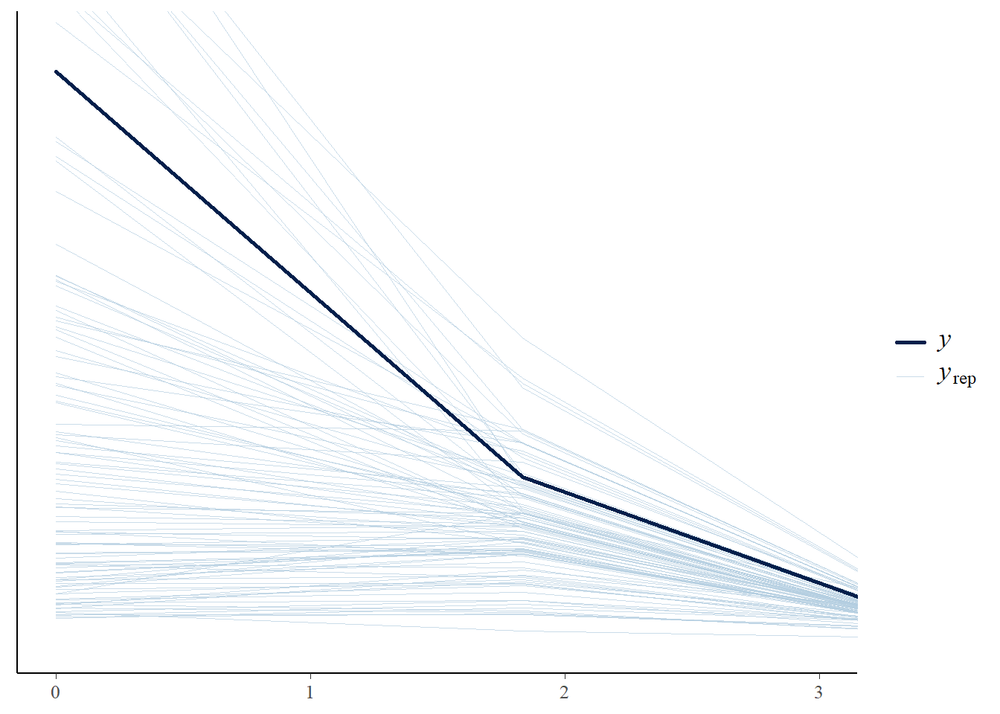<!-- -->

The prior predictive check shows that the model is able to generate data
that is consistent with the observed data.

<br>

#### Fit the model

``` r
mln_dtw_sum = brm(average_distance_xyz ~ 1 + condition_sum * round_c +
                    (1+round_c|pair) + (1|target),
                  family = lognormal(),
                  prior = priors_rslope_dtw,
                  data = df,
                  sample_prior = T,
                  warmup = nwu, iter = niter,
                  control = list(adapt_delta = 0.9,
                                 max_treedepth = 15),
                  file = "models/speakerB/mln_dtw_sum")

model1 = mln_dtw
model = mln_dtw_sum
summary(model)
```

    ##  Family: lognormal 
    ##   Links: mu = identity; sigma = identity 
    ## Formula: average_distance_xyz ~ 1 + condition_sum * round_c + (1 + round_c | pair) + (1 | target) 
    ##    Data: df (Number of observations: 983) 
    ##   Draws: 4 chains, each with iter = 20000; warmup = 2000; thin = 1;
    ##          total post-warmup draws = 72000
    ## 
    ## Multilevel Hyperparameters:
    ## ~pair (Number of levels: 41) 
    ##                        Estimate Est.Error l-95% CI u-95% CI Rhat Bulk_ESS
    ## sd(Intercept)              0.14      0.03     0.09     0.20 1.00    27225
    ## sd(round_c)                0.06      0.02     0.03     0.10 1.00    23476
    ## cor(Intercept,round_c)     0.16      0.28    -0.40     0.68 1.00    31498
    ##                        Tail_ESS
    ## sd(Intercept)             43284
    ## sd(round_c)               28995
    ## cor(Intercept,round_c)    43412
    ## 
    ## ~target (Number of levels: 16) 
    ##               Estimate Est.Error l-95% CI u-95% CI Rhat Bulk_ESS Tail_ESS
    ## sd(Intercept)     0.06      0.03     0.01     0.12 1.00    19242    16092
    ## 
    ## Regression Coefficients:
    ##                               Estimate Est.Error l-95% CI u-95% CI Rhat
    ## Intercept                        -1.29      0.03    -1.36    -1.22 1.00
    ## condition_sumAO_Sym              -0.08      0.07    -0.21     0.06 1.00
    ## condition_sumAsym_Sym            -0.04      0.07    -0.17     0.09 1.00
    ## round_c                           0.02      0.02    -0.01     0.06 1.00
    ## condition_sumAO_Sym:round_c      -0.03      0.04    -0.11     0.05 1.00
    ## condition_sumAsym_Sym:round_c     0.03      0.04    -0.04     0.10 1.00
    ##                               Bulk_ESS Tail_ESS
    ## Intercept                        28963    39746
    ## condition_sumAO_Sym              30698    43246
    ## condition_sumAsym_Sym            27299    39085
    ## round_c                          41461    45702
    ## condition_sumAO_Sym:round_c      41462    45800
    ## condition_sumAsym_Sym:round_c    36532    43460
    ## 
    ## Further Distributional Parameters:
    ##       Estimate Est.Error l-95% CI u-95% CI Rhat Bulk_ESS Tail_ESS
    ## sigma     0.46      0.01     0.44     0.48 1.00    68633    53545
    ## 
    ## Draws were sampled using sample(hmc). For each parameter, Bulk_ESS
    ## and Tail_ESS are effective sample size measures, and Rhat is the potential
    ## scale reduction factor on split chains (at convergence, Rhat = 1).

``` r
bayestestR::hdi(model)
```

    ## Highest Density Interval
    ## 
    ## Parameter                     |        95% HDI
    ## ----------------------------------------------
    ## (Intercept)                   | [-1.36, -1.22]
    ## condition_sumAO_Sym           | [-0.21,  0.06]
    ## condition_sumAsym_Sym         | [-0.17,  0.09]
    ## round_c                       | [-0.01,  0.06]
    ## condition_sumAO_Sym:round_c   | [-0.11,  0.05]
    ## condition_sumAsym_Sym:round_c | [-0.04,  0.10]

``` r
# bayestestR::hdi(model, ci = 0.89)
```

The coefficients show that the visibility condition did not have a
reliable effect on the dtw distance.

<br>

#### Visualize the posterior distributions

``` r
plot_posterior(model1, model)
```

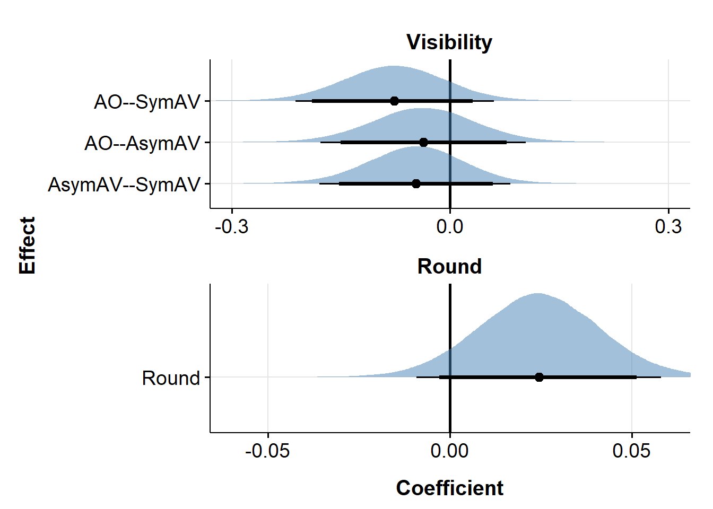<!-- -->

<br>

#### Prior-posterior update plot

``` r
post_sample = as_draws_df(model)
pp_update_plot(post_sample, interaction = T)
```

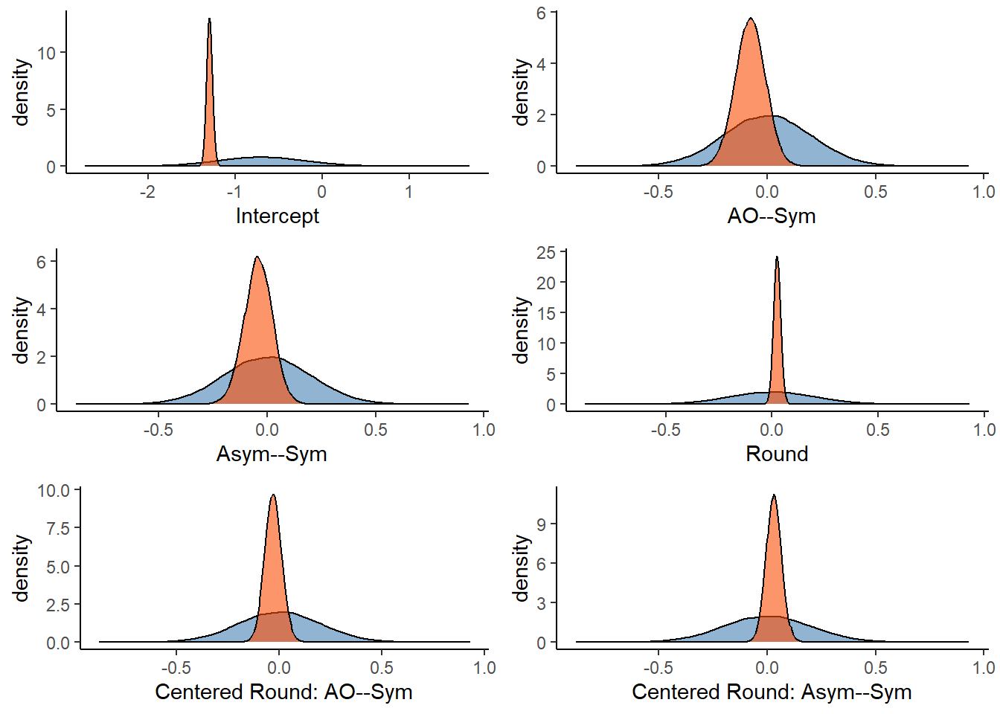<!-- -->

<br>

#### Posterior predictive check

``` r
pp_check(model, ndraws = 100) +
  coord_cartesian(xlim = c(0, 3))
```

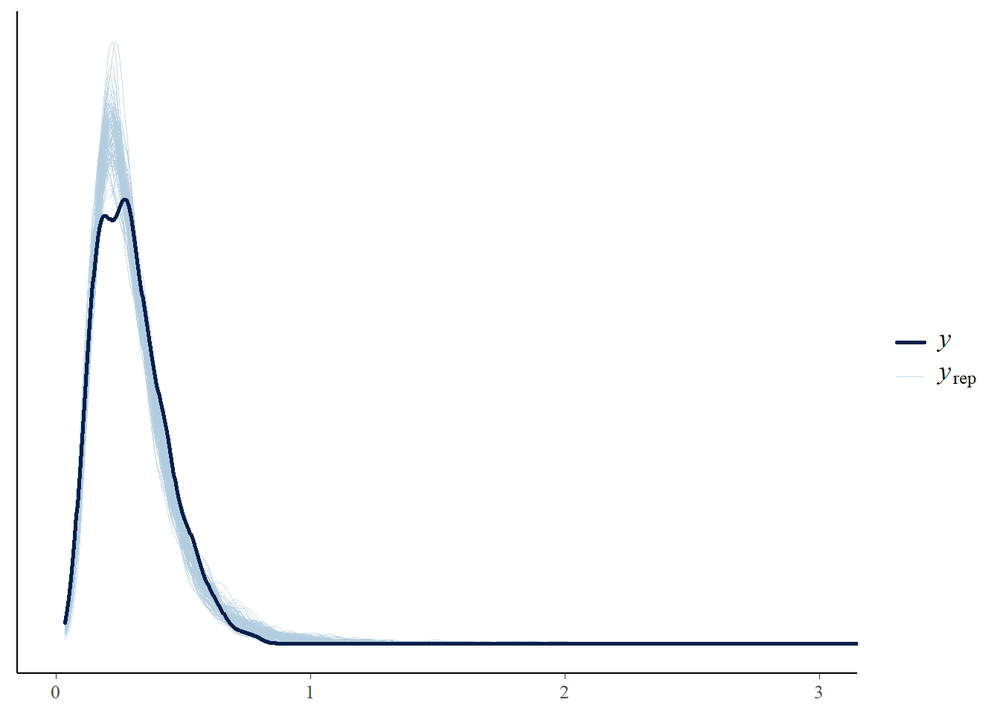<!-- -->

The posterior predictive check shows that the model is able to generate
data that is overall consistent with the observed data.

<br>

#### Hypothesis testing: Bayes factor

``` r
### varying priors for sensitivity analysis
prior_size = c("xs", "s", "l", "xl")
prior_sd = c(0.05, 0.1, 0.3, 0.5)
bfs_cond_ao_sym = c()
bfs_ao_sym_round = c()

for (i in 1:length(prior_sd)){
  priors = c(
    prior(normal(-0.7, 0.5), class = Intercept),
    set_prior(paste0("normal(0,", prior_sd[i], ")"), class = "b"),
    prior(normal(0, 0.2), class = sd),
    prior(normal(0, 0.5), class = sigma),
    prior(lkj(2), class = cor))
  
  fname = paste0("models/speakerB/mln_dtw_sum_", prior_size[i])
  
  fit = brm(average_distance_xyz ~ 1 + condition_sum * round_c +
              (1+round_c|pair) + (1|target),
            family = lognormal(),
            prior = priors,
            data = df,
            sample_prior = T,
            save_pars = save_pars(all = TRUE),
            warmup = nwu, iter = niter,
            control = list(adapt_delta = 0.9, 
                           max_treedepth = 15),
            file = fname)
  
  # BF for sym - ao
  h = hypothesis(fit, "condition_sumAO_Sym = 0")
  bf = 1 / abs(h$hypothesis$Evid.Ratio)
  bfs_cond_ao_sym = c(bfs_cond_ao_sym, bf)
  
  ### BF for interaction
  # ao - sym: round
  h = hypothesis(model, "condition_sumAO_Sym:round_c = 0")
  bf = 1 / abs(h$hypothesis$Evid.Ratio)
  bfs_ao_sym_round = c(bfs_ao_sym_round, bf)
}

### add BF for the main/medium model
prior_size[3:5] = c("m", prior_size[3:4])
prior_sd[3:5] = c(0.2, prior_sd[3:4])

# BF for sym - ao
h = hypothesis(model, "condition_sumAO_Sym = 0")
bf = 1 / abs(h$hypothesis$Evid.Ratio)
bfs_cond_ao_sym[3:5] = c(bf, bfs_cond_ao_sym[3:4])

# ao - sym: round
h = hypothesis(model, "condition_sumAO_Sym:round_c = 0")
bf = 1 / abs(h$hypothesis$Evid.Ratio)
bfs_ao_sym_round[3:5] = c(bf, bfs_ao_sym_round[3:4])


### make a df for BFs
df_bf_temp = data.frame(size = prior_size,
                   sd = prior_sd,
                   ao_sym = bfs_cond_ao_sym,
                   ao_sym_round = bfs_ao_sym_round) %>% 
  mutate(prior = paste0("N(0, ", sd, ")")) %>% 
  pivot_longer(cols = c("ao_sym", "ao_sym_round"),
               names_to = "Effect",
               values_to = "BF10") %>% 
  mutate(Predictor = ifelse(grepl("_round", Effect), "Interaction", "Visibility"))

df_bf_temp$Effect = recode(df_bf_temp$Effect,
                           ao_sym = "AO--SymAV",
                           ao_sym_round = "AO--SymAV:Round")


df_bf_new = df_bf %>% 
  rbind(df_bf_temp) %>% 
  mutate(Effect = factor(Effect,
                         levels = c("AO--SymAV", "AO--AsymAV", "AsymAV--SymAV", "Round",
                                    "AO--SymAV:Round", "AO--AsymAV:Round", "AsymAV--SymAV:Round")),
         Predictor = factor(Predictor,
                            levels = c("Visibility", "Round", "Interaction")))

df_bf_new %>% arrange(Effect, sd)
```

    ## # A tibble: 35 × 6
    ##    size     sd prior      Effect      BF10 Predictor 
    ##    <chr> <dbl> <chr>      <fct>      <dbl> <fct>     
    ##  1 xs     0.05 N(0, 0.05) AO--SymAV  0.982 Visibility
    ##  2 s      0.1  N(0, 0.1)  AO--SymAV  0.885 Visibility
    ##  3 m      0.2  N(0, 0.2)  AO--SymAV  0.617 Visibility
    ##  4 l      0.3  N(0, 0.3)  AO--SymAV  0.465 Visibility
    ##  5 xl     0.5  N(0, 0.5)  AO--SymAV  0.295 Visibility
    ##  6 xs     0.05 N(0, 0.05) AO--AsymAV 0.889 Visibility
    ##  7 s      0.1  N(0, 0.1)  AO--AsymAV 0.676 Visibility
    ##  8 m      0.2  N(0, 0.2)  AO--AsymAV 0.399 Visibility
    ##  9 l      0.3  N(0, 0.3)  AO--AsymAV 0.279 Visibility
    ## 10 xl     0.5  N(0, 0.5)  AO--AsymAV 0.174 Visibility
    ## # ℹ 25 more rows

``` r
#### Plot BFs ####
ggplot(filter(df_bf_new, Predictor != "Interaction"),
       aes(x = factor(sd), y = BF10, group = Effect)) +
  geom_hline(yintercept = 1, linetype="dashed") +
  geom_point(aes(color=Effect)) +
  geom_line(aes(color=Effect)) +
  facet_wrap(vars(Predictor)) +
  theme_clean(base_size = 15) +
  theme(axis.text.x = element_text(colour = "black", size = 14),
        axis.text.y = element_text(colour = "black", size = 14),
        axis.title = element_text(size = 15, face = 'bold'),
        axis.title.x = element_text(vjust = -2),
        axis.title.y = element_text(vjust = 2),
        legend.position = "top",
        strip.text = element_text(size = 15, face = 'bold'),
        plot.background = element_blank(),
        plot.margin = unit(c(1.1,1.1,1.1,1.1), "lines")) +
  scale_y_log10("Bayes factor (BF10)",
                limits = c(0.1, 3),
                breaks = c(0.001, 0.03, 0.01, 0.1, 0.33, 1, 3, 10, 30, 100),
                labels = c(0.001, 0.03, 0.01, 0.1, 0.33, 1, 3, 10, 30, 100)) +
  guides(color = guide_legend(ncol = 3)) +
  xlab("SD for the prior")
```

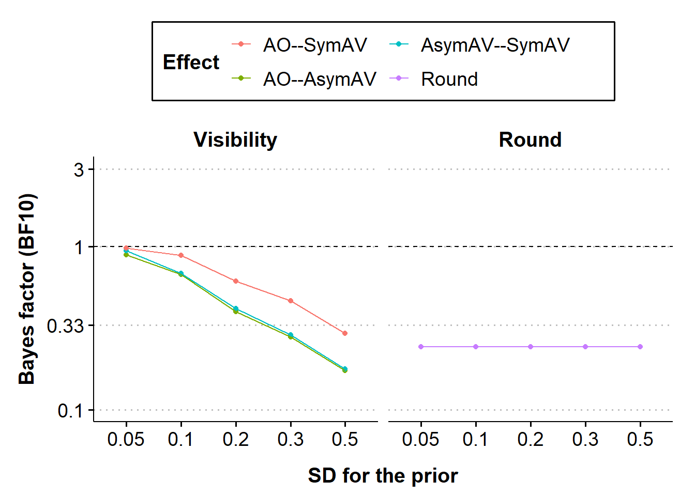<!-- -->

<br>

#### Probability of direction

``` r
p_direction(model)
```

    ## Probability of Direction
    ## 
    ## Parameter                     |     pd
    ## --------------------------------------
    ## (Intercept)                   |   100%
    ## condition_sumAO_Sym           | 86.68%
    ## condition_sumAsym_Sym         | 73.51%
    ## round_c                       | 92.82%
    ## condition_sumAO_Sym:round_c   | 76.79%
    ## condition_sumAsym_Sym:round_c | 80.67%

<br>

------------------------------------------------------------------------

# =====Session info=====

``` r
sessionInfo()
```

    ## R version 4.2.2 (2022-10-31 ucrt)
    ## Platform: x86_64-w64-mingw32/x64 (64-bit)
    ## Running under: Windows 10 x64 (build 26200)
    ## 
    ## Matrix products: default
    ## 
    ## locale:
    ## [1] LC_COLLATE=English_United States.utf8 
    ## [2] LC_CTYPE=English_United States.utf8   
    ## [3] LC_MONETARY=English_United States.utf8
    ## [4] LC_NUMERIC=C                          
    ## [5] LC_TIME=English_United States.utf8    
    ## 
    ## attached base packages:
    ## [1] parallel  stats     graphics  grDevices utils     datasets  methods  
    ## [8] base     
    ## 
    ## other attached packages:
    ##  [1] rstan_2.32.6       StanHeaders_2.32.7 svglite_2.2.2      doParallel_1.0.17 
    ##  [5] iterators_1.0.14   foreach_1.5.2      emmeans_1.10.7     tidybayes_3.0.7   
    ##  [9] bayestestR_0.15.2  brms_2.22.0        Rcpp_1.0.12        ggExtra_0.10.1    
    ## [13] plotly_4.10.4      DiagrammeR_1.0.11  ggthemes_5.1.0     ggh4x_0.3.1       
    ## [17] hypr_0.2.8         plotrix_3.8-4      lubridate_1.9.3    forcats_1.0.0     
    ## [21] stringr_1.5.1      dplyr_1.1.4        purrr_1.0.2        readr_2.1.5       
    ## [25] tidyr_1.3.1        tibble_3.2.1       ggplot2_3.5.2      tidyverse_2.0.0   
    ## 
    ## loaded via a namespace (and not attached):
    ##  [1] colorspace_2.1-0     estimability_1.5.1   QuickJSR_1.1.3      
    ##  [4] rstudioapi_0.17.1    farver_2.1.1         svUnit_1.0.6        
    ##  [7] bit64_4.0.5          mvtnorm_1.2-4        bridgesampling_1.1-2
    ## [10] codetools_0.2-18     knitr_1.50           bayesplot_1.11.1    
    ## [13] jsonlite_1.8.8       ggdist_3.3.2         shiny_1.11.1        
    ## [16] compiler_4.2.2       httr_1.4.7           backports_1.4.1     
    ## [19] Matrix_1.5-1         fastmap_1.1.1        lazyeval_0.2.2      
    ## [22] cli_3.6.2            later_1.3.2          visNetwork_2.1.2    
    ## [25] htmltools_0.5.8.1    tools_4.2.2          coda_0.19-4.1       
    ## [28] gtable_0.3.6         glue_1.7.0           reshape2_1.4.4      
    ## [31] posterior_1.6.1      V8_6.0.6             vctrs_0.6.5         
    ## [34] nlme_3.1-160         crosstalk_1.2.1      insight_1.1.0       
    ## [37] tensorA_0.36.2.1     xfun_0.53            ps_1.7.6            
    ## [40] timechange_0.3.0     mime_0.12            miniUI_0.1.1.1      
    ## [43] lifecycle_1.0.4      MASS_7.3-58.1        scales_1.3.0        
    ## [46] vroom_1.6.5          ragg_1.3.0           hms_1.1.3           
    ## [49] promises_1.3.3       Brobdingnag_1.2-9    inline_0.3.21       
    ## [52] RColorBrewer_1.1-3   curl_6.2.1           yaml_2.3.8          
    ## [55] gridExtra_2.3        loo_2.8.0            stringi_1.8.3       
    ## [58] checkmate_2.3.1      pkgbuild_1.4.6       cmdstanr_0.8.1      
    ## [61] rlang_1.1.3          pkgconfig_2.0.3      systemfonts_1.3.1   
    ## [64] matrixStats_1.3.0    distributional_0.5.0 pracma_2.4.4        
    ## [67] evaluate_1.0.3       lattice_0.20-45      rstantools_2.4.0    
    ## [70] htmlwidgets_1.6.4    labeling_0.4.3       processx_3.8.4      
    ## [73] bit_4.0.5            tidyselect_1.2.1     plyr_1.8.9          
    ## [76] magrittr_2.0.3       R6_2.6.1             generics_0.1.3      
    ## [79] pillar_1.10.1        withr_3.0.2          datawizard_1.0.1    
    ## [82] abind_1.4-8          crayon_1.5.3         arrayhelpers_1.1-0  
    ## [85] utf8_1.2.4           tzdb_0.4.0           rmarkdown_2.29      
    ## [88] grid_4.2.2           data.table_1.15.4    digest_0.6.35       
    ## [91] webshot_0.5.5        xtable_1.8-4         httpuv_1.6.15       
    ## [94] textshaping_0.3.7    stats4_4.2.2         RcppParallel_5.1.7  
    ## [97] munsell_0.5.1        viridisLite_0.4.2
