DTW distance
================
Last updated: 2026-02-16

``` r
pckgs <- c("plotly", "parallelly", "tidyverse", "plotrix", "hypr", 
           "ggthemes", "RColorBrewer", "ggh4x", "dagitty", "DiagrammeR", "patchwork",
           "DiagrammeRsvg", "rsvg", "brms", "bayestestR", "tidybayes",
           "marginaleffects", "emmeans", "doParallel", "ppcor", "svglite")
pacman::p_load(pckgs, character.only = TRUE)


### Set global options
options(digits = 3) # set the default number of digits to 3
cores = as.integer(detectCores(logical = FALSE) * 0.7) # set the number of cores to use
registerDoParallel(cores=cores) # register the number of cores to use for parallel processing
options(mc.cores = cores)
options(brms.backend = "cmdstanr")  #this will speed up the model fitting

### MCMC options
niter = 20000  #number of iterations
nwu = 2000 #number of warmups

### Rmd settings
knitr::opts_chunk$set(echo=TRUE, warning=FALSE, message=FALSE, fig.path="figures_md/speakerB/dtw/")
```

``` r
########### posterior_beta ############
posterior_beta <- function(model, round_int=TRUE){
  ### extract the posterior draws
  posterior_beta <- model %>% 
    spread_draws(`b_.*`, regex = TRUE) %>%
    mutate(ao_sym = b_conditionAO_Asym + b_conditionAsym_Sym,
           `ao_sym:round_c` = `b_conditionAO_Asym:round_c` + `b_conditionAsym_Sym:round_c`) %>%
    pivot_longer(cols = c("b_Intercept",
                          "ao_sym",
                          "b_conditionAsym_Sym",
                          "b_conditionAO_Asym",
                          "b_round_c",
                          "ao_sym:round_c",
                          "b_conditionAsym_Sym:round_c",
                          "b_conditionAO_Asym:round_c"),
                 names_to = ".variable",
                 values_to = ".value") %>%
    mutate(intercept = str_detect(.variable, "Intercept"),
           component = ifelse(str_detect(.variable, ":"), "Round", 
                              ifelse(str_detect(.variable, "round"), "Round", 
                                     ifelse(str_detect(.variable, "Intercept"), "Intercept",
                                            "Visibility"))))
  
  posterior_beta = posterior_beta %>% filter(component != "Intercept")
  
  posterior_beta = posterior_beta %>% 
    mutate(.variable = recode(.variable, 
                              "b_Intercept" = "Intercept",
                              "ao_sym" = "AO--SymAV",
                              "b_conditionAO_Asym" = "AO--AsymAV",
                              "b_conditionAsym_Sym" = "AsymAV--SymAV",
                              "b_round_c" = "Round",
                              "b_conditionAO_Asym:round_c" = "AO--Asym:Round",
                              "b_conditionAsym_Sym:round_c" = "Asym--Sym:Round",
                              "ao_sym:round_c" = "AO--Sym:Round",
                              ),
           .variable = factor(.variable,
                              levels = c("AO--AsymAV", "AsymAV--SymAV", "AO--SymAV",
                                         "Round", "AO--Asym:Round", 
                                         "Asym--Sym:Round", "AO--Sym:Round")),
           component = factor(component, 
                              levels = c("Intercept", "Visibility", "Round")))
  return(posterior_beta)
}


########### plot_posterior ############
plot_posterior <- function(df_post_beta, interaction=FALSE, include_intercept=FALSE,
                           x_lab = "Coefficient", y_lab = "Effect", title_lab = "",
                           xlim_cond=0.3, xlim_round=0.15, ncol_wrap=1){
  
  ### change variables if only main effects are plotted
  if (interaction == F) {
    # df_post_beta = filter(df_post_beta, !str_detect(.variable, ":"))}
    df_post_beta = filter(df_post_beta, component != "Interaction")}
  
  fill_manual_values = c("steelblue", "steelblue", "steelblue", "steelblue")
  space_option = ifelse(ncol_wrap == 1, "free_y", "fixed")
  
  ### plot the posterior distributions
  p_posterior = ggplot(filter(df_post_beta, component != "Intercept"),
                       aes(x = .value, y = fct_rev(.variable),
                           fill = component)) +
    geom_vline(xintercept = 0, size = 1) +
    stat_halfeye(aes(slab_alpha = intercept),
                 normalize = "panels",
                 slab_alpha = 0.5,
                 .width = c(0.89, 0.95),
                 point_interval = "median_hdi") +
    scale_fill_manual(values = fill_manual_values) +
    scale_slab_alpha_discrete(range = c(0.8, 0.4)) +
    guides(fill = "none", slab_alpha = "none") +
    labs(x = x_lab, y = y_lab, title=title_lab) +
    theme_clean(base_size = 15) +
    theme(axis.text.x = element_text(colour = "black", size = 14),
          axis.text.y = element_text(colour = "black", size = 14),
          axis.title = element_text(size = 13, face = 'bold'),
          axis.title.x = element_text(vjust = -2),
          axis.title.y = element_text(vjust = 2),
          legend.position = "none",
          strip.text = element_text(size = 13, face = 'bold'),
          strip.background = element_blank(),
          plot.title.position = "plot",
          panel.grid.major.x = element_line(color = "grey90",
                                            linetype = "solid",
                                            size = 0.5),
          panel.grid.major.y = element_line(color = "grey90",
                                            linetype = "solid",
                                            size = 0.5),
          plot.background = element_blank(),
          plot.margin = unit(c(1.1,1.1,1.1,1.1), "lines")) +
    facet_wrap(vars(component), ncol = ncol_wrap,
               scales = "free", space = space_option) +
    facetted_pos_scales(
      x = list(
        scale_x_continuous(limits = c(-xlim_cond, xlim_cond)),
        scale_x_continuous(limits = c(-xlim_round, xlim_round))
      ))
  
  return(p_posterior)
}


########### pp_update_plot ############
pp_update_plot <- function(post_sample, interaction=TRUE){
  sum = ifelse("b_condition_sumAO_Sym" %in% colnames(post_sample), T, F)
  
  intercept = ggplot(post_sample) +
    geom_density(aes(prior_Intercept), fill="steelblue", color="black",alpha=0.6) +
    geom_density(aes(b_Intercept), fill="#FC4E07", color="black",alpha=0.6) + 
    xlab('Intercept') +
    theme_classic()
  
  ### Visibility condition
  cond1 = ggplot(post_sample) +
    geom_density(aes(prior_b), fill="steelblue", color="black",alpha=0.6) +
    geom_density(aes(b_conditionAsym_Sym), fill="#FC4E07", color="black",alpha=0.6) + 
    xlab('Asym--Sym') +
    theme_classic()
  cond2 = ggplot(post_sample) +
    geom_density(aes(prior_b), fill="steelblue", color="black",alpha=0.6) +
    geom_density(aes(b_conditionAO_Asym), fill="#FC4E07", color="black",alpha=0.6) + 
    xlab('AO--Asym') +
    theme_classic()
  
  ### Round
  if (interaction) {
    round = ggplot(post_sample) +
      geom_density(aes(prior_b), fill="steelblue", color="black",alpha=0.6) +
      geom_density(aes(b_round_c), fill="#FC4E07", color="black",alpha=0.6) + 
      xlab('Round') +
      theme_classic()
    cond1_round = ggplot(post_sample) +
      geom_density(aes(prior_b), fill="steelblue", color="black",alpha=0.6) +
      geom_density(aes(`b_conditionAsym_Sym:round_c`), fill="#FC4E07", color="black",alpha=0.6) + 
      xlab('Centered Round: Asym--Sym') +
      theme_classic()
    cond2_round = ggplot(post_sample) +
      geom_density(aes(prior_b), fill="steelblue", color="black",alpha=0.6) +
      geom_density(aes(`b_conditionAO_Asym:round_c`), fill="#FC4E07", color="black",alpha=0.6) + 
      xlab('Centered Round: AO--Asym') +
      theme_classic()
  }
  
  ### display the plots
  if (interaction==F){
    gridExtra::grid.arrange(intercept, cond1, cond2, ncol=2)
  } else {
    gridExtra::grid.arrange(intercept, cond1, cond2, round, 
                            cond1_round, cond2_round, 
                            ncol=2)
  }
}


### ggplotly-based function
interactive_plot <- function(p){
  # use ggplotly only if the output format is not GitHub markdown
  if (knitr::pandoc_to("gfm")) p else ggplotly(p)
}
```

# =====Data preparation=====

## Load data

### df_dtw

Here, we will load the dtw_distance.csv dataframe.

``` r
### dtw_distance.csv
fct_columns = c("pair", "referent", 
                "speaker_1", "round_1", "trial_1", "target_1", 
                "speaker_2", "round_2", "trial_2", "target_2")

df_dtw = read_csv("data/dtw_distance_mirrored.csv") %>% 
  mutate(pair = as.numeric(pair),
         target = target_2,
         across(fct_columns, as.factor),
         round = round_2,
         speaker = speaker_2) %>% 
  dplyr::select(pair, round, target, comparison_id, 
                average_distance_xyz, speaker, referent:duration_2) %>% 
  filter(!is.na(round))

head(df_dtw)
```

    ## # A tibble: 6 × 33
    ##   pair  round target comparison_id average_distance_xyz speaker referent
    ##   <fct> <fct>  <dbl>         <dbl>                <dbl> <fct>   <fct>   
    ## 1 1     2          9             1               0.0707 B       09B     
    ## 2 1     2          9             2               0.183  B       09A     
    ## 3 1     1          6             3               0.154  A       06B     
    ## 4 1     1          6             4               0.142  A       06D     
    ## 5 1     2          6             5               0.386  A       06C     
    ## 6 1     3          6             6               0.211  B       06B     
    ## # ℹ 26 more variables: speaker_1 <fct>, round_1 <fct>, trial_1 <fct>,
    ## #   director_1 <chr>, target_1 <fct>, accuracy_1 <lgl>,
    ## #   A_gesture_referent_1 <chr>, B_gesture_referent_1 <chr>,
    ## #   A_gesture_referent2_1 <chr>, B_gesture_referent2_1 <chr>,
    ## #   begin_time_1 <dbl>, end_time_1 <dbl>, duration_1 <dbl>, speaker_2 <fct>,
    ## #   round_2 <fct>, trial_2 <fct>, director_2 <chr>, target_2 <fct>,
    ## #   accuracy_2 <lgl>, A_gesture_referent_2 <chr>, B_gesture_referent_2 <chr>, …

### df_condition_info

``` r
### condition info
df_condition_info = read.csv("data/condition_info.csv", stringsAsFactors = TRUE) %>% 
  mutate(pair = factor(pair),
         condition = factor(condition,
                            levels = c("Sym", "Asym", "AO"),
                            labels = c("SymAV", "AsymAV", "AO")))
head(df_condition_info)
```

    ##   pair condition
    ## 1    1     SymAV
    ## 2    2    AsymAV
    ## 3    3        AO
    ## 4    4     SymAV
    ## 5    5     SymAV
    ## 6    6    AsymAV

## Merge dataframes

``` r
### merge dataframes
df = df_dtw %>% 
  left_join(df_condition_info, by="pair") %>%
  dplyr::select(comparison_id, pair, condition, round, 
                speaker, target, referent, average_distance_xyz) %>% 
  mutate(condition_sum = condition,
         round_c = as.integer(round) - mean(as.integer(round))) #centered round

df_all = df

df = df %>% 
  filter(speaker == "B")
```

<br>

# =====Summarize data=====

## Group by pair \* speaker

### mean by condition

``` r
summarize_data <- function(df){
  df %>% 
    summarize(n = n(),
              # dtw distance
              mean_dis = mean(average_distance_xyz, na.rm = FALSE),
              sd_dis = sd(average_distance_xyz, na.rm = FALSE),
              se_dis = std.error(average_distance_xyz, na.rm = FALSE),
              lci_dis = mean_dis - qt(1 - (0.05 / 2), n - 1) * se_dis,
              uci_dis = mean_dis + qt(1 - (0.05 / 2), n - 1) * se_dis) %>%
    ungroup()
}


### create df where each row represents a pair.
df_by_pair = df_all %>% 
  group_by(pair, condition, speaker) %>% 
  summarize_data()


### create df where each row represents a condition.
df_by_cond = df_all %>% 
  group_by(condition, speaker) %>% 
  summarize_data()

df_by_cond
```

    ## # A tibble: 6 × 8
    ##   condition speaker     n mean_dis sd_dis  se_dis lci_dis uci_dis
    ##   <fct>     <fct>   <int>    <dbl>  <dbl>   <dbl>   <dbl>   <dbl>
    ## 1 SymAV     A         430    0.310  0.145 0.00702   0.296   0.323
    ## 2 SymAV     B         387    0.297  0.142 0.00720   0.282   0.311
    ## 3 AsymAV    A         374    0.305  0.132 0.00685   0.291   0.318
    ## 4 AsymAV    B         375    0.297  0.131 0.00676   0.284   0.311
    ## 5 AO        A         187    0.336  0.132 0.00963   0.317   0.355
    ## 6 AO        B         221    0.298  0.134 0.00905   0.281   0.316

### mean by round

``` r
### create df where each row represents a pair and a round.
df_by_pair_round = df_all %>% 
  group_by(pair, condition, round, speaker) %>% 
  summarize_data()

### create df where each row represents a round.
df_by_round = df_all %>% 
  group_by(round, speaker) %>% 
  summarize_data()

df_by_round
```

    ## # A tibble: 12 × 8
    ##    round speaker     n mean_dis sd_dis  se_dis lci_dis uci_dis
    ##    <fct> <fct>   <int>    <dbl>  <dbl>   <dbl>   <dbl>   <dbl>
    ##  1 1     A         155    0.304  0.144 0.0116    0.281   0.327
    ##  2 1     B         113    0.297  0.131 0.0123    0.272   0.321
    ##  3 2     A         293    0.318  0.144 0.00840   0.301   0.334
    ##  4 2     B         281    0.295  0.132 0.00788   0.279   0.310
    ##  5 3     A         200    0.311  0.138 0.00979   0.292   0.331
    ##  6 3     B         238    0.297  0.140 0.00907   0.279   0.315
    ##  7 4     A         145    0.316  0.140 0.0116    0.293   0.339
    ##  8 4     B         158    0.292  0.136 0.0108    0.270   0.313
    ##  9 5     A         109    0.318  0.130 0.0124    0.294   0.343
    ## 10 5     B         107    0.297  0.135 0.0130    0.271   0.323
    ## 11 6     A          89    0.302  0.120 0.0127    0.277   0.327
    ## 12 6     B          86    0.318  0.146 0.0157    0.287   0.349

### mean by condition x round

``` r
### create df where each row represents a condition x round.
df_by_cond_round = df_all %>% 
  group_by(condition, round, speaker) %>% 
  summarize_data()

df_by_cond_round
```

    ## # A tibble: 36 × 9
    ##    condition round speaker     n mean_dis sd_dis se_dis lci_dis uci_dis
    ##    <fct>     <fct> <fct>   <int>    <dbl>  <dbl>  <dbl>   <dbl>   <dbl>
    ##  1 SymAV     1     A          49    0.306  0.161 0.0230   0.260   0.352
    ##  2 SymAV     1     B          49    0.287  0.133 0.0190   0.248   0.325
    ##  3 SymAV     2     A         144    0.313  0.149 0.0124   0.288   0.337
    ##  4 SymAV     2     B         106    0.284  0.135 0.0131   0.258   0.310
    ##  5 SymAV     3     A          78    0.302  0.142 0.0161   0.270   0.334
    ##  6 SymAV     3     B          98    0.305  0.145 0.0146   0.276   0.334
    ##  7 SymAV     4     A          70    0.312  0.150 0.0179   0.276   0.348
    ##  8 SymAV     4     B          62    0.300  0.160 0.0203   0.259   0.340
    ##  9 SymAV     5     A          45    0.314  0.137 0.0204   0.272   0.355
    ## 10 SymAV     5     B          41    0.292  0.133 0.0208   0.250   0.335
    ## # ℹ 26 more rows

<br>

## Speaker B only

``` r
#=====condition=====
df_by_pair_B = df %>% 
  group_by(pair, condition) %>% 
  summarize_data()

df_by_cond_B = df %>% 
  group_by(condition) %>% 
  summarize_data()


#=====cond*round=====
df_by_pair_round_B = df %>% 
  group_by(pair, condition, round) %>% 
  summarize_data()

df_by_round_B = df %>% 
  group_by(round) %>% 
  summarize_data()

df_by_cond_round_B = df %>% 
  group_by(condition, round) %>% 
  summarize_data()
```

<br>

------------------------------------------------------------------------

# =====Data visualization=====

## per speaker

### rcp: dtw distance by condition

``` r
rcp_distance = df_all %>%
  ggplot(aes(x = condition, y = average_distance_xyz,
             fill = condition)) +
  ggdist::stat_halfeye(adjust = 1, width = 0.3, .width = 0,
                       point_color = NA, alpha = 0.6, justification = -0.5) +
  geom_jitter(aes(x = stage(start = condition, after_scale = x - 0.2)),
              size = 0.2, alpha = 0.3, width = 0.07, height = 0) +
  geom_boxplot(width = .2,
               outlier.shape = NA, 
               alpha = 0.7, 
               color = "black") +
  geom_point(data = df_by_cond, 
             aes(y = mean_dis), 
             shape = 21, size = 3, fill = "white") +
  labs(x="Visibility", 
       y="DTW distance") +
  scale_y_continuous(limits = c(0, 1)) +
  scale_fill_manual(values = c("#ED6B06", "#00786A", "darkgrey")) +
  theme_clean(base_size = 15) +
  theme(axis.text.x = element_text(colour = "black", size = 14),
        axis.text.y = element_text(colour = "black", size = 14),
        axis.title = element_text(size = 15, face = 'bold'),
        axis.title.x = element_text(vjust = -2),
        axis.title.y = element_text(vjust = 2),
        legend.position = "none",
        strip.text = element_text(size = 13, face = 'bold'),
        plot.background = element_blank(),
        plot.margin = unit(c(1.1,1.1,1.1,1.1), "lines")) +
  facet_grid(~speaker)

rcp_distance
```

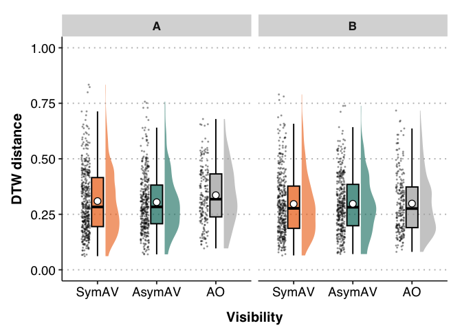<!-- -->

<br>

### bp: dtw distance by condition

``` r
bp_distance = df_all %>%
  ggplot(aes(x = condition, y = average_distance_xyz,
             fill = condition)) +
  geom_jitter(aes(x = stage(start = condition)),
              size = 0.15, alpha = 0.15, width = 0.07, height = 0) +
  geom_boxplot(width = .3,
               outlier.shape = NA, 
               alpha = 0.7, 
               color = "black") +
  geom_point(data = df_by_cond, 
             aes(y = mean_dis), 
             shape = 21, size = 3, fill = "white") +
  labs(x="Visibility", 
       y="DTW distance") +
  scale_y_continuous(limits = c(0, 0.9)) +
  scale_fill_manual(values = c("#ED6B06", "#00786A", "darkgrey")) +
  theme_clean(base_size = 15) +
  theme(axis.text.x = element_text(colour = "black", size = 14),
        axis.text.y = element_text(colour = "black", size = 14),
        axis.title = element_text(size = 15, face = 'bold'),
        axis.title.x = element_text(vjust = -2),
        axis.title.y = element_text(vjust = 2),
        legend.position = "none",
        strip.text = element_text(size = 13, face = 'bold'),
        plot.background = element_blank(),
        plot.margin = unit(c(1.1,1.1,1.1,1.1), "lines")) +
  facet_grid(~speaker)

bp_distance
```

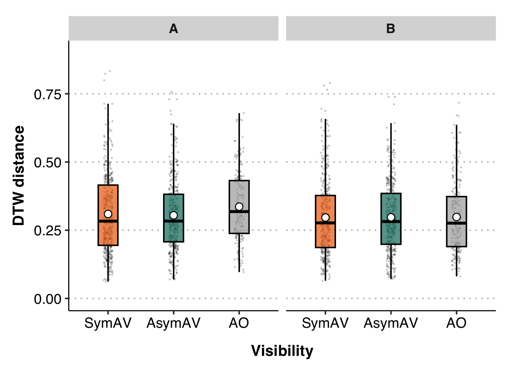<!-- -->

<br>

### bp: distance by condition x round

``` r
bp_distance_by_cond_round = 
  ggplot(df_all, 
         aes(x=round, y = average_distance_xyz, fill = condition)) +
  geom_jitter(aes(x = stage(start = round)), 
              size = 0.3, alpha = 0.2, width = 0.07, height = 0.02) +
  geom_boxplot(width = .5,
               outlier.shape = NA, alpha = 0.7) +
  geom_point(data = df_by_cond_round, 
             aes(y = mean_dis, group = round), 
             shape = 21, size = 2, fill = "white") +
  labs(x = "Round",
       y = "DTW distance") +
  scale_fill_manual(values = c("#ED6B06", "#00786A", "darkgrey")) +
  scale_y_continuous(limits = c(0, 0.9)) +
  theme_clean(base_size = 15) +
  theme(axis.text.x = element_text(colour = "black", size = 14),
        axis.text.y = element_text(colour = "black", size = 14),
        axis.title = element_text(size = 15, face = 'bold'),
        axis.title.x = element_text(vjust = -2),
        axis.title.y = element_text(vjust = 2),
        legend.position = "none",
        strip.background = element_blank(),
        strip.text = element_text(size = 13, face = 'bold'),
        plot.background = element_blank(),
        plot.margin = unit(c(1.1,1.1,1.1,1.1), "lines")) +
  facet_grid(rows = vars(speaker),
             cols = vars(condition))

interactive_plot(bp_distance_by_cond_round)
```

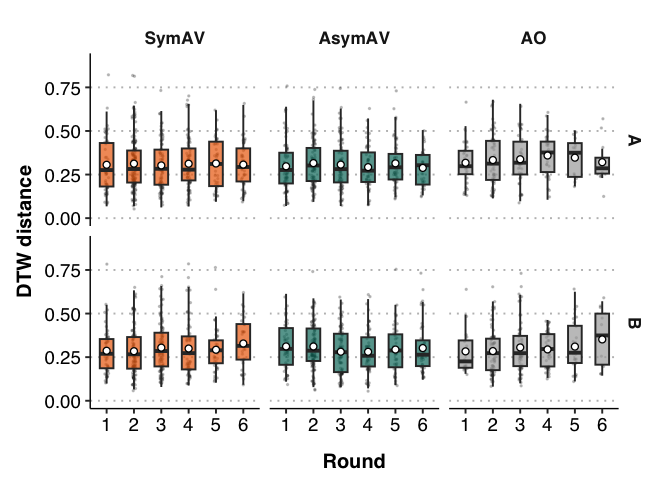<!-- -->

<br>

## speaker B only

### rcp: dtw distance by condition

``` r
rcp_distance = df %>%
  ggplot(aes(x = condition, y = average_distance_xyz,
             fill = condition)) +
  ggdist::stat_halfeye(adjust = 1, width = 0.3, .width = 0,
                       point_color = NA, alpha = 0.6, justification = -0.5) +
  geom_jitter(aes(x = stage(start = condition, after_scale = x - 0.2)),
              size = 0.2, alpha = 0.3, width = 0.07, height = 0) +
  geom_boxplot(width = .2,
               outlier.shape = NA, 
               alpha = 0.7, 
               color = "black") +
  geom_point(data = df_by_cond_B, 
             aes(y = mean_dis), 
             shape = 21, size = 3, fill = "white") +
  labs(x="Visibility", 
       y="DTW distance") +
  scale_y_continuous(limits = c(0, 1)) +
  scale_fill_manual(values = c("#ED6B06", "#00786A", "darkgrey")) +
  theme_clean(base_size = 15) +
  theme(axis.text.x = element_text(colour = "black", size = 14),
        axis.text.y = element_text(colour = "black", size = 14),
        axis.title = element_text(size = 15, face = 'bold'),
        axis.title.x = element_text(vjust = -2),
        axis.title.y = element_text(vjust = 2),
        legend.position = "none",
        strip.text = element_text(size = 13, face = 'bold'),
        plot.background = element_blank(),
        plot.margin = unit(c(1.1,1.1,1.1,1.1), "lines"))

rcp_distance
```

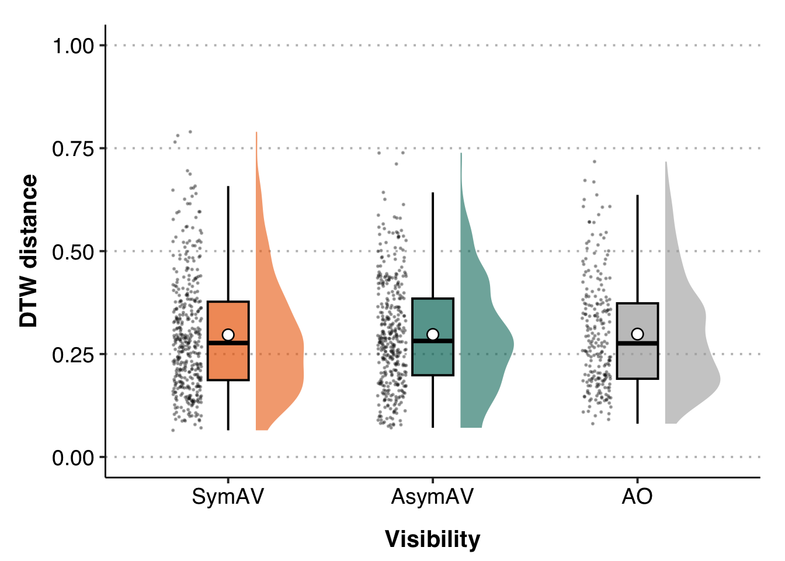<!-- -->

<br>

### bp: dtw distance by condition

``` r
bp_distance = df %>%
  ggplot(aes(x = condition, y = average_distance_xyz,
             fill = condition)) +
  geom_jitter(aes(x = stage(start = condition)),
              size = 0.15, alpha = 0.15, width = 0.07, height = 0) +
  geom_boxplot(width = .3,
               outlier.shape = NA, 
               alpha = 0.7, 
               color = "black") +
  geom_point(data = df_by_cond_B, 
             aes(y = mean_dis), 
             shape = 21, size = 3, fill = "white") +
  labs(x="Visibility", 
       y="DTW distance",
       title = "A. DTW distance across visibility") +
  scale_y_continuous(limits = c(0, 0.9)) +
  scale_fill_manual(values = c("#ED6B06", "#00786A", "darkgrey")) +
  theme_clean(base_size = 15) +
  theme(axis.text.x = element_text(colour = "black", size = 14),
        axis.text.y = element_text(colour = "black", size = 14),
        axis.title = element_text(size = 15, face = 'bold'),
        axis.title.x = element_text(vjust = -2),
        axis.title.y = element_text(vjust = 2),
        legend.position = "none",
        strip.background = element_blank(),
        strip.text = element_text(size = 13, face = 'bold'),
        plot.title = element_text(face = 'bold'),
        plot.title.position = "plot", # left align the title
        plot.background = element_blank(),
        plot.margin = unit(c(1.1,1.1,1.1,1.1), "lines"))

bp_distance
```

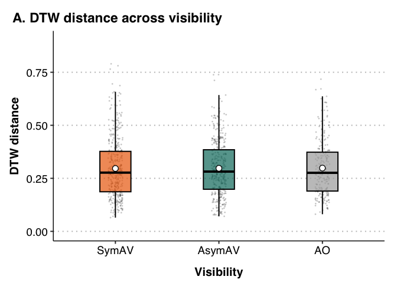<!-- -->

<br>

### bp: distance by condition x round

``` r
bp_distance_by_cond_round = 
  ggplot(df, 
         aes(x=round, y = average_distance_xyz, fill = condition)) +
  geom_jitter(aes(x = stage(start = round)), 
              size = 0.3, alpha = 0.2, width = 0.07, height = 0.02) +
  geom_boxplot(width = .5,
               outlier.shape = NA, alpha = 0.7) +
  geom_point(data = df_by_cond_round_B, 
             aes(y = mean_dis, group = round), 
             shape = 21, size = 2, fill = "white") +
  labs(x = "Round",
       y = "DTW distance",
       title = "B. DTW distance across visibility x round") +
  scale_fill_manual(values = c("#ED6B06", "#00786A", "darkgrey")) +
  scale_y_continuous(limits = c(0, 0.9)) +
  theme_clean(base_size = 15) +
  theme(axis.text.x = element_text(colour = "black", size = 14),
        axis.text.y = element_text(colour = "black", size = 14),
        axis.title = element_text(size = 15, face = 'bold'),
        axis.title.x = element_text(vjust = -2),
        axis.title.y = element_text(vjust = 2),
        legend.position = "none",
        strip.background = element_blank(),
        strip.text = element_text(size = 13, face = 'bold'),
        plot.title.position = "plot", # left align the title
        plot.background = element_blank(),
        plot.margin = unit(c(1.1,1.1,1.1,1.1), "lines")) +
  facet_grid(cols = vars(condition))

interactive_plot(bp_distance_by_cond_round)
```

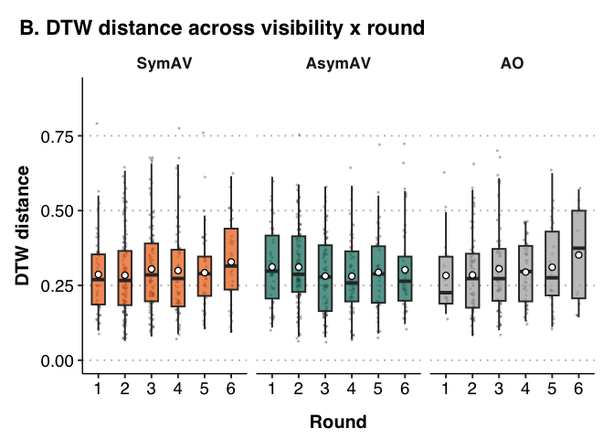<!-- -->

<br>

------------------------------------------------------------------------

# =====DTW distance=====

## —Causal model—

We assume the following causal model:

``` r
### dag
grViz(
  "digraph {
  graph [ranksep = 0.3]
  node [shape = plaintext]
    X [label = Visibility, fontcolor = forestgreen]
    Y [label = DTW_distance, fontcolor = darkorange]
    Z [label = Round]
  edge [minlen = 2.5]
    {X -> Y
    Z -> Y}
  {rank = same; X; Y}
  }"
)
```

<div class="grViz html-widget html-fill-item" id="htmlwidget-8c7b7fe1ae8b6cdf8191" style="width:384px;height:384px;"></div>
<script type="application/json" data-for="htmlwidget-8c7b7fe1ae8b6cdf8191">{"x":{"diagram":"digraph {\n  graph [ranksep = 0.3]\n  node [shape = plaintext]\n    X [label = Visibility, fontcolor = forestgreen]\n    Y [label = DTW_distance, fontcolor = darkorange]\n    Z [label = Round]\n  edge [minlen = 2.5]\n    {X -> Y\n    Z -> Y}\n  {rank = same; X; Y}\n  }","config":{"engine":"dot","options":null}},"evals":[],"jsHooks":[]}</script>

Based on the causal inference theory, including the visibility only as
fixed effects can estimate its causal effect on DTW distance. As adding
rounds should not influence the estiamtes of visibility, we will include
rounds as well.

<br>

## —Contrast coding—

``` r
### visibility condition: difference coding
h_cond = hypr(AO_Asym = AsymAV ~ AO,
              Asym_Sym = SymAV ~ AsymAV,
              levels = levels(df$condition))
h_cond
```

    ## hypr object containing 2 null hypotheses:
    ##  H0.AO_Asym: 0 = AsymAV - AO
    ## H0.Asym_Sym: 0 = SymAV - AsymAV
    ## 
    ## Call:
    ## hypr(AO_Asym = ~AsymAV - AO, Asym_Sym = ~SymAV - AsymAV, levels = c("SymAV", 
    ## "AsymAV", "AO"))
    ## 
    ## Hypothesis matrix (transposed):
    ##        AO_Asym Asym_Sym
    ## SymAV   0       1      
    ## AsymAV  1      -1      
    ## AO     -1       0      
    ## 
    ## Contrast matrix:
    ##        AO_Asym Asym_Sym
    ## SymAV   1/3     2/3    
    ## AsymAV  1/3    -1/3    
    ## AO     -2/3    -1/3

``` r
contrasts(df$condition) = contr.hypothesis(h_cond)
```

<br>

## Log-normal: \[ppB\] condition \* round_c

### Prior specification

The mediapipe estimates the locations of each keypoint in the video
frame with a number between 0 (top, left) and 1 (bottom, right). As we
use normalized dtw distance in which the sum of the distance is
normalized by the duration of the annotated gestures, we can assume that
most of the dtw distances should be between 0 and 1. Therefore, we
expect the mean dtw distance to be around 0.5 and the most likely range
of the dtw distance to be between 0 and 1.

Given that the dtw distance cannot be negative, it is not optimal to
model the dtw distance with a normal distribution (linear regression).
Instead, we will use a log-normal distribution to model the dtw
distance. The log-normal distribution is a continuous probability
distribution of a random variable whose logarithm is normally
distributed. The log-normal distribution is a good choice for modeling
the dtw distance because it is always positive and has a long tail to
the right.

For log-normal regressions, priors need to be specified on the log
scale. As such, we will set a prior for the intercept to be Normal(-0.7,
0.5). This means that we expect the most likely distance score is to be
0.5 (exp(-0.7)) and that the 95% of the time the mean to fall between
0.18 (exp(-1.7)) and 2.01 (exp(0.7)). This prior is weakly informative,
as it is still informative about the mean while allowing for a wide
range of values.

As for the fixed effects, we will set unbiased priors of Normal(0, 0.2).
This means that when the mean distance score is 0.5, we expect it to
change to 0.33 (exp(-1.1)) or 0.74 (exp(-0.3)) when x increased by 1
(e.g., contrast between AO–AsymAV conditions). This prior is “unbiased”
because we are telling the model that most likely values for the slopes
are around 0 (i.e., no effect).

As for the random effects, we will set unbiased priors of Normal(0,
0.5).

We will use LKJ(2) prior for the correlation matrix.

``` r
priors_rint_dtw = c(
  prior(normal(-0.7, 0.5), class = Intercept),
  prior(normal(0, 0.2), class = b),
  prior(normal(0, 0.2), class = sd),
  prior(normal(0, 0.5), class = sigma))

priors_rslope_dtw = c(
  prior(normal(-0.7, 0.5), class = Intercept),
  prior(normal(0, 0.2), class = b),
  prior(normal(0, 0.2), class = sd),
  prior(normal(0, 0.5), class = sigma),
  prior(lkj(2), class = cor))
```

<br>

### Prior predictive check

``` r
mln_dtw_prior = brm(average_distance_xyz ~ 1 + condition * round_c +
                      (1+round_c|pair) + (1|target),
                    family = lognormal(),
                    prior = priors_rslope_dtw,
                    sample_prior = "only",
                    data = df,
                    file = "models/speakerB/dtw/mln_dtw_prior")

pp_check(mln_dtw_prior, ndraws = 100) +
  coord_cartesian(xlim = c(0, 3),
                  ylim = c(0, 10))
```

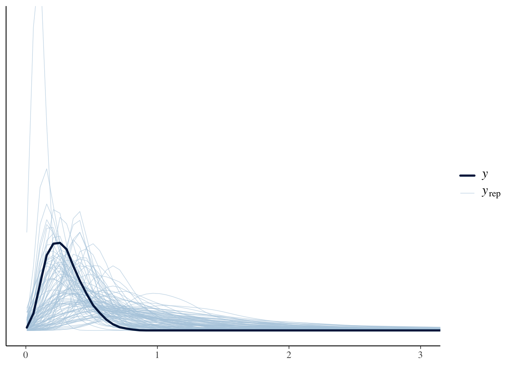<!-- -->

The prior predictive check shows that the model is able to generate data
that is consistent with the observed data.

<br>

### Fit the model

``` r
mln_dtw = brm(average_distance_xyz ~ 1 + condition * round_c +
                (1+round_c|pair) + (1|target),
              family = lognormal(),
              prior = priors_rslope_dtw,
              data = df,
              sample_prior = T,
              warmup = nwu, iter = niter,
              control = list(adapt_delta = 0.9,
                             max_treedepth = 15),
              file = "models/speakerB/dtw/mln_dtw")

model = mln_dtw
summary(model)
```

    ##  Family: lognormal 
    ##   Links: mu = identity 
    ## Formula: average_distance_xyz ~ 1 + condition * round_c + (1 + round_c | pair) + (1 | target) 
    ##    Data: df (Number of observations: 983) 
    ##   Draws: 4 chains, each with iter = 20000; warmup = 2000; thin = 1;
    ##          total post-warmup draws = 72000
    ## 
    ## Multilevel Hyperparameters:
    ## ~pair (Number of levels: 41) 
    ##                        Estimate Est.Error l-95% CI u-95% CI Rhat Bulk_ESS
    ## sd(Intercept)              0.14      0.03     0.09     0.20 1.00    29299
    ## sd(round_c)                0.06      0.02     0.03     0.10 1.00    24044
    ## cor(Intercept,round_c)     0.16      0.28    -0.40     0.68 1.00    35839
    ##                        Tail_ESS
    ## sd(Intercept)             47194
    ## sd(round_c)               28965
    ## cor(Intercept,round_c)    46479
    ## 
    ## ~target (Number of levels: 16) 
    ##               Estimate Est.Error l-95% CI u-95% CI Rhat Bulk_ESS Tail_ESS
    ## sd(Intercept)     0.06      0.03     0.01     0.12 1.00    20462    18422
    ## 
    ## Regression Coefficients:
    ##                           Estimate Est.Error l-95% CI u-95% CI Rhat Bulk_ESS
    ## Intercept                    -1.29      0.04    -1.36    -1.22 1.00    33208
    ## conditionAO_Asym             -0.04      0.07    -0.18     0.11 1.00    34927
    ## conditionAsym_Sym            -0.05      0.07    -0.18     0.08 1.00    31118
    ## round_c                       0.02      0.02    -0.01     0.06 1.00    49235
    ## conditionAO_Asym:round_c     -0.06      0.04    -0.14     0.02 1.00    44712
    ## conditionAsym_Sym:round_c     0.03      0.04    -0.04     0.10 1.00    42734
    ##                           Tail_ESS
    ## Intercept                    42185
    ## conditionAO_Asym             44018
    ## conditionAsym_Sym            39827
    ## round_c                      49784
    ## conditionAO_Asym:round_c     49217
    ## conditionAsym_Sym:round_c    46861
    ## 
    ## Further Distributional Parameters:
    ##       Estimate Est.Error l-95% CI u-95% CI Rhat Bulk_ESS Tail_ESS
    ## sigma     0.46      0.01     0.44     0.48 1.00    79971    53587
    ## 
    ## Draws were sampled using sample(hmc). For each parameter, Bulk_ESS
    ## and Tail_ESS are effective sample size measures, and Rhat is the potential
    ## scale reduction factor on split chains (at convergence, Rhat = 1).

``` r
bayestestR::hdi(model)
```

    ## Highest Density Interval
    ## 
    ## Parameter                 |        95% HDI
    ## ------------------------------------------
    ## (Intercept)               | [-1.36, -1.22]
    ## conditionAO_Asym          | [-0.18,  0.10]
    ## conditionAsym_Sym         | [-0.18,  0.08]
    ## round_c                   | [-0.01,  0.06]
    ## conditionAO_Asym:round_c  | [-0.14,  0.02]
    ## conditionAsym_Sym:round_c | [-0.04,  0.10]

``` r
# bayestestR::hdi(model, ci = 0.89)
```

The coefficients show that the visibility condition did not have a
reliable effect on the dtw distance.

<br>

### Posterior predictive check

``` r
pp_check(model, ndraws = 100, 
         type = "dens_overlay_grouped", group = "condition") +
  coord_cartesian(xlim = c(0, 3))
```

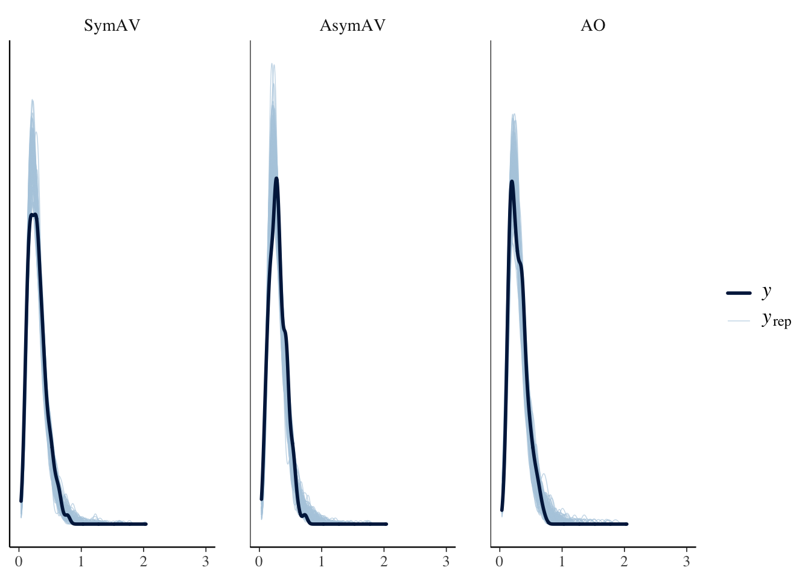<!-- -->

The posterior predictive check shows that the model is able to generate
data that is overall consistent with the observed data.

<br>

### Posterior distributions

``` r
df_post_beta = posterior_beta(model)

# summarize the posterior distribution
post_beta_summary = df_post_beta %>%
  group_by(.variable) %>%
  summarize(mean = mean(.value),
            est_error = sd(.value),
            lci = quantile(.value, 0.025),
            uci = quantile(.value, 0.975))
post_beta_summary
```

    ## # A tibble: 7 × 5
    ##   .variable          mean est_error      lci    uci
    ##   <fct>             <dbl>     <dbl>    <dbl>  <dbl>
    ## 1 AO--AsymAV      -0.0364    0.0716 -0.176   0.106 
    ## 2 AsymAV--SymAV   -0.0481    0.0665 -0.183   0.0800
    ## 3 AO--SymAV       -0.0845    0.0729 -0.229   0.0577
    ## 4 Round            0.0245    0.0171 -0.00882 0.0585
    ## 5 AO--Asym:Round  -0.0593    0.0423 -0.142   0.0247
    ## 6 Asym--Sym:Round  0.0297    0.0366 -0.0419  0.103 
    ## 7 AO--Sym:Round   -0.0296    0.0427 -0.113   0.0557

``` r
# visualize the posterior distribution
p_pd = plot_posterior(df_post_beta, interaction = F,
                      title = "C. Posterior distributions",
                      ncol_wrap = 1)
p_pd
```

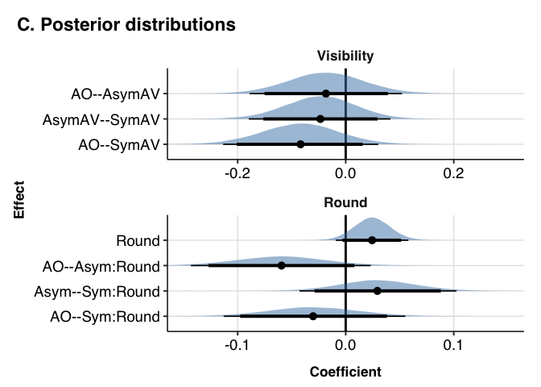<!-- -->

<br>

### Prior-posterior update plot

``` r
post_sample = as_draws_df(model)
pp_update_plot(post_sample)
```

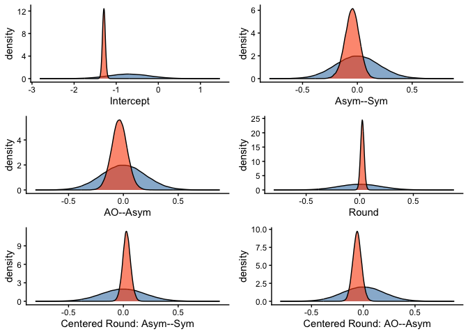<!-- -->

<br>

### Hypothesis testing: Bayes factor

``` r
### varying priors for sensitivity analysis
prior_size = c("xs", "s", "m", "l", "xl")
prior_sd = c(0.05, 0.1, 0.2, 0.3, 0.5)

### list of hypotheses
hps = c("conditionAO_Asym = 0",
        "conditionAsym_Sym = 0",
        "conditionAO_Asym + conditionAsym_Sym = 0",
        "round_c = 0",
        "conditionAO_Asym:round_c = 0",
        "conditionAsym_Sym:round_c = 0",
        "conditionAO_Asym:round_c + conditionAsym_Sym:round_c = 0")
effects = c("AO--AsymAV", "AsymAV--SymAV", "AO--SymAV", "Round", 
            "AO--AsymAV:Round", "AsymAV--SymAV:Round", "AO--SymAV:Round")

for (i in 1:length(prior_sd)){
  priors = c(
    prior(normal(-0.7, 0.5), class = Intercept),
    set_prior(paste0("normal(0,", prior_sd[i], ")"), class = "b"),
    prior(normal(0, 0.2), class = sd),
    prior(normal(0, 0.5), class = sigma),
    prior(lkj(2), class = cor))
  
  fname = paste0("models/speakerB/dtw/mln_dtw_", prior_size[i])
  fname = gsub("_m", "", fname) # remove "_m" for the medium prior
  
  fit = brm(average_distance_xyz ~ 1 + condition * round_c +
              (1+round_c|pair) + (1|target),
            family = lognormal(),
            prior = priors,
            data = df,
            sample_prior = T,
            save_pars = save_pars(all = TRUE),
            warmup = nwu, iter = niter,
            control = list(adapt_delta = 0.9,
                           max_treedepth = 15),
            file = fname)
  
  ### compute BFs for all hypotheses and store them as dataframe
  for (j in 1:length(hps)){
    h = hypothesis(fit, hps[j])
    # transform the result to dataframe
    result = data_frame(h$hypothesis) %>%
      mutate(size = prior_size[i],
             sd = prior_sd[i],
             Effect = effects[j])
    # combine the result
    if (i==1 & j==1){
      df_results = result
    } else {
      df_results = rbind(df_results, result)}
  }
}

df_results = df_results %>%
  mutate(prior = paste0("N(0, ", sd, ")"),
         BF10 = 1 / abs(Evid.Ratio),
         Effect = factor(Effect,
                         levels = c("AO--SymAV", "AO--AsymAV", "AsymAV--SymAV", "Round",
                                    "AO--SymAV:Round", "AO--AsymAV:Round", "AsymAV--SymAV:Round")),
         Predictor = factor(ifelse(grepl("Round", Effect), "Round", "Visibility"),
                            levels = c("Visibility", "Round")),
         across(where(is.numeric), ~ round(., 3))) %>% 
  dplyr::select(size, sd, prior, 
                Effect, Predictor,
                Estimate, Est.Error,
                `CI.Lower`, `CI.Upper`, BF10) %>%
  arrange(Effect, sd)
```

``` r
#### Plot BFs ####
p_bf = ggplot(filter(df_results, Predictor != "Interaction"), 
       aes(x = factor(sd), y = BF10, group = Effect)) +
  geom_hline(yintercept = 1, linetype="dashed") +
  geom_point(aes(color=Effect)) +
  geom_line(aes(color=Effect)) +
  labs(x = "SD for the prior",
       title = "D. Bayes factors for the effects on DTW distance") +
  facet_wrap(vars(Predictor)) +
  theme_clean(base_size = 15) +
  theme(axis.text.x = element_text(colour = "black", size = 14),
        axis.text.y = element_text(colour = "black", size = 14),
        axis.title = element_text(size = 15, face = 'bold'),
        axis.title.x = element_text(vjust = -2),
        axis.title.y = element_text(vjust = 2),
        legend.text = element_text(size = 10),
        legend.title = element_blank(),
        legend.position = "right",
        strip.text = element_text(size = 13, face = 'bold'),
        strip.background = element_blank(),
        plot.title.position = "plot", # left align the title
        plot.background = element_blank(),
        plot.margin = unit(c(1.1,1.1,1.1,1.1), "lines")) +
  scale_y_log10("Bayes factor (BF10)",
                # limits = c(0.1, 3),
                breaks = c(0.001, 0.03, 0.01, 0.1, 0.33, 1, 3, 10, 30, 100),
                labels = c(0.001, 0.03, 0.01, 0.1, 0.33, 1, 3, 10, 30, 100)) +
  guides(color = guide_legend(ncol = 1))

p_bf
```

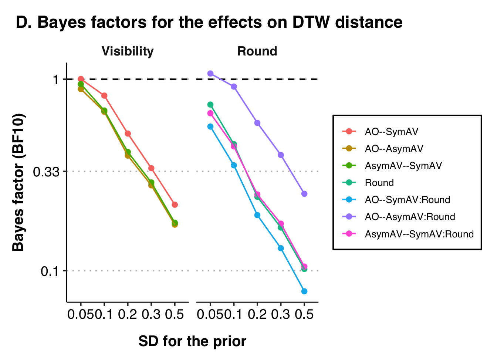<!-- -->

<br>

### Back-transformation

``` r
### obtain model predictions
pred_cond = avg_predictions(model, by = "condition",
                            re_formula = NA)

mean_round = mean(as.integer(df$round))
pred_int = avg_predictions(model, by = c("round_c","condition"),
                           re_formula = NA) %>% 
  mutate(round = factor(as.integer(round_c + mean_round)))
```

<br>

### Visualize model predictions together with data

``` r
bp_distance_model = 
  bp_distance +
  geom_ribbon(data = pred_cond,
              aes(x = condition, y = estimate,
                  ymin = conf.low, ymax = conf.high, group = 1),
              fill = "black", alpha = 0.2) +
  geom_line(data = pred_cond,
            aes(x = condition, y = estimate, group = 1),
            color = "black", size = 0.8)

bp_distance_model
```

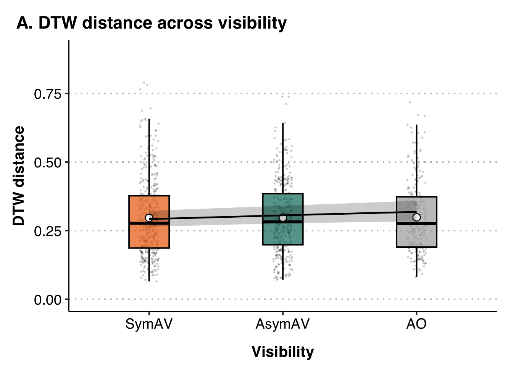<!-- -->

``` r
ggsave("figures/speakerB/dtw/bp_distance_model.svg", width=4, height=3.5, dpi=600)


bp_distance_by_cond_round_model = 
  bp_distance_by_cond_round +
  geom_ribbon(data = pred_int,
              aes(x = round, y = estimate,
                  ymin = conf.low, ymax = conf.high, group = condition),
              fill = "black", alpha = 0.2) +
  geom_line(data = pred_int,
            aes(x = round, y = estimate, group = condition),
            size = 0.8)

bp_distance_by_cond_round_model
```

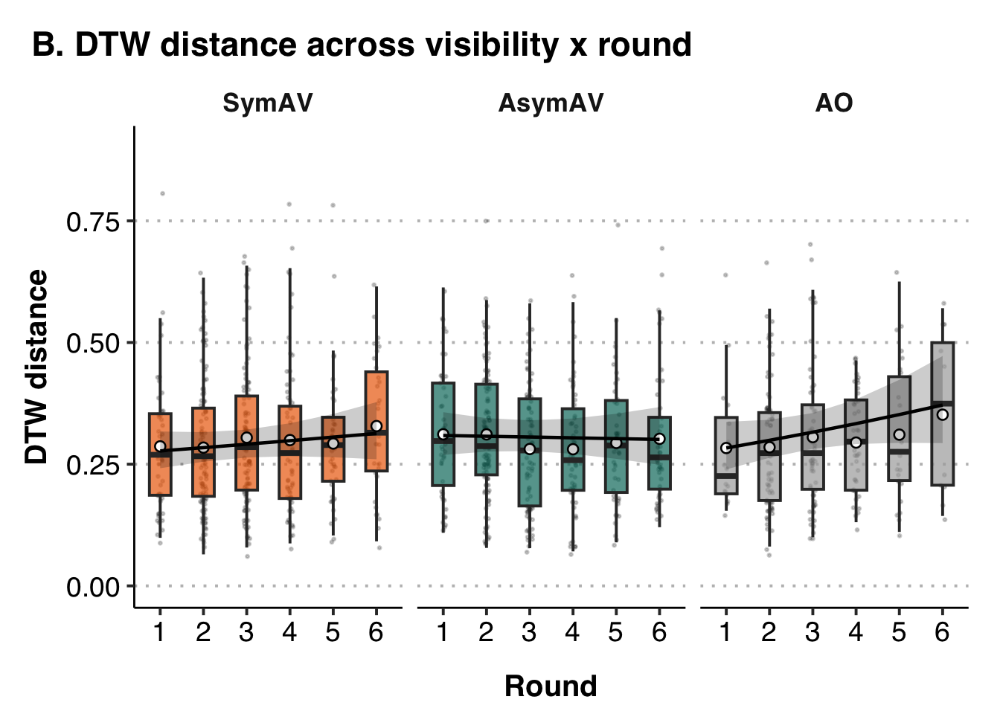<!-- -->

``` r
ggsave("figures/speakerB/dtw/bp_distance_by_cond_round_model.svg", width=6.5, height=3.5, dpi=600)
```

<br>

------------------------------------------------------------------------

# =====Merge plots=====

``` r
design = "AAAABBBBBBB
          CCCCDDDDDDD"

free(bp_distance_model) + 
  free(bp_distance_by_cond_round_model) +
  free(p_pd) + 
  free(p_bf) +
  plot_layout(design = design, heights = c(0.7,1))
```

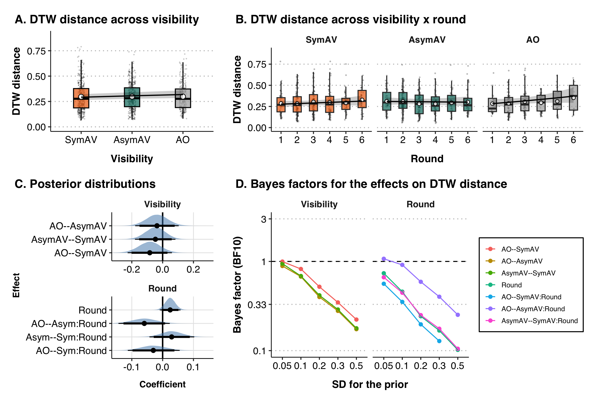<!-- -->

``` r
# save the plot
ggsave("figures/speakerB/dtw/dtw_combined.svg", width=12, height=9)
```

------------------------------------------------------------------------

# =====Session info=====

``` r
sessionInfo()
```

    ## R version 4.5.2 (2025-10-31)
    ## Platform: aarch64-apple-darwin20
    ## Running under: macOS Tahoe 26.2
    ## 
    ## Matrix products: default
    ## BLAS:   /System/Library/Frameworks/Accelerate.framework/Versions/A/Frameworks/vecLib.framework/Versions/A/libBLAS.dylib 
    ## LAPACK: /Library/Frameworks/R.framework/Versions/4.5-arm64/Resources/lib/libRlapack.dylib;  LAPACK version 3.12.1
    ## 
    ## locale:
    ## [1] en_US.UTF-8/en_US.UTF-8/en_US.UTF-8/C/en_US.UTF-8/en_US.UTF-8
    ## 
    ## time zone: Europe/Amsterdam
    ## tzcode source: internal
    ## 
    ## attached base packages:
    ## [1] parallel  stats     graphics  grDevices utils     datasets  methods  
    ## [8] base     
    ## 
    ## other attached packages:
    ##  [1] svglite_2.2.2          ppcor_1.1              MASS_7.3-65           
    ##  [4] doParallel_1.0.17      iterators_1.0.14       foreach_1.5.2         
    ##  [7] emmeans_2.0.1          marginaleffects_0.31.0 tidybayes_3.0.7       
    ## [10] bayestestR_0.17.0      brms_2.23.0            Rcpp_1.1.1            
    ## [13] rsvg_2.7.0             DiagrammeRsvg_0.1      patchwork_1.3.2       
    ## [16] DiagrammeR_1.0.11      dagitty_0.3-4          ggh4x_0.3.1           
    ## [19] RColorBrewer_1.1-3     ggthemes_5.2.0         hypr_0.2.8            
    ## [22] plotrix_3.8-13         lubridate_1.9.4        forcats_1.0.1         
    ## [25] stringr_1.6.0          dplyr_1.1.4            purrr_1.2.1           
    ## [28] readr_2.1.6            tidyr_1.3.2            tibble_3.3.1          
    ## [31] tidyverse_2.0.0        parallelly_1.46.1      plotly_4.11.0         
    ## [34] ggplot2_4.0.1         
    ## 
    ## loaded via a namespace (and not attached):
    ##  [1] gridExtra_2.3         inline_0.3.21         rlang_1.1.7          
    ##  [4] magrittr_2.0.4        otel_0.2.0            matrixStats_1.5.0    
    ##  [7] compiler_4.5.2        loo_2.9.0             reshape2_1.4.5       
    ## [10] systemfonts_1.3.1     vctrs_0.6.5           crayon_1.5.3         
    ## [13] pkgconfig_2.0.3       arrayhelpers_1.1-0    fastmap_1.2.0        
    ## [16] backports_1.5.0       labeling_0.4.3        utf8_1.2.6           
    ## [19] cmdstanr_0.9.0.9000   rmarkdown_2.30        tzdb_0.5.0           
    ## [22] pracma_2.4.6          ps_1.9.1              ragg_1.5.0           
    ## [25] bit_4.6.0             xfun_0.55             jsonlite_2.0.0       
    ## [28] collapse_2.1.6        R6_2.6.1              StanHeaders_2.32.10  
    ## [31] stringi_1.8.7         boot_1.3-32           estimability_1.5.1   
    ## [34] rstan_2.32.7          knitr_1.51            pacman_0.5.1         
    ## [37] bayesplot_1.15.0      Matrix_1.7-4          timechange_0.3.0     
    ## [40] tidyselect_1.2.1      rstudioapi_0.17.1     abind_1.4-8          
    ## [43] yaml_2.3.12           codetools_0.2-20      processx_3.8.6       
    ## [46] curl_7.0.0            pkgbuild_1.4.8        plyr_1.8.9           
    ## [49] lattice_0.22-7        withr_3.0.2           bridgesampling_1.2-1 
    ## [52] S7_0.2.1              posterior_1.6.1       coda_0.19-4.1        
    ## [55] evaluate_1.0.5        RcppParallel_5.1.11-1 ggdist_3.3.3         
    ## [58] pillar_1.11.1         tensorA_0.36.2.1      stats4_4.5.2         
    ## [61] checkmate_2.3.3       insight_1.4.4         distributional_0.5.0 
    ## [64] generics_0.1.4        vroom_1.6.7           hms_1.1.4            
    ## [67] rstantools_2.6.0      scales_1.4.0          xtable_1.8-4         
    ## [70] glue_1.8.0            lazyeval_0.2.2        tools_4.5.2          
    ## [73] data.table_1.18.0     visNetwork_2.1.4      mvtnorm_1.3-3        
    ## [76] grid_4.5.2            QuickJSR_1.8.1        datawizard_1.3.0     
    ## [79] colorspace_2.1-2      nlme_3.1-168          cli_3.6.5            
    ## [82] textshaping_1.0.4     svUnit_1.0.8          viridisLite_0.4.2    
    ## [85] Brobdingnag_1.2-9     V8_8.0.1              gtable_0.3.6         
    ## [88] digest_0.6.39         htmlwidgets_1.6.4     farver_2.1.2         
    ## [91] htmltools_0.5.9       lifecycle_1.0.5       httr_1.4.7           
    ## [94] bit64_4.6.0-1
