gestural_alignment_rate
================
Last updated: 2025-11-24

``` r
library(tidyverse)
library(plotrix)    #std.error
library(hypr)       #for generating contrast coding
library(ggthemes)
library(ggh4x)
library(dagitty)    #dagitty for causal diagrams
library(DiagrammeR) #grViz for causal diagrams
library(DiagrammeRsvg)
library(rsvg)
library(plotly)     #ggplotly for interactive plots
library(brms)       #bayesian regression
library(bayestestR) #p_direction, hdi
library(tidybayes)  #add_epred_draws
library(emmeans)
library(doParallel) #set the number of cores
library(ppcor)      #partial correlation
library(svglite)


### Set global options
options(digits = 3) # set the default number of digits to 3
cores = as.integer(detectCores(logical = FALSE) * 0.8) # set the number of cores to use
registerDoParallel(cores=cores) # register the number of cores to use for parallel processing
options(mc.cores = cores)
options(brms.backend = "cmdstanr")  #this will speed up the model fitting

### MCMC options
niter = 20000  #number of iterations
nwu = 2000 #number of warmups

### Rmd settings
knitr::opts_chunk$set(echo=TRUE, warning=FALSE, message=FALSE, fig.path="figures_md/speakerB/gest_alignment/")
```

``` r
### Custom functions

########### pp_check_each_round ############
pp_check_each_round <- function(m, data, round_info) {
  df_sub = filter(data, round == round_info)
  p = pp_check(m,
               type = "bars",
               ndraws = 100,
               newdata = df_sub) +
    coord_cartesian(xlim = c(0, 10)) +
    ggtitle(round_info)
  return(p)
}


########### pp_check_each_condition ############
pp_check_each_condition <- function(m, data, condition_info) {
  df_sub = filter(data, condition == condition_info)
  p = pp_check(m,
               type = "bars",
               ndraws = 100,
               newdata = df_sub) +
    coord_cartesian(xlim = c(0, 10)) +
    ggtitle(condition_info)
  return(p)
}


########### plot_posterior ############
plot_posterior <- function(model, model2=NA, model3=NA, 
                           interaction=FALSE, include_intercept=FALSE, 
                           xlim_cond=1.5, xlim_round=2, xlim_lex=0.4){
  ### extract the posterior draws
  posterior_beta1 <- model %>% 
    gather_draws(`b_.*`, regex = TRUE) %>% 
    mutate(intercept = str_detect(.variable, "Intercept"),
           component = ifelse(str_detect(.variable, ":"), "Interaction", 
                              ifelse(str_detect(.variable, "round"), "Round", 
                                     ifelse(str_detect(.variable, "Intercept"), "Intercept",
                                            ifelse(str_detect(.variable, "lex_align"), "N. lex align",
                                                   "Visibility")))))
  
  if (length(model2) == 1){ #if model2 is NA 
    posterior_beta = posterior_beta1
  } else {
    posterior_beta1 <- posterior_beta1 %>% 
      filter(.variable != "b_lex_align_c")
    posterior_beta2 <- model2 %>% 
      gather_draws(`b_.*`, regex = TRUE) %>% 
      filter(.variable == "b_lex_align_c") %>% 
      mutate(component = "N. lex align")
    posterior_beta3 <- model3 %>% 
      gather_draws(`b_.*`, regex = TRUE) %>% 
      filter(.variable == "b_condition_sumAO_Sym") %>% 
      mutate(component = "Visibility")
    posterior_beta = rbind(posterior_beta1, posterior_beta2, posterior_beta3)
  }
  
  posterior_beta = posterior_beta %>% 
    mutate(.variable = recode(.variable, 
                              "b_Intercept" = "Intercept",
                              "b_conditionAsymAV" = "SymAV--AsymAV",
                              "b_conditionAO" = "SymAV--AO",
                              "b_conditionAsym_Sym" = "AsymAV--SymAV",
                              "b_conditionAO_Asym" = "AO--AsymAV",
                              "b_condition_sumAO_Sym" = "AO--SymAV",
                              "b_lex_align_c" = "N. lex align",
                              "b_round_c" = "Centered round",
                              "b_log_round_c" = "Centered log(round)",
                              "b_roundR12" = "R1--R2",
                              "b_roundR23" = "R2--R3",
                              "b_roundR34" = "R3--R4",
                              "b_roundR45" = "R4--R5",
                              "b_roundR56" = "R5--R6",
                              "b_conditionAsymAV:round1" = "SymAV--AsymAV: R1--R2",
                              "b_conditionAsymAV:round2" = "SymAV--AsymAV: R2--R3",
                              "b_conditionAsymAV:round3" = "SymAV--AsymAV: R3--R4",
                              "b_conditionAsymAV:round4" = "SymAV--AsymAV: R4--R5",
                              "b_conditionAsymAV:round5" = "SymAV--AsymAV: R5--R6",
                              "b_conditionAO:round1" = "SymAV--AO: R1--R2",
                              "b_conditionAO:round2" = "SymAV--AO: R2--R3",
                              "b_conditionAO:round3" = "SymAV--AO: R3--R4",
                              "b_conditionAO:round4" = "SymAV--AO: R4--R5",
                              "b_conditionAO:round5" = "SymAV--AO: R5--R6",
                              "b_conditionAsym_Sym:round_c" = "Centered round: Asym--Sym",
                              "b_conditionAO_Sym:round_c" = "Centered round: AO--Sym",
                              "b_conditionAO_Asym:round_c" = "Centered round: AO--Asym",
                              "b_conditionAsym_Sym:log_round_c" = "Centered log(round): Asym--Sym",
                              "b_conditionAO_Sym:log_round_c" = "Centered log(round): AO--Sym",
                              "b_conditionAO_Asym:log_round_c" = "Centered log(round): AO--Asym"),
           .variable = factor(.variable,
                              levels = c("AO--SymAV", "AO--AsymAV", "AsymAV--SymAV", 
                                         "R1--R2", "R2--R3", "R3--R4", "R4--R5", "R5--R6",
                                         "N. lex align")),
           component = factor(component, 
                              levels = c("Intercept", "Visibility", "Round", 
                                         "Interaction", "N. lex align")))
  
  if (include_intercept == F){
    posterior_beta = posterior_beta %>% filter(component != "Intercept")
  }
  ### change variables if only main effects are plotted
  if (interaction == F) {
    posterior_beta = filter(posterior_beta, !str_detect(.variable, ":"))
    fill_manual_values = c("steelblue", "steelblue", "steelblue")
  } else{
    fill_manual_values = c("steelblue", "steelblue", "steelblue", "steelblue")
  }
  
  
  ### plot the posterior distributions
  p_posterior = ggplot(posterior_beta, 
                       aes(x = .value, y = fct_rev(.variable),
                           fill = component)) +
    geom_vline(xintercept = 0, size = 1) +
    stat_halfeye(aes(slab_alpha = intercept),
                 normalize = "panels", 
                 slab_alpha = .5,
                 .width = c(0.89, 0.95), 
                 point_interval = "median_hdi") +
    scale_fill_manual(values = fill_manual_values) +
    scale_slab_alpha_discrete(range = c(0.8, 0.4)) +
    guides(fill = "none", slab_alpha = "none") +
    labs(x = "Coefficient", y = "Effect") +
    theme_clean(base_size = 15) +
    theme(axis.text.x = element_text(colour = "black", size = 14),
          axis.text.y = element_text(colour = "black", size = 14),
          axis.title = element_text(size = 15, face = 'bold'),
          axis.title.x = element_text(vjust = -2),
          axis.title.y = element_text(vjust = 2),
          legend.position = "none",
          strip.text = element_text(size = 15, face = 'bold'),
          strip.background = element_blank(),
          panel.grid.major.x = element_line(color = "grey90", 
                                            linetype = "solid",
                                            size = 0.5),
          panel.grid.major.y = element_line(color = "grey90", 
                                            linetype = "solid",
                                            size = 0.5),
          plot.background = element_blank(),
          plot.margin = unit(c(1.1,1.1,1.1,1.1), "lines")) +
    facet_wrap(vars(component), ncol = 3, scales = "free") + 
    facetted_pos_scales(
      x = list(
        scale_x_continuous(limits = c(-xlim_cond, xlim_cond)),
        scale_x_continuous(limits = c(-xlim_round, xlim_round)),
        scale_x_continuous(limits = c(-xlim_lex, xlim_lex))))
  
  return(p_posterior)
}


########### pp_update_plot ############
pp_update_plot <- function(post_sample, model_type="nb", interaction=TRUE){
  sum = ifelse("b_condition_sumAO_Sym" %in% colnames(post_sample), T, F)
  round_bd = ifelse("b_roundR12" %in% colnames(post_sample), T, F)
  
  intercept = ggplot(post_sample) +
    geom_density(aes(prior_Intercept), fill="steelblue", color="black",alpha=0.6) +
    geom_density(aes(b_Intercept), fill="#FC4E07", color="black",alpha=0.6) + 
    xlab('Intercept') +
    theme_classic()
  
  ### Visibility condition
  if (sum == F){
    cond1 = ggplot(post_sample) +
      geom_density(aes(prior_b), fill="steelblue", color="black",alpha=0.6) +
      geom_density(aes(b_conditionAsym_Sym), fill="#FC4E07", color="black",alpha=0.6) + 
      xlab('Asym--Sym') +
      theme_classic()
    cond2 = ggplot(post_sample) +
      geom_density(aes(prior_b), fill="steelblue", color="black",alpha=0.6) +
      geom_density(aes(b_conditionAO_Asym), fill="#FC4E07", color="black",alpha=0.6) + 
      xlab('AO--Asym') +
      theme_classic()
  } else {
    cond1 = ggplot(post_sample) +
      geom_density(aes(prior_b), fill="steelblue", color="black",alpha=0.6) +
      geom_density(aes(b_condition_sumAO_Sym), fill="#FC4E07", color="black",alpha=0.6) + 
      xlab('AO--Sym') +
      theme_classic()
    cond2 = ggplot(post_sample) +
      geom_density(aes(prior_b), fill="steelblue", color="black",alpha=0.6) +
      geom_density(aes(b_condition_sumAsym_Sym), fill="#FC4E07", color="black",alpha=0.6) + 
      xlab('Asym--Sym') +
      theme_classic()
  }
  
  ### Round
  if (interaction) {
    if (round_bd){
      r1 = ggplot(post_sample) +
        geom_density(aes(prior_b), fill="steelblue", color="black",alpha=0.6) +
        geom_density(aes(b_roundR12), fill="#FC4E07", color="black",alpha=0.6) + 
        xlab('R1--R2') +
        theme_classic()
      r2 = ggplot(post_sample) +
        geom_density(aes(prior_b), fill="steelblue", color="black",alpha=0.6) +
        geom_density(aes(b_roundR23), fill="#FC4E07", color="black",alpha=0.6) + 
        xlab('R2--R3') +
        theme_classic()
      r3 = ggplot(post_sample) +
        geom_density(aes(prior_b), fill="steelblue", color="black",alpha=0.6) +
        geom_density(aes(b_roundR34), fill="#FC4E07", color="black",alpha=0.6) + 
        xlab('R3--R4') +
        theme_classic()
      r4 = ggplot(post_sample) +
        geom_density(aes(prior_b), fill="steelblue", color="black",alpha=0.6) +
        geom_density(aes(b_roundR45), fill="#FC4E07", color="black",alpha=0.6) + 
        xlab('R4--R5') +
        theme_classic()
      r5 = ggplot(post_sample) +
        geom_density(aes(prior_b), fill="steelblue", color="black",alpha=0.6) +
        geom_density(aes(b_roundR56), fill="#FC4E07", color="black",alpha=0.6) + 
        xlab('R5--R6') +
        theme_classic()
    } else {
      if ("b_round_c" %in% colnames(post_sample)) {
        round = ggplot(post_sample) +
          geom_density(aes(prior_b), fill="steelblue", color="black",alpha=0.6) +
          geom_density(aes(b_round_c), fill="#FC4E07", color="black",alpha=0.6) + 
          xlab('Centered round') +
          theme_classic()
        if (sum == F){
          cond1_round = ggplot(post_sample) +
            geom_density(aes(prior_b), fill="steelblue", color="black",alpha=0.6) +
            geom_density(aes(`b_conditionAsym_Sym:round_c`), fill="#FC4E07", color="black",alpha=0.6) + 
            xlab('Centered Round: Asym--Sym') +
            theme_classic()
          cond2_round = ggplot(post_sample) +
            geom_density(aes(prior_b), fill="steelblue", color="black",alpha=0.6) +
            geom_density(aes(`b_conditionAO_Asym:round_c`), fill="#FC4E07", color="black",alpha=0.6) + 
            xlab('Centered Round: AO--Asym') +
            theme_classic()
        } else {
          cond1_round = ggplot(post_sample) +
            geom_density(aes(prior_b), fill="steelblue", color="black",alpha=0.6) +
            geom_density(aes(`b_condition_sumAO_Sym:round_c`), fill="#FC4E07", color="black",alpha=0.6) + 
            xlab('Centered Round: AO--Sym') +
            theme_classic()
          cond2_round = ggplot(post_sample) +
            geom_density(aes(prior_b), fill="steelblue", color="black",alpha=0.6) +
            geom_density(aes(`b_condition_sumAsym_Sym:round_c`), fill="#FC4E07", color="black",alpha=0.6) + 
            xlab('Centered Round: Asym--Sym') +
            theme_classic()
        }
      } else {
        round = ggplot(post_sample) +
          geom_density(aes(prior_b), fill="steelblue", color="black",alpha=0.6) +
          geom_density(aes(b_log_round_c), fill="#FC4E07", color="black",alpha=0.6) + 
          xlab('Centered log(round)') +
          theme_classic()
        if (sum == F){
          cond1_round = ggplot(post_sample) +
            geom_density(aes(prior_b), fill="steelblue", color="black",alpha=0.6) +
            geom_density(aes(`b_conditionAsym_Sym:log_round_c`), fill="#FC4E07", color="black",alpha=0.6) + 
            xlab('Centered log(round): Asym--Sym') +
            theme_classic()
          cond2_round = ggplot(post_sample) +
            geom_density(aes(prior_b), fill="steelblue", color="black",alpha=0.6) +
            geom_density(aes(`b_conditionAO_Asym:log_round_c`), fill="#FC4E07", color="black",alpha=0.6) + 
            xlab('Centered log(round): AO--Asym') +
            theme_classic()
        } else {
          cond1_round = ggplot(post_sample) +
            geom_density(aes(prior_b), fill="steelblue", color="black",alpha=0.6) +
            geom_density(aes(`b_condition_sumAO_Sym:log_round_c`), fill="#FC4E07", color="black",alpha=0.6) + 
            xlab('Centered log(round): AO--Sym') +
            theme_classic()
          cond2_round = ggplot(post_sample) +
            geom_density(aes(prior_b), fill="steelblue", color="black",alpha=0.6) +
            geom_density(aes(`b_condition_sumAsym_Sym:log_round_c`), fill="#FC4E07", color="black",alpha=0.6) + 
            xlab('Centered log(round): Asym--Sym') +
            theme_classic()
        }
      }
    }
  }
  
  if (model_type == "nb"){
    shape = ggplot(post_sample) +
      geom_density(aes(prior_shape), fill="steelblue", color="black",alpha=0.6) +
      geom_density(aes(shape), fill="#FC4E07", color="black",alpha=0.6) + 
      xlab('Shape') +
      scale_x_continuous(limits = c(0, 10)) +
      theme_classic()} 
  else if (model_type == "zinb") {
    shape = ggplot(post_sample) +
      geom_density(aes(prior_shape), fill="steelblue", color="black",alpha=0.6) +
      geom_density(aes(shape), fill="#FC4E07", color="black",alpha=0.6) + 
      xlab('Shape') +
      scale_x_continuous(limits = c(0, 10)) +
      theme_classic()
    zi = ggplot(post_sample) +
      geom_density(aes(prior_zi), fill="steelblue", color="black",alpha=0.6) +
      geom_density(aes(zi), fill="#FC4E07", color="black",alpha=0.6) + 
      xlab('Zero-inflation') +
      theme_classic()} 
  else if (model_type == "zibt"){
    phi = ggplot(post_sample) +
      geom_density(aes(prior_phi), fill="steelblue", color="black",alpha=0.6) +
      geom_density(aes(phi), fill="#FC4E07", color="black",alpha=0.6) + 
      xlab('Precision') +
      theme_classic()
    zoi = ggplot(post_sample) +
      geom_density(aes(prior_zoi), fill="steelblue", color="black",alpha=0.6) +
      geom_density(aes(zoi), fill="#FC4E07", color="black",alpha=0.6) + 
      xlab('Zero-inflation') +
      theme_classic()
    coi = ggplot(post_sample) +
      geom_density(aes(prior_coi), fill="steelblue", color="black",alpha=0.6) +
      geom_density(aes(coi), fill="#FC4E07", color="black",alpha=0.6) + 
      xlab('One-inflation') +
      theme_classic()
  }
  
  ### display the plots
  if (interaction==F){
    if (model_type=="nb"){
      gridExtra::grid.arrange(intercept, cond1, cond2, shape, ncol=2)} 
    else if (model_type=="zinb"){
      gridExtra::grid.arrange(intercept, cond1, cond2, shape, zi, ncol=3)} 
    else if (model_type=="zibt"){
      gridExtra::grid.arrange(intercept, cond1, cond2, phi, zoi, coi, ncol=3)
    }
  } else {
    if (round_bd == T){
      if (model_type=="nb"){
        gridExtra::grid.arrange(intercept, cond1, cond2, shape, ncol=3)} 
      else if (model_type=="zinb"){
        gridExtra::grid.arrange(intercept, cond1, cond2, shape, zi, ncol=3)} 
      else if (model_type=="zibt"){
        gridExtra::grid.arrange(intercept, cond1, cond2, phi, zoi, coi, ncol=3)
      }
    } else {
      if (model_type=="nb"){
        gridExtra::grid.arrange(intercept, cond1, cond2, round,
                                cond1_round, cond2_round, shape, ncol=3)} 
      else if (model_type=="zinb"){
        gridExtra::grid.arrange(intercept, cond1, cond2, round,
                                cond1_round, cond2_round, shape, zi, ncol=3)} 
      else if (model_type=="zibt"){
        gridExtra::grid.arrange(intercept, cond1, cond2, round,
                                cond1_round, cond2_round,  phi, zoi, coi, ncol=3)
      }
    }
  }
}
```

# 1. Data preparation

## 1.1 Load data

``` r
### trial_info_speaker.csv
df_trial_info = read.csv("data/trial_info_speaker.csv", stringsAsFactors = TRUE) %>% 
  filter(num_words != 0) %>%  # remove trials that were accidentally skipped)
  mutate(pair = factor(pair),
         role = factor(ifelse(speaker == director, "director", "matcher")),
         round_c = as.integer(round) - mean(as.integer(round)),
         round_n = factor(round),
         round = factor(paste0("R", round)),
         log_round = log(as.integer(round)),
         log_round_c = log_round - mean(log_round),
         condition = factor(condition,
                            levels = c("Sym", "Asym", "AO"),
                            labels = c("SymAV", "AsymAV", "AO")),
         condition_sum = condition,
         duration_s = duration_ms / 1000,
         n_words_100 = num_words / 100,
         n_iconic_c = num_iconic_gestures - mean(num_iconic_gestures),
         n_iconic_per_100words = num_iconic_gestures / n_words_100,
         n_iconic_100 = num_iconic_gestures / 100,
         lex_align_c = num_lex_align - mean(num_lex_align),
         lex_align_rate = num_lex_align / n_words_100,
         gest_align_rate_100words = num_gestural_align / n_words_100,
         gest_align_rate = num_gestural_align / num_iconic_gestures) %>% 
  rename(trial_duration_s = duration_s, trial_duration_m = duration_m) %>% 
  filter(speaker == "B")

### condition info
df_condition_info = read.csv("data/condition_info.csv", stringsAsFactors = TRUE) %>% 
  mutate(pair = factor(pair),
         condition = factor(condition,
                            levels = c("Sym", "Asym", "AO"),
                            labels = c("SymAV", "AsymAV", "AO")))
```

<br>

## 1.2 Summarize data

``` r
summarize_demographics <- function(df) {
  df %>%  
    summarize(total_s = sum(trial_duration_s),
              total_m = total_s / 60,
              ### trial duration ###
              mean_trial_dur_s = mean(trial_duration_s),
              mean_trial_dur_m = mean(trial_duration_m),
              sd_trial_dur_m = sd(trial_duration_m),
              lci_trial_dur_m = mean_trial_dur_m - 1.96 * sd_trial_dur_m / sqrt(n()),
              uci_trial_dur_m = mean_trial_dur_m + 1.96 * sd_trial_dur_m / sqrt(n()),
              ### words ###
              # number of words
              num_words_total = sum(num_words),
              mean_num_words = mean(num_words),
              num_words_100 = mean(num_words / 100),
              sd_num_words = sd(num_words),
              lci_num_words = mean_num_words - 1.96 * sd_num_words / sqrt(n()),
              uci_num_words = mean_num_words + 1.96 * sd_num_words / sqrt(n()),
              num_words_per_min = num_words_total / total_m,
              # number of content words
              num_content_total = sum(num_content_words),
              mean_num_content = mean(num_content_words),
              sd_num_content = sd(num_content_words),
              lci_num_content = mean_num_content - 1.96 * sd_num_content / sqrt(n()),
              uci_num_content = mean_num_content + 1.96 * sd_num_content / sqrt(n()),
              num_content_per_min = num_content_total / total_m,
              ### lexical alignment ###
              # raw frequency
              num_lex_align_total = sum(num_lex_align, na.rm = T),
              mean_num_lex_align = mean(num_lex_align, na.rm = T),
              sd_num_lex_align = sd(num_lex_align, na.rm = T),
              lci_num_lex_align = mean_num_lex_align - 1.96 * sd_num_lex_align / sqrt(n()),
              uci_num_lex_align = mean_num_lex_align + 1.96 * sd_num_lex_align / sqrt(n()),
              num_lex_align_per_min = num_lex_align_total / total_m,
              # rate per 100 words
              mean_lex_align_per_100words = mean(lex_align_rate, na.rm=T),
              sd_lex_align_per_100words = sd(lex_align_rate, na.rm=T),
              se_lex_align_per_100words = std.error(lex_align_rate, na.rm=T),
              lci_lex_align_per_100words = mean_lex_align_per_100words - 1.96 * se_lex_align_per_100words,
              uci_lex_align_per_100words = mean_lex_align_per_100words + 1.96 * se_lex_align_per_100words,
              ### iconic gestures ###
              # raw frequency
              num_iconic_total = sum(num_iconic_gestures, na.rm = T),
              mean_num_iconic = mean(num_iconic_gestures, na.rm = T),
              sd_num_iconic = sd(num_iconic_gestures, na.rm = T),
              lci_num_iconic = mean_num_iconic - 1.96 * sd_num_iconic / sqrt(n()),
              uci_num_iconic = mean_num_iconic + 1.96 * sd_num_iconic / sqrt(n()),
              num_iconic_per_min = num_iconic_total / total_m,
              # rate per 100 words
              mean_iconic_per_100words = mean(n_iconic_per_100words, na.rm=T),
              sd_iconic_per_100words = sd(n_iconic_per_100words, na.rm=T),
              se_iconic_per_100words = std.error(n_iconic_per_100words, na.rm=T),
              lci_iconic_per_100words = mean_iconic_per_100words - 1.96 * se_iconic_per_100words,
              uci_iconic_per_100words = mean_iconic_per_100words + 1.96 * se_iconic_per_100words,
              ### gestural alignment ###
              # raw frequency
              num_gest_align_total = sum(num_gestural_align, na.rm = T),
              mean_num_gest_align = mean(num_gestural_align, na.rm = T),
              sd_num_gest_align = sd(num_gestural_align, na.rm = T),
              lci_num_gest_align = mean_num_gest_align - 1.96 * sd_num_gest_align / sqrt(n()),
              uci_num_gest_align = mean_num_gest_align + 1.96 * sd_num_gest_align / sqrt(n()),
              num_gest_align_per_min = num_gest_align_total / total_m,
              # rate per 100 words
              mean_gest_align_per_100words = mean(gest_align_rate_100words, na.rm=T),
              sd_gest_align_per_100words = sd(gest_align_rate_100words, na.rm=T),
              se_gest_align_per_100words = std.error(gest_align_rate_100words, na.rm=T),
              lci_gest_align_per_100words = mean_gest_align_per_100words - 1.96 * se_gest_align_per_100words,
              uci_gest_align_per_100words = mean_gest_align_per_100words + 1.96 * se_gest_align_per_100words,
              # rate per iconic gestures
              mean_gest_align_prop = mean(gest_align_rate, na.rm=T),
              sd_gest_align_prop = sd(gest_align_rate, na.rm=T),
              se_gest_align_prop = std.error(gest_align_rate, na.rm=T),
              lci_gest_align_prop = mean_gest_align_prop - 1.96 * se_gest_align_prop,
              uci_gest_align_prop = mean_gest_align_prop + 1.96 * se_gest_align_prop,
              ### number of trials ###
              trial_n = n()) %>% 
    ungroup()
}

summarize_dur <- function(df){
  df %>% 
    summarize(mean_dur_m = mean(total_m),
              sd_dur_m = sd(total_m),
              se_dur_m = std.error(total_m),
              lci_dur_m = mean_dur_m - 1.96 * se_dur_m,
              uci_dur_m = mean_dur_m + 1.96 * se_dur_m) %>% 
    ungroup()
}
```

<br>

### mean by condition

``` r
### demographics by pair
trial_info_pair = df_trial_info %>% 
  group_by(pair) %>% 
  summarize_demographics() %>% 
  left_join(., df_condition_info) %>% 
  dplyr::select(pair, condition, total_s:trial_n)

### calculate mean experiment duration
mean_dur_cond = trial_info_pair %>% 
  group_by(condition) %>% 
  summarize_dur()

### summary statistics
trial_info_cond  = df_trial_info %>% 
  group_by(condition) %>% 
  summarize_demographics() %>% 
  left_join(., mean_dur_cond) %>% 
  dplyr::select(condition, total_m, mean_dur_m:uci_dur_m, 
                everything(), 
                -ends_with("_s"))

trial_info_cond
```

    ## # A tibble: 3 × 63
    ##   condition total_m mean_dur_m sd_dur_m se_dur_m lci_dur_m uci_dur_m
    ##   <fct>       <dbl>      <dbl>    <dbl>    <dbl>     <dbl>     <dbl>
    ## 1 SymAV        369.       24.6     4.22    1.09       22.5      26.7
    ## 2 AsymAV       358.       23.9     3.86    0.997      21.9      25.8
    ## 3 AO           353.       23.5     4.99    1.29       21.0      26.1
    ## # ℹ 56 more variables: mean_trial_dur_m <dbl>, sd_trial_dur_m <dbl>,
    ## #   lci_trial_dur_m <dbl>, uci_trial_dur_m <dbl>, num_words_total <int>,
    ## #   mean_num_words <dbl>, num_words_100 <dbl>, sd_num_words <dbl>,
    ## #   lci_num_words <dbl>, uci_num_words <dbl>, num_words_per_min <dbl>,
    ## #   num_content_total <int>, mean_num_content <dbl>, sd_num_content <dbl>,
    ## #   lci_num_content <dbl>, uci_num_content <dbl>, num_content_per_min <dbl>,
    ## #   num_lex_align_total <int>, mean_num_lex_align <dbl>, …

``` r
### export it as csv
tbl = trial_info_cond %>% 
  dplyr::select(!starts_with(c("sd_", "se_", "num_", "trial_")) 
                & !contains("total")) %>% 
  pivot_longer(cols = !condition,
               names_to = "name",
               values_to = "value") %>% 
  mutate(stats = sub("_.*", "", name),
         name = sub("[[:alpha:]]+_", "", name),
         across(where(is.numeric), ~ str_squish(format(round(., 2), scientific = FALSE)))) %>% 
  pivot_wider(names_from = c("condition", "stats"),
              values_from = "value") %>% 
  mutate(SymAV_ci = paste0("[", SymAV_lci, ", ", SymAV_uci, "]"),
         AsymAV_ci = paste0("[", AsymAV_lci, ", ", AsymAV_uci, "]"),
         AO_ci = paste0("[", AO_lci, ", ", AO_uci, "]")) %>% 
  dplyr::select(name, SymAV_mean, SymAV_ci, AsymAV_mean, AsymAV_ci, AO_mean, AO_ci)

write_csv(tbl, "tables/descriptive_B.csv")
```

<br>

### mean by round

``` r
trial_info_pair_round = df_trial_info %>% 
  group_by(pair, round, round_n) %>%
  summarize_demographics() %>% 
  left_join(., df_condition_info)

### calculate mean round duration
mean_dur_round = trial_info_pair_round %>% 
  group_by(round, round_n) %>% 
  summarize_dur()

trial_info_round = df_trial_info %>% 
  group_by(round, round_n) %>% 
  summarize_demographics() %>% 
  left_join(., mean_dur_round) %>%
  dplyr::select(round, round_n, total_m, mean_dur_m:uci_dur_m, 
                everything(), 
                -ends_with("_s"))

trial_info_round
```

    ## # A tibble: 6 × 64
    ##   round round_n total_m mean_dur_m sd_dur_m se_dur_m lci_dur_m uci_dur_m
    ##   <fct> <fct>     <dbl>      <dbl>    <dbl>    <dbl>     <dbl>     <dbl>
    ## 1 R1    1         420.        9.34    2.26    0.338       8.67     10.0 
    ## 2 R2    2         209.        4.64    1.26    0.188       4.27      5.01
    ## 3 R3    3         142.        3.15    0.771   0.115       2.92      3.37
    ## 4 R4    4         115.        2.55    0.618   0.0921      2.37      2.73
    ## 5 R5    5         103.        2.28    0.456   0.0679      2.15      2.41
    ## 6 R6    6          91.7       2.04    0.362   0.0540      1.93      2.14
    ## # ℹ 56 more variables: mean_trial_dur_m <dbl>, sd_trial_dur_m <dbl>,
    ## #   lci_trial_dur_m <dbl>, uci_trial_dur_m <dbl>, num_words_total <int>,
    ## #   mean_num_words <dbl>, num_words_100 <dbl>, sd_num_words <dbl>,
    ## #   lci_num_words <dbl>, uci_num_words <dbl>, num_words_per_min <dbl>,
    ## #   num_content_total <int>, mean_num_content <dbl>, sd_num_content <dbl>,
    ## #   lci_num_content <dbl>, uci_num_content <dbl>, num_content_per_min <dbl>,
    ## #   num_lex_align_total <int>, mean_num_lex_align <dbl>, …

<br>

### mean by condition x round

``` r
### calculate mean duration by condition x round
mean_dur_cond_round = trial_info_pair_round %>% 
  group_by(condition, round, round_n) %>% 
  summarize_dur()

trial_info_cond_round = df_trial_info %>% 
  group_by(condition, round, round_n) %>% 
  summarize_demographics() %>% 
  left_join(., mean_dur_cond_round) %>%
  dplyr::select(condition, round, round_n,
                total_m, mean_dur_m:uci_dur_m, 
                everything(), 
                -ends_with("_s"))

trial_info_cond_round
```

    ## # A tibble: 18 × 65
    ##    condition round round_n total_m mean_dur_m sd_dur_m se_dur_m lci_dur_m
    ##    <fct>     <fct> <fct>     <dbl>      <dbl>    <dbl>    <dbl>     <dbl>
    ##  1 SymAV     R1    1         137.        9.11    1.58    0.407       8.31
    ##  2 SymAV     R2    2          75.5       5.04    1.46    0.378       4.30
    ##  3 SymAV     R3    3          49.2       3.28    0.955   0.247       2.80
    ##  4 SymAV     R4    4          40.8       2.72    0.761   0.197       2.33
    ##  5 SymAV     R5    5          35.7       2.38    0.501   0.129       2.12
    ##  6 SymAV     R6    6          31.0       2.07    0.430   0.111       1.85
    ##  7 AsymAV    R1    1         146.        9.74    2.74    0.709       8.35
    ##  8 AsymAV    R2    2          63.9       4.26    0.651   0.168       3.93
    ##  9 AsymAV    R3    3          46.0       3.07    0.562   0.145       2.78
    ## 10 AsymAV    R4    4          35.9       2.39    0.354   0.0915      2.21
    ## 11 AsymAV    R5    5          34.5       2.30    0.461   0.119       2.07
    ## 12 AsymAV    R6    6          31.4       2.09    0.339   0.0877      1.92
    ## 13 AO        R1    1         138.        9.17    2.42    0.624       7.94
    ## 14 AO        R2    2          69.4       4.62    1.45    0.375       3.89
    ## 15 AO        R3    3          46.4       3.09    0.782   0.202       2.70
    ## 16 AO        R4    4          38.1       2.54    0.660   0.170       2.21
    ## 17 AO        R5    5          32.5       2.17    0.406   0.105       1.96
    ## 18 AO        R6    6          29.3       1.95    0.315   0.0813      1.79
    ## # ℹ 57 more variables: uci_dur_m <dbl>, mean_trial_dur_m <dbl>,
    ## #   sd_trial_dur_m <dbl>, lci_trial_dur_m <dbl>, uci_trial_dur_m <dbl>,
    ## #   num_words_total <int>, mean_num_words <dbl>, num_words_100 <dbl>,
    ## #   sd_num_words <dbl>, lci_num_words <dbl>, uci_num_words <dbl>,
    ## #   num_words_per_min <dbl>, num_content_total <int>, mean_num_content <dbl>,
    ## #   sd_num_content <dbl>, lci_num_content <dbl>, uci_num_content <dbl>,
    ## #   num_content_per_min <dbl>, num_lex_align_total <int>, …

<br>

------------------------------------------------------------------------

# 3. Contrast coding

``` r
### visibility condition: difference coding
h_cond = hypr(AO_Asym = AsymAV ~ AO,
              Asym_Sym = SymAV ~ AsymAV,
              levels = levels(df_trial_info$condition))
h_cond
```

    ## hypr object containing 2 null hypotheses:
    ##  H0.AO_Asym: 0 = AsymAV - AO
    ## H0.Asym_Sym: 0 = SymAV - AsymAV
    ## 
    ## Call:
    ## hypr(AO_Asym = ~AsymAV - AO, Asym_Sym = ~SymAV - AsymAV, levels = c("SymAV", 
    ## "AsymAV", "AO"))
    ## 
    ## Hypothesis matrix (transposed):
    ##        AO_Asym Asym_Sym
    ## SymAV   0       1      
    ## AsymAV  1      -1      
    ## AO     -1       0      
    ## 
    ## Contrast matrix:
    ##        AO_Asym Asym_Sym
    ## SymAV   1/3     2/3    
    ## AsymAV  1/3    -1/3    
    ## AO     -2/3    -1/3

``` r
contrasts(df_trial_info$condition) = contr.hypothesis(h_cond)


### visibility condition: sum coding
h_cond = hypr(AO_Sym = SymAV ~ AO,
              Asym_Sym = SymAV ~ AsymAV,
              levels = levels(df_trial_info$condition))
h_cond
```

    ## hypr object containing 2 null hypotheses:
    ##   H0.AO_Sym: 0 = SymAV - AO
    ## H0.Asym_Sym: 0 = SymAV - AsymAV
    ## 
    ## Call:
    ## hypr(AO_Sym = ~SymAV - AO, Asym_Sym = ~SymAV - AsymAV, levels = c("SymAV", 
    ## "AsymAV", "AO"))
    ## 
    ## Hypothesis matrix (transposed):
    ##        AO_Sym Asym_Sym
    ## SymAV   1      1      
    ## AsymAV  0     -1      
    ## AO     -1      0      
    ## 
    ## Contrast matrix:
    ##        AO_Sym Asym_Sym
    ## SymAV   1/3    1/3    
    ## AsymAV  1/3   -2/3    
    ## AO     -2/3    1/3

``` r
contrasts(df_trial_info$condition_sum) = contr.hypothesis(h_cond)


### round
bacward_diff = hypr(R12 = R2 ~ R1,
                    R23 = R3 ~ R2,
                    R34 = R4 ~ R3,
                    R45 = R5 ~ R4,
                    R56 = R6 ~ R5,
                    levels = levels(df_trial_info$round))
bacward_diff
```

    ## hypr object containing 5 null hypotheses:
    ## H0.R12: 0 = R2 - R1
    ## H0.R23: 0 = R3 - R2
    ## H0.R34: 0 = R4 - R3
    ## H0.R45: 0 = R5 - R4
    ## H0.R56: 0 = R6 - R5
    ## 
    ## Call:
    ## hypr(R12 = ~R2 - R1, R23 = ~R3 - R2, R34 = ~R4 - R3, R45 = ~R5 - 
    ##     R4, R56 = ~R6 - R5, levels = c("R1", "R2", "R3", "R4", "R5", 
    ## "R6"))
    ## 
    ## Hypothesis matrix (transposed):
    ##    R12 R23 R34 R45 R56
    ## R1 -1   0   0   0   0 
    ## R2  1  -1   0   0   0 
    ## R3  0   1  -1   0   0 
    ## R4  0   0   1  -1   0 
    ## R5  0   0   0   1  -1 
    ## R6  0   0   0   0   1 
    ## 
    ## Contrast matrix:
    ##    R12  R23  R34  R45  R56 
    ## R1 -5/6 -2/3 -1/2 -1/3 -1/6
    ## R2  1/6 -2/3 -1/2 -1/3 -1/6
    ## R3  1/6  1/3 -1/2 -1/3 -1/6
    ## R4  1/6  1/3  1/2 -1/3 -1/6
    ## R5  1/6  1/3  1/2  2/3 -1/6
    ## R6  1/6  1/3  1/2  2/3  5/6

``` r
contrasts(df_trial_info$round) = contr.hypothesis(bacward_diff)


### role (director / matcher)
contrasts(df_trial_info$role) = c(-0.5, 0.5)
contrasts(df_trial_info$role)
```

    ##          [,1]
    ## director -0.5
    ## matcher   0.5

<br>

------------------------------------------------------------------------

# ==== Iconic gestures ====

# 4. Number of iconic gestures

## 4.1 DataViz: frequency

### bp: total by condition

``` r
bp_iconic_by_cond = ggplot(data=trial_info_pair, 
                           aes(x=condition, y=num_iconic_total, fill=condition)) +
  geom_jitter(aes(color = pair), 
              size = 1, alpha = 1, 
              width = 0.07, height = 0) +
  geom_boxplot(width = .2,
               outlier.shape = NA, alpha = 0.7) +
  scale_fill_manual(values = c("#ED6B06", "#00786A", "darkgrey")) +
  labs(x = "Visibility",
       y = "Total N of iconic gestures per pair") +
  theme_clean(base_size = 15) +
  theme(axis.text.x = element_text(colour = "black", size = 14),
        axis.text.y = element_text(colour = "black", size = 14),
        axis.title = element_text(size = 15, face = 'bold'),
        axis.title.x = element_text(vjust = -2),
        axis.title.y = element_text(vjust = 2),
        legend.position = "none",
        strip.text = element_text(size = 15, face = 'bold'),
        plot.background = element_blank(),
        plot.margin = unit(c(1.1,1.1,1.1,1.1), "lines"))

ggplotly(bp_iconic_by_cond)
```

<div class="plotly html-widget html-fill-item" id="htmlwidget-d7f6286e491d893bfef7" style="width:672px;height:480px;"></div>
<script type="application/json" data-for="htmlwidget-d7f6286e491d893bfef7">{"x":{"data":[{"x":[0.93345060656778511],"y":[74],"text":"condition: SymAV<br />num_iconic_total:  74<br />condition: SymAV<br />pair: 1","type":"scatter","mode":"markers","marker":{"autocolorscale":false,"color":"rgba(237,107,6,1)","opacity":1,"size":3.7795275590551185,"symbol":"circle","line":{"width":1.8897637795275593,"color":"rgba(248,118,109,1)"}},"hoveron":"points","name":"(SymAV,1)","legendgroup":"(SymAV,1)","showlegend":true,"xaxis":"x","yaxis":"y","hoverinfo":"text","frame":null},{"x":[0.93106604002416138],"y":[43],"text":"condition: SymAV<br />num_iconic_total:  43<br />condition: SymAV<br />pair: 5","type":"scatter","mode":"markers","marker":{"autocolorscale":false,"color":"rgba(237,107,6,1)","opacity":1,"size":3.7795275590551185,"symbol":"circle","line":{"width":1.8897637795275593,"color":"rgba(229,135,0,1)"}},"hoveron":"points","name":"(SymAV,5)","legendgroup":"(SymAV,5)","showlegend":true,"xaxis":"x","yaxis":"y","hoverinfo":"text","frame":null},{"x":[1.0219547438248993],"y":[173],"text":"condition: SymAV<br />num_iconic_total: 173<br />condition: SymAV<br />pair: 8","type":"scatter","mode":"markers","marker":{"autocolorscale":false,"color":"rgba(237,107,6,1)","opacity":1,"size":3.7795275590551185,"symbol":"circle","line":{"width":1.8897637795275593,"color":"rgba(201,152,0,1)"}},"hoveron":"points","name":"(SymAV,8)","legendgroup":"(SymAV,8)","showlegend":true,"xaxis":"x","yaxis":"y","hoverinfo":"text","frame":null},{"x":[1.0549276188109069],"y":[127],"text":"condition: SymAV<br />num_iconic_total: 127<br />condition: SymAV<br />pair: 11","type":"scatter","mode":"markers","marker":{"autocolorscale":false,"color":"rgba(237,107,6,1)","opacity":1,"size":3.7795275590551185,"symbol":"circle","line":{"width":1.8897637795275593,"color":"rgba(163,165,0,1)"}},"hoveron":"points","name":"(SymAV,11)","legendgroup":"(SymAV,11)","showlegend":true,"xaxis":"x","yaxis":"y","hoverinfo":"text","frame":null},{"x":[0.98051802857313308],"y":[118],"text":"condition: SymAV<br />num_iconic_total: 118<br />condition: SymAV<br />pair: 15","type":"scatter","mode":"markers","marker":{"autocolorscale":false,"color":"rgba(237,107,6,1)","opacity":1,"size":3.7795275590551185,"symbol":"circle","line":{"width":1.8897637795275593,"color":"rgba(107,177,0,1)"}},"hoveron":"points","name":"(SymAV,15)","legendgroup":"(SymAV,15)","showlegend":true,"xaxis":"x","yaxis":"y","hoverinfo":"text","frame":null},{"x":[1.0479560897080227],"y":[155],"text":"condition: SymAV<br />num_iconic_total: 155<br />condition: SymAV<br />pair: 18","type":"scatter","mode":"markers","marker":{"autocolorscale":false,"color":"rgba(237,107,6,1)","opacity":1,"size":3.7795275590551185,"symbol":"circle","line":{"width":1.8897637795275593,"color":"rgba(0,186,56,1)"}},"hoveron":"points","name":"(SymAV,18)","legendgroup":"(SymAV,18)","showlegend":true,"xaxis":"x","yaxis":"y","hoverinfo":"text","frame":null},{"x":[1.0062652051774785],"y":[21],"text":"condition: SymAV<br />num_iconic_total:  21<br />condition: SymAV<br />pair: 21","type":"scatter","mode":"markers","marker":{"autocolorscale":false,"color":"rgba(237,107,6,1)","opacity":1,"size":3.7795275590551185,"symbol":"circle","line":{"width":1.8897637795275593,"color":"rgba(0,191,125,1)"}},"hoveron":"points","name":"(SymAV,21)","legendgroup":"(SymAV,21)","showlegend":true,"xaxis":"x","yaxis":"y","hoverinfo":"text","frame":null},{"x":[0.94867436942644412],"y":[148],"text":"condition: SymAV<br />num_iconic_total: 148<br />condition: SymAV<br />pair: 24","type":"scatter","mode":"markers","marker":{"autocolorscale":false,"color":"rgba(237,107,6,1)","opacity":1,"size":3.7795275590551185,"symbol":"circle","line":{"width":1.8897637795275593,"color":"rgba(0,192,175,1)"}},"hoveron":"points","name":"(SymAV,24)","legendgroup":"(SymAV,24)","showlegend":true,"xaxis":"x","yaxis":"y","hoverinfo":"text","frame":null},{"x":[0.95698206841014322],"y":[48],"text":"condition: SymAV<br />num_iconic_total:  48<br />condition: SymAV<br />pair: 27","type":"scatter","mode":"markers","marker":{"autocolorscale":false,"color":"rgba(237,107,6,1)","opacity":1,"size":3.7795275590551185,"symbol":"circle","line":{"width":1.8897637795275593,"color":"rgba(0,188,216,1)"}},"hoveron":"points","name":"(SymAV,27)","legendgroup":"(SymAV,27)","showlegend":true,"xaxis":"x","yaxis":"y","hoverinfo":"text","frame":null},{"x":[1.034110229499638],"y":[58],"text":"condition: SymAV<br />num_iconic_total:  58<br />condition: SymAV<br />pair: 30","type":"scatter","mode":"markers","marker":{"autocolorscale":false,"color":"rgba(237,107,6,1)","opacity":1,"size":3.7795275590551185,"symbol":"circle","line":{"width":1.8897637795275593,"color":"rgba(0,176,246,1)"}},"hoveron":"points","name":"(SymAV,30)","legendgroup":"(SymAV,30)","showlegend":true,"xaxis":"x","yaxis":"y","hoverinfo":"text","frame":null},{"x":[1.0047107633994892],"y":[93],"text":"condition: SymAV<br />num_iconic_total:  93<br />condition: SymAV<br />pair: 33","type":"scatter","mode":"markers","marker":{"autocolorscale":false,"color":"rgba(237,107,6,1)","opacity":1,"size":3.7795275590551185,"symbol":"circle","line":{"width":1.8897637795275593,"color":"rgba(97,156,255,1)"}},"hoveron":"points","name":"(SymAV,33)","legendgroup":"(SymAV,33)","showlegend":true,"xaxis":"x","yaxis":"y","hoverinfo":"text","frame":null},{"x":[1.0422730219690128],"y":[137],"text":"condition: SymAV<br />num_iconic_total: 137<br />condition: SymAV<br />pair: 36","type":"scatter","mode":"markers","marker":{"autocolorscale":false,"color":"rgba(237,107,6,1)","opacity":1,"size":3.7795275590551185,"symbol":"circle","line":{"width":1.8897637795275593,"color":"rgba(185,131,255,1)"}},"hoveron":"points","name":"(SymAV,36)","legendgroup":"(SymAV,36)","showlegend":true,"xaxis":"x","yaxis":"y","hoverinfo":"text","frame":null},{"x":[1.0003410079795867],"y":[68],"text":"condition: SymAV<br />num_iconic_total:  68<br />condition: SymAV<br />pair: 39","type":"scatter","mode":"markers","marker":{"autocolorscale":false,"color":"rgba(237,107,6,1)","opacity":1,"size":3.7795275590551185,"symbol":"circle","line":{"width":1.8897637795275593,"color":"rgba(231,107,243,1)"}},"hoveron":"points","name":"(SymAV,39)","legendgroup":"(SymAV,39)","showlegend":true,"xaxis":"x","yaxis":"y","hoverinfo":"text","frame":null},{"x":[1.0654153870465235],"y":[26],"text":"condition: SymAV<br />num_iconic_total:  26<br />condition: SymAV<br />pair: 42","type":"scatter","mode":"markers","marker":{"autocolorscale":false,"color":"rgba(237,107,6,1)","opacity":1,"size":3.7795275590551185,"symbol":"circle","line":{"width":1.8897637795275593,"color":"rgba(253,97,209,1)"}},"hoveron":"points","name":"(SymAV,42)","legendgroup":"(SymAV,42)","showlegend":true,"xaxis":"x","yaxis":"y","hoverinfo":"text","frame":null},{"x":[1.018333567455411],"y":[136],"text":"condition: SymAV<br />num_iconic_total: 136<br />condition: SymAV<br />pair: 45","type":"scatter","mode":"markers","marker":{"autocolorscale":false,"color":"rgba(237,107,6,1)","opacity":1,"size":3.7795275590551185,"symbol":"circle","line":{"width":1.8897637795275593,"color":"rgba(255,103,164,1)"}},"hoveron":"points","name":"(SymAV,45)","legendgroup":"(SymAV,45)","showlegend":true,"xaxis":"x","yaxis":"y","hoverinfo":"text","frame":null},{"x":[1.9556078946450726],"y":[17],"text":"condition: AsymAV<br />num_iconic_total:  17<br />condition: AsymAV<br />pair: 2","type":"scatter","mode":"markers","marker":{"autocolorscale":false,"color":"rgba(0,120,106,1)","opacity":1,"size":3.7795275590551185,"symbol":"circle","line":{"width":1.8897637795275593,"color":"rgba(242,124,86,1)"}},"hoveron":"points","name":"(AsymAV,2)","legendgroup":"(AsymAV,2)","showlegend":true,"xaxis":"x","yaxis":"y","hoverinfo":"text","frame":null},{"x":[2.0367339139198886],"y":[100],"text":"condition: AsymAV<br />num_iconic_total: 100<br />condition: AsymAV<br />pair: 6","type":"scatter","mode":"markers","marker":{"autocolorscale":false,"color":"rgba(0,120,106,1)","opacity":1,"size":3.7795275590551185,"symbol":"circle","line":{"width":1.8897637795275593,"color":"rgba(220,141,0,1)"}},"hoveron":"points","name":"(AsymAV,6)","legendgroup":"(AsymAV,6)","showlegend":true,"xaxis":"x","yaxis":"y","hoverinfo":"text","frame":null},{"x":[1.9882557998085395],"y":[137],"text":"condition: AsymAV<br />num_iconic_total: 137<br />condition: AsymAV<br />pair: 9","type":"scatter","mode":"markers","marker":{"autocolorscale":false,"color":"rgba(0,120,106,1)","opacity":1,"size":3.7795275590551185,"symbol":"circle","line":{"width":1.8897637795275593,"color":"rgba(189,156,0,1)"}},"hoveron":"points","name":"(AsymAV,9)","legendgroup":"(AsymAV,9)","showlegend":true,"xaxis":"x","yaxis":"y","hoverinfo":"text","frame":null},{"x":[1.9506686406722293],"y":[140],"text":"condition: AsymAV<br />num_iconic_total: 140<br />condition: AsymAV<br />pair: 12","type":"scatter","mode":"markers","marker":{"autocolorscale":false,"color":"rgba(0,120,106,1)","opacity":1,"size":3.7795275590551185,"symbol":"circle","line":{"width":1.8897637795275593,"color":"rgba(147,170,0,1)"}},"hoveron":"points","name":"(AsymAV,12)","legendgroup":"(AsymAV,12)","showlegend":true,"xaxis":"x","yaxis":"y","hoverinfo":"text","frame":null},{"x":[1.9867552621243521],"y":[15],"text":"condition: AsymAV<br />num_iconic_total:  15<br />condition: AsymAV<br />pair: 16","type":"scatter","mode":"markers","marker":{"autocolorscale":false,"color":"rgba(0,120,106,1)","opacity":1,"size":3.7795275590551185,"symbol":"circle","line":{"width":1.8897637795275593,"color":"rgba(78,180,0,1)"}},"hoveron":"points","name":"(AsymAV,16)","legendgroup":"(AsymAV,16)","showlegend":true,"xaxis":"x","yaxis":"y","hoverinfo":"text","frame":null},{"x":[2.0554394656093793],"y":[231],"text":"condition: AsymAV<br />num_iconic_total: 231<br />condition: AsymAV<br />pair: 19","type":"scatter","mode":"markers","marker":{"autocolorscale":false,"color":"rgba(0,120,106,1)","opacity":1,"size":3.7795275590551185,"symbol":"circle","line":{"width":1.8897637795275593,"color":"rgba(0,188,84,1)"}},"hoveron":"points","name":"(AsymAV,19)","legendgroup":"(AsymAV,19)","showlegend":true,"xaxis":"x","yaxis":"y","hoverinfo":"text","frame":null},{"x":[1.9722932650800795],"y":[140],"text":"condition: AsymAV<br />num_iconic_total: 140<br />condition: AsymAV<br />pair: 22","type":"scatter","mode":"markers","marker":{"autocolorscale":false,"color":"rgba(0,120,106,1)","opacity":1,"size":3.7795275590551185,"symbol":"circle","line":{"width":1.8897637795275593,"color":"rgba(0,192,143,1)"}},"hoveron":"points","name":"(AsymAV,22)","legendgroup":"(AsymAV,22)","showlegend":true,"xaxis":"x","yaxis":"y","hoverinfo":"text","frame":null},{"x":[1.9863796464679764],"y":[212],"text":"condition: AsymAV<br />num_iconic_total: 212<br />condition: AsymAV<br />pair: 25","type":"scatter","mode":"markers","marker":{"autocolorscale":false,"color":"rgba(0,120,106,1)","opacity":1,"size":3.7795275590551185,"symbol":"circle","line":{"width":1.8897637795275593,"color":"rgba(0,192,189,1)"}},"hoveron":"points","name":"(AsymAV,25)","legendgroup":"(AsymAV,25)","showlegend":true,"xaxis":"x","yaxis":"y","hoverinfo":"text","frame":null},{"x":[1.9502991200331599],"y":[19],"text":"condition: AsymAV<br />num_iconic_total:  19<br />condition: AsymAV<br />pair: 28","type":"scatter","mode":"markers","marker":{"autocolorscale":false,"color":"rgba(0,120,106,1)","opacity":1,"size":3.7795275590551185,"symbol":"circle","line":{"width":1.8897637795275593,"color":"rgba(0,185,227,1)"}},"hoveron":"points","name":"(AsymAV,28)","legendgroup":"(AsymAV,28)","showlegend":true,"xaxis":"x","yaxis":"y","hoverinfo":"text","frame":null},{"x":[1.955456520896405],"y":[121],"text":"condition: AsymAV<br />num_iconic_total: 121<br />condition: AsymAV<br />pair: 31","type":"scatter","mode":"markers","marker":{"autocolorscale":false,"color":"rgba(0,120,106,1)","opacity":1,"size":3.7795275590551185,"symbol":"circle","line":{"width":1.8897637795275593,"color":"rgba(0,170,254,1)"}},"hoveron":"points","name":"(AsymAV,31)","legendgroup":"(AsymAV,31)","showlegend":true,"xaxis":"x","yaxis":"y","hoverinfo":"text","frame":null},{"x":[1.984840079518035],"y":[74],"text":"condition: AsymAV<br />num_iconic_total:  74<br />condition: AsymAV<br />pair: 34","type":"scatter","mode":"markers","marker":{"autocolorscale":false,"color":"rgba(0,120,106,1)","opacity":1,"size":3.7795275590551185,"symbol":"circle","line":{"width":1.8897637795275593,"color":"rgba(134,148,255,1)"}},"hoveron":"points","name":"(AsymAV,34)","legendgroup":"(AsymAV,34)","showlegend":true,"xaxis":"x","yaxis":"y","hoverinfo":"text","frame":null},{"x":[1.9693342034285888],"y":[92],"text":"condition: AsymAV<br />num_iconic_total:  92<br />condition: AsymAV<br />pair: 37","type":"scatter","mode":"markers","marker":{"autocolorscale":false,"color":"rgba(0,120,106,1)","opacity":1,"size":3.7795275590551185,"symbol":"circle","line":{"width":1.8897637795275593,"color":"rgba(203,122,255,1)"}},"hoveron":"points","name":"(AsymAV,37)","legendgroup":"(AsymAV,37)","showlegend":true,"xaxis":"x","yaxis":"y","hoverinfo":"text","frame":null},{"x":[2.0110815116809682],"y":[5],"text":"condition: AsymAV<br />num_iconic_total:   5<br />condition: AsymAV<br />pair: 40","type":"scatter","mode":"markers","marker":{"autocolorscale":false,"color":"rgba(0,120,106,1)","opacity":1,"size":3.7795275590551185,"symbol":"circle","line":{"width":1.8897637795275593,"color":"rgba(241,102,233,1)"}},"hoveron":"points","name":"(AsymAV,40)","legendgroup":"(AsymAV,40)","showlegend":true,"xaxis":"x","yaxis":"y","hoverinfo":"text","frame":null},{"x":[2.0236184543650597],"y":[4],"text":"condition: AsymAV<br />num_iconic_total:   4<br />condition: AsymAV<br />pair: 43","type":"scatter","mode":"markers","marker":{"autocolorscale":false,"color":"rgba(0,120,106,1)","opacity":1,"size":3.7795275590551185,"symbol":"circle","line":{"width":1.8897637795275593,"color":"rgba(255,97,195,1)"}},"hoveron":"points","name":"(AsymAV,43)","legendgroup":"(AsymAV,43)","showlegend":true,"xaxis":"x","yaxis":"y","hoverinfo":"text","frame":null},{"x":[1.9659763086959721],"y":[4],"text":"condition: AsymAV<br />num_iconic_total:   4<br />condition: AsymAV<br />pair: 46","type":"scatter","mode":"markers","marker":{"autocolorscale":false,"color":"rgba(0,120,106,1)","opacity":1,"size":3.7795275590551185,"symbol":"circle","line":{"width":1.8897637795275593,"color":"rgba(255,107,147,1)"}},"hoveron":"points","name":"(AsymAV,46)","legendgroup":"(AsymAV,46)","showlegend":true,"xaxis":"x","yaxis":"y","hoverinfo":"text","frame":null},{"x":[3.0238978502713145],"y":[5],"text":"condition: AO<br />num_iconic_total:   5<br />condition: AO<br />pair: 3","type":"scatter","mode":"markers","marker":{"autocolorscale":false,"color":"rgba(169,169,169,1)","opacity":1,"size":3.7795275590551185,"symbol":"circle","line":{"width":1.8897637795275593,"color":"rgba(236,130,58,1)"}},"hoveron":"points","name":"(AO,3)","legendgroup":"(AO,3)","showlegend":true,"xaxis":"x","yaxis":"y","hoverinfo":"text","frame":null},{"x":[2.9391510738153013],"y":[50],"text":"condition: AO<br />num_iconic_total:  50<br />condition: AO<br />pair: 7","type":"scatter","mode":"markers","marker":{"autocolorscale":false,"color":"rgba(169,169,169,1)","opacity":1,"size":3.7795275590551185,"symbol":"circle","line":{"width":1.8897637795275593,"color":"rgba(211,146,0,1)"}},"hoveron":"points","name":"(AO,7)","legendgroup":"(AO,7)","showlegend":true,"xaxis":"x","yaxis":"y","hoverinfo":"text","frame":null},{"x":[2.9606886987248435],"y":[5],"text":"condition: AO<br />num_iconic_total:   5<br />condition: AO<br />pair: 10","type":"scatter","mode":"markers","marker":{"autocolorscale":false,"color":"rgba(169,169,169,1)","opacity":1,"size":3.7795275590551185,"symbol":"circle","line":{"width":1.8897637795275593,"color":"rgba(177,161,0,1)"}},"hoveron":"points","name":"(AO,10)","legendgroup":"(AO,10)","showlegend":true,"xaxis":"x","yaxis":"y","hoverinfo":"text","frame":null},{"x":[2.9396187689714135],"y":[94],"text":"condition: AO<br />num_iconic_total:  94<br />condition: AO<br />pair: 13","type":"scatter","mode":"markers","marker":{"autocolorscale":false,"color":"rgba(169,169,169,1)","opacity":1,"size":3.7795275590551185,"symbol":"circle","line":{"width":1.8897637795275593,"color":"rgba(129,173,0,1)"}},"hoveron":"points","name":"(AO,13)","legendgroup":"(AO,13)","showlegend":true,"xaxis":"x","yaxis":"y","hoverinfo":"text","frame":null},{"x":[2.9587202364066614],"y":[188],"text":"condition: AO<br />num_iconic_total: 188<br />condition: AO<br />pair: 17","type":"scatter","mode":"markers","marker":{"autocolorscale":false,"color":"rgba(169,169,169,1)","opacity":1,"size":3.7795275590551185,"symbol":"circle","line":{"width":1.8897637795275593,"color":"rgba(21,183,0,1)"}},"hoveron":"points","name":"(AO,17)","legendgroup":"(AO,17)","showlegend":true,"xaxis":"x","yaxis":"y","hoverinfo":"text","frame":null},{"x":[3.0202126408042385],"y":[151],"text":"condition: AO<br />num_iconic_total: 151<br />condition: AO<br />pair: 20","type":"scatter","mode":"markers","marker":{"autocolorscale":false,"color":"rgba(169,169,169,1)","opacity":1,"size":3.7795275590551185,"symbol":"circle","line":{"width":1.8897637795275593,"color":"rgba(0,190,106,1)"}},"hoveron":"points","name":"(AO,20)","legendgroup":"(AO,20)","showlegend":true,"xaxis":"x","yaxis":"y","hoverinfo":"text","frame":null},{"x":[3.0023904627561571],"y":[15],"text":"condition: AO<br />num_iconic_total:  15<br />condition: AO<br />pair: 23","type":"scatter","mode":"markers","marker":{"autocolorscale":false,"color":"rgba(169,169,169,1)","opacity":1,"size":3.7795275590551185,"symbol":"circle","line":{"width":1.8897637795275593,"color":"rgba(0,193,159,1)"}},"hoveron":"points","name":"(AO,23)","legendgroup":"(AO,23)","showlegend":true,"xaxis":"x","yaxis":"y","hoverinfo":"text","frame":null},{"x":[3.024048624932766],"y":[63],"text":"condition: AO<br />num_iconic_total:  63<br />condition: AO<br />pair: 26","type":"scatter","mode":"markers","marker":{"autocolorscale":false,"color":"rgba(169,169,169,1)","opacity":1,"size":3.7795275590551185,"symbol":"circle","line":{"width":1.8897637795275593,"color":"rgba(0,190,203,1)"}},"hoveron":"points","name":"(AO,26)","legendgroup":"(AO,26)","showlegend":true,"xaxis":"x","yaxis":"y","hoverinfo":"text","frame":null},{"x":[3.0315568756172433],"y":[157],"text":"condition: AO<br />num_iconic_total: 157<br />condition: AO<br />pair: 29","type":"scatter","mode":"markers","marker":{"autocolorscale":false,"color":"rgba(169,169,169,1)","opacity":1,"size":3.7795275590551185,"symbol":"circle","line":{"width":1.8897637795275593,"color":"rgba(0,181,238,1)"}},"hoveron":"points","name":"(AO,29)","legendgroup":"(AO,29)","showlegend":true,"xaxis":"x","yaxis":"y","hoverinfo":"text","frame":null},{"x":[2.9342412176541983],"y":[23],"text":"condition: AO<br />num_iconic_total:  23<br />condition: AO<br />pair: 32","type":"scatter","mode":"markers","marker":{"autocolorscale":false,"color":"rgba(169,169,169,1)","opacity":1,"size":3.7795275590551185,"symbol":"circle","line":{"width":1.8897637795275593,"color":"rgba(24,163,255,1)"}},"hoveron":"points","name":"(AO,32)","legendgroup":"(AO,32)","showlegend":true,"xaxis":"x","yaxis":"y","hoverinfo":"text","frame":null},{"x":[2.9898331553442405],"y":[154],"text":"condition: AO<br />num_iconic_total: 154<br />condition: AO<br />pair: 35","type":"scatter","mode":"markers","marker":{"autocolorscale":false,"color":"rgba(169,169,169,1)","opacity":1,"size":3.7795275590551185,"symbol":"circle","line":{"width":1.8897637795275593,"color":"rgba(162,139,255,1)"}},"hoveron":"points","name":"(AO,35)","legendgroup":"(AO,35)","showlegend":true,"xaxis":"x","yaxis":"y","hoverinfo":"text","frame":null},{"x":[3.010579871563241],"y":[30],"text":"condition: AO<br />num_iconic_total:  30<br />condition: AO<br />pair: 38","type":"scatter","mode":"markers","marker":{"autocolorscale":false,"color":"rgba(169,169,169,1)","opacity":1,"size":3.7795275590551185,"symbol":"circle","line":{"width":1.8897637795275593,"color":"rgba(219,114,251,1)"}},"hoveron":"points","name":"(AO,38)","legendgroup":"(AO,38)","showlegend":true,"xaxis":"x","yaxis":"y","hoverinfo":"text","frame":null},{"x":[3.0152209206903353],"y":[13],"text":"condition: AO<br />num_iconic_total:  13<br />condition: AO<br />pair: 41","type":"scatter","mode":"markers","marker":{"autocolorscale":false,"color":"rgba(169,169,169,1)","opacity":1,"size":3.7795275590551185,"symbol":"circle","line":{"width":1.8897637795275593,"color":"rgba(248,98,222,1)"}},"hoveron":"points","name":"(AO,41)","legendgroup":"(AO,41)","showlegend":true,"xaxis":"x","yaxis":"y","hoverinfo":"text","frame":null},{"x":[2.9685014613438399],"y":[176],"text":"condition: AO<br />num_iconic_total: 176<br />condition: AO<br />pair: 44","type":"scatter","mode":"markers","marker":{"autocolorscale":false,"color":"rgba(169,169,169,1)","opacity":1,"size":3.7795275590551185,"symbol":"circle","line":{"width":1.8897637795275593,"color":"rgba(255,99,180,1)"}},"hoveron":"points","name":"(AO,44)","legendgroup":"(AO,44)","showlegend":true,"xaxis":"x","yaxis":"y","hoverinfo":"text","frame":null},{"x":[3.0137437202222643],"y":[48],"text":"condition: AO<br />num_iconic_total:  48<br />condition: AO<br />pair: 47","type":"scatter","mode":"markers","marker":{"autocolorscale":false,"color":"rgba(169,169,169,1)","opacity":1,"size":3.7795275590551185,"symbol":"circle","line":{"width":1.8897637795275593,"color":"rgba(252,113,129,1)"}},"hoveron":"points","name":"(AO,47)","legendgroup":"(AO,47)","showlegend":true,"xaxis":"x","yaxis":"y","hoverinfo":"text","frame":null},{"x":[1,1,1,1,1,1,1,1,1,1,1,1,1,1,1],"y":[74,58,155,43,93,21,173,137,148,127,68,48,118,26,136],"hoverinfo":"y","type":"box","fillcolor":"rgba(237,107,6,0.7)","marker":{"opacity":null,"outliercolor":"rgba(0,0,0,1)","line":{"width":1.8897637795275593,"color":"rgba(0,0,0,1)"},"size":5.6692913385826778},"line":{"color":"rgba(51,51,51,1)","width":1.8897637795275593},"name":"(SymAV,1)","legendgroup":"(SymAV,1)","showlegend":false,"xaxis":"x","yaxis":"y","frame":null},{"x":[2,2,2,2,2,2,2,2,2,2,2,2,2,2,2],"y":[17,121,100,74,140,137,92,212,140,5,19,15,4,231,4],"hoverinfo":"y","type":"box","fillcolor":"rgba(0,120,106,0.7)","marker":{"opacity":null,"outliercolor":"rgba(0,0,0,1)","line":{"width":1.8897637795275593,"color":"rgba(0,0,0,1)"},"size":5.6692913385826778},"line":{"color":"rgba(51,51,51,1)","width":1.8897637795275593},"name":"(AsymAV,1)","legendgroup":"(AsymAV,1)","showlegend":true,"xaxis":"x","yaxis":"y","frame":null},{"x":[3,3,3,3,3,3,3,3,3,3,3,3,3,3,3],"y":[5,50,154,15,5,30,63,94,13,157,188,176,23,151,48],"hoverinfo":"y","type":"box","fillcolor":"rgba(169,169,169,0.7)","marker":{"opacity":null,"outliercolor":"rgba(0,0,0,1)","line":{"width":1.8897637795275593,"color":"rgba(0,0,0,1)"},"size":5.6692913385826778},"line":{"color":"rgba(51,51,51,1)","width":1.8897637795275593},"name":"(AO,1)","legendgroup":"(AO,1)","showlegend":true,"xaxis":"x","yaxis":"y","frame":null}],"layout":{"margin":{"t":37.119999999999997,"r":21.119999999999997,"b":64.623528435035269,"l":73.921992528019928},"font":{"color":"rgba(0,0,0,1)","family":"sans","size":19.9252801992528},"xaxis":{"domain":[0,1],"automargin":true,"type":"linear","autorange":false,"range":[0.40000000000000002,3.6000000000000001],"tickmode":"array","ticktext":["SymAV","AsymAV","AO"],"tickvals":[1,2,3],"categoryorder":"array","categoryarray":["SymAV","AsymAV","AO"],"nticks":null,"ticks":"outside","tickcolor":"rgba(0,0,0,1)","ticklen":4.9813200498132,"tickwidth":0.90569455451149106,"showticklabels":true,"tickfont":{"color":"rgba(0,0,0,1)","family":"sans","size":18.596928185969279},"tickangle":-0,"showline":true,"linecolor":"rgba(0,0,0,1)","linewidth":0.66417600664176002,"showgrid":false,"gridcolor":null,"gridwidth":0,"zeroline":false,"anchor":"y","title":{"text":"<b> Visibility <\/b>","font":{"color":"rgba(0,0,0,1)","family":"sans","size":19.9252801992528}},"hoverformat":".2f"},"yaxis":{"domain":[0,1],"automargin":true,"type":"linear","autorange":false,"range":[-7.3500000000000014,242.34999999999999],"tickmode":"array","ticktext":["0","50","100","150","200"],"tickvals":[0,50,100,150,200],"categoryorder":"array","categoryarray":["0","50","100","150","200"],"nticks":null,"ticks":"outside","tickcolor":"rgba(0,0,0,1)","ticklen":4.9813200498132018,"tickwidth":0.90569455451149117,"showticklabels":true,"tickfont":{"color":"rgba(0,0,0,1)","family":"sans","size":18.596928185969279},"tickangle":-0,"showline":true,"linecolor":"rgba(0,0,0,1)","linewidth":0.66417600664176002,"showgrid":true,"gridcolor":"rgba(190,190,190,1)","gridwidth":0.90569455451149117,"zeroline":false,"anchor":"x","title":{"text":"<b> Total N of iconic gestures per pair <\/b>","font":{"color":"rgba(0,0,0,1)","family":"sans","size":19.9252801992528}},"hoverformat":".2f"},"shapes":[{"type":"rect","fillcolor":null,"line":{"color":null,"width":0,"linetype":[]},"yref":"paper","xref":"paper","x0":0,"x1":1,"y0":0,"y1":1}],"showlegend":false,"legend":{"bgcolor":"rgba(255,255,255,1)","bordercolor":"rgba(0,0,0,1)","borderwidth":2.5769506084466713,"font":{"color":"rgba(0,0,0,1)","family":"sans","size":18.596928185969279}},"hovermode":"closest","barmode":"relative"},"config":{"doubleClick":"reset","modeBarButtonsToAdd":["hoverclosest","hovercompare"],"showSendToCloud":false},"source":"A","attrs":{"21cc444d477c":{"x":{},"y":{},"fill":{},"colour":{},"type":"scatter"},"21cc52c297b":{"x":{},"y":{},"fill":{}}},"cur_data":"21cc444d477c","visdat":{"21cc444d477c":["function (y) ","x"],"21cc52c297b":["function (y) ","x"]},"highlight":{"on":"plotly_click","persistent":false,"dynamic":false,"selectize":false,"opacityDim":0.20000000000000001,"selected":{"opacity":1},"debounce":0},"shinyEvents":["plotly_hover","plotly_click","plotly_selected","plotly_relayout","plotly_brushed","plotly_brushing","plotly_clickannotation","plotly_doubleclick","plotly_deselect","plotly_afterplot","plotly_sunburstclick"],"base_url":"https://plot.ly"},"evals":[],"jsHooks":[]}</script>

<br>

### bp: mean by condition

``` r
bp_mean_iconic_by_cond = ggplot(data=trial_info_pair, 
                                aes(x=condition, y=mean_num_iconic, fill=condition)) +
  geom_jitter(aes(color = pair), 
              size = 1, alpha = 1, 
              width = 0.07, height = 0) +
  geom_boxplot(width = .2,
               outlier.shape = NA, alpha = 0.7) +
  geom_point(data = trial_info_cond, 
             aes(y = mean_num_iconic), 
             shape = 21, size = 3, fill = "white") +
  scale_y_continuous(limits = c(0, 4), breaks = seq(0, 4, 1)) +
  scale_fill_manual(values = c("#ED6B06", "#00786A", "darkgrey")) +
  labs(x = "Visibility",
       y = "Mean N. iconic gest per trial") +
  theme_clean(base_size = 15) +
  theme(axis.text.x = element_text(colour = "black", size = 14),
        axis.text.y = element_text(colour = "black", size = 14),
        axis.title = element_text(size = 15, face = 'bold'),
        axis.title.x = element_text(vjust = -2),
        axis.title.y = element_text(vjust = 2),
        legend.position = "none",
        strip.text = element_text(size = 15, face = 'bold'),
        plot.background = element_blank(),
        plot.margin = unit(c(1.1,1.1,1.1,1.1), "lines"))

ggplotly(bp_mean_iconic_by_cond)
```

<div class="plotly html-widget html-fill-item" id="htmlwidget-e7ca5c5094b84cdb101e" style="width:672px;height:480px;"></div>
<script type="application/json" data-for="htmlwidget-e7ca5c5094b84cdb101e">{"x":{"data":[{"x":[0.99665533636230974],"y":[0.77083333333333337],"text":"condition: SymAV<br />mean_num_iconic: 0.7708<br />condition: SymAV<br />pair: 1","type":"scatter","mode":"markers","marker":{"autocolorscale":false,"color":"rgba(237,107,6,1)","opacity":1,"size":3.7795275590551185,"symbol":"circle","line":{"width":1.8897637795275593,"color":"rgba(248,118,109,1)"}},"hoveron":"points","name":"(SymAV,1)","legendgroup":"(SymAV,1)","showlegend":true,"xaxis":"x","yaxis":"y","hoverinfo":"text","frame":null},{"x":[1.0331714183045551],"y":[0.44791666666666669],"text":"condition: SymAV<br />mean_num_iconic: 0.4479<br />condition: SymAV<br />pair: 5","type":"scatter","mode":"markers","marker":{"autocolorscale":false,"color":"rgba(237,107,6,1)","opacity":1,"size":3.7795275590551185,"symbol":"circle","line":{"width":1.8897637795275593,"color":"rgba(229,135,0,1)"}},"hoveron":"points","name":"(SymAV,5)","legendgroup":"(SymAV,5)","showlegend":true,"xaxis":"x","yaxis":"y","hoverinfo":"text","frame":null},{"x":[0.95331838240381328],"y":[1.8020833333333333],"text":"condition: SymAV<br />mean_num_iconic: 1.8021<br />condition: SymAV<br />pair: 8","type":"scatter","mode":"markers","marker":{"autocolorscale":false,"color":"rgba(237,107,6,1)","opacity":1,"size":3.7795275590551185,"symbol":"circle","line":{"width":1.8897637795275593,"color":"rgba(201,152,0,1)"}},"hoveron":"points","name":"(SymAV,8)","legendgroup":"(SymAV,8)","showlegend":true,"xaxis":"x","yaxis":"y","hoverinfo":"text","frame":null},{"x":[0.97016448993701487],"y":[1.3229166666666667],"text":"condition: SymAV<br />mean_num_iconic: 1.3229<br />condition: SymAV<br />pair: 11","type":"scatter","mode":"markers","marker":{"autocolorscale":false,"color":"rgba(237,107,6,1)","opacity":1,"size":3.7795275590551185,"symbol":"circle","line":{"width":1.8897637795275593,"color":"rgba(163,165,0,1)"}},"hoveron":"points","name":"(SymAV,11)","legendgroup":"(SymAV,11)","showlegend":true,"xaxis":"x","yaxis":"y","hoverinfo":"text","frame":null},{"x":[0.97281306680757551],"y":[1.2291666666666667],"text":"condition: SymAV<br />mean_num_iconic: 1.2292<br />condition: SymAV<br />pair: 15","type":"scatter","mode":"markers","marker":{"autocolorscale":false,"color":"rgba(237,107,6,1)","opacity":1,"size":3.7795275590551185,"symbol":"circle","line":{"width":1.8897637795275593,"color":"rgba(107,177,0,1)"}},"hoveron":"points","name":"(SymAV,15)","legendgroup":"(SymAV,15)","showlegend":true,"xaxis":"x","yaxis":"y","hoverinfo":"text","frame":null},{"x":[0.96796128814108673],"y":[1.6145833333333333],"text":"condition: SymAV<br />mean_num_iconic: 1.6146<br />condition: SymAV<br />pair: 18","type":"scatter","mode":"markers","marker":{"autocolorscale":false,"color":"rgba(237,107,6,1)","opacity":1,"size":3.7795275590551185,"symbol":"circle","line":{"width":1.8897637795275593,"color":"rgba(0,186,56,1)"}},"hoveron":"points","name":"(SymAV,18)","legendgroup":"(SymAV,18)","showlegend":true,"xaxis":"x","yaxis":"y","hoverinfo":"text","frame":null},{"x":[1.0154007847048343],"y":[0.21875],"text":"condition: SymAV<br />mean_num_iconic: 0.2188<br />condition: SymAV<br />pair: 21","type":"scatter","mode":"markers","marker":{"autocolorscale":false,"color":"rgba(237,107,6,1)","opacity":1,"size":3.7795275590551185,"symbol":"circle","line":{"width":1.8897637795275593,"color":"rgba(0,191,125,1)"}},"hoveron":"points","name":"(SymAV,21)","legendgroup":"(SymAV,21)","showlegend":true,"xaxis":"x","yaxis":"y","hoverinfo":"text","frame":null},{"x":[0.9509805560065433],"y":[1.5416666666666667],"text":"condition: SymAV<br />mean_num_iconic: 1.5417<br />condition: SymAV<br />pair: 24","type":"scatter","mode":"markers","marker":{"autocolorscale":false,"color":"rgba(237,107,6,1)","opacity":1,"size":3.7795275590551185,"symbol":"circle","line":{"width":1.8897637795275593,"color":"rgba(0,192,175,1)"}},"hoveron":"points","name":"(SymAV,24)","legendgroup":"(SymAV,24)","showlegend":true,"xaxis":"x","yaxis":"y","hoverinfo":"text","frame":null},{"x":[0.93445589597336953],"y":[0.5],"text":"condition: SymAV<br />mean_num_iconic: 0.5000<br />condition: SymAV<br />pair: 27","type":"scatter","mode":"markers","marker":{"autocolorscale":false,"color":"rgba(237,107,6,1)","opacity":1,"size":3.7795275590551185,"symbol":"circle","line":{"width":1.8897637795275593,"color":"rgba(0,188,216,1)"}},"hoveron":"points","name":"(SymAV,27)","legendgroup":"(SymAV,27)","showlegend":true,"xaxis":"x","yaxis":"y","hoverinfo":"text","frame":null},{"x":[0.93730840723030273],"y":[0.60416666666666663],"text":"condition: SymAV<br />mean_num_iconic: 0.6042<br />condition: SymAV<br />pair: 30","type":"scatter","mode":"markers","marker":{"autocolorscale":false,"color":"rgba(237,107,6,1)","opacity":1,"size":3.7795275590551185,"symbol":"circle","line":{"width":1.8897637795275593,"color":"rgba(0,176,246,1)"}},"hoveron":"points","name":"(SymAV,30)","legendgroup":"(SymAV,30)","showlegend":true,"xaxis":"x","yaxis":"y","hoverinfo":"text","frame":null},{"x":[0.94352960060350599],"y":[0.96875],"text":"condition: SymAV<br />mean_num_iconic: 0.9688<br />condition: SymAV<br />pair: 33","type":"scatter","mode":"markers","marker":{"autocolorscale":false,"color":"rgba(237,107,6,1)","opacity":1,"size":3.7795275590551185,"symbol":"circle","line":{"width":1.8897637795275593,"color":"rgba(97,156,255,1)"}},"hoveron":"points","name":"(SymAV,33)","legendgroup":"(SymAV,33)","showlegend":true,"xaxis":"x","yaxis":"y","hoverinfo":"text","frame":null},{"x":[1.0643559013213961],"y":[1.4270833333333333],"text":"condition: SymAV<br />mean_num_iconic: 1.4271<br />condition: SymAV<br />pair: 36","type":"scatter","mode":"markers","marker":{"autocolorscale":false,"color":"rgba(237,107,6,1)","opacity":1,"size":3.7795275590551185,"symbol":"circle","line":{"width":1.8897637795275593,"color":"rgba(185,131,255,1)"}},"hoveron":"points","name":"(SymAV,36)","legendgroup":"(SymAV,36)","showlegend":true,"xaxis":"x","yaxis":"y","hoverinfo":"text","frame":null},{"x":[0.98247439457103614],"y":[0.70833333333333337],"text":"condition: SymAV<br />mean_num_iconic: 0.7083<br />condition: SymAV<br />pair: 39","type":"scatter","mode":"markers","marker":{"autocolorscale":false,"color":"rgba(237,107,6,1)","opacity":1,"size":3.7795275590551185,"symbol":"circle","line":{"width":1.8897637795275593,"color":"rgba(231,107,243,1)"}},"hoveron":"points","name":"(SymAV,39)","legendgroup":"(SymAV,39)","showlegend":true,"xaxis":"x","yaxis":"y","hoverinfo":"text","frame":null},{"x":[1.0405663769645617],"y":[0.27083333333333331],"text":"condition: SymAV<br />mean_num_iconic: 0.2708<br />condition: SymAV<br />pair: 42","type":"scatter","mode":"markers","marker":{"autocolorscale":false,"color":"rgba(237,107,6,1)","opacity":1,"size":3.7795275590551185,"symbol":"circle","line":{"width":1.8897637795275593,"color":"rgba(253,97,209,1)"}},"hoveron":"points","name":"(SymAV,42)","legendgroup":"(SymAV,42)","showlegend":true,"xaxis":"x","yaxis":"y","hoverinfo":"text","frame":null},{"x":[0.93976321564987297],"y":[1.4166666666666667],"text":"condition: SymAV<br />mean_num_iconic: 1.4167<br />condition: SymAV<br />pair: 45","type":"scatter","mode":"markers","marker":{"autocolorscale":false,"color":"rgba(237,107,6,1)","opacity":1,"size":3.7795275590551185,"symbol":"circle","line":{"width":1.8897637795275593,"color":"rgba(255,103,164,1)"}},"hoveron":"points","name":"(SymAV,45)","legendgroup":"(SymAV,45)","showlegend":true,"xaxis":"x","yaxis":"y","hoverinfo":"text","frame":null},{"x":[1.9314498336985708],"y":[0.17708333333333334],"text":"condition: AsymAV<br />mean_num_iconic: 0.1771<br />condition: AsymAV<br />pair: 2","type":"scatter","mode":"markers","marker":{"autocolorscale":false,"color":"rgba(0,120,106,1)","opacity":1,"size":3.7795275590551185,"symbol":"circle","line":{"width":1.8897637795275593,"color":"rgba(242,124,86,1)"}},"hoveron":"points","name":"(AsymAV,2)","legendgroup":"(AsymAV,2)","showlegend":true,"xaxis":"x","yaxis":"y","hoverinfo":"text","frame":null},{"x":[1.9546055845404045],"y":[1.0416666666666667],"text":"condition: AsymAV<br />mean_num_iconic: 1.0417<br />condition: AsymAV<br />pair: 6","type":"scatter","mode":"markers","marker":{"autocolorscale":false,"color":"rgba(0,120,106,1)","opacity":1,"size":3.7795275590551185,"symbol":"circle","line":{"width":1.8897637795275593,"color":"rgba(220,141,0,1)"}},"hoveron":"points","name":"(AsymAV,6)","legendgroup":"(AsymAV,6)","showlegend":true,"xaxis":"x","yaxis":"y","hoverinfo":"text","frame":null},{"x":[1.9619176956219599],"y":[1.4270833333333333],"text":"condition: AsymAV<br />mean_num_iconic: 1.4271<br />condition: AsymAV<br />pair: 9","type":"scatter","mode":"markers","marker":{"autocolorscale":false,"color":"rgba(0,120,106,1)","opacity":1,"size":3.7795275590551185,"symbol":"circle","line":{"width":1.8897637795275593,"color":"rgba(189,156,0,1)"}},"hoveron":"points","name":"(AsymAV,9)","legendgroup":"(AsymAV,9)","showlegend":true,"xaxis":"x","yaxis":"y","hoverinfo":"text","frame":null},{"x":[1.9347893748618663],"y":[1.4583333333333333],"text":"condition: AsymAV<br />mean_num_iconic: 1.4583<br />condition: AsymAV<br />pair: 12","type":"scatter","mode":"markers","marker":{"autocolorscale":false,"color":"rgba(0,120,106,1)","opacity":1,"size":3.7795275590551185,"symbol":"circle","line":{"width":1.8897637795275593,"color":"rgba(147,170,0,1)"}},"hoveron":"points","name":"(AsymAV,12)","legendgroup":"(AsymAV,12)","showlegend":true,"xaxis":"x","yaxis":"y","hoverinfo":"text","frame":null},{"x":[2.0533544464875013],"y":[0.15625],"text":"condition: AsymAV<br />mean_num_iconic: 0.1562<br />condition: AsymAV<br />pair: 16","type":"scatter","mode":"markers","marker":{"autocolorscale":false,"color":"rgba(0,120,106,1)","opacity":1,"size":3.7795275590551185,"symbol":"circle","line":{"width":1.8897637795275593,"color":"rgba(78,180,0,1)"}},"hoveron":"points","name":"(AsymAV,16)","legendgroup":"(AsymAV,16)","showlegend":true,"xaxis":"x","yaxis":"y","hoverinfo":"text","frame":null},{"x":[1.9948741387529298],"y":[2.40625],"text":"condition: AsymAV<br />mean_num_iconic: 2.4062<br />condition: AsymAV<br />pair: 19","type":"scatter","mode":"markers","marker":{"autocolorscale":false,"color":"rgba(0,120,106,1)","opacity":1,"size":3.7795275590551185,"symbol":"circle","line":{"width":1.8897637795275593,"color":"rgba(0,188,84,1)"}},"hoveron":"points","name":"(AsymAV,19)","legendgroup":"(AsymAV,19)","showlegend":true,"xaxis":"x","yaxis":"y","hoverinfo":"text","frame":null},{"x":[1.9399144373694435],"y":[1.4583333333333333],"text":"condition: AsymAV<br />mean_num_iconic: 1.4583<br />condition: AsymAV<br />pair: 22","type":"scatter","mode":"markers","marker":{"autocolorscale":false,"color":"rgba(0,120,106,1)","opacity":1,"size":3.7795275590551185,"symbol":"circle","line":{"width":1.8897637795275593,"color":"rgba(0,192,143,1)"}},"hoveron":"points","name":"(AsymAV,22)","legendgroup":"(AsymAV,22)","showlegend":true,"xaxis":"x","yaxis":"y","hoverinfo":"text","frame":null},{"x":[2.0462053268635647],"y":[2.2083333333333335],"text":"condition: AsymAV<br />mean_num_iconic: 2.2083<br />condition: AsymAV<br />pair: 25","type":"scatter","mode":"markers","marker":{"autocolorscale":false,"color":"rgba(0,120,106,1)","opacity":1,"size":3.7795275590551185,"symbol":"circle","line":{"width":1.8897637795275593,"color":"rgba(0,192,189,1)"}},"hoveron":"points","name":"(AsymAV,25)","legendgroup":"(AsymAV,25)","showlegend":true,"xaxis":"x","yaxis":"y","hoverinfo":"text","frame":null},{"x":[2.0516566031984986],"y":[0.19791666666666666],"text":"condition: AsymAV<br />mean_num_iconic: 0.1979<br />condition: AsymAV<br />pair: 28","type":"scatter","mode":"markers","marker":{"autocolorscale":false,"color":"rgba(0,120,106,1)","opacity":1,"size":3.7795275590551185,"symbol":"circle","line":{"width":1.8897637795275593,"color":"rgba(0,185,227,1)"}},"hoveron":"points","name":"(AsymAV,28)","legendgroup":"(AsymAV,28)","showlegend":true,"xaxis":"x","yaxis":"y","hoverinfo":"text","frame":null},{"x":[2.0490301941195503],"y":[1.2604166666666667],"text":"condition: AsymAV<br />mean_num_iconic: 1.2604<br />condition: AsymAV<br />pair: 31","type":"scatter","mode":"markers","marker":{"autocolorscale":false,"color":"rgba(0,120,106,1)","opacity":1,"size":3.7795275590551185,"symbol":"circle","line":{"width":1.8897637795275593,"color":"rgba(0,170,254,1)"}},"hoveron":"points","name":"(AsymAV,31)","legendgroup":"(AsymAV,31)","showlegend":true,"xaxis":"x","yaxis":"y","hoverinfo":"text","frame":null},{"x":[2.052621841249056],"y":[0.77083333333333337],"text":"condition: AsymAV<br />mean_num_iconic: 0.7708<br />condition: AsymAV<br />pair: 34","type":"scatter","mode":"markers","marker":{"autocolorscale":false,"color":"rgba(0,120,106,1)","opacity":1,"size":3.7795275590551185,"symbol":"circle","line":{"width":1.8897637795275593,"color":"rgba(134,148,255,1)"}},"hoveron":"points","name":"(AsymAV,34)","legendgroup":"(AsymAV,34)","showlegend":true,"xaxis":"x","yaxis":"y","hoverinfo":"text","frame":null},{"x":[2.0693990107905118],"y":[0.95833333333333337],"text":"condition: AsymAV<br />mean_num_iconic: 0.9583<br />condition: AsymAV<br />pair: 37","type":"scatter","mode":"markers","marker":{"autocolorscale":false,"color":"rgba(0,120,106,1)","opacity":1,"size":3.7795275590551185,"symbol":"circle","line":{"width":1.8897637795275593,"color":"rgba(203,122,255,1)"}},"hoveron":"points","name":"(AsymAV,37)","legendgroup":"(AsymAV,37)","showlegend":true,"xaxis":"x","yaxis":"y","hoverinfo":"text","frame":null},{"x":[2.0208273449353875],"y":[0.052083333333333336],"text":"condition: AsymAV<br />mean_num_iconic: 0.0521<br />condition: AsymAV<br />pair: 40","type":"scatter","mode":"markers","marker":{"autocolorscale":false,"color":"rgba(0,120,106,1)","opacity":1,"size":3.7795275590551185,"symbol":"circle","line":{"width":1.8897637795275593,"color":"rgba(241,102,233,1)"}},"hoveron":"points","name":"(AsymAV,40)","legendgroup":"(AsymAV,40)","showlegend":true,"xaxis":"x","yaxis":"y","hoverinfo":"text","frame":null},{"x":[2.0024535127822309],"y":[0.041666666666666664],"text":"condition: AsymAV<br />mean_num_iconic: 0.0417<br />condition: AsymAV<br />pair: 43","type":"scatter","mode":"markers","marker":{"autocolorscale":false,"color":"rgba(0,120,106,1)","opacity":1,"size":3.7795275590551185,"symbol":"circle","line":{"width":1.8897637795275593,"color":"rgba(255,97,195,1)"}},"hoveron":"points","name":"(AsymAV,43)","legendgroup":"(AsymAV,43)","showlegend":true,"xaxis":"x","yaxis":"y","hoverinfo":"text","frame":null},{"x":[1.9694738801941276],"y":[0.041666666666666664],"text":"condition: AsymAV<br />mean_num_iconic: 0.0417<br />condition: AsymAV<br />pair: 46","type":"scatter","mode":"markers","marker":{"autocolorscale":false,"color":"rgba(0,120,106,1)","opacity":1,"size":3.7795275590551185,"symbol":"circle","line":{"width":1.8897637795275593,"color":"rgba(255,107,147,1)"}},"hoveron":"points","name":"(AsymAV,46)","legendgroup":"(AsymAV,46)","showlegend":true,"xaxis":"x","yaxis":"y","hoverinfo":"text","frame":null},{"x":[2.9533336766157299],"y":[0.052083333333333336],"text":"condition: AO<br />mean_num_iconic: 0.0521<br />condition: AO<br />pair: 3","type":"scatter","mode":"markers","marker":{"autocolorscale":false,"color":"rgba(169,169,169,1)","opacity":1,"size":3.7795275590551185,"symbol":"circle","line":{"width":1.8897637795275593,"color":"rgba(236,130,58,1)"}},"hoveron":"points","name":"(AO,3)","legendgroup":"(AO,3)","showlegend":true,"xaxis":"x","yaxis":"y","hoverinfo":"text","frame":null},{"x":[2.9965055516501891],"y":[0.52083333333333337],"text":"condition: AO<br />mean_num_iconic: 0.5208<br />condition: AO<br />pair: 7","type":"scatter","mode":"markers","marker":{"autocolorscale":false,"color":"rgba(169,169,169,1)","opacity":1,"size":3.7795275590551185,"symbol":"circle","line":{"width":1.8897637795275593,"color":"rgba(211,146,0,1)"}},"hoveron":"points","name":"(AO,7)","legendgroup":"(AO,7)","showlegend":true,"xaxis":"x","yaxis":"y","hoverinfo":"text","frame":null},{"x":[2.9743920963583514],"y":[0.052083333333333336],"text":"condition: AO<br />mean_num_iconic: 0.0521<br />condition: AO<br />pair: 10","type":"scatter","mode":"markers","marker":{"autocolorscale":false,"color":"rgba(169,169,169,1)","opacity":1,"size":3.7795275590551185,"symbol":"circle","line":{"width":1.8897637795275593,"color":"rgba(177,161,0,1)"}},"hoveron":"points","name":"(AO,10)","legendgroup":"(AO,10)","showlegend":true,"xaxis":"x","yaxis":"y","hoverinfo":"text","frame":null},{"x":[2.9317731488030403],"y":[0.97916666666666663],"text":"condition: AO<br />mean_num_iconic: 0.9792<br />condition: AO<br />pair: 13","type":"scatter","mode":"markers","marker":{"autocolorscale":false,"color":"rgba(169,169,169,1)","opacity":1,"size":3.7795275590551185,"symbol":"circle","line":{"width":1.8897637795275593,"color":"rgba(129,173,0,1)"}},"hoveron":"points","name":"(AO,13)","legendgroup":"(AO,13)","showlegend":true,"xaxis":"x","yaxis":"y","hoverinfo":"text","frame":null},{"x":[2.9559737508744002],"y":[1.9583333333333333],"text":"condition: AO<br />mean_num_iconic: 1.9583<br />condition: AO<br />pair: 17","type":"scatter","mode":"markers","marker":{"autocolorscale":false,"color":"rgba(169,169,169,1)","opacity":1,"size":3.7795275590551185,"symbol":"circle","line":{"width":1.8897637795275593,"color":"rgba(21,183,0,1)"}},"hoveron":"points","name":"(AO,17)","legendgroup":"(AO,17)","showlegend":true,"xaxis":"x","yaxis":"y","hoverinfo":"text","frame":null},{"x":[2.9404782385798169],"y":[1.5729166666666667],"text":"condition: AO<br />mean_num_iconic: 1.5729<br />condition: AO<br />pair: 20","type":"scatter","mode":"markers","marker":{"autocolorscale":false,"color":"rgba(169,169,169,1)","opacity":1,"size":3.7795275590551185,"symbol":"circle","line":{"width":1.8897637795275593,"color":"rgba(0,190,106,1)"}},"hoveron":"points","name":"(AO,20)","legendgroup":"(AO,20)","showlegend":true,"xaxis":"x","yaxis":"y","hoverinfo":"text","frame":null},{"x":[3.0594481088314205],"y":[0.16129032258064516],"text":"condition: AO<br />mean_num_iconic: 0.1613<br />condition: AO<br />pair: 23","type":"scatter","mode":"markers","marker":{"autocolorscale":false,"color":"rgba(169,169,169,1)","opacity":1,"size":3.7795275590551185,"symbol":"circle","line":{"width":1.8897637795275593,"color":"rgba(0,193,159,1)"}},"hoveron":"points","name":"(AO,23)","legendgroup":"(AO,23)","showlegend":true,"xaxis":"x","yaxis":"y","hoverinfo":"text","frame":null},{"x":[3.0315294528147207],"y":[0.67021276595744683],"text":"condition: AO<br />mean_num_iconic: 0.6702<br />condition: AO<br />pair: 26","type":"scatter","mode":"markers","marker":{"autocolorscale":false,"color":"rgba(169,169,169,1)","opacity":1,"size":3.7795275590551185,"symbol":"circle","line":{"width":1.8897637795275593,"color":"rgba(0,190,203,1)"}},"hoveron":"points","name":"(AO,26)","legendgroup":"(AO,26)","showlegend":true,"xaxis":"x","yaxis":"y","hoverinfo":"text","frame":null},{"x":[3.066129384529777],"y":[1.6354166666666667],"text":"condition: AO<br />mean_num_iconic: 1.6354<br />condition: AO<br />pair: 29","type":"scatter","mode":"markers","marker":{"autocolorscale":false,"color":"rgba(169,169,169,1)","opacity":1,"size":3.7795275590551185,"symbol":"circle","line":{"width":1.8897637795275593,"color":"rgba(0,181,238,1)"}},"hoveron":"points","name":"(AO,29)","legendgroup":"(AO,29)","showlegend":true,"xaxis":"x","yaxis":"y","hoverinfo":"text","frame":null},{"x":[3.0687818108266218],"y":[0.23958333333333334],"text":"condition: AO<br />mean_num_iconic: 0.2396<br />condition: AO<br />pair: 32","type":"scatter","mode":"markers","marker":{"autocolorscale":false,"color":"rgba(169,169,169,1)","opacity":1,"size":3.7795275590551185,"symbol":"circle","line":{"width":1.8897637795275593,"color":"rgba(24,163,255,1)"}},"hoveron":"points","name":"(AO,32)","legendgroup":"(AO,32)","showlegend":true,"xaxis":"x","yaxis":"y","hoverinfo":"text","frame":null},{"x":[3.0514022795110942],"y":[1.6041666666666667],"text":"condition: AO<br />mean_num_iconic: 1.6042<br />condition: AO<br />pair: 35","type":"scatter","mode":"markers","marker":{"autocolorscale":false,"color":"rgba(169,169,169,1)","opacity":1,"size":3.7795275590551185,"symbol":"circle","line":{"width":1.8897637795275593,"color":"rgba(162,139,255,1)"}},"hoveron":"points","name":"(AO,35)","legendgroup":"(AO,35)","showlegend":true,"xaxis":"x","yaxis":"y","hoverinfo":"text","frame":null},{"x":[2.9996034022746607],"y":[0.3125],"text":"condition: AO<br />mean_num_iconic: 0.3125<br />condition: AO<br />pair: 38","type":"scatter","mode":"markers","marker":{"autocolorscale":false,"color":"rgba(169,169,169,1)","opacity":1,"size":3.7795275590551185,"symbol":"circle","line":{"width":1.8897637795275593,"color":"rgba(219,114,251,1)"}},"hoveron":"points","name":"(AO,38)","legendgroup":"(AO,38)","showlegend":true,"xaxis":"x","yaxis":"y","hoverinfo":"text","frame":null},{"x":[2.9467537538334727],"y":[0.13541666666666666],"text":"condition: AO<br />mean_num_iconic: 0.1354<br />condition: AO<br />pair: 41","type":"scatter","mode":"markers","marker":{"autocolorscale":false,"color":"rgba(169,169,169,1)","opacity":1,"size":3.7795275590551185,"symbol":"circle","line":{"width":1.8897637795275593,"color":"rgba(248,98,222,1)"}},"hoveron":"points","name":"(AO,41)","legendgroup":"(AO,41)","showlegend":true,"xaxis":"x","yaxis":"y","hoverinfo":"text","frame":null},{"x":[3.0576954201655462],"y":[1.8333333333333333],"text":"condition: AO<br />mean_num_iconic: 1.8333<br />condition: AO<br />pair: 44","type":"scatter","mode":"markers","marker":{"autocolorscale":false,"color":"rgba(169,169,169,1)","opacity":1,"size":3.7795275590551185,"symbol":"circle","line":{"width":1.8897637795275593,"color":"rgba(255,99,180,1)"}},"hoveron":"points","name":"(AO,44)","legendgroup":"(AO,44)","showlegend":true,"xaxis":"x","yaxis":"y","hoverinfo":"text","frame":null},{"x":[2.9814444252429531],"y":[0.5],"text":"condition: AO<br />mean_num_iconic: 0.5000<br />condition: AO<br />pair: 47","type":"scatter","mode":"markers","marker":{"autocolorscale":false,"color":"rgba(169,169,169,1)","opacity":1,"size":3.7795275590551185,"symbol":"circle","line":{"width":1.8897637795275593,"color":"rgba(252,113,129,1)"}},"hoveron":"points","name":"(AO,47)","legendgroup":"(AO,47)","showlegend":true,"xaxis":"x","yaxis":"y","hoverinfo":"text","frame":null},{"x":[1,1,1,1,1,1,1,1,1,1,1,1,1,1,1],"y":[0.77083333333333337,0.60416666666666663,1.6145833333333333,0.44791666666666669,0.96875,0.21875,1.8020833333333333,1.4270833333333333,1.5416666666666667,1.3229166666666667,0.70833333333333337,0.5,1.2291666666666667,0.27083333333333331,1.4166666666666667],"hoverinfo":"y","type":"box","fillcolor":"rgba(237,107,6,0.7)","marker":{"opacity":null,"outliercolor":"rgba(0,0,0,1)","line":{"width":1.8897637795275593,"color":"rgba(0,0,0,1)"},"size":5.6692913385826778},"line":{"color":"rgba(51,51,51,1)","width":1.8897637795275593},"name":"(SymAV,1)","legendgroup":"(SymAV,1)","showlegend":false,"xaxis":"x","yaxis":"y","frame":null},{"x":[2,2,2,2,2,2,2,2,2,2,2,2,2,2,2],"y":[0.17708333333333334,1.2604166666666667,1.0416666666666667,0.77083333333333337,1.4583333333333333,1.4270833333333333,0.95833333333333337,2.2083333333333335,1.4583333333333333,0.052083333333333336,0.19791666666666666,0.15625,0.041666666666666664,2.40625,0.041666666666666664],"hoverinfo":"y","type":"box","fillcolor":"rgba(0,120,106,0.7)","marker":{"opacity":null,"outliercolor":"rgba(0,0,0,1)","line":{"width":1.8897637795275593,"color":"rgba(0,0,0,1)"},"size":5.6692913385826778},"line":{"color":"rgba(51,51,51,1)","width":1.8897637795275593},"name":"(AsymAV,1)","legendgroup":"(AsymAV,1)","showlegend":true,"xaxis":"x","yaxis":"y","frame":null},{"x":[3,3,3,3,3,3,3,3,3,3,3,3,3,3,3],"y":[0.052083333333333336,0.52083333333333337,1.6041666666666667,0.16129032258064516,0.052083333333333336,0.3125,0.67021276595744683,0.97916666666666663,0.13541666666666666,1.6354166666666667,1.9583333333333333,1.8333333333333333,0.23958333333333334,1.5729166666666667,0.5],"hoverinfo":"y","type":"box","fillcolor":"rgba(169,169,169,0.7)","marker":{"opacity":null,"outliercolor":"rgba(0,0,0,1)","line":{"width":1.8897637795275593,"color":"rgba(0,0,0,1)"},"size":5.6692913385826778},"line":{"color":"rgba(51,51,51,1)","width":1.8897637795275593},"name":"(AO,1)","legendgroup":"(AO,1)","showlegend":true,"xaxis":"x","yaxis":"y","frame":null},{"x":[1,2,3],"y":[0.98958333333333337,0.91041666666666665,0.81672473867595818],"text":["condition: SymAV<br />mean_num_iconic: 0.990<br />condition: white","condition: AsymAV<br />mean_num_iconic: 0.910<br />condition: white","condition: AO<br />mean_num_iconic: 0.817<br />condition: white"],"type":"scatter","mode":"markers","marker":{"autocolorscale":false,"color":"rgba(255,255,255,1)","opacity":1,"size":11.338582677165356,"symbol":"circle","line":{"width":1.8897637795275593,"color":"rgba(0,0,0,1)"}},"hoveron":"points","showlegend":false,"xaxis":"x","yaxis":"y","hoverinfo":"text","frame":null}],"layout":{"margin":{"t":37.119999999999997,"r":21.119999999999997,"b":64.623528435035269,"l":55.325064342050652},"font":{"color":"rgba(0,0,0,1)","family":"sans","size":19.9252801992528},"xaxis":{"domain":[0,1],"automargin":true,"type":"linear","autorange":false,"range":[0.40000000000000002,3.6000000000000001],"tickmode":"array","ticktext":["SymAV","AsymAV","AO"],"tickvals":[1,2,3],"categoryorder":"array","categoryarray":["SymAV","AsymAV","AO"],"nticks":null,"ticks":"outside","tickcolor":"rgba(0,0,0,1)","ticklen":4.9813200498132,"tickwidth":0.90569455451149106,"showticklabels":true,"tickfont":{"color":"rgba(0,0,0,1)","family":"sans","size":18.596928185969279},"tickangle":-0,"showline":true,"linecolor":"rgba(0,0,0,1)","linewidth":0.66417600664176002,"showgrid":false,"gridcolor":null,"gridwidth":0,"zeroline":false,"anchor":"y","title":{"text":"<b> Visibility <\/b>","font":{"color":"rgba(0,0,0,1)","family":"sans","size":19.9252801992528}},"hoverformat":".2f"},"yaxis":{"domain":[0,1],"automargin":true,"type":"linear","autorange":false,"range":[-0.20000000000000001,4.2000000000000002],"tickmode":"array","ticktext":["0","1","2","3","4"],"tickvals":[0,1,2,3,4],"categoryorder":"array","categoryarray":["0","1","2","3","4"],"nticks":null,"ticks":"outside","tickcolor":"rgba(0,0,0,1)","ticklen":4.9813200498132018,"tickwidth":0.90569455451149117,"showticklabels":true,"tickfont":{"color":"rgba(0,0,0,1)","family":"sans","size":18.596928185969279},"tickangle":-0,"showline":true,"linecolor":"rgba(0,0,0,1)","linewidth":0.66417600664176002,"showgrid":true,"gridcolor":"rgba(190,190,190,1)","gridwidth":0.90569455451149117,"zeroline":false,"anchor":"x","title":{"text":"<b> Mean N. iconic gest per trial <\/b>","font":{"color":"rgba(0,0,0,1)","family":"sans","size":19.9252801992528}},"hoverformat":".2f"},"shapes":[{"type":"rect","fillcolor":null,"line":{"color":null,"width":0,"linetype":[]},"yref":"paper","xref":"paper","x0":0,"x1":1,"y0":0,"y1":1}],"showlegend":false,"legend":{"bgcolor":"rgba(255,255,255,1)","bordercolor":"rgba(0,0,0,1)","borderwidth":2.5769506084466713,"font":{"color":"rgba(0,0,0,1)","family":"sans","size":18.596928185969279}},"hovermode":"closest","barmode":"relative"},"config":{"doubleClick":"reset","modeBarButtonsToAdd":["hoverclosest","hovercompare"],"showSendToCloud":false},"source":"A","attrs":{"21cc2dd26297":{"x":{},"y":{},"fill":{},"colour":{},"type":"scatter"},"21cc7a2713ad":{"x":{},"y":{},"fill":{}},"21cc6a347287":{"x":{},"y":{},"fill":{}}},"cur_data":"21cc2dd26297","visdat":{"21cc2dd26297":["function (y) ","x"],"21cc7a2713ad":["function (y) ","x"],"21cc6a347287":["function (y) ","x"]},"highlight":{"on":"plotly_click","persistent":false,"dynamic":false,"selectize":false,"opacityDim":0.20000000000000001,"selected":{"opacity":1},"debounce":0},"shinyEvents":["plotly_hover","plotly_click","plotly_selected","plotly_relayout","plotly_brushed","plotly_brushing","plotly_clickannotation","plotly_doubleclick","plotly_deselect","plotly_afterplot","plotly_sunburstclick"],"base_url":"https://plot.ly"},"evals":[],"jsHooks":[]}</script>

<br>

### bp: mean by condition x round

``` r
bp_mean_iconic_by_round_cond = ggplot(data=df_trial_info, 
                                      aes(x=round, y=num_iconic_gestures, fill=condition)) +
  geom_boxplot(outlier.shape = NA,
               alpha = 0.7) +
  scale_fill_manual(values = c("#ED6B06", "#00786A", "darkgrey")) +
  scale_y_continuous(limits = c(0, 15), breaks = seq(0, 15, 5)) +
  labs(x = "Round",
       y = "Mean N of iconic gestures per trial") +
  theme_clean(base_size = 15) +
  theme(axis.text.x = element_text(colour = "black", size = 14),
        axis.text.y = element_text(colour = "black", size = 14),
        axis.title = element_text(size = 15, face = 'bold'),
        axis.title.x = element_text(vjust = -2),
        axis.title.y = element_text(vjust = 2),
        legend.position = "top",
        strip.text = element_text(size = 15, face = 'bold'),
        plot.background = element_blank(),
        plot.margin = unit(c(1.1,1.1,1.1,1.1), "lines"))

bp_mean_iconic_by_round_cond
```

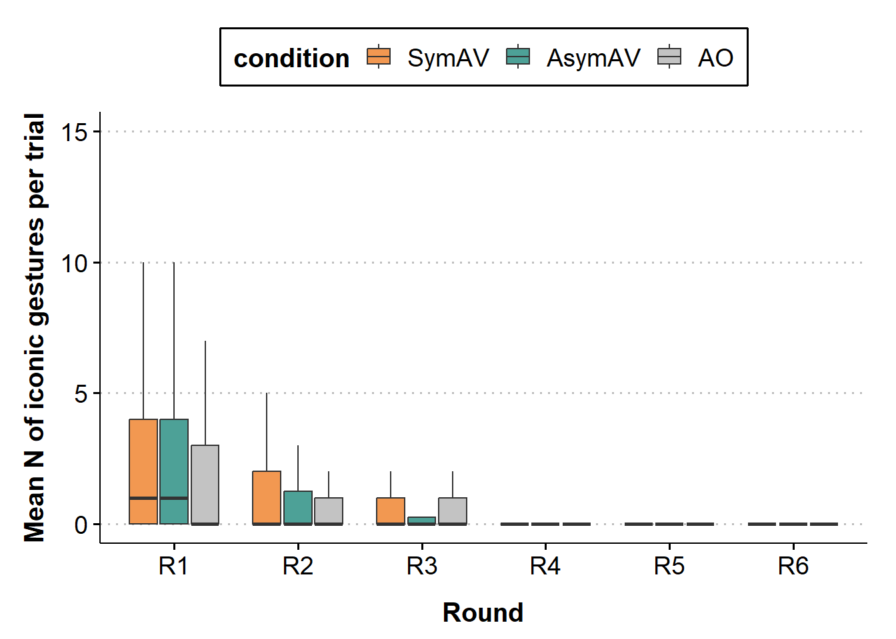<!-- -->

The figure shows that the decline in iconic gestures across rounds does
not follow a linear pattern. This suggests that log-transformed round
may improve the model fit.

<br>

------------------------------------------------------------------------

# 5. \[Chosen\] Rate of iconic gestures per 100 words

## 5.1 DataViz: rate per 100 words

### bp: mean by condition

``` r
bp_mean_iconic_rate_by_cond = ggplot(data=trial_info_pair, 
                                     aes(x=condition, y=mean_iconic_per_100words, fill=condition)) +
  geom_jitter(aes(color = pair), 
              size = 1, alpha = 1, 
              width = 0.07, height = 0) +
  geom_boxplot(width = .2,
               outlier.shape = NA, alpha = 0.7) +
  geom_point(data = trial_info_cond, 
             aes(y = mean_iconic_per_100words), 
             shape = 21, size = 3, fill = "white") +
  scale_y_continuous(limits = c(0, 8.1), breaks = seq(0, 8, 2)) +
  scale_fill_manual(values = c("#ED6B06", "#00786A", "darkgrey")) +
  labs(x = "Visibility",
       y = "Mean rate of iconic gestures") +
  theme_clean(base_size = 15) +
  theme(axis.text.x = element_text(colour = "black", size = 14),
        axis.text.y = element_text(colour = "black", size = 14),
        axis.title = element_text(size = 15, face = 'bold'),
        axis.title.x = element_text(vjust = -2),
        axis.title.y = element_text(vjust = 2),
        legend.position = "none",
        strip.text = element_text(size = 15, face = 'bold'),
        plot.background = element_blank(),
        plot.margin = unit(c(1.1,1.1,1.1,1.1), "lines"))

ggplotly(bp_mean_iconic_rate_by_cond)
```

<div class="plotly html-widget html-fill-item" id="htmlwidget-fee1da787c67468e017f" style="width:672px;height:480px;"></div>
<script type="application/json" data-for="htmlwidget-fee1da787c67468e017f">{"x":{"data":[{"x":[0.93135959119535983],"y":[3.4350715918423389],"text":"condition: SymAV<br />mean_iconic_per_100words: 3.435<br />condition: SymAV<br />pair: 1","type":"scatter","mode":"markers","marker":{"autocolorscale":false,"color":"rgba(237,107,6,1)","opacity":1,"size":3.7795275590551185,"symbol":"circle","line":{"width":1.8897637795275593,"color":"rgba(248,118,109,1)"}},"hoveron":"points","name":"(SymAV,1)","legendgroup":"(SymAV,1)","showlegend":true,"xaxis":"x","yaxis":"y","hoverinfo":"text","frame":null},{"x":[1.0402449682215229],"y":[1.7959619361802943],"text":"condition: SymAV<br />mean_iconic_per_100words: 1.796<br />condition: SymAV<br />pair: 5","type":"scatter","mode":"markers","marker":{"autocolorscale":false,"color":"rgba(237,107,6,1)","opacity":1,"size":3.7795275590551185,"symbol":"circle","line":{"width":1.8897637795275593,"color":"rgba(229,135,0,1)"}},"hoveron":"points","name":"(SymAV,5)","legendgroup":"(SymAV,5)","showlegend":true,"xaxis":"x","yaxis":"y","hoverinfo":"text","frame":null},{"x":[1.0620319355512038],"y":[5.1716985326243465],"text":"condition: SymAV<br />mean_iconic_per_100words: 5.172<br />condition: SymAV<br />pair: 8","type":"scatter","mode":"markers","marker":{"autocolorscale":false,"color":"rgba(237,107,6,1)","opacity":1,"size":3.7795275590551185,"symbol":"circle","line":{"width":1.8897637795275593,"color":"rgba(201,152,0,1)"}},"hoveron":"points","name":"(SymAV,8)","legendgroup":"(SymAV,8)","showlegend":true,"xaxis":"x","yaxis":"y","hoverinfo":"text","frame":null},{"x":[0.9917865500273183],"y":[3.4072091710343506],"text":"condition: SymAV<br />mean_iconic_per_100words: 3.407<br />condition: SymAV<br />pair: 11","type":"scatter","mode":"markers","marker":{"autocolorscale":false,"color":"rgba(237,107,6,1)","opacity":1,"size":3.7795275590551185,"symbol":"circle","line":{"width":1.8897637795275593,"color":"rgba(163,165,0,1)"}},"hoveron":"points","name":"(SymAV,11)","legendgroup":"(SymAV,11)","showlegend":true,"xaxis":"x","yaxis":"y","hoverinfo":"text","frame":null},{"x":[1.0231637349119409],"y":[3.4124240046344245],"text":"condition: SymAV<br />mean_iconic_per_100words: 3.412<br />condition: SymAV<br />pair: 15","type":"scatter","mode":"markers","marker":{"autocolorscale":false,"color":"rgba(237,107,6,1)","opacity":1,"size":3.7795275590551185,"symbol":"circle","line":{"width":1.8897637795275593,"color":"rgba(107,177,0,1)"}},"hoveron":"points","name":"(SymAV,15)","legendgroup":"(SymAV,15)","showlegend":true,"xaxis":"x","yaxis":"y","hoverinfo":"text","frame":null},{"x":[1.0140437857946381],"y":[5.9759077648299517],"text":"condition: SymAV<br />mean_iconic_per_100words: 5.976<br />condition: SymAV<br />pair: 18","type":"scatter","mode":"markers","marker":{"autocolorscale":false,"color":"rgba(237,107,6,1)","opacity":1,"size":3.7795275590551185,"symbol":"circle","line":{"width":1.8897637795275593,"color":"rgba(0,186,56,1)"}},"hoveron":"points","name":"(SymAV,18)","legendgroup":"(SymAV,18)","showlegend":true,"xaxis":"x","yaxis":"y","hoverinfo":"text","frame":null},{"x":[0.97797256351448592],"y":[0.7796172973819907],"text":"condition: SymAV<br />mean_iconic_per_100words: 0.780<br />condition: SymAV<br />pair: 21","type":"scatter","mode":"markers","marker":{"autocolorscale":false,"color":"rgba(237,107,6,1)","opacity":1,"size":3.7795275590551185,"symbol":"circle","line":{"width":1.8897637795275593,"color":"rgba(0,191,125,1)"}},"hoveron":"points","name":"(SymAV,21)","legendgroup":"(SymAV,21)","showlegend":true,"xaxis":"x","yaxis":"y","hoverinfo":"text","frame":null},{"x":[1.0223019578447565],"y":[3.6605629780109714],"text":"condition: SymAV<br />mean_iconic_per_100words: 3.661<br />condition: SymAV<br />pair: 24","type":"scatter","mode":"markers","marker":{"autocolorscale":false,"color":"rgba(237,107,6,1)","opacity":1,"size":3.7795275590551185,"symbol":"circle","line":{"width":1.8897637795275593,"color":"rgba(0,192,175,1)"}},"hoveron":"points","name":"(SymAV,24)","legendgroup":"(SymAV,24)","showlegend":true,"xaxis":"x","yaxis":"y","hoverinfo":"text","frame":null},{"x":[0.96351403579115869],"y":[0.87307360932203204],"text":"condition: SymAV<br />mean_iconic_per_100words: 0.873<br />condition: SymAV<br />pair: 27","type":"scatter","mode":"markers","marker":{"autocolorscale":false,"color":"rgba(237,107,6,1)","opacity":1,"size":3.7795275590551185,"symbol":"circle","line":{"width":1.8897637795275593,"color":"rgba(0,188,216,1)"}},"hoveron":"points","name":"(SymAV,27)","legendgroup":"(SymAV,27)","showlegend":true,"xaxis":"x","yaxis":"y","hoverinfo":"text","frame":null},{"x":[1.0405888879951091],"y":[1.6375527279874325],"text":"condition: SymAV<br />mean_iconic_per_100words: 1.638<br />condition: SymAV<br />pair: 30","type":"scatter","mode":"markers","marker":{"autocolorscale":false,"color":"rgba(237,107,6,1)","opacity":1,"size":3.7795275590551185,"symbol":"circle","line":{"width":1.8897637795275593,"color":"rgba(0,176,246,1)"}},"hoveron":"points","name":"(SymAV,30)","legendgroup":"(SymAV,30)","showlegend":true,"xaxis":"x","yaxis":"y","hoverinfo":"text","frame":null},{"x":[1.0285624677874148],"y":[3.8371553542536767],"text":"condition: SymAV<br />mean_iconic_per_100words: 3.837<br />condition: SymAV<br />pair: 33","type":"scatter","mode":"markers","marker":{"autocolorscale":false,"color":"rgba(237,107,6,1)","opacity":1,"size":3.7795275590551185,"symbol":"circle","line":{"width":1.8897637795275593,"color":"rgba(97,156,255,1)"}},"hoveron":"points","name":"(SymAV,33)","legendgroup":"(SymAV,33)","showlegend":true,"xaxis":"x","yaxis":"y","hoverinfo":"text","frame":null},{"x":[1.0573154718754814],"y":[5.2947408619057583],"text":"condition: SymAV<br />mean_iconic_per_100words: 5.295<br />condition: SymAV<br />pair: 36","type":"scatter","mode":"markers","marker":{"autocolorscale":false,"color":"rgba(237,107,6,1)","opacity":1,"size":3.7795275590551185,"symbol":"circle","line":{"width":1.8897637795275593,"color":"rgba(185,131,255,1)"}},"hoveron":"points","name":"(SymAV,36)","legendgroup":"(SymAV,36)","showlegend":true,"xaxis":"x","yaxis":"y","hoverinfo":"text","frame":null},{"x":[0.93113898905459791],"y":[1.195834478869094],"text":"condition: SymAV<br />mean_iconic_per_100words: 1.196<br />condition: SymAV<br />pair: 39","type":"scatter","mode":"markers","marker":{"autocolorscale":false,"color":"rgba(237,107,6,1)","opacity":1,"size":3.7795275590551185,"symbol":"circle","line":{"width":1.8897637795275593,"color":"rgba(231,107,243,1)"}},"hoveron":"points","name":"(SymAV,39)","legendgroup":"(SymAV,39)","showlegend":true,"xaxis":"x","yaxis":"y","hoverinfo":"text","frame":null},{"x":[1.0672034617234021],"y":[0.52854919268368838],"text":"condition: SymAV<br />mean_iconic_per_100words: 0.529<br />condition: SymAV<br />pair: 42","type":"scatter","mode":"markers","marker":{"autocolorscale":false,"color":"rgba(237,107,6,1)","opacity":1,"size":3.7795275590551185,"symbol":"circle","line":{"width":1.8897637795275593,"color":"rgba(253,97,209,1)"}},"hoveron":"points","name":"(SymAV,42)","legendgroup":"(SymAV,42)","showlegend":true,"xaxis":"x","yaxis":"y","hoverinfo":"text","frame":null},{"x":[1.0245038078725337],"y":[4.8090750938708755],"text":"condition: SymAV<br />mean_iconic_per_100words: 4.809<br />condition: SymAV<br />pair: 45","type":"scatter","mode":"markers","marker":{"autocolorscale":false,"color":"rgba(237,107,6,1)","opacity":1,"size":3.7795275590551185,"symbol":"circle","line":{"width":1.8897637795275593,"color":"rgba(255,103,164,1)"}},"hoveron":"points","name":"(SymAV,45)","legendgroup":"(SymAV,45)","showlegend":true,"xaxis":"x","yaxis":"y","hoverinfo":"text","frame":null},{"x":[1.9992478396277875],"y":[0.48923629280772141],"text":"condition: AsymAV<br />mean_iconic_per_100words: 0.489<br />condition: AsymAV<br />pair: 2","type":"scatter","mode":"markers","marker":{"autocolorscale":false,"color":"rgba(0,120,106,1)","opacity":1,"size":3.7795275590551185,"symbol":"circle","line":{"width":1.8897637795275593,"color":"rgba(242,124,86,1)"}},"hoveron":"points","name":"(AsymAV,2)","legendgroup":"(AsymAV,2)","showlegend":true,"xaxis":"x","yaxis":"y","hoverinfo":"text","frame":null},{"x":[2.06955359374173],"y":[3.2887216251435372],"text":"condition: AsymAV<br />mean_iconic_per_100words: 3.289<br />condition: AsymAV<br />pair: 6","type":"scatter","mode":"markers","marker":{"autocolorscale":false,"color":"rgba(0,120,106,1)","opacity":1,"size":3.7795275590551185,"symbol":"circle","line":{"width":1.8897637795275593,"color":"rgba(220,141,0,1)"}},"hoveron":"points","name":"(AsymAV,6)","legendgroup":"(AsymAV,6)","showlegend":true,"xaxis":"x","yaxis":"y","hoverinfo":"text","frame":null},{"x":[2.0664238827861845],"y":[5.5346868526016308],"text":"condition: AsymAV<br />mean_iconic_per_100words: 5.535<br />condition: AsymAV<br />pair: 9","type":"scatter","mode":"markers","marker":{"autocolorscale":false,"color":"rgba(0,120,106,1)","opacity":1,"size":3.7795275590551185,"symbol":"circle","line":{"width":1.8897637795275593,"color":"rgba(189,156,0,1)"}},"hoveron":"points","name":"(AsymAV,9)","legendgroup":"(AsymAV,9)","showlegend":true,"xaxis":"x","yaxis":"y","hoverinfo":"text","frame":null},{"x":[2.0691257620882242],"y":[3.9367829459296599],"text":"condition: AsymAV<br />mean_iconic_per_100words: 3.937<br />condition: AsymAV<br />pair: 12","type":"scatter","mode":"markers","marker":{"autocolorscale":false,"color":"rgba(0,120,106,1)","opacity":1,"size":3.7795275590551185,"symbol":"circle","line":{"width":1.8897637795275593,"color":"rgba(147,170,0,1)"}},"hoveron":"points","name":"(AsymAV,12)","legendgroup":"(AsymAV,12)","showlegend":true,"xaxis":"x","yaxis":"y","hoverinfo":"text","frame":null},{"x":[1.9377696636738255],"y":[0.35054786368215318],"text":"condition: AsymAV<br />mean_iconic_per_100words: 0.351<br />condition: AsymAV<br />pair: 16","type":"scatter","mode":"markers","marker":{"autocolorscale":false,"color":"rgba(0,120,106,1)","opacity":1,"size":3.7795275590551185,"symbol":"circle","line":{"width":1.8897637795275593,"color":"rgba(78,180,0,1)"}},"hoveron":"points","name":"(AsymAV,16)","legendgroup":"(AsymAV,16)","showlegend":true,"xaxis":"x","yaxis":"y","hoverinfo":"text","frame":null},{"x":[2.0461760386731473],"y":[7.0523900179913355],"text":"condition: AsymAV<br />mean_iconic_per_100words: 7.052<br />condition: AsymAV<br />pair: 19","type":"scatter","mode":"markers","marker":{"autocolorscale":false,"color":"rgba(0,120,106,1)","opacity":1,"size":3.7795275590551185,"symbol":"circle","line":{"width":1.8897637795275593,"color":"rgba(0,188,84,1)"}},"hoveron":"points","name":"(AsymAV,19)","legendgroup":"(AsymAV,19)","showlegend":true,"xaxis":"x","yaxis":"y","hoverinfo":"text","frame":null},{"x":[2.0281976824766024],"y":[4.7911399290461913],"text":"condition: AsymAV<br />mean_iconic_per_100words: 4.791<br />condition: AsymAV<br />pair: 22","type":"scatter","mode":"markers","marker":{"autocolorscale":false,"color":"rgba(0,120,106,1)","opacity":1,"size":3.7795275590551185,"symbol":"circle","line":{"width":1.8897637795275593,"color":"rgba(0,192,143,1)"}},"hoveron":"points","name":"(AsymAV,22)","legendgroup":"(AsymAV,22)","showlegend":true,"xaxis":"x","yaxis":"y","hoverinfo":"text","frame":null},{"x":[1.9669131465442478],"y":[8.0397277056951086],"text":"condition: AsymAV<br />mean_iconic_per_100words: 8.040<br />condition: AsymAV<br />pair: 25","type":"scatter","mode":"markers","marker":{"autocolorscale":false,"color":"rgba(0,120,106,1)","opacity":1,"size":3.7795275590551185,"symbol":"circle","line":{"width":1.8897637795275593,"color":"rgba(0,192,189,1)"}},"hoveron":"points","name":"(AsymAV,25)","legendgroup":"(AsymAV,25)","showlegend":true,"xaxis":"x","yaxis":"y","hoverinfo":"text","frame":null},{"x":[1.9505474920291455],"y":[0.77137754906507749],"text":"condition: AsymAV<br />mean_iconic_per_100words: 0.771<br />condition: AsymAV<br />pair: 28","type":"scatter","mode":"markers","marker":{"autocolorscale":false,"color":"rgba(0,120,106,1)","opacity":1,"size":3.7795275590551185,"symbol":"circle","line":{"width":1.8897637795275593,"color":"rgba(0,185,227,1)"}},"hoveron":"points","name":"(AsymAV,28)","legendgroup":"(AsymAV,28)","showlegend":true,"xaxis":"x","yaxis":"y","hoverinfo":"text","frame":null},{"x":[1.9399914790270849],"y":[4.3298083652334451],"text":"condition: AsymAV<br />mean_iconic_per_100words: 4.330<br />condition: AsymAV<br />pair: 31","type":"scatter","mode":"markers","marker":{"autocolorscale":false,"color":"rgba(0,120,106,1)","opacity":1,"size":3.7795275590551185,"symbol":"circle","line":{"width":1.8897637795275593,"color":"rgba(0,170,254,1)"}},"hoveron":"points","name":"(AsymAV,31)","legendgroup":"(AsymAV,31)","showlegend":true,"xaxis":"x","yaxis":"y","hoverinfo":"text","frame":null},{"x":[2.0076231946237386],"y":[2.4801700519878214],"text":"condition: AsymAV<br />mean_iconic_per_100words: 2.480<br />condition: AsymAV<br />pair: 34","type":"scatter","mode":"markers","marker":{"autocolorscale":false,"color":"rgba(0,120,106,1)","opacity":1,"size":3.7795275590551185,"symbol":"circle","line":{"width":1.8897637795275593,"color":"rgba(134,148,255,1)"}},"hoveron":"points","name":"(AsymAV,34)","legendgroup":"(AsymAV,34)","showlegend":true,"xaxis":"x","yaxis":"y","hoverinfo":"text","frame":null},{"x":[2.0352722864924],"y":[3.7550804882689208],"text":"condition: AsymAV<br />mean_iconic_per_100words: 3.755<br />condition: AsymAV<br />pair: 37","type":"scatter","mode":"markers","marker":{"autocolorscale":false,"color":"rgba(0,120,106,1)","opacity":1,"size":3.7795275590551185,"symbol":"circle","line":{"width":1.8897637795275593,"color":"rgba(203,122,255,1)"}},"hoveron":"points","name":"(AsymAV,37)","legendgroup":"(AsymAV,37)","showlegend":true,"xaxis":"x","yaxis":"y","hoverinfo":"text","frame":null},{"x":[1.9591880086855964],"y":[0.1388888888888889],"text":"condition: AsymAV<br />mean_iconic_per_100words: 0.139<br />condition: AsymAV<br />pair: 40","type":"scatter","mode":"markers","marker":{"autocolorscale":false,"color":"rgba(0,120,106,1)","opacity":1,"size":3.7795275590551185,"symbol":"circle","line":{"width":1.8897637795275593,"color":"rgba(241,102,233,1)"}},"hoveron":"points","name":"(AsymAV,40)","legendgroup":"(AsymAV,40)","showlegend":true,"xaxis":"x","yaxis":"y","hoverinfo":"text","frame":null},{"x":[1.9953112325444817],"y":[0.1457701086200574],"text":"condition: AsymAV<br />mean_iconic_per_100words: 0.146<br />condition: AsymAV<br />pair: 43","type":"scatter","mode":"markers","marker":{"autocolorscale":false,"color":"rgba(0,120,106,1)","opacity":1,"size":3.7795275590551185,"symbol":"circle","line":{"width":1.8897637795275593,"color":"rgba(255,97,195,1)"}},"hoveron":"points","name":"(AsymAV,43)","legendgroup":"(AsymAV,43)","showlegend":true,"xaxis":"x","yaxis":"y","hoverinfo":"text","frame":null},{"x":[1.9973682859726249],"y":[0.11897412152081083],"text":"condition: AsymAV<br />mean_iconic_per_100words: 0.119<br />condition: AsymAV<br />pair: 46","type":"scatter","mode":"markers","marker":{"autocolorscale":false,"color":"rgba(0,120,106,1)","opacity":1,"size":3.7795275590551185,"symbol":"circle","line":{"width":1.8897637795275593,"color":"rgba(255,107,147,1)"}},"hoveron":"points","name":"(AsymAV,46)","legendgroup":"(AsymAV,46)","showlegend":true,"xaxis":"x","yaxis":"y","hoverinfo":"text","frame":null},{"x":[2.9554740707715972],"y":[0.29864107836273579],"text":"condition: AO<br />mean_iconic_per_100words: 0.299<br />condition: AO<br />pair: 3","type":"scatter","mode":"markers","marker":{"autocolorscale":false,"color":"rgba(169,169,169,1)","opacity":1,"size":3.7795275590551185,"symbol":"circle","line":{"width":1.8897637795275593,"color":"rgba(236,130,58,1)"}},"hoveron":"points","name":"(AO,3)","legendgroup":"(AO,3)","showlegend":true,"xaxis":"x","yaxis":"y","hoverinfo":"text","frame":null},{"x":[3.0397221277700739],"y":[0.93071771729667718],"text":"condition: AO<br />mean_iconic_per_100words: 0.931<br />condition: AO<br />pair: 7","type":"scatter","mode":"markers","marker":{"autocolorscale":false,"color":"rgba(169,169,169,1)","opacity":1,"size":3.7795275590551185,"symbol":"circle","line":{"width":1.8897637795275593,"color":"rgba(211,146,0,1)"}},"hoveron":"points","name":"(AO,7)","legendgroup":"(AO,7)","showlegend":true,"xaxis":"x","yaxis":"y","hoverinfo":"text","frame":null},{"x":[3.01477527001407],"y":[0.10969065656565657],"text":"condition: AO<br />mean_iconic_per_100words: 0.110<br />condition: AO<br />pair: 10","type":"scatter","mode":"markers","marker":{"autocolorscale":false,"color":"rgba(169,169,169,1)","opacity":1,"size":3.7795275590551185,"symbol":"circle","line":{"width":1.8897637795275593,"color":"rgba(177,161,0,1)"}},"hoveron":"points","name":"(AO,10)","legendgroup":"(AO,10)","showlegend":true,"xaxis":"x","yaxis":"y","hoverinfo":"text","frame":null},{"x":[3.0560491752391683],"y":[2.5402786693990054],"text":"condition: AO<br />mean_iconic_per_100words: 2.540<br />condition: AO<br />pair: 13","type":"scatter","mode":"markers","marker":{"autocolorscale":false,"color":"rgba(169,169,169,1)","opacity":1,"size":3.7795275590551185,"symbol":"circle","line":{"width":1.8897637795275593,"color":"rgba(129,173,0,1)"}},"hoveron":"points","name":"(AO,13)","legendgroup":"(AO,13)","showlegend":true,"xaxis":"x","yaxis":"y","hoverinfo":"text","frame":null},{"x":[2.9817936591897158],"y":[6.0717288551239177],"text":"condition: AO<br />mean_iconic_per_100words: 6.072<br />condition: AO<br />pair: 17","type":"scatter","mode":"markers","marker":{"autocolorscale":false,"color":"rgba(169,169,169,1)","opacity":1,"size":3.7795275590551185,"symbol":"circle","line":{"width":1.8897637795275593,"color":"rgba(21,183,0,1)"}},"hoveron":"points","name":"(AO,17)","legendgroup":"(AO,17)","showlegend":true,"xaxis":"x","yaxis":"y","hoverinfo":"text","frame":null},{"x":[2.9664522332744672],"y":[4.7148753756554145],"text":"condition: AO<br />mean_iconic_per_100words: 4.715<br />condition: AO<br />pair: 20","type":"scatter","mode":"markers","marker":{"autocolorscale":false,"color":"rgba(169,169,169,1)","opacity":1,"size":3.7795275590551185,"symbol":"circle","line":{"width":1.8897637795275593,"color":"rgba(0,190,106,1)"}},"hoveron":"points","name":"(AO,20)","legendgroup":"(AO,20)","showlegend":true,"xaxis":"x","yaxis":"y","hoverinfo":"text","frame":null},{"x":[3.0298193045891821],"y":[0.31472489533295733],"text":"condition: AO<br />mean_iconic_per_100words: 0.315<br />condition: AO<br />pair: 23","type":"scatter","mode":"markers","marker":{"autocolorscale":false,"color":"rgba(169,169,169,1)","opacity":1,"size":3.7795275590551185,"symbol":"circle","line":{"width":1.8897637795275593,"color":"rgba(0,193,159,1)"}},"hoveron":"points","name":"(AO,23)","legendgroup":"(AO,23)","showlegend":true,"xaxis":"x","yaxis":"y","hoverinfo":"text","frame":null},{"x":[2.951305600279011],"y":[1.8141364319958131],"text":"condition: AO<br />mean_iconic_per_100words: 1.814<br />condition: AO<br />pair: 26","type":"scatter","mode":"markers","marker":{"autocolorscale":false,"color":"rgba(169,169,169,1)","opacity":1,"size":3.7795275590551185,"symbol":"circle","line":{"width":1.8897637795275593,"color":"rgba(0,190,203,1)"}},"hoveron":"points","name":"(AO,26)","legendgroup":"(AO,26)","showlegend":true,"xaxis":"x","yaxis":"y","hoverinfo":"text","frame":null},{"x":[3.0469971937220546],"y":[3.6964309761756429],"text":"condition: AO<br />mean_iconic_per_100words: 3.696<br />condition: AO<br />pair: 29","type":"scatter","mode":"markers","marker":{"autocolorscale":false,"color":"rgba(169,169,169,1)","opacity":1,"size":3.7795275590551185,"symbol":"circle","line":{"width":1.8897637795275593,"color":"rgba(0,181,238,1)"}},"hoveron":"points","name":"(AO,29)","legendgroup":"(AO,29)","showlegend":true,"xaxis":"x","yaxis":"y","hoverinfo":"text","frame":null},{"x":[3.0476760646933689],"y":[1.4838362617074001],"text":"condition: AO<br />mean_iconic_per_100words: 1.484<br />condition: AO<br />pair: 32","type":"scatter","mode":"markers","marker":{"autocolorscale":false,"color":"rgba(169,169,169,1)","opacity":1,"size":3.7795275590551185,"symbol":"circle","line":{"width":1.8897637795275593,"color":"rgba(24,163,255,1)"}},"hoveron":"points","name":"(AO,32)","legendgroup":"(AO,32)","showlegend":true,"xaxis":"x","yaxis":"y","hoverinfo":"text","frame":null},{"x":[3.0373170704813672],"y":[5.2234897702515157],"text":"condition: AO<br />mean_iconic_per_100words: 5.223<br />condition: AO<br />pair: 35","type":"scatter","mode":"markers","marker":{"autocolorscale":false,"color":"rgba(169,169,169,1)","opacity":1,"size":3.7795275590551185,"symbol":"circle","line":{"width":1.8897637795275593,"color":"rgba(162,139,255,1)"}},"hoveron":"points","name":"(AO,35)","legendgroup":"(AO,35)","showlegend":true,"xaxis":"x","yaxis":"y","hoverinfo":"text","frame":null},{"x":[2.9772018403373659],"y":[1.7198535500745866],"text":"condition: AO<br />mean_iconic_per_100words: 1.720<br />condition: AO<br />pair: 38","type":"scatter","mode":"markers","marker":{"autocolorscale":false,"color":"rgba(169,169,169,1)","opacity":1,"size":3.7795275590551185,"symbol":"circle","line":{"width":1.8897637795275593,"color":"rgba(219,114,251,1)"}},"hoveron":"points","name":"(AO,38)","legendgroup":"(AO,38)","showlegend":true,"xaxis":"x","yaxis":"y","hoverinfo":"text","frame":null},{"x":[2.936318369694054],"y":[0.51291008580686515],"text":"condition: AO<br />mean_iconic_per_100words: 0.513<br />condition: AO<br />pair: 41","type":"scatter","mode":"markers","marker":{"autocolorscale":false,"color":"rgba(169,169,169,1)","opacity":1,"size":3.7795275590551185,"symbol":"circle","line":{"width":1.8897637795275593,"color":"rgba(248,98,222,1)"}},"hoveron":"points","name":"(AO,41)","legendgroup":"(AO,41)","showlegend":true,"xaxis":"x","yaxis":"y","hoverinfo":"text","frame":null},{"x":[3.0078155374433844],"y":[6.8022204519760976],"text":"condition: AO<br />mean_iconic_per_100words: 6.802<br />condition: AO<br />pair: 44","type":"scatter","mode":"markers","marker":{"autocolorscale":false,"color":"rgba(169,169,169,1)","opacity":1,"size":3.7795275590551185,"symbol":"circle","line":{"width":1.8897637795275593,"color":"rgba(255,99,180,1)"}},"hoveron":"points","name":"(AO,44)","legendgroup":"(AO,44)","showlegend":true,"xaxis":"x","yaxis":"y","hoverinfo":"text","frame":null},{"x":[3.0218716659210623],"y":[2.7552412181850849],"text":"condition: AO<br />mean_iconic_per_100words: 2.755<br />condition: AO<br />pair: 47","type":"scatter","mode":"markers","marker":{"autocolorscale":false,"color":"rgba(169,169,169,1)","opacity":1,"size":3.7795275590551185,"symbol":"circle","line":{"width":1.8897637795275593,"color":"rgba(252,113,129,1)"}},"hoveron":"points","name":"(AO,47)","legendgroup":"(AO,47)","showlegend":true,"xaxis":"x","yaxis":"y","hoverinfo":"text","frame":null},{"x":[1,1,1,1,1,1,1,1,1,1,1,1,1,1,1],"y":[3.4350715918423389,1.6375527279874325,5.9759077648299517,1.7959619361802943,3.8371553542536767,0.7796172973819907,5.1716985326243465,5.2947408619057583,3.6605629780109714,3.4072091710343506,1.195834478869094,0.87307360932203204,3.4124240046344245,0.52854919268368838,4.8090750938708755],"hoverinfo":"y","type":"box","fillcolor":"rgba(237,107,6,0.7)","marker":{"opacity":null,"outliercolor":"rgba(0,0,0,1)","line":{"width":1.8897637795275593,"color":"rgba(0,0,0,1)"},"size":5.6692913385826778},"line":{"color":"rgba(51,51,51,1)","width":1.8897637795275593},"name":"(SymAV,1)","legendgroup":"(SymAV,1)","showlegend":false,"xaxis":"x","yaxis":"y","frame":null},{"x":[2,2,2,2,2,2,2,2,2,2,2,2,2,2,2],"y":[0.48923629280772141,4.3298083652334451,3.2887216251435372,2.4801700519878214,4.7911399290461913,5.5346868526016308,3.7550804882689208,8.0397277056951086,3.9367829459296599,0.1388888888888889,0.77137754906507749,0.35054786368215318,0.1457701086200574,7.0523900179913355,0.11897412152081083],"hoverinfo":"y","type":"box","fillcolor":"rgba(0,120,106,0.7)","marker":{"opacity":null,"outliercolor":"rgba(0,0,0,1)","line":{"width":1.8897637795275593,"color":"rgba(0,0,0,1)"},"size":5.6692913385826778},"line":{"color":"rgba(51,51,51,1)","width":1.8897637795275593},"name":"(AsymAV,1)","legendgroup":"(AsymAV,1)","showlegend":true,"xaxis":"x","yaxis":"y","frame":null},{"x":[3,3,3,3,3,3,3,3,3,3,3,3,3,3,3],"y":[0.29864107836273579,0.93071771729667718,5.2234897702515157,0.31472489533295733,0.10969065656565657,1.7198535500745866,1.8141364319958131,2.5402786693990054,0.51291008580686515,3.6964309761756429,6.0717288551239177,6.8022204519760976,1.4838362617074001,4.7148753756554145,2.7552412181850849],"hoverinfo":"y","type":"box","fillcolor":"rgba(169,169,169,0.7)","marker":{"opacity":null,"outliercolor":"rgba(0,0,0,1)","line":{"width":1.8897637795275593,"color":"rgba(0,0,0,1)"},"size":5.6692913385826778},"line":{"color":"rgba(51,51,51,1)","width":1.8897637795275593},"name":"(AO,1)","legendgroup":"(AO,1)","showlegend":true,"xaxis":"x","yaxis":"y","frame":null},{"x":[1,2,3],"y":[3.0542956396954151,3.0148868537654905,2.6051219845751281],"text":["condition: SymAV<br />mean_iconic_per_100words: 3.05<br />condition: white","condition: AsymAV<br />mean_iconic_per_100words: 3.01<br />condition: white","condition: AO<br />mean_iconic_per_100words: 2.61<br />condition: white"],"type":"scatter","mode":"markers","marker":{"autocolorscale":false,"color":"rgba(255,255,255,1)","opacity":1,"size":11.338582677165356,"symbol":"circle","line":{"width":1.8897637795275593,"color":"rgba(0,0,0,1)"}},"hoveron":"points","showlegend":false,"xaxis":"x","yaxis":"y","hoverinfo":"text","frame":null}],"layout":{"margin":{"t":37.119999999999997,"r":21.119999999999997,"b":64.623528435035269,"l":55.325064342050652},"font":{"color":"rgba(0,0,0,1)","family":"sans","size":19.9252801992528},"xaxis":{"domain":[0,1],"automargin":true,"type":"linear","autorange":false,"range":[0.40000000000000002,3.6000000000000001],"tickmode":"array","ticktext":["SymAV","AsymAV","AO"],"tickvals":[1,2,3],"categoryorder":"array","categoryarray":["SymAV","AsymAV","AO"],"nticks":null,"ticks":"outside","tickcolor":"rgba(0,0,0,1)","ticklen":4.9813200498132,"tickwidth":0.90569455451149106,"showticklabels":true,"tickfont":{"color":"rgba(0,0,0,1)","family":"sans","size":18.596928185969279},"tickangle":-0,"showline":true,"linecolor":"rgba(0,0,0,1)","linewidth":0.66417600664176002,"showgrid":false,"gridcolor":null,"gridwidth":0,"zeroline":false,"anchor":"y","title":{"text":"<b> Visibility <\/b>","font":{"color":"rgba(0,0,0,1)","family":"sans","size":19.9252801992528}},"hoverformat":".2f"},"yaxis":{"domain":[0,1],"automargin":true,"type":"linear","autorange":false,"range":[-0.40500000000000003,8.504999999999999],"tickmode":"array","ticktext":["0","2","4","6","8"],"tickvals":[-5.5511151231257827e-17,2.0000000000000009,4,6,7.9999999999999991],"categoryorder":"array","categoryarray":["0","2","4","6","8"],"nticks":null,"ticks":"outside","tickcolor":"rgba(0,0,0,1)","ticklen":4.9813200498132018,"tickwidth":0.90569455451149117,"showticklabels":true,"tickfont":{"color":"rgba(0,0,0,1)","family":"sans","size":18.596928185969279},"tickangle":-0,"showline":true,"linecolor":"rgba(0,0,0,1)","linewidth":0.66417600664176002,"showgrid":true,"gridcolor":"rgba(190,190,190,1)","gridwidth":0.90569455451149117,"zeroline":false,"anchor":"x","title":{"text":"<b> Mean rate of iconic gestures <\/b>","font":{"color":"rgba(0,0,0,1)","family":"sans","size":19.9252801992528}},"hoverformat":".2f"},"shapes":[{"type":"rect","fillcolor":null,"line":{"color":null,"width":0,"linetype":[]},"yref":"paper","xref":"paper","x0":0,"x1":1,"y0":0,"y1":1}],"showlegend":false,"legend":{"bgcolor":"rgba(255,255,255,1)","bordercolor":"rgba(0,0,0,1)","borderwidth":2.5769506084466713,"font":{"color":"rgba(0,0,0,1)","family":"sans","size":18.596928185969279}},"hovermode":"closest","barmode":"relative"},"config":{"doubleClick":"reset","modeBarButtonsToAdd":["hoverclosest","hovercompare"],"showSendToCloud":false},"source":"A","attrs":{"21cc5af46bf8":{"x":{},"y":{},"fill":{},"colour":{},"type":"scatter"},"21cc17b96cdd":{"x":{},"y":{},"fill":{}},"21cc3e3f3dcf":{"x":{},"y":{},"fill":{}}},"cur_data":"21cc5af46bf8","visdat":{"21cc5af46bf8":["function (y) ","x"],"21cc17b96cdd":["function (y) ","x"],"21cc3e3f3dcf":["function (y) ","x"]},"highlight":{"on":"plotly_click","persistent":false,"dynamic":false,"selectize":false,"opacityDim":0.20000000000000001,"selected":{"opacity":1},"debounce":0},"shinyEvents":["plotly_hover","plotly_click","plotly_selected","plotly_relayout","plotly_brushed","plotly_brushing","plotly_clickannotation","plotly_doubleclick","plotly_deselect","plotly_afterplot","plotly_sunburstclick"],"base_url":"https://plot.ly"},"evals":[],"jsHooks":[]}</script>

<br>

### bp: mean by condition x round

``` r
pd = position_dodge(width = .75)

ggplot(data=df_trial_info, 
       aes(x=round, y=n_iconic_per_100words, fill=condition)) +
  geom_boxplot(outlier.shape = NA,
               alpha = 0.7) +
  geom_point(data = trial_info_cond_round, 
             aes(y = mean_iconic_per_100words, 
                 group = condition),
             position = pd,
             shape = 21, size = 2, fill = "white") +
  scale_fill_manual(values = c("#ED6B06", "#00786A", "darkgrey")) +
  scale_y_continuous(limits = c(0, 22), breaks = seq(0, 20, 5)) +
  labs(x = "Round",
       y = "Mean rate of iconic gestures") +
  theme_clean(base_size = 15) +
  theme(axis.text.x = element_text(colour = "black", size = 14),
        axis.text.y = element_text(colour = "black", size = 14),
        axis.title = element_text(size = 15, face = 'bold'),
        axis.title.x = element_text(vjust = -2),
        axis.title.y = element_text(vjust = 2),
        legend.position = "top",
        strip.text = element_text(size = 15, face = 'bold'),
        plot.background = element_blank(),
        plot.margin = unit(c(1.1,1.1,1.1,1.1), "lines"))
```

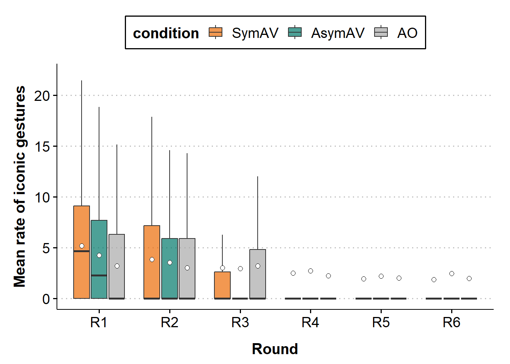<!-- -->

<br>

## 5.2 \[Chosen\] ZI negative binomial regression models

### 5.2.1 Prior specification

As the unit of the dependent variable is different from the previous
model, we will set different priors for the rate of iconic gestures per
100 words. We will use weakly informative priors for the regression each
parameter. To specify priors for the intercept, we will refer to the
number of iconic gestures and words reported in Akamine et al. (2024).
In the paper, the authors analyzed data from 19 dyads involving in the
same task as the current study but in co-present interaction. The total
number of iconic gestures reported was 4413, which was collected from 19
dyads, each performing 96 trials. The total number of words produced was
71695 (28152 content) words. Therefore, the expected rate of iconic
gestures per 100 words per speaker is $4413 / (71695 / 100) / 2 = 3.08$
(log(3.08) = 1.12).

For the fixed effects, we will set unbiased priors with a mean of 0 and
a standard deviation of 0.5.

For the standard deviation of the random effects, we set the prior to be
normal with mean 0 and standard deviation 0.5. For the correlation
between the random effects, we set the prior to be LKJ(2).

For the models including the round as fixed effects (whether
backward-difference coded or centered + log-transformed), the intercept
will represent the mean expected number of iconic gestures (ground
mean). As the meaning of the intercept doesn’t change when adding the
round variable, we use the same prior for the intercept.

Note that we do not expect the rate of iconic gestures to change across
rounds (i.e., we expect the number of words and gestures to decrease at
an approximately same pace across the rounds). Also, it is common to set
the mean of slopes to be 0 to avoid favoring any directions. Therefore
we will set the mean of the prior for slope to 0.

``` r
priors_rslope_rate = c(
  prior(normal(1.12, 0.5), class = Intercept),
  prior(normal(0, 0.5), class = b),
  prior(normal(0, 0.5), class = sd),
  prior(lkj(2), class = cor))

priors_rslope_rate_zinb = c(
  prior(normal(1.12, 0.5), class = Intercept),
  prior(normal(0, 0.5), class = b),
  prior(normal(0, 0.5), class = sd),
  prior(lkj(2), class = cor),
  prior(normal(0, 0.5), class = zi), # on the logit scale
  prior(normal(0, 50), class = shape))
```

<br>

### 5.2.2 Model 1: condition x round (pair)

In the previous section, we analyzed the number of iconic gestures
produced per trial. However, it is common to analyze the rate of iconic
gestures per 100 words to account for the differences in the length of
the trials and speech rate. Here, we will include the log of speech rate
(number of words / 100) as an exposure variable and analyze the rate of
iconic gestures per 100 words by condition. Note that the syntax for the
exposure variable is different from the Poisson regression model; for
negative binomial regression, the exposure variable is included with the
rate() function.

<br>

#### Model effect: round

``` r
nb_iconic_rate_cond_round = brm(num_iconic_gestures | rate(n_words_100) ~ 
                                  1 + condition * round + 
                                  (1+round|pair) + (1|target),
                                family = negbinomial(),
                                prior = priors_rslope_rate,
                                data = df_trial_info,
                                sample_prior = T,
                                warmup = nwu, iter = niter,
                                control = list(adapt_delta = 0.9, 
                                               max_treedepth = 15),
                                file = "models/speakerB/nb_iconic_rate_cond_round")

nb_iconic_rate_cond_round_c = brm(num_iconic_gestures | rate(n_words_100) ~ 
                                    1 + condition * round_c + 
                                    (1+round_c|pair) + (1|target),
                                  family = negbinomial(),
                                  prior = priors_rslope_rate,
                                  data = df_trial_info,
                                  sample_prior = T,
                                  warmup = nwu, iter = niter,
                                  control = list(adapt_delta = 0.9, 
                                                 max_treedepth = 15),
                                  file = "models/speakerB/nb_iconic_rate_cond_round_c")

nb_iconic_rate_cond_round_log = brm(num_iconic_gestures | rate(n_words_100) ~ 
                                      1 + condition * log_round_c + 
                                      (1+log_round_c|pair) + (1|target),
                                    family = negbinomial(),
                                    prior = priors_rslope_rate,
                                    data = df_trial_info,
                                    sample_prior = T,
                                    warmup = nwu, iter = niter,
                                    control = list(adapt_delta = 0.9, 
                                                   max_treedepth = 15),
                                    file = "models/speakerB/nb_iconic_rate_cond_round_log")


### loo compare
if (!file.exists("models/speakerB/loo_nb_iconic_rate_cond_round.rds")){
  nb_cond_round_loo = loo(nb_iconic_rate_cond_round)
  saveRDS(nb_cond_round_loo, file = "models/speakerB/loo_nb_iconic_rate_cond_round.rds")
}

if (!file.exists("models/speakerB/loo_nb_iconic_rate_cond_round_c.rds")){
  nb_cond_round_c_loo = loo(nb_iconic_rate_cond_round_c)
  saveRDS(nb_cond_round_c_loo, file = "models/speakerB/loo_nb_iconic_rate_cond_round_c.rds")
}

if (!file.exists("models/speakerB/loo_nb_iconic_rate_cond_round_log.rds")){
  nb_cond_round_log_loo = loo(nb_iconic_rate_cond_round_log)
  saveRDS(nb_cond_round_log_loo, file = "models/speakerB/loo_nb_iconic_rate_cond_round_log.rds")
}

nb_cond_round_loo = readRDS("models/speakerB/loo_nb_iconic_rate_cond_round.rds")
nb_cond_round_c_loo = readRDS("models/speakerB/loo_nb_iconic_rate_cond_round_c.rds")
nb_cond_round_log_loo = readRDS("models/speakerB/loo_nb_iconic_rate_cond_round_log.rds")

loo_compare(nb_cond_round_loo, nb_cond_round_c_loo, nb_cond_round_log_loo)
```

    ##                               elpd_diff se_diff
    ## nb_iconic_rate_cond_round_c     0.0       0.0  
    ## nb_iconic_rate_cond_round_log  -7.8       3.0  
    ## nb_iconic_rate_cond_round     -11.5       4.0

The leave-one-out (LOO) Effect shows that centered round provides a
larger predictive power (elpd_diff) and smaller standard error (se_diff)
compared to the backward-difference coded round or centered
log-transformed round. Therefore, we will use the centered round.

<br>

#### Model effect: ZI or not

``` r
zinb_iconic_rate_cond_round_c = brm(num_iconic_gestures ~ 1 + condition * round_c + 
                                      offset(log(n_words_100)) +
                                      (1+round_c|pair) + (1|target),
                                    family = zero_inflated_negbinomial(),
                                    prior = priors_rslope_rate_zinb,
                                    data = df_trial_info,
                                    sample_prior = T,
                                    warmup = nwu, iter = niter,
                                    control = list(adapt_delta = 0.9, 
                                                   max_treedepth = 15),
                                    file = "models/speakerB/zinb_iconic_rate_cond_round_c")


### loo compare
if (!file.exists("models/speakerB/loo_zinb_iconic_rate_cond_round_c.rds")){
  zinb_cond_round_c_loo = loo(zinb_iconic_rate_cond_round_c)
  saveRDS(zinb_cond_round_c_loo, file = "models/speakerB/loo_zinb_iconic_rate_cond_round_c.rds")
}

nb_cond_round_c_loo = readRDS("models/speakerB/loo_nb_iconic_rate_cond_round_c.rds")
zinb_cond_round_c_loo = readRDS("models/speakerB/loo_zinb_iconic_rate_cond_round_c.rds")

loo_compare(nb_cond_round_c_loo, zinb_cond_round_c_loo)
```

    ##                               elpd_diff se_diff
    ## nb_iconic_rate_cond_round_c     0.0       0.0  
    ## zinb_iconic_rate_cond_round_c -13.1       5.6

The leave-one-out (LOO) Effect shows that zero-inflation model has a
higher predictive power. As such, we will use zero-inflated negative
binomial regression model.

<br>

#### Prior predictive check

``` r
zinb_iconic_rate_cond_round_c_prior = brm(num_iconic_gestures ~ 1 + condition * round_c + 
                                            offset(log(n_words_100)) +
                                            (1+round_c|pair) + (1|target),
                                          family = zero_inflated_negbinomial(),
                                          prior = priors_rslope_rate_zinb,
                                          sample_prior = "only",
                                          data = df_trial_info,
                                          file = "models/speakerB/zinb_iconic_rate_cond_round_c_prior")

pp_check(zinb_iconic_rate_cond_round_c_prior, ndraws = 100, type = "bars") +
  coord_cartesian(xlim = c(0, 20),
                  ylim = c(0, 4000))
```

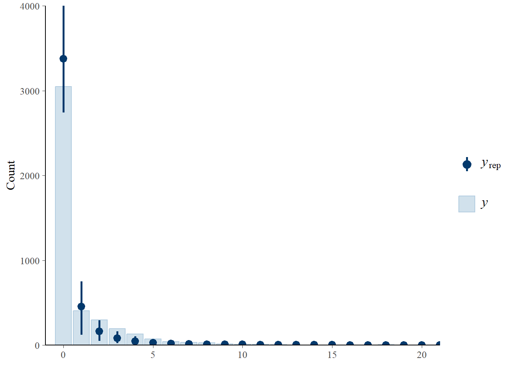<!-- -->

The prior predictive check shows that the model generates data that are
somewhat similar to the observed data.

<br>

#### Fit the model

``` r
zinb_iconic_rate_cond_round_c = brm(num_iconic_gestures ~ 1 + condition * round_c + 
                                      offset(log(n_words_100)) +
                                      (1+round_c|pair) + (1|target),
                                    family = zero_inflated_negbinomial(),
                                    prior = priors_rslope_rate_zinb,
                                    data = df_trial_info,
                                    sample_prior = T,
                                    save_pars = save_pars(all = TRUE),
                                    warmup = nwu, iter = niter,
                                    control = list(adapt_delta = 0.9, 
                                                   max_treedepth = 15),
                                    file = "models/speakerB/zinb_iconic_rate_cond_round_c")

model = zinb_iconic_rate_cond_round_c
summary(model)
```

    ##  Family: zero_inflated_negbinomial 
    ##   Links: mu = log; shape = identity; zi = identity 
    ## Formula: num_iconic_gestures ~ 1 + condition * round_c + offset(log(n_words_100)) + (1 + round_c | pair) + (1 | target) 
    ##    Data: df_trial_info (Number of observations: 4315) 
    ##   Draws: 4 chains, each with iter = 20000; warmup = 2000; thin = 1;
    ##          total post-warmup draws = 72000
    ## 
    ## Multilevel Hyperparameters:
    ## ~pair (Number of levels: 45) 
    ##                        Estimate Est.Error l-95% CI u-95% CI Rhat Bulk_ESS
    ## sd(Intercept)              1.07      0.12     0.86     1.32 1.00    22737
    ## sd(round_c)                0.18      0.03     0.12     0.25 1.00    24819
    ## cor(Intercept,round_c)     0.64      0.14     0.33     0.85 1.00    45391
    ##                        Tail_ESS
    ## sd(Intercept)             38254
    ## sd(round_c)               43353
    ## cor(Intercept,round_c)    52376
    ## 
    ## ~target (Number of levels: 16) 
    ##               Estimate Est.Error l-95% CI u-95% CI Rhat Bulk_ESS Tail_ESS
    ## sd(Intercept)     0.09      0.03     0.03     0.16 1.00    20734    21617
    ## 
    ## Regression Coefficients:
    ##                           Estimate Est.Error l-95% CI u-95% CI Rhat Bulk_ESS
    ## Intercept                     1.06      0.16     0.74     1.37 1.00    12895
    ## conditionAO_Asym              0.04      0.30    -0.54     0.64 1.00    17833
    ## conditionAsym_Sym             0.30      0.30    -0.30     0.88 1.00    16364
    ## round_c                      -0.15      0.03    -0.22    -0.08 1.00    26726
    ## conditionAO_Asym:round_c     -0.02      0.07    -0.16     0.12 1.00    27271
    ## conditionAsym_Sym:round_c    -0.05      0.07    -0.19     0.09 1.00    26257
    ##                           Tail_ESS
    ## Intercept                    23113
    ## conditionAO_Asym             29556
    ## conditionAsym_Sym            28836
    ## round_c                      40828
    ## conditionAO_Asym:round_c     42495
    ## conditionAsym_Sym:round_c    41516
    ## 
    ## Further Distributional Parameters:
    ##       Estimate Est.Error l-95% CI u-95% CI Rhat Bulk_ESS Tail_ESS
    ## shape    27.46     14.13    12.22    65.98 1.00    97158    54751
    ## zi        0.06      0.02     0.03     0.10 1.00    97748    46648
    ## 
    ## Draws were sampled using sample(hmc). For each parameter, Bulk_ESS
    ## and Tail_ESS are effective sample size measures, and Rhat is the potential
    ## scale reduction factor on split chains (at convergence, Rhat = 1).

``` r
bayestestR::hdi(model)
```

    ## Highest Density Interval
    ## 
    ## Parameter                 |        95% HDI
    ## ------------------------------------------
    ## (Intercept)               | [ 0.75,  1.38]
    ## conditionAO_Asym          | [-0.54,  0.64]
    ## conditionAsym_Sym         | [-0.28,  0.90]
    ## round_c                   | [-0.22, -0.08]
    ## conditionAO_Asym:round_c  | [-0.16,  0.12]
    ## conditionAsym_Sym:round_c | [-0.19,  0.09]

``` r
# bayestestR::hdi(model, ci = 0.89)
```

The coefficients show that the condition does not have a significant
effect on the rate of iconic gestures per 100 words. However, there was
a significant decrease in the rate of iconic gestures per 100 words
across the rounds. This means that the number of iconic gestures
decreased more than the number of words did across the rounds. A formal
hypothesis testing will be performed later using Bayes factor.

<br>

#### Visualize the posterior distributions

``` r
p = plot_posterior(model, interaction = T)
p
```

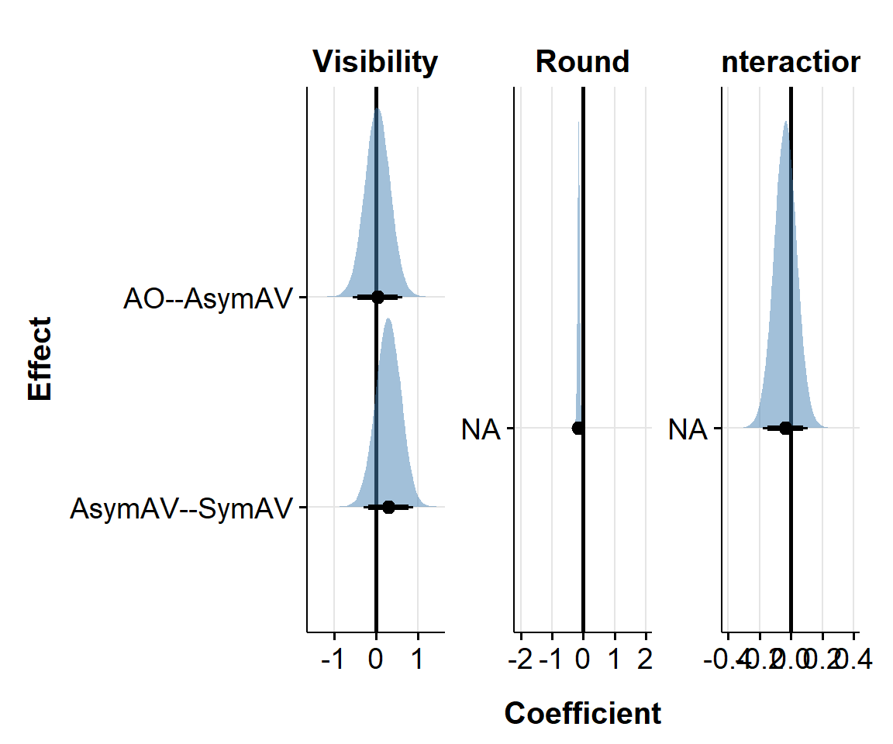<!-- -->

<br>

#### Hypothesis testing: Bayes factor

``` r
### varying priors for sensitivity analysis
prior_size = c("xs", "s", "l", "xl")
prior_sd = c(0.1, 0.3, 1, 1.5)
bfs_cond_ao_asym = c()
bfs_cond_asym_sym = c()
bfs_round = c()

for (i in 1:length(prior_sd)){
  priors = c(
    prior(normal(1.82, 0.5), class = Intercept),
    set_prior(paste0("normal(0,", prior_sd[i], ")"), class = "b"),
    prior(normal(0, 0.5), class = sd),
    prior(lkj(2), class = cor),
    prior(normal(0, 0.5), class = zi), # on the logit scale
    prior(normal(0, 50), class = shape))
  
  fname = paste0("models/speakerB/zinb_iconic_rate_cond_round_c_", prior_size[i])
  
  fit = brm(num_iconic_gestures ~ 
              1 + condition * round_c + 
              offset(log(n_words_100)) +
              (1+round_c|pair) + (1|target),
            family = zero_inflated_negbinomial(),
            prior = priors,
            data = df_trial_info,
            sample_prior = T,
            save_pars = save_pars(all = TRUE),
            warmup = nwu, iter = niter,
            control = list(adapt_delta = 0.9, 
                           max_treedepth = 15),
            file = fname)
  
  # BF for sym - asym
  h = hypothesis(fit, "conditionAO_Asym = 0")
  bf = 1 / abs(h$hypothesis$Evid.Ratio)
  bfs_cond_ao_asym = c(bfs_cond_ao_asym, bf)
  
  # BF for sym - ao
  h = hypothesis(fit, "conditionAsym_Sym = 0")
  bf = 1 / abs(h$hypothesis$Evid.Ratio)
  bfs_cond_asym_sym = c(bfs_cond_asym_sym, bf)
  
  # BF for round
  h = hypothesis(fit, "round_c = 0")
  bf = 1 / abs(h$hypothesis$Evid.Ratio)
  bfs_round = c(bfs_round, bf)
}

### add BF for the main/medium model
prior_size[3:5] = c("m", prior_size[3:4])
prior_sd[3:5] = c(0.5, prior_sd[3:4])

# BF for sym - asym
h = hypothesis(model, "conditionAO_Asym = 0")
bf = 1 / abs(h$hypothesis$Evid.Ratio)
bfs_cond_ao_asym[3:5] = c(bf, bfs_cond_ao_asym[3:4])

# BF for sym - ao
h = hypothesis(model, "conditionAsym_Sym = 0")
bf = 1 / abs(h$hypothesis$Evid.Ratio)
bfs_cond_asym_sym[3:5] = c(bf, bfs_cond_asym_sym[3:4])

# BF for round
h = hypothesis(model, "round_c = 0")
bf = 1 / abs(h$hypothesis$Evid.Ratio)
bfs_round[3:5] = c(bf, bfs_round[3:4])


### make a df for BFs
df_bf = data.frame(size = prior_size,
                   sd = prior_sd,
                   ao_asym = bfs_cond_ao_asym,
                   asym_sym = bfs_cond_asym_sym,
                   round = bfs_round) %>% 
  mutate(prior = paste0("N(0, ", sd, ")")) %>% 
  pivot_longer(cols = c("ao_asym", "asym_sym", "round"),
               names_to = "Effect",
               values_to = "BF10") %>% 
  mutate(Effect = factor(Effect,
                         levels = c("ao_asym", "asym_sym", "round"),
                         labels = c("AO-AsymAV", "AsymAV-SymAV", "Round")),
         Predictor = ifelse(Effect == "round", "Round", "Visibility"),
         BF10_log10 = log10(BF10))

df_bf %>% arrange(Effect, sd)
```

    ## # A tibble: 15 × 7
    ##    size     sd prior     Effect           BF10 Predictor  BF10_log10
    ##    <chr> <dbl> <chr>     <fct>           <dbl> <chr>           <dbl>
    ##  1 xs      0.1 N(0, 0.1) AO-AsymAV       0.990 Visibility   -0.00451
    ##  2 s       0.3 N(0, 0.3) AO-AsymAV       0.786 Visibility   -0.105  
    ##  3 m       0.5 N(0, 0.5) AO-AsymAV       0.595 Visibility   -0.225  
    ##  4 l       1   N(0, 1)   AO-AsymAV       0.365 Visibility   -0.437  
    ##  5 xl      1.5 N(0, 1.5) AO-AsymAV       0.256 Visibility   -0.592  
    ##  6 xs      0.1 N(0, 0.1) AsymAV-SymAV    1.03  Visibility    0.0148 
    ##  7 s       0.3 N(0, 0.3) AsymAV-SymAV    1.08  Visibility    0.0344 
    ##  8 m       0.5 N(0, 0.5) AsymAV-SymAV    0.991 Visibility   -0.00400
    ##  9 l       1   N(0, 1)   AsymAV-SymAV    0.652 Visibility   -0.186  
    ## 10 xl      1.5 N(0, 1.5) AsymAV-SymAV    0.489 Visibility   -0.311  
    ## 11 xs      0.1 N(0, 0.1) Round        1166.    Visibility    3.07   
    ## 12 s       0.3 N(0, 0.3) Round         693.    Visibility    2.84   
    ## 13 m       0.5 N(0, 0.5) Round        1008.    Visibility    3.00   
    ## 14 l       1   N(0, 1)   Round         350.    Visibility    2.54   
    ## 15 xl      1.5 N(0, 1.5) Round         566.    Visibility    2.75

``` r
#### Plot BFs ####
ggplot(df_bf, aes(x = prior, y = BF10, group = Effect)) +
  geom_hline(yintercept = 1, linetype="dashed") +
  geom_point(aes(color=Effect)) +
  geom_line(aes(color=Effect)) +
  facet_wrap(vars(Predictor), scales="free_y") +
  theme_bw(base_size = 12)+
  theme(legend.position = "top")+
  scale_y_log10("Bayes factor (BF10)",
                breaks = c(0.001, 0.03, 0.01, 0.1, 0.33, 1, 3, 10, 30, 100),
                labels = c(0.001, 0.03, 0.01, 0.1, 0.33, 1, 3, 10, 30, 100)) +
  xlab("prior")
```

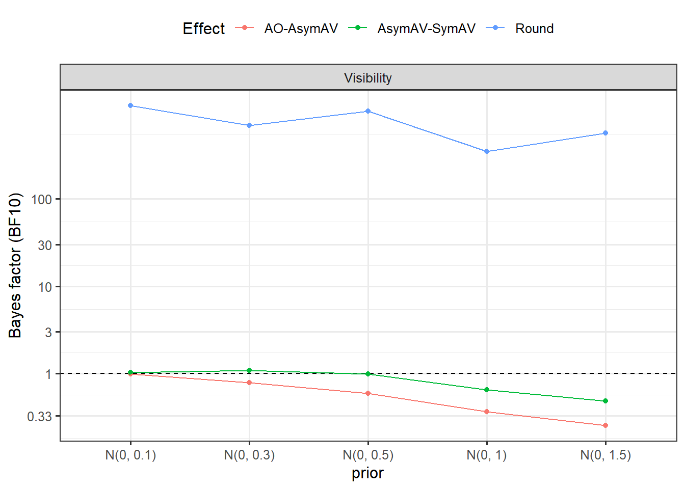<!-- -->

<br>

#### Posterior predictive check

``` r
model = zinb_iconic_rate_cond_round_c
pp_check_sym = pp_check_each_condition(model, df_trial_info, "SymAV")
pp_check_asym = pp_check_each_condition(model, df_trial_info, "AsymAV")
pp_check_ao = pp_check_each_condition(model, df_trial_info, "AO")

gridExtra::grid.arrange(pp_check_sym, pp_check_asym, pp_check_ao, ncol = 2)
```

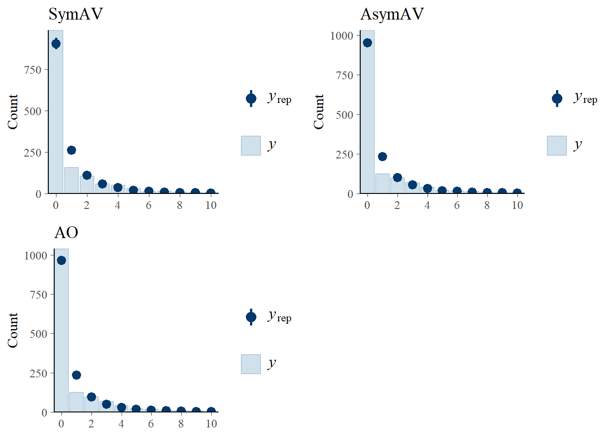<!-- -->

``` r
pp_check_r1 = pp_check_each_round(model, df_trial_info, "R1")
pp_check_r2 = pp_check_each_round(model, df_trial_info, "R2")
pp_check_r3 = pp_check_each_round(model, df_trial_info, "R3")
pp_check_r4 = pp_check_each_round(model, df_trial_info, "R4")
pp_check_r5 = pp_check_each_round(model, df_trial_info, "R5")
pp_check_r6 = pp_check_each_round(model, df_trial_info, "R6")

gridExtra::grid.arrange(pp_check_r1, pp_check_r2, pp_check_r3, pp_check_r4, pp_check_r5, pp_check_r6, ncol = 3)
```

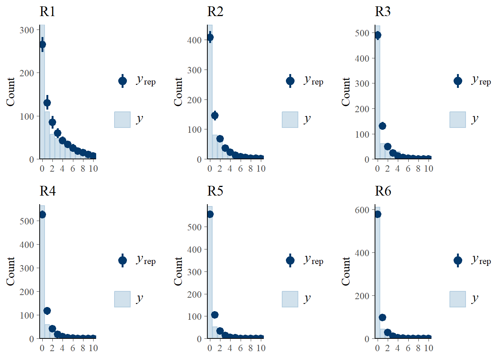<!-- -->

<br>

#### Pair-wise Effect

``` r
emmeans(model, pairwise ~ condition)$contrasts
```

    ##  contrast       estimate lower.HPD upper.HPD
    ##  SymAV - AsymAV    0.303    -0.279     0.901
    ##  SymAV - AO        0.347    -0.325     1.041
    ##  AsymAV - AO       0.044    -0.544     0.636
    ## 
    ## Point estimate displayed: median 
    ## Results are given on the log (not the response) scale. 
    ## HPD interval probability: 0.95

``` r
emmeans(model, pairwise ~ condition, level = 0.89)$contrasts
```

    ##  contrast       estimate lower.HPD upper.HPD
    ##  SymAV - AsymAV    0.303    -0.177     0.785
    ##  SymAV - AO        0.347    -0.215     0.889
    ##  AsymAV - AO       0.044    -0.427     0.534
    ## 
    ## Point estimate displayed: median 
    ## Results are given on the log (not the response) scale. 
    ## HPD interval probability: 0.89

<!-- <br> -->
<!-- #### Visualize the model estimates -->
<!-- ```{r} -->
<!-- plot(conditional_effects(model), ask = FALSE) -->
<!-- ``` -->

<br>

------------------------------------------------------------------------

# ==== Gestural alignment ====

# 6. Causal model of gestural alignment

Experts in the field of statistics and causal inference have advised
that researchers should build a causal model and examine which factors
should be included and excluded from regression models if their aim is
to infer the causal effects (e.g., [McElreath,
2020](https://www.taylorfrancis.com/books/mono/10.1201/9780429029608/statistical-rethinking-richard-mcelreath),
[Pearl, 2010](https://pmc.ncbi.nlm.nih.gov/articles/PMC2836213/),
[Cinelli, Forney, & Pearl,
2020](https://journals.sagepub.com/doi/full/10.1177/00491241221099552)).
Following this advice, we will build a causal model to infer the direct
effect of speaker visibility on gestural alignment.

We assume the following causal model:

``` r
### causal model for gestural alignment rate
dag_gest <- dagitty('dag {
  visibility -> gest_align
  visibility -> n_words
  visibility -> n_gestures
  n_words -> lex_align
  n_words -> n_gestures
  round -> n_words
  round -> lex_align
  round -> gest_align
  round -> n_gestures
  role -> n_words
  role -> lex_align
  role -> gest_align
  role -> n_gestures
  n_gestures -> gest_align
  lex_align -> gest_align
}')

plot(dag_gest)
```

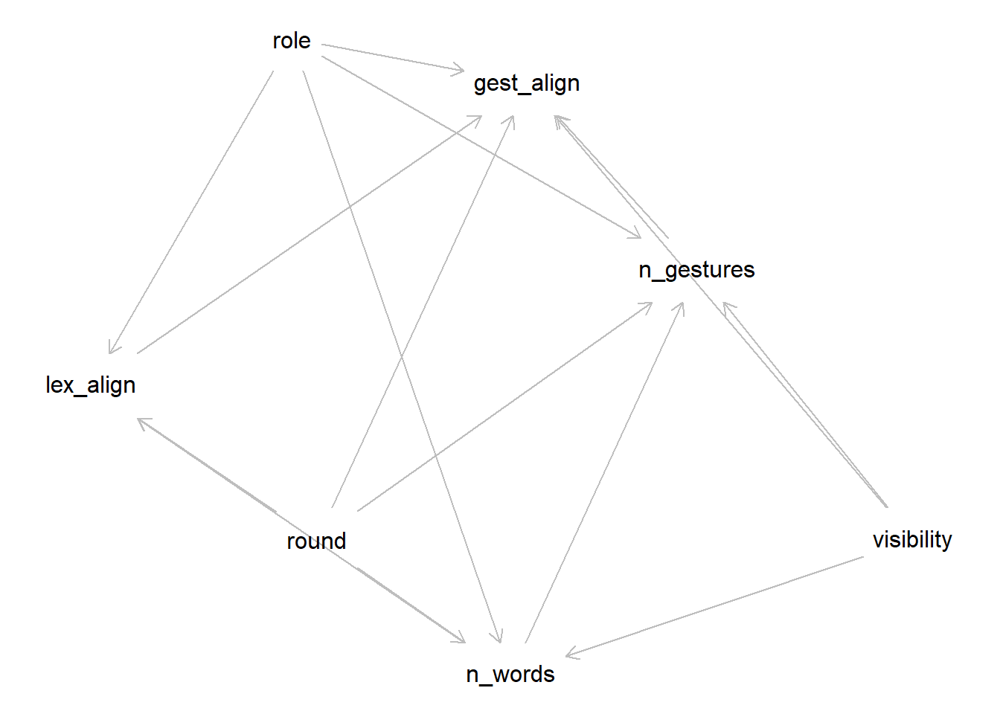<!-- -->

``` r
### check the minimam adjustment set
print("Direct effect of visibility on gestural alignment frequency")
```

    ## [1] "Direct effect of visibility on gestural alignment frequency"

``` r
adjustmentSets(dag_gest, exposure = "visibility", outcome = "gest_align", effect = "direct")
```

    ## { lex_align, n_gestures, role, round }
    ## { n_gestures, n_words, role, round }

``` r
print("Direct effect of lexical alignment rate on gestural alignment frequency")
```

    ## [1] "Direct effect of lexical alignment rate on gestural alignment frequency"

``` r
adjustmentSets(dag_gest, exposure = "lex_align", outcome = "gest_align", effect = "direct")
```

    ## { n_gestures, role, round, visibility }
    ## { n_words, role, round }

``` r
print("Direct effect of round on gestural alignment frequency")
```

    ## [1] "Direct effect of round on gestural alignment frequency"

``` r
adjustmentSets(dag_gest, exposure = "round", outcome = "gest_align", effect = "direct")
```

    ## { lex_align, n_gestures, role, visibility }

The minimum adjustment set for estimating the direct causal effect of
speaker visibility on gestural alignment frequency is {lex_align,
n_words, round}. Note that because dagitty didn’t find any adjustment
set for the direct effect of visibility on lexical alignment frequency
*when we expected bidirectional causation between lexical and gestural
alignment*, we assumed a unidirectional causation from lexical alignment
to gestural alignment only in this model. This will be reversed in the
causal model for lexical alignment frequency, such that we assume a
unidirectional causation from gestural alignment to lexical alignment.

In addition, we are also interested in the direct effect of lexical
alignment frequency on gestural alignment frequency. The minimum
adjustment set for is {visibility, n_gestures, round}.

As the minimum adjustment sets for the direct effects of visibility,
lexical alignment frequency, and round on gestural alignment frequency
are identical (i.e., {visibility, lex_align, n_gestures, round}), we can
estimate the direct effect of these variables on gestural alignment
frequency with the following model:

$$
gest\_align \: | \: \text{rate}(n\_iconic\_gesture) \sim \\
\text{visibility} * \text{round} + \text{n_lexical_alignment} + \\
(1+\text{round} | \text{participant}) + (1 | \text{item})
$$

<br>

------------------------------------------------------------------------

# 7. Number of gestural alignment

## 7.1 DataViz: number of gestural alignment

### bp: mean by condition

``` r
bp_mean_gest_alignment_by_cond = ggplot(data=trial_info_pair, 
                                        aes(x=condition, y=mean_num_gest_align, fill=condition)) +
  geom_jitter(aes(color = pair), 
              size = 1, alpha = 1, 
              width = 0.07, height = 0) +
  geom_boxplot(width = .4,
               outlier.shape = NA, alpha = 0.7) +
  geom_point(data = trial_info_cond, 
             aes(y = mean_num_gest_align), 
             size = 2, shape = 4) +
  scale_fill_manual(values = c("#ED6B06", "#00786A", "darkgrey")) +
  labs(x = "Visibility",
       y = "Mean gestural alignment count") +
  theme_clean(base_size = 15) +
  theme(axis.text.x = element_text(colour = "black", size = 14),
        axis.text.y = element_text(colour = "black", size = 14),
        axis.title = element_text(size = 15, face = 'bold'),
        axis.title.x = element_text(vjust = -2),
        axis.title.y = element_text(vjust = 2),
        legend.position = "none",
        strip.text = element_text(size = 15, face = 'bold'),
        plot.background = element_blank(),
        plot.margin = unit(c(1.1,1.1,1.1,1.1), "lines"))

ggplotly(bp_mean_gest_alignment_by_cond)
```

<div class="plotly html-widget html-fill-item" id="htmlwidget-bf04e163df8c0856f23d" style="width:672px;height:480px;"></div>
<script type="application/json" data-for="htmlwidget-bf04e163df8c0856f23d">{"x":{"data":[{"x":[1.0357400950184092],"y":[0.33333333333333331],"text":"condition: SymAV<br />mean_num_gest_align: 0.3333<br />condition: SymAV<br />pair: 1","type":"scatter","mode":"markers","marker":{"autocolorscale":false,"color":"rgba(237,107,6,1)","opacity":1,"size":3.7795275590551185,"symbol":"circle","line":{"width":1.8897637795275593,"color":"rgba(248,118,109,1)"}},"hoveron":"points","name":"(SymAV,1)","legendgroup":"(SymAV,1)","showlegend":true,"xaxis":"x","yaxis":"y","hoverinfo":"text","frame":null},{"x":[0.97174338405020533],"y":[0.16666666666666666],"text":"condition: SymAV<br />mean_num_gest_align: 0.1667<br />condition: SymAV<br />pair: 5","type":"scatter","mode":"markers","marker":{"autocolorscale":false,"color":"rgba(237,107,6,1)","opacity":1,"size":3.7795275590551185,"symbol":"circle","line":{"width":1.8897637795275593,"color":"rgba(229,135,0,1)"}},"hoveron":"points","name":"(SymAV,5)","legendgroup":"(SymAV,5)","showlegend":true,"xaxis":"x","yaxis":"y","hoverinfo":"text","frame":null},{"x":[0.97330258475616571],"y":[0.375],"text":"condition: SymAV<br />mean_num_gest_align: 0.3750<br />condition: SymAV<br />pair: 8","type":"scatter","mode":"markers","marker":{"autocolorscale":false,"color":"rgba(237,107,6,1)","opacity":1,"size":3.7795275590551185,"symbol":"circle","line":{"width":1.8897637795275593,"color":"rgba(201,152,0,1)"}},"hoveron":"points","name":"(SymAV,8)","legendgroup":"(SymAV,8)","showlegend":true,"xaxis":"x","yaxis":"y","hoverinfo":"text","frame":null},{"x":[0.96025245008990168],"y":[0.29166666666666669],"text":"condition: SymAV<br />mean_num_gest_align: 0.2917<br />condition: SymAV<br />pair: 11","type":"scatter","mode":"markers","marker":{"autocolorscale":false,"color":"rgba(237,107,6,1)","opacity":1,"size":3.7795275590551185,"symbol":"circle","line":{"width":1.8897637795275593,"color":"rgba(163,165,0,1)"}},"hoveron":"points","name":"(SymAV,11)","legendgroup":"(SymAV,11)","showlegend":true,"xaxis":"x","yaxis":"y","hoverinfo":"text","frame":null},{"x":[0.93993421037681402],"y":[0.38541666666666669],"text":"condition: SymAV<br />mean_num_gest_align: 0.3854<br />condition: SymAV<br />pair: 15","type":"scatter","mode":"markers","marker":{"autocolorscale":false,"color":"rgba(237,107,6,1)","opacity":1,"size":3.7795275590551185,"symbol":"circle","line":{"width":1.8897637795275593,"color":"rgba(107,177,0,1)"}},"hoveron":"points","name":"(SymAV,15)","legendgroup":"(SymAV,15)","showlegend":true,"xaxis":"x","yaxis":"y","hoverinfo":"text","frame":null},{"x":[0.9788838075706735],"y":[0.60416666666666663],"text":"condition: SymAV<br />mean_num_gest_align: 0.6042<br />condition: SymAV<br />pair: 18","type":"scatter","mode":"markers","marker":{"autocolorscale":false,"color":"rgba(237,107,6,1)","opacity":1,"size":3.7795275590551185,"symbol":"circle","line":{"width":1.8897637795275593,"color":"rgba(0,186,56,1)"}},"hoveron":"points","name":"(SymAV,18)","legendgroup":"(SymAV,18)","showlegend":true,"xaxis":"x","yaxis":"y","hoverinfo":"text","frame":null},{"x":[1.0628458268754184],"y":[0.052083333333333336],"text":"condition: SymAV<br />mean_num_gest_align: 0.0521<br />condition: SymAV<br />pair: 21","type":"scatter","mode":"markers","marker":{"autocolorscale":false,"color":"rgba(237,107,6,1)","opacity":1,"size":3.7795275590551185,"symbol":"circle","line":{"width":1.8897637795275593,"color":"rgba(0,191,125,1)"}},"hoveron":"points","name":"(SymAV,21)","legendgroup":"(SymAV,21)","showlegend":true,"xaxis":"x","yaxis":"y","hoverinfo":"text","frame":null},{"x":[1.0661099870316684],"y":[0.53125],"text":"condition: SymAV<br />mean_num_gest_align: 0.5312<br />condition: SymAV<br />pair: 24","type":"scatter","mode":"markers","marker":{"autocolorscale":false,"color":"rgba(237,107,6,1)","opacity":1,"size":3.7795275590551185,"symbol":"circle","line":{"width":1.8897637795275593,"color":"rgba(0,192,175,1)"}},"hoveron":"points","name":"(SymAV,24)","legendgroup":"(SymAV,24)","showlegend":true,"xaxis":"x","yaxis":"y","hoverinfo":"text","frame":null},{"x":[1.0477798025822267],"y":[0.020833333333333332],"text":"condition: SymAV<br />mean_num_gest_align: 0.0208<br />condition: SymAV<br />pair: 27","type":"scatter","mode":"markers","marker":{"autocolorscale":false,"color":"rgba(237,107,6,1)","opacity":1,"size":3.7795275590551185,"symbol":"circle","line":{"width":1.8897637795275593,"color":"rgba(0,188,216,1)"}},"hoveron":"points","name":"(SymAV,27)","legendgroup":"(SymAV,27)","showlegend":true,"xaxis":"x","yaxis":"y","hoverinfo":"text","frame":null},{"x":[0.94289234648924325],"y":[0.041666666666666664],"text":"condition: SymAV<br />mean_num_gest_align: 0.0417<br />condition: SymAV<br />pair: 30","type":"scatter","mode":"markers","marker":{"autocolorscale":false,"color":"rgba(237,107,6,1)","opacity":1,"size":3.7795275590551185,"symbol":"circle","line":{"width":1.8897637795275593,"color":"rgba(0,176,246,1)"}},"hoveron":"points","name":"(SymAV,30)","legendgroup":"(SymAV,30)","showlegend":true,"xaxis":"x","yaxis":"y","hoverinfo":"text","frame":null},{"x":[0.94150513424072413],"y":[0.30208333333333331],"text":"condition: SymAV<br />mean_num_gest_align: 0.3021<br />condition: SymAV<br />pair: 33","type":"scatter","mode":"markers","marker":{"autocolorscale":false,"color":"rgba(237,107,6,1)","opacity":1,"size":3.7795275590551185,"symbol":"circle","line":{"width":1.8897637795275593,"color":"rgba(97,156,255,1)"}},"hoveron":"points","name":"(SymAV,33)","legendgroup":"(SymAV,33)","showlegend":true,"xaxis":"x","yaxis":"y","hoverinfo":"text","frame":null},{"x":[0.94317877022083851],"y":[0.4375],"text":"condition: SymAV<br />mean_num_gest_align: 0.4375<br />condition: SymAV<br />pair: 36","type":"scatter","mode":"markers","marker":{"autocolorscale":false,"color":"rgba(237,107,6,1)","opacity":1,"size":3.7795275590551185,"symbol":"circle","line":{"width":1.8897637795275593,"color":"rgba(185,131,255,1)"}},"hoveron":"points","name":"(SymAV,36)","legendgroup":"(SymAV,36)","showlegend":true,"xaxis":"x","yaxis":"y","hoverinfo":"text","frame":null},{"x":[0.94933959709014748],"y":[0.09375],"text":"condition: SymAV<br />mean_num_gest_align: 0.0938<br />condition: SymAV<br />pair: 39","type":"scatter","mode":"markers","marker":{"autocolorscale":false,"color":"rgba(237,107,6,1)","opacity":1,"size":3.7795275590551185,"symbol":"circle","line":{"width":1.8897637795275593,"color":"rgba(231,107,243,1)"}},"hoveron":"points","name":"(SymAV,39)","legendgroup":"(SymAV,39)","showlegend":true,"xaxis":"x","yaxis":"y","hoverinfo":"text","frame":null},{"x":[1.0578417575592176],"y":[0],"text":"condition: SymAV<br />mean_num_gest_align: 0.0000<br />condition: SymAV<br />pair: 42","type":"scatter","mode":"markers","marker":{"autocolorscale":false,"color":"rgba(237,107,6,1)","opacity":1,"size":3.7795275590551185,"symbol":"circle","line":{"width":1.8897637795275593,"color":"rgba(253,97,209,1)"}},"hoveron":"points","name":"(SymAV,42)","legendgroup":"(SymAV,42)","showlegend":true,"xaxis":"x","yaxis":"y","hoverinfo":"text","frame":null},{"x":[0.95221028987318279],"y":[0.39583333333333331],"text":"condition: SymAV<br />mean_num_gest_align: 0.3958<br />condition: SymAV<br />pair: 45","type":"scatter","mode":"markers","marker":{"autocolorscale":false,"color":"rgba(237,107,6,1)","opacity":1,"size":3.7795275590551185,"symbol":"circle","line":{"width":1.8897637795275593,"color":"rgba(255,103,164,1)"}},"hoveron":"points","name":"(SymAV,45)","legendgroup":"(SymAV,45)","showlegend":true,"xaxis":"x","yaxis":"y","hoverinfo":"text","frame":null},{"x":[1.9513428913149982],"y":[0.020833333333333332],"text":"condition: AsymAV<br />mean_num_gest_align: 0.0208<br />condition: AsymAV<br />pair: 2","type":"scatter","mode":"markers","marker":{"autocolorscale":false,"color":"rgba(0,120,106,1)","opacity":1,"size":3.7795275590551185,"symbol":"circle","line":{"width":1.8897637795275593,"color":"rgba(242,124,86,1)"}},"hoveron":"points","name":"(AsymAV,2)","legendgroup":"(AsymAV,2)","showlegend":true,"xaxis":"x","yaxis":"y","hoverinfo":"text","frame":null},{"x":[1.9709564107423647],"y":[0.010416666666666666],"text":"condition: AsymAV<br />mean_num_gest_align: 0.0104<br />condition: AsymAV<br />pair: 6","type":"scatter","mode":"markers","marker":{"autocolorscale":false,"color":"rgba(0,120,106,1)","opacity":1,"size":3.7795275590551185,"symbol":"circle","line":{"width":1.8897637795275593,"color":"rgba(220,141,0,1)"}},"hoveron":"points","name":"(AsymAV,6)","legendgroup":"(AsymAV,6)","showlegend":true,"xaxis":"x","yaxis":"y","hoverinfo":"text","frame":null},{"x":[1.941657492495142],"y":[0.40625],"text":"condition: AsymAV<br />mean_num_gest_align: 0.4062<br />condition: AsymAV<br />pair: 9","type":"scatter","mode":"markers","marker":{"autocolorscale":false,"color":"rgba(0,120,106,1)","opacity":1,"size":3.7795275590551185,"symbol":"circle","line":{"width":1.8897637795275593,"color":"rgba(189,156,0,1)"}},"hoveron":"points","name":"(AsymAV,9)","legendgroup":"(AsymAV,9)","showlegend":true,"xaxis":"x","yaxis":"y","hoverinfo":"text","frame":null},{"x":[2.0455066098691894],"y":[0.28125],"text":"condition: AsymAV<br />mean_num_gest_align: 0.2812<br />condition: AsymAV<br />pair: 12","type":"scatter","mode":"markers","marker":{"autocolorscale":false,"color":"rgba(0,120,106,1)","opacity":1,"size":3.7795275590551185,"symbol":"circle","line":{"width":1.8897637795275593,"color":"rgba(147,170,0,1)"}},"hoveron":"points","name":"(AsymAV,12)","legendgroup":"(AsymAV,12)","showlegend":true,"xaxis":"x","yaxis":"y","hoverinfo":"text","frame":null},{"x":[1.9646443433780223],"y":[0.041666666666666664],"text":"condition: AsymAV<br />mean_num_gest_align: 0.0417<br />condition: AsymAV<br />pair: 16","type":"scatter","mode":"markers","marker":{"autocolorscale":false,"color":"rgba(0,120,106,1)","opacity":1,"size":3.7795275590551185,"symbol":"circle","line":{"width":1.8897637795275593,"color":"rgba(78,180,0,1)"}},"hoveron":"points","name":"(AsymAV,16)","legendgroup":"(AsymAV,16)","showlegend":true,"xaxis":"x","yaxis":"y","hoverinfo":"text","frame":null},{"x":[1.9767895976640284],"y":[0.80208333333333337],"text":"condition: AsymAV<br />mean_num_gest_align: 0.8021<br />condition: AsymAV<br />pair: 19","type":"scatter","mode":"markers","marker":{"autocolorscale":false,"color":"rgba(0,120,106,1)","opacity":1,"size":3.7795275590551185,"symbol":"circle","line":{"width":1.8897637795275593,"color":"rgba(0,188,84,1)"}},"hoveron":"points","name":"(AsymAV,19)","legendgroup":"(AsymAV,19)","showlegend":true,"xaxis":"x","yaxis":"y","hoverinfo":"text","frame":null},{"x":[1.9805138039961456],"y":[0.51041666666666663],"text":"condition: AsymAV<br />mean_num_gest_align: 0.5104<br />condition: AsymAV<br />pair: 22","type":"scatter","mode":"markers","marker":{"autocolorscale":false,"color":"rgba(0,120,106,1)","opacity":1,"size":3.7795275590551185,"symbol":"circle","line":{"width":1.8897637795275593,"color":"rgba(0,192,143,1)"}},"hoveron":"points","name":"(AsymAV,22)","legendgroup":"(AsymAV,22)","showlegend":true,"xaxis":"x","yaxis":"y","hoverinfo":"text","frame":null},{"x":[1.9724187110550702],"y":[0.60416666666666663],"text":"condition: AsymAV<br />mean_num_gest_align: 0.6042<br />condition: AsymAV<br />pair: 25","type":"scatter","mode":"markers","marker":{"autocolorscale":false,"color":"rgba(0,120,106,1)","opacity":1,"size":3.7795275590551185,"symbol":"circle","line":{"width":1.8897637795275593,"color":"rgba(0,192,189,1)"}},"hoveron":"points","name":"(AsymAV,25)","legendgroup":"(AsymAV,25)","showlegend":true,"xaxis":"x","yaxis":"y","hoverinfo":"text","frame":null},{"x":[1.9852021949971095],"y":[0.09375],"text":"condition: AsymAV<br />mean_num_gest_align: 0.0938<br />condition: AsymAV<br />pair: 28","type":"scatter","mode":"markers","marker":{"autocolorscale":false,"color":"rgba(0,120,106,1)","opacity":1,"size":3.7795275590551185,"symbol":"circle","line":{"width":1.8897637795275593,"color":"rgba(0,185,227,1)"}},"hoveron":"points","name":"(AsymAV,28)","legendgroup":"(AsymAV,28)","showlegend":true,"xaxis":"x","yaxis":"y","hoverinfo":"text","frame":null},{"x":[2.0211069564986972],"y":[0.63541666666666663],"text":"condition: AsymAV<br />mean_num_gest_align: 0.6354<br />condition: AsymAV<br />pair: 31","type":"scatter","mode":"markers","marker":{"autocolorscale":false,"color":"rgba(0,120,106,1)","opacity":1,"size":3.7795275590551185,"symbol":"circle","line":{"width":1.8897637795275593,"color":"rgba(0,170,254,1)"}},"hoveron":"points","name":"(AsymAV,31)","legendgroup":"(AsymAV,31)","showlegend":true,"xaxis":"x","yaxis":"y","hoverinfo":"text","frame":null},{"x":[2.0468683453463017],"y":[0.19791666666666666],"text":"condition: AsymAV<br />mean_num_gest_align: 0.1979<br />condition: AsymAV<br />pair: 34","type":"scatter","mode":"markers","marker":{"autocolorscale":false,"color":"rgba(0,120,106,1)","opacity":1,"size":3.7795275590551185,"symbol":"circle","line":{"width":1.8897637795275593,"color":"rgba(134,148,255,1)"}},"hoveron":"points","name":"(AsymAV,34)","legendgroup":"(AsymAV,34)","showlegend":true,"xaxis":"x","yaxis":"y","hoverinfo":"text","frame":null},{"x":[1.9456187418848276],"y":[0.25],"text":"condition: AsymAV<br />mean_num_gest_align: 0.2500<br />condition: AsymAV<br />pair: 37","type":"scatter","mode":"markers","marker":{"autocolorscale":false,"color":"rgba(0,120,106,1)","opacity":1,"size":3.7795275590551185,"symbol":"circle","line":{"width":1.8897637795275593,"color":"rgba(203,122,255,1)"}},"hoveron":"points","name":"(AsymAV,37)","legendgroup":"(AsymAV,37)","showlegend":true,"xaxis":"x","yaxis":"y","hoverinfo":"text","frame":null},{"x":[2.0005831887992098],"y":[0.03125],"text":"condition: AsymAV<br />mean_num_gest_align: 0.0312<br />condition: AsymAV<br />pair: 40","type":"scatter","mode":"markers","marker":{"autocolorscale":false,"color":"rgba(0,120,106,1)","opacity":1,"size":3.7795275590551185,"symbol":"circle","line":{"width":1.8897637795275593,"color":"rgba(241,102,233,1)"}},"hoveron":"points","name":"(AsymAV,40)","legendgroup":"(AsymAV,40)","showlegend":true,"xaxis":"x","yaxis":"y","hoverinfo":"text","frame":null},{"x":[2.0575426248274744],"y":[0.020833333333333332],"text":"condition: AsymAV<br />mean_num_gest_align: 0.0208<br />condition: AsymAV<br />pair: 43","type":"scatter","mode":"markers","marker":{"autocolorscale":false,"color":"rgba(0,120,106,1)","opacity":1,"size":3.7795275590551185,"symbol":"circle","line":{"width":1.8897637795275593,"color":"rgba(255,97,195,1)"}},"hoveron":"points","name":"(AsymAV,43)","legendgroup":"(AsymAV,43)","showlegend":true,"xaxis":"x","yaxis":"y","hoverinfo":"text","frame":null},{"x":[2.0341625830857084],"y":[0],"text":"condition: AsymAV<br />mean_num_gest_align: 0.0000<br />condition: AsymAV<br />pair: 46","type":"scatter","mode":"markers","marker":{"autocolorscale":false,"color":"rgba(0,120,106,1)","opacity":1,"size":3.7795275590551185,"symbol":"circle","line":{"width":1.8897637795275593,"color":"rgba(255,107,147,1)"}},"hoveron":"points","name":"(AsymAV,46)","legendgroup":"(AsymAV,46)","showlegend":true,"xaxis":"x","yaxis":"y","hoverinfo":"text","frame":null},{"x":[2.9330146308615803],"y":[0.041666666666666664],"text":"condition: AO<br />mean_num_gest_align: 0.0417<br />condition: AO<br />pair: 3","type":"scatter","mode":"markers","marker":{"autocolorscale":false,"color":"rgba(169,169,169,1)","opacity":1,"size":3.7795275590551185,"symbol":"circle","line":{"width":1.8897637795275593,"color":"rgba(236,130,58,1)"}},"hoveron":"points","name":"(AO,3)","legendgroup":"(AO,3)","showlegend":true,"xaxis":"x","yaxis":"y","hoverinfo":"text","frame":null},{"x":[3.0614946461748334],"y":[0],"text":"condition: AO<br />mean_num_gest_align: 0.0000<br />condition: AO<br />pair: 7","type":"scatter","mode":"markers","marker":{"autocolorscale":false,"color":"rgba(169,169,169,1)","opacity":1,"size":3.7795275590551185,"symbol":"circle","line":{"width":1.8897637795275593,"color":"rgba(211,146,0,1)"}},"hoveron":"points","name":"(AO,7)","legendgroup":"(AO,7)","showlegend":true,"xaxis":"x","yaxis":"y","hoverinfo":"text","frame":null},{"x":[3.0228890588833019],"y":[0],"text":"condition: AO<br />mean_num_gest_align: 0.0000<br />condition: AO<br />pair: 10","type":"scatter","mode":"markers","marker":{"autocolorscale":false,"color":"rgba(169,169,169,1)","opacity":1,"size":3.7795275590551185,"symbol":"circle","line":{"width":1.8897637795275593,"color":"rgba(177,161,0,1)"}},"hoveron":"points","name":"(AO,10)","legendgroup":"(AO,10)","showlegend":true,"xaxis":"x","yaxis":"y","hoverinfo":"text","frame":null},{"x":[2.9911700363131239],"y":[0.26041666666666669],"text":"condition: AO<br />mean_num_gest_align: 0.2604<br />condition: AO<br />pair: 13","type":"scatter","mode":"markers","marker":{"autocolorscale":false,"color":"rgba(169,169,169,1)","opacity":1,"size":3.7795275590551185,"symbol":"circle","line":{"width":1.8897637795275593,"color":"rgba(129,173,0,1)"}},"hoveron":"points","name":"(AO,13)","legendgroup":"(AO,13)","showlegend":true,"xaxis":"x","yaxis":"y","hoverinfo":"text","frame":null},{"x":[3.007051718714647],"y":[0.63541666666666663],"text":"condition: AO<br />mean_num_gest_align: 0.6354<br />condition: AO<br />pair: 17","type":"scatter","mode":"markers","marker":{"autocolorscale":false,"color":"rgba(169,169,169,1)","opacity":1,"size":3.7795275590551185,"symbol":"circle","line":{"width":1.8897637795275593,"color":"rgba(21,183,0,1)"}},"hoveron":"points","name":"(AO,17)","legendgroup":"(AO,17)","showlegend":true,"xaxis":"x","yaxis":"y","hoverinfo":"text","frame":null},{"x":[3.0003663303423673],"y":[0.083333333333333329],"text":"condition: AO<br />mean_num_gest_align: 0.0833<br />condition: AO<br />pair: 20","type":"scatter","mode":"markers","marker":{"autocolorscale":false,"color":"rgba(169,169,169,1)","opacity":1,"size":3.7795275590551185,"symbol":"circle","line":{"width":1.8897637795275593,"color":"rgba(0,190,106,1)"}},"hoveron":"points","name":"(AO,20)","legendgroup":"(AO,20)","showlegend":true,"xaxis":"x","yaxis":"y","hoverinfo":"text","frame":null},{"x":[2.9642810805747284],"y":[0.043010752688172046],"text":"condition: AO<br />mean_num_gest_align: 0.0430<br />condition: AO<br />pair: 23","type":"scatter","mode":"markers","marker":{"autocolorscale":false,"color":"rgba(169,169,169,1)","opacity":1,"size":3.7795275590551185,"symbol":"circle","line":{"width":1.8897637795275593,"color":"rgba(0,193,159,1)"}},"hoveron":"points","name":"(AO,23)","legendgroup":"(AO,23)","showlegend":true,"xaxis":"x","yaxis":"y","hoverinfo":"text","frame":null},{"x":[2.9414380219671874],"y":[0.031914893617021274],"text":"condition: AO<br />mean_num_gest_align: 0.0319<br />condition: AO<br />pair: 26","type":"scatter","mode":"markers","marker":{"autocolorscale":false,"color":"rgba(169,169,169,1)","opacity":1,"size":3.7795275590551185,"symbol":"circle","line":{"width":1.8897637795275593,"color":"rgba(0,190,203,1)"}},"hoveron":"points","name":"(AO,26)","legendgroup":"(AO,26)","showlegend":true,"xaxis":"x","yaxis":"y","hoverinfo":"text","frame":null},{"x":[2.9819841184001414],"y":[0.23958333333333334],"text":"condition: AO<br />mean_num_gest_align: 0.2396<br />condition: AO<br />pair: 29","type":"scatter","mode":"markers","marker":{"autocolorscale":false,"color":"rgba(169,169,169,1)","opacity":1,"size":3.7795275590551185,"symbol":"circle","line":{"width":1.8897637795275593,"color":"rgba(0,181,238,1)"}},"hoveron":"points","name":"(AO,29)","legendgroup":"(AO,29)","showlegend":true,"xaxis":"x","yaxis":"y","hoverinfo":"text","frame":null},{"x":[3.0438336134608837],"y":[0.041666666666666664],"text":"condition: AO<br />mean_num_gest_align: 0.0417<br />condition: AO<br />pair: 32","type":"scatter","mode":"markers","marker":{"autocolorscale":false,"color":"rgba(169,169,169,1)","opacity":1,"size":3.7795275590551185,"symbol":"circle","line":{"width":1.8897637795275593,"color":"rgba(24,163,255,1)"}},"hoveron":"points","name":"(AO,32)","legendgroup":"(AO,32)","showlegend":true,"xaxis":"x","yaxis":"y","hoverinfo":"text","frame":null},{"x":[3.0350546541996302],"y":[0.052083333333333336],"text":"condition: AO<br />mean_num_gest_align: 0.0521<br />condition: AO<br />pair: 35","type":"scatter","mode":"markers","marker":{"autocolorscale":false,"color":"rgba(169,169,169,1)","opacity":1,"size":3.7795275590551185,"symbol":"circle","line":{"width":1.8897637795275593,"color":"rgba(162,139,255,1)"}},"hoveron":"points","name":"(AO,35)","legendgroup":"(AO,35)","showlegend":true,"xaxis":"x","yaxis":"y","hoverinfo":"text","frame":null},{"x":[2.9636075334576888],"y":[0.010416666666666666],"text":"condition: AO<br />mean_num_gest_align: 0.0104<br />condition: AO<br />pair: 38","type":"scatter","mode":"markers","marker":{"autocolorscale":false,"color":"rgba(169,169,169,1)","opacity":1,"size":3.7795275590551185,"symbol":"circle","line":{"width":1.8897637795275593,"color":"rgba(219,114,251,1)"}},"hoveron":"points","name":"(AO,38)","legendgroup":"(AO,38)","showlegend":true,"xaxis":"x","yaxis":"y","hoverinfo":"text","frame":null},{"x":[3.0158297228394075],"y":[0.03125],"text":"condition: AO<br />mean_num_gest_align: 0.0312<br />condition: AO<br />pair: 41","type":"scatter","mode":"markers","marker":{"autocolorscale":false,"color":"rgba(169,169,169,1)","opacity":1,"size":3.7795275590551185,"symbol":"circle","line":{"width":1.8897637795275593,"color":"rgba(248,98,222,1)"}},"hoveron":"points","name":"(AO,41)","legendgroup":"(AO,41)","showlegend":true,"xaxis":"x","yaxis":"y","hoverinfo":"text","frame":null},{"x":[3.051052386695519],"y":[0.64583333333333337],"text":"condition: AO<br />mean_num_gest_align: 0.6458<br />condition: AO<br />pair: 44","type":"scatter","mode":"markers","marker":{"autocolorscale":false,"color":"rgba(169,169,169,1)","opacity":1,"size":3.7795275590551185,"symbol":"circle","line":{"width":1.8897637795275593,"color":"rgba(255,99,180,1)"}},"hoveron":"points","name":"(AO,44)","legendgroup":"(AO,44)","showlegend":true,"xaxis":"x","yaxis":"y","hoverinfo":"text","frame":null},{"x":[2.9791255144728348],"y":[0.21875],"text":"condition: AO<br />mean_num_gest_align: 0.2188<br />condition: AO<br />pair: 47","type":"scatter","mode":"markers","marker":{"autocolorscale":false,"color":"rgba(169,169,169,1)","opacity":1,"size":3.7795275590551185,"symbol":"circle","line":{"width":1.8897637795275593,"color":"rgba(252,113,129,1)"}},"hoveron":"points","name":"(AO,47)","legendgroup":"(AO,47)","showlegend":true,"xaxis":"x","yaxis":"y","hoverinfo":"text","frame":null},{"x":[1,1,1,1,1,1,1,1,1,1,1,1,1,1,1],"y":[0.33333333333333331,0.041666666666666664,0.60416666666666663,0.16666666666666666,0.30208333333333331,0.052083333333333336,0.375,0.4375,0.53125,0.29166666666666669,0.09375,0.020833333333333332,0.38541666666666669,0,0.39583333333333331],"hoverinfo":"y","type":"box","fillcolor":"rgba(237,107,6,0.7)","marker":{"opacity":null,"outliercolor":"rgba(0,0,0,1)","line":{"width":1.8897637795275593,"color":"rgba(0,0,0,1)"},"size":5.6692913385826778},"line":{"color":"rgba(51,51,51,1)","width":1.8897637795275593},"name":"(SymAV,1)","legendgroup":"(SymAV,1)","showlegend":false,"xaxis":"x","yaxis":"y","frame":null},{"x":[2,2,2,2,2,2,2,2,2,2,2,2,2,2,2],"y":[0.020833333333333332,0.63541666666666663,0.010416666666666666,0.19791666666666666,0.51041666666666663,0.40625,0.25,0.60416666666666663,0.28125,0.03125,0.09375,0.041666666666666664,0.020833333333333332,0.80208333333333337,0],"hoverinfo":"y","type":"box","fillcolor":"rgba(0,120,106,0.7)","marker":{"opacity":null,"outliercolor":"rgba(0,0,0,1)","line":{"width":1.8897637795275593,"color":"rgba(0,0,0,1)"},"size":5.6692913385826778},"line":{"color":"rgba(51,51,51,1)","width":1.8897637795275593},"name":"(AsymAV,1)","legendgroup":"(AsymAV,1)","showlegend":true,"xaxis":"x","yaxis":"y","frame":null},{"x":[3,3,3,3,3,3,3,3,3,3,3,3,3,3,3],"y":[0.041666666666666664,0,0.052083333333333336,0.043010752688172046,0,0.010416666666666666,0.031914893617021274,0.26041666666666669,0.03125,0.23958333333333334,0.63541666666666663,0.64583333333333337,0.041666666666666664,0.083333333333333329,0.21875],"hoverinfo":"y","type":"box","fillcolor":"rgba(169,169,169,0.7)","marker":{"opacity":null,"outliercolor":"rgba(0,0,0,1)","line":{"width":1.8897637795275593,"color":"rgba(0,0,0,1)"},"size":5.6692913385826778},"line":{"color":"rgba(51,51,51,1)","width":1.8897637795275593},"name":"(AO,1)","legendgroup":"(AO,1)","showlegend":true,"xaxis":"x","yaxis":"y","frame":null},{"x":[1],"y":[0.26874999999999999],"text":"condition: SymAV<br />mean_num_gest_align: 0.269<br />condition: SymAV","type":"scatter","mode":"markers","marker":{"autocolorscale":false,"color":"rgba(237,107,6,1)","opacity":1,"size":7.559055118110237,"symbol":"x-thin-open","line":{"width":1.8897637795275593,"color":"rgba(0,0,0,1)"}},"hoveron":"points","name":"(SymAV,1)","legendgroup":"(SymAV,1)","showlegend":false,"xaxis":"x","yaxis":"y","hoverinfo":"text","frame":null},{"x":[2],"y":[0.26041666666666669],"text":"condition: AsymAV<br />mean_num_gest_align: 0.260<br />condition: AsymAV","type":"scatter","mode":"markers","marker":{"autocolorscale":false,"color":"rgba(0,120,106,1)","opacity":1,"size":7.559055118110237,"symbol":"x-thin-open","line":{"width":1.8897637795275593,"color":"rgba(0,0,0,1)"}},"hoveron":"points","name":"(AsymAV,1)","legendgroup":"(AsymAV,1)","showlegend":false,"xaxis":"x","yaxis":"y","hoverinfo":"text","frame":null},{"x":[3],"y":[0.15609756097560976],"text":"condition: AO<br />mean_num_gest_align: 0.156<br />condition: AO","type":"scatter","mode":"markers","marker":{"autocolorscale":false,"color":"rgba(169,169,169,1)","opacity":1,"size":7.559055118110237,"symbol":"x-thin-open","line":{"width":1.8897637795275593,"color":"rgba(0,0,0,1)"}},"hoveron":"points","name":"(AO,1)","legendgroup":"(AO,1)","showlegend":false,"xaxis":"x","yaxis":"y","hoverinfo":"text","frame":null}],"layout":{"margin":{"t":37.119999999999997,"r":21.119999999999997,"b":64.623528435035269,"l":73.921992528019928},"font":{"color":"rgba(0,0,0,1)","family":"sans","size":19.9252801992528},"xaxis":{"domain":[0,1],"automargin":true,"type":"linear","autorange":false,"range":[0.40000000000000002,3.6000000000000001],"tickmode":"array","ticktext":["SymAV","AsymAV","AO"],"tickvals":[1,2,3],"categoryorder":"array","categoryarray":["SymAV","AsymAV","AO"],"nticks":null,"ticks":"outside","tickcolor":"rgba(0,0,0,1)","ticklen":4.9813200498132,"tickwidth":0.90569455451149106,"showticklabels":true,"tickfont":{"color":"rgba(0,0,0,1)","family":"sans","size":18.596928185969279},"tickangle":-0,"showline":true,"linecolor":"rgba(0,0,0,1)","linewidth":0.66417600664176002,"showgrid":false,"gridcolor":null,"gridwidth":0,"zeroline":false,"anchor":"y","title":{"text":"<b> Visibility <\/b>","font":{"color":"rgba(0,0,0,1)","family":"sans","size":19.9252801992528}},"hoverformat":".2f"},"yaxis":{"domain":[0,1],"automargin":true,"type":"linear","autorange":false,"range":[-0.04010416666666667,0.84218750000000009],"tickmode":"array","ticktext":["0.0","0.2","0.4","0.6","0.8"],"tickvals":[0,0.20000000000000004,0.40000000000000002,0.60000000000000009,0.80000000000000004],"categoryorder":"array","categoryarray":["0.0","0.2","0.4","0.6","0.8"],"nticks":null,"ticks":"outside","tickcolor":"rgba(0,0,0,1)","ticklen":4.9813200498132018,"tickwidth":0.90569455451149117,"showticklabels":true,"tickfont":{"color":"rgba(0,0,0,1)","family":"sans","size":18.596928185969279},"tickangle":-0,"showline":true,"linecolor":"rgba(0,0,0,1)","linewidth":0.66417600664176002,"showgrid":true,"gridcolor":"rgba(190,190,190,1)","gridwidth":0.90569455451149117,"zeroline":false,"anchor":"x","title":{"text":"<b> Mean gestural alignment count <\/b>","font":{"color":"rgba(0,0,0,1)","family":"sans","size":19.9252801992528}},"hoverformat":".2f"},"shapes":[{"type":"rect","fillcolor":null,"line":{"color":null,"width":0,"linetype":[]},"yref":"paper","xref":"paper","x0":0,"x1":1,"y0":0,"y1":1}],"showlegend":false,"legend":{"bgcolor":"rgba(255,255,255,1)","bordercolor":"rgba(0,0,0,1)","borderwidth":2.5769506084466713,"font":{"color":"rgba(0,0,0,1)","family":"sans","size":18.596928185969279}},"hovermode":"closest","barmode":"relative"},"config":{"doubleClick":"reset","modeBarButtonsToAdd":["hoverclosest","hovercompare"],"showSendToCloud":false},"source":"A","attrs":{"21cc807591a":{"x":{},"y":{},"fill":{},"colour":{},"type":"scatter"},"21cc1e5d72d4":{"x":{},"y":{},"fill":{}},"21cc77351fdf":{"x":{},"y":{},"fill":{}}},"cur_data":"21cc807591a","visdat":{"21cc807591a":["function (y) ","x"],"21cc1e5d72d4":["function (y) ","x"],"21cc77351fdf":["function (y) ","x"]},"highlight":{"on":"plotly_click","persistent":false,"dynamic":false,"selectize":false,"opacityDim":0.20000000000000001,"selected":{"opacity":1},"debounce":0},"shinyEvents":["plotly_hover","plotly_click","plotly_selected","plotly_relayout","plotly_brushed","plotly_brushing","plotly_clickannotation","plotly_doubleclick","plotly_deselect","plotly_afterplot","plotly_sunburstclick"],"base_url":"https://plot.ly"},"evals":[],"jsHooks":[]}</script>

<br>

## 7.2 Negative binomial regression

### 7.2.1 Prior specification

We will set priors for the intercept based on the expected number of
gestural alignment reported in Akamine et al. (2024). In the paper, the
authors analyzed data from 19 dyads involving in the same task as the
current study but in co-present interaction. The total number of
gestural alignment reported was 1086, which was collected from 19 dyads,
each performing 96 trials. This leads to the expected number of gestural
alignment per speaker to be 1086 / (19 \* 96) / 2 = 0.3 (log(0.3) =
-1.2). As such, we will set the prior for the intercept to be normal
with a mean of -1.2 and a standard deviation of 0.5.

For the fixed effects, we will set unbiased priors with a mean of 0. We
set different SDs for each effect because the scale of each predictor is
different. For N. lexical alignment and N. iconic gestures, we set a
prior of Normal(0, 0.2). This means that if the mean N. lex align
increases by 1, we expect the mean N. gestural alignment to change by
-0.2 to 0.5, with the most likely size of change to be 0. As for the
other predictors, we set a prior of Normal(0. 0.5).

We will also specify a prior for the shape parameter to prevent the
model from returning divergent transitions. We will set the prior to be
normal with a mean of 0 and a wide standard deviation of 50.

For the standard deviation of the random effects, we set the prior to be
normal with mean 0 and standard deviation 0.5. For the correlation
between the random effects, we set the prior to be LKJ(2).

``` r
### pair
priors_rslope_gest_align_zinb = c(
  prior(normal(-1.2, 0.5), class = Intercept),
  prior(normal(0, 0.5), class = b),
  prior(normal(0, 0.2), class = b, coef = "n_iconic_c"),
  prior(normal(0, 0.2), class = b, coef = "lex_align_c"),
  prior(normal(0, 0.2), class = b, coef = "lex_align_c:conditionAO_Asym"),
  prior(normal(0, 0.2), class = b, coef = "lex_align_c:conditionAsym_Sym"),
  prior(normal(0, 0.5), class = sd),
  prior(lkj(2), class = cor),
  prior(normal(0, 0.5), class = zi), # on the logit scale
  prior(normal(0, 50), class = shape))
```

<br>

### 7.2.2 Model 2: \[ppB\] effect of lex align on gest align

#### Prior predictive check

``` r
zinb_gest_align_prior = brm(num_gestural_align ~
                              1 + lex_align_c * condition + round + n_iconic_c + role +
                              (1+round|pair) + (1|target),
                            family = zero_inflated_negbinomial(),
                            prior = priors_rslope_gest_align_zinb,
                            data = df_trial_info,
                            sample_prior = "only",
                            control = list(adapt_delta = 0.9, 
                                           max_treedepth = 20),
                            file = "models/speakerB/zinb_gest_align_prior")

pp_check(zinb_gest_align_prior, ndraws = 100, type = "bars") +
  coord_cartesian(xlim = c(0, 20),
                  ylim = c(0, 4000))
```

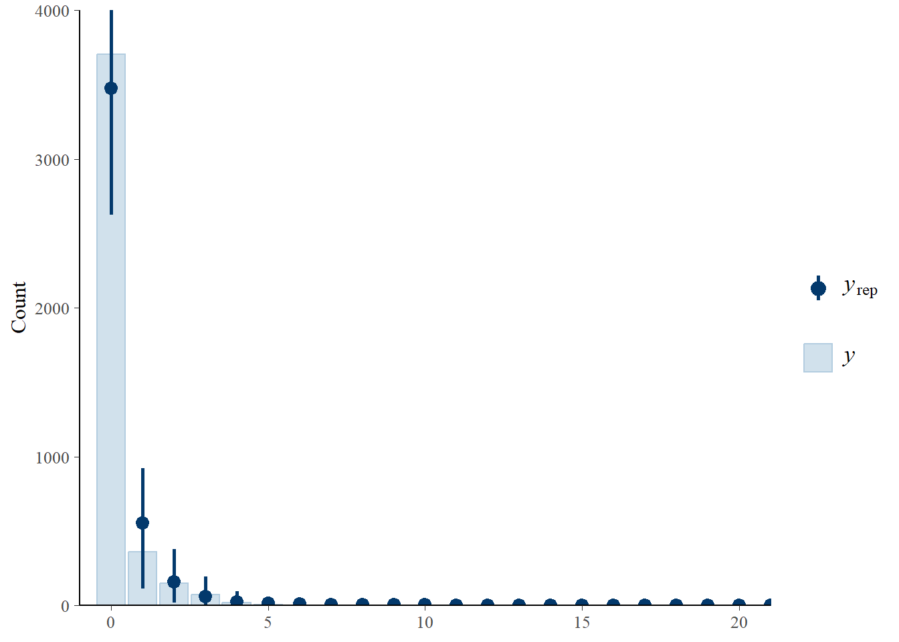<!-- -->

The prior predictive check shows that the model expects fewer amount of
2, 3, and 4. This suggests that the zero-inflation prior may be too
large or the mean for the intercept prior is too low. We will check the
prior-posterior update plot and posterior predictive check to see if the
model generates data that are similar to the observed data. If not, we
will consider modifying the priors.

<br>

#### Fit the model

``` r
zinb_align_cond_round = brm(num_gestural_align ~ 
                              1 + lex_align_c * condition + round + n_iconic_c + role +
                              (1+round|pair) + (1|target),
                            family = zero_inflated_negbinomial(),
                            prior = priors_rslope_gest_align_zinb,
                            data = df_trial_info,
                            sample_prior = T,
                            save_pars = save_pars(all = TRUE),
                            warmup = nwu, iter = niter,
                            control = list(adapt_delta = 0.9, 
                                           max_treedepth = 15),
                            file = "models/speakerB/zinb_align_cond_round")

model = zinb_align_cond_round
summary(model)
```

    ##  Family: zero_inflated_negbinomial 
    ##   Links: mu = log; shape = identity; zi = identity 
    ## Formula: num_gestural_align ~ 1 + lex_align_c * condition + round + n_iconic_c + role + (1 + round | pair) + (1 | target) 
    ##    Data: df_trial_info (Number of observations: 4315) 
    ##   Draws: 4 chains, each with iter = 20000; warmup = 2000; thin = 1;
    ##          total post-warmup draws = 72000
    ## 
    ## Multilevel Hyperparameters:
    ## ~pair (Number of levels: 45) 
    ##                         Estimate Est.Error l-95% CI u-95% CI Rhat Bulk_ESS
    ## sd(Intercept)               1.13      0.14     0.88     1.44 1.00    17131
    ## sd(roundR12)                0.43      0.22     0.03     0.86 1.00    17098
    ## sd(roundR23)                0.23      0.14     0.01     0.52 1.00    19239
    ## sd(roundR34)                0.29      0.15     0.02     0.60 1.00    16752
    ## sd(roundR45)                0.15      0.11     0.01     0.41 1.00    32604
    ## sd(roundR56)                0.31      0.20     0.02     0.73 1.00    20841
    ## cor(Intercept,roundR12)     0.11      0.28    -0.46     0.63 1.00    64233
    ## cor(Intercept,roundR23)     0.23      0.31    -0.43     0.75 1.00    54697
    ## cor(roundR12,roundR23)     -0.07      0.32    -0.66     0.58 1.00    51892
    ## cor(Intercept,roundR34)     0.20      0.29    -0.41     0.71 1.00    59985
    ## cor(roundR12,roundR34)      0.04      0.31    -0.57     0.62 1.00    40953
    ## cor(roundR23,roundR34)      0.05      0.32    -0.57     0.64 1.00    37496
    ## cor(Intercept,roundR45)     0.04      0.33    -0.60     0.66 1.00    85227
    ## cor(roundR12,roundR45)     -0.01      0.33    -0.63     0.62 1.00    76672
    ## cor(roundR23,roundR45)      0.05      0.33    -0.60     0.67 1.00    62965
    ## cor(roundR34,roundR45)      0.00      0.33    -0.62     0.63 1.00    70318
    ## cor(Intercept,roundR56)    -0.05      0.31    -0.63     0.55 1.00    77290
    ## cor(roundR12,roundR56)      0.02      0.32    -0.59     0.63 1.00    58151
    ## cor(roundR23,roundR56)     -0.08      0.33    -0.67     0.57 1.00    51469
    ## cor(roundR34,roundR56)      0.04      0.32    -0.59     0.64 1.00    55702
    ## cor(roundR45,roundR56)     -0.06      0.34    -0.67     0.60 1.00    44166
    ##                         Tail_ESS
    ## sd(Intercept)              34547
    ## sd(roundR12)               18949
    ## sd(roundR23)               22418
    ## sd(roundR34)               22663
    ## sd(roundR45)               31508
    ## sd(roundR56)               26062
    ## cor(Intercept,roundR12)    52657
    ## cor(Intercept,roundR23)    51778
    ## cor(roundR12,roundR23)     53798
    ## cor(Intercept,roundR34)    47622
    ## cor(roundR12,roundR34)     50156
    ## cor(roundR23,roundR34)     52277
    ## cor(Intercept,roundR45)    54166
    ## cor(roundR12,roundR45)     55502
    ## cor(roundR23,roundR45)     57530
    ## cor(roundR34,roundR45)     59049
    ## cor(Intercept,roundR56)    52130
    ## cor(roundR12,roundR56)     55328
    ## cor(roundR23,roundR56)     53880
    ## cor(roundR34,roundR56)     58743
    ## cor(roundR45,roundR56)     55101
    ## 
    ## ~target (Number of levels: 16) 
    ##               Estimate Est.Error l-95% CI u-95% CI Rhat Bulk_ESS Tail_ESS
    ## sd(Intercept)     0.20      0.07     0.09     0.35 1.00    22344    23062
    ## 
    ## Regression Coefficients:
    ##                               Estimate Est.Error l-95% CI u-95% CI Rhat
    ## Intercept                        -2.49      0.18    -2.85    -2.14 1.00
    ## lex_align_c                       0.29      0.04     0.22     0.36 1.00
    ## conditionAO_Asym                  0.38      0.32    -0.26     1.02 1.00
    ## conditionAsym_Sym                 0.16      0.31    -0.45     0.78 1.00
    ## roundR12                          0.97      0.17     0.64     1.31 1.00
    ## roundR23                         -0.04      0.12    -0.29     0.20 1.00
    ## roundR34                         -0.32      0.14    -0.61    -0.05 1.00
    ## roundR45                         -0.30      0.14    -0.57    -0.03 1.00
    ## roundR56                         -0.21      0.17    -0.56     0.13 1.00
    ## n_iconic_c                        0.19      0.02     0.15     0.23 1.00
    ## role1                            -0.99      0.11    -1.20    -0.77 1.00
    ## lex_align_c:conditionAO_Asym      0.04      0.08    -0.11     0.20 1.00
    ## lex_align_c:conditionAsym_Sym    -0.02      0.07    -0.15     0.11 1.00
    ##                               Bulk_ESS Tail_ESS
    ## Intercept                        11238    22288
    ## lex_align_c                      69125    56747
    ## conditionAO_Asym                 17516    31821
    ## conditionAsym_Sym                15585    27493
    ## roundR12                         59576    53288
    ## roundR23                         50720    49383
    ## roundR34                         46996    52154
    ## roundR45                         65405    55986
    ## roundR56                         65585    52540
    ## n_iconic_c                       35143    37328
    ## role1                            64897    55097
    ## lex_align_c:conditionAO_Asym     74762    56984
    ## lex_align_c:conditionAsym_Sym    75600    55472
    ## 
    ## Further Distributional Parameters:
    ##       Estimate Est.Error l-95% CI u-95% CI Rhat Bulk_ESS Tail_ESS
    ## shape     4.57      3.84     2.27    10.66 1.00    31530    24234
    ## zi        0.04      0.02     0.01     0.09 1.00    65488    42209
    ## 
    ## Draws were sampled using sample(hmc). For each parameter, Bulk_ESS
    ## and Tail_ESS are effective sample size measures, and Rhat is the potential
    ## scale reduction factor on split chains (at convergence, Rhat = 1).

``` r
bayestestR::hdi(model)
```

    ## Highest Density Interval
    ## 
    ## Parameter                     |        95% HDI
    ## ----------------------------------------------
    ## (Intercept)                   | [-2.85, -2.14]
    ## lex_align_c                   | [ 0.22,  0.36]
    ## conditionAO_Asym              | [-0.27,  1.00]
    ## conditionAsym_Sym             | [-0.44,  0.79]
    ## roundR12                      | [ 0.64,  1.31]
    ## roundR23                      | [-0.29,  0.20]
    ## roundR34                      | [-0.60, -0.04]
    ## roundR45                      | [-0.57, -0.03]
    ## roundR56                      | [-0.55,  0.13]
    ## n_iconic_c                    | [ 0.15,  0.23]
    ## role1                         | [-1.20, -0.77]
    ## lex_align_c:conditionAO_Asym  | [-0.11,  0.20]
    ## lex_align_c:conditionAsym_Sym | [-0.15,  0.11]

The coefficients show that the number of lexical alignment is a reliable
predictor of the number of gestural alignment.

<br>

#### Hypothesis testing: Bayes factor

``` r
### varying priors for sensitivity analysis
prior_size = c("xs", "s", "l", "xl")
prior_sd = c(0.05, 0.1, 0.3, 0.5)
bfs_lex_align = c()
bfs_ao_asym_lex = c()
bfs_asym_sym_lex = c()

for (i in 1:length(prior_sd)){
  priors = c(
    prior(normal(-1.2, 0.5), class = Intercept),
    prior(normal(0, 0.5), class = b),
    prior(normal(0, 0.2), class = b, coef = "n_iconic_c"),
    prior(normal(0, 0.2), class = b, coef = "lex_align_c"),
    prior(normal(0, 0.2), class = b, coef = "lex_align_c:conditionAO_Asym"),
    prior(normal(0, 0.2), class = b, coef = "lex_align_c:conditionAsym_Sym"),
    prior(normal(0, 0.5), class = sd),
    prior(lkj(2), class = cor),
    prior(normal(0, 0.5), class = zi),
    prior(normal(0, 50), class = shape))
  
  fname = paste0("models/speakerB/zinb_align_cond_round_", prior_size[i])
  
  fit = brm(num_gestural_align ~ 
              1 + lex_align_c * condition + round + n_iconic_c + role +
              (1+round|pair) + (1|target),
            family = zero_inflated_negbinomial(),
            prior = priors,
            data = df_trial_info,
            sample_prior = T,
            save_pars = save_pars(all = TRUE),
            warmup = nwu, iter = niter,
            control = list(adapt_delta = 0.9, 
                           max_treedepth = 15),
            file = fname)
  
  ### BF for N. lex alignment
  h = hypothesis(fit, "lex_align_c = 0")
  bf = 1 / abs(h$hypothesis$Evid.Ratio)
  bfs_lex_align = c(bfs_lex_align, bf)
  
  ### BF for interaction
  h = hypothesis(fit, "lex_align_c:conditionAO_Asym = 0")
  bf = 1 / abs(h$hypothesis$Evid.Ratio)
  bfs_ao_asym_lex = c(bfs_ao_asym_lex, bf)
  
  h = hypothesis(fit, "lex_align_c:conditionAsym_Sym = 0")
  bf = 1 / abs(h$hypothesis$Evid.Ratio)
  bfs_asym_sym_lex = c(bfs_asym_sym_lex, bf)
}


### add BF for the main/medium model
prior_size[3:5] = c("m", prior_size[3:4])
prior_sd[3:5] = c(0.2, prior_sd[3:4])

### BF for N. lex alignment
h = hypothesis(model, "lex_align_c = 0")
bf = 1 / abs(h$hypothesis$Evid.Ratio)
bfs_lex_align[3:5] = c(bf, bfs_lex_align[3:4])

### BF for interaction
h = hypothesis(model, "lex_align_c:conditionAO_Asym = 0")
bf = 1 / abs(h$hypothesis$Evid.Ratio)
bfs_ao_asym_lex[3:5] = c(bf, bfs_ao_asym_lex[3:4])

h = hypothesis(model, "lex_align_c:conditionAsym_Sym = 0")
bf = 1 / abs(h$hypothesis$Evid.Ratio)
bfs_asym_sym_lex[3:5] = c(bf, bfs_asym_sym_lex[3:4])


### make a df for BFs
df_bf_lex = data.frame(size = prior_size,
                       sd = prior_sd,
                       lex_align = bfs_lex_align,
                       ao_asym_lex = bfs_ao_asym_lex,
                       asym_sym_lex = bfs_asym_sym_lex) %>% 
  mutate(prior = paste0("N(0, ", sd, ")")) %>% 
  pivot_longer(cols = c("lex_align", "ao_asym_lex", "asym_sym_lex"),
               names_to = "Effect",
               values_to = "BF10") %>% 
  mutate(Effect = ifelse(Effect == "lex_align", "N. lex align",
                         ifelse(Effect == "ao_asym_lex", "AO--AsymAV:Lex align",
                                "AsymAV--SymAV: Lex align")),
         Predictor = "N. lex align")
```

``` r
#### Plot BFs ####
ggplot(filter(df_bf_lex, Effect != "N. lex align"),
       aes(x = factor(sd), y = BF10, group = Effect)) +
  geom_hline(yintercept = 1, linetype="dashed") +
  geom_point(aes(color=Effect)) +
  geom_line(aes(color=Effect)) +
  facet_wrap(vars(Predictor)) +
  theme_clean(base_size = 15) +
  theme(axis.text.x = element_text(colour = "black", size = 14),
        axis.text.y = element_text(colour = "black", size = 14),
        axis.title = element_text(size = 15, face = 'bold'),
        axis.title.x = element_text(vjust = -2),
        axis.title.y = element_text(vjust = 2),
        legend.position = "top",
        strip.text = element_text(size = 15, face = 'bold'),
        plot.background = element_blank(),
        plot.margin = unit(c(1.1,1.1,1.1,1.1), "lines")) +
  scale_y_log10("Bayes factor (BF10)",
                breaks = c(0.001, 0.03, 0.01, 0.1, 0.33, 1, 3, 10, 30, 100),
                labels = c(0.001, 0.03, 0.01, 0.1, 0.33, 1, 3, 10, 30, 100)) +
  xlab("SD for the prior")
```

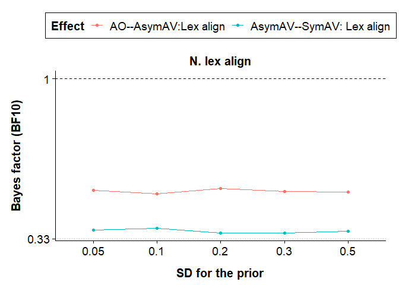<!-- -->

<br>

------------------------------------------------------------------------

# 8. Gestural alignment rate per iconic gestures (n_gest_alignment / n_iconic)

We can analyze the proportion of gestural alignment in two ways: (1)
modeling the rate of gestural alignment per iconic gesture using a
negative binomial regression model and (2) modeling the probability of
gestural alignment using a zero-one-inflated beta regression model.

Key differences in the two models are that the negative binomial
regression model assumes that the rate of gestural alignment is a count
variable, while the zero-one-inflated beta regression model assumes that
the proportion of gestural alignment is a continuous variable bounded
between 0 and 1. Also, while negative binomial regression models the
rate of events, the zero-one-inflated beta regression models the
probability of events. In the case of the proportion of gestural
alignment, two models should yield similar results, but it is important
to note that the two models are conceptually different.

As it is a common practice to analyze the frequency measures (e.g.,
number of gestures) as rates, we will use negative binomial regressions.

<br>

## 8.1 DataViz: proportion of gestural alignment

### bp: mean by condition

``` r
bp_mean_gest_alignment_prop_by_cond = ggplot(data=trial_info_pair, 
                                             aes(x=condition, y=mean_gest_align_prop, fill=condition)) +
  geom_jitter(aes(color = pair), 
              size = 1, alpha = 1, 
              width = 0.07, height = 0) +
  geom_boxplot(width = .3,
               outlier.shape = NA, alpha = 0.7) +
  geom_point(data = trial_info_cond, 
             aes(y = mean_gest_align_prop), 
             shape = 21, size = 3, fill = "white") +
  scale_fill_manual(values = c("#ED6B06", "#00786A", "darkgrey")) +
  labs(x = "Visibility",
       y = "Mean gest align rate") +
  theme_clean(base_size = 15) +
  theme(axis.text.x = element_text(colour = "black", size = 14),
        axis.text.y = element_text(colour = "black", size = 14),
        axis.title = element_text(size = 15, face = 'bold'),
        axis.title.x = element_text(vjust = -2),
        axis.title.y = element_text(vjust = 2),
        legend.position = "none",
        strip.text = element_text(size = 15, face = 'bold'),
        plot.background = element_blank(),
        plot.margin = unit(c(1.1,1.1,1.1,1.1), "lines"))

ggplotly(bp_mean_gest_alignment_prop_by_cond)
```

<div class="plotly html-widget html-fill-item" id="htmlwidget-34a3a07e28cc930e1be1" style="width:672px;height:480px;"></div>
<script type="application/json" data-for="htmlwidget-34a3a07e28cc930e1be1">{"x":{"data":[{"x":[0.96623270280193541],"y":[0.50952380952380949],"text":"condition: SymAV<br />mean_gest_align_prop: 0.5095<br />condition: SymAV<br />pair: 1","type":"scatter","mode":"markers","marker":{"autocolorscale":false,"color":"rgba(237,107,6,1)","opacity":1,"size":3.7795275590551185,"symbol":"circle","line":{"width":1.8897637795275593,"color":"rgba(248,118,109,1)"}},"hoveron":"points","name":"(SymAV,1)","legendgroup":"(SymAV,1)","showlegend":true,"xaxis":"x","yaxis":"y","hoverinfo":"text","frame":null},{"x":[0.96225472688674929],"y":[0.43560606060606061],"text":"condition: SymAV<br />mean_gest_align_prop: 0.4356<br />condition: SymAV<br />pair: 5","type":"scatter","mode":"markers","marker":{"autocolorscale":false,"color":"rgba(237,107,6,1)","opacity":1,"size":3.7795275590551185,"symbol":"circle","line":{"width":1.8897637795275593,"color":"rgba(229,135,0,1)"}},"hoveron":"points","name":"(SymAV,5)","legendgroup":"(SymAV,5)","showlegend":true,"xaxis":"x","yaxis":"y","hoverinfo":"text","frame":null},{"x":[1.0176770480861888],"y":[0.27671873097064914],"text":"condition: SymAV<br />mean_gest_align_prop: 0.2767<br />condition: SymAV<br />pair: 8","type":"scatter","mode":"markers","marker":{"autocolorscale":false,"color":"rgba(237,107,6,1)","opacity":1,"size":3.7795275590551185,"symbol":"circle","line":{"width":1.8897637795275593,"color":"rgba(201,152,0,1)"}},"hoveron":"points","name":"(SymAV,8)","legendgroup":"(SymAV,8)","showlegend":true,"xaxis":"x","yaxis":"y","hoverinfo":"text","frame":null},{"x":[0.99632642649579795],"y":[0.38744339951236501],"text":"condition: SymAV<br />mean_gest_align_prop: 0.3874<br />condition: SymAV<br />pair: 11","type":"scatter","mode":"markers","marker":{"autocolorscale":false,"color":"rgba(237,107,6,1)","opacity":1,"size":3.7795275590551185,"symbol":"circle","line":{"width":1.8897637795275593,"color":"rgba(163,165,0,1)"}},"hoveron":"points","name":"(SymAV,11)","legendgroup":"(SymAV,11)","showlegend":true,"xaxis":"x","yaxis":"y","hoverinfo":"text","frame":null},{"x":[1.0420393007993698],"y":[0.39827380952380953],"text":"condition: SymAV<br />mean_gest_align_prop: 0.3983<br />condition: SymAV<br />pair: 15","type":"scatter","mode":"markers","marker":{"autocolorscale":false,"color":"rgba(237,107,6,1)","opacity":1,"size":3.7795275590551185,"symbol":"circle","line":{"width":1.8897637795275593,"color":"rgba(107,177,0,1)"}},"hoveron":"points","name":"(SymAV,15)","legendgroup":"(SymAV,15)","showlegend":true,"xaxis":"x","yaxis":"y","hoverinfo":"text","frame":null},{"x":[1.0474473710125312],"y":[0.50426774483378256],"text":"condition: SymAV<br />mean_gest_align_prop: 0.5043<br />condition: SymAV<br />pair: 18","type":"scatter","mode":"markers","marker":{"autocolorscale":false,"color":"rgba(237,107,6,1)","opacity":1,"size":3.7795275590551185,"symbol":"circle","line":{"width":1.8897637795275593,"color":"rgba(0,186,56,1)"}},"hoveron":"points","name":"(SymAV,18)","legendgroup":"(SymAV,18)","showlegend":true,"xaxis":"x","yaxis":"y","hoverinfo":"text","frame":null},{"x":[1.0440451283100993],"y":[0.22222222222222221],"text":"condition: SymAV<br />mean_gest_align_prop: 0.2222<br />condition: SymAV<br />pair: 21","type":"scatter","mode":"markers","marker":{"autocolorscale":false,"color":"rgba(237,107,6,1)","opacity":1,"size":3.7795275590551185,"symbol":"circle","line":{"width":1.8897637795275593,"color":"rgba(0,191,125,1)"}},"hoveron":"points","name":"(SymAV,21)","legendgroup":"(SymAV,21)","showlegend":true,"xaxis":"x","yaxis":"y","hoverinfo":"text","frame":null},{"x":[0.98415784297976638],"y":[0.47541827541827542],"text":"condition: SymAV<br />mean_gest_align_prop: 0.4754<br />condition: SymAV<br />pair: 24","type":"scatter","mode":"markers","marker":{"autocolorscale":false,"color":"rgba(237,107,6,1)","opacity":1,"size":3.7795275590551185,"symbol":"circle","line":{"width":1.8897637795275593,"color":"rgba(0,192,175,1)"}},"hoveron":"points","name":"(SymAV,24)","legendgroup":"(SymAV,24)","showlegend":true,"xaxis":"x","yaxis":"y","hoverinfo":"text","frame":null},{"x":[0.96383563597220923],"y":[0.20000000000000001],"text":"condition: SymAV<br />mean_gest_align_prop: 0.2000<br />condition: SymAV<br />pair: 27","type":"scatter","mode":"markers","marker":{"autocolorscale":false,"color":"rgba(237,107,6,1)","opacity":1,"size":3.7795275590551185,"symbol":"circle","line":{"width":1.8897637795275593,"color":"rgba(0,188,216,1)"}},"hoveron":"points","name":"(SymAV,27)","legendgroup":"(SymAV,27)","showlegend":true,"xaxis":"x","yaxis":"y","hoverinfo":"text","frame":null},{"x":[0.99851554069668058],"y":[0.097222222222222224],"text":"condition: SymAV<br />mean_gest_align_prop: 0.0972<br />condition: SymAV<br />pair: 30","type":"scatter","mode":"markers","marker":{"autocolorscale":false,"color":"rgba(237,107,6,1)","opacity":1,"size":3.7795275590551185,"symbol":"circle","line":{"width":1.8897637795275593,"color":"rgba(0,176,246,1)"}},"hoveron":"points","name":"(SymAV,30)","legendgroup":"(SymAV,30)","showlegend":true,"xaxis":"x","yaxis":"y","hoverinfo":"text","frame":null},{"x":[0.97962358255870641],"y":[0.56607142857142856],"text":"condition: SymAV<br />mean_gest_align_prop: 0.5661<br />condition: SymAV<br />pair: 33","type":"scatter","mode":"markers","marker":{"autocolorscale":false,"color":"rgba(237,107,6,1)","opacity":1,"size":3.7795275590551185,"symbol":"circle","line":{"width":1.8897637795275593,"color":"rgba(97,156,255,1)"}},"hoveron":"points","name":"(SymAV,33)","legendgroup":"(SymAV,33)","showlegend":true,"xaxis":"x","yaxis":"y","hoverinfo":"text","frame":null},{"x":[1.0385771841555833],"y":[0.40952380952380951],"text":"condition: SymAV<br />mean_gest_align_prop: 0.4095<br />condition: SymAV<br />pair: 36","type":"scatter","mode":"markers","marker":{"autocolorscale":false,"color":"rgba(237,107,6,1)","opacity":1,"size":3.7795275590551185,"symbol":"circle","line":{"width":1.8897637795275593,"color":"rgba(185,131,255,1)"}},"hoveron":"points","name":"(SymAV,36)","legendgroup":"(SymAV,36)","showlegend":true,"xaxis":"x","yaxis":"y","hoverinfo":"text","frame":null},{"x":[1.0467753229336814],"y":[0.2904761904761905],"text":"condition: SymAV<br />mean_gest_align_prop: 0.2905<br />condition: SymAV<br />pair: 39","type":"scatter","mode":"markers","marker":{"autocolorscale":false,"color":"rgba(237,107,6,1)","opacity":1,"size":3.7795275590551185,"symbol":"circle","line":{"width":1.8897637795275593,"color":"rgba(231,107,243,1)"}},"hoveron":"points","name":"(SymAV,39)","legendgroup":"(SymAV,39)","showlegend":true,"xaxis":"x","yaxis":"y","hoverinfo":"text","frame":null},{"x":[1.0000873996177688],"y":[0],"text":"condition: SymAV<br />mean_gest_align_prop: 0.0000<br />condition: SymAV<br />pair: 42","type":"scatter","mode":"markers","marker":{"autocolorscale":false,"color":"rgba(237,107,6,1)","opacity":1,"size":3.7795275590551185,"symbol":"circle","line":{"width":1.8897637795275593,"color":"rgba(253,97,209,1)"}},"hoveron":"points","name":"(SymAV,42)","legendgroup":"(SymAV,42)","showlegend":true,"xaxis":"x","yaxis":"y","hoverinfo":"text","frame":null},{"x":[1.0128791048331187],"y":[0.39229797979797981],"text":"condition: SymAV<br />mean_gest_align_prop: 0.3923<br />condition: SymAV<br />pair: 45","type":"scatter","mode":"markers","marker":{"autocolorscale":false,"color":"rgba(237,107,6,1)","opacity":1,"size":3.7795275590551185,"symbol":"circle","line":{"width":1.8897637795275593,"color":"rgba(255,103,164,1)"}},"hoveron":"points","name":"(SymAV,45)","legendgroup":"(SymAV,45)","showlegend":true,"xaxis":"x","yaxis":"y","hoverinfo":"text","frame":null},{"x":[1.9557407663483173],"y":[0.10000000000000001],"text":"condition: AsymAV<br />mean_gest_align_prop: 0.1000<br />condition: AsymAV<br />pair: 2","type":"scatter","mode":"markers","marker":{"autocolorscale":false,"color":"rgba(0,120,106,1)","opacity":1,"size":3.7795275590551185,"symbol":"circle","line":{"width":1.8897637795275593,"color":"rgba(242,124,86,1)"}},"hoveron":"points","name":"(AsymAV,2)","legendgroup":"(AsymAV,2)","showlegend":true,"xaxis":"x","yaxis":"y","hoverinfo":"text","frame":null},{"x":[1.9735993485851213],"y":[0.015625],"text":"condition: AsymAV<br />mean_gest_align_prop: 0.0156<br />condition: AsymAV<br />pair: 6","type":"scatter","mode":"markers","marker":{"autocolorscale":false,"color":"rgba(0,120,106,1)","opacity":1,"size":3.7795275590551185,"symbol":"circle","line":{"width":1.8897637795275593,"color":"rgba(220,141,0,1)"}},"hoveron":"points","name":"(AsymAV,6)","legendgroup":"(AsymAV,6)","showlegend":true,"xaxis":"x","yaxis":"y","hoverinfo":"text","frame":null},{"x":[2.0027347400458528],"y":[0.48161094224924011],"text":"condition: AsymAV<br />mean_gest_align_prop: 0.4816<br />condition: AsymAV<br />pair: 9","type":"scatter","mode":"markers","marker":{"autocolorscale":false,"color":"rgba(0,120,106,1)","opacity":1,"size":3.7795275590551185,"symbol":"circle","line":{"width":1.8897637795275593,"color":"rgba(189,156,0,1)"}},"hoveron":"points","name":"(AsymAV,9)","legendgroup":"(AsymAV,9)","showlegend":true,"xaxis":"x","yaxis":"y","hoverinfo":"text","frame":null},{"x":[2.0168945676553993],"y":[0.34048821548821551],"text":"condition: AsymAV<br />mean_gest_align_prop: 0.3405<br />condition: AsymAV<br />pair: 12","type":"scatter","mode":"markers","marker":{"autocolorscale":false,"color":"rgba(0,120,106,1)","opacity":1,"size":3.7795275590551185,"symbol":"circle","line":{"width":1.8897637795275593,"color":"rgba(147,170,0,1)"}},"hoveron":"points","name":"(AsymAV,12)","legendgroup":"(AsymAV,12)","showlegend":true,"xaxis":"x","yaxis":"y","hoverinfo":"text","frame":null},{"x":[2.0335854237526654],"y":[0.27777777777777779],"text":"condition: AsymAV<br />mean_gest_align_prop: 0.2778<br />condition: AsymAV<br />pair: 16","type":"scatter","mode":"markers","marker":{"autocolorscale":false,"color":"rgba(0,120,106,1)","opacity":1,"size":3.7795275590551185,"symbol":"circle","line":{"width":1.8897637795275593,"color":"rgba(78,180,0,1)"}},"hoveron":"points","name":"(AsymAV,16)","legendgroup":"(AsymAV,16)","showlegend":true,"xaxis":"x","yaxis":"y","hoverinfo":"text","frame":null},{"x":[1.9695315851457418],"y":[0.38297813297813299],"text":"condition: AsymAV<br />mean_gest_align_prop: 0.3830<br />condition: AsymAV<br />pair: 19","type":"scatter","mode":"markers","marker":{"autocolorscale":false,"color":"rgba(0,120,106,1)","opacity":1,"size":3.7795275590551185,"symbol":"circle","line":{"width":1.8897637795275593,"color":"rgba(0,188,84,1)"}},"hoveron":"points","name":"(AsymAV,19)","legendgroup":"(AsymAV,19)","showlegend":true,"xaxis":"x","yaxis":"y","hoverinfo":"text","frame":null},{"x":[1.946011027446948],"y":[0.50889586603872317],"text":"condition: AsymAV<br />mean_gest_align_prop: 0.5089<br />condition: AsymAV<br />pair: 22","type":"scatter","mode":"markers","marker":{"autocolorscale":false,"color":"rgba(0,120,106,1)","opacity":1,"size":3.7795275590551185,"symbol":"circle","line":{"width":1.8897637795275593,"color":"rgba(0,192,143,1)"}},"hoveron":"points","name":"(AsymAV,22)","legendgroup":"(AsymAV,22)","showlegend":true,"xaxis":"x","yaxis":"y","hoverinfo":"text","frame":null},{"x":[2.0656904745381324],"y":[0.38680533303174813],"text":"condition: AsymAV<br />mean_gest_align_prop: 0.3868<br />condition: AsymAV<br />pair: 25","type":"scatter","mode":"markers","marker":{"autocolorscale":false,"color":"rgba(0,120,106,1)","opacity":1,"size":3.7795275590551185,"symbol":"circle","line":{"width":1.8897637795275593,"color":"rgba(0,192,189,1)"}},"hoveron":"points","name":"(AsymAV,25)","legendgroup":"(AsymAV,25)","showlegend":true,"xaxis":"x","yaxis":"y","hoverinfo":"text","frame":null},{"x":[1.9480026429751889],"y":[0.44047619047619047],"text":"condition: AsymAV<br />mean_gest_align_prop: 0.4405<br />condition: AsymAV<br />pair: 28","type":"scatter","mode":"markers","marker":{"autocolorscale":false,"color":"rgba(0,120,106,1)","opacity":1,"size":3.7795275590551185,"symbol":"circle","line":{"width":1.8897637795275593,"color":"rgba(0,185,227,1)"}},"hoveron":"points","name":"(AsymAV,28)","legendgroup":"(AsymAV,28)","showlegend":true,"xaxis":"x","yaxis":"y","hoverinfo":"text","frame":null},{"x":[2.015822196160443],"y":[0.60568181818181821],"text":"condition: AsymAV<br />mean_gest_align_prop: 0.6057<br />condition: AsymAV<br />pair: 31","type":"scatter","mode":"markers","marker":{"autocolorscale":false,"color":"rgba(0,120,106,1)","opacity":1,"size":3.7795275590551185,"symbol":"circle","line":{"width":1.8897637795275593,"color":"rgba(0,170,254,1)"}},"hoveron":"points","name":"(AsymAV,31)","legendgroup":"(AsymAV,31)","showlegend":true,"xaxis":"x","yaxis":"y","hoverinfo":"text","frame":null},{"x":[1.9639807117264718],"y":[0.33921568627450982],"text":"condition: AsymAV<br />mean_gest_align_prop: 0.3392<br />condition: AsymAV<br />pair: 34","type":"scatter","mode":"markers","marker":{"autocolorscale":false,"color":"rgba(0,120,106,1)","opacity":1,"size":3.7795275590551185,"symbol":"circle","line":{"width":1.8897637795275593,"color":"rgba(134,148,255,1)"}},"hoveron":"points","name":"(AsymAV,34)","legendgroup":"(AsymAV,34)","showlegend":true,"xaxis":"x","yaxis":"y","hoverinfo":"text","frame":null},{"x":[1.9674885010207073],"y":[0.2955069124423963],"text":"condition: AsymAV<br />mean_gest_align_prop: 0.2955<br />condition: AsymAV<br />pair: 37","type":"scatter","mode":"markers","marker":{"autocolorscale":false,"color":"rgba(0,120,106,1)","opacity":1,"size":3.7795275590551185,"symbol":"circle","line":{"width":1.8897637795275593,"color":"rgba(203,122,255,1)"}},"hoveron":"points","name":"(AsymAV,37)","legendgroup":"(AsymAV,37)","showlegend":true,"xaxis":"x","yaxis":"y","hoverinfo":"text","frame":null},{"x":[2.0611766110174359],"y":[0.5],"text":"condition: AsymAV<br />mean_gest_align_prop: 0.5000<br />condition: AsymAV<br />pair: 40","type":"scatter","mode":"markers","marker":{"autocolorscale":false,"color":"rgba(0,120,106,1)","opacity":1,"size":3.7795275590551185,"symbol":"circle","line":{"width":1.8897637795275593,"color":"rgba(241,102,233,1)"}},"hoveron":"points","name":"(AsymAV,40)","legendgroup":"(AsymAV,40)","showlegend":true,"xaxis":"x","yaxis":"y","hoverinfo":"text","frame":null},{"x":[2.0137102986266835],"y":[0.5],"text":"condition: AsymAV<br />mean_gest_align_prop: 0.5000<br />condition: AsymAV<br />pair: 43","type":"scatter","mode":"markers","marker":{"autocolorscale":false,"color":"rgba(0,120,106,1)","opacity":1,"size":3.7795275590551185,"symbol":"circle","line":{"width":1.8897637795275593,"color":"rgba(255,97,195,1)"}},"hoveron":"points","name":"(AsymAV,43)","legendgroup":"(AsymAV,43)","showlegend":true,"xaxis":"x","yaxis":"y","hoverinfo":"text","frame":null},{"x":[1.937734718201682],"y":[0],"text":"condition: AsymAV<br />mean_gest_align_prop: 0.0000<br />condition: AsymAV<br />pair: 46","type":"scatter","mode":"markers","marker":{"autocolorscale":false,"color":"rgba(0,120,106,1)","opacity":1,"size":3.7795275590551185,"symbol":"circle","line":{"width":1.8897637795275593,"color":"rgba(255,107,147,1)"}},"hoveron":"points","name":"(AsymAV,46)","legendgroup":"(AsymAV,46)","showlegend":true,"xaxis":"x","yaxis":"y","hoverinfo":"text","frame":null},{"x":[2.9387500751996414],"y":[0.80000000000000004],"text":"condition: AO<br />mean_gest_align_prop: 0.8000<br />condition: AO<br />pair: 3","type":"scatter","mode":"markers","marker":{"autocolorscale":false,"color":"rgba(169,169,169,1)","opacity":1,"size":3.7795275590551185,"symbol":"circle","line":{"width":1.8897637795275593,"color":"rgba(236,130,58,1)"}},"hoveron":"points","name":"(AO,3)","legendgroup":"(AO,3)","showlegend":true,"xaxis":"x","yaxis":"y","hoverinfo":"text","frame":null},{"x":[3.0497336895018816],"y":[0],"text":"condition: AO<br />mean_gest_align_prop: 0.0000<br />condition: AO<br />pair: 7","type":"scatter","mode":"markers","marker":{"autocolorscale":false,"color":"rgba(169,169,169,1)","opacity":1,"size":3.7795275590551185,"symbol":"circle","line":{"width":1.8897637795275593,"color":"rgba(211,146,0,1)"}},"hoveron":"points","name":"(AO,7)","legendgroup":"(AO,7)","showlegend":true,"xaxis":"x","yaxis":"y","hoverinfo":"text","frame":null},{"x":[2.9920630897814409],"y":[0],"text":"condition: AO<br />mean_gest_align_prop: 0.0000<br />condition: AO<br />pair: 10","type":"scatter","mode":"markers","marker":{"autocolorscale":false,"color":"rgba(169,169,169,1)","opacity":1,"size":3.7795275590551185,"symbol":"circle","line":{"width":1.8897637795275593,"color":"rgba(177,161,0,1)"}},"hoveron":"points","name":"(AO,10)","legendgroup":"(AO,10)","showlegend":true,"xaxis":"x","yaxis":"y","hoverinfo":"text","frame":null},{"x":[3.0360900898929684],"y":[0.34738863287250382],"text":"condition: AO<br />mean_gest_align_prop: 0.3474<br />condition: AO<br />pair: 13","type":"scatter","mode":"markers","marker":{"autocolorscale":false,"color":"rgba(169,169,169,1)","opacity":1,"size":3.7795275590551185,"symbol":"circle","line":{"width":1.8897637795275593,"color":"rgba(129,173,0,1)"}},"hoveron":"points","name":"(AO,13)","legendgroup":"(AO,13)","showlegend":true,"xaxis":"x","yaxis":"y","hoverinfo":"text","frame":null},{"x":[2.9422797580529005],"y":[0.47035567313345089],"text":"condition: AO<br />mean_gest_align_prop: 0.4704<br />condition: AO<br />pair: 17","type":"scatter","mode":"markers","marker":{"autocolorscale":false,"color":"rgba(169,169,169,1)","opacity":1,"size":3.7795275590551185,"symbol":"circle","line":{"width":1.8897637795275593,"color":"rgba(21,183,0,1)"}},"hoveron":"points","name":"(AO,17)","legendgroup":"(AO,17)","showlegend":true,"xaxis":"x","yaxis":"y","hoverinfo":"text","frame":null},{"x":[3.0011607247823848],"y":[0.05568181818181818],"text":"condition: AO<br />mean_gest_align_prop: 0.0557<br />condition: AO<br />pair: 20","type":"scatter","mode":"markers","marker":{"autocolorscale":false,"color":"rgba(169,169,169,1)","opacity":1,"size":3.7795275590551185,"symbol":"circle","line":{"width":1.8897637795275593,"color":"rgba(0,190,106,1)"}},"hoveron":"points","name":"(AO,20)","legendgroup":"(AO,20)","showlegend":true,"xaxis":"x","yaxis":"y","hoverinfo":"text","frame":null},{"x":[2.9525765827624126],"y":[0.3888888888888889],"text":"condition: AO<br />mean_gest_align_prop: 0.3889<br />condition: AO<br />pair: 23","type":"scatter","mode":"markers","marker":{"autocolorscale":false,"color":"rgba(169,169,169,1)","opacity":1,"size":3.7795275590551185,"symbol":"circle","line":{"width":1.8897637795275593,"color":"rgba(0,193,159,1)"}},"hoveron":"points","name":"(AO,23)","legendgroup":"(AO,23)","showlegend":true,"xaxis":"x","yaxis":"y","hoverinfo":"text","frame":null},{"x":[2.9497758290683849],"y":[0.10000000000000001],"text":"condition: AO<br />mean_gest_align_prop: 0.1000<br />condition: AO<br />pair: 26","type":"scatter","mode":"markers","marker":{"autocolorscale":false,"color":"rgba(169,169,169,1)","opacity":1,"size":3.7795275590551185,"symbol":"circle","line":{"width":1.8897637795275593,"color":"rgba(0,190,203,1)"}},"hoveron":"points","name":"(AO,26)","legendgroup":"(AO,26)","showlegend":true,"xaxis":"x","yaxis":"y","hoverinfo":"text","frame":null},{"x":[2.9853503234917298],"y":[0.20863095238095239],"text":"condition: AO<br />mean_gest_align_prop: 0.2086<br />condition: AO<br />pair: 29","type":"scatter","mode":"markers","marker":{"autocolorscale":false,"color":"rgba(169,169,169,1)","opacity":1,"size":3.7795275590551185,"symbol":"circle","line":{"width":1.8897637795275593,"color":"rgba(0,181,238,1)"}},"hoveron":"points","name":"(AO,29)","legendgroup":"(AO,29)","showlegend":true,"xaxis":"x","yaxis":"y","hoverinfo":"text","frame":null},{"x":[3.035124695901759],"y":[0.23529411764705882],"text":"condition: AO<br />mean_gest_align_prop: 0.2353<br />condition: AO<br />pair: 32","type":"scatter","mode":"markers","marker":{"autocolorscale":false,"color":"rgba(169,169,169,1)","opacity":1,"size":3.7795275590551185,"symbol":"circle","line":{"width":1.8897637795275593,"color":"rgba(24,163,255,1)"}},"hoveron":"points","name":"(AO,32)","legendgroup":"(AO,32)","showlegend":true,"xaxis":"x","yaxis":"y","hoverinfo":"text","frame":null},{"x":[3.0566675770934673],"y":[0.025157232704402514],"text":"condition: AO<br />mean_gest_align_prop: 0.0252<br />condition: AO<br />pair: 35","type":"scatter","mode":"markers","marker":{"autocolorscale":false,"color":"rgba(169,169,169,1)","opacity":1,"size":3.7795275590551185,"symbol":"circle","line":{"width":1.8897637795275593,"color":"rgba(162,139,255,1)"}},"hoveron":"points","name":"(AO,35)","legendgroup":"(AO,35)","showlegend":true,"xaxis":"x","yaxis":"y","hoverinfo":"text","frame":null},{"x":[3.0117510522902013],"y":[0.019607843137254902],"text":"condition: AO<br />mean_gest_align_prop: 0.0196<br />condition: AO<br />pair: 38","type":"scatter","mode":"markers","marker":{"autocolorscale":false,"color":"rgba(169,169,169,1)","opacity":1,"size":3.7795275590551185,"symbol":"circle","line":{"width":1.8897637795275593,"color":"rgba(219,114,251,1)"}},"hoveron":"points","name":"(AO,38)","legendgroup":"(AO,38)","showlegend":true,"xaxis":"x","yaxis":"y","hoverinfo":"text","frame":null},{"x":[2.9870570709137247],"y":[0.22222222222222221],"text":"condition: AO<br />mean_gest_align_prop: 0.2222<br />condition: AO<br />pair: 41","type":"scatter","mode":"markers","marker":{"autocolorscale":false,"color":"rgba(169,169,169,1)","opacity":1,"size":3.7795275590551185,"symbol":"circle","line":{"width":1.8897637795275593,"color":"rgba(248,98,222,1)"}},"hoveron":"points","name":"(AO,41)","legendgroup":"(AO,41)","showlegend":true,"xaxis":"x","yaxis":"y","hoverinfo":"text","frame":null},{"x":[2.9600475721061228],"y":[0.3753968253968254],"text":"condition: AO<br />mean_gest_align_prop: 0.3754<br />condition: AO<br />pair: 44","type":"scatter","mode":"markers","marker":{"autocolorscale":false,"color":"rgba(169,169,169,1)","opacity":1,"size":3.7795275590551185,"symbol":"circle","line":{"width":1.8897637795275593,"color":"rgba(255,99,180,1)"}},"hoveron":"points","name":"(AO,44)","legendgroup":"(AO,44)","showlegend":true,"xaxis":"x","yaxis":"y","hoverinfo":"text","frame":null},{"x":[3.0616842552088199],"y":[0.55681818181818177],"text":"condition: AO<br />mean_gest_align_prop: 0.5568<br />condition: AO<br />pair: 47","type":"scatter","mode":"markers","marker":{"autocolorscale":false,"color":"rgba(169,169,169,1)","opacity":1,"size":3.7795275590551185,"symbol":"circle","line":{"width":1.8897637795275593,"color":"rgba(252,113,129,1)"}},"hoveron":"points","name":"(AO,47)","legendgroup":"(AO,47)","showlegend":true,"xaxis":"x","yaxis":"y","hoverinfo":"text","frame":null},{"x":[1,1,1,1,1,1,1,1,1,1,1,1,1,1,1],"y":[0.50952380952380949,0.097222222222222224,0.50426774483378256,0.43560606060606061,0.56607142857142856,0.22222222222222221,0.27671873097064914,0.40952380952380951,0.47541827541827542,0.38744339951236501,0.2904761904761905,0.20000000000000001,0.39827380952380953,0,0.39229797979797981],"hoverinfo":"y","type":"box","fillcolor":"rgba(237,107,6,0.7)","marker":{"opacity":null,"outliercolor":"rgba(0,0,0,1)","line":{"width":1.8897637795275593,"color":"rgba(0,0,0,1)"},"size":5.6692913385826778},"line":{"color":"rgba(51,51,51,1)","width":1.8897637795275593},"name":"(SymAV,1)","legendgroup":"(SymAV,1)","showlegend":false,"xaxis":"x","yaxis":"y","frame":null},{"x":[2,2,2,2,2,2,2,2,2,2,2,2,2,2,2],"y":[0.10000000000000001,0.60568181818181821,0.015625,0.33921568627450982,0.50889586603872317,0.48161094224924011,0.2955069124423963,0.38680533303174813,0.34048821548821551,0.5,0.44047619047619047,0.27777777777777779,0.5,0.38297813297813299,0],"hoverinfo":"y","type":"box","fillcolor":"rgba(0,120,106,0.7)","marker":{"opacity":null,"outliercolor":"rgba(0,0,0,1)","line":{"width":1.8897637795275593,"color":"rgba(0,0,0,1)"},"size":5.6692913385826778},"line":{"color":"rgba(51,51,51,1)","width":1.8897637795275593},"name":"(AsymAV,1)","legendgroup":"(AsymAV,1)","showlegend":true,"xaxis":"x","yaxis":"y","frame":null},{"x":[3,3,3,3,3,3,3,3,3,3,3,3,3,3,3],"y":[0.80000000000000004,0,0.025157232704402514,0.3888888888888889,0,0.019607843137254902,0.10000000000000001,0.34738863287250382,0.22222222222222221,0.20863095238095239,0.47035567313345089,0.3753968253968254,0.23529411764705882,0.05568181818181818,0.55681818181818177],"hoverinfo":"y","type":"box","fillcolor":"rgba(169,169,169,0.7)","marker":{"opacity":null,"outliercolor":"rgba(0,0,0,1)","line":{"width":1.8897637795275593,"color":"rgba(0,0,0,1)"},"size":5.6692913385826778},"line":{"color":"rgba(51,51,51,1)","width":1.8897637795275593},"name":"(AO,1)","legendgroup":"(AO,1)","showlegend":true,"xaxis":"x","yaxis":"y","frame":null},{"x":[1,2,3],"y":[0.38574983398971191,0.38354941716799906,0.24471432569669346],"text":["condition: SymAV<br />mean_gest_align_prop: 0.386<br />condition: white","condition: AsymAV<br />mean_gest_align_prop: 0.384<br />condition: white","condition: AO<br />mean_gest_align_prop: 0.245<br />condition: white"],"type":"scatter","mode":"markers","marker":{"autocolorscale":false,"color":"rgba(255,255,255,1)","opacity":1,"size":11.338582677165356,"symbol":"circle","line":{"width":1.8897637795275593,"color":"rgba(0,0,0,1)"}},"hoveron":"points","showlegend":false,"xaxis":"x","yaxis":"y","hoverinfo":"text","frame":null}],"layout":{"margin":{"t":37.119999999999997,"r":21.119999999999997,"b":64.623528435035269,"l":73.921992528019928},"font":{"color":"rgba(0,0,0,1)","family":"sans","size":19.9252801992528},"xaxis":{"domain":[0,1],"automargin":true,"type":"linear","autorange":false,"range":[0.40000000000000002,3.6000000000000001],"tickmode":"array","ticktext":["SymAV","AsymAV","AO"],"tickvals":[1,2,3],"categoryorder":"array","categoryarray":["SymAV","AsymAV","AO"],"nticks":null,"ticks":"outside","tickcolor":"rgba(0,0,0,1)","ticklen":4.9813200498132,"tickwidth":0.90569455451149106,"showticklabels":true,"tickfont":{"color":"rgba(0,0,0,1)","family":"sans","size":18.596928185969279},"tickangle":-0,"showline":true,"linecolor":"rgba(0,0,0,1)","linewidth":0.66417600664176002,"showgrid":false,"gridcolor":null,"gridwidth":0,"zeroline":false,"anchor":"y","title":{"text":"<b> Visibility <\/b>","font":{"color":"rgba(0,0,0,1)","family":"sans","size":19.9252801992528}},"hoverformat":".2f"},"yaxis":{"domain":[0,1],"automargin":true,"type":"linear","autorange":false,"range":[-0.040000000000000008,0.84000000000000008],"tickmode":"array","ticktext":["0.0","0.2","0.4","0.6","0.8"],"tickvals":[0,0.20000000000000001,0.40000000000000002,0.60000000000000009,0.80000000000000004],"categoryorder":"array","categoryarray":["0.0","0.2","0.4","0.6","0.8"],"nticks":null,"ticks":"outside","tickcolor":"rgba(0,0,0,1)","ticklen":4.9813200498132018,"tickwidth":0.90569455451149117,"showticklabels":true,"tickfont":{"color":"rgba(0,0,0,1)","family":"sans","size":18.596928185969279},"tickangle":-0,"showline":true,"linecolor":"rgba(0,0,0,1)","linewidth":0.66417600664176002,"showgrid":true,"gridcolor":"rgba(190,190,190,1)","gridwidth":0.90569455451149117,"zeroline":false,"anchor":"x","title":{"text":"<b> Mean gest align rate <\/b>","font":{"color":"rgba(0,0,0,1)","family":"sans","size":19.9252801992528}},"hoverformat":".2f"},"shapes":[{"type":"rect","fillcolor":null,"line":{"color":null,"width":0,"linetype":[]},"yref":"paper","xref":"paper","x0":0,"x1":1,"y0":0,"y1":1}],"showlegend":false,"legend":{"bgcolor":"rgba(255,255,255,1)","bordercolor":"rgba(0,0,0,1)","borderwidth":2.5769506084466713,"font":{"color":"rgba(0,0,0,1)","family":"sans","size":18.596928185969279}},"hovermode":"closest","barmode":"relative"},"config":{"doubleClick":"reset","modeBarButtonsToAdd":["hoverclosest","hovercompare"],"showSendToCloud":false},"source":"A","attrs":{"21cc350b37a7":{"x":{},"y":{},"fill":{},"colour":{},"type":"scatter"},"21ccd71ae6":{"x":{},"y":{},"fill":{}},"21cc6eff6ee5":{"x":{},"y":{},"fill":{}}},"cur_data":"21cc350b37a7","visdat":{"21cc350b37a7":["function (y) ","x"],"21ccd71ae6":["function (y) ","x"],"21cc6eff6ee5":["function (y) ","x"]},"highlight":{"on":"plotly_click","persistent":false,"dynamic":false,"selectize":false,"opacityDim":0.20000000000000001,"selected":{"opacity":1},"debounce":0},"shinyEvents":["plotly_hover","plotly_click","plotly_selected","plotly_relayout","plotly_brushed","plotly_brushing","plotly_clickannotation","plotly_doubleclick","plotly_deselect","plotly_afterplot","plotly_sunburstclick"],"base_url":"https://plot.ly"},"evals":[],"jsHooks":[]}</script>

<br>

### bp: mean by condition and round

``` r
pd = position_dodge(width = .75)

bp_mean_gest_alignment_prop_by_round_cond = 
  ggplot(data=trial_info_pair_round, 
         aes(x=round_n, y=mean_gest_align_prop, fill = condition)) +
  geom_jitter(aes(color = pair), 
              size = 0.5, alpha = 0.7, 
              width = 0.07, height = 0) +
  geom_boxplot(width = .5,
               outlier.shape = NA, alpha = 0.7) +
  geom_point(data = trial_info_cond_round, 
             aes(y = mean_gest_align_prop),
             position = pd,
             shape = 21, size = 2, fill = "white") +
  scale_fill_manual(values = c("#ED6B06", "#00786A", "darkgrey")) +
  scale_y_continuous(limits = c(0, 1)) +
  labs(x = "Round",
       y = "Mean gest align rate") +
  theme_clean(base_size = 15) +
  theme(axis.text.x = element_text(colour = "black", size = 14),
        axis.text.y = element_text(colour = "black", size = 14),
        axis.title = element_text(size = 15, face = 'bold'),
        axis.title.x = element_text(vjust = -2),
        axis.title.y = element_text(vjust = 2),
        legend.position = "none",
        strip.text = element_text(size = 15, face = 'bold'),
        plot.background = element_blank(),
        plot.margin = unit(c(1.1,1.1,1.1,1.1), "lines")) +
  facet_grid(cols = vars(condition))

ggplotly(bp_mean_gest_alignment_prop_by_round_cond)
```

<div class="plotly html-widget html-fill-item" id="htmlwidget-f602ee96cb7b05c3b6b0" style="width:672px;height:480px;"></div>
<script type="application/json" data-for="htmlwidget-f602ee96cb7b05c3b6b0">{"x":{"data":[{"x":[0.97156125687528405,1.9384196138475089,3.0152674767002465,4.0564576103724539,4.9912947497516873,5.9493629137380051],"y":[0.125,0.63888888888888884,0.64814814814814814,0.625,null,null],"text":["round_n: 1<br />mean_gest_align_prop: 0.12500<br />condition: SymAV<br />pair: 1","round_n: 2<br />mean_gest_align_prop: 0.63889<br />condition: SymAV<br />pair: 1","round_n: 3<br />mean_gest_align_prop: 0.64815<br />condition: SymAV<br />pair: 1","round_n: 4<br />mean_gest_align_prop: 0.62500<br />condition: SymAV<br />pair: 1","round_n: 5<br />mean_gest_align_prop: 1.04167<br />condition: SymAV<br />pair: 1","round_n: 6<br />mean_gest_align_prop:     NaN<br />condition: SymAV<br />pair: 1"],"type":"scatter","mode":"markers","marker":{"autocolorscale":false,"color":"rgba(237,107,6,1)","opacity":0.69999999999999996,"size":1.8897637795275593,"symbol":"circle","line":{"width":1.8897637795275593,"color":"rgba(248,118,109,1)"}},"hoveron":"points","name":"(SymAV,1)","legendgroup":"(SymAV,1)","showlegend":true,"xaxis":"x","yaxis":"y","hoverinfo":"text","frame":null},{"x":[0.98964774122461674,2.0576499047270045,3.0321582375979053,4.0041323824226858,5.0603976326016706,5.9669584328308698],"y":[0,0.625,0.625,0.5,0.58333333333333337,0.5],"text":["round_n: 1<br />mean_gest_align_prop: 0.00000<br />condition: SymAV<br />pair: 5","round_n: 2<br />mean_gest_align_prop: 0.62500<br />condition: SymAV<br />pair: 5","round_n: 3<br />mean_gest_align_prop: 0.62500<br />condition: SymAV<br />pair: 5","round_n: 4<br />mean_gest_align_prop: 0.50000<br />condition: SymAV<br />pair: 5","round_n: 5<br />mean_gest_align_prop: 0.58333<br />condition: SymAV<br />pair: 5","round_n: 6<br />mean_gest_align_prop: 0.50000<br />condition: SymAV<br />pair: 5"],"type":"scatter","mode":"markers","marker":{"autocolorscale":false,"color":"rgba(237,107,6,1)","opacity":0.69999999999999996,"size":1.8897637795275593,"symbol":"circle","line":{"width":1.8897637795275593,"color":"rgba(229,135,0,1)"}},"hoveron":"points","name":"(SymAV,5)","legendgroup":"(SymAV,5)","showlegend":true,"xaxis":"x","yaxis":"y","hoverinfo":"text","frame":null},{"x":[1.0220526207052172,2.0063882861938329,3.0232119492907077,4.0071303144982089,4.9854238746734332,6.0365385536942631],"y":[0.096256684491978606,0.2503968253968254,0.17857142857142858,0.33333333333333331,0.25,0.60416666666666663],"text":["round_n: 1<br />mean_gest_align_prop: 0.09626<br />condition: SymAV<br />pair: 8","round_n: 2<br />mean_gest_align_prop: 0.25040<br />condition: SymAV<br />pair: 8","round_n: 3<br />mean_gest_align_prop: 0.17857<br />condition: SymAV<br />pair: 8","round_n: 4<br />mean_gest_align_prop: 0.33333<br />condition: SymAV<br />pair: 8","round_n: 5<br />mean_gest_align_prop: 0.25000<br />condition: SymAV<br />pair: 8","round_n: 6<br />mean_gest_align_prop: 0.60417<br />condition: SymAV<br />pair: 8"],"type":"scatter","mode":"markers","marker":{"autocolorscale":false,"color":"rgba(237,107,6,1)","opacity":0.69999999999999996,"size":1.8897637795275593,"symbol":"circle","line":{"width":1.8897637795275593,"color":"rgba(201,152,0,1)"}},"hoveron":"points","name":"(SymAV,8)","legendgroup":"(SymAV,8)","showlegend":true,"xaxis":"x","yaxis":"y","hoverinfo":"text","frame":null},{"x":[1.0333245955407619,1.9687886591069401,2.9774848096445203,3.9816308137960732,5.0420464561739937,5.9637247457075864],"y":[0.27873563218390807,0.39166666666666666,0.56666666666666665,0.55555555555555558,null,0.41666666666666669],"text":["round_n: 1<br />mean_gest_align_prop: 0.27874<br />condition: SymAV<br />pair: 11","round_n: 2<br />mean_gest_align_prop: 0.39167<br />condition: SymAV<br />pair: 11","round_n: 3<br />mean_gest_align_prop: 0.56667<br />condition: SymAV<br />pair: 11","round_n: 4<br />mean_gest_align_prop: 0.55556<br />condition: SymAV<br />pair: 11","round_n: 5<br />mean_gest_align_prop:     NaN<br />condition: SymAV<br />pair: 11","round_n: 6<br />mean_gest_align_prop: 0.41667<br />condition: SymAV<br />pair: 11"],"type":"scatter","mode":"markers","marker":{"autocolorscale":false,"color":"rgba(237,107,6,1)","opacity":0.69999999999999996,"size":1.8897637795275593,"symbol":"circle","line":{"width":1.8897637795275593,"color":"rgba(163,165,0,1)"}},"hoveron":"points","name":"(SymAV,11)","legendgroup":"(SymAV,11)","showlegend":true,"xaxis":"x","yaxis":"y","hoverinfo":"text","frame":null},{"x":[1.0351254681078716,1.9350882016122342,3.0114857996534554,3.9920054778270422,4.972266080719419,6.0689830499887467],"y":[0.0089285714285714281,0.34999999999999998,0.7857142857142857,0.6333333333333333,0.53125,1],"text":["round_n: 1<br />mean_gest_align_prop: 0.00893<br />condition: SymAV<br />pair: 15","round_n: 2<br />mean_gest_align_prop: 0.35000<br />condition: SymAV<br />pair: 15","round_n: 3<br />mean_gest_align_prop: 0.78571<br />condition: SymAV<br />pair: 15","round_n: 4<br />mean_gest_align_prop: 0.63333<br />condition: SymAV<br />pair: 15","round_n: 5<br />mean_gest_align_prop: 0.53125<br />condition: SymAV<br />pair: 15","round_n: 6<br />mean_gest_align_prop: 1.00000<br />condition: SymAV<br />pair: 15"],"type":"scatter","mode":"markers","marker":{"autocolorscale":false,"color":"rgba(237,107,6,1)","opacity":0.69999999999999996,"size":1.8897637795275593,"symbol":"circle","line":{"width":1.8897637795275593,"color":"rgba(107,177,0,1)"}},"hoveron":"points","name":"(SymAV,15)","legendgroup":"(SymAV,15)","showlegend":true,"xaxis":"x","yaxis":"y","hoverinfo":"text","frame":null},{"x":[0.93122842773329462,2.0260352499037979,3.0463829384744168,4.0165057933330539,4.937448618314229,6.0139855785993861],"y":[0.098015873015873015,0.33194444444444443,0.83333333333333337,0.82222222222222219,0.63888888888888884,0.61111111111111116],"text":["round_n: 1<br />mean_gest_align_prop: 0.09802<br />condition: SymAV<br />pair: 18","round_n: 2<br />mean_gest_align_prop: 0.33194<br />condition: SymAV<br />pair: 18","round_n: 3<br />mean_gest_align_prop: 0.83333<br />condition: SymAV<br />pair: 18","round_n: 4<br />mean_gest_align_prop: 0.82222<br />condition: SymAV<br />pair: 18","round_n: 5<br />mean_gest_align_prop: 0.63889<br />condition: SymAV<br />pair: 18","round_n: 6<br />mean_gest_align_prop: 0.61111<br />condition: SymAV<br />pair: 18"],"type":"scatter","mode":"markers","marker":{"autocolorscale":false,"color":"rgba(237,107,6,1)","opacity":0.69999999999999996,"size":1.8897637795275593,"symbol":"circle","line":{"width":1.8897637795275593,"color":"rgba(0,186,56,1)"}},"hoveron":"points","name":"(SymAV,18)","legendgroup":"(SymAV,18)","showlegend":true,"xaxis":"x","yaxis":"y","hoverinfo":"text","frame":null},{"x":[1.0659810417797417,2.0294656789116563,2.9301714614732193,3.97679613546934,5.0194183046463881,6.0554566308809443],"y":[0,0.27777777777777779,0.75,0.5,0,null],"text":["round_n: 1<br />mean_gest_align_prop: 0.00000<br />condition: SymAV<br />pair: 21","round_n: 2<br />mean_gest_align_prop: 0.27778<br />condition: SymAV<br />pair: 21","round_n: 3<br />mean_gest_align_prop: 0.75000<br />condition: SymAV<br />pair: 21","round_n: 4<br />mean_gest_align_prop: 0.50000<br />condition: SymAV<br />pair: 21","round_n: 5<br />mean_gest_align_prop: 0.00000<br />condition: SymAV<br />pair: 21","round_n: 6<br />mean_gest_align_prop:     NaN<br />condition: SymAV<br />pair: 21"],"type":"scatter","mode":"markers","marker":{"autocolorscale":false,"color":"rgba(237,107,6,1)","opacity":0.69999999999999996,"size":1.8897637795275593,"symbol":"circle","line":{"width":1.8897637795275593,"color":"rgba(0,191,125,1)"}},"hoveron":"points","name":"(SymAV,21)","legendgroup":"(SymAV,21)","showlegend":true,"xaxis":"x","yaxis":"y","hoverinfo":"text","frame":null},{"x":[0.99701439923141155,1.9590519525203853,2.9923763646092265,4.0460546129290016,4.9470406566979364,6.0032985689956693],"y":[0.30769230769230771,0.28624338624338624,0.61952380952380948,0.75,0.79166666666666663,0.875],"text":["round_n: 1<br />mean_gest_align_prop: 0.30769<br />condition: SymAV<br />pair: 24","round_n: 2<br />mean_gest_align_prop: 0.28624<br />condition: SymAV<br />pair: 24","round_n: 3<br />mean_gest_align_prop: 0.61952<br />condition: SymAV<br />pair: 24","round_n: 4<br />mean_gest_align_prop: 0.75000<br />condition: SymAV<br />pair: 24","round_n: 5<br />mean_gest_align_prop: 0.79167<br />condition: SymAV<br />pair: 24","round_n: 6<br />mean_gest_align_prop: 0.87500<br />condition: SymAV<br />pair: 24"],"type":"scatter","mode":"markers","marker":{"autocolorscale":false,"color":"rgba(237,107,6,1)","opacity":0.69999999999999996,"size":1.8897637795275593,"symbol":"circle","line":{"width":1.8897637795275593,"color":"rgba(0,192,175,1)"}},"hoveron":"points","name":"(SymAV,24)","legendgroup":"(SymAV,24)","showlegend":true,"xaxis":"x","yaxis":"y","hoverinfo":"text","frame":null},{"x":[0.94424369163811206,2.0093552237609402,2.975339351850562,3.9725367286941036,5.065129721178673,6.032849565437064],"y":[0,0,0,null,null,null],"text":["round_n: 1<br />mean_gest_align_prop: 0.00000<br />condition: SymAV<br />pair: 27","round_n: 2<br />mean_gest_align_prop: 0.00000<br />condition: SymAV<br />pair: 27","round_n: 3<br />mean_gest_align_prop: 0.00000<br />condition: SymAV<br />pair: 27","round_n: 4<br />mean_gest_align_prop:     NaN<br />condition: SymAV<br />pair: 27","round_n: 5<br />mean_gest_align_prop: 2.00000<br />condition: SymAV<br />pair: 27","round_n: 6<br />mean_gest_align_prop:     NaN<br />condition: SymAV<br />pair: 27"],"type":"scatter","mode":"markers","marker":{"autocolorscale":false,"color":"rgba(237,107,6,1)","opacity":0.69999999999999996,"size":1.8897637795275593,"symbol":"circle","line":{"width":1.8897637795275593,"color":"rgba(0,188,216,1)"}},"hoveron":"points","name":"(SymAV,27)","legendgroup":"(SymAV,27)","showlegend":true,"xaxis":"x","yaxis":"y","hoverinfo":"text","frame":null},{"x":[1.0480076992511749,1.9639166228566318,2.9743285192828623,3.9835457383701578,4.9534041108749811,5.9309935835562646],"y":[0.076923076923076927,0,0.75,null,0,null],"text":["round_n: 1<br />mean_gest_align_prop: 0.07692<br />condition: SymAV<br />pair: 30","round_n: 2<br />mean_gest_align_prop: 0.00000<br />condition: SymAV<br />pair: 30","round_n: 3<br />mean_gest_align_prop: 0.75000<br />condition: SymAV<br />pair: 30","round_n: 4<br />mean_gest_align_prop:     NaN<br />condition: SymAV<br />pair: 30","round_n: 5<br />mean_gest_align_prop: 0.00000<br />condition: SymAV<br />pair: 30","round_n: 6<br />mean_gest_align_prop:     NaN<br />condition: SymAV<br />pair: 30"],"type":"scatter","mode":"markers","marker":{"autocolorscale":false,"color":"rgba(237,107,6,1)","opacity":0.69999999999999996,"size":1.8897637795275593,"symbol":"circle","line":{"width":1.8897637795275593,"color":"rgba(0,176,246,1)"}},"hoveron":"points","name":"(SymAV,30)","legendgroup":"(SymAV,30)","showlegend":true,"xaxis":"x","yaxis":"y","hoverinfo":"text","frame":null},{"x":[0.9773007177934051,1.9909390784939751,2.9540721380710604,4.030570376473479,4.9580395966302602,5.9675836578710006],"y":[0.050000000000000003,0.90714285714285714,0.66666666666666663,0.90000000000000002,null,0.83333333333333337],"text":["round_n: 1<br />mean_gest_align_prop: 0.05000<br />condition: SymAV<br />pair: 33","round_n: 2<br />mean_gest_align_prop: 0.90714<br />condition: SymAV<br />pair: 33","round_n: 3<br />mean_gest_align_prop: 0.66667<br />condition: SymAV<br />pair: 33","round_n: 4<br />mean_gest_align_prop: 0.90000<br />condition: SymAV<br />pair: 33","round_n: 5<br />mean_gest_align_prop:     NaN<br />condition: SymAV<br />pair: 33","round_n: 6<br />mean_gest_align_prop: 0.83333<br />condition: SymAV<br />pair: 33"],"type":"scatter","mode":"markers","marker":{"autocolorscale":false,"color":"rgba(237,107,6,1)","opacity":0.69999999999999996,"size":1.8897637795275593,"symbol":"circle","line":{"width":1.8897637795275593,"color":"rgba(97,156,255,1)"}},"hoveron":"points","name":"(SymAV,33)","legendgroup":"(SymAV,33)","showlegend":true,"xaxis":"x","yaxis":"y","hoverinfo":"text","frame":null},{"x":[0.9639712910400704,2.0397906392393632,2.9720690143387767,3.9675937332212925,4.9323719741404055,6.0332287375442686],"y":[0.33589743589743593,0.35185185185185186,0.66666666666666663,0.58333333333333337,0.20833333333333334,0.44444444444444442],"text":["round_n: 1<br />mean_gest_align_prop: 0.33590<br />condition: SymAV<br />pair: 36","round_n: 2<br />mean_gest_align_prop: 0.35185<br />condition: SymAV<br />pair: 36","round_n: 3<br />mean_gest_align_prop: 0.66667<br />condition: SymAV<br />pair: 36","round_n: 4<br />mean_gest_align_prop: 0.58333<br />condition: SymAV<br />pair: 36","round_n: 5<br />mean_gest_align_prop: 0.20833<br />condition: SymAV<br />pair: 36","round_n: 6<br />mean_gest_align_prop: 0.44444<br />condition: SymAV<br />pair: 36"],"type":"scatter","mode":"markers","marker":{"autocolorscale":false,"color":"rgba(237,107,6,1)","opacity":0.69999999999999996,"size":1.8897637795275593,"symbol":"circle","line":{"width":1.8897637795275593,"color":"rgba(185,131,255,1)"}},"hoveron":"points","name":"(SymAV,36)","legendgroup":"(SymAV,36)","showlegend":true,"xaxis":"x","yaxis":"y","hoverinfo":"text","frame":null},{"x":[0.93827670515980577,1.969268757281825,2.9563015042245389,3.9315409732842816,5.0045983888301997,5.9831927867513146],"y":[0.22727272727272727,0.22857142857142856,1,0,null,null],"text":["round_n: 1<br />mean_gest_align_prop: 0.22727<br />condition: SymAV<br />pair: 39","round_n: 2<br />mean_gest_align_prop: 0.22857<br />condition: SymAV<br />pair: 39","round_n: 3<br />mean_gest_align_prop: 1.00000<br />condition: SymAV<br />pair: 39","round_n: 4<br />mean_gest_align_prop: 0.00000<br />condition: SymAV<br />pair: 39","round_n: 5<br />mean_gest_align_prop:     NaN<br />condition: SymAV<br />pair: 39","round_n: 6<br />mean_gest_align_prop:     NaN<br />condition: SymAV<br />pair: 39"],"type":"scatter","mode":"markers","marker":{"autocolorscale":false,"color":"rgba(237,107,6,1)","opacity":0.69999999999999996,"size":1.8897637795275593,"symbol":"circle","line":{"width":1.8897637795275593,"color":"rgba(231,107,243,1)"}},"hoveron":"points","name":"(SymAV,39)","legendgroup":"(SymAV,39)","showlegend":true,"xaxis":"x","yaxis":"y","hoverinfo":"text","frame":null},{"x":[1.063562134783715,2.0222747217537833,2.9644772818498315,3.9475679132621737,5.0276683247229084,6.0117410157946871],"y":[0,0,null,null,null,null],"text":["round_n: 1<br />mean_gest_align_prop: 0.00000<br />condition: SymAV<br />pair: 42","round_n: 2<br />mean_gest_align_prop: 0.00000<br />condition: SymAV<br />pair: 42","round_n: 3<br />mean_gest_align_prop:     NaN<br />condition: SymAV<br />pair: 42","round_n: 4<br />mean_gest_align_prop:     NaN<br />condition: SymAV<br />pair: 42","round_n: 5<br />mean_gest_align_prop:     NaN<br />condition: SymAV<br />pair: 42","round_n: 6<br />mean_gest_align_prop:     NaN<br />condition: SymAV<br />pair: 42"],"type":"scatter","mode":"markers","marker":{"autocolorscale":false,"color":"rgba(237,107,6,1)","opacity":0.69999999999999996,"size":1.8897637795275593,"symbol":"circle","line":{"width":1.8897637795275593,"color":"rgba(253,97,209,1)"}},"hoveron":"points","name":"(SymAV,42)","legendgroup":"(SymAV,42)","showlegend":true,"xaxis":"x","yaxis":"y","hoverinfo":"text","frame":null},{"x":[0.93057511720806363,1.9397606684779749,2.9933286012383178,3.9684215949894859,5.0233563406532626,6.0674325353465974],"y":[0.18162393162393162,0.37121212121212122,0.69666666666666666,0.77777777777777779,0.43333333333333335,0.125],"text":["round_n: 1<br />mean_gest_align_prop: 0.18162<br />condition: SymAV<br />pair: 45","round_n: 2<br />mean_gest_align_prop: 0.37121<br />condition: SymAV<br />pair: 45","round_n: 3<br />mean_gest_align_prop: 0.69667<br />condition: SymAV<br />pair: 45","round_n: 4<br />mean_gest_align_prop: 0.77778<br />condition: SymAV<br />pair: 45","round_n: 5<br />mean_gest_align_prop: 0.43333<br />condition: SymAV<br />pair: 45","round_n: 6<br />mean_gest_align_prop: 0.12500<br />condition: SymAV<br />pair: 45"],"type":"scatter","mode":"markers","marker":{"autocolorscale":false,"color":"rgba(237,107,6,1)","opacity":0.69999999999999996,"size":1.8897637795275593,"symbol":"circle","line":{"width":1.8897637795275593,"color":"rgba(255,103,164,1)"}},"hoveron":"points","name":"(SymAV,45)","legendgroup":"(SymAV,45)","showlegend":true,"xaxis":"x","yaxis":"y","hoverinfo":"text","frame":null},{"x":[0.96529815441928801,2.0448658122122287,2.9570993516221642,4.0350148487184194,4.9903118831058961,5.9625862671108916],"y":[0.11666666666666667,0,null,null,null,null],"text":["round_n: 1<br />mean_gest_align_prop: 0.11667<br />condition: AsymAV<br />pair: 2","round_n: 2<br />mean_gest_align_prop: 0.00000<br />condition: AsymAV<br />pair: 2","round_n: 3<br />mean_gest_align_prop:     NaN<br />condition: AsymAV<br />pair: 2","round_n: 4<br />mean_gest_align_prop:     NaN<br />condition: AsymAV<br />pair: 2","round_n: 5<br />mean_gest_align_prop:     NaN<br />condition: AsymAV<br />pair: 2","round_n: 6<br />mean_gest_align_prop:     NaN<br />condition: AsymAV<br />pair: 2"],"type":"scatter","mode":"markers","marker":{"autocolorscale":false,"color":"rgba(0,120,106,1)","opacity":0.69999999999999996,"size":1.8897637795275593,"symbol":"circle","line":{"width":1.8897637795275593,"color":"rgba(242,124,86,1)"}},"hoveron":"points","name":"(AsymAV,2)","legendgroup":"(AsymAV,2)","showlegend":true,"xaxis":"x2","yaxis":"y","hoverinfo":"text","frame":null},{"x":[1.0125444562919439,2.0363136695744468,3.0296920359274373,3.9832640644069759,4.9955573479970914,5.9358970561902966],"y":[0,0,0,0.25,0,0],"text":["round_n: 1<br />mean_gest_align_prop: 0.00000<br />condition: AsymAV<br />pair: 6","round_n: 2<br />mean_gest_align_prop: 0.00000<br />condition: AsymAV<br />pair: 6","round_n: 3<br />mean_gest_align_prop: 0.00000<br />condition: AsymAV<br />pair: 6","round_n: 4<br />mean_gest_align_prop: 0.25000<br />condition: AsymAV<br />pair: 6","round_n: 5<br />mean_gest_align_prop: 0.00000<br />condition: AsymAV<br />pair: 6","round_n: 6<br />mean_gest_align_prop: 0.00000<br />condition: AsymAV<br />pair: 6"],"type":"scatter","mode":"markers","marker":{"autocolorscale":false,"color":"rgba(0,120,106,1)","opacity":0.69999999999999996,"size":1.8897637795275593,"symbol":"circle","line":{"width":1.8897637795275593,"color":"rgba(220,141,0,1)"}},"hoveron":"points","name":"(AsymAV,6)","legendgroup":"(AsymAV,6)","showlegend":true,"xaxis":"x2","yaxis":"y","hoverinfo":"text","frame":null},{"x":[1.053471106654033,2.021161699197255,2.939432927351445,3.9417611295310779,4.938127332855947,5.9432653672201559],"y":[0.30357142857142855,0.49603174603174605,0.78333333333333333,0.35714285714285715,0.22222222222222221,1],"text":["round_n: 1<br />mean_gest_align_prop: 0.30357<br />condition: AsymAV<br />pair: 9","round_n: 2<br />mean_gest_align_prop: 0.49603<br />condition: AsymAV<br />pair: 9","round_n: 3<br />mean_gest_align_prop: 0.78333<br />condition: AsymAV<br />pair: 9","round_n: 4<br />mean_gest_align_prop: 0.35714<br />condition: AsymAV<br />pair: 9","round_n: 5<br />mean_gest_align_prop: 0.22222<br />condition: AsymAV<br />pair: 9","round_n: 6<br />mean_gest_align_prop: 1.00000<br />condition: AsymAV<br />pair: 9"],"type":"scatter","mode":"markers","marker":{"autocolorscale":false,"color":"rgba(0,120,106,1)","opacity":0.69999999999999996,"size":1.8897637795275593,"symbol":"circle","line":{"width":1.8897637795275593,"color":"rgba(189,156,0,1)"}},"hoveron":"points","name":"(AsymAV,9)","legendgroup":"(AsymAV,9)","showlegend":true,"xaxis":"x2","yaxis":"y","hoverinfo":"text","frame":null},{"x":[1.026406409451738,1.9917943789390846,3.0293876057118179,3.952450324781239,4.9449862914858382,5.9657864561351017],"y":[0.19851851851851851,0.5892857142857143,0.6166666666666667,0,0.41666666666666663,0],"text":["round_n: 1<br />mean_gest_align_prop: 0.19852<br />condition: AsymAV<br />pair: 12","round_n: 2<br />mean_gest_align_prop: 0.58929<br />condition: AsymAV<br />pair: 12","round_n: 3<br />mean_gest_align_prop: 0.61667<br />condition: AsymAV<br />pair: 12","round_n: 4<br />mean_gest_align_prop: 0.00000<br />condition: AsymAV<br />pair: 12","round_n: 5<br />mean_gest_align_prop: 0.41667<br />condition: AsymAV<br />pair: 12","round_n: 6<br />mean_gest_align_prop: 0.00000<br />condition: AsymAV<br />pair: 12"],"type":"scatter","mode":"markers","marker":{"autocolorscale":false,"color":"rgba(0,120,106,1)","opacity":0.69999999999999996,"size":1.8897637795275593,"symbol":"circle","line":{"width":1.8897637795275593,"color":"rgba(147,170,0,1)"}},"hoveron":"points","name":"(AsymAV,12)","legendgroup":"(AsymAV,12)","showlegend":true,"xaxis":"x2","yaxis":"y","hoverinfo":"text","frame":null},{"x":[1.0599890410713853,2.0007342448970302,3.0142869082558899,3.9448993847239762,5.0584474593447517,6.016088281176053],"y":[0,1,null,null,0.5,null],"text":["round_n: 1<br />mean_gest_align_prop: 0.00000<br />condition: AsymAV<br />pair: 16","round_n: 2<br />mean_gest_align_prop: 1.00000<br />condition: AsymAV<br />pair: 16","round_n: 3<br />mean_gest_align_prop:     NaN<br />condition: AsymAV<br />pair: 16","round_n: 4<br />mean_gest_align_prop:     NaN<br />condition: AsymAV<br />pair: 16","round_n: 5<br />mean_gest_align_prop: 0.50000<br />condition: AsymAV<br />pair: 16","round_n: 6<br />mean_gest_align_prop:     NaN<br />condition: AsymAV<br />pair: 16"],"type":"scatter","mode":"markers","marker":{"autocolorscale":false,"color":"rgba(0,120,106,1)","opacity":0.69999999999999996,"size":1.8897637795275593,"symbol":"circle","line":{"width":1.8897637795275593,"color":"rgba(78,180,0,1)"}},"hoveron":"points","name":"(AsymAV,16)","legendgroup":"(AsymAV,16)","showlegend":true,"xaxis":"x2","yaxis":"y","hoverinfo":"text","frame":null},{"x":[1.0673503540363163,1.9406455634534359,3.0211005100281909,4.0288264942495156,4.942749815103598,5.9636298671318215],"y":[0.15329670329670328,0.52900432900432903,0.28667929292929295,0.63888888888888884,0.22857142857142856,0.4861111111111111],"text":["round_n: 1<br />mean_gest_align_prop: 0.15330<br />condition: AsymAV<br />pair: 19","round_n: 2<br />mean_gest_align_prop: 0.52900<br />condition: AsymAV<br />pair: 19","round_n: 3<br />mean_gest_align_prop: 0.28668<br />condition: AsymAV<br />pair: 19","round_n: 4<br />mean_gest_align_prop: 0.63889<br />condition: AsymAV<br />pair: 19","round_n: 5<br />mean_gest_align_prop: 0.22857<br />condition: AsymAV<br />pair: 19","round_n: 6<br />mean_gest_align_prop: 0.48611<br />condition: AsymAV<br />pair: 19"],"type":"scatter","mode":"markers","marker":{"autocolorscale":false,"color":"rgba(0,120,106,1)","opacity":0.69999999999999996,"size":1.8897637795275593,"symbol":"circle","line":{"width":1.8897637795275593,"color":"rgba(0,188,84,1)"}},"hoveron":"points","name":"(AsymAV,19)","legendgroup":"(AsymAV,19)","showlegend":true,"xaxis":"x2","yaxis":"y","hoverinfo":"text","frame":null},{"x":[1.0620981104206293,1.9370116805937141,3.032429302739911,3.9533006349299105,4.9883912820508707,5.9771714446553963],"y":[0.13585164835164834,0.55238095238095242,null,0.79166666666666663,0.75,0.45833333333333331],"text":["round_n: 1<br />mean_gest_align_prop: 0.13585<br />condition: AsymAV<br />pair: 22","round_n: 2<br />mean_gest_align_prop: 0.55238<br />condition: AsymAV<br />pair: 22","round_n: 3<br />mean_gest_align_prop: 1.04762<br />condition: AsymAV<br />pair: 22","round_n: 4<br />mean_gest_align_prop: 0.79167<br />condition: AsymAV<br />pair: 22","round_n: 5<br />mean_gest_align_prop: 0.75000<br />condition: AsymAV<br />pair: 22","round_n: 6<br />mean_gest_align_prop: 0.45833<br />condition: AsymAV<br />pair: 22"],"type":"scatter","mode":"markers","marker":{"autocolorscale":false,"color":"rgba(0,120,106,1)","opacity":0.69999999999999996,"size":1.8897637795275593,"symbol":"circle","line":{"width":1.8897637795275593,"color":"rgba(0,192,143,1)"}},"hoveron":"points","name":"(AsymAV,22)","legendgroup":"(AsymAV,22)","showlegend":true,"xaxis":"x2","yaxis":"y","hoverinfo":"text","frame":null},{"x":[0.97369661728385837,1.9968507224693894,2.9575981921423224,3.9755706520937384,4.9511097428947686,5.9387965103099125],"y":[0.22205128205128205,0.20032467532467532,0.4642857142857143,0.53703703703703698,0.84722222222222221,0.33333333333333331],"text":["round_n: 1<br />mean_gest_align_prop: 0.22205<br />condition: AsymAV<br />pair: 25","round_n: 2<br />mean_gest_align_prop: 0.20032<br />condition: AsymAV<br />pair: 25","round_n: 3<br />mean_gest_align_prop: 0.46429<br />condition: AsymAV<br />pair: 25","round_n: 4<br />mean_gest_align_prop: 0.53704<br />condition: AsymAV<br />pair: 25","round_n: 5<br />mean_gest_align_prop: 0.84722<br />condition: AsymAV<br />pair: 25","round_n: 6<br />mean_gest_align_prop: 0.33333<br />condition: AsymAV<br />pair: 25"],"type":"scatter","mode":"markers","marker":{"autocolorscale":false,"color":"rgba(0,120,106,1)","opacity":0.69999999999999996,"size":1.8897637795275593,"symbol":"circle","line":{"width":1.8897637795275593,"color":"rgba(0,192,189,1)"}},"hoveron":"points","name":"(AsymAV,25)","legendgroup":"(AsymAV,25)","showlegend":true,"xaxis":"x2","yaxis":"y","hoverinfo":"text","frame":null},{"x":[1.0485477915173396,1.9546070861862972,3.0536895073391497,3.9613349717436357,5.0340887964284047,6.0124360275687652],"y":[0,0.73333333333333328,0.75,0,null,1],"text":["round_n: 1<br />mean_gest_align_prop: 0.00000<br />condition: AsymAV<br />pair: 28","round_n: 2<br />mean_gest_align_prop: 0.73333<br />condition: AsymAV<br />pair: 28","round_n: 3<br />mean_gest_align_prop: 0.75000<br />condition: AsymAV<br />pair: 28","round_n: 4<br />mean_gest_align_prop: 0.00000<br />condition: AsymAV<br />pair: 28","round_n: 5<br />mean_gest_align_prop:     NaN<br />condition: AsymAV<br />pair: 28","round_n: 6<br />mean_gest_align_prop: 1.00000<br />condition: AsymAV<br />pair: 28"],"type":"scatter","mode":"markers","marker":{"autocolorscale":false,"color":"rgba(0,120,106,1)","opacity":0.69999999999999996,"size":1.8897637795275593,"symbol":"circle","line":{"width":1.8897637795275593,"color":"rgba(0,185,227,1)"}},"hoveron":"points","name":"(AsymAV,28)","legendgroup":"(AsymAV,28)","showlegend":true,"xaxis":"x2","yaxis":"y","hoverinfo":"text","frame":null},{"x":[1.0543212086101994,2.044568548942916,3.0642883805511518,3.9847997169988232,5.0102025782736019,6.0120650205062702],"y":[0.016666666666666666,0.63888888888888884,0.94444444444444442,0.77083333333333337,0.8214285714285714,0.72380952380952379],"text":["round_n: 1<br />mean_gest_align_prop: 0.01667<br />condition: AsymAV<br />pair: 31","round_n: 2<br />mean_gest_align_prop: 0.63889<br />condition: AsymAV<br />pair: 31","round_n: 3<br />mean_gest_align_prop: 0.94444<br />condition: AsymAV<br />pair: 31","round_n: 4<br />mean_gest_align_prop: 0.77083<br />condition: AsymAV<br />pair: 31","round_n: 5<br />mean_gest_align_prop: 0.82143<br />condition: AsymAV<br />pair: 31","round_n: 6<br />mean_gest_align_prop: 0.72381<br />condition: AsymAV<br />pair: 31"],"type":"scatter","mode":"markers","marker":{"autocolorscale":false,"color":"rgba(0,120,106,1)","opacity":0.69999999999999996,"size":1.8897637795275593,"symbol":"circle","line":{"width":1.8897637795275593,"color":"rgba(0,170,254,1)"}},"hoveron":"points","name":"(AsymAV,31)","legendgroup":"(AsymAV,31)","showlegend":true,"xaxis":"x2","yaxis":"y","hoverinfo":"text","frame":null},{"x":[0.94560550531372423,1.9956922706589102,3.0594948851596566,3.9950051552709192,5.0359257407346742,5.9782799654034902],"y":[0.11666666666666667,0.44,0.33333333333333331,0.19999999999999998,0.59999999999999998,0.72222222222222221],"text":["round_n: 1<br />mean_gest_align_prop: 0.11667<br />condition: AsymAV<br />pair: 34","round_n: 2<br />mean_gest_align_prop: 0.44000<br />condition: AsymAV<br />pair: 34","round_n: 3<br />mean_gest_align_prop: 0.33333<br />condition: AsymAV<br />pair: 34","round_n: 4<br />mean_gest_align_prop: 0.20000<br />condition: AsymAV<br />pair: 34","round_n: 5<br />mean_gest_align_prop: 0.60000<br />condition: AsymAV<br />pair: 34","round_n: 6<br />mean_gest_align_prop: 0.72222<br />condition: AsymAV<br />pair: 34"],"type":"scatter","mode":"markers","marker":{"autocolorscale":false,"color":"rgba(0,120,106,1)","opacity":0.69999999999999996,"size":1.8897637795275593,"symbol":"circle","line":{"width":1.8897637795275593,"color":"rgba(134,148,255,1)"}},"hoveron":"points","name":"(AsymAV,34)","legendgroup":"(AsymAV,34)","showlegend":true,"xaxis":"x2","yaxis":"y","hoverinfo":"text","frame":null},{"x":[1.0230925991805271,1.9953952739294618,2.9699839788535609,3.9714116613846273,5.0502627604408188,6.0065624343184751],"y":[0.010416666666666666,0.4263392857142857,0.43333333333333335,0.5,0.16666666666666666,0.375],"text":["round_n: 1<br />mean_gest_align_prop: 0.01042<br />condition: AsymAV<br />pair: 37","round_n: 2<br />mean_gest_align_prop: 0.42634<br />condition: AsymAV<br />pair: 37","round_n: 3<br />mean_gest_align_prop: 0.43333<br />condition: AsymAV<br />pair: 37","round_n: 4<br />mean_gest_align_prop: 0.50000<br />condition: AsymAV<br />pair: 37","round_n: 5<br />mean_gest_align_prop: 0.16667<br />condition: AsymAV<br />pair: 37","round_n: 6<br />mean_gest_align_prop: 0.37500<br />condition: AsymAV<br />pair: 37"],"type":"scatter","mode":"markers","marker":{"autocolorscale":false,"color":"rgba(0,120,106,1)","opacity":0.69999999999999996,"size":1.8897637795275593,"symbol":"circle","line":{"width":1.8897637795275593,"color":"rgba(203,122,255,1)"}},"hoveron":"points","name":"(AsymAV,37)","legendgroup":"(AsymAV,37)","showlegend":true,"xaxis":"x2","yaxis":"y","hoverinfo":"text","frame":null},{"x":[1.0012836406985297,2.0014401139086111,3.0242933719605207,3.9308390849968418,5.0241572883492331,5.942397468178533],"y":[0,1,null,null,null,null],"text":["round_n: 1<br />mean_gest_align_prop: 0.00000<br />condition: AsymAV<br />pair: 40","round_n: 2<br />mean_gest_align_prop: 1.00000<br />condition: AsymAV<br />pair: 40","round_n: 3<br />mean_gest_align_prop:     NaN<br />condition: AsymAV<br />pair: 40","round_n: 4<br />mean_gest_align_prop:     NaN<br />condition: AsymAV<br />pair: 40","round_n: 5<br />mean_gest_align_prop:     NaN<br />condition: AsymAV<br />pair: 40","round_n: 6<br />mean_gest_align_prop:     NaN<br />condition: AsymAV<br />pair: 40"],"type":"scatter","mode":"markers","marker":{"autocolorscale":false,"color":"rgba(0,120,106,1)","opacity":0.69999999999999996,"size":1.8897637795275593,"symbol":"circle","line":{"width":1.8897637795275593,"color":"rgba(241,102,233,1)"}},"hoveron":"points","name":"(AsymAV,40)","legendgroup":"(AsymAV,40)","showlegend":true,"xaxis":"x2","yaxis":"y","hoverinfo":"text","frame":null},{"x":[0.99466403170488771,1.9585776046896353,2.9339989056345077,3.9474665096914396,5.0483233699714765,5.9774871862400323],"y":[0,1,0,null,1,null],"text":["round_n: 1<br />mean_gest_align_prop: 0.00000<br />condition: AsymAV<br />pair: 43","round_n: 2<br />mean_gest_align_prop: 1.00000<br />condition: AsymAV<br />pair: 43","round_n: 3<br />mean_gest_align_prop: 0.00000<br />condition: AsymAV<br />pair: 43","round_n: 4<br />mean_gest_align_prop:     NaN<br />condition: AsymAV<br />pair: 43","round_n: 5<br />mean_gest_align_prop: 1.00000<br />condition: AsymAV<br />pair: 43","round_n: 6<br />mean_gest_align_prop:     NaN<br />condition: AsymAV<br />pair: 43"],"type":"scatter","mode":"markers","marker":{"autocolorscale":false,"color":"rgba(0,120,106,1)","opacity":0.69999999999999996,"size":1.8897637795275593,"symbol":"circle","line":{"width":1.8897637795275593,"color":"rgba(255,97,195,1)"}},"hoveron":"points","name":"(AsymAV,43)","legendgroup":"(AsymAV,43)","showlegend":true,"xaxis":"x2","yaxis":"y","hoverinfo":"text","frame":null},{"x":[1.0546486739721148,2.0498366045951841,2.9877372321439908,4.0540619434881959,4.9607711153803393,6.0256482426589351],"y":[0,0,null,null,null,null],"text":["round_n: 1<br />mean_gest_align_prop: 0.00000<br />condition: AsymAV<br />pair: 46","round_n: 2<br />mean_gest_align_prop: 0.00000<br />condition: AsymAV<br />pair: 46","round_n: 3<br />mean_gest_align_prop:     NaN<br />condition: AsymAV<br />pair: 46","round_n: 4<br />mean_gest_align_prop:     NaN<br />condition: AsymAV<br />pair: 46","round_n: 5<br />mean_gest_align_prop:     NaN<br />condition: AsymAV<br />pair: 46","round_n: 6<br />mean_gest_align_prop:     NaN<br />condition: AsymAV<br />pair: 46"],"type":"scatter","mode":"markers","marker":{"autocolorscale":false,"color":"rgba(0,120,106,1)","opacity":0.69999999999999996,"size":1.8897637795275593,"symbol":"circle","line":{"width":1.8897637795275593,"color":"rgba(255,107,147,1)"}},"hoveron":"points","name":"(AsymAV,46)","legendgroup":"(AsymAV,46)","showlegend":true,"xaxis":"x2","yaxis":"y","hoverinfo":"text","frame":null},{"x":[0.95527968589216472,2.021342476331629,2.9548384853918104,3.954799634264782,5.0488668289454655,5.9547777123143897],"y":[0.66666666666666663,null,null,1,null,1],"text":["round_n: 1<br />mean_gest_align_prop: 0.66667<br />condition: AO<br />pair: 3","round_n: 2<br />mean_gest_align_prop:     NaN<br />condition: AO<br />pair: 3","round_n: 3<br />mean_gest_align_prop:     NaN<br />condition: AO<br />pair: 3","round_n: 4<br />mean_gest_align_prop: 1.00000<br />condition: AO<br />pair: 3","round_n: 5<br />mean_gest_align_prop:     NaN<br />condition: AO<br />pair: 3","round_n: 6<br />mean_gest_align_prop: 1.00000<br />condition: AO<br />pair: 3"],"type":"scatter","mode":"markers","marker":{"autocolorscale":false,"color":"rgba(169,169,169,1)","opacity":0.69999999999999996,"size":1.8897637795275593,"symbol":"circle","line":{"width":1.8897637795275593,"color":"rgba(236,130,58,1)"}},"hoveron":"points","name":"(AO,3)","legendgroup":"(AO,3)","showlegend":true,"xaxis":"x3","yaxis":"y","hoverinfo":"text","frame":null},{"x":[1.0559543001186102,1.9438295672135428,3.0381053452612834,3.9969073811126874,4.9328031887672843,5.9577304549142722],"y":[0,0,0,null,null,null],"text":["round_n: 1<br />mean_gest_align_prop: 0.00000<br />condition: AO<br />pair: 7","round_n: 2<br />mean_gest_align_prop: 0.00000<br />condition: AO<br />pair: 7","round_n: 3<br />mean_gest_align_prop: 0.00000<br />condition: AO<br />pair: 7","round_n: 4<br />mean_gest_align_prop:     NaN<br />condition: AO<br />pair: 7","round_n: 5<br />mean_gest_align_prop:     NaN<br />condition: AO<br />pair: 7","round_n: 6<br />mean_gest_align_prop:     NaN<br />condition: AO<br />pair: 7"],"type":"scatter","mode":"markers","marker":{"autocolorscale":false,"color":"rgba(169,169,169,1)","opacity":0.69999999999999996,"size":1.8897637795275593,"symbol":"circle","line":{"width":1.8897637795275593,"color":"rgba(211,146,0,1)"}},"hoveron":"points","name":"(AO,7)","legendgroup":"(AO,7)","showlegend":true,"xaxis":"x3","yaxis":"y","hoverinfo":"text","frame":null},{"x":[1.0575367979798467,1.9774307357240468,2.9554538499563932,4.0247527437191453,5.009164117025211,5.940252022380009],"y":[0,null,null,null,null,null],"text":["round_n: 1<br />mean_gest_align_prop: 0.00000<br />condition: AO<br />pair: 10","round_n: 2<br />mean_gest_align_prop:     NaN<br />condition: AO<br />pair: 10","round_n: 3<br />mean_gest_align_prop:     NaN<br />condition: AO<br />pair: 10","round_n: 4<br />mean_gest_align_prop:     NaN<br />condition: AO<br />pair: 10","round_n: 5<br />mean_gest_align_prop:     NaN<br />condition: AO<br />pair: 10","round_n: 6<br />mean_gest_align_prop:     NaN<br />condition: AO<br />pair: 10"],"type":"scatter","mode":"markers","marker":{"autocolorscale":false,"color":"rgba(169,169,169,1)","opacity":0.69999999999999996,"size":1.8897637795275593,"symbol":"circle","line":{"width":1.8897637795275593,"color":"rgba(177,161,0,1)"}},"hoveron":"points","name":"(AO,10)","legendgroup":"(AO,10)","showlegend":true,"xaxis":"x3","yaxis":"y","hoverinfo":"text","frame":null},{"x":[1.0208026726078243,2.0023461286723614,3.0175845306552946,3.9483560107508673,4.9447854306036607,5.9855100605357441],"y":[0.07575757575757576,0.50357142857142856,0.47499999999999998,0.66666666666666663,0.5,0],"text":["round_n: 1<br />mean_gest_align_prop: 0.07576<br />condition: AO<br />pair: 13","round_n: 2<br />mean_gest_align_prop: 0.50357<br />condition: AO<br />pair: 13","round_n: 3<br />mean_gest_align_prop: 0.47500<br />condition: AO<br />pair: 13","round_n: 4<br />mean_gest_align_prop: 0.66667<br />condition: AO<br />pair: 13","round_n: 5<br />mean_gest_align_prop: 0.50000<br />condition: AO<br />pair: 13","round_n: 6<br />mean_gest_align_prop: 0.00000<br />condition: AO<br />pair: 13"],"type":"scatter","mode":"markers","marker":{"autocolorscale":false,"color":"rgba(169,169,169,1)","opacity":0.69999999999999996,"size":1.8897637795275593,"symbol":"circle","line":{"width":1.8897637795275593,"color":"rgba(129,173,0,1)"}},"hoveron":"points","name":"(AO,13)","legendgroup":"(AO,13)","showlegend":true,"xaxis":"x3","yaxis":"y","hoverinfo":"text","frame":null},{"x":[1.0637183434749022,2.0201277988543733,2.9310678280284628,4.0692992825387044,4.9564923873497175,5.9997724768193441],"y":[0.06709956709956709,0.47160493827160493,0.77272727272727271,0.59259259259259256,0.51041666666666663,0.41666666666666669],"text":["round_n: 1<br />mean_gest_align_prop: 0.06710<br />condition: AO<br />pair: 17","round_n: 2<br />mean_gest_align_prop: 0.47160<br />condition: AO<br />pair: 17","round_n: 3<br />mean_gest_align_prop: 0.77273<br />condition: AO<br />pair: 17","round_n: 4<br />mean_gest_align_prop: 0.59259<br />condition: AO<br />pair: 17","round_n: 5<br />mean_gest_align_prop: 0.51042<br />condition: AO<br />pair: 17","round_n: 6<br />mean_gest_align_prop: 0.41667<br />condition: AO<br />pair: 17"],"type":"scatter","mode":"markers","marker":{"autocolorscale":false,"color":"rgba(169,169,169,1)","opacity":0.69999999999999996,"size":1.8897637795275593,"symbol":"circle","line":{"width":1.8897637795275593,"color":"rgba(21,183,0,1)"}},"hoveron":"points","name":"(AO,17)","legendgroup":"(AO,17)","showlegend":true,"xaxis":"x3","yaxis":"y","hoverinfo":"text","frame":null},{"x":[0.98376033728476608,1.9987176451273263,2.9469964862149207,4.039326754100621,5.0503979205666107,6.0089474228862674],"y":[0.045454545454545456,0.016666666666666666,0.20714285714285713,0,0.055555555555555552,0],"text":["round_n: 1<br />mean_gest_align_prop: 0.04545<br />condition: AO<br />pair: 20","round_n: 2<br />mean_gest_align_prop: 0.01667<br />condition: AO<br />pair: 20","round_n: 3<br />mean_gest_align_prop: 0.20714<br />condition: AO<br />pair: 20","round_n: 4<br />mean_gest_align_prop: 0.00000<br />condition: AO<br />pair: 20","round_n: 5<br />mean_gest_align_prop: 0.05556<br />condition: AO<br />pair: 20","round_n: 6<br />mean_gest_align_prop: 0.00000<br />condition: AO<br />pair: 20"],"type":"scatter","mode":"markers","marker":{"autocolorscale":false,"color":"rgba(169,169,169,1)","opacity":0.69999999999999996,"size":1.8897637795275593,"symbol":"circle","line":{"width":1.8897637795275593,"color":"rgba(0,190,106,1)"}},"hoveron":"points","name":"(AO,20)","legendgroup":"(AO,20)","showlegend":true,"xaxis":"x3","yaxis":"y","hoverinfo":"text","frame":null},{"x":[1.0199559802561999,2.030721240416169,3.0167479162290691,4.0061308431392533,4.9392263721581546,6.0680920528899875],"y":[0.125,0,0.75,null,null,null],"text":["round_n: 1<br />mean_gest_align_prop: 0.12500<br />condition: AO<br />pair: 23","round_n: 2<br />mean_gest_align_prop: 0.00000<br />condition: AO<br />pair: 23","round_n: 3<br />mean_gest_align_prop: 0.75000<br />condition: AO<br />pair: 23","round_n: 4<br />mean_gest_align_prop:     NaN<br />condition: AO<br />pair: 23","round_n: 5<br />mean_gest_align_prop:     NaN<br />condition: AO<br />pair: 23","round_n: 6<br />mean_gest_align_prop:     NaN<br />condition: AO<br />pair: 23"],"type":"scatter","mode":"markers","marker":{"autocolorscale":false,"color":"rgba(169,169,169,1)","opacity":0.69999999999999996,"size":1.8897637795275593,"symbol":"circle","line":{"width":1.8897637795275593,"color":"rgba(0,193,159,1)"}},"hoveron":"points","name":"(AO,23)","legendgroup":"(AO,23)","showlegend":true,"xaxis":"x3","yaxis":"y","hoverinfo":"text","frame":null},{"x":[1.0039416750567034,2.0123883367190136,3.0138364797132091,4.0188500004867089,5.0325142015703026,6.0030697593698275],"y":[0,0.10000000000000001,0.25,0.33333333333333331,0,0],"text":["round_n: 1<br />mean_gest_align_prop: 0.00000<br />condition: AO<br />pair: 26","round_n: 2<br />mean_gest_align_prop: 0.10000<br />condition: AO<br />pair: 26","round_n: 3<br />mean_gest_align_prop: 0.25000<br />condition: AO<br />pair: 26","round_n: 4<br />mean_gest_align_prop: 0.33333<br />condition: AO<br />pair: 26","round_n: 5<br />mean_gest_align_prop: 0.00000<br />condition: AO<br />pair: 26","round_n: 6<br />mean_gest_align_prop: 0.00000<br />condition: AO<br />pair: 26"],"type":"scatter","mode":"markers","marker":{"autocolorscale":false,"color":"rgba(169,169,169,1)","opacity":0.69999999999999996,"size":1.8897637795275593,"symbol":"circle","line":{"width":1.8897637795275593,"color":"rgba(0,190,203,1)"}},"hoveron":"points","name":"(AO,26)","legendgroup":"(AO,26)","showlegend":true,"xaxis":"x3","yaxis":"y","hoverinfo":"text","frame":null},{"x":[0.94666506001260131,2.0427717520529405,3.062869290597737,4.0379253188194708,5.0395313511369748,6.0448006343655285],"y":[0.066666666666666666,0.3439153439153439,0.2361111111111111,0.19444444444444445,0.33333333333333331,0],"text":["round_n: 1<br />mean_gest_align_prop: 0.06667<br />condition: AO<br />pair: 29","round_n: 2<br />mean_gest_align_prop: 0.34392<br />condition: AO<br />pair: 29","round_n: 3<br />mean_gest_align_prop: 0.23611<br />condition: AO<br />pair: 29","round_n: 4<br />mean_gest_align_prop: 0.19444<br />condition: AO<br />pair: 29","round_n: 5<br />mean_gest_align_prop: 0.33333<br />condition: AO<br />pair: 29","round_n: 6<br />mean_gest_align_prop: 0.00000<br />condition: AO<br />pair: 29"],"type":"scatter","mode":"markers","marker":{"autocolorscale":false,"color":"rgba(169,169,169,1)","opacity":0.69999999999999996,"size":1.8897637795275593,"symbol":"circle","line":{"width":1.8897637795275593,"color":"rgba(0,181,238,1)"}},"hoveron":"points","name":"(AO,29)","legendgroup":"(AO,29)","showlegend":true,"xaxis":"x3","yaxis":"y","hoverinfo":"text","frame":null},{"x":[0.97054946809541431,2.0287209868710487,3.0576195884821935,4.0562932462524621,5.0381966153625397,6.0267465764470396],"y":[0,0.33333333333333331,0,0.66666666666666663,0,0.33333333333333331],"text":["round_n: 1<br />mean_gest_align_prop: 0.00000<br />condition: AO<br />pair: 32","round_n: 2<br />mean_gest_align_prop: 0.33333<br />condition: AO<br />pair: 32","round_n: 3<br />mean_gest_align_prop: 0.00000<br />condition: AO<br />pair: 32","round_n: 4<br />mean_gest_align_prop: 0.66667<br />condition: AO<br />pair: 32","round_n: 5<br />mean_gest_align_prop: 0.00000<br />condition: AO<br />pair: 32","round_n: 6<br />mean_gest_align_prop: 0.33333<br />condition: AO<br />pair: 32"],"type":"scatter","mode":"markers","marker":{"autocolorscale":false,"color":"rgba(169,169,169,1)","opacity":0.69999999999999996,"size":1.8897637795275593,"symbol":"circle","line":{"width":1.8897637795275593,"color":"rgba(24,163,255,1)"}},"hoveron":"points","name":"(AO,32)","legendgroup":"(AO,32)","showlegend":true,"xaxis":"x3","yaxis":"y","hoverinfo":"text","frame":null},{"x":[0.96635815144982184,2.0482579654501749,2.9706883122213186,4.0649537418596449,4.9713940345169974,6.0598856800282377],"y":[0,0.092592592592592587,0,0.0625,0,0],"text":["round_n: 1<br />mean_gest_align_prop: 0.00000<br />condition: AO<br />pair: 35","round_n: 2<br />mean_gest_align_prop: 0.09259<br />condition: AO<br />pair: 35","round_n: 3<br />mean_gest_align_prop: 0.00000<br />condition: AO<br />pair: 35","round_n: 4<br />mean_gest_align_prop: 0.06250<br />condition: AO<br />pair: 35","round_n: 5<br />mean_gest_align_prop: 0.00000<br />condition: AO<br />pair: 35","round_n: 6<br />mean_gest_align_prop: 0.00000<br />condition: AO<br />pair: 35"],"type":"scatter","mode":"markers","marker":{"autocolorscale":false,"color":"rgba(169,169,169,1)","opacity":0.69999999999999996,"size":1.8897637795275593,"symbol":"circle","line":{"width":1.8897637795275593,"color":"rgba(162,139,255,1)"}},"hoveron":"points","name":"(AO,35)","legendgroup":"(AO,35)","showlegend":true,"xaxis":"x3","yaxis":"y","hoverinfo":"text","frame":null},{"x":[1.0048187307547778,1.9523004396725445,2.961477738930844,4.0679904286097734,4.9411181867774578,5.9505205952003601],"y":[0,0.083333333333333329,0,0,0,0],"text":["round_n: 1<br />mean_gest_align_prop: 0.00000<br />condition: AO<br />pair: 38","round_n: 2<br />mean_gest_align_prop: 0.08333<br />condition: AO<br />pair: 38","round_n: 3<br />mean_gest_align_prop: 0.00000<br />condition: AO<br />pair: 38","round_n: 4<br />mean_gest_align_prop: 0.00000<br />condition: AO<br />pair: 38","round_n: 5<br />mean_gest_align_prop: 0.00000<br />condition: AO<br />pair: 38","round_n: 6<br />mean_gest_align_prop: 0.00000<br />condition: AO<br />pair: 38"],"type":"scatter","mode":"markers","marker":{"autocolorscale":false,"color":"rgba(169,169,169,1)","opacity":0.69999999999999996,"size":1.8897637795275593,"symbol":"circle","line":{"width":1.8897637795275593,"color":"rgba(219,114,251,1)"}},"hoveron":"points","name":"(AO,38)","legendgroup":"(AO,38)","showlegend":true,"xaxis":"x3","yaxis":"y","hoverinfo":"text","frame":null},{"x":[0.94077740775421259,1.9876853226171807,2.984577979366295,3.992387435971759,4.9988201368274163,6.0283309112396095],"y":[0,0.5,0,0,null,1],"text":["round_n: 1<br />mean_gest_align_prop: 0.00000<br />condition: AO<br />pair: 41","round_n: 2<br />mean_gest_align_prop: 0.50000<br />condition: AO<br />pair: 41","round_n: 3<br />mean_gest_align_prop: 0.00000<br />condition: AO<br />pair: 41","round_n: 4<br />mean_gest_align_prop: 0.00000<br />condition: AO<br />pair: 41","round_n: 5<br />mean_gest_align_prop:     NaN<br />condition: AO<br />pair: 41","round_n: 6<br />mean_gest_align_prop: 1.00000<br />condition: AO<br />pair: 41"],"type":"scatter","mode":"markers","marker":{"autocolorscale":false,"color":"rgba(169,169,169,1)","opacity":0.69999999999999996,"size":1.8897637795275593,"symbol":"circle","line":{"width":1.8897637795275593,"color":"rgba(248,98,222,1)"}},"hoveron":"points","name":"(AO,41)","legendgroup":"(AO,41)","showlegend":true,"xaxis":"x3","yaxis":"y","hoverinfo":"text","frame":null},{"x":[0.96124807518441235,1.995743272965774,3.0684398248605431,3.9717572529567406,4.9518877799622718,5.9911228396231309],"y":[0.10909090909090909,0.50793650793650791,0.63833333333333331,0.58333333333333337,0.46250000000000002,0.037037037037037035],"text":["round_n: 1<br />mean_gest_align_prop: 0.10909<br />condition: AO<br />pair: 44","round_n: 2<br />mean_gest_align_prop: 0.50794<br />condition: AO<br />pair: 44","round_n: 3<br />mean_gest_align_prop: 0.63833<br />condition: AO<br />pair: 44","round_n: 4<br />mean_gest_align_prop: 0.58333<br />condition: AO<br />pair: 44","round_n: 5<br />mean_gest_align_prop: 0.46250<br />condition: AO<br />pair: 44","round_n: 6<br />mean_gest_align_prop: 0.03704<br />condition: AO<br />pair: 44"],"type":"scatter","mode":"markers","marker":{"autocolorscale":false,"color":"rgba(169,169,169,1)","opacity":0.69999999999999996,"size":1.8897637795275593,"symbol":"circle","line":{"width":1.8897637795275593,"color":"rgba(255,99,180,1)"}},"hoveron":"points","name":"(AO,44)","legendgroup":"(AO,44)","showlegend":true,"xaxis":"x3","yaxis":"y","hoverinfo":"text","frame":null},{"x":[1.0166722164303064,1.9596953428536654,2.9304512086696923,3.9862340615596623,4.9813663302361961,6.0621486422326418],"y":[0.083333333333333329,0.8214285714285714,null,0.5,null,1],"text":["round_n: 1<br />mean_gest_align_prop: 0.08333<br />condition: AO<br />pair: 47","round_n: 2<br />mean_gest_align_prop: 0.82143<br />condition: AO<br />pair: 47","round_n: 3<br />mean_gest_align_prop: 1.11111<br />condition: AO<br />pair: 47","round_n: 4<br />mean_gest_align_prop: 0.50000<br />condition: AO<br />pair: 47","round_n: 5<br />mean_gest_align_prop:     NaN<br />condition: AO<br />pair: 47","round_n: 6<br />mean_gest_align_prop: 1.00000<br />condition: AO<br />pair: 47"],"type":"scatter","mode":"markers","marker":{"autocolorscale":false,"color":"rgba(169,169,169,1)","opacity":0.69999999999999996,"size":1.8897637795275593,"symbol":"circle","line":{"width":1.8897637795275593,"color":"rgba(252,113,129,1)"}},"hoveron":"points","name":"(AO,47)","legendgroup":"(AO,47)","showlegend":true,"xaxis":"x3","yaxis":"y","hoverinfo":"text","frame":null},{"x":[1,1,1,1,1,1,1,1,1,1,1,1,1,1,1,2,2,2,2,2,2,2,2,2,2,2,2,2,2,2,3,3,3,3,3,3,3,3,3,3,3,3,3,3,3,4,4,4,4,4,4,4,4,4,4,4,4,4,4,4,5,5,5,5,5,5,5,5,5,5,5,5,5,5,5,6,6,6,6,6,6,6,6,6,6,6,6,6,6,6],"y":[0.125,0.27873563218390807,0.076923076923076927,0.22727272727272727,0,0,0.30769230769230771,0.050000000000000003,0.18162393162393162,0.33589743589743593,0.098015873015873015,0,0,0.0089285714285714281,0.096256684491978606,0.22857142857142856,0,0.63888888888888884,0,0.37121212121212122,0.35185185185185186,0.28624338624338624,0.90714285714285714,0,0.33194444444444443,0.27777777777777779,0.39166666666666666,0.34999999999999998,0.625,0.2503968253968254,0.66666666666666663,0.66666666666666663,0.75,0.7857142857142857,0.61952380952380948,0,0.83333333333333337,0.75,0.64814814814814814,0.56666666666666665,0.69666666666666666,null,0.625,1,0.17857142857142858,0.90000000000000002,null,null,0.5,0.55555555555555558,0,null,0.75,0.6333333333333333,0.58333333333333337,0.77777777777777779,0.625,0.82222222222222219,0.33333333333333331,0.5,0,null,0.58333333333333337,0.79166666666666663,null,null,0.43333333333333335,0.25,0,0.20833333333333334,null,null,0.53125,0.63888888888888884,null,null,null,0.125,0.5,0.83333333333333337,null,null,null,0.44444444444444442,null,0.41666666666666669,1,0.875,0.61111111111111116,0.60416666666666663],"hoverinfo":"y","type":"box","fillcolor":"rgba(237,107,6,0.7)","marker":{"opacity":null,"outliercolor":"rgba(0,0,0,1)","line":{"width":1.8897637795275593,"color":"rgba(0,0,0,1)"},"size":5.6692913385826778},"line":{"color":"rgba(51,51,51,1)","width":1.8897637795275593},"name":"(SymAV,1)","legendgroup":"(SymAV,1)","showlegend":false,"xaxis":"x","yaxis":"y","frame":null},{"x":[1,1,1,1,1,1,1,1,1,1,1,1,1,1,1,2,2,2,2,2,2,2,2,2,2,2,2,2,2,2,3,3,3,3,3,3,3,3,3,3,3,3,3,3,3,4,4,4,4,4,4,4,4,4,4,4,4,4,4,4,5,5,5,5,5,5,5,5,5,5,5,5,5,5,5,6,6,6,6,6,6,6,6,6,6,6,6,6,6,6],"y":[0.010416666666666666,0.13585164835164834,0,0.11666666666666667,0,0.016666666666666666,0,0.15329670329670328,0.11666666666666667,0,0.19851851851851851,0,0,0.22205128205128205,0.30357142857142855,0.4263392857142857,0.55238095238095242,0.44,1,0,0.73333333333333328,0.52900432900432903,1,0,0.63888888888888884,0.5892857142857143,1,0,0.20032467532467532,0.49603174603174605,null,0.94444444444444442,0.33333333333333331,0.43333333333333335,0.78333333333333333,0.75,0.4642857142857143,null,null,0.6166666666666667,null,0,0.28667929292929295,0,null,0.19999999999999998,0.25,0.77083333333333337,null,0.35714285714285715,0.5,null,null,0.53703703703703698,0.79166666666666663,null,0,null,0.63888888888888884,0,null,0.84722222222222221,1,0.59999999999999998,0.16666666666666666,0.22857142857142856,null,0,0.8214285714285714,0.75,null,0.22222222222222221,0.5,null,0.41666666666666663,null,0.33333333333333331,null,0,0.375,null,null,0.72380952380952379,0.45833333333333331,0.4861111111111111,0.72222222222222221,null,1,1,0],"hoverinfo":"y","type":"box","fillcolor":"rgba(0,120,106,0.7)","marker":{"opacity":null,"outliercolor":"rgba(0,0,0,1)","line":{"width":1.8897637795275593,"color":"rgba(0,0,0,1)"},"size":5.6692913385826778},"line":{"color":"rgba(51,51,51,1)","width":1.8897637795275593},"name":"(AsymAV,2)","legendgroup":"(AsymAV,2)","showlegend":false,"xaxis":"x2","yaxis":"y","frame":null},{"x":[1,1,1,1,1,1,1,1,1,1,1,1,1,1,1,2,2,2,2,2,2,2,2,2,2,2,2,2,2,2,3,3,3,3,3,3,3,3,3,3,3,3,3,3,3,4,4,4,4,4,4,4,4,4,4,4,4,4,4,4,5,5,5,5,5,5,5,5,5,5,5,5,5,5,5,6,6,6,6,6,6,6,6,6,6,6,6,6,6,6],"y":[0,0,0,0,0,0.066666666666666666,0.07575757575757576,0.125,0,0,0.06709956709956709,0.10909090909090909,0.66666666666666663,0.083333333333333329,0.045454545454545456,0.083333333333333329,0.33333333333333331,0.092592592592592587,0,null,0.50357142857142856,0.3439153439153439,0.5,null,0.8214285714285714,0,0.10000000000000001,0.50793650793650791,0.47160493827160493,0.016666666666666666,0.63833333333333331,0,0,null,null,0.47499999999999998,0,0.25,0,null,0,0.2361111111111111,0.20714285714285713,0.75,0.77272727272727271,0,null,0.58333333333333337,null,1,0,0.5,0,0.66666666666666663,null,0.33333333333333331,0.0625,0.19444444444444445,0.66666666666666663,0.59259259259259256,null,0.46250000000000002,0,0,0.33333333333333331,0,null,0.51041666666666663,0,0.5,null,0.055555555555555552,null,null,null,1,0,0,null,0.33333333333333331,0,1,0.41666666666666669,0,0.037037037037037035,null,null,0,0,1],"hoverinfo":"y","type":"box","fillcolor":"rgba(169,169,169,0.7)","marker":{"opacity":null,"outliercolor":"rgba(0,0,0,1)","line":{"width":1.8897637795275593,"color":"rgba(0,0,0,1)"},"size":5.6692913385826778},"line":{"color":"rgba(51,51,51,1)","width":1.8897637795275593},"name":"(AO,3)","legendgroup":"(AO,3)","showlegend":false,"xaxis":"x3","yaxis":"y","frame":null},{"x":[1,2,3,4,5,6],"y":[0.13713469898752884,0.36385387488328663,0.63612351190476191,0.64391025641025645,0.55104166666666665,0.57870370370370372],"text":["round_n: 1<br />mean_gest_align_prop: 0.1371<br />condition: white","round_n: 2<br />mean_gest_align_prop: 0.3639<br />condition: white","round_n: 3<br />mean_gest_align_prop: 0.6361<br />condition: white","round_n: 4<br />mean_gest_align_prop: 0.6439<br />condition: white","round_n: 5<br />mean_gest_align_prop: 0.5510<br />condition: white","round_n: 6<br />mean_gest_align_prop: 0.5787<br />condition: white"],"type":"scatter","mode":"markers","marker":{"autocolorscale":false,"color":"rgba(255,255,255,1)","opacity":1,"size":7.559055118110237,"symbol":"circle","line":{"width":1.8897637795275593,"color":"rgba(0,0,0,1)"}},"hoveron":"points","showlegend":false,"xaxis":"x","yaxis":"y","hoverinfo":"text","frame":null},{"x":[1,2,3,4,5,6],"y":[0.12568430740072531,0.46368670089600322,0.54905723905723902,0.5083333333333333,0.51882613510520492,0.54120370370370374],"text":["round_n: 1<br />mean_gest_align_prop: 0.1257<br />condition: white","round_n: 2<br />mean_gest_align_prop: 0.4637<br />condition: white","round_n: 3<br />mean_gest_align_prop: 0.5491<br />condition: white","round_n: 4<br />mean_gest_align_prop: 0.5083<br />condition: white","round_n: 5<br />mean_gest_align_prop: 0.5188<br />condition: white","round_n: 6<br />mean_gest_align_prop: 0.5412<br />condition: white"],"type":"scatter","mode":"markers","marker":{"autocolorscale":false,"color":"rgba(255,255,255,1)","opacity":1,"size":7.559055118110237,"symbol":"circle","line":{"width":1.8897637795275593,"color":"rgba(0,0,0,1)"}},"hoveron":"points","showlegend":false,"xaxis":"x2","yaxis":"y","hoverinfo":"text","frame":null},{"x":[1,2,3,4,5,6],"y":[0.064588744588744584,0.32353852109949671,0.39681372549019606,0.35062893081761004,0.24166666666666667,0.17982456140350878],"text":["round_n: 1<br />mean_gest_align_prop: 0.0646<br />condition: white","round_n: 2<br />mean_gest_align_prop: 0.3235<br />condition: white","round_n: 3<br />mean_gest_align_prop: 0.3968<br />condition: white","round_n: 4<br />mean_gest_align_prop: 0.3506<br />condition: white","round_n: 5<br />mean_gest_align_prop: 0.2417<br />condition: white","round_n: 6<br />mean_gest_align_prop: 0.1798<br />condition: white"],"type":"scatter","mode":"markers","marker":{"autocolorscale":false,"color":"rgba(255,255,255,1)","opacity":1,"size":7.559055118110237,"symbol":"circle","line":{"width":1.8897637795275593,"color":"rgba(0,0,0,1)"}},"hoveron":"points","showlegend":false,"xaxis":"x3","yaxis":"y","hoverinfo":"text","frame":null}],"layout":{"margin":{"t":57.045280199252801,"r":41.045280199252801,"b":64.623528435035269,"l":83.220456621004573},"font":{"color":"rgba(0,0,0,1)","family":"sans","size":19.9252801992528},"xaxis":{"domain":[0,0.32221431536500028],"automargin":true,"type":"linear","autorange":false,"range":[0.40000000000000002,6.5999999999999996],"tickmode":"array","ticktext":["1","2","3","4","5","6"],"tickvals":[1,2,3,3.9999999999999996,5,6],"categoryorder":"array","categoryarray":["1","2","3","4","5","6"],"nticks":null,"ticks":"outside","tickcolor":"rgba(0,0,0,1)","ticklen":4.9813200498132,"tickwidth":0.90569455451149106,"showticklabels":true,"tickfont":{"color":"rgba(0,0,0,1)","family":"sans","size":18.596928185969279},"tickangle":-0,"showline":true,"linecolor":"rgba(0,0,0,1)","linewidth":0.66417600664176002,"showgrid":false,"gridcolor":null,"gridwidth":0,"zeroline":false,"anchor":"y","title":"","hoverformat":".2f"},"annotations":[{"text":"<b> Round <\/b>","x":0.5,"y":0,"showarrow":false,"ax":0,"ay":0,"font":{"color":"rgba(0,0,0,1)","family":"sans","size":19.9252801992528},"xref":"paper","yref":"paper","textangle":-0,"xanchor":"center","yanchor":"top","annotationType":"axis","yshift":-32.54462432544625},{"text":"<b> Mean gest align rate <\/b>","x":0,"y":0.5,"showarrow":false,"ax":0,"ay":0,"font":{"color":"rgba(0,0,0,1)","family":"sans","size":19.9252801992528},"xref":"paper","yref":"paper","textangle":-90,"xanchor":"right","yanchor":"center","annotationType":"axis","xshift":-51.141552511415533},{"text":"SymAV","x":0.16110715768250014,"y":1,"showarrow":false,"ax":0,"ay":0,"font":{"color":"rgba(0,0,0,1)","family":"sans","size":19.9252801992528},"xref":"paper","yref":"paper","textangle":-0,"xanchor":"center","yanchor":"bottom"},{"text":"AsymAV","x":0.5,"y":1,"showarrow":false,"ax":0,"ay":0,"font":{"color":"rgba(0,0,0,1)","family":"sans","size":19.9252801992528},"xref":"paper","yref":"paper","textangle":-0,"xanchor":"center","yanchor":"bottom"},{"text":"AO","x":0.83889284231749983,"y":1,"showarrow":false,"ax":0,"ay":0,"font":{"color":"rgba(0,0,0,1)","family":"sans","size":19.9252801992528},"xref":"paper","yref":"paper","textangle":-0,"xanchor":"center","yanchor":"bottom"}],"yaxis":{"domain":[0,1],"automargin":true,"type":"linear","autorange":false,"range":[-0.050000000000000003,1.05],"tickmode":"array","ticktext":["0.00","0.25","0.50","0.75","1.00"],"tickvals":[0,0.25,0.5,0.75,1],"categoryorder":"array","categoryarray":["0.00","0.25","0.50","0.75","1.00"],"nticks":null,"ticks":"outside","tickcolor":"rgba(0,0,0,1)","ticklen":4.9813200498132018,"tickwidth":0.90569455451149117,"showticklabels":true,"tickfont":{"color":"rgba(0,0,0,1)","family":"sans","size":18.596928185969279},"tickangle":-0,"showline":true,"linecolor":"rgba(0,0,0,1)","linewidth":0.66417600664176002,"showgrid":true,"gridcolor":"rgba(190,190,190,1)","gridwidth":0.90569455451149117,"zeroline":false,"anchor":"x","title":"","hoverformat":".2f"},"shapes":[{"type":"rect","fillcolor":null,"line":{"color":null,"width":0,"linetype":[]},"yref":"paper","xref":"paper","x0":0,"x1":0.32221431536500028,"y0":0,"y1":1},{"type":"rect","fillcolor":"rgba(255,255,255,1)","line":{"color":"rgba(0,0,0,1)","width":0.90569455451149117,"linetype":"none"},"yref":"paper","xref":"paper","x0":0,"x1":0.32221431536500028,"y0":0,"y1":35.865504358655052,"yanchor":1,"ysizemode":"pixel"},{"type":"rect","fillcolor":null,"line":{"color":null,"width":0,"linetype":[]},"yref":"paper","xref":"paper","x0":0.34445235130166635,"x1":0.6555476486983336,"y0":0,"y1":1},{"type":"rect","fillcolor":"rgba(255,255,255,1)","line":{"color":"rgba(0,0,0,1)","width":0.90569455451149117,"linetype":"none"},"yref":"paper","xref":"paper","x0":0.34445235130166635,"x1":0.6555476486983336,"y0":0,"y1":35.865504358655052,"yanchor":1,"ysizemode":"pixel"},{"type":"rect","fillcolor":null,"line":{"color":null,"width":0,"linetype":[]},"yref":"paper","xref":"paper","x0":0.67778568463499966,"x1":1,"y0":0,"y1":1},{"type":"rect","fillcolor":"rgba(255,255,255,1)","line":{"color":"rgba(0,0,0,1)","width":0.90569455451149117,"linetype":"none"},"yref":"paper","xref":"paper","x0":0.67778568463499966,"x1":1,"y0":0,"y1":35.865504358655052,"yanchor":1,"ysizemode":"pixel"}],"xaxis2":{"type":"linear","autorange":false,"range":[0.40000000000000002,6.5999999999999996],"tickmode":"array","ticktext":["1","2","3","4","5","6"],"tickvals":[1,2,3,3.9999999999999996,5,6],"categoryorder":"array","categoryarray":["1","2","3","4","5","6"],"nticks":null,"ticks":"outside","tickcolor":"rgba(0,0,0,1)","ticklen":4.9813200498132,"tickwidth":0.90569455451149106,"showticklabels":true,"tickfont":{"color":"rgba(0,0,0,1)","family":"sans","size":18.596928185969279},"tickangle":-0,"showline":true,"linecolor":"rgba(0,0,0,1)","linewidth":0.66417600664176002,"showgrid":false,"domain":[0.34445235130166635,0.6555476486983336],"gridcolor":null,"gridwidth":0,"zeroline":false,"anchor":"y","title":"","hoverformat":".2f"},"xaxis3":{"type":"linear","autorange":false,"range":[0.40000000000000002,6.5999999999999996],"tickmode":"array","ticktext":["1","2","3","4","5","6"],"tickvals":[1,2,3,3.9999999999999996,5,6],"categoryorder":"array","categoryarray":["1","2","3","4","5","6"],"nticks":null,"ticks":"outside","tickcolor":"rgba(0,0,0,1)","ticklen":4.9813200498132,"tickwidth":0.90569455451149106,"showticklabels":true,"tickfont":{"color":"rgba(0,0,0,1)","family":"sans","size":18.596928185969279},"tickangle":-0,"showline":true,"linecolor":"rgba(0,0,0,1)","linewidth":0.66417600664176002,"showgrid":false,"domain":[0.67778568463499966,1],"gridcolor":null,"gridwidth":0,"zeroline":false,"anchor":"y","title":"","hoverformat":".2f"},"showlegend":false,"legend":{"bgcolor":"rgba(255,255,255,1)","bordercolor":"rgba(0,0,0,1)","borderwidth":2.5769506084466713,"font":{"color":"rgba(0,0,0,1)","family":"sans","size":18.596928185969279}},"hovermode":"closest","barmode":"relative"},"config":{"doubleClick":"reset","modeBarButtonsToAdd":["hoverclosest","hovercompare"],"showSendToCloud":false},"source":"A","attrs":{"21cc62544c26":{"x":{},"y":{},"fill":{},"colour":{},"type":"scatter"},"21cc45004d9c":{"x":{},"y":{},"fill":{}},"21cc6c702b0c":{"x":{},"y":{},"fill":{}}},"cur_data":"21cc62544c26","visdat":{"21cc62544c26":["function (y) ","x"],"21cc45004d9c":["function (y) ","x"],"21cc6c702b0c":["function (y) ","x"]},"highlight":{"on":"plotly_click","persistent":false,"dynamic":false,"selectize":false,"opacityDim":0.20000000000000001,"selected":{"opacity":1},"debounce":0},"shinyEvents":["plotly_hover","plotly_click","plotly_selected","plotly_relayout","plotly_brushed","plotly_brushing","plotly_clickannotation","plotly_doubleclick","plotly_deselect","plotly_afterplot","plotly_sunburstclick"],"base_url":"https://plot.ly"},"evals":[],"jsHooks":[]}</script>

<br>

## 8.2 Prepare data

To model the proportion of gestural alignment, we need to remove trials
where the number of iconic gestures is 0. This is because dividing any
numbers by 0 results in an undefined value (NA) and prevents model from
running.

``` r
df_gest_align_posreg_prop = df_trial_info %>%
  filter(num_iconic_gestures > 0)

print(paste0("Number of rows before removing trials with no iconic gestures: ", nrow(df_trial_info)))
```

    ## [1] "Number of rows before removing trials with no iconic gestures: 4315"

``` r
print(paste0("Number of rows before after trials with no iconic gestures: ", nrow(df_gest_align_posreg_prop)))
```

    ## [1] "Number of rows before after trials with no iconic gestures: 1264"

``` r
print(paste0("Number of removed trials: ", nrow(df_trial_info) - nrow(df_gest_align_posreg_prop)))
```

    ## [1] "Number of removed trials: 3051"

## 8.3 Prior specification

We will set priors based on Akamine et al. (2024). As mentioned in the
previous analysis, they detected 4413 iconic gestures and 1086 instances
of gestural alignment. Dividing the number of gestural alignment by the
number of iconic gestures gives 0.25 (1086/4413) (-1.39 on the log
scale). This means that we expect 1 gestural alignment per 4 iconic
gestures.

For the slope parameters, we set the mean of 0 with a SD of 0.5. This
means that for example, we expect the mean difference between the AO and
AsymAV conditions to range from -0.16 to 0.43.

``` r
### pair
priors_rint_gest_align_prop = c(
  prior(normal(-1.39, 0.5), class = Intercept),
  prior(normal(0, 0.5), class = b),
  prior(normal(0, 50), class = shape),
  prior(normal(0, 0.5), class = sd))

priors_rslope_gest_align_prop = c(
  prior(normal(-1.39, 0.5), class = Intercept),
  prior(normal(0, 0.5), class = b),
  prior(normal(0, 50), class = shape),
  prior(normal(0, 0.5), class = sd),
  prior(lkj(2), class = cor))

priors_rslope_gest_align_prop_zinb = c(
  prior(normal(-1.39, 0.5), class = Intercept),
  prior(normal(0, 0.5), class = b),
  prior(normal(0, 0.5), class = sd),
  prior(lkj(2), class = cor),
  prior(normal(0, 0.5), class = zi), # on the logit scale
  prior(normal(0, 50), class = shape))
```

<br>

## 8.4 Negative binomial regression models

### 8.4.1 Model 3: \[ppB\] condition \* round + lex_align_c

#### Model effect: round

``` r
nb_align_rate_cond_round = brm(num_gestural_align | rate(num_iconic_gestures) ~ 
                                 1 + condition * round + lex_align_c + role +
                                 (1+round|pair) + (1|target),
                               family = negbinomial(),
                               prior = priors_rslope_gest_align_prop,
                               data = df_gest_align_posreg_prop,
                               sample_prior = T,
                               save_pars = save_pars(all = TRUE),
                               warmup = nwu, iter = niter,
                               control = list(adapt_delta = 0.9, 
                                              max_treedepth = 15),
                               file = "models/speakerB/nb_align_rate_cond_round")

nb_align_rate_cond_round_c = brm(num_gestural_align | rate(num_iconic_gestures) ~ 
                                   1 + condition * round_c + lex_align_c + role +
                                   (1+round_c|pair) + (1|target),
                                 family = negbinomial(),
                                 prior = priors_rslope_gest_align_prop,
                                 data = df_gest_align_posreg_prop,
                                 sample_prior = T,
                                 save_pars = save_pars(all = TRUE),
                                 warmup = nwu, iter = niter,
                                 control = list(adapt_delta = 0.9, 
                                                max_treedepth = 15),
                                 file = "models/speakerB/nb_align_rate_cond_round_c")

nb_align_rate_cond_round_log = brm(num_gestural_align | rate(num_iconic_gestures) ~ 
                                     1 + condition * log_round_c + lex_align_c + role +
                                     (1+log_round_c|pair) + (1|target),
                                   family = negbinomial(),
                                   prior = priors_rslope_gest_align_prop,
                                   data = df_gest_align_posreg_prop,
                                   sample_prior = T,
                                   save_pars = save_pars(all = TRUE),
                                   warmup = nwu, iter = niter,
                                   control = list(adapt_delta = 0.9, 
                                                  max_treedepth = 15),
                                   file = "models/speakerB/nb_align_rate_cond_round_log")


### loo compare
if (!file.exists("models/speakerB/loo_nb_align_rate_cond_round.rds")){
  nb_cond_round_loo = loo(nb_align_rate_cond_round)
  saveRDS(nb_cond_round_loo, file = "models/speakerB/loo_nb_align_rate_cond_round.rds")
}

if (!file.exists("models/speakerB/loo_nb_align_rate_cond_round_c.rds")){
  nb_cond_round_c_loo = loo(nb_align_rate_cond_round_c)
  saveRDS(nb_cond_round_c_loo, file = "models/speakerB/loo_nb_align_rate_cond_round_c.rds")
}

if (!file.exists("models/speakerB/loo_nb_align_rate_cond_round_log.rds")){
  nb_cond_round_log_loo = loo(nb_align_rate_cond_round_log)
  saveRDS(nb_cond_round_log_loo, file = "models/speakerB/loo_nb_align_rate_cond_round_log.rds")
}

nb_cond_round_loo = readRDS("models/speakerB/loo_nb_align_rate_cond_round.rds")
nb_cond_round_c_loo = readRDS("models/speakerB/loo_nb_align_rate_cond_round_c.rds")
nb_cond_round_log_loo = readRDS("models/speakerB/loo_nb_align_rate_cond_round_log.rds")

loo_compare(nb_cond_round_loo, nb_cond_round_c_loo, nb_cond_round_log_loo)
```

    ##                              elpd_diff se_diff
    ## nb_align_rate_cond_round        0.0       0.0 
    ## nb_align_rate_cond_round_log  -72.5      11.9 
    ## nb_align_rate_cond_round_c   -133.9      17.1

The leave-one-out (LOO) Effect shows that the backward-difference coded
round provides a far larger predictive power (elpd_diff) and a far
smaller standard error (se_diff) compared to the centered round or
centered log-transformed round. Thus, we will use the bd coded round as
a predictor for further analyses.

<br>

#### Model effect: ZI or not

``` r
zinb_align_rate_cond_round = brm(num_gestural_align ~ 
                                   1 + condition * round + lex_align_c + role +
                                   offset(log(num_iconic_gestures)) +
                                   (1+round|pair) + (1|target),
                                 family = zero_inflated_negbinomial(),
                                 prior = priors_rslope_gest_align_prop_zinb,
                                 data = df_gest_align_posreg_prop,
                                 sample_prior = T,
                                 warmup = nwu, iter = niter,
                                 control = list(adapt_delta = 0.9, 
                                                max_treedepth = 15),
                                 file = "models/speakerB/zinb_align_rate_cond_round")


### loo compare
if (!file.exists("models/speakerB/loo_zinb_align_rate_cond_round.rds")){
  zinb_cond_round_c_loo = loo(zinb_align_rate_cond_round)
  saveRDS(zinb_cond_round_c_loo, file = "models/speakerB/loo_zinb_align_rate_cond_round.rds")
}

nb_cond_round_c_loo = readRDS("models/speakerB/loo_nb_align_rate_cond_round.rds")
zinb_cond_round_c_loo = readRDS("models/speakerB/loo_zinb_align_rate_cond_round.rds")

loo_compare(nb_cond_round_c_loo, zinb_cond_round_c_loo)
```

    ##                            elpd_diff se_diff
    ## nb_align_rate_cond_round    0.0       0.0   
    ## zinb_align_rate_cond_round -1.4       0.4

The loo comparsion shows that non-inflation model has a higher
predictive power than the zero-inflation model. As such, we will use NB
regression models for further analyses.

<br>

#### Prior predictive check

``` r
nb_gest_align_prop_prior = brm(num_gestural_align | rate(num_iconic_gestures) ~
                                 1 + condition + round + lex_align_c + role +
                                 (1+round|pair) + (1|target),
                               family = negbinomial(),
                               prior = priors_rslope_gest_align_prop,
                               data = df_gest_align_posreg_prop,
                               sample_prior = "only",
                               control = list(adapt_delta = 0.9, 
                                              max_treedepth = 20),
                               file = "models/speakerB/nb_gest_align_prop_prior")

pp_check(nb_gest_align_prop_prior, ndraws = 100, type = "bars") +
  coord_cartesian(xlim = c(0, 20),
                  ylim = c(0, 3000))
```

<!-- -->

The prior predictive check shows that the model expects fewer amount of
2, 3, and 4. This suggests that the zero-inflation prior may be too
large or the mean for the intercept prior is too low. We will check the
prior-posterior update plot and posterior predictive check to see if the
model generates data that are similar to the observed data. If not, we
will consider modifying the priors.

<br>

#### Fit the model

``` r
nb_align_rate_cond_round = brm(num_gestural_align | rate(num_iconic_gestures) ~ 
                                 1 + condition * round + lex_align_c + role +
                                 (1+round|pair) + (1|target),
                               family = negbinomial(),
                               prior = priors_rslope_gest_align_prop,
                               data = df_gest_align_posreg_prop,
                               sample_prior = T,
                               save_pars = save_pars(all = TRUE),
                               warmup = nwu, iter = niter,
                               control = list(adapt_delta = 0.9, 
                                              max_treedepth = 15),
                               file = "models/speakerB/nb_align_rate_cond_round")

model = nb_align_rate_cond_round
summary(model)
```

    ##  Family: negbinomial 
    ##   Links: mu = log; shape = identity 
    ## Formula: num_gestural_align | rate(num_iconic_gestures) ~ 1 + condition * round + lex_align_c + role + (1 + round | pair) + (1 | target) 
    ##    Data: df_gest_align_posreg_prop (Number of observations: 1264) 
    ##   Draws: 4 chains, each with iter = 20000; warmup = 2000; thin = 1;
    ##          total post-warmup draws = 72000
    ## 
    ## Multilevel Hyperparameters:
    ## ~pair (Number of levels: 45) 
    ##                         Estimate Est.Error l-95% CI u-95% CI Rhat Bulk_ESS
    ## sd(Intercept)               0.65      0.11     0.46     0.90 1.00    21086
    ## sd(roundR12)                0.37      0.17     0.04     0.72 1.00    17598
    ## sd(roundR23)                0.11      0.08     0.00     0.31 1.00    30412
    ## sd(roundR34)                0.11      0.09     0.00     0.32 1.00    33413
    ## sd(roundR45)                0.17      0.12     0.01     0.45 1.00    26547
    ## sd(roundR56)                0.25      0.17     0.01     0.64 1.00    25128
    ## cor(Intercept,roundR12)     0.11      0.29    -0.47     0.64 1.00    63968
    ## cor(Intercept,roundR23)    -0.01      0.33    -0.63     0.63 1.00    91834
    ## cor(roundR12,roundR23)     -0.06      0.33    -0.66     0.59 1.00    69885
    ## cor(Intercept,roundR34)    -0.07      0.34    -0.69     0.59 1.00    85044
    ## cor(roundR12,roundR34)     -0.06      0.33    -0.67     0.59 1.00    72391
    ## cor(roundR23,roundR34)     -0.04      0.33    -0.66     0.61 1.00    63507
    ## cor(Intercept,roundR45)     0.02      0.33    -0.61     0.64 1.00    87625
    ## cor(roundR12,roundR45)      0.03      0.33    -0.60     0.64 1.00    63588
    ## cor(roundR23,roundR45)      0.00      0.33    -0.63     0.63 1.00    54163
    ## cor(roundR34,roundR45)     -0.03      0.33    -0.65     0.61 1.00    52871
    ## cor(Intercept,roundR56)    -0.07      0.33    -0.67     0.57 1.00    79111
    ## cor(roundR12,roundR56)      0.00      0.33    -0.62     0.62 1.00    61216
    ## cor(roundR23,roundR56)     -0.02      0.33    -0.65     0.62 1.00    53120
    ## cor(roundR34,roundR56)     -0.00      0.33    -0.63     0.63 1.00    51432
    ## cor(roundR45,roundR56)     -0.02      0.33    -0.65     0.62 1.00    50780
    ##                         Tail_ESS
    ## sd(Intercept)              37738
    ## sd(roundR12)               14697
    ## sd(roundR23)               31325
    ## sd(roundR34)               32444
    ## sd(roundR45)               32465
    ## sd(roundR56)               29115
    ## cor(Intercept,roundR12)    51402
    ## cor(Intercept,roundR23)    52909
    ## cor(roundR12,roundR23)     53430
    ## cor(Intercept,roundR34)    53772
    ## cor(roundR12,roundR34)     55527
    ## cor(roundR23,roundR34)     56199
    ## cor(Intercept,roundR45)    53607
    ## cor(roundR12,roundR45)     56174
    ## cor(roundR23,roundR45)     56077
    ## cor(roundR34,roundR45)     58994
    ## cor(Intercept,roundR56)    53182
    ## cor(roundR12,roundR56)     54035
    ## cor(roundR23,roundR56)     55885
    ## cor(roundR34,roundR56)     55300
    ## cor(roundR45,roundR56)     57829
    ## 
    ## ~target (Number of levels: 16) 
    ##               Estimate Est.Error l-95% CI u-95% CI Rhat Bulk_ESS Tail_ESS
    ## sd(Intercept)     0.07      0.05     0.00     0.17 1.00    24855    27141
    ## 
    ## Regression Coefficients:
    ##                            Estimate Est.Error l-95% CI u-95% CI Rhat Bulk_ESS
    ## Intercept                     -1.11      0.12    -1.36    -0.88 1.00    16807
    ## conditionAO_Asym               0.51      0.25     0.02     0.98 1.00    18974
    ## conditionAsym_Sym              0.02      0.23    -0.44     0.49 1.00    15933
    ## roundR12                       1.70      0.14     1.42     1.97 1.00    56734
    ## roundR23                       0.36      0.10     0.18     0.55 1.00    63234
    ## roundR34                      -0.00      0.11    -0.22     0.21 1.00    56816
    ## roundR45                      -0.10      0.13    -0.36     0.16 1.00    59335
    ## roundR56                      -0.15      0.16    -0.47     0.18 1.00    58659
    ## lex_align_c                    0.05      0.03    -0.00     0.11 1.00    80088
    ## role1                          0.76      0.10     0.57     0.95 1.00    95617
    ## conditionAO_Asym:roundR12     -0.13      0.29    -0.71     0.44 1.00    60011
    ## conditionAsym_Sym:roundR12    -0.16      0.25    -0.65     0.35 1.00    57999
    ## conditionAO_Asym:roundR23     -0.02      0.21    -0.43     0.39 1.00    60027
    ## conditionAsym_Sym:roundR23     0.22      0.19    -0.16     0.60 1.00    61835
    ## conditionAO_Asym:roundR34     -0.05      0.23    -0.50     0.41 1.00    56057
    ## conditionAsym_Sym:roundR34     0.06      0.21    -0.35     0.47 1.00    58737
    ## conditionAO_Asym:roundR45      0.14      0.27    -0.39     0.67 1.00    63346
    ## conditionAsym_Sym:roundR45    -0.10      0.24    -0.58     0.38 1.00    61993
    ## conditionAO_Asym:roundR56      0.42      0.32    -0.21     1.05 1.00    72433
    ## conditionAsym_Sym:roundR56     0.07      0.28    -0.49     0.62 1.00    73622
    ##                            Tail_ESS
    ## Intercept                     31473
    ## conditionAO_Asym              34023
    ## conditionAsym_Sym             29667
    ## roundR12                      54551
    ## roundR23                      56243
    ## roundR34                      54612
    ## roundR45                      54190
    ## roundR56                      53561
    ## lex_align_c                   55517
    ## role1                         53785
    ## conditionAO_Asym:roundR12     52917
    ## conditionAsym_Sym:roundR12    52033
    ## conditionAO_Asym:roundR23     54364
    ## conditionAsym_Sym:roundR23    55893
    ## conditionAO_Asym:roundR34     54240
    ## conditionAsym_Sym:roundR34    54102
    ## conditionAO_Asym:roundR45     57025
    ## conditionAsym_Sym:roundR45    57614
    ## conditionAO_Asym:roundR56     57051
    ## conditionAsym_Sym:roundR56    58041
    ## 
    ## Further Distributional Parameters:
    ##       Estimate Est.Error l-95% CI u-95% CI Rhat Bulk_ESS Tail_ESS
    ## shape    67.42     28.92    23.06   133.77 1.00    98480    49788
    ## 
    ## Draws were sampled using sample(hmc). For each parameter, Bulk_ESS
    ## and Tail_ESS are effective sample size measures, and Rhat is the potential
    ## scale reduction factor on split chains (at convergence, Rhat = 1).

``` r
bayestestR::hdi(model)
```

    ## Highest Density Interval
    ## 
    ## Parameter                  |        95% HDI
    ## -------------------------------------------
    ## (Intercept)                | [-1.35, -0.87]
    ## conditionAO_Asym           | [ 0.03,  0.99]
    ## conditionAsym_Sym          | [-0.45,  0.47]
    ## roundR12                   | [ 1.42,  1.97]
    ## roundR23                   | [ 0.18,  0.55]
    ## roundR34                   | [-0.22,  0.21]
    ## roundR45                   | [-0.35,  0.17]
    ## roundR56                   | [-0.46,  0.18]
    ## lex_align_c                | [ 0.00,  0.11]
    ## role1                      | [ 0.57,  0.95]
    ## conditionAO_Asym:roundR12  | [-0.69,  0.45]
    ## conditionAsym_Sym:roundR12 | [-0.65,  0.35]
    ## conditionAO_Asym:roundR23  | [-0.43,  0.40]
    ## conditionAsym_Sym:roundR23 | [-0.16,  0.59]
    ## conditionAO_Asym:roundR34  | [-0.50,  0.42]
    ## conditionAsym_Sym:roundR34 | [-0.35,  0.48]
    ## conditionAO_Asym:roundR45  | [-0.39,  0.67]
    ## conditionAsym_Sym:roundR45 | [-0.58,  0.38]
    ## conditionAO_Asym:roundR56  | [-0.20,  1.06]
    ## conditionAsym_Sym:roundR56 | [-0.48,  0.63]

``` r
# bayestestR::hdi(model, ci = 0.89)
```

The coefficients show that the proportion of gestural alignment was
significantly higher in the SymAV condition than in the AO condition.
Also, the rate of gestural alignment significantly increased from R1–R2
and R2–R3 and stabilized afterwards.

<br>

#### Hypothesis testing: Bayes factor

``` r
### varying priors for sensitivity analysis
prior_size = c("xs", "s", "l", "xl")
prior_sd = c(0.1, 0.3, 0.7, 1)
bfs_cond_ao_asym = c()
bfs_cond_asym_sym = c()
bfs_round12 = c()
bfs_round23 = c()
bfs_round34 = c()
bfs_round45 = c()
bfs_round56 = c()
bfs_lex_align = c()
bfs_ao_asym_round12 = c()
bfs_ao_asym_round23 = c()
bfs_ao_asym_round34 = c()
bfs_ao_asym_round45 = c()
bfs_ao_asym_round56 = c()
bfs_asym_sym_round12 = c()
bfs_asym_sym_round23 = c()
bfs_asym_sym_round34 = c()
bfs_asym_sym_round45 = c()
bfs_asym_sym_round56 = c()

for (i in 1:length(prior_sd)){
  priors = c(
    prior(normal(-1.39, 0.5), class = Intercept),
    set_prior(paste0("normal(0,", prior_sd[i], ")"), class = "b"),
    prior(normal(0, 0.5), class = sd),
    prior(lkj(2), class = cor),
    prior(normal(0, 50), class = shape))
  
  fname = paste0("models/speakerB/nb_align_rate_cond_round_", prior_size[i])
  
  fit = brm(num_gestural_align | rate(num_iconic_gestures) ~ 
              1 + condition * round + lex_align_c + role +
              (1+round|pair) + (1|target),
            family = negbinomial(),
            prior = priors,
            data = df_gest_align_posreg_prop,
            sample_prior = T,
            save_pars = save_pars(all = TRUE),
            warmup = nwu, iter = niter,
            control = list(adapt_delta = 0.9, 
                           max_treedepth = 15),
            file = fname)
  
  ### BF for visibility conditions
  # ao - asym
  h = hypothesis(fit, "conditionAO_Asym = 0")
  bf = 1 / abs(h$hypothesis$Evid.Ratio)
  bfs_cond_ao_asym = c(bfs_cond_ao_asym, bf)
  
  # asym - sym
  h = hypothesis(fit, "conditionAsym_Sym = 0")
  bf = 1 / abs(h$hypothesis$Evid.Ratio)
  bfs_cond_asym_sym = c(bfs_cond_asym_sym, bf)
  
  ### BF for rounds
  # R1 - R2
  h = hypothesis(model, "roundR12 = 0")
  bf = 1 / abs(h$hypothesis$Evid.Ratio)
  bfs_round12 = c(bfs_round12, bf)
  
  # R2 - R3
  h = hypothesis(model, "roundR23 = 0")
  bf = 1 / abs(h$hypothesis$Evid.Ratio)
  bfs_round23 = c(bfs_round23, bf)
  
  # R3 - R4
  h = hypothesis(model, "roundR34 = 0")
  bf = 1 / abs(h$hypothesis$Evid.Ratio)
  bfs_round34 = c(bfs_round34, bf)
  
  # R4 - R5
  h = hypothesis(model, "roundR45 = 0")
  bf = 1 / abs(h$hypothesis$Evid.Ratio)
  bfs_round45 = c(bfs_round45, bf)
  
  # R5 - R6
  h = hypothesis(model, "roundR56 = 0")
  bf = 1 / abs(h$hypothesis$Evid.Ratio)
  bfs_round56 = c(bfs_round56, bf)
  
  ### BF for N. lex alignment
  h = hypothesis(fit, "lex_align_c = 0")
  bf = 1 / abs(h$hypothesis$Evid.Ratio)
  bfs_lex_align = c(bfs_lex_align, bf)
  
  ### BF for interaction
  # ao - asym: R1 - R2
  h = hypothesis(model, "conditionAO_Asym:roundR12 = 0")
  bf = 1 / abs(h$hypothesis$Evid.Ratio)
  bfs_ao_asym_round12 = c(bfs_ao_asym_round12, bf)
  
  # ao - asym: R2 - R3
  h = hypothesis(model, "conditionAO_Asym:roundR23 = 0")
  bf = 1 / abs(h$hypothesis$Evid.Ratio)
  bfs_ao_asym_round23 = c(bfs_ao_asym_round23, bf)
  
  # ao - asym: R3 - R4
  h = hypothesis(model, "conditionAO_Asym:roundR34 = 0")
  bf = 1 / abs(h$hypothesis$Evid.Ratio)
  bfs_ao_asym_round34 = c(bfs_ao_asym_round34, bf)
  
  # ao - asym: R4 - R5
  h = hypothesis(model, "conditionAO_Asym:roundR45 = 0")
  bf = 1 / abs(h$hypothesis$Evid.Ratio)
  bfs_ao_asym_round45 = c(bfs_ao_asym_round45, bf)
  
  # ao - asym: R5 - R6
  h = hypothesis(model, "conditionAO_Asym:roundR56 = 0")
  bf = 1 / abs(h$hypothesis$Evid.Ratio)
  bfs_ao_asym_round56 = c(bfs_ao_asym_round56, bf)
  
  # asym - sym: R1 - R2
  h = hypothesis(model, "conditionAsym_Sym:roundR12 = 0")
  bf = 1 / abs(h$hypothesis$Evid.Ratio)
  bfs_asym_sym_round12 = c(bfs_asym_sym_round12, bf)
  
  # asym - sym: R2 - R3
  h = hypothesis(model, "conditionAsym_Sym:roundR23 = 0")
  bf = 1 / abs(h$hypothesis$Evid.Ratio)
  bfs_asym_sym_round23 = c(bfs_asym_sym_round23, bf)
  
  # asym - sym: R3 - R4
  h = hypothesis(model, "conditionAsym_Sym:roundR34 = 0")
  bf = 1 / abs(h$hypothesis$Evid.Ratio)
  bfs_asym_sym_round34 = c(bfs_asym_sym_round34, bf)
  
  # asym - sym: R4 - R5
  h = hypothesis(model, "conditionAsym_Sym:roundR45 = 0")
  bf = 1 / abs(h$hypothesis$Evid.Ratio)
  bfs_asym_sym_round45 = c(bfs_asym_sym_round45, bf)
  
  # asym - sym: R5 - R6
  h = hypothesis(model, "conditionAsym_Sym:roundR56 = 0")
  bf = 1 / abs(h$hypothesis$Evid.Ratio)
  bfs_asym_sym_round56 = c(bfs_asym_sym_round56, bf)
}


### add BF for the main/medium model
prior_size[3:5] = c("m", prior_size[3:4])
prior_sd[3:5] = c(0.5, prior_sd[3:4])

### BF for visibility
# ao - asym
h = hypothesis(model, "conditionAO_Asym = 0")
bf = 1 / abs(h$hypothesis$Evid.Ratio)
bfs_cond_ao_asym[3:5] = c(bf, bfs_cond_ao_asym[3:4])

# asym - sym
h = hypothesis(model, "conditionAsym_Sym = 0")
bf = 1 / abs(h$hypothesis$Evid.Ratio)
bfs_cond_asym_sym[3:5] = c(bf, bfs_cond_asym_sym[3:4])


### BF for rounds
# R1 - R2
h = hypothesis(model, "roundR12 = 0")
bf = 1 / abs(h$hypothesis$Evid.Ratio)
bfs_round12[3:5] = c(bf, bfs_round12[3:4])

# R2 - R3
h = hypothesis(model, "roundR23 = 0")
bf = 1 / abs(h$hypothesis$Evid.Ratio)
bfs_round23[3:5] = c(bf, bfs_round23[3:4])

# R3 - R4
h = hypothesis(model, "roundR34 = 0")
bf = 1 / abs(h$hypothesis$Evid.Ratio)
bfs_round34[3:5] = c(bf, bfs_round34[3:4])

# R4 - R5
h = hypothesis(model, "roundR45 = 0")
bf = 1 / abs(h$hypothesis$Evid.Ratio)
bfs_round45[3:5] = c(bf, bfs_round45[3:4])

# R5 - R6
h = hypothesis(model, "roundR56 = 0")
bf = 1 / abs(h$hypothesis$Evid.Ratio)
bfs_round56[3:5] = c(bf, bfs_round56[3:4])


### BF for N. lex alignment
h = hypothesis(model, "lex_align_c = 0")
bf = 1 / abs(h$hypothesis$Evid.Ratio)
bfs_lex_align[3:5] = c(bf, bfs_lex_align[3:4])


### BF for interaction
# ao - asym: R1 - R2
h = hypothesis(model, "conditionAO_Asym:roundR12 = 0")
bf = 1 / abs(h$hypothesis$Evid.Ratio)
bfs_ao_asym_round12[3:5] = c(bf, bfs_ao_asym_round12[3:4])

# ao - asym: R2 - R3
h = hypothesis(model, "conditionAO_Asym:roundR23 = 0")
bf = 1 / abs(h$hypothesis$Evid.Ratio)
bfs_ao_asym_round23[3:5] = c(bf, bfs_ao_asym_round23[3:4])

# ao - asym: R3 - R4
h = hypothesis(model, "conditionAO_Asym:roundR34 = 0")
bf = 1 / abs(h$hypothesis$Evid.Ratio)
bfs_ao_asym_round34[3:5] = c(bf, bfs_ao_asym_round34[3:4])

# ao - asym: R4 - R5
h = hypothesis(model, "conditionAO_Asym:roundR45 = 0")
bf = 1 / abs(h$hypothesis$Evid.Ratio)
bfs_ao_asym_round45[3:5] = c(bf, bfs_ao_asym_round45[3:4])

# ao - asym: R5 - R6
h = hypothesis(model, "conditionAO_Asym:roundR56 = 0")
bf = 1 / abs(h$hypothesis$Evid.Ratio)
bfs_ao_asym_round56[3:5] = c(bf, bfs_ao_asym_round56[3:4])

# asym - sym: R1 - R2
h = hypothesis(model, "conditionAsym_Sym:roundR12 = 0")
bf = 1 / abs(h$hypothesis$Evid.Ratio)
bfs_asym_sym_round12[3:5] = c(bf, bfs_asym_sym_round12[3:4])

# asym - sym: R2 - R3
h = hypothesis(model, "conditionAsym_Sym:roundR23 = 0")
bf = 1 / abs(h$hypothesis$Evid.Ratio)
bfs_asym_sym_round23[3:5] = c(bf, bfs_asym_sym_round23[3:4])

# asym - sym: R3 - R4
h = hypothesis(model, "conditionAsym_Sym:roundR34 = 0")
bf = 1 / abs(h$hypothesis$Evid.Ratio)
bfs_asym_sym_round34[3:5] = c(bf, bfs_asym_sym_round34[3:4])

# asym - sym: R4 - R5
h = hypothesis(model, "conditionAsym_Sym:roundR45 = 0")
bf = 1 / abs(h$hypothesis$Evid.Ratio)
bfs_asym_sym_round45[3:5] = c(bf, bfs_asym_sym_round45[3:4])

# asym - sym: R5 - R6
h = hypothesis(model, "conditionAsym_Sym:roundR56 = 0")
bf = 1 / abs(h$hypothesis$Evid.Ratio)
bfs_asym_sym_round56[3:5] = c(bf, bfs_asym_sym_round56[3:4])


### make a df for BFs
df_bf = data.frame(size = prior_size,
                   sd = prior_sd,
                   ao_asym = bfs_cond_ao_asym,
                   asym_sym = bfs_cond_asym_sym,
                   round12 = bfs_round12,
                   round23 = bfs_round23,
                   round34 = bfs_round34,
                   round45 = bfs_round45,
                   round56 = bfs_round56,
                   lex_align = bfs_lex_align,
                   ao_asym_round12 = bfs_ao_asym_round12,
                   ao_asym_round23 = bfs_ao_asym_round23,
                   ao_asym_round34 = bfs_ao_asym_round34,
                   ao_asym_round45 = bfs_ao_asym_round45,
                   ao_asym_round56 = bfs_ao_asym_round56,
                   asym_sym_round12 = bfs_asym_sym_round12,
                   asym_sym_round23 = bfs_asym_sym_round23,
                   asym_sym_round34 = bfs_asym_sym_round34,
                   asym_sym_round45 = bfs_asym_sym_round45,
                   asym_sym_round56 = bfs_asym_sym_round56) %>% 
  mutate(prior = paste0("N(0, ", sd, ")")) %>% 
  pivot_longer(cols = c("ao_asym", "asym_sym", 
                        "round12", "round23", "round34", "round45", "round56",
                        "lex_align",
                        "ao_asym_round12", "ao_asym_round23", "ao_asym_round34",
                        "ao_asym_round45", "ao_asym_round56",
                        "asym_sym_round12", "asym_sym_round23", "asym_sym_round34",
                        "asym_sym_round45", "asym_sym_round56"),
               names_to = "Effect",
               values_to = "BF10") %>% 
  mutate(Predictor = ifelse(grepl("_round", Effect), "Interaction",
                            ifelse(grepl("round", Effect), "Round", 
                                   ifelse(Effect == "lex_align", "N. lex align", 
                                          "Visibility"))))

df_bf$Effect = recode(df_bf$Effect,
                      ao_asym = "AO--AsymAV",
                      asym_sym = "AsymAV--SymAV",
                      round12 = "R1--R2",
                      round23 = "R2--R3",
                      round34 = "R3--R4",
                      round45 = "R4--R5",
                      round56 = "R5--R6",
                      lex_align = "N. lex align",
                      ao_asym_round12 = "AO--AsymAV:R1--R2",
                      ao_asym_round23 = "AO--AsymAV:R2--R3",
                      ao_asym_round34 = "AO--AsymAV:R3--R4",
                      ao_asym_round45 = "AO--AsymAV:R4--R5",
                      ao_asym_round56 = "AO--AsymAV:R5--R6",
                      asym_sym_round12 = "AsymAV--SymAV:R1--R2",
                      asym_sym_round23 = "AsymAV--SymAV:R2--R3",
                      asym_sym_round34 = "AsymAV--SymAV:R3--R4",
                      asym_sym_round45 = "AsymAV--SymAV:R4--R5",
                      asym_sym_round56 = "AsymAV--SymAV:R5--R6")
```

``` r
#### Plot BFs ####
# ggplot(filter(df_bf, Effect!="R1--R2"), #exclude R1--R2 because BF is too huge
#        aes(x = factor(sd), y = BF10, group = Effect)) +
#   geom_hline(yintercept = 1, linetype="dashed") +
#   geom_point(aes(color=Effect)) +
#   geom_line(aes(color=Effect)) +
#   facet_wrap(vars(Predictor)) +
#   theme_clean(base_size = 15) +
#   theme(axis.text.x = element_text(colour = "black", size = 14),
#         axis.text.y = element_text(colour = "black", size = 14),
#         axis.title = element_text(size = 15, face = 'bold'),
#         axis.title.x = element_text(vjust = -2),
#         axis.title.y = element_text(vjust = 2),
#         legend.position = "top",
#         strip.text = element_text(size = 15, face = 'bold'),
#         plot.background = element_blank(),
#         plot.margin = unit(c(1.1,1.1,1.1,1.1), "lines")) +
#   scale_y_log10("Bayes factor (BF10)",
#                 breaks = c(0.001, 0.03, 0.01, 0.1, 0.33, 1, 3, 10, 30, 100),
#                 labels = c(0.001, 0.03, 0.01, 0.1, 0.33, 1, 3, 10, 30, 100)) +
#   xlab("SD for the prior")
```

<br>

<!-- #### Probability of direction -->
<!-- ```{r} -->
<!-- p_direction(model) -->
<!-- ``` -->

<br>

#### Pair-wise effect

``` r
emmeans(model, pairwise ~ condition)$contrasts
```

    ##  contrast       estimate lower.HPD upper.HPD
    ##  SymAV - AsymAV    0.020    -0.446     0.473
    ##  SymAV - AO        0.527     0.015     1.049
    ##  AsymAV - AO       0.507     0.028     0.991
    ## 
    ## Results are averaged over the levels of: round, role 
    ## Point estimate displayed: median 
    ## Results are given on the log (not the response) scale. 
    ## HPD interval probability: 0.95

``` r
emmeans(model, pairwise ~ condition, level = 0.89)$contrasts
```

    ##  contrast       estimate lower.HPD upper.HPD
    ##  SymAV - AsymAV    0.020    -0.352     0.393
    ##  SymAV - AO        0.527     0.107     0.943
    ##  AsymAV - AO       0.507     0.110     0.892
    ## 
    ## Results are averaged over the levels of: round, role 
    ## Point estimate displayed: median 
    ## Results are given on the log (not the response) scale. 
    ## HPD interval probability: 0.89

<br>

#### Prior-posterior update plot

``` r
post_sample = as_draws_df(model)
pp_update_plot(post_sample, model_type="nb")
```

<!-- -->

<br>

#### Posterior predictive check

``` r
pp_check_overall = pp_check(model, ndraws = 100, type = "bars") +
  coord_cartesian(xlim = c(0, 20),
                  ylim = c(0, 3000))
pp_check_sym = pp_check_each_condition(model, df_gest_align_posreg_prop, "SymAV")
pp_check_asym = pp_check_each_condition(model, df_gest_align_posreg_prop, "AsymAV")
pp_check_ao = pp_check_each_condition(model, df_gest_align_posreg_prop, "AO")

gridExtra::grid.arrange(pp_check_overall, pp_check_sym, 
                        pp_check_asym, pp_check_ao, 
                        ncol = 2)
```

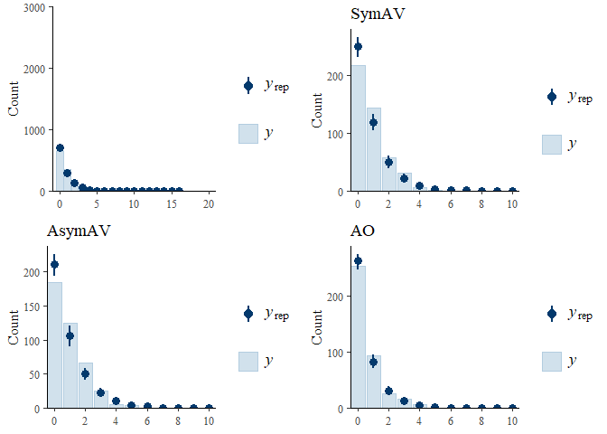<!-- -->

Although the model prediction is not perfect, this model had a higher
predictive power than the negative binomial model. As such, we will use
this model.

#### Back-transform the effects

``` r
### visibility effects
# draw samples
samples = as_draws_df(model)
alpha = samples$b_Intercept
beta_ao_asym = samples$b_conditionAO_Asym
beta_asym_sym = samples$b_conditionAsym_Sym

# convert the samples to the original scale
alpha_orig = exp(alpha)
ao_orig = exp(alpha - beta_ao_asym)
sym_orig = exp(alpha + + beta_asym_sym)
beta_ao_asym_orig = ao_orig - alpha_orig
beta_asym_sym_orig = sym_orig - alpha_orig

# summarize the mean and CI of the samples as dataframe
tibble(estimates = c("intercept_asym", "ao", "sym", "beta_ao_asym", "beta_asym_sym"),
       mean = c(mean(alpha_orig), mean(ao_orig), mean(sym_orig), 
                mean(beta_ao_asym_orig), mean(beta_asym_sym_orig)),
       ci_low = c(quantile(alpha_orig, 0.025), quantile(ao_orig, 0.025), 
                  quantile(sym_orig, 0.025), quantile(beta_ao_asym_orig, 0.025), 
                  quantile(beta_asym_sym_orig, 0.025)),
       ci_high = c(quantile(alpha_orig, 0.975), quantile(ao_orig, 0.975), 
                  quantile(sym_orig, 0.975), quantile(beta_ao_asym_orig, 0.975), 
                  quantile(beta_asym_sym_orig, 0.975)))
```

    ## # A tibble: 5 × 4
    ##   estimates         mean ci_low  ci_high
    ##   <chr>            <dbl>  <dbl>    <dbl>
    ## 1 intercept_asym  0.331   0.257  0.415  
    ## 2 ao              0.206   0.114  0.343  
    ## 3 sym             0.347   0.201  0.557  
    ## 4 beta_ao_asym   -0.125  -0.218 -0.00554
    ## 5 beta_asym_sym   0.0161 -0.119  0.206

<!-- <br> -->
<!-- #### Visualize the model estimates -->
<!-- ```{r} -->
<!-- plot(conditional_effects(model), ask=FALSE) -->
<!-- ``` -->

<br>

------------------------------------------------------------------------

### 8.4.2 Model 4: \[ppB\] condition_sum \* round + lex_align_c

Here, we will run another model to compare the rate of gestural
alignment between the SymAV and AO conditions.

<br>

#### Prior predictive check

``` r
nb_gest_align_prop_sum_prior = brm(num_gestural_align | rate(num_iconic_gestures) ~
                                     1 + condition_sum + round + lex_align_c + role +
                                     (1+round|pair) + (1|target),
                                   family = negbinomial(),
                                   prior = priors_rslope_gest_align_prop,
                                   data = df_gest_align_posreg_prop,
                                   sample_prior = "only",
                                   control = list(adapt_delta = 0.9, 
                                                  max_treedepth = 20),
                                   file = "models/speakerB/nb_gest_align_prop_sum_prior")

pp_check(nb_gest_align_prop_sum_prior, ndraws = 100, type = "bars") +
  coord_cartesian(xlim = c(0, 20),
                  ylim = c(0, 3000))
```

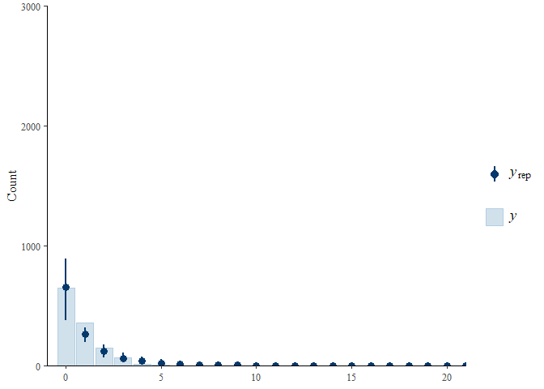<!-- -->

The prior predictive check shows that the model expects fewer amount of
2, 3, and 4. This suggests that the zero-inflation prior may be too
large or the mean for the intercept prior is too low. We will check the
prior-posterior update plot and posterior predictive check to see if the
model generates data that are similar to the observed data. If not, we
will consider modifying the priors.

<br>

#### Fit the model

``` r
nb_align_rate_cond_round_sum = brm(num_gestural_align | rate(num_iconic_gestures) ~ 
                                     1 + condition_sum * round + lex_align_c + role +
                                     (1+round|pair) + (1|target),
                                   family = negbinomial(),
                                   prior = priors_rslope_gest_align_prop,
                                   data = df_gest_align_posreg_prop,
                                   sample_prior = T,
                                   save_pars = save_pars(all = TRUE),
                                   warmup = nwu, iter = niter,
                                   control = list(adapt_delta = 0.9, 
                                                  max_treedepth = 15),
                                   file = "models/speakerB/nb_align_rate_cond_round_sum")

model = nb_align_rate_cond_round_sum
summary(model)
```

    ##  Family: negbinomial 
    ##   Links: mu = log; shape = identity 
    ## Formula: num_gestural_align | rate(num_iconic_gestures) ~ 1 + condition_sum * round + lex_align_c + role + (1 + round | pair) + (1 | target) 
    ##    Data: df_gest_align_posreg_prop (Number of observations: 1264) 
    ##   Draws: 4 chains, each with iter = 20000; warmup = 2000; thin = 1;
    ##          total post-warmup draws = 72000
    ## 
    ## Multilevel Hyperparameters:
    ## ~pair (Number of levels: 45) 
    ##                         Estimate Est.Error l-95% CI u-95% CI Rhat Bulk_ESS
    ## sd(Intercept)               0.65      0.11     0.46     0.89 1.00    20133
    ## sd(roundR12)                0.37      0.17     0.04     0.72 1.00    20020
    ## sd(roundR23)                0.11      0.08     0.00     0.31 1.00    34135
    ## sd(roundR34)                0.11      0.09     0.00     0.32 1.00    33498
    ## sd(roundR45)                0.17      0.12     0.01     0.45 1.00    29102
    ## sd(roundR56)                0.25      0.18     0.01     0.65 1.00    25173
    ## cor(Intercept,roundR12)     0.11      0.29    -0.47     0.64 1.00    69482
    ## cor(Intercept,roundR23)    -0.01      0.33    -0.64     0.62 1.00    93543
    ## cor(roundR12,roundR23)     -0.06      0.33    -0.66     0.59 1.00    72794
    ## cor(Intercept,roundR34)    -0.07      0.34    -0.69     0.59 1.00    93955
    ## cor(roundR12,roundR34)     -0.05      0.33    -0.66     0.59 1.00    73807
    ## cor(roundR23,roundR34)     -0.03      0.33    -0.66     0.61 1.00    65352
    ## cor(Intercept,roundR45)     0.02      0.33    -0.61     0.63 1.00   100701
    ## cor(roundR12,roundR45)      0.03      0.32    -0.60     0.64 1.00    69318
    ## cor(roundR23,roundR45)      0.00      0.33    -0.62     0.63 1.00    55490
    ## cor(roundR34,roundR45)     -0.03      0.33    -0.65     0.61 1.00    52700
    ## cor(Intercept,roundR56)    -0.08      0.33    -0.68     0.56 1.00    85654
    ## cor(roundR12,roundR56)     -0.01      0.32    -0.62     0.61 1.00    63761
    ## cor(roundR23,roundR56)     -0.02      0.33    -0.64     0.62 1.00    54273
    ## cor(roundR34,roundR56)     -0.01      0.33    -0.64     0.63 1.00    51739
    ## cor(roundR45,roundR56)     -0.02      0.33    -0.64     0.61 1.00    51362
    ##                         Tail_ESS
    ## sd(Intercept)              34892
    ## sd(roundR12)               19453
    ## sd(roundR23)               34420
    ## sd(roundR34)               33202
    ## sd(roundR45)               32548
    ## sd(roundR56)               30242
    ## cor(Intercept,roundR12)    52311
    ## cor(Intercept,roundR23)    55027
    ## cor(roundR12,roundR23)     56339
    ## cor(Intercept,roundR34)    51632
    ## cor(roundR12,roundR34)     54064
    ## cor(roundR23,roundR34)     57292
    ## cor(Intercept,roundR45)    55336
    ## cor(roundR12,roundR45)     54192
    ## cor(roundR23,roundR45)     55671
    ## cor(roundR34,roundR45)     56635
    ## cor(Intercept,roundR56)    54051
    ## cor(roundR12,roundR56)     55655
    ## cor(roundR23,roundR56)     56716
    ## cor(roundR34,roundR56)     59091
    ## cor(roundR45,roundR56)     57312
    ## 
    ## ~target (Number of levels: 16) 
    ##               Estimate Est.Error l-95% CI u-95% CI Rhat Bulk_ESS Tail_ESS
    ## sd(Intercept)     0.07      0.05     0.00     0.17 1.00    25716    27728
    ## 
    ## Regression Coefficients:
    ##                                Estimate Est.Error l-95% CI u-95% CI Rhat
    ## Intercept                         -1.11      0.12    -1.36    -0.88 1.00
    ## condition_sumAO_Sym                0.48      0.24    -0.01     0.95 1.00
    ## condition_sumAsym_Sym             -0.10      0.23    -0.56     0.36 1.00
    ## roundR12                           1.69      0.14     1.41     1.97 1.00
    ## roundR23                           0.37      0.09     0.18     0.55 1.00
    ## roundR34                          -0.00      0.11    -0.22     0.21 1.00
    ## roundR45                          -0.10      0.13    -0.36     0.16 1.00
    ## roundR56                          -0.15      0.17    -0.47     0.18 1.00
    ## lex_align_c                        0.05      0.03    -0.00     0.11 1.00
    ## role1                              0.76      0.10     0.57     0.95 1.00
    ## condition_sumAO_Sym:roundR12      -0.21      0.29    -0.78     0.37 1.00
    ## condition_sumAsym_Sym:roundR12    -0.11      0.26    -0.61     0.41 1.00
    ## condition_sumAO_Sym:roundR23       0.15      0.21    -0.25     0.57 1.00
    ## condition_sumAsym_Sym:roundR23     0.20      0.19    -0.18     0.57 1.00
    ## condition_sumAO_Sym:roundR34       0.02      0.23    -0.43     0.46 1.00
    ## condition_sumAsym_Sym:roundR34     0.08      0.21    -0.34     0.50 1.00
    ## condition_sumAO_Sym:roundR45       0.08      0.27    -0.44     0.60 1.00
    ## condition_sumAsym_Sym:roundR45    -0.09      0.24    -0.57     0.39 1.00
    ## condition_sumAO_Sym:roundR56       0.41      0.33    -0.24     1.05 1.00
    ## condition_sumAsym_Sym:roundR56    -0.06      0.28    -0.62     0.49 1.00
    ##                                Bulk_ESS Tail_ESS
    ## Intercept                         17891    33150
    ## condition_sumAO_Sym               18128    31916
    ## condition_sumAsym_Sym             15984    29275
    ## roundR12                          60269    52721
    ## roundR23                          68573    57116
    ## roundR34                          64296    56352
    ## roundR45                          63043    56515
    ## roundR56                          62677    53499
    ## lex_align_c                       81773    56619
    ## role1                            102399    54135
    ## condition_sumAO_Sym:roundR12      59957    53532
    ## condition_sumAsym_Sym:roundR12    61536    54591
    ## condition_sumAO_Sym:roundR23      65983    56053
    ## condition_sumAsym_Sym:roundR23    65743    55998
    ## condition_sumAO_Sym:roundR34      61413    55727
    ## condition_sumAsym_Sym:roundR34    61294    56291
    ## condition_sumAO_Sym:roundR45      63529    54058
    ## condition_sumAsym_Sym:roundR45    64047    56071
    ## condition_sumAO_Sym:roundR56      68951    56265
    ## condition_sumAsym_Sym:roundR56    74675    54323
    ## 
    ## Further Distributional Parameters:
    ##       Estimate Est.Error l-95% CI u-95% CI Rhat Bulk_ESS Tail_ESS
    ## shape    67.35     28.95    22.99   133.91 1.00   112593    50071
    ## 
    ## Draws were sampled using sample(hmc). For each parameter, Bulk_ESS
    ## and Tail_ESS are effective sample size measures, and Rhat is the potential
    ## scale reduction factor on split chains (at convergence, Rhat = 1).

``` r
bayestestR::hdi(model)
```

    ## Highest Density Interval
    ## 
    ## Parameter                      |        95% HDI
    ## -----------------------------------------------
    ## (Intercept)                    | [-1.35, -0.87]
    ## condition_sumAO_Sym            | [-0.01,  0.95]
    ## condition_sumAsym_Sym          | [-0.56,  0.36]
    ## roundR12                       | [ 1.41,  1.97]
    ## roundR23                       | [ 0.18,  0.56]
    ## roundR34                       | [-0.22,  0.20]
    ## roundR45                       | [-0.37,  0.15]
    ## roundR56                       | [-0.47,  0.18]
    ## lex_align_c                    | [ 0.00,  0.11]
    ## role1                          | [ 0.56,  0.95]
    ## condition_sumAO_Sym:roundR12   | [-0.79,  0.36]
    ## condition_sumAsym_Sym:roundR12 | [-0.60,  0.41]
    ## condition_sumAO_Sym:roundR23   | [-0.25,  0.57]
    ## condition_sumAsym_Sym:roundR23 | [-0.18,  0.57]
    ## condition_sumAO_Sym:roundR34   | [-0.42,  0.47]
    ## condition_sumAsym_Sym:roundR34 | [-0.34,  0.50]
    ## condition_sumAO_Sym:roundR45   | [-0.44,  0.60]
    ## condition_sumAsym_Sym:roundR45 | [-0.56,  0.39]
    ## condition_sumAO_Sym:roundR56   | [-0.23,  1.05]
    ## condition_sumAsym_Sym:roundR56 | [-0.62,  0.49]

``` r
# bayestestR::hdi(model, ci = 0.89)
```

The coefficients show that the proportion of gestural alignment was
significantly higher in the SymAV condition than in the AO condition.
Also, the rate of gestural alignment significantly increased from R1–R2
and R2–R3 and stabilized afterwards.

<br>

#### Visualize posterior distributions

``` r
main_model = nb_align_rate_cond_round
model1 = zinb_align_cond_round
plot_posterior(main_model, model1, model)
```

<!-- -->

<br>

#### Hypothesis testing: Bayes factor

``` r
### varying priors for sensitivity analysis
prior_size = c("xs", "s", "l", "xl")
prior_sd = c(0.1, 0.3, 0.7, 1)
bfs_cond_ao_sym = c()
bfs_ao_sym_round12 = c()
bfs_ao_sym_round23 = c()
bfs_ao_sym_round34 = c()
bfs_ao_sym_round45 = c()
bfs_ao_sym_round56 = c()


for (i in 1:length(prior_sd)){
  priors = c(
    prior(normal(-1.39, 0.5), class = Intercept),
    set_prior(paste0("normal(0,", prior_sd[i], ")"), class = "b"),
    prior(normal(0, 0.5), class = sd),
    prior(lkj(2), class = cor),
    prior(normal(0, 50), class = shape))
  
  fname = paste0("models/speakerB/nb_align_rate_cond_round_sum_", prior_size[i])
  
  fit = brm(num_gestural_align | rate(num_iconic_gestures) ~ 
              1 + condition_sum * round + lex_align_c + role +
              (1+round|pair) + (1|target),
            family = negbinomial(),
            prior = priors,
            data = df_gest_align_posreg_prop,
            sample_prior = T,
            save_pars = save_pars(all = TRUE),
            warmup = nwu, iter = niter,
            control = list(adapt_delta = 0.9, 
                           max_treedepth = 15),
            file = fname)
  
  ### BF for visibility conditions
  # BF for ao - sym
  h = hypothesis(fit, "condition_sumAO_Sym = 0")
  bf = 1 / abs(h$hypothesis$Evid.Ratio)
  bfs_cond_ao_sym = c(bfs_cond_ao_sym, bf)
  
  ### BF for interaction
  # ao - sym: R1 - R2
  h = hypothesis(model, "condition_sumAO_Sym:roundR12 = 0")
  bf = 1 / abs(h$hypothesis$Evid.Ratio)
  bfs_ao_sym_round12 = c(bfs_ao_sym_round12, bf)
  
  # ao - sym: R2 - R3
  h = hypothesis(model, "condition_sumAO_Sym:roundR23 = 0")
  bf = 1 / abs(h$hypothesis$Evid.Ratio)
  bfs_ao_sym_round23 = c(bfs_ao_sym_round23, bf)
  
  # ao - sym: R3 - R4
  h = hypothesis(model, "condition_sumAO_Sym:roundR34 = 0")
  bf = 1 / abs(h$hypothesis$Evid.Ratio)
  bfs_ao_sym_round34 = c(bfs_ao_sym_round34, bf)
  
  # ao - sym: R4 - R5
  h = hypothesis(model, "condition_sumAO_Sym:roundR45 = 0")
  bf = 1 / abs(h$hypothesis$Evid.Ratio)
  bfs_ao_sym_round45 = c(bfs_ao_sym_round45, bf)
  
  # ao - sym: R5 - R6
  h = hypothesis(model, "condition_sumAO_Sym:roundR56 = 0")
  bf = 1 / abs(h$hypothesis$Evid.Ratio)
  bfs_ao_sym_round56 = c(bfs_ao_sym_round56, bf)
}

### add BF for the main/medium model
prior_size[3:5] = c("m", prior_size[3:4])
prior_sd[3:5] = c(0.5, prior_sd[3:4])

### BF for visibility conditions
# ao - sym
h = hypothesis(model, "condition_sumAO_Sym = 0")
bf = 1 / abs(h$hypothesis$Evid.Ratio)
bfs_cond_ao_sym[3:5] = c(bf, bfs_cond_ao_sym[3:4])

### BF for interaction
# ao - sym: R1 - R2
h = hypothesis(model, "condition_sumAO_Sym:roundR12 = 0")
bf = 1 / abs(h$hypothesis$Evid.Ratio)
bfs_ao_sym_round12[3:5] = c(bf, bfs_ao_sym_round12[3:4])

# ao - sym: R2 - R3
h = hypothesis(model, "condition_sumAO_Sym:roundR23 = 0")
bf = 1 / abs(h$hypothesis$Evid.Ratio)
bfs_ao_sym_round23[3:5] = c(bf, bfs_ao_sym_round23[3:4])

# ao - sym: R3 - R4
h = hypothesis(model, "condition_sumAO_Sym:roundR34 = 0")
bf = 1 / abs(h$hypothesis$Evid.Ratio)
bfs_ao_sym_round34[3:5] = c(bf, bfs_ao_sym_round34[3:4])

# ao - sym: R4 - R5
h = hypothesis(model, "condition_sumAO_Sym:roundR45 = 0")
bf = 1 / abs(h$hypothesis$Evid.Ratio)
bfs_ao_sym_round45[3:5] = c(bf, bfs_ao_sym_round45[3:4])

# ao - sym: R5 - R6
h = hypothesis(model, "condition_sumAO_Sym:roundR56 = 0")
bf = 1 / abs(h$hypothesis$Evid.Ratio)
bfs_ao_sym_round56[3:5] = c(bf, bfs_ao_sym_round56[3:4])


### make a df for BFs
# df_bf_temp = data.frame(size = prior_size,
#                         sd = prior_sd,
#                         Effect = "AO--SymAV",
#                         BF10 = bfs_cond_ao_sym) %>% 
#   mutate(prior = paste0("N(0, ", sd, ")"),
#          Predictor = "Visibility")

df_bf_temp = data.frame(size = prior_size,
                   sd = prior_sd,
                   ao_sym = bfs_cond_ao_sym,
                   ao_sym_round12 = bfs_ao_sym_round12,
                   ao_sym_round23 = bfs_ao_sym_round23,
                   ao_sym_round34 = bfs_ao_sym_round34,
                   ao_sym_round45 = bfs_ao_sym_round45,
                   ao_sym_round56 = bfs_ao_sym_round56) %>% 
  mutate(prior = paste0("N(0, ", sd, ")")) %>% 
  pivot_longer(cols = c("ao_sym", 
                        "ao_sym_round12", "ao_sym_round23", "ao_sym_round34",
                        "ao_sym_round45", "ao_sym_round56"),
               names_to = "Effect",
               values_to = "BF10") %>% 
  mutate(Predictor = ifelse(grepl("_round", Effect), "Interaction", "Visibility"))

df_bf_temp$Effect = recode(df_bf_temp$Effect,
                      ao_sym = "AO--SymAV",
                      ao_sym_round12 = "AO--SymAV:R1--R2",
                      ao_sym_round23 = "AO--SymAV:R2--R3",
                      ao_sym_round34 = "AO--SymAV:R3--R4",
                      ao_sym_round45 = "AO--SymAV:R4--R5",
                      ao_sym_round56 = "AO--SymAV:R5--R6")

df_bf_new = df_bf %>% 
  filter(Effect != "N. lex align") %>% 
  rbind(df_bf_temp) %>% 
  rbind(df_bf_lex) %>% 
  filter(!(Predictor == "N. lex align" & Effect != "N. lex align")) %>% 
  mutate(Effect = factor(Effect,
                         levels = c("AO--SymAV", "AO--AsymAV", "AsymAV--SymAV", 
                                    "R1--R2", "R2--R3", "R3--R4", "R4--R5", "R5--R6",
                                    "N. lex align",
                                    "AO--SymAV:R1--R2", "AO--SymAV:R2--R3", "AO--SymAV:R3--R4",
                                    "AO--SymAV:R4--R5", "AO--SymAV:R5--R6",
                                    "AO--AsymAV:R1--R2", "AO--AsymAV:R2--R3", "AO--AsymAV:R3--R4",
                                    "AO--AsymAV:R4--R5", "AO--AsymAV:R5--R6",
                                    "AsymAV--SymAV:R1--R2", "AsymAV--SymAV:R2--R3", "AsymAV--SymAV:R3--R4",
                                    "AsymAV--SymAV:R4--R5", "AsymAV--SymAV:R5--R6")),
         Predictor = factor(Predictor,
                            levels = c("Visibility", "Round", "N. lex align", "Interaction")))

df_bf_new %>% arrange(Effect, sd)
```

    ## # A tibble: 120 × 6
    ##    size     sd prior     Effect      BF10 Predictor 
    ##    <chr> <dbl> <chr>     <fct>      <dbl> <fct>     
    ##  1 xs      0.1 N(0, 0.1) AO--SymAV   1.29 Visibility
    ##  2 s       0.3 N(0, 0.3) AO--SymAV   2.92 Visibility
    ##  3 m       0.5 N(0, 0.5) AO--SymAV   3.21 Visibility
    ##  4 l       0.7 N(0, 0.7) AO--SymAV   2.98 Visibility
    ##  5 xl      1   N(0, 1)   AO--SymAV   2.79 Visibility
    ##  6 xs      0.1 N(0, 0.1) AO--AsymAV  1.36 Visibility
    ##  7 s       0.3 N(0, 0.3) AO--AsymAV  3.05 Visibility
    ##  8 m       0.5 N(0, 0.5) AO--AsymAV  4.06 Visibility
    ##  9 l       0.7 N(0, 0.7) AO--AsymAV  3.93 Visibility
    ## 10 xl      1   N(0, 1)   AO--AsymAV  3.68 Visibility
    ## # ℹ 110 more rows

``` r
#### Plot BFs ####
ggplot(
  filter(df_bf_new, 
         Effect != "R1--R2", Predictor != "N. lex align", #exclude effects/predictors where BF is too large
         Predictor != "Interaction"), #exclude interactions
  aes(x = factor(sd), y = BF10, group = Effect)) +
  geom_hline(yintercept = 1, linetype="dashed") +
  geom_point(aes(color=Effect)) +
  geom_line(aes(color=Effect)) +
  facet_wrap(vars(Predictor), scales = "free_x") +
  theme_clean(base_size = 15) +
  theme(axis.text.x = element_text(colour = "black", size = 14),
        axis.text.y = element_text(colour = "black", size = 14),
        axis.title = element_text(size = 15, face = 'bold'),
        axis.title.x = element_text(vjust = -2),
        axis.title.y = element_text(vjust = 2),
        # legend.position = "top",
        legend.title=element_text(size=14), 
        legend.text=element_text(size=13),
        strip.text = element_text(size = 15, face = 'bold'),
        plot.background = element_blank(),
        plot.margin = unit(c(1.1,1.1,1.1,1.1), "lines")) +
  scale_y_log10("Bayes factor (BF10)",
                breaks = c(0.001, 0.03, 0.01, 0.1, 0.33, 1, 3, 10, 30, 100),
                labels = c(0.001, 0.03, 0.01, 0.1, 0.33, 1, 3, 10, 30, 100)) +
  xlab("SD for the prior")
```

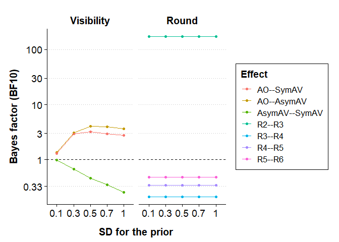<!-- -->

<br>

#### Probability of direction

``` r
p_direction(model)
```

    ## Probability of Direction
    ## 
    ## Parameter                      |     pd
    ## ---------------------------------------
    ## (Intercept)                    |   100%
    ## condition_sumAO_Sym            | 97.22%
    ## condition_sumAsym_Sym          | 65.74%
    ## roundR12                       |   100%
    ## roundR23                       | 99.99%
    ## roundR34                       | 51.22%
    ## roundR45                       | 78.19%
    ## roundR56                       | 81.48%
    ## lex_align_c                    | 97.11%
    ## role1                          |   100%
    ## condition_sumAO_Sym:roundR12   | 76.88%
    ## condition_sumAsym_Sym:roundR12 | 66.46%
    ## condition_sumAO_Sym:roundR23   | 76.98%
    ## condition_sumAsym_Sym:roundR23 | 84.79%
    ## condition_sumAO_Sym:roundR34   | 52.70%
    ## condition_sumAsym_Sym:roundR34 | 64.74%
    ## condition_sumAO_Sym:roundR45   | 61.30%
    ## condition_sumAsym_Sym:roundR45 | 64.53%
    ## condition_sumAO_Sym:roundR56   | 89.47%
    ## condition_sumAsym_Sym:roundR56 | 58.38%

<br>

#### Prior-posterior update plot

``` r
post_sample = as_draws_df(model)
pp_update_plot(post_sample, model_type="nb")
```

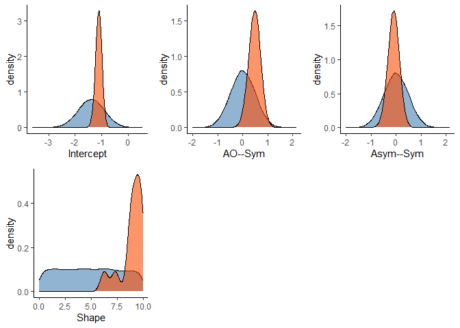<!-- -->

<br>

#### Posterior predictive check

``` r
pp_check_overall = pp_check(model, ndraws = 100, type = "bars") +
  coord_cartesian(xlim = c(0, 20),
                  ylim = c(0, 3000))
pp_check_sym = pp_check_each_condition(model, df_gest_align_posreg_prop, "SymAV")
pp_check_asym = pp_check_each_condition(model, df_gest_align_posreg_prop, "AsymAV")
pp_check_ao = pp_check_each_condition(model, df_gest_align_posreg_prop, "AO")

gridExtra::grid.arrange(pp_check_overall, pp_check_sym, 
                        pp_check_asym, pp_check_ao, 
                        ncol = 2)
```

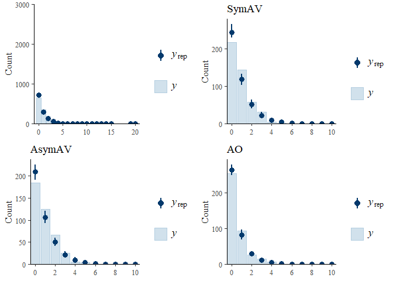<!-- -->

Although the model prediction is not perfect, this model had a higher
predictive power than the negative binomial model. As such, we will use
this model.

<!-- <br> -->
<!-- #### Visualize the model estimates -->
<!-- ```{r} -->
<!-- plot(conditional_effects(model), ask=FALSE) -->
<!-- ``` -->

<br>

------------------------------------------------------------------------

# 9. Correlation btw lexical and gestural alignment

``` r
cor = pcor.test(df_trial_info$lex_align_c, df_trial_info$num_gestural_align, df_trial_info$log_round_c)
cor
```

    ##   estimate   p.value statistic    n gp  Method
    ## 1    0.328 1.89e-108      22.8 4315  1 pearson

<br>

------------------------------------------------------------------------

# =====Session info=====

``` r
sessionInfo()
```

    ## R version 4.2.2 (2022-10-31 ucrt)
    ## Platform: x86_64-w64-mingw32/x64 (64-bit)
    ## Running under: Windows 10 x64 (build 26200)
    ## 
    ## Matrix products: default
    ## 
    ## locale:
    ## [1] LC_COLLATE=English_United States.utf8 
    ## [2] LC_CTYPE=English_United States.utf8   
    ## [3] LC_MONETARY=English_United States.utf8
    ## [4] LC_NUMERIC=C                          
    ## [5] LC_TIME=English_United States.utf8    
    ## 
    ## attached base packages:
    ## [1] parallel  stats     graphics  grDevices utils     datasets  methods  
    ## [8] base     
    ## 
    ## other attached packages:
    ##  [1] rstan_2.32.6       StanHeaders_2.32.7 svglite_2.2.2      ppcor_1.1         
    ##  [5] MASS_7.3-58.1      doParallel_1.0.17  iterators_1.0.14   foreach_1.5.2     
    ##  [9] emmeans_1.10.7     tidybayes_3.0.7    bayestestR_0.15.2  brms_2.22.0       
    ## [13] Rcpp_1.0.12        plotly_4.10.4      rsvg_2.6.2         DiagrammeRsvg_0.1 
    ## [17] DiagrammeR_1.0.11  dagitty_0.3-4      ggh4x_0.3.1        ggthemes_5.1.0    
    ## [21] hypr_0.2.8         plotrix_3.8-4      lubridate_1.9.3    forcats_1.0.0     
    ## [25] stringr_1.5.1      dplyr_1.1.4        purrr_1.0.2        readr_2.1.5       
    ## [29] tidyr_1.3.1        tibble_3.2.1       ggplot2_3.5.2      tidyverse_2.0.0   
    ## 
    ## loaded via a namespace (and not attached):
    ##  [1] colorspace_2.1-0     estimability_1.5.1   QuickJSR_1.1.3      
    ##  [4] rstudioapi_0.17.1    farver_2.1.1         svUnit_1.0.6        
    ##  [7] bit64_4.0.5          mvtnorm_1.2-4        bridgesampling_1.1-2
    ## [10] codetools_0.2-18     knitr_1.50           bayesplot_1.11.1    
    ## [13] jsonlite_1.8.8       ggdist_3.3.2         compiler_4.2.2      
    ## [16] httr_1.4.7           backports_1.4.1      Matrix_1.5-1        
    ## [19] fastmap_1.1.1        lazyeval_0.2.2       cli_3.6.2           
    ## [22] visNetwork_2.1.2     htmltools_0.5.8.1    tools_4.2.2         
    ## [25] coda_0.19-4.1        gtable_0.3.6         glue_1.7.0          
    ## [28] reshape2_1.4.4       posterior_1.6.1      V8_6.0.6            
    ## [31] vctrs_0.6.5          nlme_3.1-160         crosstalk_1.2.1     
    ## [34] insight_1.1.0        tensorA_0.36.2.1     xfun_0.53           
    ## [37] ps_1.7.6             timechange_0.3.0     lifecycle_1.0.4     
    ## [40] scales_1.3.0         vroom_1.6.5          ragg_1.3.0          
    ## [43] hms_1.1.3            Brobdingnag_1.2-9    inline_0.3.21       
    ## [46] RColorBrewer_1.1-3   yaml_2.3.8           curl_6.2.1          
    ## [49] gridExtra_2.3        loo_2.8.0            stringi_1.8.3       
    ## [52] checkmate_2.3.1      pkgbuild_1.4.6       boot_1.3-28         
    ## [55] cmdstanr_0.8.1       rlang_1.1.3          pkgconfig_2.0.3     
    ## [58] systemfonts_1.3.1    matrixStats_1.3.0    distributional_0.5.0
    ## [61] pracma_2.4.4         evaluate_1.0.3       lattice_0.20-45     
    ## [64] rstantools_2.4.0     htmlwidgets_1.6.4    labeling_0.4.3      
    ## [67] processx_3.8.4       bit_4.0.5            tidyselect_1.2.1    
    ## [70] plyr_1.8.9           magrittr_2.0.3       R6_2.6.1            
    ## [73] generics_0.1.3       pillar_1.10.1        withr_3.0.2         
    ## [76] datawizard_1.0.1     abind_1.4-8          crayon_1.5.3        
    ## [79] arrayhelpers_1.1-0   utf8_1.2.4           tzdb_0.4.0          
    ## [82] rmarkdown_2.29       grid_4.2.2           data.table_1.15.4   
    ## [85] digest_0.6.35        webshot_0.5.5        xtable_1.8-4        
    ## [88] textshaping_0.3.7    stats4_4.2.2         RcppParallel_5.1.7  
    ## [91] munsell_0.5.1        viridisLite_0.4.2
