gestural_alignment_rate
================
Last updated: 2026-02-16

``` r
pckgs <- c("plotly", "parallelly", "tidyverse", "plotrix", "hypr", 
           "ggthemes", "RColorBrewer", "ggh4x", "dagitty", "DiagrammeR", "patchwork",
           "DiagrammeRsvg", "rsvg", "brms", "bayestestR", "tidybayes",
           "marginaleffects", "emmeans", "doParallel", "ppcor", "svglite")
pacman::p_load(pckgs, character.only = TRUE)


### Set global options
options(digits = 3) # set the default number of digits to 3
cores = ifelse(availableCores() < 4, 4L, availableCores())
options(mc.cores = cores)
options(brms.backend = "cmdstanr")  #this will speed up the model fitting

### MCMC options
niter = 20000  #number of iterations
nwu = 2000 #number of warmups

### Rmd settings
knitr::opts_chunk$set(echo=TRUE, warning=FALSE, message=FALSE, fig.path="figures_md/speakerB/gest_alignment/")
```

``` r
########### posterior_beta ############
posterior_beta <- function(model, round_int=TRUE, lex_int=FALSE){
  # check if the model uses round_c or round
  round_term = ifelse("round_c" %in% names(model$data), "round_c", 
                      ifelse("round" %in% names(model$data), "round", NA))
  
  # check if the model includes lex_align_c
  lex = ifelse("lex_align_c" %in% names(model$data), T, F)
  
  ### define columns to select based on the model specification
  select_cols = c("b_Intercept", 
                  "b_conditionAO_Asym", "b_conditionAsym_Sym", "ao_sym")
  if (round_term == "round_c") {
    select_cols = c(select_cols, c("b_round_c"))
    if (round_int == TRUE){
      select_cols = c(select_cols, "ao_sym:round_c",
                      "b_conditionAO_Asym:round_c", "b_conditionAsym_Sym:round_c")
    }
  } else if (round_term == "round") {
    select_cols = c(select_cols,
                    c("b_roundR12", "b_roundR23", "b_roundR34", 
                      "b_roundR45", "b_roundR56"))
    if (round_int == TRUE){
      select_cols = c(select_cols,
                      "b_conditionAO_Asym:roundR12", "b_conditionAO_Asym:roundR23",
                      "b_conditionAO_Asym:roundR34", "b_conditionAO_Asym:roundR45",
                      "b_conditionAO_Asym:roundR56",
                      "b_conditionAsym_Sym:roundR12", "b_conditionAsym_Sym:roundR23",
                      "b_conditionAsym_Sym:roundR34", "b_conditionAsym_Sym:roundR45",
                      "b_conditionAsym_Sym:roundR56",
                      "ao_sym:roundR12", "ao_sym:roundR23", "ao_sym:roundR34",
                      "ao_sym:roundR45", "ao_sym:roundR56")
    }
  }
    
  # add b_lex_align_c if lex is True
  select_cols = if (lex) c(select_cols, "b_lex_align_c") else select_cols
  select_cols = if (lex & lex_int) c(select_cols, "b_lex_align_c:conditionAO_Asym", 
                                      "b_lex_align_c:conditionAsym_Sym", 
                                      "lex_align_c:ao_sym") else select_cols
  
  
  ### extract the posterior draws
  posterior_beta = model %>% 
    spread_draws(`b_.*`, regex = TRUE) %>% 
    mutate(ao_sym = b_conditionAO_Asym + b_conditionAsym_Sym)
  
  if (round_term == "round_c" & round_int == TRUE) {
    posterior_beta = posterior_beta %>% 
      mutate(`ao_sym:round_c` = `b_conditionAO_Asym:round_c` + `b_conditionAsym_Sym:round_c`)
    
  } else if (round_term == "round" & round_int == TRUE) {
    posterior_beta = posterior_beta %>% 
      mutate(`ao_sym:roundR12` = `b_conditionAO_Asym:roundR12` + `b_conditionAsym_Sym:roundR12`,
             `ao_sym:roundR23` = `b_conditionAO_Asym:roundR23` + `b_conditionAsym_Sym:roundR23`,
             `ao_sym:roundR34` = `b_conditionAO_Asym:roundR34` + `b_conditionAsym_Sym:roundR34`,
             `ao_sym:roundR45` = `b_conditionAO_Asym:roundR45` + `b_conditionAsym_Sym:roundR45`,
             `ao_sym:roundR56` = `b_conditionAO_Asym:roundR56` + `b_conditionAsym_Sym:roundR56`)
  }
  
  if (lex & lex_int) {
    posterior_beta = posterior_beta %>% 
      mutate(`lex_align_c:ao_sym` = `b_lex_align_c:conditionAO_Asym` + `b_lex_align_c:conditionAsym_Sym`)
  }
  
  posterior_beta = posterior_beta %>%
    pivot_longer(
      cols = select_cols,
      names_to = ".variable",
      values_to = ".value") %>% 
    mutate(component = case_when(str_detect(.variable, ":") ~ "Interaction",
                                 str_detect(.variable, "round") ~ "Round",
                                 str_detect(.variable, "Intercept") ~ "Intercept",
                                 str_detect(.variable, "lex_align") ~ "N. lex align",
                                 .default = "Visibility"))
  
  ### recode variable names and set factor levels
  fct_levels = c("Intercept",
                 "AO--AsymAV", "AsymAV--SymAV", "AO--SymAV",
                 "Round", "Centered log(round)",
                 "R1--R2", "R2--R3", "R3--R4", "R4--R5", "R5--R6",
                 "Round: AO--AsymAV", "Round: AsymAV--SymAV", "Round: AO--SymAV",
                 "AO--AsymAV:R1--R2", "AO--AsymAV:R2--R3", "AO--AsymAV:R3--R4", 
                 "AO--AsymAV:R4--R5", "AO--AsymAV:R5--R6",
                 "AsymAV--SymAV:R1--R2", "AsymAV--SymAV:R2--R3", "AsymAV--SymAV:R3--R4",
                 "AsymAV--SymAV:R4--R5", "AsymAV--SymAV:R5--R6",
                 "AO--SymAV:R1--R2", "AO--SymAV:R2--R3", "AO--SymAV:R3--R4",
                 "AO--SymAV:R4--R5", "AO--SymAV:R5--R6",
                 "N. lex align", "AO--AsymAV:\n N. lex align", 
                 "AsymAV--SymAV:\n N. lex align", "AO--SymAV:\n N. lex align")
  
  posterior_beta = posterior_beta %>% 
    mutate(.variable = recode(.variable, 
                              "b_Intercept" = "Intercept",
                              "b_conditionAO_Asym" = "AO--AsymAV",
                              "b_conditionAsym_Sym" = "AsymAV--SymAV",
                              "ao_sym" = "AO--SymAV",
                              "b_round_c" = "Round",
                              "b_roundR12" = "R1--R2",
                              "b_roundR23" = "R2--R3",
                              "b_roundR34" = "R3--R4",
                              "b_roundR45" = "R4--R5",
                              "b_roundR56" = "R5--R6",
                              "b_lex_align_c" = "N. lex align",
                              "b_conditionAO_Asym:round_c" = "Round: AO--AsymAV",
                              "b_conditionAsym_Sym:round_c" = "Round: AsymAV--SymAV",
                              "ao_sym:round_c" = "Round: AO--SymAV",
                              "b_conditionAO_Asym:roundR12" = "AO--AsymAV:R1--R2",
                              "b_conditionAO_Asym:roundR23" = "AO--AsymAV:R2--R3",
                              "b_conditionAO_Asym:roundR34" = "AO--AsymAV:R3--R4",
                              "b_conditionAO_Asym:roundR45" = "AO--AsymAV:R4--R5",
                              "b_conditionAO_Asym:roundR56" = "AO--AsymAV:R5--R6",
                              "b_conditionAsym_Sym:roundR12" = "AsymAV--SymAV:R1--R2",
                              "b_conditionAsym_Sym:roundR23" = "AsymAV--SymAV:R2--R3",
                              "b_conditionAsym_Sym:roundR34" = "AsymAV--SymAV:R3--R4",
                              "b_conditionAsym_Sym:roundR45" = "AsymAV--SymAV:R4--R5",
                              "b_conditionAsym_Sym:roundR56" = "AsymAV--SymAV:R5--R6",
                              "ao_sym:roundR12" = "AO--SymAV:R1--R2",
                              "ao_sym:roundR23" = "AO--SymAV:R2--R3",
                              "ao_sym:roundR34" = "AO--SymAV:R3--R4",
                              "ao_sym:roundR45" = "AO--SymAV:R4--R5",
                              "ao_sym:roundR56" = "AO--SymAV:R5--R6",
                              "b_lex_align_c:conditionAO_Asym" = "AO--AsymAV:\n N. lex align",
                              "b_lex_align_c:conditionAsym_Sym" = "AsymAV--SymAV:\n N. lex align",
                              "lex_align_c:ao_sym" = "AO--SymAV:\n N. lex align"),
           .variable = factor(.variable,
                              levels = fct_levels),
           component = factor(component, 
                              levels = c("Intercept", "Visibility", "Round", 
                                         "Interaction", "N. lex align")))
  return(posterior_beta)
}


########### plot_posterior ############
plot_posterior <- function(df_post_beta, interaction=FALSE, include_intercept=FALSE,
                           x_lab = "Coefficient", y_lab = "Effect", title_lab = "",
                           xlim_cond=1.5, xlim_round=2, xlim_lex=0.4, ncol_wrap=1){
  ### change variables if only main effects are plotted
  if (interaction == F) {
    # df_post_beta = filter(df_post_beta, !str_detect(.variable, ":"))}
    df_post_beta = filter(df_post_beta, component != "Interaction")}
  
  fill_manual_values = c("steelblue", "steelblue", "steelblue", "steelblue")
  space_option = ifelse(ncol_wrap == 1, "free_y", "fixed")
  
  ### plot the posterior distributions
  p_posterior = ggplot(filter(df_post_beta, component != "Intercept"),
                       aes(x = .value, y = fct_rev(.variable),
                           fill = component)) +
    geom_vline(xintercept = 0, size = 1) +
    stat_halfeye(aes(slab_alpha = intercept),
                 normalize = "panels",
                 slab_alpha = 0.5,
                 .width = c(0.89, 0.95),
                 point_interval = "median_hdi") +
    scale_fill_manual(values = fill_manual_values) +
    scale_slab_alpha_discrete(range = c(0.8, 0.4)) +
    guides(fill = "none", slab_alpha = "none") +
    labs(x = x_lab, y = y_lab, title=title_lab) +
    theme_clean(base_size = 15) +
    theme(axis.text.x = element_text(colour = "black", size = 14),
          axis.text.y = element_text(colour = "black", size = 14),
          axis.title = element_text(size = 13, face = 'bold'),
          axis.title.x = element_text(vjust = -2),
          axis.title.y = element_text(vjust = 2),
          legend.position = "none",
          strip.text = element_text(size = 14, face = 'bold'),
          strip.background = element_blank(),
          plot.title.position = "plot",
          panel.grid.major.x = element_line(color = "grey90",
                                            linetype = "solid",
                                            size = 0.5),
          panel.grid.major.y = element_line(color = "grey90",
                                            linetype = "solid",
                                            size = 0.5),
          plot.background = element_blank(),
          plot.margin = unit(c(1.1,1.1,1.1,1.1), "lines")) +
    facet_wrap(vars(component), ncol = ncol_wrap,
               scales = "free", space = space_option) +
    facetted_pos_scales(
      x = list(
        scale_x_continuous(limits = c(-xlim_cond, xlim_cond)),
        scale_x_continuous(limits = c(-xlim_round, xlim_round)),
        scale_x_continuous(limits = c(-xlim_lex, xlim_lex))
      ))
  
  return(p_posterior)
}


########### pp_update_plot ############
pp_update_plot <- function(post_sample, model_type="nb", interaction=TRUE, 
                           fam_par = TRUE, ncol=3, return_grob=FALSE){
  round_bd = ifelse("b_roundR12" %in% colnames(post_sample), T, F)
  lex_align = ifelse("lex_align" %in% colnames(post_sample), T, F)
  
  # define fill colors manually
  post_sample_temp = post_sample %>% 
    pivot_longer(cols = everything(), names_to = "parameter", values_to = "value") %>% 
    filter(parameter %in% c("b_Intercept", "prior_Intercept")) %>%
    mutate(parameter = factor(parameter, 
                              levels = c("prior_Intercept", "b_Intercept"),
                              labels = c("prior", "posterior")))
  
  ### Intercept
  mean_post = mean(post_sample$b_Intercept)
  intercept = ggplot(post_sample_temp) +
    geom_density(aes(value, fill=parameter), color="black",alpha=0.6) +
    # geom_density(aes(b_Intercept, fill="#FC4E07"), color="black",alpha=0.6) + 
    geom_vline(aes(xintercept = mean_post), linetype = "dashed") +
    scale_fill_manual(values = c("steelblue", "#FC4E07")) +
    labs(x = 'Intercept', fill = '') +
    theme_classic()
  
  ### Visibility condition
  cond1 = ggplot(post_sample) +
    geom_density(aes(prior_b), fill="steelblue", color="black",alpha=0.6) +
    geom_density(aes(b_conditionAO_Asym), fill="#FC4E07", color="black",alpha=0.6) +
    stat_summary(aes(x = b_conditionAO_Asym, xintercept = ..x.., y = 0), 
                 fun = mean, geom = "vline", linetype = "dashed", orientation = "y") +
    labs(x = 'AO--AsymAV', y = "density") +
    theme_classic()
  cond2 = ggplot(post_sample) +
    geom_density(aes(prior_b), fill="steelblue", color="black",alpha=0.6) +
    geom_density(aes(b_conditionAsym_Sym), fill="#FC4E07", color="black",alpha=0.6) +
    stat_summary(aes(x = b_conditionAsym_Sym, xintercept = ..x.., y = 0), 
                 fun = mean, geom = "vline", linetype = "dashed", orientation = "y") +
    labs(x = 'AsymAV--SymAV', y = "density") +
    theme_classic()
  cond3 = ggplot(post_sample) +
    geom_density(aes(prior_b), fill="steelblue", color="black",alpha=0.6) +
    geom_density(aes(ao_sym), fill="#FC4E07", color="black",alpha=0.6) + 
    stat_summary(aes(x = ao_sym, xintercept = ..x.., y = 0), 
                 fun = mean, geom = "vline", linetype = "dashed", orientation = "y") +
    labs(x = 'AO--SymAV', y = "density") +
    theme_classic()
  
  ### Lex align
  if (lex_align) {
    lex = ggplot(post_sample) +
      geom_density(aes(prior_lex_align), fill="steelblue", color="black",alpha=0.6) +
      geom_density(aes(lex_align), fill="#FC4E07", color="black",alpha=0.6) + 
      stat_summary(aes(x = lex_align, xintercept = ..x.., y = 0), 
                 fun = mean, geom = "vline", linetype = "dashed", orientation = "y") +
      labs(x = 'N. lex align', y = "density") +
      # scale_x_continuous(limits = c(-1, 1),
      #                    breaks = c(-1, 0, 1)) +
      theme_classic()}
  
  ### Round
  if (round_bd) {
    r1 = ggplot(post_sample) +
      geom_density(aes(prior_b), fill="steelblue", color="black",alpha=0.6) +
      geom_density(aes(b_roundR12), fill="#FC4E07", color="black",alpha=0.6) + 
      stat_summary(aes(x = b_roundR12, xintercept = ..x.., y = 0), 
                 fun = mean, geom = "vline", linetype = "dashed", orientation = "y") +
      labs(x = 'R1--R2', y = "density") +
      theme_classic()
    r2 = ggplot(post_sample) +
      geom_density(aes(prior_b), fill="steelblue", color="black",alpha=0.6) +
      geom_density(aes(b_roundR23), fill="#FC4E07", color="black",alpha=0.6) + 
      stat_summary(aes(x = b_roundR23, xintercept = ..x.., y = 0), 
                 fun = mean, geom = "vline", linetype = "dashed", orientation = "y") +
      labs(x = 'R2--R3', y = "density") +
      theme_classic()
    r3 = ggplot(post_sample) +
      geom_density(aes(prior_b), fill="steelblue", color="black",alpha=0.6) +
      geom_density(aes(b_roundR34), fill="#FC4E07", color="black",alpha=0.6) + 
      stat_summary(aes(x = b_roundR34, xintercept = ..x.., y = 0), 
                 fun = mean, geom = "vline", linetype = "dashed", orientation = "y") +
      labs(x = 'R3--R4', y = "density") +
      theme_classic()
    r4 = ggplot(post_sample) +
      geom_density(aes(prior_b), fill="steelblue", color="black",alpha=0.6) +
      geom_density(aes(b_roundR45), fill="#FC4E07", color="black",alpha=0.6) + 
      stat_summary(aes(x = b_roundR45, xintercept = ..x.., y = 0), 
                 fun = mean, geom = "vline", linetype = "dashed", orientation = "y") +
      labs(x = 'R4--R5', y = "density") +
      theme_classic()
    r5 = ggplot(post_sample) +
      geom_density(aes(prior_b), fill="steelblue", color="black",alpha=0.6) +
      geom_density(aes(b_roundR56), fill="#FC4E07", color="black",alpha=0.6) + 
      stat_summary(aes(x = b_roundR56, xintercept = ..x.., y = 0), 
                 fun = mean, geom = "vline", linetype = "dashed", orientation = "y") +
      labs(x = 'R5--R6', y = "density") +
      theme_classic()
  } else if ("b_round_c" %in% colnames(post_sample)) {
    round = ggplot(post_sample) +
      geom_density(aes(prior_b), fill="steelblue", color="black",alpha=0.6) +
      geom_density(aes(b_round_c), fill="#FC4E07", color="black",alpha=0.6) + 
      stat_summary(aes(x = b_round_c, xintercept = ..x.., y = 0), 
                 fun = mean, geom = "vline", linetype = "dashed", orientation = "y") +
      labs(x = 'Centered round', y = "density") +
      theme_classic()
  } else {
    round = ggplot(post_sample) +
      geom_density(aes(prior_b), fill="steelblue", color="black",alpha=0.6) +
      geom_density(aes(b_log_round_c), fill="#FC4E07", color="black",alpha=0.6) + 
      stat_summary(aes(x = b_log_round_c, xintercept = ..x.., y = 0), 
                 fun = mean, geom = "vline", linetype = "dashed", orientation = "y") +
      labs(x = 'Centered log(round)', y = "density") +
      theme_classic()
  }
  
  ### Interaction
  if (interaction) {
    if (round_bd){}
    else if ("b_round_c" %in% colnames(post_sample)) {
      cond1_round = ggplot(post_sample) +
        geom_density(aes(prior_b), fill="steelblue", color="black",alpha=0.6) +
        geom_density(aes(`b_conditionAsym_Sym:round_c`), fill="#FC4E07", color="black",alpha=0.6) + 
        stat_summary(aes(x = `b_conditionAsym_Sym:round_c`, xintercept = ..x.., y = 0), 
                 fun = mean, geom = "vline", linetype = "dashed", orientation = "y") +
        labs(x = 'Centered Round: Asym--Sym', y = "density") +
        theme_classic()
      cond2_round = ggplot(post_sample) +
        geom_density(aes(prior_b), fill="steelblue", color="black",alpha=0.6) +
        geom_density(aes(`b_conditionAO_Asym:round_c`), fill="#FC4E07", color="black",alpha=0.6) + 
        stat_summary(aes(x = `b_conditionAO_Asym:round_c`, xintercept = ..x.., y = 0), 
                 fun = mean, geom = "vline", linetype = "dashed", orientation = "y") +
        labs(x = 'Centered Round: AO--Asym', y = "density") +
        theme_classic()
      cond3_round = ggplot(post_sample) +
        geom_density(aes(prior_b), fill="steelblue", color="black",alpha=0.6) +
        geom_density(aes(`ao_sym:round_c`), fill="#FC4E07", color="black",alpha=0.6) + 
        stat_summary(aes(x = `ao_sym:round_c`, xintercept = ..x.., y = 0), 
                 fun = mean, geom = "vline", linetype = "dashed", orientation = "y") +
        labs(x = 'Centered Round: AO--Sym', y = "density") +
        theme_classic()}
    else {
      cond1_round = ggplot(post_sample) +
        geom_density(aes(prior_b), fill="steelblue", color="black",alpha=0.6) +
        geom_density(aes(`b_conditionAsym_Sym:log_round_c`), fill="#FC4E07", 
                     color="black",alpha=0.6) + 
        stat_summary(aes(x = `b_conditionAsym_Sym:log_round_c`, xintercept = ..x.., y = 0), 
                 fun = mean, geom = "vline", linetype = "dashed", orientation = "y") +
        labs(x = 'Centered log(round): Asym--Sym', y = "density") +
        theme_classic()
      cond2_round = ggplot(post_sample) +
        geom_density(aes(prior_b), fill="steelblue", color="black",alpha=0.6) +
        geom_density(aes(`b_conditionAO_Asym:log_round_c`), fill="#FC4E07", 
                     color="black",alpha=0.6) + 
        stat_summary(aes(x = `b_conditionAO_Asym:log_round_c`, xintercept = ..x.., y = 0), 
                 fun = mean, geom = "vline", linetype = "dashed", orientation = "y") +
        labs(x = 'Centered log(round): AO--Asym', y = "density") +
        theme_classic()
      cond3_round = ggplot(post_sample) +
        geom_density(aes(prior_b), fill="steelblue", color="black",alpha=0.6) +
        geom_density(aes(`ao_sym:log_round_c`), fill="#FC4E07", color="black",alpha=0.6) + 
        stat_summary(aes(x = `ao_sym:log_round_c`, xintercept = ..x.., y = 0), 
                 fun = mean, geom = "vline", linetype = "dashed", orientation = "y") +
        labs(x = 'Centered log(round): AO--Sym', y = "density") +
        theme_classic()}
  }

  ### Family-specific parameters
  if (fam_par == F) {} 
  else {
    if (model_type == "nb"){
      shape = ggplot(post_sample) +
        geom_density(aes(prior_shape), fill="steelblue", color="black",alpha=0.6) +
        geom_density(aes(shape), fill="#FC4E07", color="black",alpha=0.6) + 
        stat_summary(aes(x = shape, x_intercept = ..x.., y = 0), 
                 fun = mean, geom = "vline", linetype = "dashed", orientation = "y") +
        labs(x = 'Shape', y = "density") +
        scale_x_continuous(limits = c(0, 10)) +
        theme_classic()} 
    else if (model_type == "zinb") {
      shape = ggplot(post_sample) +
        geom_density(aes(prior_shape), fill="steelblue", color="black",alpha=0.6) +
        geom_density(aes(shape), fill="#FC4E07", color="black",alpha=0.6) + 
        stat_summary(aes(x = shape, x_intercept = ..x.., y = 0), 
                 fun = mean, geom = "vline", linetype = "dashed", orientation = "y") +
        labs(x = 'Shape', y = "density") +
        scale_x_continuous(limits = c(0, 10)) +
        theme_classic()
      zi = ggplot(post_sample) +
        geom_density(aes(prior_zi), fill="steelblue", color="black",alpha=0.6) +
        geom_density(aes(zi), fill="#FC4E07", color="black",alpha=0.6) + 
        stat_summary(aes(x = zi, x_intercept = ..x.., y = 0), 
                 fun = mean, geom = "vline", linetype = "dashed", orientation = "y") +
        labs(x = 'Zero-inflation', y = "density") +
        theme_classic()} 
    else if (model_type == "zibt"){
      phi = ggplot(post_sample) +
        geom_density(aes(prior_phi), fill="steelblue", color="black",alpha=0.6) +
        geom_density(aes(phi), fill="#FC4E07", color="black",alpha=0.6) + 
        stat_summary(aes(x = phi, x_intercept = ..x.., y = 0), 
                 fun = mean, geom = "vline", linetype = "dashed", orientation = "y") +
        labs(x = 'Precision', y = "density") +
        theme_classic()
      zoi = ggplot(post_sample) +
        geom_density(aes(prior_zoi), fill="steelblue", color="black",alpha=0.6) +
        geom_density(aes(zoi), fill="#FC4E07", color="black",alpha=0.6) + 
        stat_summary(aes(x = zoi, x_intercept = ..x.., y = 0), 
                 fun = mean, geom = "vline", linetype = "dashed", orientation = "y") +
        labs(x = 'Zero-inflation', y = "density") +
        theme_classic()
      coi = ggplot(post_sample) +
        geom_density(aes(prior_coi), fill="steelblue", color="black",alpha=0.6) +
        geom_density(aes(coi), fill="#FC4E07", color="black",alpha=0.6) + 
        stat_summary(aes(x = coi, x_intercept = ..x.., y = 0), 
                 fun = mean, geom = "vline", linetype = "dashed", orientation = "y") +
        labs(x = 'One-inflation', y = "density") +
        theme_classic()}
  }
  
  
  ### define the set of plots to display
  p_list = c(intercept, cond1, cond2, cond3)
  
  if (lex_align == T) {p_list = c(p_list, lex)}
  
  if (round_bd == T) {p_list = c(p_list, r1, r2, r3, r4, r5)} 
  else {p_list = c(p_list, round)}
  
  if (interaction == T & round_bd == F) {
    p_list = c(p_list, cond1_round, cond2_round, cond3_round)} 
    
  if (fam_par == T) {
    if (model_type=="nb") {p_list = c(p_list, shape)} 
    else if (model_type=="zinb") {p_list = c(p_list, shape, zi)} 
    else if (model_type=="zibt") {p_list = c(p_list, phi, zoi, coi)}}
  
  ### show the plot
  wrap_plots(p_list) + 
    plot_layout(guides = "collect", ncol = ncol) & theme(legend.position = "bottom")
}


### ggplotly-based function
interactive_plot <- function(p){
  # use ggplotly only if the output format is not GitHub markdown
  if (knitr::pandoc_to("gfm")) p else ggplotly(p)
}
```

# 1. Data preparation

## 1.1 Load data

``` r
### trial_info_speaker.csv
df_trial_info = read.csv("data/trial_info_speaker.csv", stringsAsFactors = TRUE) %>% 
  filter(num_words != 0) %>%  # remove trials that were accidentally skipped)
  mutate(pair = factor(pair),
         role = factor(ifelse(speaker == director, "director", "matcher")),
         round_c = as.integer(round) - mean(as.integer(round)),
         round_n = factor(round),
         round = factor(paste0("R", round)),
         log_round = log(as.integer(round)),
         log_round_c = log_round - mean(log_round),
         condition = factor(condition,
                            levels = c("Sym", "Asym", "AO"),
                            labels = c("SymAV", "AsymAV", "AO")),
         condition_sum = condition,
         duration_s = duration_ms / 1000,
         n_words_100 = num_words / 100,
         n_iconic_c = num_iconic_gestures - mean(num_iconic_gestures),
         n_iconic_per_100words = num_iconic_gestures / n_words_100,
         n_iconic_100 = num_iconic_gestures / 100,
         lex_align_c = num_lex_align - mean(num_lex_align),
         lex_align_rate = num_lex_align / n_words_100,
         gest_align_rate_100words = num_gestural_align / n_words_100,
         gest_align_rate = num_gestural_align / num_iconic_gestures) %>% 
  rename(trial_duration_s = duration_s, trial_duration_m = duration_m) %>% 
  filter(speaker == "B")

### condition info
df_condition_info = read.csv("data/condition_info.csv", stringsAsFactors = TRUE) %>% 
  mutate(pair = factor(pair),
         condition = factor(condition,
                            levels = c("Sym", "Asym", "AO"),
                            labels = c("SymAV", "AsymAV", "AO")))
```

<br>

## 1.2 Summarize data

``` r
summarize_demographics <- function(df) {
  df %>%  
    summarize(total_s = sum(trial_duration_s),
              total_m = total_s / 60,
              ### trial duration ###
              mean_trial_dur_s = mean(trial_duration_s),
              mean_trial_dur_m = mean(trial_duration_m),
              sd_trial_dur_m = sd(trial_duration_m),
              lci_trial_dur_m = mean_trial_dur_m - 1.96 * sd_trial_dur_m / sqrt(n()),
              uci_trial_dur_m = mean_trial_dur_m + 1.96 * sd_trial_dur_m / sqrt(n()),
              ### words ###
              # number of words
              num_words_total = sum(num_words),
              mean_num_words = mean(num_words),
              num_words_100 = mean(num_words / 100),
              sd_num_words = sd(num_words),
              lci_num_words = mean_num_words - 1.96 * sd_num_words / sqrt(n()),
              uci_num_words = mean_num_words + 1.96 * sd_num_words / sqrt(n()),
              num_words_per_min = num_words_total / total_m,
              # number of content words
              num_content_total = sum(num_content_words),
              mean_num_content = mean(num_content_words),
              sd_num_content = sd(num_content_words),
              lci_num_content = mean_num_content - 1.96 * sd_num_content / sqrt(n()),
              uci_num_content = mean_num_content + 1.96 * sd_num_content / sqrt(n()),
              num_content_per_min = num_content_total / total_m,
              ### lexical alignment ###
              # raw frequency
              num_lex_align_total = sum(num_lex_align, na.rm = T),
              mean_num_lex_align = mean(num_lex_align, na.rm = T),
              sd_num_lex_align = sd(num_lex_align, na.rm = T),
              lci_num_lex_align = mean_num_lex_align - 1.96 * sd_num_lex_align / sqrt(n()),
              uci_num_lex_align = mean_num_lex_align + 1.96 * sd_num_lex_align / sqrt(n()),
              num_lex_align_per_min = num_lex_align_total / total_m,
              # rate per 100 words
              mean_lex_align_per_100words = mean(lex_align_rate, na.rm=T),
              sd_lex_align_per_100words = sd(lex_align_rate, na.rm=T),
              se_lex_align_per_100words = std.error(lex_align_rate, na.rm=T),
              lci_lex_align_per_100words = mean_lex_align_per_100words - 1.96 * se_lex_align_per_100words,
              uci_lex_align_per_100words = mean_lex_align_per_100words + 1.96 * se_lex_align_per_100words,
              ### iconic gestures ###
              # raw frequency
              num_iconic_total = sum(num_iconic_gestures, na.rm = T),
              mean_num_iconic = mean(num_iconic_gestures, na.rm = T),
              sd_num_iconic = sd(num_iconic_gestures, na.rm = T),
              lci_num_iconic = mean_num_iconic - 1.96 * sd_num_iconic / sqrt(n()),
              uci_num_iconic = mean_num_iconic + 1.96 * sd_num_iconic / sqrt(n()),
              num_iconic_per_min = num_iconic_total / total_m,
              # rate per 100 words
              mean_iconic_per_100words = mean(n_iconic_per_100words, na.rm=T),
              sd_iconic_per_100words = sd(n_iconic_per_100words, na.rm=T),
              se_iconic_per_100words = std.error(n_iconic_per_100words, na.rm=T),
              lci_iconic_per_100words = mean_iconic_per_100words - 1.96 * se_iconic_per_100words,
              uci_iconic_per_100words = mean_iconic_per_100words + 1.96 * se_iconic_per_100words,
              ### gestural alignment ###
              # raw frequency
              num_gest_align_total = sum(num_gestural_align, na.rm = T),
              mean_num_gest_align = mean(num_gestural_align, na.rm = T),
              sd_num_gest_align = sd(num_gestural_align, na.rm = T),
              lci_num_gest_align = mean_num_gest_align - 1.96 * sd_num_gest_align / sqrt(n()),
              uci_num_gest_align = mean_num_gest_align + 1.96 * sd_num_gest_align / sqrt(n()),
              num_gest_align_per_min = num_gest_align_total / total_m,
              # rate per 100 words
              mean_gest_align_per_100words = mean(gest_align_rate_100words, na.rm=T),
              sd_gest_align_per_100words = sd(gest_align_rate_100words, na.rm=T),
              se_gest_align_per_100words = std.error(gest_align_rate_100words, na.rm=T),
              lci_gest_align_per_100words = mean_gest_align_per_100words - 1.96 * se_gest_align_per_100words,
              uci_gest_align_per_100words = mean_gest_align_per_100words + 1.96 * se_gest_align_per_100words,
              # rate per iconic gestures
              mean_gest_align_prop = mean(gest_align_rate, na.rm=T),
              sd_gest_align_prop = sd(gest_align_rate, na.rm=T),
              se_gest_align_prop = std.error(gest_align_rate, na.rm=T),
              lci_gest_align_prop = mean_gest_align_prop - 1.96 * se_gest_align_prop,
              uci_gest_align_prop = mean_gest_align_prop + 1.96 * se_gest_align_prop,
              ### number of trials ###
              trial_n = n()) %>% 
    ungroup()
}

summarize_dur <- function(df){
  df %>% 
    summarize(mean_dur_m = mean(total_m),
              sd_dur_m = sd(total_m),
              se_dur_m = std.error(total_m),
              lci_dur_m = mean_dur_m - 1.96 * se_dur_m,
              uci_dur_m = mean_dur_m + 1.96 * se_dur_m) %>% 
    ungroup()
}
```

<br>

### mean by condition

``` r
### demographics by pair
trial_info_pair = df_trial_info %>% 
  group_by(pair) %>% 
  summarize_demographics() %>% 
  left_join(., df_condition_info) %>% 
  dplyr::select(pair, condition, total_s:trial_n)

### calculate mean experiment duration
mean_dur_cond = trial_info_pair %>% 
  group_by(condition) %>% 
  summarize_dur()

### summary statistics
trial_info_cond  = df_trial_info %>% 
  group_by(condition) %>% 
  summarize_demographics() %>% 
  left_join(., mean_dur_cond) %>% 
  dplyr::select(condition, total_m, mean_dur_m:uci_dur_m, 
                everything(), 
                -ends_with("_s"))

trial_info_cond
```

    ## # A tibble: 3 × 63
    ##   condition total_m mean_dur_m sd_dur_m se_dur_m lci_dur_m uci_dur_m
    ##   <fct>       <dbl>      <dbl>    <dbl>    <dbl>     <dbl>     <dbl>
    ## 1 SymAV        369.       24.6     4.22    1.09       22.5      26.7
    ## 2 AsymAV       358.       23.9     3.86    0.997      21.9      25.8
    ## 3 AO           353.       23.5     4.99    1.29       21.0      26.1
    ## # ℹ 56 more variables: mean_trial_dur_m <dbl>, sd_trial_dur_m <dbl>,
    ## #   lci_trial_dur_m <dbl>, uci_trial_dur_m <dbl>, num_words_total <int>,
    ## #   mean_num_words <dbl>, num_words_100 <dbl>, sd_num_words <dbl>,
    ## #   lci_num_words <dbl>, uci_num_words <dbl>, num_words_per_min <dbl>,
    ## #   num_content_total <int>, mean_num_content <dbl>, sd_num_content <dbl>,
    ## #   lci_num_content <dbl>, uci_num_content <dbl>, num_content_per_min <dbl>,
    ## #   num_lex_align_total <int>, mean_num_lex_align <dbl>, …

``` r
### export it as csv
tbl = trial_info_cond %>% 
  dplyr::select(!starts_with(c("sd_", "se_", "num_", "trial_")) 
                & !contains("total")) %>% 
  pivot_longer(cols = !condition,
               names_to = "name",
               values_to = "value") %>% 
  mutate(stats = sub("_.*", "", name),
         name = sub("[[:alpha:]]+_", "", name),
         across(where(is.numeric), ~ str_squish(format(round(., 2), scientific = FALSE)))) %>% 
  pivot_wider(names_from = c("condition", "stats"),
              values_from = "value") %>% 
  mutate(SymAV_ci = paste0("[", SymAV_lci, ", ", SymAV_uci, "]"),
         AsymAV_ci = paste0("[", AsymAV_lci, ", ", AsymAV_uci, "]"),
         AO_ci = paste0("[", AO_lci, ", ", AO_uci, "]")) %>% 
  dplyr::select(name, SymAV_mean, SymAV_ci, AsymAV_mean, AsymAV_ci, AO_mean, AO_ci)

write_csv(tbl, "tables/descriptive_B.csv")
```

<br>

### mean by round

``` r
trial_info_pair_round = df_trial_info %>% 
  group_by(pair, round, round_n) %>%
  summarize_demographics() %>% 
  left_join(., df_condition_info)

### calculate mean round duration
mean_dur_round = trial_info_pair_round %>% 
  group_by(round, round_n) %>% 
  summarize_dur()

trial_info_round = df_trial_info %>% 
  group_by(round, round_n) %>% 
  summarize_demographics() %>% 
  left_join(., mean_dur_round) %>%
  dplyr::select(round, round_n, total_m, mean_dur_m:uci_dur_m, 
                everything(), 
                -ends_with("_s"))

trial_info_round
```

    ## # A tibble: 6 × 64
    ##   round round_n total_m mean_dur_m sd_dur_m se_dur_m lci_dur_m uci_dur_m
    ##   <fct> <fct>     <dbl>      <dbl>    <dbl>    <dbl>     <dbl>     <dbl>
    ## 1 R1    1         420.        9.34    2.26    0.338       8.67     10.00
    ## 2 R2    2         209.        4.64    1.26    0.188       4.27      5.01
    ## 3 R3    3         142.        3.15    0.771   0.115       2.92      3.37
    ## 4 R4    4         115.        2.55    0.618   0.0921      2.37      2.73
    ## 5 R5    5         103.        2.28    0.456   0.0679      2.15      2.41
    ## 6 R6    6          91.7       2.04    0.362   0.0540      1.93      2.14
    ## # ℹ 56 more variables: mean_trial_dur_m <dbl>, sd_trial_dur_m <dbl>,
    ## #   lci_trial_dur_m <dbl>, uci_trial_dur_m <dbl>, num_words_total <int>,
    ## #   mean_num_words <dbl>, num_words_100 <dbl>, sd_num_words <dbl>,
    ## #   lci_num_words <dbl>, uci_num_words <dbl>, num_words_per_min <dbl>,
    ## #   num_content_total <int>, mean_num_content <dbl>, sd_num_content <dbl>,
    ## #   lci_num_content <dbl>, uci_num_content <dbl>, num_content_per_min <dbl>,
    ## #   num_lex_align_total <int>, mean_num_lex_align <dbl>, …

<br>

### mean by condition x round

``` r
### calculate mean duration by condition x round
mean_dur_cond_round = trial_info_pair_round %>% 
  group_by(condition, round, round_n) %>% 
  summarize_dur()

trial_info_cond_round = df_trial_info %>% 
  group_by(condition, round, round_n) %>% 
  summarize_demographics() %>% 
  left_join(., mean_dur_cond_round) %>%
  dplyr::select(condition, round, round_n,
                total_m, mean_dur_m:uci_dur_m, 
                everything(), 
                -ends_with("_s"))

trial_info_cond_round
```

    ## # A tibble: 18 × 65
    ##    condition round round_n total_m mean_dur_m sd_dur_m se_dur_m lci_dur_m
    ##    <fct>     <fct> <fct>     <dbl>      <dbl>    <dbl>    <dbl>     <dbl>
    ##  1 SymAV     R1    1         137.        9.11    1.58    0.407       8.31
    ##  2 SymAV     R2    2          75.5       5.04    1.46    0.378       4.30
    ##  3 SymAV     R3    3          49.2       3.28    0.955   0.247       2.80
    ##  4 SymAV     R4    4          40.8       2.72    0.761   0.197       2.33
    ##  5 SymAV     R5    5          35.7       2.38    0.501   0.129       2.12
    ##  6 SymAV     R6    6          31.0       2.07    0.430   0.111       1.85
    ##  7 AsymAV    R1    1         146.        9.74    2.74    0.709       8.35
    ##  8 AsymAV    R2    2          63.9       4.26    0.651   0.168       3.93
    ##  9 AsymAV    R3    3          46.0       3.07    0.562   0.145       2.78
    ## 10 AsymAV    R4    4          35.9       2.39    0.354   0.0915      2.21
    ## 11 AsymAV    R5    5          34.5       2.30    0.461   0.119       2.07
    ## 12 AsymAV    R6    6          31.4       2.09    0.339   0.0877      1.92
    ## 13 AO        R1    1         138.        9.17    2.42    0.624       7.94
    ## 14 AO        R2    2          69.4       4.62    1.45    0.375       3.89
    ## 15 AO        R3    3          46.4       3.09    0.782   0.202       2.70
    ## 16 AO        R4    4          38.1       2.54    0.660   0.170       2.21
    ## 17 AO        R5    5          32.5       2.17    0.406   0.105       1.96
    ## 18 AO        R6    6          29.3       1.95    0.315   0.0813      1.79
    ## # ℹ 57 more variables: uci_dur_m <dbl>, mean_trial_dur_m <dbl>,
    ## #   sd_trial_dur_m <dbl>, lci_trial_dur_m <dbl>, uci_trial_dur_m <dbl>,
    ## #   num_words_total <int>, mean_num_words <dbl>, num_words_100 <dbl>,
    ## #   sd_num_words <dbl>, lci_num_words <dbl>, uci_num_words <dbl>,
    ## #   num_words_per_min <dbl>, num_content_total <int>, mean_num_content <dbl>,
    ## #   sd_num_content <dbl>, lci_num_content <dbl>, uci_num_content <dbl>,
    ## #   num_content_per_min <dbl>, num_lex_align_total <int>, …

<br>

------------------------------------------------------------------------

# 3. Contrast coding

``` r
### visibility condition: difference coding
h_cond = hypr(AO_Asym = AsymAV ~ AO,
              Asym_Sym = SymAV ~ AsymAV,
              levels = levels(df_trial_info$condition))
h_cond
```

    ## hypr object containing 2 null hypotheses:
    ##  H0.AO_Asym: 0 = AsymAV - AO
    ## H0.Asym_Sym: 0 = SymAV - AsymAV
    ## 
    ## Call:
    ## hypr(AO_Asym = ~AsymAV - AO, Asym_Sym = ~SymAV - AsymAV, levels = c("SymAV", 
    ## "AsymAV", "AO"))
    ## 
    ## Hypothesis matrix (transposed):
    ##        AO_Asym Asym_Sym
    ## SymAV   0       1      
    ## AsymAV  1      -1      
    ## AO     -1       0      
    ## 
    ## Contrast matrix:
    ##        AO_Asym Asym_Sym
    ## SymAV   1/3     2/3    
    ## AsymAV  1/3    -1/3    
    ## AO     -2/3    -1/3

``` r
contrasts(df_trial_info$condition) = contr.hypothesis(h_cond)

### round
backward_diff = hypr(R12 = R2 ~ R1,
                     R23 = R3 ~ R2,
                     R34 = R4 ~ R3,
                     R45 = R5 ~ R4,
                     R56 = R6 ~ R5,
                     levels = levels(df_trial_info$round))
backward_diff
```

    ## hypr object containing 5 null hypotheses:
    ## H0.R12: 0 = R2 - R1
    ## H0.R23: 0 = R3 - R2
    ## H0.R34: 0 = R4 - R3
    ## H0.R45: 0 = R5 - R4
    ## H0.R56: 0 = R6 - R5
    ## 
    ## Call:
    ## hypr(R12 = ~R2 - R1, R23 = ~R3 - R2, R34 = ~R4 - R3, R45 = ~R5 - 
    ##     R4, R56 = ~R6 - R5, levels = c("R1", "R2", "R3", "R4", "R5", 
    ## "R6"))
    ## 
    ## Hypothesis matrix (transposed):
    ##    R12 R23 R34 R45 R56
    ## R1 -1   0   0   0   0 
    ## R2  1  -1   0   0   0 
    ## R3  0   1  -1   0   0 
    ## R4  0   0   1  -1   0 
    ## R5  0   0   0   1  -1 
    ## R6  0   0   0   0   1 
    ## 
    ## Contrast matrix:
    ##    R12  R23  R34  R45  R56 
    ## R1 -5/6 -2/3 -1/2 -1/3 -1/6
    ## R2  1/6 -2/3 -1/2 -1/3 -1/6
    ## R3  1/6  1/3 -1/2 -1/3 -1/6
    ## R4  1/6  1/3  1/2 -1/3 -1/6
    ## R5  1/6  1/3  1/2  2/3 -1/6
    ## R6  1/6  1/3  1/2  2/3  5/6

``` r
contrasts(df_trial_info$round) = contr.hypothesis(backward_diff)


### role (director / matcher)
contrasts(df_trial_info$role) = c(-0.5, 0.5)
contrasts(df_trial_info$role)
```

    ##          [,1]
    ## director -0.5
    ## matcher   0.5

<br>

------------------------------------------------------------------------

# ==== Iconic gestures ====

# 4. Number of iconic gestures

## 4.1 DataViz: frequency

### bp: total by condition

``` r
bp_iconic_by_cond = ggplot(data=trial_info_pair, 
                           aes(x=condition, y=num_iconic_total, fill=condition)) +
  geom_jitter(aes(color = pair), 
              size = 1, alpha = 1, 
              width = 0.07, height = 0) +
  geom_boxplot(width = .2,
               outlier.shape = NA, alpha = 0.7) +
  scale_fill_manual(values = c("#ED6B06", "#00786A", "darkgrey")) +
  labs(x = "Visibility",
       y = "Total N of iconic gestures per pair") +
  theme_clean(base_size = 15) +
  theme(axis.text.x = element_text(colour = "black", size = 14),
        axis.text.y = element_text(colour = "black", size = 14),
        axis.title = element_text(size = 13, face = 'bold'),
        axis.title.x = element_text(vjust = -2),
        axis.title.y = element_text(vjust = 2),
        legend.position = "none",
        strip.text = element_text(size = 14, face = 'bold'),
        plot.background = element_blank(),
        plot.margin = unit(c(1.1,1.1,1.1,1.1), "lines"))

interactive_plot(bp_iconic_by_cond)
```

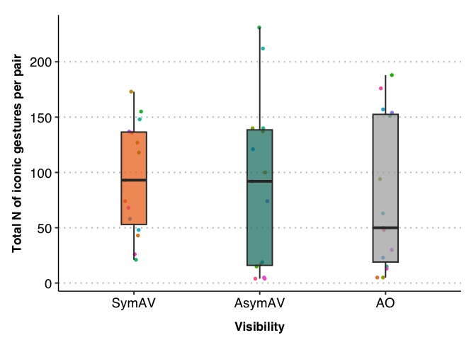<!-- -->

<br>

### bp: mean by condition

``` r
bp_mean_iconic_by_cond = ggplot(data=trial_info_pair, 
                                aes(x=condition, y=mean_num_iconic, fill=condition)) +
  geom_jitter(aes(color = pair), 
              size = 1, alpha = 1, 
              width = 0.07, height = 0) +
  geom_boxplot(width = .2,
               outlier.shape = NA, alpha = 0.7) +
  geom_point(data = trial_info_cond, 
             aes(y = mean_num_iconic), 
             shape = 21, size = 3, fill = "white") +
  scale_y_continuous(limits = c(0, 4), breaks = seq(0, 4, 1)) +
  scale_fill_manual(values = c("#ED6B06", "#00786A", "darkgrey")) +
  labs(x = "Visibility",
       y = "Mean N. iconic gest per trial") +
  theme_clean(base_size = 15) +
  theme(axis.text.x = element_text(colour = "black", size = 14),
        axis.text.y = element_text(colour = "black", size = 14),
        axis.title = element_text(size = 13, face = 'bold'),
        axis.title.x = element_text(vjust = -2),
        axis.title.y = element_text(vjust = 2),
        legend.position = "none",
        strip.text = element_text(size = 14, face = 'bold'),
        plot.background = element_blank(),
        plot.margin = unit(c(1.1,1.1,1.1,1.1), "lines"))

interactive_plot(bp_mean_iconic_by_cond)
```

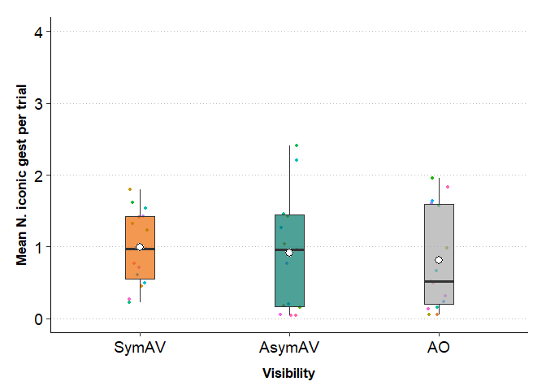<!-- -->

<br>

### bp: mean by condition x round

``` r
bp_mean_iconic_by_round_cond = ggplot(data=df_trial_info, 
                                      aes(x=round, y=num_iconic_gestures, fill=condition)) +
  geom_boxplot(outlier.shape = NA,
               alpha = 0.7) +
  scale_fill_manual(values = c("#ED6B06", "#00786A", "darkgrey")) +
  scale_y_continuous(limits = c(0, 15), breaks = seq(0, 15, 5)) +
  labs(x = "Round",
       y = "Mean N of iconic gestures per trial") +
  theme_clean(base_size = 15) +
  theme(axis.text.x = element_text(colour = "black", size = 14),
        axis.text.y = element_text(colour = "black", size = 14),
        axis.title = element_text(size = 13, face = 'bold'),
        axis.title.x = element_text(vjust = -2),
        axis.title.y = element_text(vjust = 2),
        legend.position = "top",
        strip.text = element_text(size = 14, face = 'bold'),
        plot.background = element_blank(),
        plot.margin = unit(c(1.1,1.1,1.1,1.1), "lines"))

bp_mean_iconic_by_round_cond
```

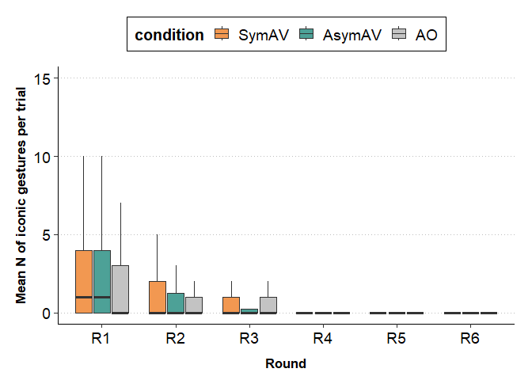<!-- -->

The figure shows that the decline in iconic gestures across rounds does
not follow a linear pattern. This suggests that log-transformed round
may improve the model fit.

<br>

------------------------------------------------------------------------

# 5. Rate of iconic gestures per 100 words

## 5.1 DataViz:Rate per 100 words

### bp: mean by condition

``` r
bp_mean_iconic_rate = 
  ggplot(data=trial_info_pair, 
         aes(x=condition, y=mean_iconic_per_100words, fill=condition)) +
  geom_jitter(aes(color = pair), 
              size = 1, alpha = 1, 
              width = 0.07, height = 0) +
  geom_boxplot(width = .2,
               outlier.shape = NA, alpha = 0.7) +
  geom_point(data = trial_info_cond, 
             aes(y = mean_iconic_per_100words), 
             shape = 21, size = 3, fill = "white") +
  scale_y_continuous(limits = c(0, 8.1), breaks = seq(0, 8, 2)) +
  scale_fill_manual(values = c("#ED6B06", "#00786A", "darkgrey")) +
  labs(x = "Visibility",
       y = "Mean rate of iconic gestures") +
  theme_clean(base_size = 15) +
  theme(axis.text.x = element_text(colour = "black", size = 14),
        axis.text.y = element_text(colour = "black", size = 14),
        axis.title = element_text(size = 13, face = 'bold'),
        axis.title.x = element_text(vjust = -2),
        axis.title.y = element_text(vjust = 2),
        legend.position = "none",
        strip.text = element_text(size = 14, face = 'bold'),
        plot.background = element_blank(),
        plot.margin = unit(c(1.1,1.1,1.1,1.1), "lines"))

interactive_plot(bp_mean_iconic_rate)
```

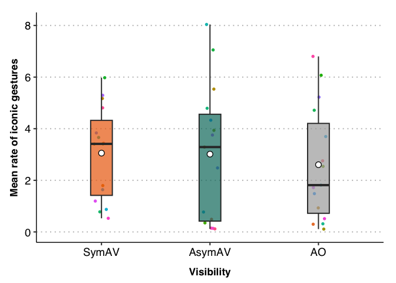<!-- -->

<br>

### bp: mean by condition x round

``` r
pd = position_dodge(width = .75)

bp_mean_iconic_rate_cond_round = 
  ggplot(data=df_trial_info, 
         aes(x=round_n, y=n_iconic_per_100words, fill=condition)) +
  geom_boxplot(outlier.shape = NA,
               alpha = 0.7) +
  geom_point(data = trial_info_cond_round, 
             aes(y = mean_iconic_per_100words, 
                 group = condition),
             position = pd,
             shape = 21, size = 2, fill = "white") +
  scale_fill_manual(values = c("#ED6B06", "#00786A", "darkgrey")) +
  scale_y_continuous(limits = c(0, 22), breaks = seq(0, 20, 5)) +
  labs(x = "Round",
       y = "Mean rate of iconic gestures") +
  theme_clean(base_size = 15) +
  theme(axis.text.x = element_text(colour = "black", size = 14),
        axis.text.y = element_text(colour = "black", size = 14),
        axis.title = element_text(size = 13, face = 'bold'),
        axis.title.x = element_text(vjust = -2),
        axis.title.y = element_text(vjust = 2),
        legend.position = "top",
        strip.background = element_blank(),
        strip.text = element_text(size = 14, face = 'bold'),
        plot.background = element_blank(),
        plot.margin = unit(c(1.1,1.1,1.1,1.1), "lines"))

bp_mean_iconic_rate_cond_round
```

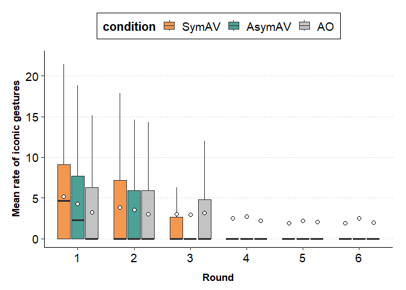<!-- -->

<br>

## 5.2 Negative binomial regression models

In the previous section, we analyzed the number of iconic gestures
produced per trial. However, it is common to analyze the rate of iconic
gestures per 100 words to account for the differences in the length of
the trials and speech rate. Here, we will include the log of speech rate
(number of words / 100) as an exposure variable and analyze the rate of
iconic gestures per 100 words by condition. Note that the syntax for the
exposure variable is different from the Poisson regression model; for
negative binomial regression, the exposure variable is included with the
rate() function.

<br>

### 5.2.1 Prior specification

As the unit of the dependent variable is different from the previous
model, we will set different priors for the rate of iconic gestures per
100 words. We will use weakly informative priors for the regression each
parameter. To specify priors for the intercept, we will refer to the
number of iconic gestures and words reported in Akamine et al. (2024).
In the paper, the authors analyzed data from 19 dyads involving in the
same task as the current study but in co-present interaction. The total
number of iconic gestures reported was 4413, which was collected from 19
dyads, each performing 96 trials. The total number of words produced was
71695 (28152 content) words. Therefore, the expected rate of iconic
gestures per 100 words per speaker is $4413 / (71695 / 100) / 2 = 3.08$
(log(3.08) = 1.12).

For the fixed effects, we will set unbiased priors with a mean of 0 and
a standard deviation of 0.5.

For the standard deviation of the random effects, we set the prior to be
normal with mean 0 and standard deviation 0.5. For the correlation
between the random effects, we set the prior to be LKJ(2).

For the models including the round as fixed effects (whether
backward-difference coded or centered + log-transformed), the intercept
will represent the mean expected number of iconic gestures (ground
mean). As the meaning of the intercept doesn’t change when adding the
round variable, we use the same prior for the intercept.

Note that we do not expect the rate of iconic gestures to change across
rounds (i.e., we expect the number of words and gestures to decrease at
an approximately same pace across the rounds). Also, it is common to set
the mean of slopes to be 0 to avoid favoring any directions. Therefore
we will set the mean of the prior for slope to 0.

``` r
priors_rslope_rate = c(
  prior(normal(1.12, 0.5), class = Intercept),
  prior(normal(0, 0.5), class = b),
  prior(normal(0, 0.5), class = sd),
  prior(lkj(2), class = cor),
  prior(normal(0, 50), class = shape))

priors_rslope_rate_zinb = c(
  prior(normal(1.12, 0.5), class = Intercept),
  prior(normal(0, 0.5), class = b),
  prior(normal(0, 0.5), class = sd),
  prior(lkj(2), class = cor),
  prior(normal(0, 0.5), class = zi), # on the logit scale
  prior(normal(0, 50), class = shape))
```

<br>

### 5.2.2 Model comparison

#### Round

``` r
nb_iconic_rate_cond_round = 
  brm(num_iconic_gestures | rate(n_words_100) ~ 
        1 + condition * round + 
        (1+round|pair) + (1|target),
      family = negbinomial(),
      prior = priors_rslope_rate,
      data = df_trial_info,
      sample_prior = T,
      warmup = nwu, iter = niter,
      control = list(adapt_delta = 0.9, 
                     max_treedepth = 15),
      file = "models/speakerB/iconic/nb_iconic_rate_cond_round")

nb_iconic_rate_cond_round_c = 
  brm(num_iconic_gestures | rate(n_words_100) ~ 
        1 + condition * round_c + 
        (1+round_c|pair) + (1|target),
      family = negbinomial(),
      prior = priors_rslope_rate,
      data = df_trial_info,
      sample_prior = T,
      warmup = nwu, iter = niter,
      control = list(adapt_delta = 0.9, 
                     max_treedepth = 15),
      file = "models/speakerB/iconic/nb_iconic_rate_cond_round_c")

nb_iconic_rate_cond_round_log = 
  brm(num_iconic_gestures | rate(n_words_100) ~ 
        1 + condition * log_round_c + 
        (1+log_round_c|pair) + (1|target),
      family = negbinomial(),
      prior = priors_rslope_rate,
      data = df_trial_info,
      sample_prior = T,
      warmup = nwu, iter = niter,
      control = list(adapt_delta = 0.9, 
                     max_treedepth = 15),
      file = "models/speakerB/iconic/nb_iconic_rate_cond_round_log")


### loo compare
if (!file.exists("models/speakerB/iconic/loo_nb_iconic_rate_cond_round.rds")){
  nb_cond_round_loo = loo(nb_iconic_rate_cond_round)
  saveRDS(nb_cond_round_loo, file = "models/speakerB/iconic/loo_nb_iconic_rate_cond_round.rds")
}

if (!file.exists("models/speakerB/iconic/loo_nb_iconic_rate_cond_round_c.rds")){
  nb_cond_round_c_loo = loo(nb_iconic_rate_cond_round_c)
  saveRDS(nb_cond_round_c_loo, file = "models/speakerB/iconic/loo_nb_iconic_rate_cond_round_c.rds")
}

if (!file.exists("models/speakerB/iconic/loo_nb_iconic_rate_cond_round_log.rds")){
  nb_cond_round_log_loo = loo(nb_iconic_rate_cond_round_log)
  saveRDS(nb_cond_round_log_loo, file = "models/speakerB/iconic/loo_nb_iconic_rate_cond_round_log.rds")
}

nb_cond_round_loo = readRDS("models/speakerB/iconic/loo_nb_iconic_rate_cond_round.rds")
nb_cond_round_c_loo = readRDS("models/speakerB/iconic/loo_nb_iconic_rate_cond_round_c.rds")
nb_cond_round_log_loo = readRDS("models/speakerB/iconic/loo_nb_iconic_rate_cond_round_log.rds")

loo_compare(nb_cond_round_loo, nb_cond_round_c_loo, nb_cond_round_log_loo)
```

    ##                               elpd_diff se_diff
    ## nb_iconic_rate_cond_round_c     0.0       0.0  
    ## nb_iconic_rate_cond_round_log  -7.8       3.0  
    ## nb_iconic_rate_cond_round     -11.5       4.0

The leave-one-out (LOO) Effect shows that centered round provides a
larger predictive power (elpd_diff) and smaller standard error (se_diff)
compared to the backward-difference coded round or centered
log-transformed round. Therefore, we will use the centered round.

<br>

#### ZI or not

``` r
zinb_iconic_rate_cond_round_c = 
  brm(num_iconic_gestures ~ 
        1 + condition * round_c + 
        offset(log(n_words_100)) +
        (1+round_c|pair) + (1|target),
      family = zero_inflated_negbinomial(),
      prior = priors_rslope_rate_zinb,
      data = df_trial_info,
      sample_prior = T,
      warmup = nwu, iter = niter,
      control = list(adapt_delta = 0.9, 
                     max_treedepth = 15),
      file = "models/speakerB/iconic/zinb_iconic_rate_cond_round_c")


### loo compare
if (!file.exists("models/speakerB/iconic/loo_zinb_iconic_rate_cond_round_c.rds")){
  zinb_cond_round_c_loo = loo(zinb_iconic_rate_cond_round_c)
  saveRDS(zinb_cond_round_c_loo, file = "models/speakerB/iconic/loo_zinb_iconic_rate_cond_round_c.rds")
}

nb_cond_round_c_loo = readRDS("models/speakerB/iconic/loo_nb_iconic_rate_cond_round_c.rds")
zinb_cond_round_c_loo = readRDS("models/speakerB/iconic/loo_zinb_iconic_rate_cond_round_c.rds")

loo_compare(nb_cond_round_c_loo, zinb_cond_round_c_loo)
```

    ##                               elpd_diff se_diff
    ## nb_iconic_rate_cond_round_c     0.0       0.0  
    ## zinb_iconic_rate_cond_round_c -13.1       5.6

The leave-one-out (LOO) Effect shows that non-zero-inflation model has a
higher predictive power. As such, we will use a negative binomial
regression model.

<br>

### 5.2.3 Prior predictive check

``` r
nb_iconic_rate_cond_round_c_prior = 
  brm(num_iconic_gestures | rate(n_words_100) ~ 
        1 + condition * round_c + 
        (1+round_c|pair) + (1|target),
      family = negbinomial(),
      prior = priors_rslope_rate,
      sample_prior = "only",
      data = df_trial_info,
      file = "models/speakerB/iconic/nb_iconic_rate_cond_round_c_prior")

pp_check(nb_iconic_rate_cond_round_c_prior, ndraws = 100, 
         type = "bars_grouped", group = "condition") +
  coord_cartesian(xlim = c(0, 10),
                  ylim = c(0, 1500))
```

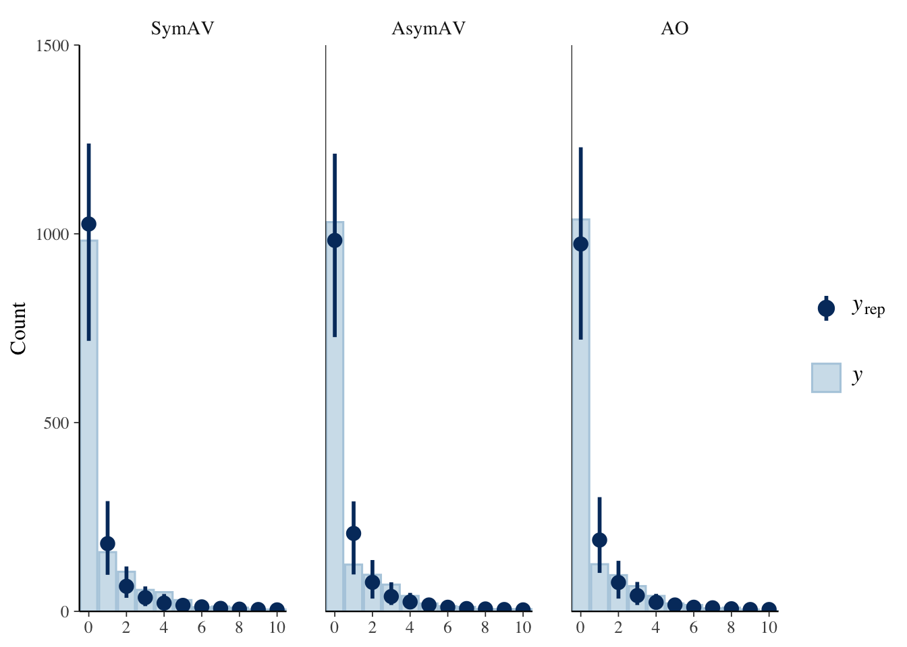<!-- -->

The prior predictive check shows that the model generates data that are
somewhat similar to the observed data.

<br>

### 5.2.4 Fit the model

``` r
nb_iconic_rate_cond_round_c = 
  brm(num_iconic_gestures | rate(n_words_100) ~ 
        1 + condition * round_c + 
        (1+round_c|pair) + (1|target),
      family = negbinomial(),
      prior = priors_rslope_rate_nb,
      data = df_trial_info,
      sample_prior = T,
      save_pars = save_pars(all = TRUE),
      warmup = nwu, iter = niter,
      control = list(adapt_delta = 0.9, 
                     max_treedepth = 15),
      file = "models/speakerB/iconic/nb_iconic_rate_cond_round_c")

model = nb_iconic_rate_cond_round_c
summary(model)
```

    ##  Family: negbinomial 
    ##   Links: mu = log 
    ## Formula: num_iconic_gestures | rate(n_words_100) ~ 1 + condition * round_c + (1 + round_c | pair) + (1 | target) 
    ##    Data: df_trial_info (Number of observations: 4315) 
    ##   Draws: 4 chains, each with iter = 20000; warmup = 2000; thin = 1;
    ##          total post-warmup draws = 72000
    ## 
    ## Multilevel Hyperparameters:
    ## ~pair (Number of levels: 45) 
    ##                        Estimate Est.Error l-95% CI u-95% CI Rhat Bulk_ESS
    ## sd(Intercept)              1.08      0.12     0.87     1.34 1.00    23791
    ## sd(round_c)                0.18      0.03     0.12     0.25 1.00    25899
    ## cor(Intercept,round_c)     0.62      0.14     0.30     0.84 1.00    49599
    ##                        Tail_ESS
    ## sd(Intercept)             39933
    ## sd(round_c)               41911
    ## cor(Intercept,round_c)    52791
    ## 
    ## ~target (Number of levels: 16) 
    ##               Estimate Est.Error l-95% CI u-95% CI Rhat Bulk_ESS Tail_ESS
    ## sd(Intercept)     0.09      0.04     0.02     0.17 1.00    18926    23115
    ## 
    ## Regression Coefficients:
    ##                           Estimate Est.Error l-95% CI u-95% CI Rhat Bulk_ESS
    ## Intercept                     1.02      0.16     0.70     1.34 1.00    16198
    ## conditionAO_Asym              0.05      0.30    -0.55     0.65 1.00    21385
    ## conditionAsym_Sym             0.31      0.30    -0.29     0.90 1.00    20699
    ## round_c                      -0.15      0.03    -0.22    -0.08 1.00    33070
    ## conditionAO_Asym:round_c     -0.02      0.07    -0.17     0.12 1.00    34260
    ## conditionAsym_Sym:round_c    -0.06      0.07    -0.20     0.08 1.00    33884
    ##                           Tail_ESS
    ## Intercept                    25747
    ## conditionAO_Asym             35082
    ## conditionAsym_Sym            32844
    ## round_c                      44515
    ## conditionAO_Asym:round_c     44755
    ## conditionAsym_Sym:round_c    46209
    ## 
    ## Further Distributional Parameters:
    ##       Estimate Est.Error l-95% CI u-95% CI Rhat Bulk_ESS Tail_ESS
    ## shape    17.06      2.70    12.73    23.24 1.00   102026    47786
    ## 
    ## Draws were sampled using sample(hmc). For each parameter, Bulk_ESS
    ## and Tail_ESS are effective sample size measures, and Rhat is the potential
    ## scale reduction factor on split chains (at convergence, Rhat = 1).

``` r
# bayestestR::hdi(model)
# bayestestR::hdi(model, ci = 0.89)
```

The coefficients show that the condition does not have a significant
effect on the rate of iconic gestures per 100 words. However, there was
a significant decrease in the rate of iconic gestures per 100 words
across the rounds. This means that the number of iconic gestures
decreased more than the number of words did across the rounds. A formal
hypothesis testing will be performed later using Bayes factor.

<br>

### 5.2.5 Posterior predictive check

``` r
pp_check(model, ndraws = 100, 
         type = "bars_grouped", group = "condition") +
  coord_cartesian(xlim = c(0, 10),
                  ylim = c(0, 1200))
```

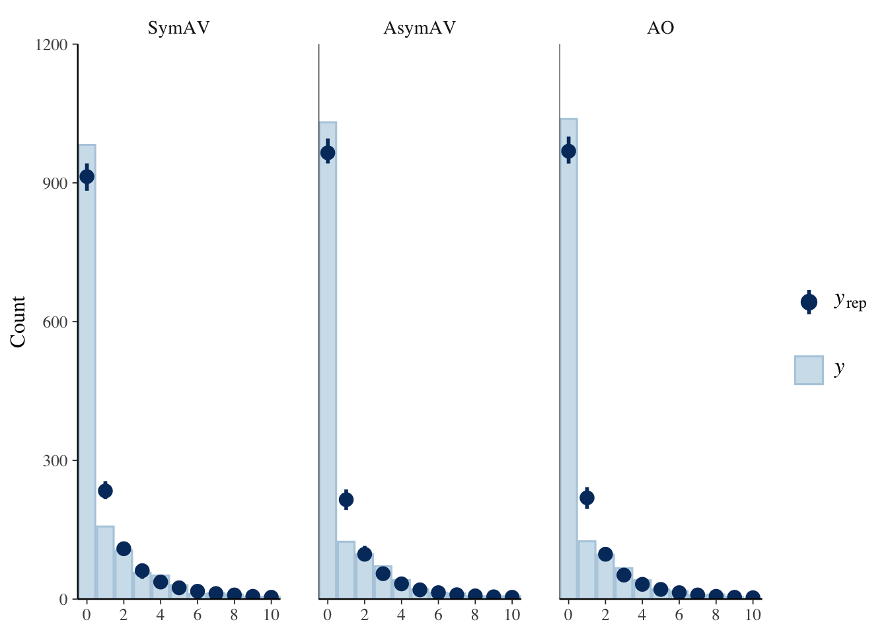<!-- -->

``` r
pp_check(model, ndraws = 100, 
         type = "bars_grouped", group = "round_c") +
  coord_cartesian(xlim = c(0, 5),
                  ylim = c(0, 700))
```

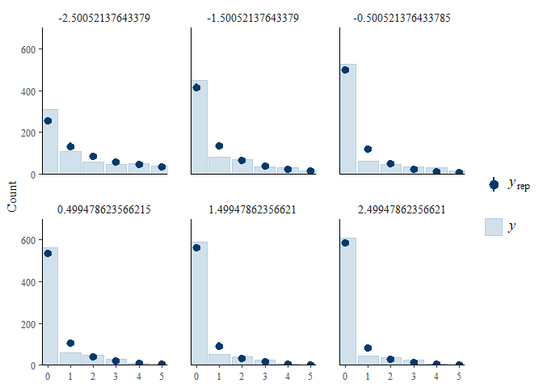<!-- -->

<br>

### 5.2.6 Posterior distributions

``` r
df_post_beta = posterior_beta(model)

# summarize the posterior distribution
post_beta_summary = df_post_beta %>%
  group_by(.variable) %>%
  summarize(mean = mean(.value),
            est_error = sd(.value),
            lci = quantile(.value, 0.025),
            uci = quantile(.value, 0.975))
post_beta_summary
```

    ## # A tibble: 8 × 5
    ##   .variable               mean est_error    lci     uci
    ##   <fct>                  <dbl>     <dbl>  <dbl>   <dbl>
    ## 1 Intercept             1.02      0.161   0.702  1.34  
    ## 2 AO--AsymAV            0.0509    0.305  -0.550  0.646 
    ## 3 AsymAV--SymAV         0.305     0.303  -0.291  0.900 
    ## 4 AO--SymAV             0.356     0.350  -0.335  1.05  
    ## 5 Round                -0.148     0.0347 -0.220 -0.0834
    ## 6 Round: AO--AsymAV    -0.0233    0.0729 -0.169  0.119 
    ## 7 Round: AsymAV--SymAV -0.0594    0.0716 -0.202  0.0815
    ## 8 Round: AO--SymAV     -0.0827    0.0751 -0.233  0.0645

``` r
# visualize the posterior distribution
plot_posterior(df_post_beta, interaction = F,
               xlim_cond = 1.2, xlim_round = 0.25, xlim_lex = 0.25)
```

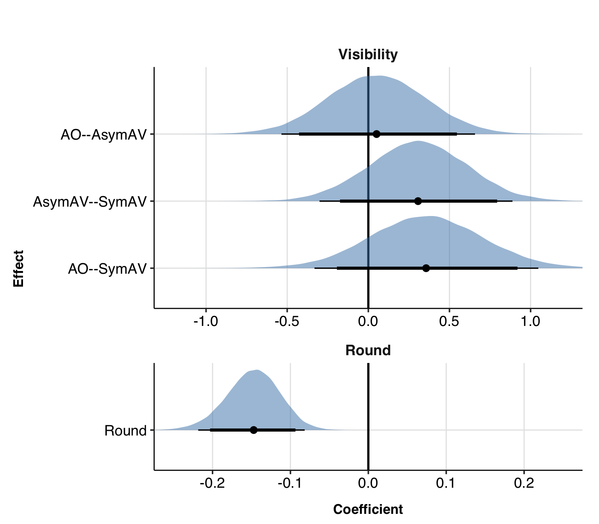<!-- -->

<br>

### 5.2.7 Hypothesis testing: Bayes factor

``` r
### varying priors for sensitivity analysis
prior_size = c("xs", "s", "m", "l", "xl")
prior_sd = c(0.1, 0.3, 0.5, 1, 1.5)


### list of hypotheses
hps = c("conditionAO_Asym = 0",
        "conditionAsym_Sym = 0",
        "conditionAO_Asym + conditionAsym_Sym = 0",
        "round_c = 0",
        "conditionAO_Asym:round_c = 0",
        "conditionAsym_Sym:round_c = 0",
        "conditionAO_Asym:round_c + conditionAsym_Sym:round_c = 0")
effects = c("AO--AsymAV", "AsymAV--SymAV", "AO--SymAV", "Round", 
            "AO--AsymAV:Round", "AsymAV--SymAV:Round", "AO--SymAV:Round")

for (i in 1:length(prior_sd)){
  priors = c(
    prior(normal(1.12, 0.5), class = Intercept),
    set_prior(paste0("normal(0,", prior_sd[i], ")"), class = "b"),
    prior(normal(0, 0.5), class = sd),
    prior(lkj(2), class = cor),
    prior(normal(0, 50), class = shape))
  
  fname = paste0("models/speakerB/iconic/nb_iconic_rate_cond_round_c_", prior_size[i])
  fname = gsub("_m", "", fname) # remove "_m" for the medium prior
  
  fit = brm(num_iconic_gestures | rate(n_words_100) ~ 
              1 + condition * round_c +
              (1+round_c|pair) + (1|target),
            family = negbinomial(),
            prior = priors,
            data = df_trial_info,
            sample_prior = T,
            save_pars = save_pars(all = TRUE),
            warmup = nwu, iter = niter,
            control = list(adapt_delta = 0.9, 
                           max_treedepth = 15),
            file = fname)
  
  ### compute BFs for all hypotheses and store them as dataframe
  for (j in 1:length(hps)){
    h = hypothesis(fit, hps[j])
    # transform the result to dataframe
    result = data_frame(h$hypothesis) %>%
      mutate(size = prior_size[i],
             sd = prior_sd[i],
             Effect = effects[j])
    # combine the result
    if (i==1 & j==1){
      df_results = result
    } else {
      df_results = rbind(df_results, result)}
  }
}

df_results = df_results %>%
  mutate(prior = paste0("N(0, ", sd, ")"),
         BF10 = 1 / abs(Evid.Ratio),
         Effect = factor(Effect,
                         levels = c("AO--SymAV", "AO--AsymAV", "AsymAV--SymAV", "Round",
                                    "AO--SymAV:Round", "AO--AsymAV:Round", "AsymAV--SymAV:Round")),
         Predictor = factor(ifelse(grepl(":Round", Effect), "Interaction",
                                   ifelse(grepl("Round", Effect), "Round", "Visibility")),
                            levels = c("Visibility", "Round", "Interaction")),
         across(where(is.numeric), ~ round(., 3)),
         Star = ifelse(BF10 >= 30 | BF10 <= 1/30, "***",
                       ifelse(BF10 >= 10 | BF10 <= 1/10, "**",
                              ifelse(BF10 >= 3 | BF10 <= 1/3, "*", ""))),
         Star = ifelse(BF10 < 1, str_replace_all(Star, "[*]", "="), Star)) %>% 
  dplyr::select(size, sd, prior, Effect, Predictor,
                Estimate, Est.Error, `CI.Lower`, `CI.Upper`, BF10, Star) %>% 
  arrange(Effect, sd)
```

``` r
#### Plot BFs ####
p_bf = ggplot(filter(df_results, Predictor != "Round"), 
              aes(x = factor(sd), y = BF10, group = Effect)) +
  geom_hline(yintercept = 1, linetype="dashed") +
  geom_point(aes(color=Effect)) +
  geom_line(aes(color=Effect)) +
  labs(x = "SD for the prior",
       title = "D. Bayes factors for main effects") +
  facet_wrap(vars(Predictor)) +
  theme_clean(base_size = 15) +
  theme(axis.text.x = element_text(colour = "black", size = 14),
        axis.text.y = element_text(colour = "black", size = 14),
        axis.title = element_text(size = 13, face = 'bold'),
        axis.title.x = element_text(vjust = -2),
        axis.title.y = element_text(vjust = 2),
        legend.position = "right",
        legend.text = element_text(size = 12),
        strip.text = element_text(size = 14, face = 'bold'),
        strip.background = element_blank(),
        plot.title.position = "plot", # left align the title
        plot.background = element_blank(),
        plot.margin = unit(c(1.1,1.1,1.1,1.1), "lines")) +
  scale_y_log10("Bayes factor (BF10)",
                # limits = c(0.03, 30000),
                breaks = c(0.001, 0.03, 0.01, 0.1, 0.33, 1, 3, 10, 30, 100, 1e3, 1e4),
                labels = c(0.001, 0.03, 0.01, 0.1, 0.33, 1, 3, 10, 30, 100, 1e3, 1e4)) +
  guides(color = guide_legend(ncol = 1))

p_bf
```

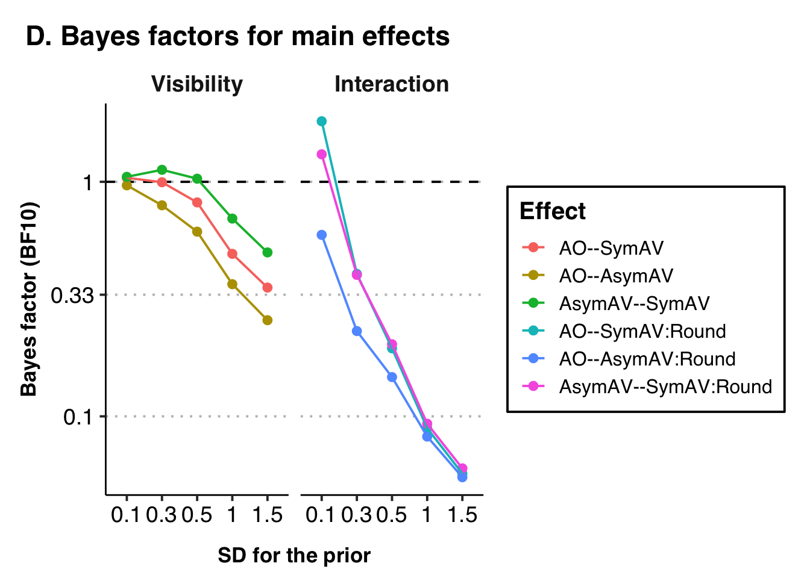<!-- -->

<br>

### 5.2.8 Back-transformation

``` r
### obtain model predictions
pred_cond = 
  avg_predictions(model, by = "condition",
                  type = "link", transform = exp,
                  re_formula = NA) %>% 
  as_tibble()
pred_cond
```

    ## # A tibble: 3 × 5
    ##   condition estimate conf.low conf.high    df
    ##   <fct>        <dbl>    <dbl>     <dbl> <dbl>
    ## 1 SymAV         3.47     2.11      5.66   Inf
    ## 2 AsymAV        2.56     1.62      4.02   Inf
    ## 3 AO            2.43     1.47      3.96   Inf

``` r
mean_round = mean(as.integer(df_trial_info$round))
pred_int = 
  avg_predictions(model, by = c("round_c","condition"),
                  type = "link", transform = exp,
                  re_formula = NA) %>%
  as_tibble() %>% 
  mutate(round = factor(as.integer(round_c + mean_round)))
pred_int
```

    ## # A tibble: 18 × 7
    ##    round_c condition estimate conf.low conf.high    df round
    ##      <dbl> <fct>        <dbl>    <dbl>     <dbl> <dbl> <fct>
    ##  1  -2.50  SymAV         5.66    3.75       8.49   Inf 1    
    ##  2  -2.50  AsymAV        3.59    2.41       5.32   Inf 1    
    ##  3  -2.50  AO            3.23    2.11       4.86   Inf 1    
    ##  4  -1.50  SymAV         4.65    3.03       7.11   Inf 2    
    ##  5  -1.50  AsymAV        3.13    2.11       4.67   Inf 2    
    ##  6  -1.50  AO            2.88    1.87       4.40   Inf 2    
    ##  7  -0.501 SymAV         3.83    2.40       6.09   Inf 3    
    ##  8  -0.501 AsymAV        2.74    1.78       4.20   Inf 3    
    ##  9  -0.501 AO            2.57    1.61       4.08   Inf 3    
    ## 10   0.499 SymAV         3.15    1.85       5.29   Inf 4    
    ## 11   0.499 AsymAV        2.39    1.47       3.86   Inf 4    
    ## 12   0.499 AO            2.30    1.35       3.86   Inf 4    
    ## 13   1.50  SymAV         2.59    1.41       4.66   Inf 5    
    ## 14   1.50  AsymAV        2.09    1.19       3.60   Inf 5    
    ## 15   1.50  AO            2.06    1.11       3.70   Inf 5    
    ## 16   2.50  SymAV         2.13    1.06       4.13   Inf 6    
    ## 17   2.50  AsymAV        1.82    0.949      3.39   Inf 6    
    ## 18   2.50  AO            1.84    0.907      3.57   Inf 6

<br>

### 5.2.9 Visualize model predictions together with data

``` r
bp_mean_iconic_rate_model = 
  bp_mean_iconic_rate +
  geom_ribbon(data = pred_cond,
              aes(x = condition, y = estimate,
                  ymin = conf.low, ymax = conf.high, group = 1),
              fill = "black", alpha = 0.2) +
  geom_line(data = pred_cond,
            aes(x = condition, y = estimate, group = 1),
            color = "black", size = 0.8)

bp_mean_iconic_rate_model
```

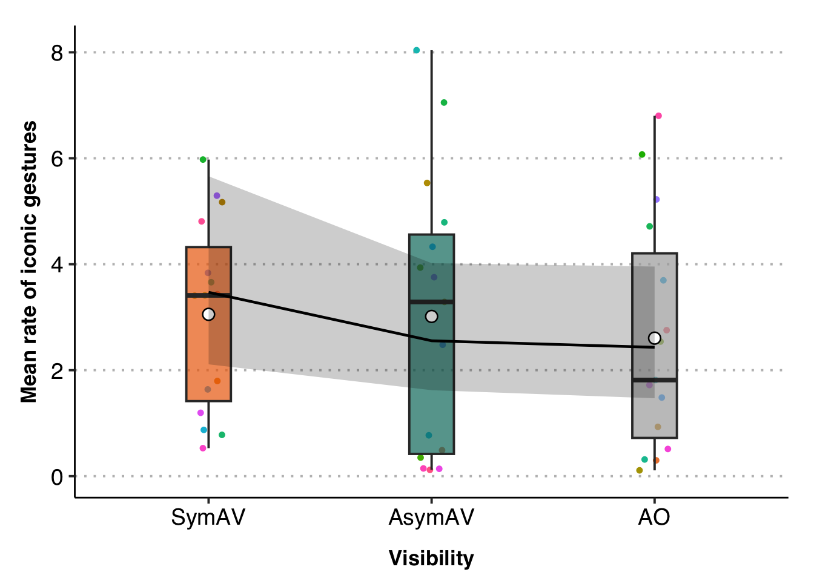<!-- -->

``` r
ggsave("figures/speakerB/iconic/bp_mean_iconic_rate_model.svg", width=4, height=3.5)


bp_mean_iconic_rate_cond_round_model = 
  bp_mean_iconic_rate_cond_round +
  geom_ribbon(data = pred_int,
              aes(x = round, y = estimate,
                  ymin = conf.low, ymax = conf.high, 
                  group = condition, fill = condition),
              alpha = 0.2) +
  geom_line(data = pred_int,
            aes(x = round, y = estimate, 
                group = condition, color = condition),
            size = 0.8) +
  scale_fill_manual(values = c("#ED6B06", "#00786A", "darkgrey")) +
  scale_color_manual(values = c("#ED6B06", "#00786A", "darkgrey"))

bp_mean_iconic_rate_cond_round_model
```

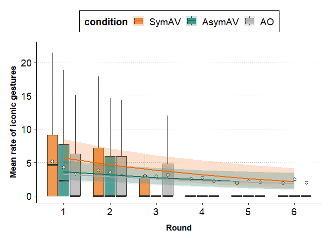<!-- -->

``` r
ggsave("figures/speakerB/iconic/bp_mean_iconic_rate_cond_round_model.svg", width=6, height=4)
```

<br>

------------------------------------------------------------------------

# ==== Gestural alignment ====

# 6. Causal model of gestural alignment

Experts in the field of statistics and causal inference have advised
that researchers should build a causal model and examine which factors
should be included and excluded from regression models if their aim is
to infer the causal effects (e.g., [McElreath,
2020](https://www.taylorfrancis.com/books/mono/10.1201/9780429029608/statistical-rethinking-richard-mcelreath),
[Pearl, 2010](https://pmc.ncbi.nlm.nih.gov/articles/PMC2836213/),
[Cinelli, Forney, & Pearl,
2020](https://journals.sagepub.com/doi/full/10.1177/00491241221099552)).
Following this advice, we will build a causal model to infer the direct
effect of speaker visibility on gestural alignment.

We assume the following causal model:

``` r
### causal model for gestural alignment rate
dag_gest <- dagitty('dag {
  visibility -> gest_align
  visibility -> n_words
  visibility -> n_gestures
  n_words -> lex_align
  n_words -> n_gestures
  round -> n_words
  round -> lex_align
  round -> gest_align
  round -> n_gestures
  role -> n_words
  role -> lex_align
  role -> gest_align
  role -> n_gestures
  n_gestures -> gest_align
  lex_align -> gest_align
}')

plot(dag_gest)
```

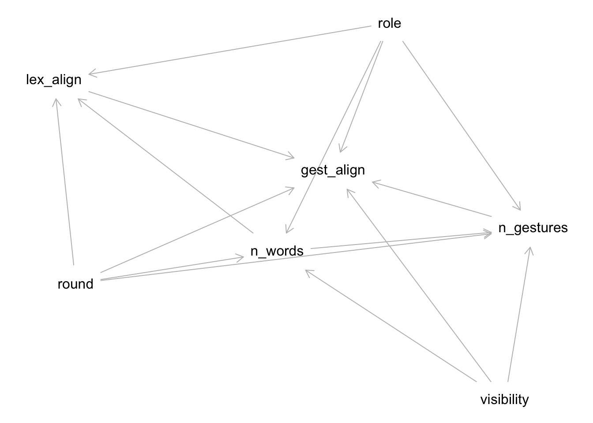<!-- -->

``` r
### check the minimam adjustment set
print("Direct effect of visibility on gestural alignment frequency")
```

    ## [1] "Direct effect of visibility on gestural alignment frequency"

``` r
adjustmentSets(dag_gest, exposure = "visibility", outcome = "gest_align", effect = "direct")
```

    ## { lex_align, n_gestures, role, round }
    ## { n_gestures, n_words, role, round }

``` r
print("Direct effect of lexical alignment frequency on gestural alignment frequency")
```

    ## [1] "Direct effect of lexical alignment frequency on gestural alignment frequency"

``` r
adjustmentSets(dag_gest, exposure = "lex_align", outcome = "gest_align", effect = "direct")
```

    ## { n_gestures, role, round, visibility }
    ## { n_words, role, round }

``` r
print("Direct effect of round on gestural alignment frequency")
```

    ## [1] "Direct effect of round on gestural alignment frequency"

``` r
adjustmentSets(dag_gest, exposure = "round", outcome = "gest_align", effect = "direct")
```

    ## { lex_align, n_gestures, role, visibility }

The minimum adjustment set for estimating the direct causal effect of
speaker visibility on gestural alignment frequency is {lex_align,
n_words, round}. Note that because dagitty didn’t find any adjustment
set for the direct effect of visibility on lexical alignment frequency
*when we expected bidirectional causation between lexical and gestural
alignment*, we assumed a unidirectional causation from lexical alignment
to gestural alignment only in this model. This will be reversed in the
causal model for lexical alignment frequency, such that we assume a
unidirectional causation from gestural alignment to lexical alignment.

In addition, we are also interested in the direct effect of lexical
alignment frequency on gestural alignment frequency. The minimum
adjustment set for is {visibility, n_gestures, round}.

As the minimum adjustment sets for the direct effects of visibility,
lexical alignment frequency, and round on gestural alignment frequency
are identical (i.e., {visibility, lex_align, n_gestures, round}), we can
estimate the direct effect of these variables on gestural alignment
frequency with the following model:

$$
gest\_align \: | \: \text{rate}(n\_iconic\_gesture) \sim \\
\text{visibility} * \text{round} + \text{n_lexical_alignment} + \\
(1+\text{round} | \text{participant}) + (1 | \text{item})
$$

<br>

------------------------------------------------------------------------

# 7. Number of gestural alignment

## 7.1 DataViz: number of gestural alignment

### bp: mean by condition

``` r
bp_mean_gest_alignment = 
  ggplot(data=trial_info_pair, 
         aes(x=condition, y=mean_num_gest_align, fill=condition)) +
  geom_jitter(aes(color = pair), 
              size = 1, alpha = 1, 
              width = 0.07, height = 0) +
  geom_boxplot(width = .4,
               outlier.shape = NA, alpha = 0.7) +
  geom_point(data = trial_info_cond, 
             aes(y = mean_num_gest_align), 
             size = 2, shape = 4) +
  scale_fill_manual(values = c("#ED6B06", "#00786A", "darkgrey")) +
  labs(x = "Visibility",
       y = "Mean gestural alignment count") +
  theme_clean(base_size = 15) +
  theme(axis.text.x = element_text(colour = "black", size = 14),
        axis.text.y = element_text(colour = "black", size = 14),
        axis.title = element_text(size = 13, face = 'bold'),
        axis.title.x = element_text(vjust = -2),
        axis.title.y = element_text(vjust = 2),
        legend.position = "none",
        strip.text = element_text(size = 14, face = 'bold'),
        plot.background = element_blank(),
        plot.margin = unit(c(1.1,1.1,1.1,1.1), "lines"))

interactive_plot(bp_mean_gest_alignment)
```

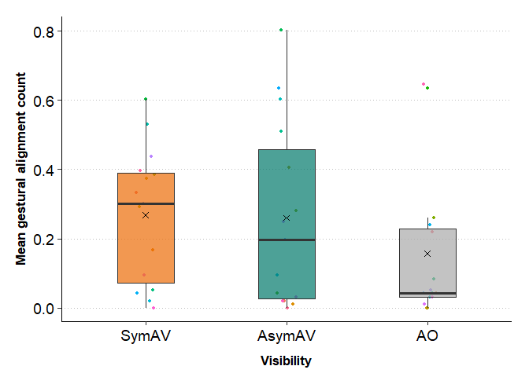<!-- -->

<br>

## 7.2 ZI Negative binomial regression

### 7.2.1 Prior specification

We will set priors for the intercept based on the expected number of
gestural alignment reported in Akamine et al. (2024). In the paper, the
authors analyzed data from 19 dyads involving in the same task as the
current study but in co-present interaction. The total number of
gestural alignment reported was 1086, which was collected from 19 dyads,
each performing 96 trials. This leads to the expected number of gestural
alignment per speaker to be 1086 / (19 \* 96) / 2 = 0.3 (log(0.3) =
-1.2). As such, we will set the prior for the intercept to be normal
with a mean of -1.2 and a standard deviation of 0.5.

For the fixed effects, we will set unbiased priors with a mean of 0. We
set different SDs for each effect because the scale of each predictor is
different. For N. lexical alignment and N. iconic gestures, we set a
prior of Normal(0, 0.2). This means that if the mean N. lex align
increases by 1, we expect the mean N. gestural alignment to change by
-0.2 to 0.5, with the most likely size of change to be 0. As for the
other predictors, we set a prior of Normal(0. 0.5).

We will also specify a prior for the shape parameter to prevent the
model from returning divergent transitions. We will set the prior to be
normal with a mean of 0 and a wide standard deviation of 50.

For the standard deviation of the random effects, we set the prior to be
normal with mean 0 and standard deviation 0.5. For the correlation
between the random effects, we set the prior to be LKJ(2).

``` r
### pair
priors_rslope_gest_align_zinb = c(
  prior(normal(-1.2, 0.5), class = Intercept),
  prior(normal(0, 0.5), class = b),
  prior(normal(0, 0.2), class = b, coef = "n_iconic_c"),
  prior(normal(0, 0.2), class = b, coef = "lex_align_c"),
  prior(normal(0, 0.2), class = b, coef = "lex_align_c:conditionAO_Asym"),
  prior(normal(0, 0.2), class = b, coef = "lex_align_c:conditionAsym_Sym"),
  prior(normal(0, 0.5), class = sd),
  prior(lkj(2), class = cor),
  prior(normal(0, 0.5), class = zi), # on the logit scale
  prior(normal(0, 50), class = shape))
```

<br>

### 7.2.2 Prior predictive check

``` r
zinb_gest_align_prior = 
  brm(num_gestural_align ~
        1 + lex_align_c * condition + round + n_iconic_c + role +
        (1+round|pair) + (1|target),
      family = zero_inflated_negbinomial(),
      prior = priors_rslope_gest_align_zinb,
      data = df_trial_info,
      sample_prior = "only",
      control = list(adapt_delta = 0.9, 
                     max_treedepth = 20),
      file = "models/speakerB/gest_alignment/zinb_gest_align_prior")

pp_check(zinb_gest_align_prior, ndraws = 100, type = "bars") +
  coord_cartesian(xlim = c(0, 20),
                  ylim = c(0, 4000))
```

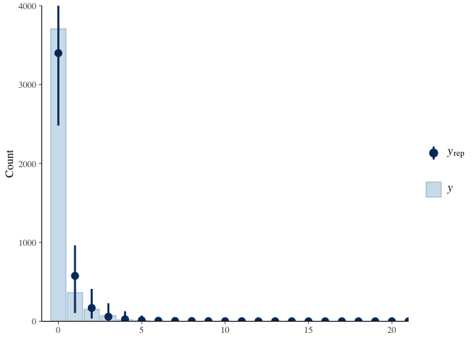<!-- -->

The prior predictive check shows that the prior distributions predict
data that are similar to the observed data.

<br>

### 7.2.3 Fit the model

``` r
zinb_align_cond_round = 
  brm(num_gestural_align ~ 
        1 + lex_align_c * condition + round + n_iconic_c + role +
        (1+round|pair) + (1|target),
      family = zero_inflated_negbinomial(),
      prior = priors_rslope_gest_align_zinb,
      data = df_trial_info,
      sample_prior = T,
      save_pars = save_pars(all = TRUE),
      warmup = nwu, iter = niter,
      control = list(adapt_delta = 0.9, 
                     max_treedepth = 15),
      file = "models/speakerB/gest_alignment/zinb_align_cond_round")

model = zinb_align_cond_round
summary(model)
```

    ##  Family: zero_inflated_negbinomial 
    ##   Links: mu = log 
    ## Formula: num_gestural_align ~ 1 + lex_align_c * condition + round + n_iconic_c + role + (1 + round | pair) + (1 | target) 
    ##    Data: df_trial_info (Number of observations: 4315) 
    ##   Draws: 4 chains, each with iter = 20000; warmup = 2000; thin = 1;
    ##          total post-warmup draws = 72000
    ## 
    ## Multilevel Hyperparameters:
    ## ~pair (Number of levels: 45) 
    ##                         Estimate Est.Error l-95% CI u-95% CI Rhat Bulk_ESS
    ## sd(Intercept)               1.13      0.14     0.88     1.44 1.00    17131
    ## sd(roundR12)                0.43      0.22     0.03     0.86 1.00    17098
    ## sd(roundR23)                0.23      0.14     0.01     0.52 1.00    19239
    ## sd(roundR34)                0.29      0.15     0.02     0.60 1.00    16752
    ## sd(roundR45)                0.15      0.11     0.01     0.41 1.00    32604
    ## sd(roundR56)                0.31      0.20     0.02     0.73 1.00    20841
    ## cor(Intercept,roundR12)     0.11      0.28    -0.46     0.63 1.00    64233
    ## cor(Intercept,roundR23)     0.23      0.31    -0.43     0.75 1.00    54697
    ## cor(roundR12,roundR23)     -0.07      0.32    -0.66     0.58 1.00    51892
    ## cor(Intercept,roundR34)     0.20      0.29    -0.41     0.71 1.00    59985
    ## cor(roundR12,roundR34)      0.04      0.31    -0.57     0.62 1.00    40953
    ## cor(roundR23,roundR34)      0.05      0.32    -0.57     0.64 1.00    37496
    ## cor(Intercept,roundR45)     0.04      0.33    -0.60     0.66 1.00    85227
    ## cor(roundR12,roundR45)     -0.01      0.33    -0.63     0.62 1.00    76672
    ## cor(roundR23,roundR45)      0.05      0.33    -0.60     0.67 1.00    62965
    ## cor(roundR34,roundR45)      0.00      0.33    -0.62     0.63 1.00    70318
    ## cor(Intercept,roundR56)    -0.05      0.31    -0.63     0.55 1.00    77290
    ## cor(roundR12,roundR56)      0.02      0.32    -0.59     0.63 1.00    58151
    ## cor(roundR23,roundR56)     -0.08      0.33    -0.67     0.57 1.00    51469
    ## cor(roundR34,roundR56)      0.04      0.32    -0.59     0.64 1.00    55702
    ## cor(roundR45,roundR56)     -0.06      0.34    -0.67     0.60 1.00    44166
    ##                         Tail_ESS
    ## sd(Intercept)              34547
    ## sd(roundR12)               18949
    ## sd(roundR23)               22418
    ## sd(roundR34)               22663
    ## sd(roundR45)               31508
    ## sd(roundR56)               26062
    ## cor(Intercept,roundR12)    52657
    ## cor(Intercept,roundR23)    51778
    ## cor(roundR12,roundR23)     53798
    ## cor(Intercept,roundR34)    47622
    ## cor(roundR12,roundR34)     50156
    ## cor(roundR23,roundR34)     52277
    ## cor(Intercept,roundR45)    54166
    ## cor(roundR12,roundR45)     55502
    ## cor(roundR23,roundR45)     57530
    ## cor(roundR34,roundR45)     59049
    ## cor(Intercept,roundR56)    52130
    ## cor(roundR12,roundR56)     55328
    ## cor(roundR23,roundR56)     53880
    ## cor(roundR34,roundR56)     58743
    ## cor(roundR45,roundR56)     55101
    ## 
    ## ~target (Number of levels: 16) 
    ##               Estimate Est.Error l-95% CI u-95% CI Rhat Bulk_ESS Tail_ESS
    ## sd(Intercept)     0.20      0.07     0.09     0.35 1.00    22344    23062
    ## 
    ## Regression Coefficients:
    ##                               Estimate Est.Error l-95% CI u-95% CI Rhat
    ## Intercept                        -2.49      0.18    -2.85    -2.14 1.00
    ## lex_align_c                       0.29      0.04     0.22     0.36 1.00
    ## conditionAO_Asym                  0.38      0.32    -0.26     1.02 1.00
    ## conditionAsym_Sym                 0.16      0.31    -0.45     0.78 1.00
    ## roundR12                          0.97      0.17     0.64     1.31 1.00
    ## roundR23                         -0.04      0.12    -0.29     0.20 1.00
    ## roundR34                         -0.32      0.14    -0.61    -0.05 1.00
    ## roundR45                         -0.30      0.14    -0.57    -0.03 1.00
    ## roundR56                         -0.21      0.17    -0.56     0.13 1.00
    ## n_iconic_c                        0.19      0.02     0.15     0.23 1.00
    ## role1                            -0.99      0.11    -1.20    -0.77 1.00
    ## lex_align_c:conditionAO_Asym      0.04      0.08    -0.11     0.20 1.00
    ## lex_align_c:conditionAsym_Sym    -0.02      0.07    -0.15     0.11 1.00
    ##                               Bulk_ESS Tail_ESS
    ## Intercept                        11238    22288
    ## lex_align_c                      69125    56747
    ## conditionAO_Asym                 17516    31821
    ## conditionAsym_Sym                15585    27493
    ## roundR12                         59576    53288
    ## roundR23                         50720    49383
    ## roundR34                         46996    52154
    ## roundR45                         65405    55986
    ## roundR56                         65585    52540
    ## n_iconic_c                       35143    37328
    ## role1                            64897    55097
    ## lex_align_c:conditionAO_Asym     74762    56984
    ## lex_align_c:conditionAsym_Sym    75600    55472
    ## 
    ## Further Distributional Parameters:
    ##       Estimate Est.Error l-95% CI u-95% CI Rhat Bulk_ESS Tail_ESS
    ## shape     4.57      3.84     2.27    10.66 1.00    31530    24234
    ## zi        0.04      0.02     0.01     0.09 1.00    65488    42209
    ## 
    ## Draws were sampled using sample(hmc). For each parameter, Bulk_ESS
    ## and Tail_ESS are effective sample size measures, and Rhat is the potential
    ## scale reduction factor on split chains (at convergence, Rhat = 1).

``` r
# bayestestR::hdi(model)
```

The coefficients show that the number of lexical alignment is a reliable
predictor of the number of gestural alignment.

<br>

### 7.2.4 Posterior predictive check

``` r
pp_check(zinb_align_cond_round, ndraws = 100, 
         type = "bars_grouped", group = "condition") +
  coord_cartesian(xlim = c(0, 5))
```

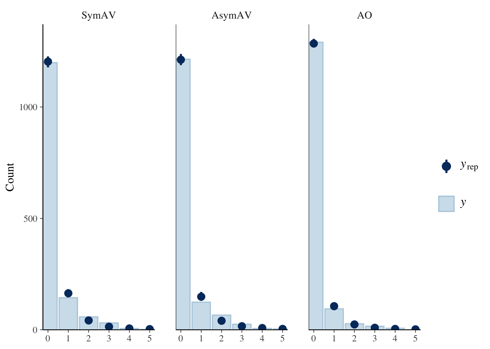<!-- -->

``` r
pp_check(zinb_align_cond_round, ndraws = 100,
         type = "bars_grouped", group = "round") +
  coord_cartesian(xlim = c(0, 5))
```

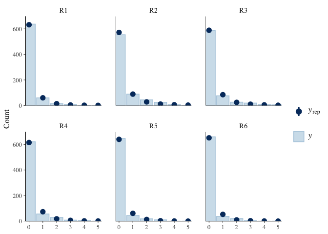<!-- -->

The posterior predictive check shows that the model generates data that
are similar to the observed data, demonstrating good model fit.

<br>

### 7.2.5 Hypothesis testing: Bayes factor

``` r
### varying priors for sensitivity analysis
prior_size = c("xs", "s", "m", "l", "xl")
prior_sd = c(0.05, 0.1, 0.2, 0.3, 0.5)


### list of hypotheses
hps = c("lex_align_c = 0",
        "lex_align_c:conditionAO_Asym = 0",
        "lex_align_c:conditionAsym_Sym = 0",
        "lex_align_c:conditionAO_Asym + lex_align_c:conditionAsym_Sym = 0")
effects = c("N. lex align", "AO--AsymAV:N. lex align", 
            "AsymAV--SymAV:N. lex align", "AO--SymAV:N. lex align")

for (i in 1:length(prior_sd)){
  priors = c(
    prior(normal(-1.2, 0.5), class = Intercept),
    prior(normal(0, 0.5), class = b),
    prior(normal(0, 0.2), class = b, coef = "n_iconic_c"),
    set_prior(paste0("normal(0,", prior_sd[i], ")"), 
              class = "b", coef = "lex_align_c"),
    set_prior(paste0("normal(0,", prior_sd[i], ")"), 
              class = "b", coef = "lex_align_c:conditionAO_Asym"),
    set_prior(paste0("normal(0,", prior_sd[i], ")"), 
              class = "b", coef = "lex_align_c:conditionAsym_Sym"),
    prior(normal(0, 0.5), class = sd),
    prior(lkj(2), class = cor),
    prior(normal(0, 0.5), class = zi),
    prior(normal(0, 50), class = shape))
  
  fname = paste0("models/speakerB/gest_alignment/zinb_align_cond_round_", prior_size[i])
  fname = gsub("_m", "", fname) # remove "_m" for the medium prior
  
  fit = brm(num_gestural_align ~ 
              1 + lex_align_c * condition + round + n_iconic_c + role +
              (1+round|pair) + (1|target),
            family = zero_inflated_negbinomial(),
            prior = priors,
            data = df_trial_info,
            sample_prior = T,
            save_pars = save_pars(all = TRUE),
            warmup = nwu, iter = niter,
            control = list(adapt_delta = 0.9, 
                           max_treedepth = 15),
            file = fname)
  
  ### compute BFs for all hypotheses and store them as dataframe
  for (j in 1:length(hps)){
    h = hypothesis(fit, hps[j])
    # transform the result to dataframe
    result = data_frame(h$hypothesis) %>%
      mutate(size = prior_size[i],
             sd = prior_sd[i],
             Effect = effects[j])
    # combine the result
    if (i==1 & j==1){
      df_results = result
    } else {
      df_results = rbind(df_results, result)}
  }
}

df_bf_lex = df_results %>%
  mutate(prior = paste0("N(0, ", sd, ")"),
         BF10 = 1 / abs(Evid.Ratio),
         Effect = factor(Effect,
                         levels = effects),
         Predictor = factor(ifelse(grepl(":N. lex align", Effect), "Interaction", "N. lex align"),
                            levels = c("N. lex align", "Interaction")),
         across(where(is.numeric), ~ round(., 3)),
         Star = ifelse(BF10 >= 30 | BF10 <= 1/30, "***",
                       ifelse(BF10 >= 10 | BF10 <= 1/10, "**",
                              ifelse(BF10 >= 3 | BF10 <= 1/3, "*", ""))),
         Star = ifelse(BF10 < 1, str_replace_all(Star, "[*]", "="), Star)) %>% 
  dplyr::select(size, sd, prior, Effect, Predictor,
                Estimate, Est.Error, `CI.Lower`, `CI.Upper`, BF10, Star) %>% 
  arrange(Effect, sd)

df_bf_lex
```

    ## # A tibble: 20 × 11
    ##    size     sd prior      Effect  Predictor Estimate Est.Error CI.Lower CI.Upper
    ##    <chr> <dbl> <chr>      <fct>   <fct>        <dbl>     <dbl>    <dbl>    <dbl>
    ##  1 xs     0.05 N(0, 0.05) N. lex… N. lex a…    0.197     0.029    0.139    0.255
    ##  2 s      0.1  N(0, 0.1)  N. lex… N. lex a…    0.265     0.035    0.197    0.334
    ##  3 m      0.2  N(0, 0.2)  N. lex… N. lex a…    0.291     0.037    0.218    0.364
    ##  4 l      0.3  N(0, 0.3)  N. lex… N. lex a…    0.296     0.038    0.223    0.371
    ##  5 xl     0.5  N(0, 0.5)  N. lex… N. lex a…    0.299     0.038    0.225    0.375
    ##  6 xs     0.05 N(0, 0.05) AO--As… Interact…    0.028     0.043   -0.055    0.112
    ##  7 s      0.1  N(0, 0.1)  AO--As… Interact…    0.038     0.064   -0.088    0.164
    ##  8 m      0.2  N(0, 0.2)  AO--As… Interact…    0.044     0.079   -0.111    0.201
    ##  9 l      0.3  N(0, 0.3)  AO--As… Interact…    0.046     0.083   -0.116    0.21 
    ## 10 xl     0.5  N(0, 0.5)  AO--As… Interact…    0.047     0.086   -0.12     0.216
    ## 11 xs     0.05 N(0, 0.05) AsymAV… Interact…   -0.001     0.04    -0.078    0.077
    ## 12 s      0.1  N(0, 0.1)  AsymAV… Interact…   -0.013     0.056   -0.123    0.097
    ## 13 m      0.2  N(0, 0.2)  AsymAV… Interact…   -0.023     0.066   -0.152    0.108
    ## 14 l      0.3  N(0, 0.3)  AsymAV… Interact…   -0.026     0.068   -0.16     0.109
    ## 15 xl     0.5  N(0, 0.5)  AsymAV… Interact…   -0.027     0.07    -0.166    0.109
    ## 16 xs     0.05 N(0, 0.05) AO--Sy… Interact…    0.028     0.054   -0.078    0.134
    ## 17 s      0.1  N(0, 0.1)  AO--Sy… Interact…    0.025     0.073   -0.117    0.169
    ## 18 m      0.2  N(0, 0.2)  AO--Sy… Interact…    0.021     0.083   -0.14     0.183
    ## 19 l      0.3  N(0, 0.3)  AO--Sy… Interact…    0.02      0.084   -0.144    0.186
    ## 20 xl     0.5  N(0, 0.5)  AO--Sy… Interact…    0.02      0.086   -0.149    0.191
    ## # ℹ 2 more variables: BF10 <dbl>, Star <chr>

``` r
#### Plot BFs ####
ggplot(filter(df_bf_lex, Effect != "N. lex align"),
       aes(x = factor(sd), y = BF10, group = Effect)) +
  geom_hline(yintercept = 1, linetype="dashed") +
  geom_point(aes(color=Effect)) +
  geom_line(aes(color=Effect)) +
  facet_wrap(vars(Predictor)) +
  theme_clean(base_size = 15) +
  theme(axis.text.x = element_text(colour = "black", size = 14),
        axis.text.y = element_text(colour = "black", size = 14),
        axis.title = element_text(size = 13, face = 'bold'),
        axis.title.x = element_text(vjust = -2),
        axis.title.y = element_text(vjust = 2),
        legend.position = "right",
        strip.text = element_text(size = 14, face = 'bold'),
        plot.background = element_blank(),
        plot.margin = unit(c(1.1,1.1,1.1,1.1), "lines")) +
  scale_y_log10("Bayes factor (BF10)",
                breaks = c(0.001, 0.03, 0.01, 0.1, 0.33, 1, 3, 10, 30, 100),
                labels = c(0.001, 0.03, 0.01, 0.1, 0.33, 1, 3, 10, 30, 100)) +
  xlab("SD for the prior")
```

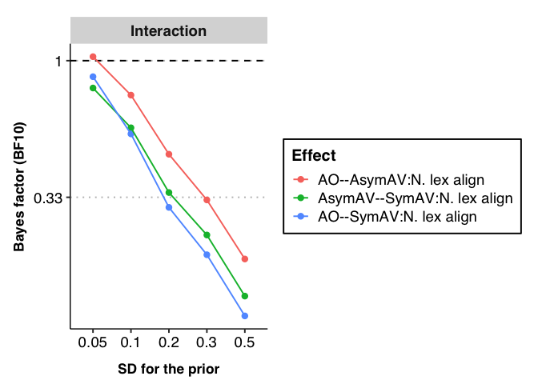<!-- -->

### 7.2.6 Plot effects of lex alignment on gestural alignment

``` r
plot_predictions(model,
                 type = "response",
                 condition = c("lex_align_c", "condition"))
```

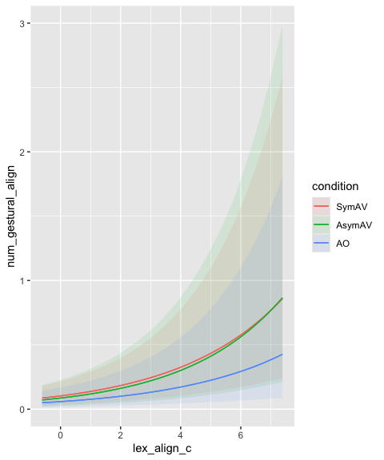<!-- -->

``` r
### generate model predictions
df_pred = 
  predictions(model,
              by = c("lex_align_c", "condition"),
              newdata = datagrid(condition = unique,
                                 lex_align_c = seq(from = min(df_trial_info$lex_align_c),
                                                   to = max(df_trial_info$lex_align_c)))) %>% 
  mutate(num_lex_align = round(lex_align_c + mean(df_trial_info$num_lex_align), 0))

### aggregate data for plotting
mean_lex_gest_by_cond = df_trial_info %>% 
  group_by(pair, condition, num_lex_align) %>% 
  summarize(num_gestural_align = mean(num_gestural_align)) %>% 
  ungroup()

### plot data with model predictions
lex_gest_cor = 
  ggplot(data = mean_lex_gest_by_cond,
         aes(x = num_lex_align, y = num_gestural_align, 
             color = condition, fill = condition)) +
  geom_jitter(size = 1, alpha = 0.7,
              width = 0.1, height = 0.1) +
  geom_ribbon(data = df_pred,
              aes(y = estimate, 
                  ymin = conf.low, ymax = conf.high),
              alpha = 0.2, color = NA) +
  geom_line(data = df_pred,
            aes(y = estimate),
            linewidth = 1) +
  # scale_x_continuous(limits = c(0, 8)) +
  # scale_y_continuous(limits = c(0, 5)) +
  labs(x = "Mean N. lexical alignment per trial",
       y = "Mean N. gestural alignment per trial") +
  scale_fill_manual(values = c("#ED6B06", "#00786A", "darkgrey")) +
  scale_color_manual(values = c("#ED6B06", "#00786A", "darkgrey")) +
  theme_clean(base_size = 14) +
  theme(axis.text.x = element_text(colour = "black", size = 14),
        axis.text.y = element_text(colour = "black", size = 14),
        axis.title = element_text(size = 13, face = 'bold'),
        axis.title.x = element_text(vjust = -2),
        axis.title.y = element_text(vjust = 2),
        strip.text = element_text(size = 14, face = 'bold'),
        legend.position = "top",
        legend.title = element_text(size = 13),
        plot.background = element_blank(),
        plot.margin = unit(c(1.1,1.1,1.1, 1.1), "lines"))

lex_gest_cor
```

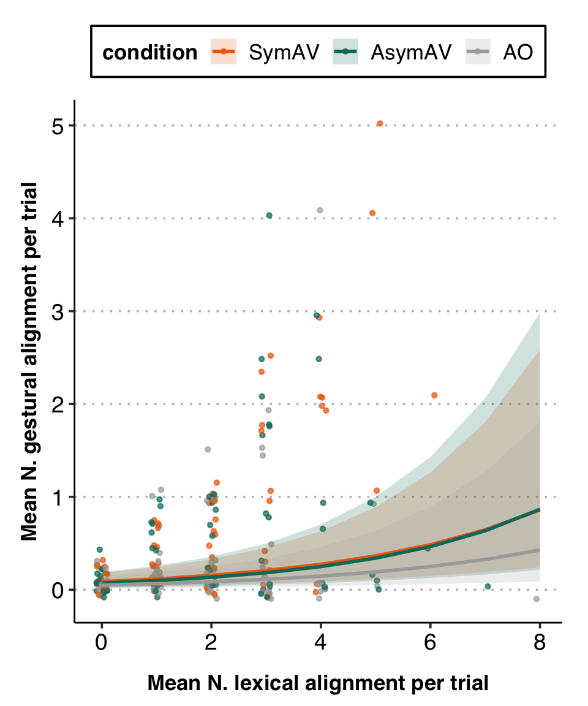<!-- -->

Although the data shows a clear positive correlation between lexical
alignment and gestural alignment, the model predictions show that the
effect is relatively small. This is likely due to the inclusion of other
predictors in the model (e.g., n_iconic_gestures, role), which account
for some of the variance in gestural alignment.

<br>

### 7.2.7 Calculate effect size of lexical alignment on gestural alignment

To avoid confounding, we modeled the effect of lexical alignment on the
**number** of gestural alignment. However, we will model the others
effects on the **rate** of gestural alignment (i.e., number of gestural
alignment per iconic gesture). To understand the effect size of lexical
alignment on the rate scale so that we can compare it with the effects
of other predictors, we will (1) calculate the effect size on the count
scale (i.e., response scale), and (2) calculate the proportion of
gestural alignment explained by lexical alignment.

The effect size on count scale can be calculated by counterfactual
comparisons: we first calculate the predicted number of gestural
alignment when the number of lexical alignment is 0 (i.e., lex_0) and
when the number of lexical alignment is at the mean (i.e., intercept),
and then we calculate the effect size as the difference between
intercept and lex_0. This is equivalent to checking how much the number
of gestural alignment changes when the number of lexical alignment
changes from 0 to the mean, while holding other predictors constant.

The proportion of gestural alignment explained by lexical alignment can
be calculated by dividing the effect size on the count scale by the
predicted number of gestural alignment (i.e., intercept).

``` r
### draw posterior samples for the fixed effects
post_sample = as_draws_df(model) %>% 
  as_tibble() %>% 
  dplyr::select(starts_with("b_"))


### calculate the effect size of lexical alignment on the count scale
lex_align_0_c = 0 - mean(df_trial_info$num_lex_align)

intercept = exp(post_sample$b_Intercept) 
lex_0 = exp(post_sample$b_Intercept + 
              post_sample$b_lex_align_c * lex_align_0_c)

lex_effect_size_count = intercept - lex_0

# summary of the effect size on the count scale (mean, median, 95% credible interval)
effect_size_count_summary = data_frame(
  mean = mean(lex_effect_size_count),
  median = median(lex_effect_size_count),
  ci_lower = quantile(lex_effect_size_count, 0.025),
  ci_upper = quantile(lex_effect_size_count, 0.975))
effect_size_count_summary
```

    ## # A tibble: 1 × 4
    ##     mean median ci_lower ci_upper
    ##    <dbl>  <dbl>    <dbl>    <dbl>
    ## 1 0.0136 0.0134  0.00869   0.0201

``` r
### calculate the proportion of gestural alignment explained by lexical alignment
effect_size_prop = lex_effect_size_count / intercept
effect_size_prop_summary = data_frame(
  mean = mean(effect_size_prop),
  median = median(effect_size_prop),
  ci_lower = quantile(effect_size_prop, 0.025),
  ci_upper = quantile(effect_size_prop, 0.975))
effect_size_prop_summary
```

    ## # A tibble: 1 × 4
    ##    mean median ci_lower ci_upper
    ##   <dbl>  <dbl>    <dbl>    <dbl>
    ## 1 0.163  0.163    0.125    0.199

``` r
### generate model predictions per condition
df_pred = post_sample %>% 
  mutate(SymAV = exp(b_Intercept + 1/3*b_conditionAO_Asym + 2/3*b_conditionAsym_Sym),
         AsymAV = exp(b_Intercept + 1/3*b_conditionAO_Asym - 1/3*b_conditionAsym_Sym),
         AO = exp(b_Intercept -2/3*b_conditionAO_Asym -1/3*b_conditionAsym_Sym)) %>% 
  dplyr::select(SymAV, AsymAV, AO) %>%
  pivot_longer(cols = everything(), 
               names_to = "condition", values_to = "predicted") %>%
  mutate(condition = factor(condition, 
                            levels = c("SymAV", "AsymAV", "AO"))) %>% 
  group_by(condition) %>%
  summarize(mean = mean(predicted),
            median = median(predicted),
            ci_lower = quantile(predicted, 0.025),
            ci_upper = quantile(predicted, 0.975))

df_pred
```

    ## # A tibble: 3 × 5
    ##   condition   mean median ci_lower ci_upper
    ##   <fct>      <dbl>  <dbl>    <dbl>    <dbl>
    ## 1 SymAV     0.108  0.105    0.0617    0.176
    ## 2 AsymAV    0.0916 0.0890   0.0541    0.144
    ## 3 AO        0.0630 0.0605   0.0352    0.105

On average, 16.3% of gestural alignment can be explained by lexical
alignment, with a 95% credible interval of \[12.5%, 19.9%\]. This
suggests that lexical alignment is an important predictor of gestural
alignment, but it is not the only factor that contributes to gestural
alignment.

<br>

### 7.2.8 Visualize model predictions together with data

``` r
bp_mean_gest_alignment_model = 
  bp_mean_gest_alignment +
  geom_ribbon(data = df_pred,
              aes(x = condition, y = mean, 
                  ymin = ci_lower, ymax = ci_upper, group = 1),
              fill = "black", alpha = 0.2) +
  geom_line(data = df_pred,
            aes(x = condition, y = mean, group = 1),
            color = "black", size = 0.8)

bp_mean_gest_alignment_model
```

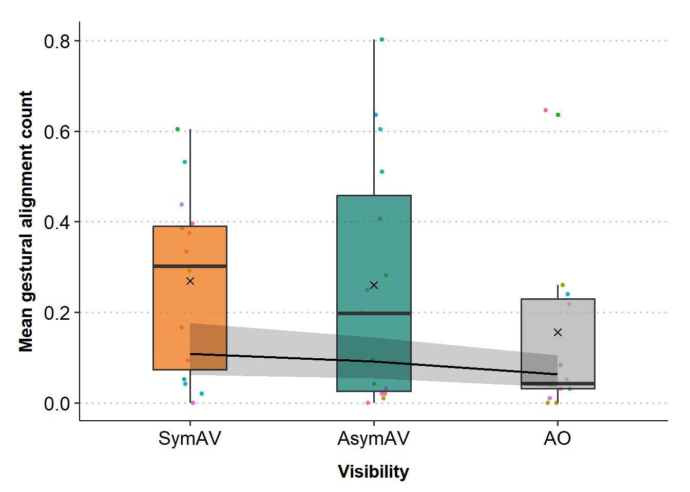<!-- -->

The misalignment between the descriptive statistics (based on mean per
pair) and the model predictions (based on mean per trial) arises because
mixed-effects models regularizes the estimates for each pair and trial
towards the overall mean, especially when the number of trials for a
pair is small or when the participant shows extreme values (e.g., very
high or low number of gestural alignment). This is actually a good
property of mixed-effects models, as it prevents overfitting and
provides more accurate estimates of the fixed effects.

Despite the misalignment, our primary goal of this modeling was to
estimate the effect of lexical alignment on gestural alignment while
controlling for other predictors, so we will proceed with this model.

<br>

------------------------------------------------------------------------

# 8. Correlation btw lexical and gestural alignment

``` r
cor = pcor.test(df_trial_info$lex_align_c, 
                df_trial_info$num_gestural_align,
                df_trial_info$log_round_c)
cor
```

    ##   estimate   p.value statistic    n gp  Method
    ## 1    0.328 1.89e-108      22.8 4315  1 pearson

<br>

------------------------------------------------------------------------

# 9. Gestural alignment rate per iconic gestures (n_gest_alignment / n_iconic)

We can analyze the proportion of gestural alignment in two ways: (1)
modeling the rate of gestural alignment per iconic gesture using a
negative binomial regression model and (2) modeling the probability of
gestural alignment using a zero-one-inflated beta regression model.

Key differences in the two models are that the negative binomial
regression model assumes that the rate of gestural alignment is a count
variable, while the zero-one-inflated beta regression model assumes that
the proportion of gestural alignment is a continuous variable bounded
between 0 and 1. Also, while negative binomial regression models the
rate of events, the zero-one-inflated beta regression models the
probability of events. In the case of the proportion of gestural
alignment, two models should yield similar results, but it is important
to note that the two models are conceptually different.

As it is a common practice to analyze the frequency measures (e.g.,
number of gestures) as rates, we will use negative binomial regressions.

<br>

## 9.1 DataViz: proportion of gestural alignment

### bp: mean by condition

``` r
bp_mean_gest_alignment_prop_by_cond = 
  ggplot(data=trial_info_pair, 
         aes(x=condition, y=mean_gest_align_prop, fill=condition)) +
  geom_jitter(aes(color = pair), 
              size = 1, alpha = 1, 
              width = 0.07, height = 0) +
  geom_boxplot(width = .3,
               outlier.shape = NA, alpha = 0.7) +
  geom_point(data = trial_info_cond, 
             aes(y = mean_gest_align_prop), 
             shape = 21, size = 3, fill = "white") +
  scale_fill_manual(values = c("#ED6B06", "#00786A", "darkgrey")) +
  labs(x = "Visibility",
       y = "Mean gest align rate") +
  theme_clean(base_size = 15) +
  theme(axis.text.x = element_text(colour = "black", size = 14),
        axis.text.y = element_text(colour = "black", size = 14),
        axis.title = element_text(size = 13, face = 'bold'),
        axis.title.x = element_text(vjust = -2),
        axis.title.y = element_text(vjust = 2),
        legend.position = "none",
        strip.text = element_text(size = 14, face = 'bold'),
        plot.background = element_blank(),
        plot.margin = unit(c(1.1,1.1,1.1,1.1), "lines"))

interactive_plot(bp_mean_gest_alignment_prop_by_cond)
```

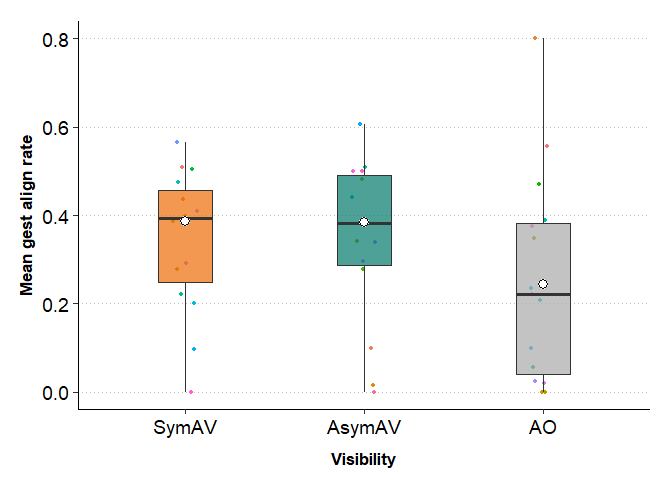<!-- -->

<br>

### bp: mean by condition and round

``` r
pd = position_dodge(width = .75)

bp_mean_gest_alignment_prop_by_round_cond = 
  ggplot(data=trial_info_pair_round, 
         aes(x=round_n, y=mean_gest_align_prop, fill = condition)) +
  geom_jitter(aes(color = pair), 
              size = 0.5, alpha = 0.7, 
              width = 0.07, height = 0) +
  geom_boxplot(width = .5,
               outlier.shape = NA, alpha = 0.7) +
  geom_point(data = trial_info_cond_round, 
             aes(y = mean_gest_align_prop),
             position = pd,
             shape = 21, size = 2, fill = "white") +
  scale_fill_manual(values = c("#ED6B06", "#00786A", "darkgrey")) +
  scale_y_continuous(limits = c(0, 1)) +
  labs(x = "Round",
       y = "Mean gest align rate") +
  theme_clean(base_size = 15) +
  theme(axis.text.x = element_text(colour = "black", size = 14),
        axis.text.y = element_text(colour = "black", size = 14),
        axis.title = element_text(size = 13, face = 'bold'),
        axis.title.x = element_text(vjust = -2),
        axis.title.y = element_text(vjust = 2),
        legend.position = "none",
        strip.background = element_blank(),
        strip.text = element_text(size = 14, face = 'bold'),
        plot.background = element_blank(),
        plot.margin = unit(c(1.1,1.1,1.1,1.1), "lines")) +
  facet_grid(cols = vars(condition))

interactive_plot(bp_mean_gest_alignment_prop_by_round_cond)
```

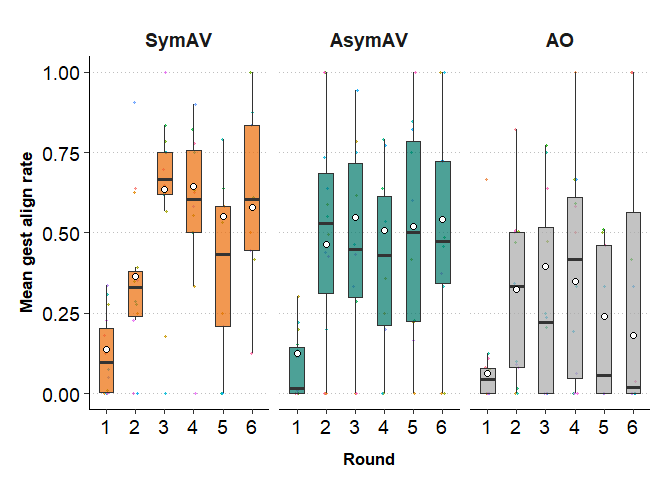<!-- -->

<br>

## 9.2 Prepare data

To model the proportion of gestural alignment, we need to remove trials
where the number of iconic gestures is 0. This is because dividing any
numbers by 0 results in an undefined value (NA) and prevents model from
running.

``` r
df_gest_align_posreg_prop = df_trial_info %>%
  filter(num_iconic_gestures > 0)

print(paste0("Number of rows before removing trials with no iconic gestures: ", 
             nrow(df_trial_info)))
```

    ## [1] "Number of rows before removing trials with no iconic gestures: 4315"

``` r
print(paste0("Number of rows after removing trials with no iconic gestures: ",
             nrow(df_gest_align_posreg_prop)))
```

    ## [1] "Number of rows after removing trials with no iconic gestures: 1264"

``` r
print(paste0("Number of removed trials: ", 
             nrow(df_trial_info) - nrow(df_gest_align_posreg_prop)))
```

    ## [1] "Number of removed trials: 3051"

<br>

## 9.3 Negative binomial regression models

### 9.3.1 Prior specification

We will set priors based on Akamine et al. (2024). As mentioned in the
previous analysis, they detected 4413 iconic gestures and 1086 instances
of gestural alignment. Dividing the number of gestural alignment by the
number of iconic gestures gives 0.25 (1086/4413) (-1.39 on the log
scale). This means that we expect 1 gestural alignment per 4 iconic
gestures.

For the slope parameters, we set the mean of 0 with a SD of 0.5. This
means that for example, we expect the mean difference between the AO and
AsymAV conditions to range from -0.16 to 0.43.

``` r
### pair
priors_rint_gest_align_prop = c(
  prior(normal(-1.39, 0.5), class = Intercept),
  prior(normal(0, 0.5), class = b),
  prior(normal(0, 50), class = shape),
  prior(normal(0, 0.5), class = sd))

priors_rslope_gest_align_prop = c(
  prior(normal(-1.39, 0.5), class = Intercept),
  prior(normal(0, 0.5), class = b),
  prior(normal(0, 50), class = shape),
  prior(normal(0, 0.5), class = sd),
  prior(lkj(2), class = cor))

priors_rslope_gest_align_prop_zinb = c(
  prior(normal(-1.39, 0.5), class = Intercept),
  prior(normal(0, 0.5), class = b),
  prior(normal(0, 0.5), class = sd),
  prior(lkj(2), class = cor),
  prior(normal(0, 0.5), class = zi), # on the logit scale
  prior(normal(0, 50), class = shape))
```

<br>

### 9.3.2 Model comparison

#### Round

``` r
nb_align_rate_cond_round = brm(num_gestural_align | rate(num_iconic_gestures) ~ 
                                 1 + condition * round + lex_align_c + role +
                                 (1+round|pair) + (1|target),
                               family = negbinomial(),
                               prior = priors_rslope_gest_align_prop,
                               data = df_gest_align_posreg_prop,
                               sample_prior = T,
                               save_pars = save_pars(all = TRUE),
                               warmup = nwu, iter = niter,
                               control = list(adapt_delta = 0.9, 
                                              max_treedepth = 15),
                               file = "models/speakerB/gest_alignment/nb_align_rate_cond_round")

nb_align_rate_cond_round_c = brm(num_gestural_align | rate(num_iconic_gestures) ~ 
                                   1 + condition * round_c + lex_align_c + role +
                                   (1+round_c|pair) + (1|target),
                                 family = negbinomial(),
                                 prior = priors_rslope_gest_align_prop,
                                 data = df_gest_align_posreg_prop,
                                 sample_prior = T,
                                 save_pars = save_pars(all = TRUE),
                                 warmup = nwu, iter = niter,
                                 control = list(adapt_delta = 0.9, 
                                                max_treedepth = 15),
                                 file = "models/speakerB/gest_alignment/nb_align_rate_cond_round_c")

nb_align_rate_cond_round_log = brm(num_gestural_align | rate(num_iconic_gestures) ~ 
                                     1 + condition * log_round_c + lex_align_c + role +
                                     (1+log_round_c|pair) + (1|target),
                                   family = negbinomial(),
                                   prior = priors_rslope_gest_align_prop,
                                   data = df_gest_align_posreg_prop,
                                   sample_prior = T,
                                   save_pars = save_pars(all = TRUE),
                                   warmup = nwu, iter = niter,
                                   control = list(adapt_delta = 0.9, 
                                                  max_treedepth = 15),
                                   file = "models/speakerB/gest_alignment/nb_align_rate_cond_round_log")


### loo compare
if (!file.exists("models/speakerB/gest_alignment/loo_nb_align_rate_cond_round.rds")){
  nb_cond_round_loo = loo(nb_align_rate_cond_round)
  saveRDS(nb_cond_round_loo, file = "models/speakerB/gest_alignment/loo_nb_align_rate_cond_round.rds")
}

if (!file.exists("models/speakerB/gest_alignment/loo_nb_align_rate_cond_round_c.rds")){
  nb_cond_round_c_loo = loo(nb_align_rate_cond_round_c)
  saveRDS(nb_cond_round_c_loo, file = "models/speakerB/gest_alignment/loo_nb_align_rate_cond_round_c.rds")
}

if (!file.exists("models/speakerB/gest_alignment/loo_nb_align_rate_cond_round_log.rds")){
  nb_cond_round_log_loo = loo(nb_align_rate_cond_round_log)
  saveRDS(nb_cond_round_log_loo, file = "models/speakerB/gest_alignment/loo_nb_align_rate_cond_round_log.rds")
}

nb_cond_round_loo = readRDS("models/speakerB/gest_alignment/loo_nb_align_rate_cond_round.rds")
nb_cond_round_c_loo = readRDS("models/speakerB/gest_alignment/loo_nb_align_rate_cond_round_c.rds")
nb_cond_round_log_loo = readRDS("models/speakerB/gest_alignment/loo_nb_align_rate_cond_round_log.rds")

loo_compare(nb_cond_round_loo, nb_cond_round_c_loo, nb_cond_round_log_loo)
```

    ##                              elpd_diff se_diff
    ## nb_align_rate_cond_round        0.0       0.0 
    ## nb_align_rate_cond_round_log  -72.5      11.9 
    ## nb_align_rate_cond_round_c   -133.9      17.1

The leave-one-out (LOO) Effect shows that the backward-difference coded
round provides a far larger predictive power (elpd_diff) and a far
smaller standard error (se_diff) compared to the centered round or
centered log-transformed round. Thus, we will use the bd coded round as
a predictor for further analyses.

<br>

#### ZI or not

``` r
zinb_align_rate_cond_round = brm(num_gestural_align ~ 
                                   1 + condition * round + lex_align_c + role +
                                   offset(log(num_iconic_gestures)) +
                                   (1+round|pair) + (1|target),
                                 family = zero_inflated_negbinomial(),
                                 prior = priors_rslope_gest_align_prop_zinb,
                                 data = df_gest_align_posreg_prop,
                                 sample_prior = T,
                                 warmup = nwu, iter = niter,
                                 control = list(adapt_delta = 0.9, 
                                                max_treedepth = 15),
                                 file = "models/speakerB/gest_alignment/zinb_align_rate_cond_round")


### loo compare
if (!file.exists("models/speakerB/gest_alignment/loo_zinb_align_rate_cond_round.rds")){
  zinb_cond_round_c_loo = loo(zinb_align_rate_cond_round)
  saveRDS(zinb_cond_round_c_loo, file = "models/speakerB/gest_alignment/loo_zinb_align_rate_cond_round.rds")
}

nb_cond_round_c_loo = readRDS("models/speakerB/gest_alignment/loo_nb_align_rate_cond_round.rds")
zinb_cond_round_c_loo = readRDS("models/speakerB/gest_alignment/loo_zinb_align_rate_cond_round.rds")

loo_compare(nb_cond_round_c_loo, zinb_cond_round_c_loo)
```

    ##                            elpd_diff se_diff
    ## nb_align_rate_cond_round    0.0       0.0   
    ## zinb_align_rate_cond_round -1.4       0.4

The loo comparsion shows that non-inflation model has a higher
predictive power than the zero-inflation model. As such, we will use NB
regression models for further analyses.

<br>

### 9.3.3 Prior predictive check

``` r
nb_gest_align_prop_prior = brm(num_gestural_align | rate(num_iconic_gestures) ~
                                 1 + condition + round + lex_align_c + role +
                                 (1+round|pair) + (1|target),
                               family = negbinomial(),
                               prior = priors_rslope_gest_align_prop,
                               data = df_gest_align_posreg_prop,
                               sample_prior = "only",
                               control = list(adapt_delta = 0.9, 
                                              max_treedepth = 20),
                               file = "models/speakerB/gest_alignment/nb_gest_align_prop_prior")

pp_check(nb_gest_align_prop_prior, ndraws = 100, 
         type = "bars_grouped", group = "condition") +
  coord_cartesian(xlim = c(0, 10))
```

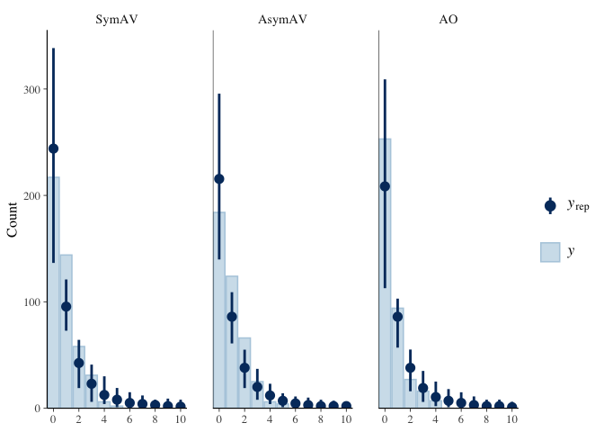<!-- -->

The prior predictive check shows that the model generates data that are
somewhat similar to the observed data, demonstrating that the priors are
reasonable.

<br>

### 9.3.4 Fit the model

``` r
nb_align_rate_cond_round = 
  brm(num_gestural_align | rate(num_iconic_gestures) ~ 
        1 + condition * round + lex_align_c + role +
        (1+round|pair) + (1|target),
      family = negbinomial(),
      prior = priors_rslope_gest_align_prop,
      data = df_gest_align_posreg_prop,
      sample_prior = T,
      save_pars = save_pars(all = TRUE),
      warmup = nwu, iter = niter,
      control = list(adapt_delta = 0.9, 
                     max_treedepth = 15),
      file = "models/speakerB/gest_alignment/nb_align_rate_cond_round")

model = nb_align_rate_cond_round
summary(model)
```

    ##  Family: negbinomial 
    ##   Links: mu = log 
    ## Formula: num_gestural_align | rate(num_iconic_gestures) ~ 1 + condition * round + lex_align_c + role + (1 + round | pair) + (1 | target) 
    ##    Data: df_gest_align_posreg_prop (Number of observations: 1264) 
    ##   Draws: 4 chains, each with iter = 20000; warmup = 2000; thin = 1;
    ##          total post-warmup draws = 72000
    ## 
    ## Multilevel Hyperparameters:
    ## ~pair (Number of levels: 45) 
    ##                         Estimate Est.Error l-95% CI u-95% CI Rhat Bulk_ESS
    ## sd(Intercept)               0.65      0.11     0.46     0.90 1.00    21086
    ## sd(roundR12)                0.37      0.17     0.04     0.72 1.00    17598
    ## sd(roundR23)                0.11      0.08     0.00     0.31 1.00    30412
    ## sd(roundR34)                0.11      0.09     0.00     0.32 1.00    33413
    ## sd(roundR45)                0.17      0.12     0.01     0.45 1.00    26547
    ## sd(roundR56)                0.25      0.17     0.01     0.64 1.00    25128
    ## cor(Intercept,roundR12)     0.11      0.29    -0.47     0.64 1.00    63968
    ## cor(Intercept,roundR23)    -0.01      0.33    -0.63     0.63 1.00    91834
    ## cor(roundR12,roundR23)     -0.06      0.33    -0.66     0.59 1.00    69885
    ## cor(Intercept,roundR34)    -0.07      0.34    -0.69     0.59 1.00    85044
    ## cor(roundR12,roundR34)     -0.06      0.33    -0.67     0.59 1.00    72391
    ## cor(roundR23,roundR34)     -0.04      0.33    -0.66     0.61 1.00    63507
    ## cor(Intercept,roundR45)     0.02      0.33    -0.61     0.64 1.00    87625
    ## cor(roundR12,roundR45)      0.03      0.33    -0.60     0.64 1.00    63588
    ## cor(roundR23,roundR45)      0.00      0.33    -0.63     0.63 1.00    54163
    ## cor(roundR34,roundR45)     -0.03      0.33    -0.65     0.61 1.00    52871
    ## cor(Intercept,roundR56)    -0.07      0.33    -0.67     0.57 1.00    79111
    ## cor(roundR12,roundR56)      0.00      0.33    -0.62     0.62 1.00    61216
    ## cor(roundR23,roundR56)     -0.02      0.33    -0.65     0.62 1.00    53120
    ## cor(roundR34,roundR56)     -0.00      0.33    -0.63     0.63 1.00    51432
    ## cor(roundR45,roundR56)     -0.02      0.33    -0.65     0.62 1.00    50780
    ##                         Tail_ESS
    ## sd(Intercept)              37738
    ## sd(roundR12)               14697
    ## sd(roundR23)               31325
    ## sd(roundR34)               32444
    ## sd(roundR45)               32465
    ## sd(roundR56)               29115
    ## cor(Intercept,roundR12)    51402
    ## cor(Intercept,roundR23)    52909
    ## cor(roundR12,roundR23)     53430
    ## cor(Intercept,roundR34)    53772
    ## cor(roundR12,roundR34)     55527
    ## cor(roundR23,roundR34)     56199
    ## cor(Intercept,roundR45)    53607
    ## cor(roundR12,roundR45)     56174
    ## cor(roundR23,roundR45)     56077
    ## cor(roundR34,roundR45)     58994
    ## cor(Intercept,roundR56)    53182
    ## cor(roundR12,roundR56)     54035
    ## cor(roundR23,roundR56)     55885
    ## cor(roundR34,roundR56)     55300
    ## cor(roundR45,roundR56)     57829
    ## 
    ## ~target (Number of levels: 16) 
    ##               Estimate Est.Error l-95% CI u-95% CI Rhat Bulk_ESS Tail_ESS
    ## sd(Intercept)     0.07      0.05     0.00     0.17 1.00    24855    27141
    ## 
    ## Regression Coefficients:
    ##                            Estimate Est.Error l-95% CI u-95% CI Rhat Bulk_ESS
    ## Intercept                     -1.11      0.12    -1.36    -0.88 1.00    16807
    ## conditionAO_Asym               0.51      0.25     0.02     0.98 1.00    18974
    ## conditionAsym_Sym              0.02      0.23    -0.44     0.49 1.00    15933
    ## roundR12                       1.70      0.14     1.42     1.97 1.00    56734
    ## roundR23                       0.36      0.10     0.18     0.55 1.00    63234
    ## roundR34                      -0.00      0.11    -0.22     0.21 1.00    56816
    ## roundR45                      -0.10      0.13    -0.36     0.16 1.00    59335
    ## roundR56                      -0.15      0.16    -0.47     0.18 1.00    58659
    ## lex_align_c                    0.05      0.03    -0.00     0.11 1.00    80088
    ## role1                          0.76      0.10     0.57     0.95 1.00    95617
    ## conditionAO_Asym:roundR12     -0.13      0.29    -0.71     0.44 1.00    60011
    ## conditionAsym_Sym:roundR12    -0.16      0.25    -0.65     0.35 1.00    57999
    ## conditionAO_Asym:roundR23     -0.02      0.21    -0.43     0.39 1.00    60027
    ## conditionAsym_Sym:roundR23     0.22      0.19    -0.16     0.60 1.00    61835
    ## conditionAO_Asym:roundR34     -0.05      0.23    -0.50     0.41 1.00    56057
    ## conditionAsym_Sym:roundR34     0.06      0.21    -0.35     0.47 1.00    58737
    ## conditionAO_Asym:roundR45      0.14      0.27    -0.39     0.67 1.00    63346
    ## conditionAsym_Sym:roundR45    -0.10      0.24    -0.58     0.38 1.00    61993
    ## conditionAO_Asym:roundR56      0.42      0.32    -0.21     1.05 1.00    72433
    ## conditionAsym_Sym:roundR56     0.07      0.28    -0.49     0.62 1.00    73622
    ##                            Tail_ESS
    ## Intercept                     31473
    ## conditionAO_Asym              34023
    ## conditionAsym_Sym             29667
    ## roundR12                      54551
    ## roundR23                      56243
    ## roundR34                      54612
    ## roundR45                      54190
    ## roundR56                      53561
    ## lex_align_c                   55517
    ## role1                         53785
    ## conditionAO_Asym:roundR12     52917
    ## conditionAsym_Sym:roundR12    52033
    ## conditionAO_Asym:roundR23     54364
    ## conditionAsym_Sym:roundR23    55893
    ## conditionAO_Asym:roundR34     54240
    ## conditionAsym_Sym:roundR34    54102
    ## conditionAO_Asym:roundR45     57025
    ## conditionAsym_Sym:roundR45    57614
    ## conditionAO_Asym:roundR56     57051
    ## conditionAsym_Sym:roundR56    58041
    ## 
    ## Further Distributional Parameters:
    ##       Estimate Est.Error l-95% CI u-95% CI Rhat Bulk_ESS Tail_ESS
    ## shape    67.42     28.92    23.06   133.77 1.00    98480    49788
    ## 
    ## Draws were sampled using sample(hmc). For each parameter, Bulk_ESS
    ## and Tail_ESS are effective sample size measures, and Rhat is the potential
    ## scale reduction factor on split chains (at convergence, Rhat = 1).

``` r
# bayestestR::hdi(model)
# bayestestR::hdi(model, ci = 0.89)
```

The coefficients show that the proportion of gestural alignment was
significantly higher in the SymAV condition than in the AO condition.
Also, the rate of gestural alignment significantly increased from R1–R2
and R2–R3 and stabilized afterwards.

<br>

### 9.3.5 Posterior predictive check

``` r
pp_check(model, ndraws = 100, 
         type = "bars_grouped", group = "condition") +
  coord_cartesian(xlim = c(0, 5))
```

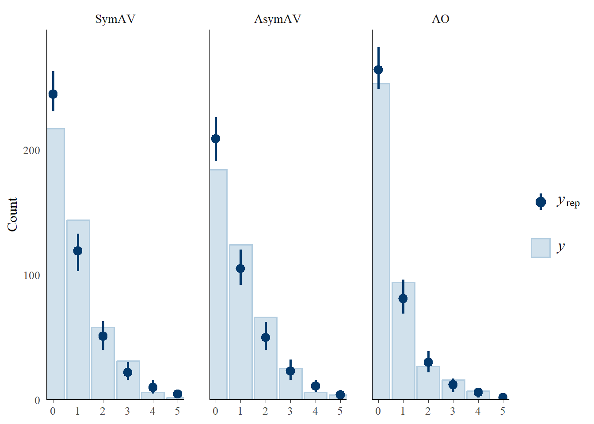<!-- -->

``` r
pp_check(model, ndraws = 100, 
         type = "bars_grouped", group = "round") +
  coord_cartesian(xlim = c(0, 5))
```

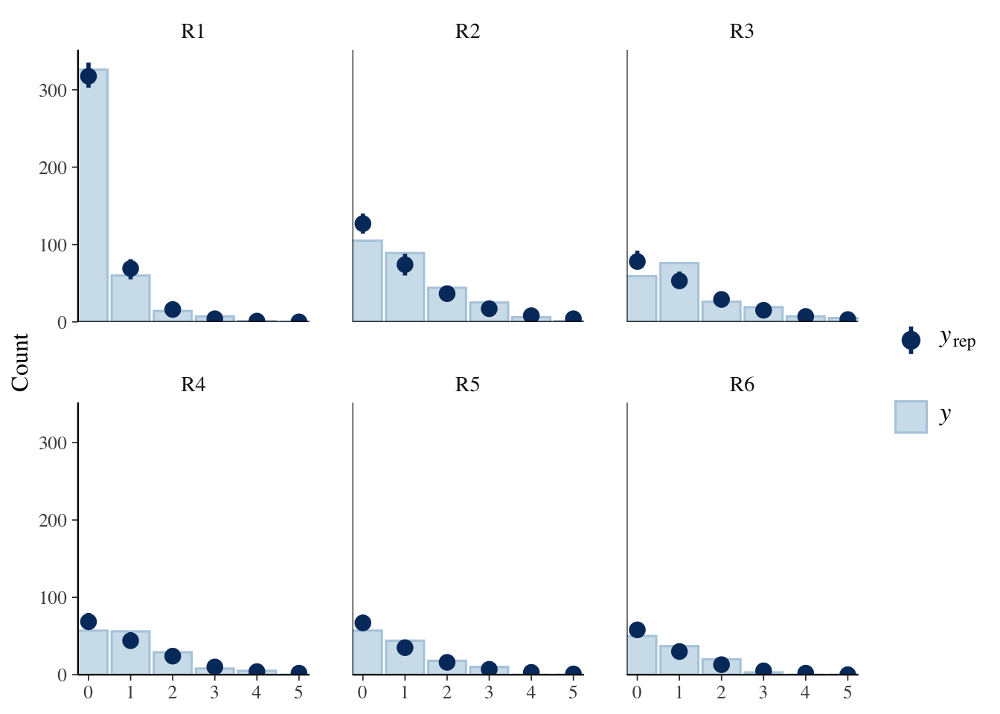<!-- -->

Although the model prediction is not perfect, this model had a higher
predictive power than the zero-inflated negative binomial model and
generates data that are quite similar to the observations. As such, we
will use this model.

<br>

### 9.3.6 Posterior distributions

``` r
df_post_beta_lex = posterior_beta(zinb_align_cond_round, 
                                  round_int = FALSE, lex_int = TRUE) %>% 
  dplyr::select(.chain, .draw, .variable, .value) %>%
  filter(grepl("N. lex align", .variable)) %>% 
  mutate(component = "N. lex align")

df_post_beta = posterior_beta(model) %>% 
  dplyr::select(-.iteration, -b_role1)

# replace the lex_align_c coefficient with the one from the model on count data
df_post_beta_new = df_post_beta %>% 
  filter(!grepl("N. lex align", .variable)) %>%
  rbind(., df_post_beta_lex)

# summarize the posterior distribution
post_beta_summary = df_post_beta_new %>%
  group_by(.variable) %>%
  summarize(mean = mean(.value),
            est_error = sd(.value),
            lci = quantile(.value, 0.025),
            uci = quantile(.value, 0.975))
post_beta_summary
```

    ## # A tibble: 28 × 5
    ##    .variable             mean est_error      lci    uci
    ##    <fct>                <dbl>     <dbl>    <dbl>  <dbl>
    ##  1 Intercept         -1.11       0.122  -1.36    -0.880
    ##  2 AO--AsymAV         0.505      0.246   0.0169   0.981
    ##  3 AsymAV--SymAV      0.0215     0.233  -0.435    0.486
    ##  4 AO--SymAV          0.527      0.263   0.00403  1.04 
    ##  5 R1--R2             1.70       0.141   1.42     1.97 
    ##  6 R2--R3             0.363      0.0951  0.178    0.550
    ##  7 R3--R4            -0.00450    0.108  -0.218    0.207
    ##  8 R4--R5            -0.0989     0.132  -0.360    0.161
    ##  9 R5--R6            -0.145      0.164  -0.467    0.178
    ## 10 AO--AsymAV:R1--R2 -0.134      0.291  -0.706    0.440
    ## # ℹ 18 more rows

``` r
# visualize the posterior distribution
p_pd = plot_posterior(df_post_beta_new, interaction = F,
                      title = "C. Posterior distributions for the effects on gestural alignment",
                      xlim_cond = 1.5, xlim_round = 2, 
                      xlim_lex = 0.4, ncol_wrap = 3)
p_pd
```

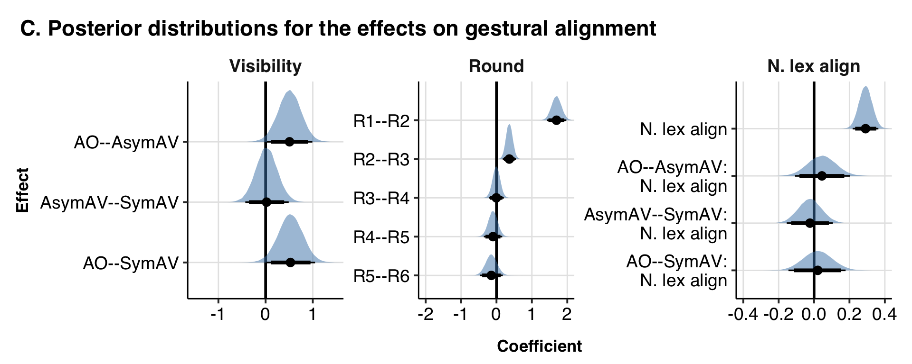<!-- -->

<br>

### 9.3.7 Prior-posterior update plot

``` r
post_sample_lex = as_draws_df(zinb_align_cond_round) %>% 
  as_tibble() %>% 
  dplyr::select(starts_with("b_lex_align_c") | "prior_b_lex_align_c") %>% 
  mutate(ao_sym_lex = `b_lex_align_c:conditionAO_Asym` + `b_lex_align_c:conditionAsym_Sym`)

post_sample = as_draws_df(model) %>% 
  as_tibble() %>% 
  dplyr::select(!starts_with(c("r_", "sd_", "cor_", "z_", "L_"))) %>% 
  mutate(ao_sym = b_conditionAO_Asym + b_conditionAsym_Sym,
         ao_sym_round12 = `b_conditionAO_Asym:roundR12` + `b_conditionAsym_Sym:roundR12`,
         ao_sym_round23 = `b_conditionAO_Asym:roundR23` + `b_conditionAsym_Sym:roundR23`,
         ao_sym_round34 = `b_conditionAO_Asym:roundR34` + `b_conditionAsym_Sym:roundR34`,
         ao_sym_round45 = `b_conditionAO_Asym:roundR45` + `b_conditionAsym_Sym:roundR45`,
         ao_sym_round56 = `b_conditionAO_Asym:roundR56` + `b_conditionAsym_Sym:roundR56`,
         prior_lex_align = post_sample_lex$prior_b_lex_align_c,
         lex_align = post_sample_lex$b_lex_align_c,
         ao_asym_lex = post_sample_lex$`b_lex_align_c:conditionAO_Asym`, 
         asym_sym_lex = post_sample_lex$`b_lex_align_c:conditionAsym_Sym`)

pp_update_rate = pp_update_plot(post_sample, model_type="nb", fam_par=FALSE, ncol=5)
pp_update_rate
```

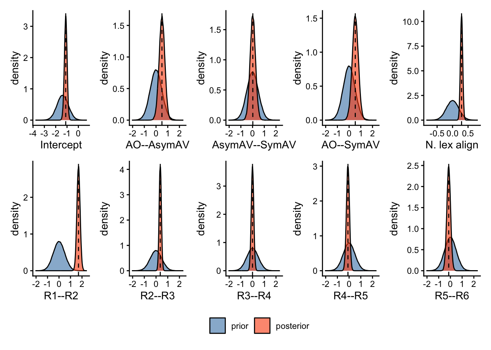<!-- -->

<br>

### 9.3.8 Hypothesis testing: Bayes factor

``` r
### varying priors for sensitivity analysis
prior_size = c("xs", "s", "m", "l", "xl")
prior_sd = c(0.1, 0.3, 0.5, 0.7, 1)


### list of hypotheses
hps = c("conditionAO_Asym = 0", "conditionAsym_Sym = 0",
       "conditionAO_Asym + conditionAsym_Sym = 0",
       "roundR12 = 0", "roundR23 = 0", "roundR34 = 0", 
       "roundR45 = 0", "roundR56 = 0",
       "conditionAO_Asym:roundR12 = 0", "conditionAO_Asym:roundR23 = 0",
       "conditionAO_Asym:roundR34 = 0", "conditionAO_Asym:roundR45 = 0", 
       "conditionAO_Asym:roundR56 = 0",
       "conditionAsym_Sym:roundR12 = 0", "conditionAsym_Sym:roundR23 = 0",
       "conditionAsym_Sym:roundR34 = 0", "conditionAsym_Sym:roundR45 = 0", 
       "conditionAsym_Sym:roundR56 = 0",
       "conditionAO_Asym:roundR12 + conditionAsym_Sym:roundR12 = 0",
       "conditionAO_Asym:roundR23 + conditionAsym_Sym:roundR23 = 0",
       "conditionAO_Asym:roundR34 + conditionAsym_Sym:roundR34 = 0",
       "conditionAO_Asym:roundR45 + conditionAsym_Sym:roundR45 = 0",
       "conditionAO_Asym:roundR56 + conditionAsym_Sym:roundR56 = 0")
effects = c("AO--AsymAV", "AsymAV--SymAV", "AO--SymAV",
            "R1--R2", "R2--R3", "R3--R4", "R4--R5", "R5--R6",
            "AO--AsymAV:R1--R2", "AO--AsymAV:R2--R3", "AO--AsymAV:R3--R4",
            "AO--AsymAV:R4--R5", "AO--AsymAV:R5--R6",
            "AsymAV--SymAV:R1--R2", "AsymAV--SymAV:R2--R3", "AsymAV--SymAV:R3--R4",
            "AsymAV--SymAV:R4--R5", "AsymAV--SymAV:R5--R6",
            "AO--SymAV:R1--R2", "AO--SymAV:R2--R3", "AO--SymAV:R3--R4", 
            "AO--SymAV:R4--R5", "AO--SymAV:R5--R6")

for (i in 1:length(prior_sd)){
  priors = c(
    prior(normal(-1.39, 0.5), class = Intercept),
    set_prior(paste0("normal(0,", prior_sd[i], ")"), class = "b"),
    prior(normal(0, 0.5), class = sd),
    prior(lkj(2), class = cor),
    prior(normal(0, 50), class = shape))
  
  fname = paste0("models/speakerB/gest_alignment/nb_align_rate_cond_round_", prior_size[i])
  fname = gsub("_m", "", fname) # remove "_m" for the medium prior
  
  fit = brm(num_gestural_align | rate(num_iconic_gestures) ~ 
              1 + condition * round + lex_align_c + role +
              (1+round|pair) + (1|target),
            family = negbinomial(),
            prior = priors,
            data = df_gest_align_posreg_prop,
            sample_prior = T,
            save_pars = save_pars(all = TRUE),
            warmup = nwu, iter = niter,
            control = list(adapt_delta = 0.9, 
                           max_treedepth = 15),
            file = fname)
  
  ### compute BFs for all hypotheses and store them as dataframe
  for (j in 1:length(hps)){
    h = hypothesis(fit, hps[j])
    # transform the result to dataframe
    result = data_frame(h$hypothesis) %>%
      mutate(size = prior_size[i],
             sd = prior_sd[i],
             Effect = effects[j])
    # combine the result
    if (i==1 & j==1){
      df_results = result
    } else {
      df_results = rbind(df_results, result)}
  }
}

df_bf_rate = df_results %>%
  mutate(prior = paste0("N(0, ", sd, ")"),
         BF10 = 1 / abs(Evid.Ratio),
         Effect = factor(Effect,
                         levels = effects),
         Predictor = factor(case_when(grepl(":R", Effect) ~ "Interaction",
                                      grepl("R", Effect) ~ "Round",
                                      .default = "Visibility"),
                            levels = c("Visibility", "Round", "Interaction")),
         across(where(is.numeric), ~ round(., 3)),
         Star = ifelse(BF10 >= 30 | BF10 <= 1/30, "***",
                       ifelse(BF10 >= 10 | BF10 <= 1/10, "**",
                              ifelse(BF10 >= 3 | BF10 <= 1/3, "*", ""))),
         Star = ifelse(BF10 < 1, str_replace_all(Star, "[*]", "="), Star)) %>% 
  dplyr::select(size, sd, prior, Effect, Predictor,
                Estimate, Est.Error, `CI.Lower`, `CI.Upper`, BF10, Star) %>% 
  arrange(Effect, sd)


# add the results for lexical alignment
df_bf = rbind(df_bf_rate, df_bf_lex) %>% 
   mutate(Predictor = factor(case_when(grepl("align", Effect) ~ "N. lex align",
                                       grepl("R", Effect) ~ "Round",
                                      .default = "Visibility"),
                            levels = c("Visibility", "Round", "N. lex align")))
df_bf
```

    ## # A tibble: 135 × 11
    ##    size     sd prior Effect Predictor Estimate Est.Error CI.Lower CI.Upper  BF10
    ##    <chr> <dbl> <chr> <fct>  <fct>        <dbl>     <dbl>    <dbl>    <dbl> <dbl>
    ##  1 xs      0.1 N(0,… AO--A… Visibili…    0.078     0.095   -0.107    0.263 1.36 
    ##  2 s       0.3 N(0,… AO--A… Visibili…    0.355     0.203   -0.051    0.744 3.05 
    ##  3 m       0.5 N(0,… AO--A… Visibili…    0.505     0.246    0.017    0.981 4.06 
    ##  4 l       0.7 N(0,… AO--A… Visibili…    0.581     0.266    0.052    1.10  3.93 
    ##  5 xl      1   N(0,… AO--A… Visibili…    0.636     0.28     0.083    1.19  3.68 
    ##  6 xs      0.1 N(0,… AsymA… Visibili…    0.027     0.093   -0.155    0.209 0.987
    ##  7 s       0.3 N(0,… AsymA… Visibili…    0.055     0.194   -0.325    0.436 0.672
    ##  8 m       0.5 N(0,… AsymA… Visibili…    0.021     0.233   -0.435    0.486 0.459
    ##  9 l       0.7 N(0,… AsymA… Visibili…   -0.004     0.253   -0.5      0.488 0.357
    ## 10 xl      1   N(0,… AsymA… Visibili…   -0.026     0.266   -0.55     0.5   0.257
    ## # ℹ 125 more rows
    ## # ℹ 1 more variable: Star <chr>

``` r
qual_col_pals = brewer.pal.info[brewer.pal.info$category == 'qual',]
col_vector = unlist(mapply(brewer.pal, qual_col_pals$maxcolors, rownames(qual_col_pals)))
col_vector = c("#00786A", "#ED6B06", col_vector)

### Plot BFs ###
p_bf_rate = 
  ggplot(filter(df_bf, !Effect %in% c("R1--R2", "N. lex align")), 
              aes(x = factor(sd), y = BF10, group = Effect)) +
  geom_hline(yintercept = 1, linetype="dashed") +
  geom_point(aes(color=Effect)) +
  geom_line(aes(color=Effect)) +
  labs(x = "SD for the prior",
       title = "D. Bayes factors for the effects on gestural alignment") +
  scale_color_manual(values = col_vector) +
  facet_wrap(vars(Predictor), scale = "free_x") +
  theme_clean(base_size = 15) +
  theme(axis.text.x = element_text(colour = "black", size = 14),
        axis.text.y = element_text(colour = "black", size = 14),
        axis.title = element_text(size = 13, face = 'bold'),
        axis.title.x = element_text(vjust = -2),
        axis.title.y = element_text(vjust = 2),
        legend.position = "right",
        legend.title = element_blank(),
        legend.text = element_text(size = 10.5),
        strip.text = element_text(size = 14, face = 'bold'),
        strip.background = element_blank(),
        plot.title.position = "plot", # left align the title
        plot.background = element_blank(),
        plot.margin = unit(c(1.1,1.1,1.1,1.1), "lines")) +
  scale_y_log10("Bayes factor (BF10)",
                # limits = c(0.03, 30000),
                breaks = c(0.001, 0.03, 0.01, 0.1, 0.33, 1, 3, 10, 30, 100, 1e3, 1e4),
                labels = c(0.001, 0.03, 0.01, 0.1, 0.33, 1, 3, 10, 30, 100, 1e3, 1e4)) +
  guides(color = guide_legend(ncol=2))

p_bf_rate
```

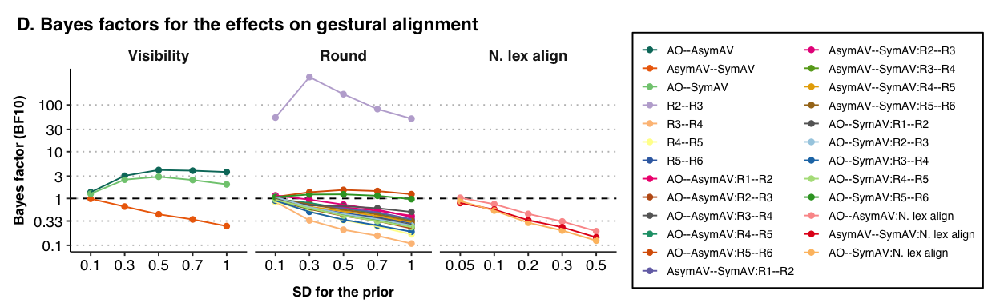<!-- -->

<br>

### 9.3.9 Back-transformation

We back-transform the posterior samples to the original scale to
visualize the predicted proportion of gestural alignment across
conditions and rounds.

We defined the regression as follows (only including condition and round
predictors for simplicity): \$\$ \$\$

The values of the predictors ($x$) are determined by the contrast
coding. The contrast matrix is as follows:

**Condition** \| \| AO_Asym \| AsymAV_Sym \| \| SymAV \| 1/3 \| 2/3 \|
\| AsymAV \| 1/3 \| -1/3 \| \| AO \| -2/3 \| -1/3 \|

**Round** \| \| R12 \| R23 \| R34 \| R45 \| R56 \| \| R1 \| -5/6 \| -2/3
\| -1/2 \| -1/3 \| -1/6 \| \| R2 \| 1/6 \| -2/3 \| -1/2 \| -1/3 \| -1/6
\| \| R3 \| 1/6 \| 1/3 \| -1/2 \| -1/3 \| -1/6 \| \| R4 \| 1/6 \| 1/3 \|
1/2 \| -1/3 \| -1/6 \| \| R5 \| 1/6 \| 1/3 \| 1/2 \| 2/3 \| -1/6 \| \|
R6 \| 1/6 \| 1/3 \| 1/2 \| 2/3 \| 5/6 \|

Given that 0 represents the ground mean in these coding, we can compute
the estimated marginal mean for each condition like this:

$SymAV = \beta_0 + \beta_{AO\_Asym} \times 1/3) + (\beta_{Asym\_Sym} \times 2/3)$

Note that because (i) the marginal mean for each condition can be
calculated by averaging over the conditional means of the 6 rounds in
that condition, and (ii) 0 represents the ground mean in the contrast
coding, the estimated marginal mean for each condition can be calculated
by simply plugging in the contrast values for the condition predictors
and setting the round predictors to 0. And because multiplying any
number by 0 results in 0, we can remove all the terms involving round
predictors and their interactions with condition predictors.

``` r
#### visibility effects ####
alpha = post_sample$b_Intercept
b_ao_asym = post_sample$b_conditionAO_Asym
b_asym_sym = post_sample$b_conditionAsym_Sym
b_round12 = post_sample$b_roundR12
b_round23 = post_sample$b_roundR23
b_round34 = post_sample$b_roundR34
b_round45 = post_sample$b_roundR45
b_round56 = post_sample$b_roundR56
b_ao_asym_round12 = post_sample$`b_conditionAO_Asym:roundR12`
b_ao_asym_round23 = post_sample$`b_conditionAO_Asym:roundR23`
b_ao_asym_round34 = post_sample$`b_conditionAO_Asym:roundR34`
b_ao_asym_round45 = post_sample$`b_conditionAO_Asym:roundR45`
b_ao_asym_round56 = post_sample$`b_conditionAO_Asym:roundR56`
b_asym_sym_round12 = post_sample$`b_conditionAsym_Sym:roundR12`
b_asym_sym_round23 = post_sample$`b_conditionAsym_Sym:roundR23`
b_asym_sym_round34 = post_sample$`b_conditionAsym_Sym:roundR34`
b_asym_sym_round45 = post_sample$`b_conditionAsym_Sym:roundR45`
b_asym_sym_round56 = post_sample$`b_conditionAsym_Sym:roundR56`


### convert the samples to the original scale based on the contrast matrix
cmax_cond = contrasts(df_gest_align_posreg_prop$condition)
cmax_cond
```

    ##        AO_Asym Asym_Sym
    ## SymAV   1/3     2/3    
    ## AsymAV  1/3    -1/3    
    ## AO     -2/3    -1/3

``` r
cmax_round = contrasts(df_gest_align_posreg_prop$round)
cmax_round
```

    ##    R12  R23  R34  R45  R56 
    ## R1 -5/6 -2/3 -1/2 -1/3 -1/6
    ## R2  1/6 -2/3 -1/2 -1/3 -1/6
    ## R3  1/6  1/3 -1/2 -1/3 -1/6
    ## R4  1/6  1/3  1/2 -1/3 -1/6
    ## R5  1/6  1/3  1/2  2/3 -1/6
    ## R6  1/6  1/3  1/2  2/3  5/6

``` r
i = 1
conds = c("SymAV", "AsymAV", "AO")
df_pred = tibble()
df_pred_int = tibble()

for (i in 1:length(conds)){
  condition = conds[i]
  pred = exp(alpha + b_ao_asym * cmax_cond[i,1] + b_asym_sym * cmax_cond[i,2])
  df_pred = rbind(df_pred, tibble(condition = factor(condition), 
                                  mean = mean(pred),
                                  lci = quantile(pred, 0.025),
                                  uci = quantile(pred, 0.975)))
  for (j in 1:6){
    round = j
    pred = exp(alpha + 
                 # condition
                 b_ao_asym * cmax_cond[i,1] + b_asym_sym * cmax_cond[i,2] +
                 # round
                 b_round12 * cmax_round[j,1] + b_round23 * cmax_round[j,2] + 
                 b_round34 * cmax_round[j,3] + b_round45 * cmax_round[j,4] + 
                 b_round56 * cmax_round[j,5] +
                 # condition * round
                 b_ao_asym_round12 * cmax_cond[i,1] * cmax_round[j,1] +
                 b_ao_asym_round23 * cmax_cond[i,1] * cmax_round[j,2] +
                 b_ao_asym_round34 * cmax_cond[i,1] * cmax_round[j,3] +
                 b_ao_asym_round45 * cmax_cond[i,1] * cmax_round[j,4] +
                 b_ao_asym_round56 * cmax_cond[i,1] * cmax_round[j,5] +
                 b_asym_sym_round12 * cmax_cond[i,2] * cmax_round[j,1] +
                 b_asym_sym_round23 * cmax_cond[i,2] * cmax_round[j,2] +
                 b_asym_sym_round34 * cmax_cond[i,2] * cmax_round[j,3] +
                 b_asym_sym_round45 * cmax_cond[i,2] * cmax_round[j,4] +
                 b_asym_sym_round56 * cmax_cond[i,2] * cmax_round[j,5])
    
    df_pred_int = rbind(df_pred_int, tibble(condition = factor(condition),
                                            round = factor(round),
                                            mean = mean(pred),
                                            lci = quantile(pred, 0.025),
                                            uci = quantile(pred, 0.975)))}
}

df_pred
```

    ## # A tibble: 3 × 4
    ##   condition  mean lci        uci       
    ##   <fct>     <dbl> <fractins> <fractins>
    ## 1 SymAV     0.401 0.273      0.560     
    ## 2 AsymAV    0.392 0.268      0.546     
    ## 3 AO        0.237 0.157      0.344

``` r
df_pred_int
```

    ## # A tibble: 18 × 5
    ##    condition round   mean lci        uci       
    ##    <fct>     <fct>  <dbl> <fractins> <fractins>
    ##  1 SymAV     1     0.0816 0.0496     0.1243    
    ##  2 SymAV     2     0.381  0.2476     0.5549    
    ##  3 SymAV     3     0.630  0.4052     0.9226    
    ##  4 SymAV     4     0.645  0.4080     0.9608    
    ##  5 SymAV     5     0.575  0.3476     0.8834    
    ##  6 SymAV     6     0.601  0.3403     0.9666    
    ##  7 AsymAV    1     0.0818 0.0499     0.1242    
    ##  8 AsymAV    2     0.446  0.2911     0.6449    
    ##  9 AsymAV    3     0.593  0.3818     0.8728    
    ## 10 AsymAV    4     0.571  0.3601     0.8493    
    ## 11 AsymAV    5     0.562  0.3456     0.8480    
    ## 12 AsymAV    6     0.549  0.3208     0.8615    
    ## 13 AO        1     0.0485 0.0261     0.0806    
    ## 14 AO        2     0.300  0.1847     0.4576    
    ## 15 AO        3     0.407  0.2506     0.6194    
    ## 16 AO        4     0.410  0.2449     0.6384    
    ## 17 AO        5     0.352  0.1967     0.5747    
    ## 18 AO        6     0.229  0.1131     0.4081

<br>

### 9.3.10 Calculate effect size

``` r
# calculate the difference between AsymAV and AO
pred_asym = exp(alpha + b_ao_asym * cmax_cond[2,1] + b_asym_sym * cmax_cond[2,2])
pred_ao = exp(alpha + b_ao_asym * cmax_cond[3,1] + b_asym_sym * cmax_cond[3,2])
effect_size_rate = pred_asym - pred_ao

# summary of the effect size (mean, median, 95% credible interval)
effect_size_rate_summary = data_frame(
  mean = mean(effect_size_rate),
  median = median(effect_size_rate),
  ci_lower = quantile(effect_size_rate, 0.025),
  ci_upper = quantile(effect_size_rate, 0.975))
effect_size_rate_summary
```

    ## # A tibble: 1 × 4
    ##    mean median ci_lower   ci_upper  
    ##   <dbl>  <dbl> <fractins> <fractins>
    ## 1 0.155  0.152 0.00525    0.317

``` r
### calculate the proportion of gestural alignment explained by the visibility
effect_size_prop = effect_size_rate / pred_asym
effect_size_prop_summary = data_frame(
  mean = mean(effect_size_prop),
  median = median(effect_size_prop),
  ci_lower = quantile(effect_size_prop, 0.025),
  ci_upper = quantile(effect_size_prop, 0.975))
effect_size_prop_summary
```

    ## # A tibble: 1 × 4
    ##    mean median ci_lower   ci_upper  
    ##   <dbl>  <dbl> <fractins> <fractins>
    ## 1 0.378  0.398 0.0168     0.625

On average, 37.8% of gestural alignment can be explained by lexical
alignment, with a 95% credible interval of \[1.7%, 62.5%\]. This
suggests that gesture-to-gesture priming is an important predictor of
gestural alignment. However, the credible interval is quite wide,
indicating a high level of uncertainty in this estimate.

In the previous analysis, we found that on average, 16.3% \[12.5%,
19.9%\] of gestural alignment can be explained by lexical alignment.
This suggests that priming and lexical alignment can only account for
54.1% (= 37.8% + 16.3%) of gestural alignment, leaving a large portion
of gestural alignment unexplained by these two factors. This underscores
the importance of investigating other potential predictors of gestural
alignment and the need to move beyond dichotomous thinking about whether
gestural alignment is due to priming or communicative functions.
Instead, we should consider the possibility that gestural alignment is a
complex phenomenon that can be influenced by multiple factors.

<br>

### 9.3.11 Visualize the model estimates

``` r
### visibility
bp_mean_gest_alignment_prop_model = 
  bp_mean_gest_alignment_prop_by_cond +
  geom_ribbon(data = df_pred,
              aes(x = condition, y = mean, 
                  ymin = lci, ymax = uci, group = 1),
              fill = "black", alpha = 0.2) +
  geom_line(data = df_pred,
            aes(x = condition, y = mean, group = 1),
            color = "black", size = 0.8) +
  labs(title = "A. Gest align rate across visibility") +
  theme(plot.title.position = "plot")

bp_mean_gest_alignment_prop_model
```

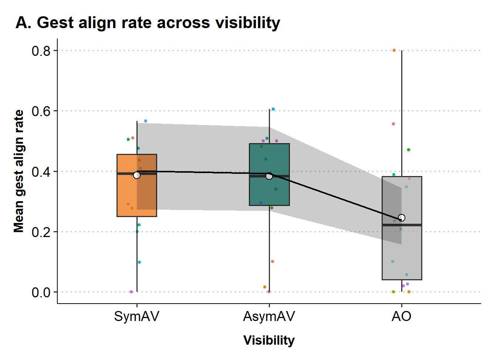<!-- -->

``` r
ggsave("figures/speakerB/gest_alignment/bp_mean_prop_cond_model.svg", width=4, height=4)


### visibility x round
bp_mean_gest_alignment_prop_by_round_cond_model = 
  bp_mean_gest_alignment_prop_by_round_cond +
  geom_ribbon(data = df_pred_int,
              aes(x = round, y = mean, 
                  ymin = lci, ymax = uci, group = condition),
              fill = "black", alpha = 0.2) +
  geom_line(data = df_pred_int,
            aes(x = round, y = mean, group = condition),
            color = "black", size = 0.8) +
  labs(title = "B. Gest align rate across visibility and round") +
  theme(plot.title.position = "plot")

bp_mean_gest_alignment_prop_by_round_cond_model
```

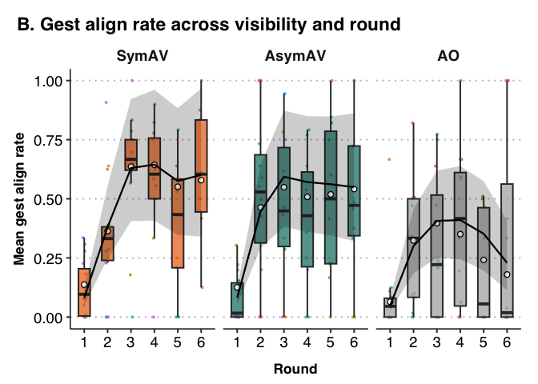<!-- -->

``` r
ggsave("figures/speakerB/gest_alignment/bp_mean_prop_cond_round_model.svg", width=8, height=4)
```

<br>

# 10. Merge plots

``` r
design = "AAAABBBBBB
          CCCCCCCCCC
          DDDDDDDDDD"

free(bp_mean_gest_alignment_prop_model) + #A
  bp_mean_gest_alignment_prop_by_round_cond_model + #B
  free(p_pd) + #C
  free(p_bf_rate) + #D
  plot_layout(design = design,
              heights = c(0.6,1,1))
```

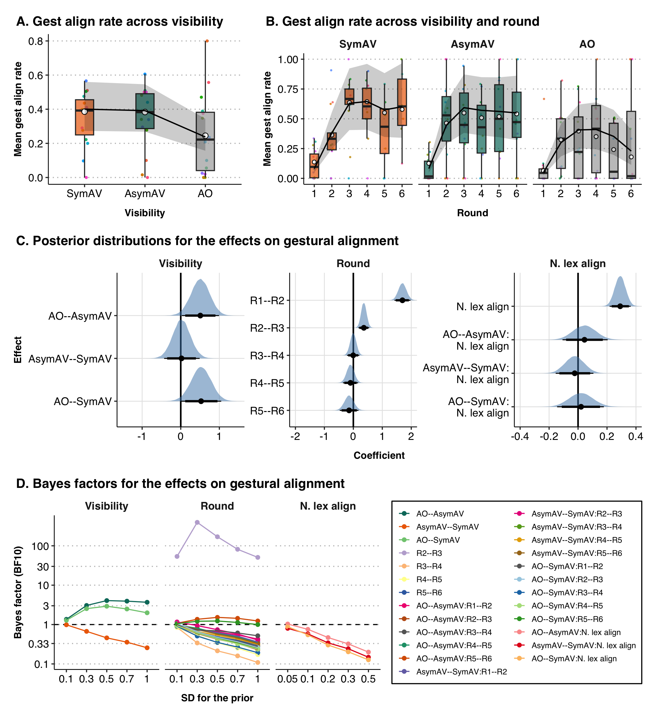<!-- -->

``` r
# save the plot
ggsave("figures/speakerB/gest_alignment/gest_align_combined.svg", width=12, height=13)
```

------------------------------------------------------------------------

# =====Extra: Understanding contrast coding=====

Here, we will understand three-level contrast coding by simulating some
data and fitting a linear regression.

## Linear regression with three conditions

### Simulate data

``` r
### defining parameters
conditions = c("cond1", "cond2", "cond3")
b12 = 200
b23 = -300
mean1 = 400
mean2 = mean1 + b12
mean3 = mean2 + b23

### simulating data
n = 1000 # number of observations per condition
sd = 50

y1 = rnorm(n, mean1, sd)
y2 = rnorm(n, mean2, sd)
y3 = rnorm(n, mean3, sd)

df = data.frame(y = c(y1, y2, y3),
                condition = factor(rep(conditions, each=n)))

# check if the data are simulated correctly
df %>% 
  group_by(condition) %>% 
  summarise(mean = mean(y),
            sd = sd(y))
```

    ## # A tibble: 3 × 3
    ##   condition  mean    sd
    ##   <fct>     <dbl> <dbl>
    ## 1 cond1      401.  49.6
    ## 2 cond2      601.  49.4
    ## 3 cond3      298.  49.8

``` r
# ground mean
mean(df$y)
```

    ## [1] 433

<br>

### Contrast coding

``` r
h_cond = hypr(C12 = cond2 ~ cond1,
              C23 = cond3 ~ cond2,
              levels = levels(df$condition))
h_cond
```

    ## hypr object containing 2 null hypotheses:
    ## H0.C12: 0 = cond2 - cond1
    ## H0.C23: 0 = cond3 - cond2
    ## 
    ## Call:
    ## hypr(C12 = ~cond2 - cond1, C23 = ~cond3 - cond2, levels = c("cond1", 
    ## "cond2", "cond3"))
    ## 
    ## Hypothesis matrix (transposed):
    ##       C12 C23
    ## cond1 -1   0 
    ## cond2  1  -1 
    ## cond3  0   1 
    ## 
    ## Contrast matrix:
    ##       C12  C23 
    ## cond1 -2/3 -1/3
    ## cond2  1/3 -1/3
    ## cond3  1/3  2/3

``` r
contrasts(df$condition) = contr.hypothesis(h_cond)
```

### Fit the model

``` r
model = lm(y ~ condition, data = df)
summary(model)
```

    ## 
    ## Call:
    ## lm(formula = y ~ condition, data = df)
    ## 
    ## Residuals:
    ##     Min      1Q  Median      3Q     Max 
    ## -172.85  -32.13    0.55   33.64  170.99 
    ## 
    ## Coefficients:
    ##              Estimate Std. Error t value Pr(>|t|)    
    ## (Intercept)   433.281      0.905   478.7   <2e-16 ***
    ## conditionC12  199.378      2.217    89.9   <2e-16 ***
    ## conditionC23 -302.484      2.217  -136.4   <2e-16 ***
    ## ---
    ## Signif. codes:  0 '***' 0.001 '**' 0.01 '*' 0.05 '.' 0.1 ' ' 1
    ## 
    ## Residual standard error: 49.6 on 2997 degrees of freedom
    ## Multiple R-squared:  0.865,  Adjusted R-squared:  0.865 
    ## F-statistic: 9.62e+03 on 2 and 2997 DF,  p-value: <2e-16

There are three things to note here:

1.  The intercept (433) is the estimated **ground mean**, not the mean
    of cond2 (400).
2.  The slope for C12 (200) is the estimated difference between cond1
    and cond2, and the slope for C23 (-300) is the estimated difference
    between cond2 and cond3
3.  None of the coefficients represent the mean of each condition.

An advantage of this contrast coding is that we can estimate the
marginal effects of each condition if we have other predictors in the
model. This is because the contrast coding makes the intercept represent
the ground mean, which is the average of the three conditions.

A disadvantage of this contrast coding is that the coefficients are not
directly interpretable as the mean of each condition. This means that
calculating the predicted mean for each condition requires a bit complex
calculation compared to treatment coding. However, this is not a big
issue because we can easily calculate the predicted mean for each
condition using the coefficients from the model and contrast matrix.

<br>

### Calculate the predicted mean for each condition

``` r
b_intercept = coef(model)[1]
b_C12 = coef(model)[2]
b_C23 = coef(model)[3]

contrasts(df$condition)
```

    ##       C12  C23 
    ## cond1 -2/3 -1/3
    ## cond2  1/3 -1/3
    ## cond3  1/3  2/3

``` r
pred_cond1 = b_intercept + (b_C12 * -2/3) + (b_C23 * -1/3)
pred_cond2 = b_intercept + (b_C12 * 1/3) + (b_C23 * -1/3)
pred_cond3 = b_intercept + (b_C12 * 1/3) + (b_C23 * 2/3)

# show the predicted means for each condition
tibble(condition = conditions,
       predicted_mean = c(pred_cond1, pred_cond2, pred_cond3))
```

    ## # A tibble: 3 × 2
    ##   condition predicted_mean
    ##   <chr>              <dbl>
    ## 1 cond1               401.
    ## 2 cond2               601.
    ## 3 cond3               298.

As you can see, the predicted means for each condition can be calculated
by multiplying the coefficients with the contrast matrix and adding them
to the intercept.

We can also use the `marginaleffects` package to calculate the predicted
means for each condition, which is much easier than doing the
calculation manually.

``` r
avg_predictions(model, by = "condition")
```

    ## 
    ##  condition Estimate Std. Error   z Pr(>|z|)   S 2.5 % 97.5 %
    ##      cond1      401       1.57 256   <0.001 Inf   398    404
    ##      cond2      601       1.57 383   <0.001 Inf   597    604
    ##      cond3      298       1.57 190   <0.001 Inf   295    301
    ## 
    ## Type: response

<br>

## Negbinomial regression with three conditions

Next, we will model count data using a Negative binomial regression. The
purpose of this is to understand the behavior of the `avg_predictions()`
function. Also, we will add another predictor `round_c` to the model to
see how the contrast coding allows us to estimate the marginal effects
of each condition.

### Simulate data

``` r
### defining parameters
conditions = c("cond1", "cond2", "cond3")
round = c(-2.5, -1.5, -0.5, 0.5, 1.5, 2.5) # centered round variable
b12 = 20
b23 = -10
b_round = 5
mean1 = 50

### simulating data
n = 1000 # number of observations per condition
sample_cond = rep(conditions, each = n)
sample_round = rep(round, times = n*3/length(round))
time = rnorm(n*3, 10, 0.5)

y = as.integer(mean1 + ifelse(sample_cond == "cond1", 0, 
                              ifelse(sample_cond == "cond2", b12, b12 + b23)) + 
                 (b_round * sample_round) + rnorm(n*3, 0, 5))

df = data.frame(condition = factor(sample_cond),
                round = sample_round,
                time = time,
                y = y)

# check if the data are simulated correctly
df %>% 
  group_by(condition) %>% 
  summarise(mean = mean(y),
            sd = sd(y),
            mean_rate = mean(y/time),
            sd_rate = sd(y/time))
```

    ## # A tibble: 3 × 5
    ##   condition  mean    sd mean_rate sd_rate
    ##   <fct>     <dbl> <dbl>     <dbl>   <dbl>
    ## 1 cond1      49.4  9.80      4.95    1.01
    ## 2 cond2      69.3  9.80      6.95    1.07
    ## 3 cond3      59.7  9.76      5.99    1.03

``` r
# ground mean
mean(df$y)
```

    ## [1] 59.5

``` r
mean(df$y/df$time)
```

    ## [1] 5.96

### Fit the model

``` r
### Poisson model without exposure variable
model1 = brm(y ~ 1 + condition * round, 
             prior = c(
               prior(normal(4, 0.5), class = Intercept),
               prior(normal(0, 0.5), class = b),
               prior(normal(0, 50), class = shape)),
             data = df, 
             family = negbinomial(),
             file = "models/speakerB/sim_model1")
summary(model1)
```

    ##  Family: negbinomial 
    ##   Links: mu = log 
    ## Formula: y ~ 1 + condition * round 
    ##    Data: df (Number of observations: 3000) 
    ##   Draws: 4 chains, each with iter = 2000; warmup = 1000; thin = 1;
    ##          total post-warmup draws = 4000
    ## 
    ## Regression Coefficients:
    ##                      Estimate Est.Error l-95% CI u-95% CI Rhat Bulk_ESS
    ## Intercept                3.90      0.00     3.89     3.91 1.00     2584
    ## conditioncond2           0.33      0.01     0.32     0.35 1.00     2624
    ## conditioncond3           0.18      0.01     0.17     0.19 1.00     2527
    ## round                    0.10      0.00     0.09     0.10 1.00     2447
    ## conditioncond2:round    -0.03      0.00    -0.04    -0.02 1.00     2800
    ## conditioncond3:round    -0.02      0.00    -0.02    -0.01 1.00     2568
    ##                      Tail_ESS
    ## Intercept                2335
    ## conditioncond2           2243
    ## conditioncond3           2057
    ## round                    2467
    ## conditioncond2:round     2911
    ## conditioncond3:round     2325
    ## 
    ## Further Distributional Parameters:
    ##       Estimate Est.Error l-95% CI u-95% CI Rhat Bulk_ESS Tail_ESS
    ## shape   498.13     28.46   443.69   555.82 1.00     2805     2604
    ## 
    ## Draws were sampled using sample(hmc). For each parameter, Bulk_ESS
    ## and Tail_ESS are effective sample size measures, and Rhat is the potential
    ## scale reduction factor on split chains (at convergence, Rhat = 1).

``` r
### Poisson model with exposure variable
model2 = brm(y | rate(time) ~ 1 + condition * round,
             prior = c(
               prior(normal(1.5, 0.5), class = Intercept),
               prior(normal(0, 0.5), class = b),
               prior(normal(0, 50), class = shape)),
             data = df, 
             family = negbinomial(),
             file = "models/speakerB/sim_model2")
summary(model2)
```

    ##  Family: negbinomial 
    ##   Links: mu = log 
    ## Formula: y | rate(time) ~ 1 + condition * round 
    ##    Data: df (Number of observations: 3000) 
    ##   Draws: 4 chains, each with iter = 2000; warmup = 1000; thin = 1;
    ##          total post-warmup draws = 4000
    ## 
    ## Regression Coefficients:
    ##                      Estimate Est.Error l-95% CI u-95% CI Rhat Bulk_ESS
    ## Intercept                1.60      0.00     1.59     1.60 1.00     2498
    ## conditioncond2           0.33      0.01     0.32     0.34 1.00     2481
    ## conditioncond3           0.17      0.01     0.16     0.19 1.00     2747
    ## round                    0.10      0.00     0.09     0.10 1.00     2284
    ## conditioncond2:round    -0.03      0.00    -0.03    -0.02 1.00     2737
    ## conditioncond3:round    -0.01      0.00    -0.02    -0.01 1.00     2763
    ##                      Tail_ESS
    ## Intercept                2580
    ## conditioncond2           2575
    ## conditioncond3           2662
    ## round                    2402
    ## conditioncond2:round     2904
    ## conditioncond3:round     2774
    ## 
    ## Further Distributional Parameters:
    ##       Estimate Est.Error l-95% CI u-95% CI Rhat Bulk_ESS Tail_ESS
    ## shape   213.41     28.91   159.98   273.94 1.00     2558     2288
    ## 
    ## Draws were sampled using sample(hmc). For each parameter, Bulk_ESS
    ## and Tail_ESS are effective sample size measures, and Rhat is the potential
    ## scale reduction factor on split chains (at convergence, Rhat = 1).

``` r
### Negbin model with exposure variable
model3 = brm(y ~ 1 + condition * round + offset(log(time)),
             prior = c(
               prior(normal(1.5, 0.5), class = Intercept),
               prior(normal(0, 0.5), class = b),
               prior(normal(0, 50), class = shape)),
             data = df, 
             family = negbinomial(),
             file = "models/speakerB/sim_model3")
summary(model3)
```

    ##  Family: negbinomial 
    ##   Links: mu = log 
    ## Formula: y ~ 1 + condition * round + offset(log(time)) 
    ##    Data: df (Number of observations: 3000) 
    ##   Draws: 4 chains, each with iter = 2000; warmup = 1000; thin = 1;
    ##          total post-warmup draws = 4000
    ## 
    ## Regression Coefficients:
    ##                      Estimate Est.Error l-95% CI u-95% CI Rhat Bulk_ESS
    ## Intercept                1.60      0.00     1.59     1.60 1.00     2608
    ## conditioncond2           0.33      0.01     0.32     0.35 1.00     2638
    ## conditioncond3           0.17      0.01     0.16     0.19 1.00     2544
    ## round                    0.10      0.00     0.09     0.10 1.00     2636
    ## conditioncond2:round    -0.03      0.00    -0.03    -0.02 1.00     2942
    ## conditioncond3:round    -0.01      0.00    -0.02    -0.01 1.00     2870
    ##                      Tail_ESS
    ## Intercept                2806
    ## conditioncond2           2618
    ## conditioncond3           2606
    ## round                    2633
    ## conditioncond2:round     2991
    ## conditioncond3:round     2792
    ## 
    ## Further Distributional Parameters:
    ##       Estimate Est.Error l-95% CI u-95% CI Rhat Bulk_ESS Tail_ESS
    ## shape   454.10     29.09   399.25   513.71 1.00     2385     2142
    ## 
    ## Draws were sampled using sample(hmc). For each parameter, Bulk_ESS
    ## and Tail_ESS are effective sample size measures, and Rhat is the potential
    ## scale reduction factor on split chains (at convergence, Rhat = 1).

It is important to note that the coefficients are identical regardless
of whether the exposure variable is specified as `rate()` or `offset()`.
Next, we will see that `offset()` actually causes issues when generating
predictions using the `avg_predictions()` function.

``` r
### Negbin model without exposure variable
avg_predictions(model1, by = "condition")
```

    ## 
    ##  condition Estimate 2.5 % 97.5 %
    ##      cond1     49.9  49.4   50.3
    ##      cond2     69.2  68.7   69.8
    ##      cond3     59.5  58.9   60.0
    ## 
    ## Type: response

``` r
avg_predictions(model1, by = "condition", type = "link")
```

    ## 
    ##  condition Estimate 2.5 % 97.5 %
    ##      cond1     3.90  3.89   3.90
    ##      cond2     4.23  4.22   4.24
    ##      cond3     4.08  4.07   4.08
    ## 
    ## Type: link

``` r
### Negbin model with rate()
avg_predictions(model2, by = "condition")
```

    ## 
    ##  condition Estimate 2.5 % 97.5 %
    ##      cond1     50.0  49.6   50.5
    ##      cond2     69.3  68.8   69.8
    ##      cond3     59.2  58.7   59.7
    ## 
    ## Type: response

``` r
avg_predictions(model2, by = "condition", type = "link")
```

    ## 
    ##  condition Estimate 2.5 % 97.5 %
    ##      cond1     1.59  1.59   1.60
    ##      cond2     1.93  1.92   1.94
    ##      cond3     1.77  1.76   1.78
    ## 
    ## Type: link

``` r
avg_predictions(model2, by = "condition", type = "link", transform = exp)
```

    ## 
    ##  condition Estimate 2.5 % 97.5 %
    ##      cond1     4.93  4.88   4.97
    ##      cond2     6.88  6.83   6.93
    ##      cond3     5.87  5.82   5.92
    ## 
    ## Type: link

``` r
### Negbin model with offset()
avg_predictions(model3, by = "condition")
```

    ## 
    ##  condition Estimate 2.5 % 97.5 %
    ##      cond1     50.0  49.6   50.5
    ##      cond2     69.3  68.8   69.8
    ##      cond3     59.2  58.7   59.8
    ## 
    ## Type: response

``` r
avg_predictions(model3, by = "condition", type = "link")
```

    ## 
    ##  condition Estimate 2.5 % 97.5 %
    ##      cond1     3.90  3.89   3.91
    ##      cond2     4.23  4.22   4.24
    ##      cond3     4.07  4.06   4.08
    ## 
    ## Type: link

``` r
avg_predictions(model3, by = "condition", type = "link", transform = exp)
```

    ## 
    ##  condition Estimate 2.5 % 97.5 %
    ##      cond1     49.3  48.8   49.7
    ##      cond2     68.7  68.2   69.3
    ##      cond3     58.6  58.1   59.1
    ## 
    ## Type: link

As you can see, the `avg_predictions()` function gives us the predicted
mean for each condition on the response scale (i.e., count) by default.
There are a few things to keep in mind:

1.  When we using the `type = "response"` argument, we always get the
    predicted mean on the response scale, regardless of whether we have
    an exposure variable or not.
2.  When we using the `type = "link"` argument, the output differs
    depending on (i) whether we have an exposure variable or not,
    and (ii) whether we specify it as `rate()` or `offset()`. If we
    don’t have an exposure variable, we get the predicted mean on the
    link scale (i.e., log count). If we have an exposure variable
    specified as `rate()`, we get the predicted mean **rate** on the
    link scale. If we have an exposure variable specified as `offset()`,
    we get the same predicted mean on the link scale as the model
    without exposure variable, although the model coefficients are
    identical to model with rate(). This mismatch is suboptimal because
    it can lead to incorrect interpretation of the model coefficients
    and predicted values. Therefore, it is recommended to specify the
    exposure variable using `rate()` rather than `offset()` whenever
    possible, but some family (e.g., `zero_inflated_negbinomial()`) does
    not allow the use of `rate()`, in which case we can specify the
    exposure variable using `offset()` but we need to be careful when
    interpreting the model coefficients and predicted values.

<br>

------------------------------------------------------------------------

# =====Session info=====

``` r
sessionInfo()
```

    ## R version 4.5.2 (2025-10-31)
    ## Platform: aarch64-apple-darwin20
    ## Running under: macOS Tahoe 26.2
    ## 
    ## Matrix products: default
    ## BLAS:   /System/Library/Frameworks/Accelerate.framework/Versions/A/Frameworks/vecLib.framework/Versions/A/libBLAS.dylib 
    ## LAPACK: /Library/Frameworks/R.framework/Versions/4.5-arm64/Resources/lib/libRlapack.dylib;  LAPACK version 3.12.1
    ## 
    ## locale:
    ## [1] en_US.UTF-8/en_US.UTF-8/en_US.UTF-8/C/en_US.UTF-8/en_US.UTF-8
    ## 
    ## time zone: Europe/Amsterdam
    ## tzcode source: internal
    ## 
    ## attached base packages:
    ## [1] parallel  stats     graphics  grDevices utils     datasets  methods  
    ## [8] base     
    ## 
    ## other attached packages:
    ##  [1] svglite_2.2.2          ppcor_1.1              MASS_7.3-65           
    ##  [4] doParallel_1.0.17      iterators_1.0.14       foreach_1.5.2         
    ##  [7] emmeans_2.0.1          marginaleffects_0.31.0 tidybayes_3.0.7       
    ## [10] bayestestR_0.17.0      brms_2.23.0            Rcpp_1.1.1            
    ## [13] rsvg_2.7.0             DiagrammeRsvg_0.1      patchwork_1.3.2       
    ## [16] DiagrammeR_1.0.11      dagitty_0.3-4          ggh4x_0.3.1           
    ## [19] RColorBrewer_1.1-3     ggthemes_5.2.0         hypr_0.2.8            
    ## [22] plotrix_3.8-13         lubridate_1.9.4        forcats_1.0.1         
    ## [25] stringr_1.6.0          dplyr_1.1.4            purrr_1.2.1           
    ## [28] readr_2.1.6            tidyr_1.3.2            tibble_3.3.1          
    ## [31] tidyverse_2.0.0        parallelly_1.46.1      plotly_4.11.0         
    ## [34] ggplot2_4.0.1         
    ## 
    ## loaded via a namespace (and not attached):
    ##  [1] gridExtra_2.3         inline_0.3.21         rlang_1.1.7          
    ##  [4] magrittr_2.0.4        otel_0.2.0            matrixStats_1.5.0    
    ##  [7] compiler_4.5.2        loo_2.9.0             reshape2_1.4.5       
    ## [10] systemfonts_1.3.1     vctrs_0.6.5           crayon_1.5.3         
    ## [13] pkgconfig_2.0.3       arrayhelpers_1.1-0    fastmap_1.2.0        
    ## [16] backports_1.5.0       labeling_0.4.3        utf8_1.2.6           
    ## [19] cmdstanr_0.9.0.9000   rmarkdown_2.30        tzdb_0.5.0           
    ## [22] pracma_2.4.6          ps_1.9.1              ragg_1.5.0           
    ## [25] bit_4.6.0             xfun_0.55             jsonlite_2.0.0       
    ## [28] collapse_2.1.6        R6_2.6.1              StanHeaders_2.32.10  
    ## [31] stringi_1.8.7         boot_1.3-32           estimability_1.5.1   
    ## [34] rstan_2.32.7          knitr_1.51            pacman_0.5.1         
    ## [37] bayesplot_1.15.0      Matrix_1.7-4          timechange_0.3.0     
    ## [40] tidyselect_1.2.1      rstudioapi_0.17.1     abind_1.4-8          
    ## [43] yaml_2.3.12           codetools_0.2-20      processx_3.8.6       
    ## [46] curl_7.0.0            pkgbuild_1.4.8        plyr_1.8.9           
    ## [49] lattice_0.22-7        withr_3.0.2           bridgesampling_1.2-1 
    ## [52] S7_0.2.1              posterior_1.6.1       coda_0.19-4.1        
    ## [55] evaluate_1.0.5        RcppParallel_5.1.11-1 ggdist_3.3.3         
    ## [58] pillar_1.11.1         tensorA_0.36.2.1      stats4_4.5.2         
    ## [61] checkmate_2.3.3       insight_1.4.4         distributional_0.5.0 
    ## [64] generics_0.1.4        vroom_1.6.7           hms_1.1.4            
    ## [67] rstantools_2.6.0      scales_1.4.0          xtable_1.8-4         
    ## [70] glue_1.8.0            lazyeval_0.2.2        tools_4.5.2          
    ## [73] data.table_1.18.0     visNetwork_2.1.4      mvtnorm_1.3-3        
    ## [76] grid_4.5.2            QuickJSR_1.8.1        colorspace_2.1-2     
    ## [79] nlme_3.1-168          cli_3.6.5             textshaping_1.0.4    
    ## [82] svUnit_1.0.8          viridisLite_0.4.2     Brobdingnag_1.2-9    
    ## [85] V8_8.0.1              gtable_0.3.6          digest_0.6.39        
    ## [88] htmlwidgets_1.6.4     farver_2.1.2          htmltools_0.5.9      
    ## [91] lifecycle_1.0.5       httr_1.4.7            bit64_4.6.0-1
